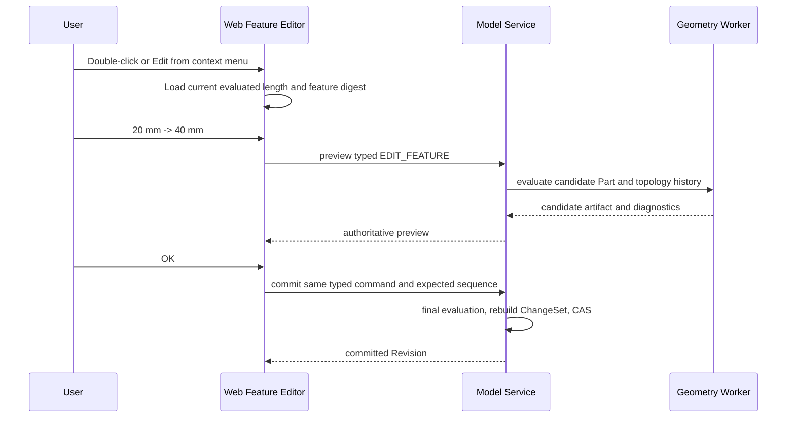
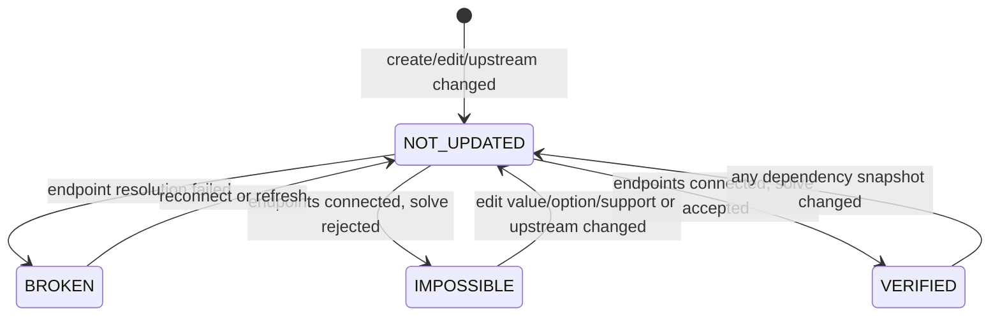
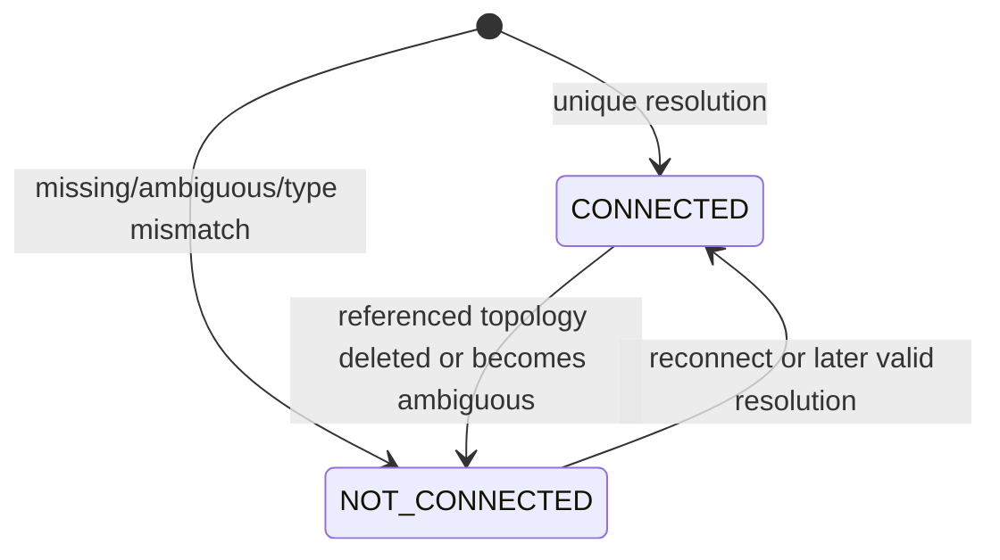

# Part 特征编辑、持久拓扑命名与装配约束状态开发计划

状态：实施中；P0–P1 已完成，P2–P6 待实施
日期：2026-09-12  
适用基线：当前未发布、允许重建开发数据的 occccad 仓库

## 1. 目标与结论

本计划交付一个完整闭环：用户可以从 Part 结构树右键或双击编辑已有拉伸特征；Part 重新求值时为面、边、点生成可跨 Revision 解析的持久选择证据；Product 中建立在这些元素上的装配约束可以在 Part 编辑后重新连接和求解；若引用元素确实消失，约束显示为 `BROKEN`，并允许用户重新绑定支持元素。

这不是一个前端表单功能。当前 Product 约束保存 `geometryKey + topologyId`，只能指向某个不可变几何制品中的局部编号。只增加“编辑 20 mm 为 40 mm”会产生新的 `geometryKey`，原约束随即无法解析。因此，特征编辑、拓扑历史、持久选择、跨文档更新和约束状态必须按依赖顺序推进。

本计划采用以下核心设计：

1. Part 模型中的 Feature/Parameter 仍是业务真相，B-Rep 与 topology manifest 是可重建制品。
2. `PersistentSelection` 保存稳定语义锚点与重算选择规则，不保存 OCCT 遍历序号作为长期身份。
3. Geometry Worker 在一次 Part 粗粒度求值内逐 Feature 生成 `TopologyHistory`；控制面不通过逐个 OCCT RPC 拼装历史。
4. OCCT 的 `Generated/Modified/IsDeleted` 是 lineage 的主要内核证据；Feature 语义输出是更稳定的第一层锚点；几何签名只用于验证与消歧。
5. 不把 OCAF/TNaming 文档直接作为新的权威参数模型。occcad 已有 PostgreSQL Revision、typed Domain Command、ChangeSet、ArtifactStore 与跨语言 Proto，重复引入一套 OCAF 文档生命周期会造成双重事务和身份来源。可以复用 OCCT 的形状历史和 naming 思路，并在未来把 OCAF/TNaming 作为内核适配器评估。
6. 支持元素的 `CONNECTED / NOT_CONNECTED` 与约束的 `NOT_UPDATED / BROKEN / IMPOSSIBLE / VERIFIED` 是两个正交状态域。
7. 上游 Part Head 变化不静默改写不可变 Product Revision。Product Workspace 先显示 `NOT_UPDATED`，执行一次可审计的 Update References Transaction 后，才固定新的 Part Revision、解析选择并重新求解。

## 2. 当前代码基线与缺口

### 2.1 已有能力

- `services/internal/workspace/service.go` 中的 `Feature` 已包含稳定 `ID`、`Profile`、`Length`、`Operation` 等基础字段；`PartModel` 保存有序 Feature 列表。
- `ensureFeatureParameters` 为拉伸长度建立稳定的 `parameter:<featureId>:length`，`validateAndResolvePartParameters` 再把求值后的 Quantity 写回 Feature 的 `Length`。当前 ChangeSet 实际操作的是 `parameter.source`，目标架构将它投影为 `pad.length` PropertySlot facade；尚无面向 Feature 的通用编辑命令。
- `CREATE_SKETCH`、`EDIT_SKETCH`、`CREATE_PAD`、`solid-generator/create` 等已经走 typed handler registry，并能生成 ChangeSet、Dependency impact 与 Undo/Redo。
- `EvaluatePart` 已通过正式 Router/Pool/Worker 路径传递整个 profile pad 序列，Geometry Worker 使用 OCCT prism/revolve 与 Fuse/Cut/Common 生成最终 B-Rep。
- Product 已支持 `InstancePath`、直接 Part occurrence、当前 M2.5 装配求解、约束创建/编辑预览和权威提交。
- 三维选择可取得 Face/Edge/Vertex 的 `geometryKey + topologyId`，服务端会从 OCCT 重新读取精确 Plane/Cylinder/Line/Point descriptor。
- 结构树已有稳定右键菜单和双击激活入口，Feature 行可在既有交互边界上增加 `EDIT` capability。

### 2.2 当前阻塞点

1. `Feature` 是扁平 optional-field 结构，更新拉伸的 typed command、完整候选定义和并发 precondition 尚不存在。
2. `EvaluatePartRequest.ProfilePadSpec` 没有 `feature_id`、`body_id` 或稳定的 Feature 输出槽；Worker 只返回最终 `EvaluatePartResponse`，没有逐 Feature 结果与 topology history。
3. `make_profile_tool` 和 `apply_body_operation` 丢弃了 prism、boolean、same-domain unify 的历史对象；最终 topology local ID 由当前 Shape 遍历产生。
4. `AssemblyGeometryRef` 将 `geometryKey + topologyId` 作为持久字段；Part 重算后 `assembly_solve.go` 要求 key 完全相同，否则返回 validation failure。
5. `AssemblyConstraint` 没有持久或派生的约束求值状态；结构树只显示名称和删除 capability。
6. 一条无法解析的约束会在装配几何解析阶段使整个求解失败，无法让同一 Product 中仍健康的 connected component 继续求解。
7. 当前 `FOLLOW_HEAD` 在解析时直接读取 Part Head。它适合早期演示，但没有把一次 Product 求解绑定到可重放的跨文档 Resolution Snapshot。

### 2.3 与现有目标架构的关系

本计划落实 `docs/TARGET_ARCHITECTURE.md` 的三段既有设计，而不是新建并行框架：

- 5.4 的 typed Feature、FeatureResult、TopologyHistory 和 F0/F1；
- 5.6 的 Publication、AssemblyGeometryRef、Resolution Snapshot 与 M3 输入冻结；
- 5.7 的 PersistentSelection resolver、lineage、几何签名和歧义诊断。

范围上先完成单 Body、直接 Part occurrence、Linear Extrude 的可靠基线。Revolve、面上草图、Fillet/Chamfer、嵌套 Product 和正式 Publication 在相同协议上继续扩展，不在首批实现中伪装完成。

## 3. CATIA 参照语义及本项目解释

本地 CATIA V5 文档 `cfyugasmut0311.htm` 明确给出约束编辑对话框中的四种 traffic-light 状态，并允许重命名约束、替换引用几何和修改选项。`cfyugasmrf0501.htm` 又单独说明每个 Supporting Element 有 connected/disconnected 状态以及 Reconnect 操作。因此本项目必须保留两层状态。

| 状态域 | occccad 枚举 | 定义 | 典型转换 |
|---|---|---|---|
| 支持元素 | `CONNECTED` | PersistentSelection 在当前 Resolution Snapshot 中唯一解析到期望类型，并已提取 descriptor | Part 长度 20 → 40 mm，原顶面唯一解析为新顶面 |
| 支持元素 | `NOT_CONNECTED` | 解析结果为 missing、ambiguous、type mismatch、source unavailable 或 contract mismatch | 被引用面被完整删除；一张面分裂成多张且选择意图不足 |
| 约束 | `NOT_UPDATED` | 定义仍存在，但当前依赖快照尚无被接受的解析与求解结果 | 上游 Part 出现新 Head；用户刚替换端点；刷新后等待重算；Worker 暂时失败 |
| 约束 | `BROKEN` | 针对当前依赖快照完成了解析尝试，至少一个支持元素 `NOT_CONNECTED` | 约束引用的 counterbore 轴或面已删除 |
| 约束 | `IMPOSSIBLE` | 所有支持元素均 connected，但当前约束 component 无法在容差和分支意图内得到可接受解 | 两个固定实例上的平面距离同时被要求为互相矛盾的值 |
| 约束 | `VERIFIED` | 所有支持元素 connected，硬约束残差满足容差，M2.5 preference 也达到当前提交策略的接受条件 | Part 编辑并更新引用后重新求解成功 |

内部诊断必须比 UI 四态更细。`NOT_CONNECTED` 至少保留 `MISSING / AMBIGUOUS / TYPE_MISMATCH / SOURCE_UNAVAILABLE / CONTRACT_MISMATCH`；`NOT_UPDATED` 至少保留 `DIRTY / PENDING / NUMERICAL_FAILURE / INFRASTRUCTURE_FAILURE / CANCELLED`。这样 UI 保持清楚，日志与 Reconnect 对话框仍能解释根因。

`IMPOSSIBLE` 只用于已 connected 的几何约束问题。数据库、网络、超时、取消或 Worker crash 不能被误报为 Impossible；这类情况维持 NotUpdated 并显示诊断。M2.5 当前没有最小冲突集，因此第一版可把失败 component 中的约束标为 `IMPOSSIBLE` 并附 `evidence_scope=COMPONENT`，不能声称某一条就是唯一矛盾根因；M5 冲突解释完成后再细化。

CATIA 的 `cfyugasmut0319.htm` 还说明：缺失 component 恢复后，Broken 约束不会自动变好，先执行 Refresh，状态变成 NotUpdated，再重新求值。这与 occccad 的不可变 Revision 很契合：外部环境变化只使 evaluation projection 过期；显式 Update/Refresh 形成新的解析和求值快照。

`cfyugasmut0311.htm` 的 Object in Work 例子说明，历史中仍存在但当前显示 tip 不含该几何时，不能仅凭“当前画面找不到”就判断永久删除。occcad 的 resolver 应沿 Feature history 解析到当前 Body Tip；若来源在历史中存在但未进入当前 tip，返回内部 `OUTSIDE_CURRENT_TIP`，在当前 Product 使用语义下投影为 NotConnected/Broken，同时保留可解释诊断和未来切换 Tip 后恢复的可能。

## 4. 领域契约设计

### 4.1 Feature 编辑命令

新增版本化 typed command：

```text
type_uri: occccad://part/feature/edit
schema_version: 1

EditFeaturePayload {
  feature_id
  expected_feature_digest
  oneof definition {
    LinearExtrudeEdit {
      LengthValue length
      BodyOperation operation
      bool reversed
      ProfileSelection profile
    }
  }
}
```

首个 UI 只开放 Linear Extrude 的长度编辑；协议从第一天使用完整 typed candidate definition，后续增加 operation、reversed 和 profile 时不需要另造命令。`expected_feature_digest` 用于把 stale edit 精确报告为 `FEATURE_EDIT_STALE`，最终提交仍以 Workspace sequence 做 CAS。

长度的唯一驱动源保持现有 Parameter：编辑器读取 `parameter:<featureId>:length` 当前求值，字面量编辑提交到该 Parameter source；Feature 的 `Length` 仍是求值投影。首批 handler 复用 `parameter.source` ChangeSet，并补齐 `pad.length` facade 的 descriptor/current-value/compensation/canonicalization/dependency 映射与 `feature:<id>` impact seed。不得让对话框直接修改 JSON 中 `Feature.Length`，否则表达式与 Feature 会成为两个冲突来源。

编辑流程：



编辑器必须使用当前已求值值作为初值，支持单位输入、Enter/OK 提交、Esc/Cancel 放弃。预览不产生 Revision；一次确认只产生一个 Transaction。右键 Edit 与双击调用同一 editor/controller，不各自实现一套提交逻辑。

### 4.2 Feature、Body 与 Worker 输入的最小演进

当前未发布阶段直接统一模型，不维护两套长期结构。首批不必一次实现目标架构全部 Feature 类型，但必须补齐命名所需身份：

```text
FeatureEvaluationInput {
  feature_id
  body_id
  input_feature_id / input geometry ref
  typed definition
}

FeatureResult {
  feature_id
  result_geometry_id
  semantic_outputs[]
  topology_history
  diagnostics[]
}
```

单 Body 可以暂时使用固定稳定 `body-main`，并把当前有序 Feature 链显式转换为前一实体 Feature → 后一实体 Feature 的输入关系。这个 adapter 是迁往目标 `Body.tip_feature_id + FeatureNode` 的兼容切片，不能继续依赖“循环中最后一次赋给 result 的 Shape”作为领域关系。

`ProfilePadSpec` 必须携带 `feature_id`、`body_id`、profile region/curve 的稳定 ID。Worker 返回最终 Part 结果之外，还返回每个实体 Feature 的 `FeatureResult` 或一个由 digest 引用的 `PartEvaluationManifest`。大拓扑数据放 ArtifactStore，Proto 返回摘要与 artifact reference。

### 4.3 PersistentSelection

持久选择是一条可重放的选择意图，不是一个看似稳定的整数：

```text
PersistentSelection {
  schema_version
  source_document_id
  source_body_id
  anchor: SemanticTopologyRef
  expected_type: FACE | EDGE | VERTEX
  selector: SelectionRecipe
  creation_evidence: SelectionEvidence
}

SemanticTopologyRef {
  feature_id
  output_slot
  source_ids[]
}

SelectionRecipe =
    DIRECT_SEMANTIC_OUTPUT
  | LINEAGE_DESCENDANT
  | INTERSECTION_OF
  | ADJACENT_TO
  | OWNED_BY_REGION_BOUNDARY
```

首个 Linear Extrude 至少输出：

- `START_CAP/<regionId>`；
- `END_CAP/<regionId>`；
- `SIDE_FROM_PROFILE_EDGE/<sketchEntityId>`；
- hole loop 使用同一 side slot，但保留 `regionId + loopId + sketchEntityId` 来源；
- Boolean 之后的当前结果面通过 lineage 指向上述 tool 输出或上游 Body 面。

从视口创建约束时，浏览器仍可上传当前 `geometryKey + localId` 作为 pick evidence，服务端必须把它绑定成 PersistentSelection 后再提交 Product command。保存后的权威引用只包含 PersistentSelection；当前 local ID 仅出现在 resolution result/cache 中。

几何签名建议包含 surface/curve type、measure、centroid、局部 frame、parameter bounds、邻接来源集合与方向。签名用于确认候选和解释歧义，不能成为 `nearest face wins`。长度改变会改变面积和质心，因此这些值必须有容差与角色权重，也不能进入稳定 anchor identity。

### 4.4 TopologyHistory

每次 Feature 求值产生：

```text
TopologyHistory {
  feature_id
  input_geometry_id
  result_geometry_id
  lineage[]       // GENERATED, MODIFIED, SPLIT, MERGED, UNCHANGED
  tombstones[]    // DELETED with reason/evidence
  ambiguities[]
  evidence_digest
  policy_digest
}
```

Linear Extrude 的证据链分三段：

1. Profile → Tool：使用 profile region/curve 稳定 ID、`FirstShape/LastShape` 和 prism `Generated` 建立 cap/side 语义输出。
2. Input Body + Tool → Boolean Result：从 Fuse/Cut/Common 读取 `Modified/Generated/IsDeleted`，同时保留未修改且仍在结果中的输入 subshape lineage。
3. Boolean Result → Canonical Result：当前 `ShapeUpgrade_UnifySameDomain` 会合并同域面，必须读取其 `Modified/IsDeleted` 历史并合并进同一个 `BRepTools_History`；否则 naming 会在最终规范化这一步断链。

OCCT 官方资料明确指出，topological naming 依赖“算法历史、把历史登记到数据框架、选择重算”三个同步部分；只给最终 Shape 做几何匹配不够。`BRepTools_History` 能表达 generated、modified、removed 关系，`BRepPrimAPI_MakePrism` 提供 `FirstShape` 与 `Generated`。本项目应在 `kernel/occt` 内把这些 OCCT 类型转成项目自有值类型，不能把 `TopoDS_Shape`、TDF label 或指针泄漏到 Proto。

每个 lineage result 在当前 FeatureResult 中仍有 revision-local topology element ID，用于 mesh、GetTopology 和高亮。跨 Revision 的解析只能通过 PersistentSelection + history 完成。

### 4.5 Resolver

Resolver 输入必须固定：

```text
ResolveSelectionRequest {
  persistent_selection
  source_part_revision_id
  target_part_revision_id
  target_part_evaluation_manifest_digest
  resolver_policy_digest
}
```

算法顺序：

1. 验证 document/body/feature/output slot 与 expected type；
2. 从选择创建 Revision 的语义锚点开始，沿每个 FeatureResult 的 lineage 走到目标 Body Tip；
3. 应用 SelectionRecipe 和期望 cardinality；
4. 用创建证据、邻接与几何签名验证候选；
5. 只有唯一且证据满足 policy 的候选才返回 `RESOLVED`；
6. 无候选返回 `MISSING`，多个有效候选返回 `AMBIGUOUS`，类型变化返回 `TYPE_MISMATCH`；
7. 返回 current `geometryKey + localId + descriptor + evidence digest`，供显示和 Assembly Solver 使用。

禁止以 local ID 相同、数组位置相同、面积最接近或质心最近直接认定同一面。对 split 的一对多结果，如果约束端点要求单 Face 且 recipe 无法唯一选择，必须 NotConnected/Broken 并要求 Reconnect。

### 4.6 制品与存储

当前开发期可以直接修改未发布 migration 并清空 `occccad` schema。建议保持三层：

- Product/Part Revision JSON：Feature 定义、PersistentSelection、固定的 referenced Revision；
- `document_versions.evaluation_manifest`：本 Revision 的 FeatureResult 摘要、依赖 snapshot、policy/evaluator digest；
- ArtifactStore：不可变 B-Rep、GLB、topology manifest、详细 TopologyHistory。

`geometry_artifacts` 可以增加 topology manifest/history 的 artifact key 和 digest，或把它们统一放入新的 evaluation artifact manifest；不应把大量 lineage 行拆成业务数据库中的第二份 Feature 图。为支持按引用反查和状态投影，可以增加小型可重建索引，但索引丢失后必须能从 Revision + artifacts 重建。

缓存键必须包含 Feature schema、稳定输入、resolved parameter、OCCT/evaluator build、tolerance、boolean/unify policy 与 topology policy digest。即使 B-Rep 几何等价，只要命名策略改变，也不能复用旧 topology resolution 结果。

## 5. Product 引用更新与状态机

### 5.1 Product 引用

将 `AssemblyGeometryRef` 演进为：

```text
AssemblyGeometryRef {
  occurrence: RelativeInstancePath
  target: PersistentSelection | PublicationRef
  expected_kind
  creation_evidence
}
```

首批可只支持 direct Part occurrence，但字段按 RelativeInstancePath 设计。Publication 暂不要求用户手工创建；未来装配接口应优先走 Publication，任意 face deep link 继续使用 PersistentSelection。

Product 的一次权威求值生成不可变 `ResolutionSnapshot`：

```text
ResolutionSnapshot {
  product_revision_id
  occurrences[] { instance_path, resolved_part_revision_id, geometry_id }
  resolved_endpoints[] { constraint_id, endpoint, result, evidence_digest }
  topology_policy_digest
  solver_build/profile/branch
}
```

这会成为 M2.5 后续 M3 可重放 SolveManifest 的输入，而不是另建一次性状态。

### 5.2 更新策略

当前 `FOLLOW_HEAD` 应在此次未发布重构中改成明确语义：

- `PINNED`：一直使用指定 Part Revision；上游 Head 变化不影响该 Product。
- `FOLLOW_WORKSPACE_WITH_ACCEPT`：发现 Part Head 变化时设置 `headChanged=true` 并令相关约束 `NOT_UPDATED`；用户或明确的自动更新策略执行 `UPDATE_REFERENCES` 后，才把新 Revision 固定到新的 Product Revision。

`UPDATE_REFERENCES` 是一个 typed Domain Command：解析所有待更新 instance，批量 resolve PersistentSelection，按 connected component 求解 Assembly，再用一个 Product Transaction 提交新的 `ResolvedVersionID`、Pose 与 evaluation manifest。失败的 topology 引用不会阻止 Product Revision 表达 Broken 状态；基础设施失败则不提交伪造的新结果。

如果产品策略以后需要自动更新，后台也必须提交同一种 command，并遵守 expected Product Workspace sequence、权限和幂等键。

### 5.3 两层状态机



每个 endpoint 独立产生：



约束状态是 evaluation result，不是用户可直接写的定义字段。为了刷新后稳定显示，状态摘要随 Product evaluation manifest 保存；其 provenance 至少包括 Product Revision、全部 resolved Part Revision、topology evidence digest、solver build/profile 和 evaluated_at。打开文档时若当前 dependency snapshot 与摘要不一致，立即投影为 NotUpdated，不能继续显示旧 Verified。

### 5.4 Broken 隔离和求解

装配求值先解析全部 endpoint，再构建 solver 输入：

1. endpoint 失败的约束标为 Broken，不发送到 M2.5 solver；
2. 其余约束按现有 component 图求解，Broken 不能让无关 component 失去状态；
3. connected component 求解成功则其中约束 Verified；
4. 求解确认不可接受则该 component 为 Impossible，并保留 residual、constraint IDs 与证据范围；
5. preference 未达到提交接受条件时保持 NotUpdated，诊断继续使用现有独立 preference status，不能误报几何 Impossible。

如果移除 Broken 约束使实例释放自由度，这是正确结果；Product 必须显示自由度变化和 Broken 约束，不能沿用旧 Pose 冒充当前完全约束。上一成功 Pose 可以作为明确标识的 stale ghost 或 warm start，不能作为新权威解。

### 5.5 创建、编辑和 Reconnect UI

- 创建约束：每次选择后显示 endpoint Connected；完整选择后先显示 NotUpdated，权威 preview 返回 Verified/Impossible。新建命令要求端点在创建 snapshot 中 connected。
- 双击约束或右键 Edit：显示 type、value/options、两个 Supporting Elements、每个 endpoint 的连接状态、约束 traffic-light 状态和诊断。
- Reconnect：用户选中一个 NotConnected endpoint，再从同一 occurrence 或允许的 occurrence 选择新几何；服务端把 pick 绑定为新的 PersistentSelection，并执行现有 `EDIT_ASSEMBLY_CONSTRAINT` 的完整 preview/commit。
- 结构树：约束节点显示状态 glyph/颜色和可访问文本；Broken/Impossible 不只靠颜色区分。右键提供 Edit、Reconnect（存在 NotConnected endpoint 时）、Refresh/Update、Delete。
- 视口：Connected endpoint 可以定位并高亮；NotConnected 不尝试用旧 local ID 高亮，可定位 occurrence 并显示缺失引用诊断。

## 6. 关键场景的预期行为

### 6.1 拉伸长度 20 mm → 40 mm

- `END_CAP/<regionId>` 沿同一 semantic anchor 解析到移动后的顶面；endpoint Connected。
- 与 profile edge 对应的 side face 保持 `SIDE_FROM_PROFILE_EDGE/<entityId>`；面积变化不影响身份。
- Product 在发现 Part 新 Head 后显示 NotUpdated；Update References 后重新求解为 Verified 或 Impossible，取决于其他约束能否允许新的几何位置。
- “仍识别为同一面”不等于保持旧世界坐标。若约束驱动装配，M2.5 可以移动允许移动的 occurrence 以重新满足约束。

### 6.2 后续挖孔未删除被引用外表面

- Cut 对原顶面通常产生 Modified face（带内环），lineage 保留原顶面 → 带孔顶面。
- 引用保持 Connected；Product Update 后约束继续求解。
- 新生成的圆柱孔面获得当前 Cut Feature 的稳定语义来源，可用于之后新建约束。

### 6.3 挖孔或切除真正移除被引用面

- boolean/unify history 对源面产生 tombstone，resolver 无候选，endpoint `NOT_CONNECTED(MISSING)`。
- 约束为 Broken；其他 connected constraints 继续求解。
- 用户 Reconnect 到另一张面后先 NotUpdated，preview/commit 成功后转 Verified 或 Impossible。

### 6.4 一张面被分裂成多张

- TopologyHistory 保存一对多 SPLIT。
- 若原 selection recipe 能利用语义来源/邻接唯一选出一张，则 Connected；否则 `NOT_CONNECTED(AMBIGUOUS)` 并 Broken。
- 系统不得按 local ID、面积最大或最近质心静默选择。

### 6.5 Undo/Redo

- Part 特征编辑 Undo 恢复 Parameter source、Feature 求值和 topology manifest；Redo 再次生成语义等价 lineage。
- Product 不被上游 Undo 静默重写；FOLLOW_WORKSPACE_WITH_ACCEPT 的 Product 显示 NotUpdated，Update 后固定相应 Part Revision。
- 连续两步 Undo、两步 Redo、刷新重载后，Feature 长度、结构树 capability、PersistentSelection 和 constraint status 必须一致。

## 7. 按一次 Codex gpt-5.6-sol medium 对话拆分的开发批次

每个批次限定为一次可审查的纵向交付：先读邻近实现，完成代码、必要测试和事实文档更新；不把尚未接通的 UI 或孤立 Proto 当成完成。前一批次的验收门通过后再进入下一批次。

### 批次 P0：契约冻结与回归夹具

实施状态：已于 2026-09-12 完成。已冻结 C++/Proto/Go 值契约和 naming policy/evaluator 版本，稳定 identity 已贯通正式 Go Client、Pool、Router 与 C++ Worker；OCCT 回归夹具覆盖拉伸长度变化、Cut 保留面、Cut 删除面和 Split 歧义，Product 回归测试锁定旧 `geometryKey + topologyId` 不能跨 Revision。此状态不包含 lineage 提取、resolver 或 Product 状态投影，它们仍按 P2–P4 实施。

目标：把当前临时身份和预期行为变成可执行基线。

工作：

- 为 20 → 40 mm、Cut 保留面、Cut 删除面、Split 歧义建立 kernel/Part/Product fixtures；
- 定义 `PersistentSelection`、`TopologyHistory`、resolution result、两层 status 的项目值类型与 Proto 草案；
- 给 `ProfilePadSpec` 加稳定 feature/body/source IDs，并贯通 Worker、Pool、Router capability；
- 记录现有 geometryKey/topologyId 约束在 Part 重算后的失败测试，作为后续修复目标；
- 确定 topology policy/evaluator version 与 artifact manifest 字段。

验收：当前链路仍构建；新增 contract 可跨 C++/Proto/Go round-trip；测试明确暴露旧 local ID 无法跨 Revision 的问题。

### 批次 P1：Linear Extrude 基础编辑闭环

实施状态：已于 2026-09-12 完成。`occccad://part/feature/edit` 以完整 Linear Extrude 候选定义和 Feature definition digest 进入 typed handler；长度只写既有 Parameter source，并通过 `pad.length` facade 参与最终 ChangeSet、依赖传播与补偿式 Undo/Redo。结构树 Edit capability、右键/双击共用编辑器、权威 preview、Enter/OK、Esc/Cancel、loading/error 已贯通。此状态不包含 topology history 或跨 Revision PersistentSelection，它们仍按 P2–P4 实施。

目标：用户能可靠地把已有拉伸 20 mm 改为 40 mm。

工作：

- 新增 `occccad://part/feature/edit` typed handler 与 expected feature digest；
- 只通过现有 Parameter source 更新 length，并接通 `pad.length` ChangeSet、current value、compensation、canonical digest、dependency seed；
- 增加 command preview，保证最终 evaluator 规范化后重建 ChangeSet；
- 结构树 Feature 增加 `EDIT` capability；右键 Edit、双击共用 Feature editor；
- preview/commit、Enter/Esc、错误和 loading 状态接入现有 workbench 边界。

验收：20 → 40 mm、preview 不写 Revision、一次 OK 一个 Revision、刷新保持 40 mm、连续 Undo/Redo、stale edit、表达式驱动字段保护、`invoke web.build` 和浏览器手工验收通过。

### 批次 P2：Extrude 与 Boolean 的 TopologyHistory

目标：Worker 对每个实体 Feature 输出完整可验证 lineage。

工作：

- 重构 `make_profile_tool`/`apply_body_operation`，保留 prism、boolean、unifier 对象直到 history 提取完成；
- 用 profile entity/region IDs 生成 cap 与 side 语义输出；
- 合并 Generated/Modified/Deleted/unchanged 与 same-domain unify 历史；
- 输出逐 FeatureResult 与 topology history artifact；
- 为每个 result topology element 生成 signature/adjacency evidence；
- 加 Shape gate：history 中所有 result ref 必须在最终 Shape 可解析，tombstone 不得同时指向活元素。

验收：长度变化保持 cap/side lineage；ADD/REMOVE 保留、修改和删除路径正确；序列化重读一致；BRepCheck、单 solid、体积不变量和 OCCT 7.9.1 conformance 通过。

### 批次 P3：PersistentSelection 创建与 Resolver

目标：视口 pick 可以转换成跨 Revision 可重放的业务引用。

工作：

- 实现服务端 bind：`geometryKey + localId` → PersistentSelection + creation evidence；
- 实现从 source Revision 到 target Revision/tip 的 resolver；
- 保存 topology manifest/history artifact digest，并做可重建索引；
- 返回 RESOLVED/MISSING/AMBIGUOUS/TYPE_MISMATCH/OUTSIDE_CURRENT_TIP；
- `GetTopologyElementProperties` 增加基于 resolved selection 的入口，同时保留 local ID 入口仅供当前制品显示；
- 缓存键纳入 target revision、history/evidence/policy digest。

验收：20 → 40、Cut 保留、Cut 删除、Split 歧义、空缓存冷重建、Worker 重启、确定性重复求值均有测试；任何歧义都不自动挑选。

### 批次 P4：Product 引用升级与两层状态

目标：Product 使用 PersistentSelection，并能表达 NotUpdated/Broken/Impossible/Verified。

工作：

- 替换持久 `AssemblyGeometryRef.geometryKey/topologyId` 为 occurrence + PersistentSelection；
- 创建约束时在服务端 bind 当前 pick；
- 增加 ResolutionSnapshot、endpoint resolution 与 constraint evaluation summary；
- 把 `FOLLOW_HEAD` 统一为 `FOLLOW_WORKSPACE_WITH_ACCEPT`，实现 typed `UPDATE_REFERENCES`；
- 解析失败约束隔离为 Broken；connected component 继续走 M2.5；
- 贯通 API、Web model、structure tree status 和刷新重载。

验收：从正式 Router 路径创建基于 Part 面的约束；Part 编辑后 Product 先 NotUpdated，Update 后引用仍 Connected 并 Verified/Impossible；删除面后 Broken；无关 component 仍可求解；状态 provenance 可重放。

### 批次 P5：约束编辑与 Reconnect UX

目标：四态和 Supporting Element 两态在实际创建/编辑对话框中可用。

工作：

- 双击/右键打开统一 Assembly Constraint editor；
- 显示 type、value/options、traffic-light status、两个 endpoint 的连接状态与详细诊断；
- Reconnect 复用 Selection/Tool/Preview 生命周期，提交一次 `EDIT_ASSEMBLY_CONSTRAINT`；
- Refresh/Update 接入 `UPDATE_REFERENCES`；
- Broken/Impossible glyph、结构树图标、可访问文本与 viewport 定位。

验收：真实 pointer/selection 序列、cancel/lost capture/Esc、Reconnect preview/commit、刷新后状态、浏览器重启后的视觉和交互手工验收通过。

### 批次 P6：Cut/Hole 代表场景与完整端到端验收

目标：用用户要求的“挖孔后仍引用或 Broken”证明架构，而不是只验证纯长度变化。

工作：

- 先用现有 `REMOVE` Linear Extrude 表达通孔/挖孔，不额外引入 Hole Feature DSL；
- 建立 Part A 外表面约束、Part A 增加 Remove Feature、Product Update 的完整场景；
- 分别覆盖 modified face、deleted face、ambiguous split；
- 覆盖 Part Undo/Redo 后 Product Update、Product Reconnect 后再次 Part edit；
- 清空开发数据，从空库迁移并重跑场景；同步 CURRENT/TARGET、Worker/Service/Web README。

验收：C++ corpus、Go workspace/control integration、Proto Router、Web deterministic tests、production build、Playwright/浏览器人工验收全部通过；输出可保存的 resolution/solver replay 证据。

### 后续批次，不纳入本轮基础闭环

- P7：Publication UI 与 contract；装配约束优先引用 Publication，支持替换零件自动重连。
- P8：Revolve、面上草图、Fillet/Chamfer/Shell 的 semantic outputs 与 history。
- P9：嵌套 Product、relative InstancePath、configuration 与正式 M3 SolveManifest。
- P10：M5 最小冲突集，把 component-scope Impossible 细化到有证据的冲突约束集。

## 8. 验证矩阵

| 层级 | 必须验证 |
|---|---|
| Go command/history | typed edit、expected digest、Parameter/PropertySlot、最终 ChangeSet、两次 Undo/Redo、新提交截断 Redo、冷重建 |
| C++ kernel | prism cap/side、boolean Modified/Deleted、unify merge、split/merge、BRepCheck、volume/solid policy、history serialization |
| Proto/Router | 每个新增 RPC/字段贯通 Worker、生成代码、client、Pool、Router 和 capability；只直连 Worker 不算通过 |
| Persistent resolver | unique/missing/ambiguous/type mismatch/outside tip、policy digest、缓存丢失、相同输入确定性 |
| Product | NotUpdated → Verified、NotUpdated → Broken、NotUpdated → Impossible、Reconnect、Broken component 隔离、M2.5 preference 独立诊断 |
| Web | 右键和双击同一编辑器、当前值 20、preview 40、一次提交、status/glyph/accessibility、刷新恢复 |
| 跨文档 E2E | Part 编辑/Undo/Redo → Product Update；Remove 保留面/删除面；正式浏览器代理与 Router 通信 |
| 数据库 | 停止进程后 `invoke data.reset --yes`，空库完整迁移、重复迁移校验、artifact manifest 可重建 |

建议建立一个专用但不与产品格式耦合的 topology corpus。每个 case 保存 Feature 输入、源 PersistentSelection、目标 Revision、期望 resolution cardinality/status、几何不变量和允许容差；golden 比较语义 lineage 与结果，不比较 OCCT local ID 或 B-Rep 字节位置。

## 9. 完成标准

基础闭环只有同时满足以下条件才算完成：

1. Part 结构树右键和双击可以编辑同一个 Linear Extrude，20 → 40 mm 形成一次可 Undo 的权威 Revision。
2. Part 每个相关 Feature 产生可持久化、可重放、带 policy/evaluator provenance 的 TopologyHistory。
3. Product 新建的面约束不再把 geometryKey/local topology ID 当持久业务身份。
4. Part 更新后 Product 明确显示 NotUpdated；Update 后同一语义面 Connected，约束得到 Verified 或 Impossible。
5. 被引用面确实删除或解析歧义时 endpoint NotConnected、约束 Broken，并能通过 Reconnect 修复。
6. Broken 约束不阻止无关装配 component 求解；旧几何和旧 Pose 不冒充当前成功结果。
7. Undo/Redo、刷新重载、Worker 重启、清缓存/空库重建和正式 Router/浏览器路径均通过。
8. `docs/CURRENT_ARCHITECTURE.md` 只记录真正落地的部分；后续能力继续保留在目标架构和本计划中。

## 10. 风险与控制

- **OCCT history 不完整或算法差异**：每个使用的算法单独做 conformance；发现 history 缺口时用 Feature 语义来源补强并显式标注 evidence，不用几何最近匹配掩盖。
- **same-domain unify 断链**：unifier history 是强制门；若 7.9.1 对某 case 无法给出可靠映射，该 case 必须产生 ambiguity/diagnostic，或在受控 policy 下延后 unify，不能静默换面。
- **模型重构过大**：先用固定 `body-main` 和现有有序链建立 FeatureResult；接口对齐目标 Body/Feature DAG，但每批只迁移当前 Linear Extrude 所需字段。
- **状态成为第二业务真相**：status 只从 constraint definition + ResolutionSnapshot + solver evidence 派生，摘要带 digest；依赖不一致立即 NotUpdated。
- **Impossible 归因过度**：M2.5 阶段标记 component evidence scope；没有 MUS/IIS 前不把单条约束宣传为根因。
- **跨文档自动漂移**：使用 FOLLOW_WORKSPACE_WITH_ACCEPT 和显式 Update References Transaction；后台自动策略也提交同一命令。
- **开发数据迁移包袱**：当前尚未发布，直接统一 schema/Proto/JSON 并重建 `occccad` 开发数据，不增加 legacy adapter、双写或第二套引用状态机。

## 11. 参考资料

仓库内：

- [`README.md`](../README.md)
- [`docs/CURRENT_ARCHITECTURE.md`](../docs/CURRENT_ARCHITECTURE.md)
- [`docs/TARGET_ARCHITECTURE.md`](../docs/TARGET_ARCHITECTURE.md)，重点为 5.4、5.6、5.7
- [`kernel/api/include/occccad/kernel/topology.hpp`](../kernel/api/include/occccad/kernel/topology.hpp)
- [`kernel/occt/src/occt_kernel.cpp`](../kernel/occt/src/occt_kernel.cpp)
- [`proto/occccad/worker/v1/geometry_worker.proto`](../proto/occccad/worker/v1/geometry_worker.proto)
- [`services/internal/workspace/model_core.go`](../services/internal/workspace/model_core.go)
- [`services/internal/workspace/assembly_solve.go`](../services/internal/workspace/assembly_solve.go)
- [`web/apps/cad/src/features/workbench/specification-tree.tsx`](../web/apps/cad/src/features/workbench/specification-tree.tsx)

本地 CATIA V5 B33 文档：

- `/mnt/s/tools/DS/Catia/B33doc/English/online/cfyugasm_C2/cfyugasmut0311.htm`：Editing Constraints、四种 traffic-light 状态、Object in Work。
- `/mnt/s/tools/DS/Catia/B33doc/English/online/cfyugasm_C2/cfyugasmrf0501.htm`：Constraint 属性、Supporting Elements 的 connected/disconnected 与 Reconnect。
- `/mnt/s/tools/DS/Catia/B33doc/English/online/cfyugasm_C2/cfyugasmut0319.htm`：Refreshing Constraints，Broken → NotUpdated 的显式刷新语义。
- `/mnt/s/tools/DS/Catia/B33doc/English/online/cfyugasm_C2/cfyugasmrf0101.htm`：孔类型变化删除支撑轴后约束 disconnected。
- `/mnt/s/tools/DS/Catia/B33doc/English/online/asmug_C2/asmugat0102.htm`：Reconnecting Constraints。
- `/mnt/s/tools/DS/Catia/B33doc/English/online/CAAScdAsmUseCases/CAAAsmCstOnPublish.htm`：约束基于 Publication，替换 component 后自动重连。
- `/mnt/s/tools/DS/Catia/B33doc/English/online/CATIA_P3_default.htm`：CATIA 文档总入口。

OCCT 官方资料：

- [OCAF User Guide: Topological naming](https://dev.opencascade.org/doc/occt-7.2.0/overview/html/occt_user_guides__ocaf.html)
- [BRepTools_History](https://dev.opencascade.org/doc/refman/html/class_b_rep_tools___history.html)
- [BRepPrimAPI_MakePrism](https://dev.opencascade.org/doc/refman/html/class_b_rep_prim_a_p_i___make_prism.html)
- [BRepAlgoAPI_BuilderAlgo](https://dev.opencascade.org/doc/refman/html/class_b_rep_algo_a_p_i___builder_algo.html)
- [ShapeUpgrade_UnifySameDomain](https://dev.opencascade.org/doc/refman/html/class_shape_upgrade___unify_same_domain.html)
- [TNaming package](https://dev.opencascade.org/doc/refman/html/package_tnaming.html)
- [TNaming_Tool](https://dev.opencascade.org/doc/refman/html/class_t_naming___tool.html)

这些资料用于理解产品语义和内核能力，不表示复制 CATIA UI、私有格式或内部实现。最终契约仍以 occccad 的开放 typed model、Revision 和测试为准。
