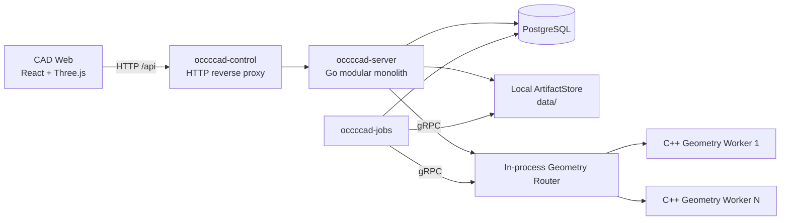
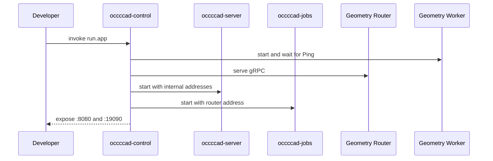
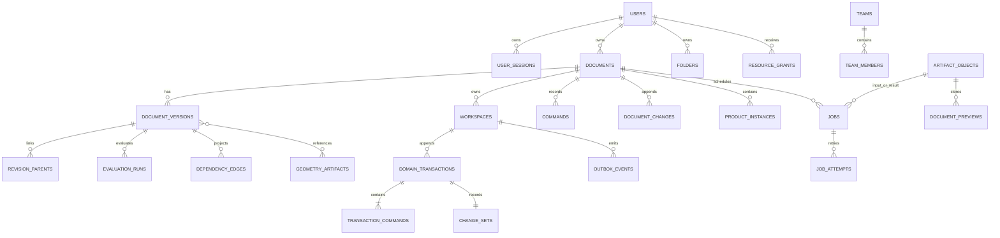
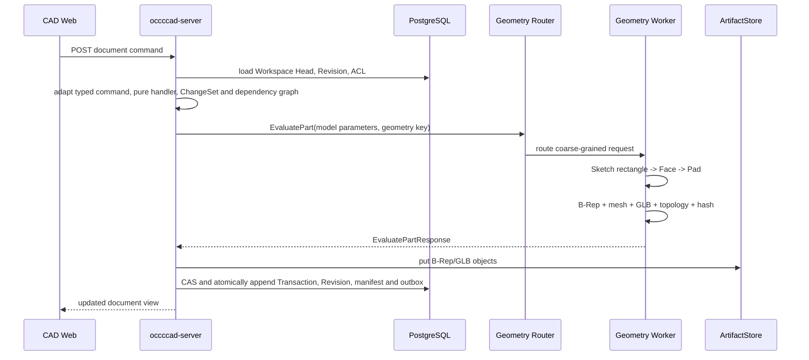
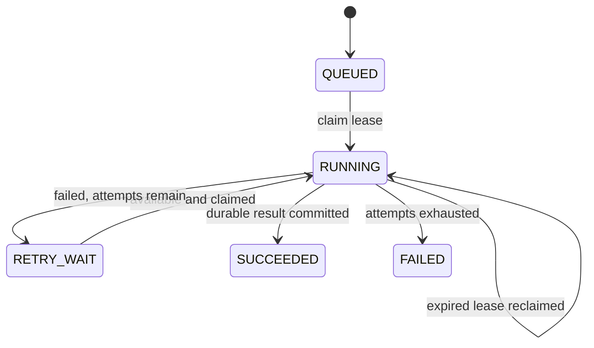
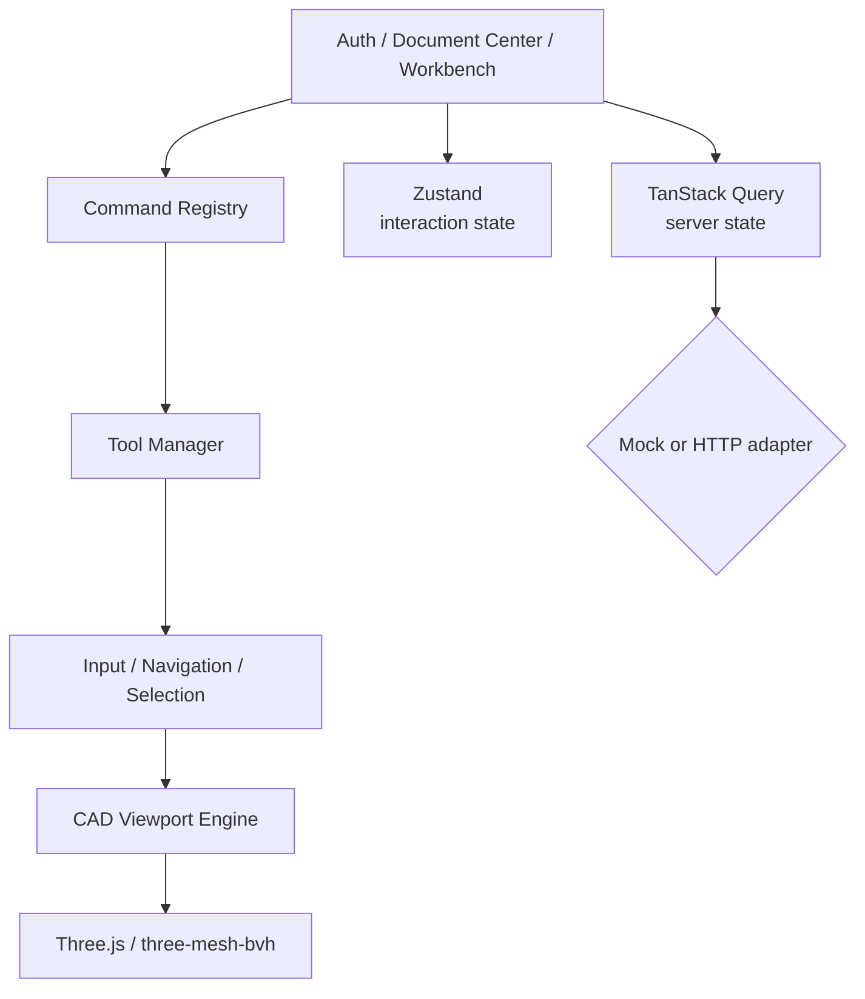

# occccad 现有架构

> 状态日期：2026-08-13
> 文档性质：事实基线。本文只描述当前仓库能够由源码、构建文件、数据库迁移和配置证明的行为；目标能力见[目标架构](TARGET_ARCHITECTURE.md)。

## 1. 结论

当前 occccad 是一个“模块化业务单体 + 持久任务进程 + C++ 几何计算 Worker + 独立 Web 应用”的早期分布式垂直切片。HTTP 业务、数据库、后台任务与几何计算已经跨进程，但调度仅限本机，制品仅限共享本地目录，因此还不是真正的跨主机云平台。

`occccad-control` 是可选的本地聚合入口。单独运行时，Web、API、Jobs 和 Geometry Worker 也可分别启动。

## 2. 仓库与进程边界

| 路径/进程 | 技术 | 真实边界 |
|---|---|---|
| `web/apps/cad` | React/TypeScript/Three.js | 独立浏览器应用，可使用 Mock 或真实 HTTP API |
| `occccad-server` | Go/net/http | 身份、文档、ACL、版本、任务提交和几何编排 |
| `occccad-jobs` | Go | PostgreSQL 任务消费者，无监听端口 |
| `occccad-migrate` | Go | 一次性数据库迁移任务 |
| `occccad-control` | Go HTTP/gRPC | 本地子进程管理、反向代理、Geometry Router、调试切流 |
| `workers/geometry` | C++/gRPC/OCCT | 精确几何、STEP、拓扑与显示制品计算 |
| `kernel/api` | C++ library | 不暴露 OCCT 类型的内核公共值类型和操作 |
| `kernel/occt` | C++ library | OCCT 适配实现，只链接进 Geometry Worker |
| `services/internal/*` | Go packages | 上述 Go 进程共享的内部模块，不是网络服务 |

每个可运行单元的启动、配置和故障语义见其目录 README。本文聚焦它们组成的系统。

## 3. 当前启动拓扑

### 3.1 统一本地模式

`invoke run.app` 构建后启动 `occccad-control`。控制进程：

1. 在 `127.0.0.1:18080` 启动 API；
2. 启动一个 Jobs 进程；
3. 在 `127.0.0.1:51001` 提供 Geometry gRPC Router；
4. 从 `127.0.0.1:51100` 起启动至少一个 C++ Worker；
5. 在 `0.0.0.0:8080` 提供稳定 HTTP 代理入口；
6. 在 `127.0.0.1:19090` 提供无认证的本机 Control API。

`invoke run.app --reset-data` 在启动控制进程前运行受保护的开发重置：删除配置数据库中固定的 `occcad` schema，清空 `OCCCCAD_DATA_DIR` 对应的本地 ArtifactStore，再从嵌入迁移重建 schema。该命令只面向当前未发布开发数据；Router、Worker resident geometry 和其他进程内状态由新进程自然重建。

### 3.2 独立模式

- `invoke run.worker`：单独启动 Geometry Worker；
- `invoke run.server`：单独启动 API；
- `invoke run.jobs`：单独启动任务消费者；
- `invoke run.web`：Mock 前端；
- `invoke run.web --mode=api`：前端代理真实 API。

当前没有容器编排清单、服务发现、跨主机 Worker 注册、分布式租户配额或生产网关。

## 4. 业务与数据模型

PostgreSQL schema 名为 `occccad`，当前迁移建立的主要关系如下。

### 4.1 Document 与 Version

- Document 类型当前为 Part 或 Product；
- Document 是容器；显式 Workspace 保存可变 Head/sequence/base，`document_versions` 是不可变 Revision 快照；
- 每个新建或复制的 Document 自动建立 `main` Workspace，旧 Document 由迁移确定性回填；可以从任意所属 Revision 创建并列出 Branch Workspace；
- Domain Transaction、typed command envelope、语义 ChangeSet、Revision parent、EvaluationRun、dependency edge 与 outbox 在 Head CAS 的同一短事务中追加；
- Restore 创建新的状态，而不是覆写历史；
- Product 保存对子文档的引用和实例 Transform，不展开复制完整子树；
- 实例可以跟随被引用文档 Head，也可以固定到 Version。

### 4.2 Command 与 Undo/Redo

HTTP transport DTO 在 API 边界转换为 `type_uri + schema_version + typed payload`，再由进程内 handler registry 执行；持久历史只保存 Domain Command，不存在第二套旧命令语义。Handler 的模型变换无数据库、网络、系统时间和 OCCT I/O；Product 外部引用先冻结，Part 几何在数据库事务外求值，提交阶段以 `(workspace head revision, head sequence)` 做 CAS。重复 request ID 只有 payload digest 相同才返回原结果。

Part 支持草图、拉伸、STEP 基础实体与参数 literal/expression 更新；Product 支持插入、移动和引用策略。Undo/Redo 以根 Domain Transaction 为稳定 identity：Revert 指向根 intent，Reapply 指向根 intent 并消费一个具体 Revert。服务端按 actor 折叠有序 action log 计算 capability，因此连续 Undo 两步可按逆序 Redo 两步；新 Domain/Restore 形成 redo boundary，但不删除历史。API 返回的 `canUndo/canRedo` 来自同一状态折叠，Web 按它置灰。删除上游实体前会检查当前结构依赖，字段 digest 或依赖冲突不会覆盖后续编辑。

### 4.3 参数、依赖与增量求值

- Rectangle width/height 与 Pad length 会确定性派生稳定 ParameterId 和 PropertySlot facade；
- Quantity 以 SI canonical value 和显式 Dimension 保存，当前注册 `mm/cm/m` 与 `deg/rad`，拒绝非有限值和量纲错误；
- 当前安全表达式 profile 支持数量字面量、Parameter read、括号和 `+ - * /`，在提交时完成名称绑定、单位检查、cost limit 和 dependency extraction；持久 AST 只保存 ParameterId，显示 key 重命名不破坏引用；
- Design Dependency Graph 使用稳定 key 与 typed edge，提交前检查 phase 和 cycle；handler 的 impact seed 计算 transitive dirty closure；
- 每个新模型 Revision 保存 model hash、dependency snapshot digest 和 EvaluationManifest，并投影 node input/output digest、dirty nodes 与 authoritative EvaluationRun；增量 evaluator 只在 input digest 相同才复用前一 manifest 结果，测试以清缓存冷求值为等价 oracle。

### 4.4 身份与访问控制

- 邮箱/密码登录与数据库会话 Cookie；
- 注册账号经管理员审批，平台角色为 `ADMIN` 或 `MEMBER`；
- 资源角色为 `OWNER`、`EDITOR`、`VIEWER`；
- 支持 User/Team、文件夹权限继承、文档/文件夹分享；
- API 请求绑定 Principal，成功写操作记录 Actor、Resource、Request ID 与 Trace ID 审计；
- Control API 没有认证，只能绑定环回地址。

## 5. Part 几何求值链

当前草图不是通用约束草图。它以矩形参数表示，在指定基准面上形成 Wire/Face，再由 OCCT Pad 得到实体。

GeometryId 是 SHA-256 内容标识，不绑定 Worker。几何输出包括 B-Rep、GLB、三角形、边折线、包围盒、拓扑计数和体积。新增几何已接入本地制品对象；历史表结构仍保留部分内联数据字段。

### 5.1 Geometry Worker 真实 RPC

| RPC | 当前状态 | 说明 |
|---|---|---|
| `Ping` | 已实现 | 健康与 resident 数量 |
| `EvaluatePart` | 已实现 | 矩形 Pad 链与基础 B-Rep |
| `ImportStep` | 已实现 | STEP 到 B-Rep/GLB/拓扑 |
| `ExportStep` | 已实现 | B-Rep 到 STEP |
| `GetTopology` | 已实现 | 拓扑摘要与属性 |
| `LoadGeometry` / `UnloadGeometry` | 仅 Proto 声明 | 服务未覆盖，返回 `UNIMPLEMENTED` |
| `Tessellate` | 仅 Proto 声明 | 服务未覆盖 |
| `CreateChamfer` / `CreateFillet` | 仅 Proto 声明 | 服务未覆盖 |

这里特意区分“契约占位”和“已实现”，避免客户端基于 Proto 误判能力。

## 6. Geometry Router 与本机扩缩容

Router 实现与 GeometryWorker 相同的 gRPC 服务并转发请求。选择规则为：

1. 如果设置调试覆盖，所有请求发往调试 Worker；
2. 优先选择已知拥有目标 `geometryKey` 的 Worker；
3. 否则选择 resident + in-flight 未达到容量且负载较低的 Worker；
4. 无容量且未达最大数量时启动新进程；
5. 最后退化为选择 in-flight 最低的已有 Worker。

Worker 完成后 Router 通过 `Ping` 刷新 resident 数。失联 Worker 被移除并补足最小副本；超出最小副本的空闲 Worker 会被回收。

局限：所有注册和缓存亲和信息均在内存中；只会拉起本机进程；没有持久租约、跨节点资源报告、优先级、公平调度或租户预算。

## 7. 持久任务与制品

### 7.1 PostgreSQL 任务队列

API 使用 `(job_type, idempotency_key)` 去重提交。Jobs 进程用 `FOR UPDATE SKIP LOCKED` 领取任务，使用租约、心跳、尝试记录和延迟重试。

当前任务类型为 `STEP_IMPORT`、`STEP_EXPORT` 和 `THUMBNAIL_RENDER`。语义是至少一次，不是恰好一次。过时缩略图会被安全跳过；文档 Head 已改变的 STEP 任务会失败以避免覆盖新状态。

### 7.2 ArtifactStore

本地后端按 SHA-256 内容寻址并原子写入 `OCCCCAD_DATA_DIR`。数据库保存对象元数据、大小、媒体类型和引用。API 与 Jobs 必须指向同一物理目录；因此该后端不能直接支撑无共享盘的多主机部署。

## 8. Web 应用架构

Three.js 被封装在 Viewport Engine 内，页面层不应直接操作 Scene/Renderer/Controls。统一输入系统处理 Pointer/Keyboard、导航、Tool、Selection、快捷键上下文和 Overlay。当前已实现结构树与视口选择联动、基准面、矩形草图、拉伸和 Product 实例操作。

Mock 模式完全在浏览器运行，用于 UI 调试；它不能作为后端行为或权限正确性的证明。

## 9. 可观测性、构建与测试

- Go HTTP/gRPC 使用结构化日志和 OpenTelemetry Trace Context；
- 配置 OTLP 端点时导出 Trace，未配置时仍生成关联 ID；
- C++ Worker 记录 RPC、request ID 和 traceparent；
- 数据库迁移使用 Advisory Lock、事务和 checksum；
- C++ 由 CMake 3.30+、Conan 2、Ninja 构建，当前标准 C++17；
- 当前固定 OCCT 7.9.1 和 gRPC C++ 1.71.0；
- Go module 当前声明 Go 1.26.5；
- Web 锁定 pnpm 11.20.0，并执行 TypeScript 检查和 Vite 构建。

仓库包含 Go 单元/边界测试以及 C++ 测试配置；Web 当前缺少正式自动化测试套件。根 README 中曾出现过不存在的 `tests/geometry` 目录，现已按真实结构修正。

## 10. 已实现与未实现矩阵

| 能力 | 状态 | 证据边界 |
|---|---|---|
| Part/Product 文档与版本 | 已实现基础闭环 | Go workspace、迁移、HTTP API |
| 账号、团队、ACL、审计 | 已实现基础闭环 | authn/access/API/迁移 |
| 矩形草图与 Pad | 已实现 | Web 命令、Proto、OCCT Worker |
| STEP Part 导入导出 | 已实现基础闭环 | 持久任务与 Worker |
| 本机 Geometry 扩缩容 | 已实现 | occccad-control |
| 跨主机 Geometry 调度 | 未实现 | 无注册中心/集群调度 |
| 通用二维约束求解 | 未实现 | 当前草图是矩形参数 |
| 三维装配约束/运动学 | 未实现 | Product 只有 Transform |
| 持久拓扑命名 | 未实现 | 当前 local ID 不可作长期 Feature 引用 |
| S3 兼容对象存储/CDN | 未实现 | 当前仅本地目录 |
| 实时多人同文档编辑 | 未实现 | 有 ACL，无实时协作协议 |
| XDE/AP242 装配交换 | 未实现 | 当前 STEP 路径为基础 Part 交换 |
| 大装配 LOD/流式加载 | 未实现 | 当前为基础 GLB 显示 |
| 曲面、钣金、工程图、CAM、CAE | 未实现 | 无对应领域模型与 Worker |

## 11. 当前主要风险

1. **模型表达过窄**：矩形 Pad 结构无法承载通用草图、Feature DAG 和参数表达式。
2. **拓扑引用不稳定**：面/边 local ID 只适合本次结果查询，不能支撑可靠圆角、倒角和下游引用。
3. **制品无法跨主机**：本地文件系统阻止 API/Jobs/Worker 任意调度。
4. **控制器仅为开发工具**：进程级 Router 不是集群 Scheduler。
5. **长计算边界不完整**：同步 Part 求值仍受 HTTP 30 秒超时限制。
6. **协议超前于实现**：部分 Proto RPC 未实现，版本化和能力协商尚未建立。
7. **测试金字塔不完整**：缺少模型语料库、确定性回归、大装配基准和浏览器 E2E。

这些风险决定了下一阶段应先建立模型内核、拓扑命名、约束求解和可重建制品协议，而不是先增加大量微服务。

## 12. 当前架构不变量

后续修改在显式架构决策改变前应维持以下规则：

- Document/Version/Command 是业务真相；Geometry 是派生结果；
- 任何持久引用都不能包含 Worker 地址或进程局部句柄；
- OCCT 类型不能穿过 `kernel/occt` 边界进入网络协议；
- 浏览器不执行权威 B-Rep 计算；
- 长任务必须可重试，成功条件是结果和状态均已持久化；
- 精确 B-Rep 与显示 Mesh/GLB 分离；
- 新能力先形成清晰模块边界，满足独立扩缩容或隔离需求后再拆进程。
