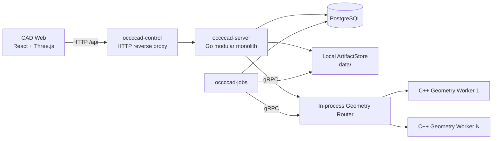
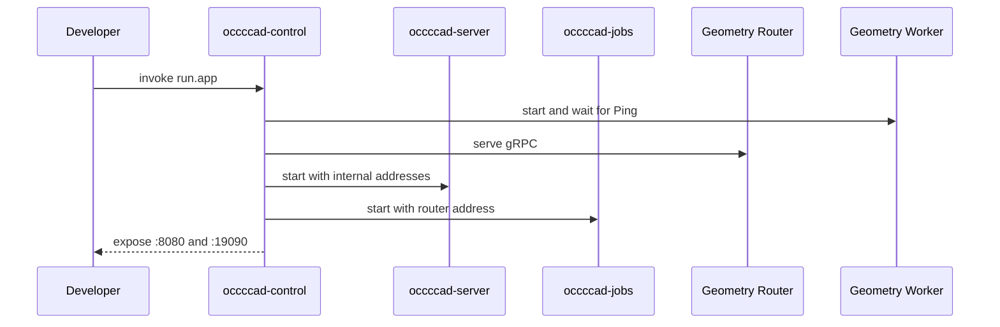
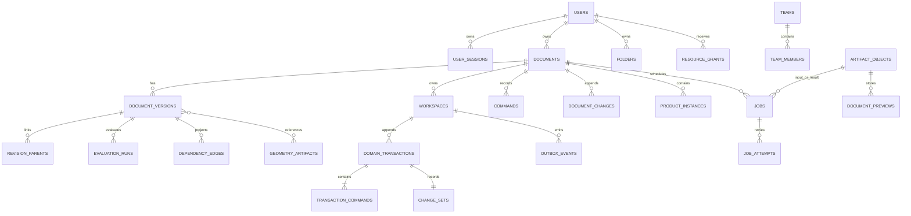
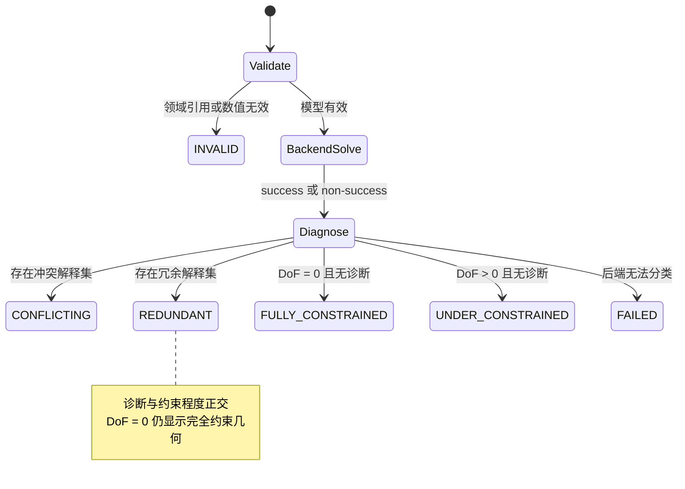
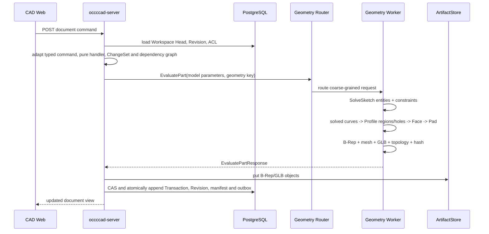
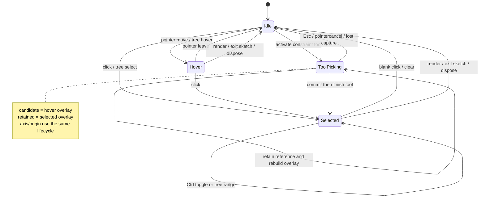
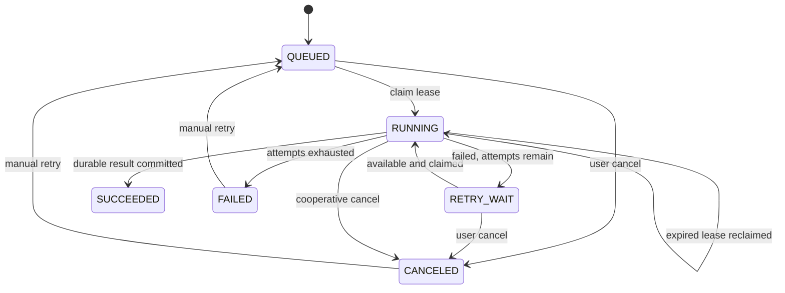
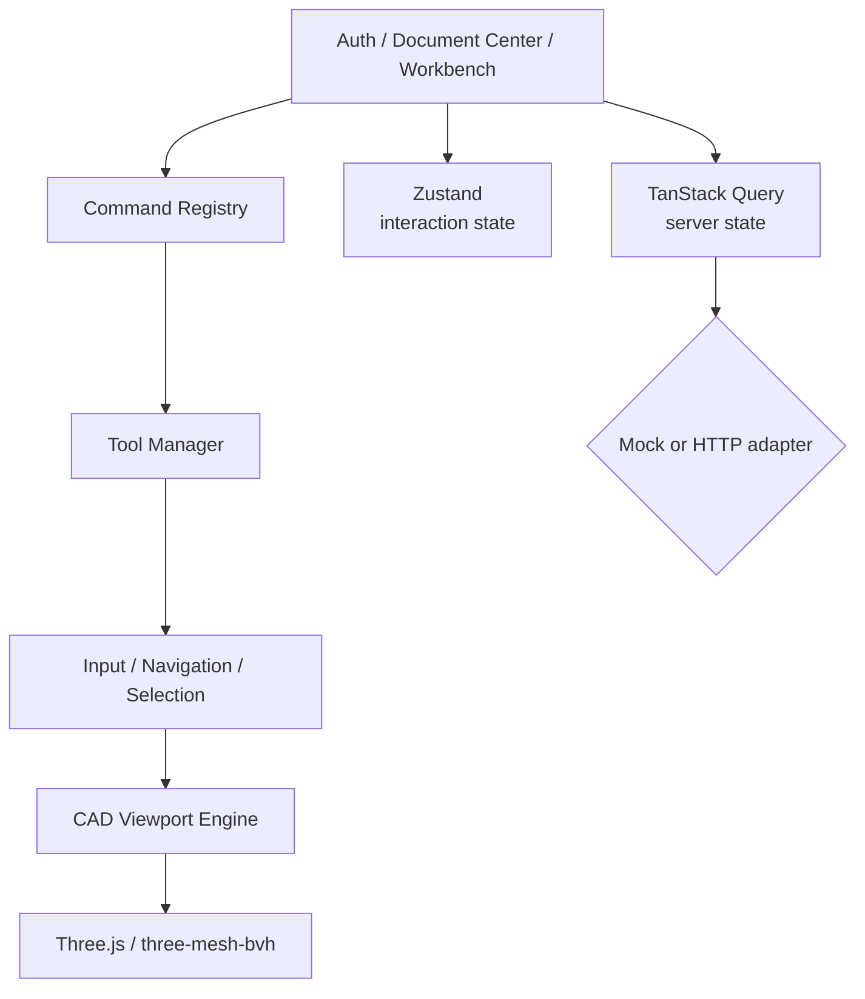

# occccad 现有架构

> 状态日期：2026-09-14
> 文档性质：事实基线。本文只描述当前仓库能够由源码、构建文件、数据库迁移和配置证明的行为；目标能力见[目标架构](TARGET_ARCHITECTURE.md)。

## 1. 结论

当前 occccad 是一个“模块化业务单体 + 持久任务进程 + C++ 几何计算 Worker + 独立 Web 应用”的早期分布式垂直切片。HTTP/WebSocket、数据库、后台任务与几何计算已经跨进程，但调度仅限本机，制品仅限共享本地目录，因此还不是真正的跨主机云平台。

图中的 `/api` 浏览器入口同时承载普通 HTTP 与 `/api/realtime` WebSocket Upgrade。`occccad-control` 是可选的本地聚合入口；单独运行时，Web、API、Jobs 和 Geometry Worker 也可分别启动。

## 2. 仓库与进程边界

| 路径/进程 | 技术 | 真实边界 |
|---|---|---|
| `web/apps/cad` | React/TypeScript/Three.js | 独立浏览器应用，可使用 Mock，或真实 REST + WebSocket API |
| `occccad-server` | Go/net/http | 身份、文档、ACL、版本、实时消息、任务提交和几何编排 |
| `occccad-jobs` | Go | PostgreSQL 任务消费者，无监听端口 |
| `occccad-migrate` | Go | 一次性数据库迁移任务 |
| `occccad-control` | Go HTTP/gRPC | 本地子进程管理、反向代理、Geometry Router、调试切流 |
| `occccad-monitor` | Go/Bubble Tea v2 | 只读 TUI；消费 Control 的版本化监控快照，不拥有采集或业务状态 |
| `workers/geometry` | C++/gRPC/OCCT | 精确几何、STEP、拓扑与显示制品计算 |
| `kernel/api` | C++ library | 不暴露 OCCT 类型的内核公共值类型和操作 |
| `kernel/assembly` | C++ library | 独立三维装配几何约束算法；由 Geometry Worker 的粗粒度 `SolveAssembly` RPC 调用 |
| `kernel/occt` | C++ library | OCCT 适配实现，只链接进 Geometry Worker |
| `services/internal/*` | Go packages | 上述 Go 进程共享的内部模块，不是网络服务 |

每个可运行单元的启动、配置和故障语义见其目录 README。本文聚焦它们组成的系统。

## 3. 当前启动拓扑

### 3.1 统一本地模式

`invoke run.app` 构建后启动 `occccad-control`。控制进程：

1. 在 `127.0.0.1:18080` 启动 API；
2. 启动一个 Jobs 进程；
3. 在 `127.0.0.1:51001` 提供 Geometry gRPC Router；
4. 从 `127.0.0.1:51100` 起启动至少一个 C++ Worker；
5. 在 `0.0.0.0:8080` 提供稳定 HTTP 代理入口；
6. 在 `127.0.0.1:19090` 提供无认证的本机 Control API。

`invoke run.app --reset-data` 在启动控制进程前运行受保护的开发重置：删除配置数据库中固定的 `occcad` schema，清空 `OCCCCAD_DATA_DIR` 对应的本地 ArtifactStore，再从嵌入迁移重建 schema。该命令只面向当前未发布开发数据；Router、Worker resident geometry 和其他进程内状态由新进程自然重建。

### 3.2 独立模式

- `invoke run.worker`：单独启动 Geometry Worker；
- `invoke run.server`：单独启动 API；
- `invoke run.jobs`：单独启动任务消费者；
- `invoke run.web`：Mock 前端；
- `invoke run.web --mode=api`：前端代理真实 API。

当前没有容器编排清单、服务发现、跨主机 Worker 注册、分布式租户配额或生产网关。

## 4. 业务与数据模型

PostgreSQL schema 名为 `occccad`，当前迁移建立的主要关系如下。

### 4.1 Document 与 Version

- Document 类型当前为 Part 或 Product；
- Document 以 UUID `id` 为唯一身份，`name` 是允许重复的显示属性；创建界面按已有名称提供首个可用的 `PartN`/`ProductN` 默认值，但默认值和名称都不参与身份或引用解析；
- Document 是容器；显式 Workspace 保存可变 Head/sequence/base，`document_versions` 是不可变 Revision 快照；
- 每个新建或复制的 Document 自动建立 `main` Workspace，旧 Document 由迁移确定性回填；可以从任意所属 Revision 创建并列出 Branch Workspace；
- Domain Transaction、typed command envelope、语义 ChangeSet、Revision parent、EvaluationRun、dependency edge 与 outbox 在 Head CAS 的同一短事务中追加；
- Restore 创建新的状态，而不是覆写历史；
- Product 保存对子文档的引用和实例 Transform，不展开复制完整子树；
- 当前 Product UI 中的新实例固定采用 `FOLLOW_HEAD`；被引用文档变化后先使 root-snapshot `ProductUpdatePlan` 失效并投影 `UPDATE_AVAILABLE`，打开 Product 的可编辑客户端随后按叶到根自动接受每一级带 digest 的计划，提交普通 `UPDATE_REFERENCES` Revision 并重建可重放快照。Instance 右键可把当前 resolved Revision 切换为 `PINNED`，也可恢复 `FOLLOW_HEAD`；任意历史版本 picker 尚未开放。

Product 工作台维护浏览器会话级的 Active Occurrence 编辑上下文，由 `Active InstancePath + Reference Document` 共同表达。打开 Product 时根 Product 默认激活；双击结构树中的 Product、Part 或 Instance 节点只激活该 occurrence，随后 Toolbar、属性、历史、Undo/Redo 和 Domain Command 绑定其 Reference Document 的 `main` Workspace。激活不是模型命令，不写 Revision；同一 Part Reference 的其他 occurrence 不显示为激活，但编辑 Reference 后全部 FOLLOW_HEAD occurrence 都会解析到新结果。视口始终保留根装配；活动 Part 的草图、基准和命令预览施加该 occurrence 的世界 Placement 后就地编辑，其他部件继续显示。

根 Product 场景与 Active Part 交互视图由明确的 `ViewportEditContext` 分离：实体仍来自根装配，草图实体命中、捕捉、约束、尺寸拖拽与编辑只读取激活 Part，避免 Product 的空 `part` 投影吞掉草图操作。基准轴/面是关闭深度测试的屏幕空间辅助对象：三轴从原点沿正方向延伸，XY/XZ/YZ 面只占正象限的偏移小矩形并保持固定像素尺度；基准轴使用专用虚线和 1.75 px 二次命中门控制抢选概率，基准面使用增强边框。一旦通过各自命中规则，基准几何进入高于实体拓扑的独立 interaction layer，因此前景 Face 不会抢走其 hover/selection。Instance 树标签使用 `ReferenceName(InstanceName)`。命中唯一 Publication 所指几何时，selection 会提升为 Publication identity，使视图区、所属 PartBody（折叠时最近可见祖先）与 Publication 节点共同高亮，装配约束面板优先展示 occurrence 和 Publication 名称而非 UUID。

`INSERT_INSTANCE` 继续把既有 Part/Product Reference 插入当前激活且具有 Editor 权限的 Product；InstanceName 由服务端在 owner Product 当前候选模型中按 `ReferenceName.N` 分配首个同级可用名称，显示名不参与身份，重命名属于独立属性命令。

Product 结构树的 Product 节点另提供“新建零件”。`POST /api/documents/{rootProductId}/part-components` 接收可选的 typed target Product InstancePath；服务端在事务外建立空 Part 初始 Revision 和目标/祖先 Product 候选，再以一个 `ProductDesignTransaction` 原子创建 Part 文档、插入 `FOLLOW_HEAD` occurrence，并从目标 Product 自底向上推进到 root snapshot。任一目标路径、权限或 Workspace Head 失效都会整体拒绝，不产生孤立 Part 或半更新装配。空名称按全局首个可用 `PartN` 分配，InstanceName 仍按目标 Product 同级的 `PartN.N` 分配；第一版只支持位于目标 Product 原点的 identity placement。Undo/Redo 补偿 Product 成员 Revision，因此 Undo 会移除 occurrence 并恢复祖先引用，但不会删除已经创建的 Part 文档；该文档保留在 Document Center，可再次插入或显式删除。结构树 capability 描述领域动作，实际入口仍由服务端对 root、目标和全部祖先 Product 再次执行 Editor ACL 校验。

第一版 typed `InstancePath` 保存 RootDocumentId 和有序 segment；每段包含 owner Document/Revision、稳定 InstanceId、显示 InstanceName、ReferencedDocumentId 和 resolved Revision。`canonical` 由 InstanceId 链构成并用于选择、激活和 occurrence 资源索引，`display` 才由 InstanceName 拼接。名称修改不得改变 canonical identity，也不得作为持久引用解析键。

### 4.2 Command 与 Undo/Redo

HTTP transport DTO 在 API 边界转换为 `type_uri + schema_version + typed payload`，再由进程内 handler registry 执行；持久历史只保存 Domain Command，不存在第二套旧命令语义。Handler 的模型变换无数据库、网络、系统时间和 OCCT I/O；Product 外部引用先冻结，Part 几何在数据库事务外求值，提交阶段以 `(workspace head revision, head sequence)` 做 CAS。重复 request ID 只有 payload digest 相同才返回原结果。

Part 支持草图、拉伸、STEP 基础实体与参数 literal/expression 更新；Product 支持插入、移动和引用策略。Specification Tree 是服务端模型投影：节点携带稳定领域 identity、owner 和允许的 capability，当前 Feature、Product Instance、Sketch Entity/Constraint 可按模型状态开放 `DELETE`，而 Document、Body、Origin、Datum Plane、Axis System/Axis 和引用子树默认受保护。删除仍是版本化 Domain Command；删除草图实体会在同一 `sketch.model` 变更中级联删除全部引用约束，删除 Feature 则先检查下游依赖。Undo/Redo 以根 Domain Transaction 为稳定 identity：Revert 指向根 intent，Reapply 指向根 intent 并消费一个具体 Revert。服务端按 actor 折叠有序 action log 计算 capability，因此连续 Undo 两步可按逆序 Redo 两步；新 Domain/Restore 形成 redo boundary，但不删除历史。API 返回的 `canUndo/canRedo` 来自同一状态折叠，Web 按它置灰。字段 digest 或依赖冲突不会覆盖后续编辑。

### 4.3 实时消息与同文档同步

- `GET /api/realtime` 使用 `occccad.realtime.v1` WebSocket 子协议；现有 session cookie 负责身份，首条 `connection.initialize.v1` 再验证 CSRF token 和 Origin；
- JSON Envelope 支持 request/response/event/ack/error、correlation ID、版本化 type、Workspace sequence 和稳定错误；当前最大消息 1 MiB；
- Web 前端的建模命令使用 `workspace.command.execute.v1`，HTTP 命令入口仍保留并调用同一个 Workspace Service；
- 浏览器进入工作台后订阅 Document 并获得 DocumentView 快照。其他用户提交后，事务内 Outbox 由 API 轮询并向所有本机订阅者发布 `workspace.transaction.committed.v1`，浏览器刷新 Document、History、Properties 和目录投影；
- Product 浏览器会话还递归订阅结构树中未被 `PINNED` 边截断的 FOLLOW_HEAD Reference Document。子 Part/Product 提交后，客户端失效并重新读取 Product Update Plan，再按叶到根串行自动接受；服务端仍以计划 digest 拒绝 stale candidate，每一级都形成正常不可变 Revision，失败只显示阻塞诊断而不令旧 Revision 漂移。激活文档即使位于 PINNED occurrence 下也会单独订阅，以支持该 Reference Document 自身的协同编辑；
- 客户端按 sequence 去重和发现 gap，断线指数退避重连并重新获取快照；服务端以 Ping/Pong 检测失联，有界 128 消息队列满时断开慢消费者；
- 当前实现多浏览器查看同一文档的提交后实时同步；presence、鼠标/选择和拖拽 preview 尚未接入 UI，多 API 实例间扇出也尚未实现。

### 4.4 参数、依赖与增量求值

- Distance、Length、Radius、Diameter、Angle 草图驱动尺寸与 Pad length 会从所属 Sketch/Constraint/Feature identity 确定性派生稳定 ParameterId 和 PropertySlot facade；草图尺寸不再以匿名数值作为权威来源；
- Quantity 以 SI canonical value 和显式 Dimension 保存，当前注册 `mm/cm/m/in` 与 `deg/rad`，拒绝非有限值和量纲错误；
- 当前安全表达式 profile 支持数量字面量、Parameter read、括号和 `+ - * /`，在提交时完成名称绑定、单位检查、cost limit 和 dependency extraction；持久 AST 只保存 ParameterId，显示 key 重命名不破坏引用，并由 checked AST 重新生成当前可读别名文本；参数删除、缺失引用、循环和量纲错误在新 Head 前失败；
- Design Dependency Graph 使用稳定 key 与 typed edge，提交前检查 phase 和 cycle；handler 的 impact seed 计算 transitive dirty closure；
- 每个新模型 Revision 保存 model hash、dependency snapshot digest 和 EvaluationManifest，并投影 node input/output digest、dirty nodes 与 authoritative EvaluationRun；增量 evaluator 只在 input digest 相同才复用前一 manifest 结果，测试以清缓存冷求值为等价 oracle。
- 参数 literal/expression 在 Sketch Solver 和 Feature evaluator 之前按同一拓扑序求值；DocumentView/属性面板显示 ParameterId、别名、source text 与规范计算值，Part Design 的文档级参数面板集中列出全部参数并复用同一版本化编辑命令。新建 Linear Extrude 的 length 可提交 literal 或同一 Part 的别名表达式；legacy UI command adapter 在创建前完成量纲检查和稳定 ParameterId 绑定，typed create handler 在同一个 Domain Transaction 中创建 Feature 及其参数 source，preview/commit 共用该路径且求值结果必须为正有限长度。别名和 source 编辑继续通过版本化 Domain Command、ChangeSet 与 Undo/Redo。

### 4.5 身份与访问控制

- 邮箱/密码登录与数据库会话 Cookie；
- 注册账号经管理员审批，平台角色为 `ADMIN` 或 `MEMBER`；
- 资源角色为 `OWNER`、`EDITOR`、`VIEWER`；
- 支持 User/Team、文件夹权限继承、文档/文件夹分享；
- API 请求绑定 Principal，成功写操作记录 Actor、Resource、Request ID 与 Trace ID 审计；
- Control API 没有认证，只能绑定环回地址。
- Control API 的 `occccad.monitoring.snapshot.v1` 聚合托管进程的 Linux `/proc` 资源统计、Geometry 池负载与 API 业务计数；Control 到 API 的内部采集端点以进程启动时随机令牌保护。`occccad-monitor` 每秒消费该契约，UI 与采集模型分离；非 Linux 当前不提供 CPU/RSS 统计。

## 5. Part 几何求值链

当前已不再保存 `origin + width + height` 测试矩形。Part 中的 `SKETCH` Feature 保存版本化 `SketchFeature v2`：Datum/PLANAR_FACE support、具有稳定 ID 的 Point/Line/Circle/Arc/Spline、独立 ExternalGeometry、显式 GeometryRef、Constraint 和最近一次权威 solve 状态。线段、圆弧和开放曲线持有可稳定引用的端点；端点相接必须由 Coincident 明确表达，不能以浮点坐标接近替代模型关系。

Geometry Worker 内的项目自有 `SketchSolver` 已通过 `SolveSketch` 粗粒度 RPC 接入提交链，PlaneGCS 只存在于适配层内部。当前支持 Coincident、Parallel、Fixed、Horizontal、Vertical、Perpendicular、Tangent、Equal、Distance、Length、Radius、Angle、Concentric、PointOnObject、Midpoint 和 Symmetry。Geometry client 是唯一协议适配边界：Worker 的历史 `SOLVED`/`INVALID_MODEL` 名称在此归一为平台 `FULLY_CONSTRAINED`/`INVALID`，PlaneGCS 整数返回码不会进入服务、Revision 或用户错误。求解结果把约束程度 `FULLY_CONSTRAINED / UNDER_CONSTRAINED / UNRESOLVED` 与诊断 `REDUNDANT / CONFLICTING` 正交保存；零 DoF 的闭包即使存在冗余，几何仍显示完全约束色，只有冗余约束本身显示诊断色。宏生成的 `internal` 约束仍参与求解和冲突诊断，但其纯冗余项不阻止整个原子宏提交；用户显式添加的无关冗余约束报告 REDUNDANT。Symmetry 支持“点—直线—点”的轴对称及“点—点—点”的中心对称；当其基于内置 U/V 轴且一个方程已被同一线段的 Horizontal/Vertical/对应轴 Parallel 隐含时，适配层保留复合设计意图。当前 `Spline` 命令把采集点解释为必须经过的拟合点；尚未接入完整样条相切/曲率约束。Web 预览是瞬态状态；`EDIT_SKETCH` 提交后服务端求解结果才进入不可变 Revision。

PlaneGCS 适配器按 `DogLeg → Levenberg-Marquardt → BFGS` 执行确定性收敛回退；只有三种算法都失败且诊断不能产生冲突/冗余解释集时才返回平台 `FAILED`。`diagnose()` 会为冗余分析临时求解 reduced systems 并恢复 parameter reference，因此完整系统的 `applySolution()` 必须在诊断结束后执行；否则含 internal 冗余的六边形会让之后其他连通分量的约束看似提交成功却保存旧坐标。仓库保存了真实 XZ“圆弧闭包 + 内置 U 轴角度”以及“六边形 + 后建直线/Spline 分量”的数值回归。

Pad 已不再调用四条轴对齐直线特判。OCCT-free Profile Builder 排除 Construction/Point，以 Coincident 等价类构建 Line/Arc/开放 Spline 端点图，并把 Circle/闭合 Spline 作为闭环；它拒绝开放端、T-junction、重叠/相交和自交，确定性遍历环，按包含深度区分外环、孔和岛，并生成稳定 ProfileLoop/ProfileRegion identity。实体求值采用两阶段协议：`LINEAR_EXTRUDE` 或 `REVOLVE` 先从 ProfileRegion 产生临时 Tool Shape，再以 `NEW_BODY / ADD / REMOVE / INTERSECT` 对当前 Body 执行采用、Fuse、Cut 或 Common。OCCT 适配层对空结果、无材料变化、无效 B-Rep 和非单一连通 Solid 给出稳定领域诊断；连续拉伸不再各自产生互相穿透但未合并的实体。旋转轴使用稳定引用，可指向任意 Sketch Line（包括 Profile/Construction 及其他草图中的直线）、AxisSystem 的 X/Y/Z 方向或 DatumAxis；三维参考轴必须位于轮廓草图的支撑平面，服务端将其投影到草图局部框架后再交给 Worker，不能静默使用与轮廓异面的轴。旋转面板作为选择收集器保持打开并等待用户拾取直线或轴；角度、轴引用和反向意图进入 Feature 与求值 digest。当前仍是单 Body、整张 Sketch profile selection，尚未提供区域点选、多 Body 或 merge scope。

Sketch support 不再由 `XY/XZ/YZ` 字符串隐式决定坐标。默认平面和用户创建的基准面保存 `origin + normal + uDirection` 右手坐标框架；`PLANAR_FACE` support 保存上游 Face 的 PersistentSelection、source Revision、origin/X direction/normal、定向规则和 dependency snapshot。提交前控制面先对草图之前的完整 body prefix 求值，再以 semantic topology history 解析当前平面，保持法向定向并把保存的 X direction 投影到新平面；缺失、歧义、类型变化和非法顺序以顶层 `FAILED_SUPPORT` 及具体 diagnostic 拒绝候选 Revision、保留旧 Head，且不会静默退回默认平面。Visualization、拾取、Sketch 编辑和 Worker Profile 构造共享同一支撑框架，依赖图显式串联顺序 body tip，并以 `READ_GEOMETRY` 连接 DatumPlane、以 `READ_TOPOLOGY` 连接面支撑与其直接上游 body tip。`CREATE_DATUM_PLANE` 与 `CREATE_DATUM_AXIS` 继续具有稳定 identity、结构树投影、显示/选择和 Undo/Redo PropertySlot。

ExternalGeometry 与普通 Sketch Entity 分开持久化。每项保存稳定 ExternalId、Edge/Vertex PersistentSelection、source Revision、`ORTHOGONAL` projection kind、resolved source digest、dependency snapshot 和 Worker 生成的二维 Point/Line/Circle snapshot；Constraint 通过 `EXTERNAL + ExternalId + stable sub-element` 引用它。控制面固定按 naming resolver → Worker projection → Sketch solve → downstream Feature 顺序处理，求解边界把外部几何作为内部 fixed geometry 输入 PlaneGCS，但不会把求解结果写回它。`DETACH_EXTERNAL_GEOMETRY` 将当前已连接 snapshot 原子冻结为同 ID 的普通 Construction Entity 并改写引用；Reconnect 只替换 PersistentSelection，保留 ExternalId。显式 ADD/RECONNECT 若无法完成权威投影，会以 `EXTERNAL_GEOMETRY_PROJECTION` 阶段和 Worker 稳定诊断原子拒绝，旧 Head 不变；只有先前已连接的来源因上游更新而缺失、歧义、类型变化或投影退化时，才清除旧 snapshot、列出受影响 constraint/profile/downstream Feature 并提交可检查、可 Reconnect 的 FAILED Revision。FAILED Revision 不得把 dependency snapshot 的上游 prefix geometry key 冒充自己的最终制品；读取时只生成与当前模型 Manifest 匹配的诊断可视化，因此失败状态仍可继续检查和编辑。当前圆 Edge 投影只覆盖完整圆；部分圆弧缺少起始方向和有向 sweep evidence，明确返回 `EXTERNAL_PROJECTION_TYPE_UNSUPPORTED`，Arc snapshot 按 P11J 扩展。

草图编辑的 ChangeSet 以最终写入 Revision 的求解后 `sketch.model` 为准，而不是命令处理器产生的求解前候选值；历史投影层能够独立读取和回写该稳定属性槽。Undo/Redo 对持久 ChangeSet 先验证稳定 write-set 的 target/slot 唯一性，再从原事务不可变的 base/result Revision 重建实际 before/after 和 digest，最后执行当前值冲突检查；因此旧版本中已写入错误 digest 的求解后草图事务也能修复并回滚，但不会信任旧 ChangeSet 内容或放宽并发冲突检查。PlaneGCS 改写坐标、DoF 或诊断后，补偿和重放不会再产生候选值与 Revision 的 digest 冲突。

GeometryId 是精确 Body B-Rep 的 SHA-256 内容标识，不绑定 Worker；`geometry_key` 标识带 evaluator 和 Part 显示语义的求值结果，因此两个结果可以共享 GeometryId，但拥有不同的可视化制品。几何输出包括 B-Rep、GLB、三角形、边折线、包围盒、拓扑计数和体积。新增几何已接入本地制品对象；历史表结构仍保留部分内联数据字段。Body 的 ADD/REMOVE/INTERSECT 在 OCCT 布尔完成后统一同域面和同域边，再进行 B-Rep 校验和内容寻址；因此相交且等高的拉伸不会把连续顶面暴露成多个共面选择区域。

Persistent topology naming 已完成 P0–P4 契约、Linear Extrude/Boolean history 生成与服务端 PersistentSelection bind/resolver。Profile Pad 求值必须携带稳定的 Feature、Body、输入 Feature 和 Profile Feature identity，以及固定版本 naming policy 的 digest 和以米、弧度表达的匹配容差；Part `geometry_key` 同时包含这些 identity、完整 Feature 输入和 policy digest，不能让几何相同但业务身份不同的 Feature 复用 topology manifest。Linear Extrude 从 profile region/entity ID 生成 start cap、end cap 和 side semantic outputs；OCCT adapter 保留 Prism、Fuse/Cut/Common 与 `ShapeUpgrade_UnifySameDomain` 的历史对象，将 Generated/Modified/Unchanged/Split/Merged/Deleted 折叠为逐 Feature `TopologyHistory`。Boolean/同域 history 后还会对未覆盖的合法最终拓扑执行 semantic adjacency closure：Face 优先读取已命名边界 Edge，Edge 读取 incident Face，Vertex 读取 incident Edge；派生 identity 绑定当前 Feature 与排序后的稳定 source ref，数值 evidence 只在相同 source set 内确定次序，不能以 local ID 或坐标单独补名。每个 live Face/Edge/Vertex 输出包含最终 GeometryId 内的 typed local ID、geometry evidence 与排序后的相邻语义引用；完整 history 的 shape gate 要求最终每个元素恰有一个唯一 semantic output 和 lineage result，并拒绝 live/tombstone 冲突、无稳定来源或无法消歧的派生候选。history digest 覆盖 source/result、lineage kind、歧义、删除、证据、邻接和 policy。Worker 在 `PartEvaluationManifest` 返回 FeatureResult，并把相同结果序列化为带 SHA-256 的不可变 protobuf topology manifest；控制面在采用外部 topology artifact 前同时核对 inline manifest、Worker reference 和已采用对象的摘要。`topology_history_complete=false` 是显式契约：当前 Revolve 和未命名的导入 B-Rep 会返回诊断，不能被下游当作完整 history。服务端只允许从 source Revision 最终 Body Tip 的 local pick 创建带 creation evidence 的 `PersistentSelection`，并按固定 source/target Revision、manifest/policy digest 与 semantic lineage 解析；歧义不会自动选取。Product topology endpoint 已升级为 occurrence + source Revision + PersistentSelection；revision-local local ID 仅作为瞬时 pick evidence。

Router 的亲和对象是不可变 `geometry_key`/GeometryId，而不是可变 Document：拓扑等后续查询回到已经 resident 该 Body 的 Worker，新的 Revision 在 `OCCCCAD_GEOMETRY_PER_WORKER` 软容量已满时可以分配到另一 Worker。这个过程不移动参数模型或权威 B-Rep；Revision、Artifact 元数据和 ArtifactStore 仍是事实来源，Worker 只保存可丢弃缓存，所以 Undo 可以命中旧 Body 所在 Worker。当前 Part evaluator 会从完整参数模型重建特征链，并不消费父 Revision 的 resident Shape，因此强制把子 Revision 放回父 Worker 没有计算复用收益，反而会破坏按不可变制品分散内存和并行查询的能力。将来只有在 evaluator 支持带 provenance 的增量输入（父 GeometryId、dirty feature closure 和确定性回退）后，才应增加 lineage-aware placement；不能仅按 Document ID 制造状态依赖。

每个 Part 求值结果还持有 schema v1 `VisualizationManifest`，并镜像到最终 GLB 的 `OCCCCAD_visualization` 扩展。Manifest 统一包含 DatumPlane/AxisSystem 和可选择的非实体 primitive；当前草图 Point 映射为 `POINTS`，Line/Circle/Arc/Spline 映射为 `POLYLINE`。全部几何约束映射为带约束类型的 `POINTS` glyph anchor；Distance/Length/Radius/Diameter/Angle 映射为 `LINE_SEGMENTS` 引线、箭头以及 label/labelPosition。约束 primitive 还携带 `relatedEntityIds`，使约束的视口/结构树 hover 和 select 同时作用于标记及全部引用草图元素。每个 primitive 保存稳定 entity/constraint ID、所属 FeatureId、类型、PROFILE/CONSTRUCTION role、求解状态和 Part 坐标。协议预留 `TRIANGLES`，供后续独立曲面显示使用，但当前尚未交付三维曲线/曲面建模命令。对象存储路径会读取 Worker 基础 GLB、注入 Manifest 后再登记最终不可变 GLB，不依赖数据库旁路元数据。

Web 的 Part 与 Product occurrence 共用同一个 Visualization renderer 和 selection identity builder。Product 只在 Part primitive 上施加 occurrence Transform；不会重新解释 SketchModel，也不会维护装配专用草图副本。因此零件中的点线样式、约束符号、可见性和稳定选择会原样出现在装配中。结构树在每个 Sketch 下投影 Geometry 与 Constraints 分组及其稳定子节点；草图实体和每条约束的显示 primitive 与树节点共享 selection identity，支持 Part/Product 中的树/视口双向选择和预选高亮。约束 primitive 是带 provenance 的可重建显示制品，不是参数模型之外的第二份业务状态。

活动 Sketch 的原点和 U/V 轴是稳定的内置 GeometryRef，而不是临时渲染对象：原点参与点类签名，U/V 轴参与直线/求解曲线签名，因此 Coincident、Parallel、Perpendicular、Tangent、PointOnObject、Angle、Symmetry 和点线 Distance 共用同一选择与服务端验证语义。线性尺寸当前覆盖线长、点点距离和点到直线/U/V 轴距离。圆与圆弧中心、圆弧和开放 Spline 端点均作为独立点标记显示和拾取；Line、Arc、Polyline、Spline、Rectangle 与独立 Point 命中已有稳定点时，会在同一原子编辑中写入显式 Coincident。结构树双击 Sketch 直接进入该 Sketch 的编辑上下文。

Sketch Entity 的 `PROFILE`/`CONSTRUCTION` role 是持久领域状态。结构树右键可在“轮廓元素/构造元素”之间切换，操作形成普通 `EDIT_SKETCH` Transaction，经过权威求解、最终 ChangeSet 和 Undo/Redo；Profile Builder 只消费 `PROFILE`，因此构造线、构造曲线和构造点不会进入 Pad。活动 Sketch 的 U/V 轴与原点采用相同的参考几何语义，但不作为可写 Sketch Entity 持久化。权威 VisualizationManifest 为 Circle/Arc 生成中心点、为 Arc 生成端点、为 Spline 生成全部拟合点；Select 工具拖动 Arc/Circle 中心或 Spline 拟合点时只显示瞬态点预览，并在 pointerup 提交一次 `UPDATE_ENTITY_POINT`。

草图选择使用一个可撤销状态机。结构树与视口只产生稳定 Selection identity；预选、持久选择、工具已保留引用分别拥有独立 overlay。每次转换先释放旧材质与 Scene overlay，再从当前状态重建。内置原点/U/V 轴只是采用专用拾取几何的参考元素，不拥有例外清理规则；文档重绘、空白点击、Esc、工具完成、退出草图和 Viewport dispose 均汇入统一清理出口。

P3 在上述 history 契约上增加了服务端 PersistentSelection bind/resolver。bind 只接受 source Revision 最终 Body Tip 的 local pick，并固化 semantic anchor 与 creation evidence；resolver 固定校验 source/target Revision、document/body、expected type、creation evidence、manifest digest 和 policy digest，沿 lineage 返回唯一解析、缺失、歧义、类型不符或当前 tip 外等状态，绝不以相同 local ID 或最近几何自动选面。解析缓存以 selection、target Revision、manifest/evidence/policy digest 为身份，并可从不可变 topology artifact 冷重建。右侧属性面板现在展示 semantic anchor、selection recipe、supporting-element 状态和 evidence digest。

Product 装配引用已完成 P4 升级。拓扑 endpoint 持久化 occurrence、source Part Revision 和 PersistentSelection，并保存固定 target Revision、topology manifest/policy digest 与 resolution result；`geometryKey + localId` 只作为创建或 Reconnect 时的瞬时 pick evidence。默认实例使用 `FOLLOW_HEAD`；Part Head 更新后 Product Update Plan 投影 NotUpdated/UpdateAvailable，Web 自动批量推进 Revision、重新解析 endpoint 并求解，用户可用 `PINNED` 显式截断自动跟随。Supporting Element 的 Connected/NotConnected 与 Constraint 的 NotUpdated/Broken/Impossible/Verified 是两个独立状态域：解析失败的约束不会进入 Solver，其余 connected component 仍经正式 Router 的 M2.5 路径求解。结构树和属性面板显示状态与 provenance，持久 ChangeSet 支持刷新及补偿式历史。

P5 已把上述状态接入实际约束恢复流程。创建和编辑使用同一非模态约束定义面板，服务端成功 preview 除 occurrence poses 和 component 诊断外，还返回候选 Constraint 状态与两个 Supporting Element 状态；已连接支持元素在 `SOLVING` 阶段的不可重试结构化失败明确投影为 Impossible，基础设施或可重试失败保持 NotUpdated，前端不从颜色或普通异常文本猜测领域状态。结构树双击/右键 Edit 打开同一编辑器，Broken 节点提供 Reconnect，非 Verified 节点提供 typed `UPDATE_REFERENCES` Refresh。Reconnect 复用一次性 Selection Tool 和现有 preview actor，替换端点后立即权威预览，确认以一个 `EDIT_ASSEMBLY_CONSTRAINT` Transaction 提交。结构树状态包含图标、文字和可访问标签；视口的 NotUpdated、Impossible、Broken 各用不同的屏幕稳定 SDF glyph，精确拓扑锚点丢失时回退到 occurrence 中心，确保 Broken 约束仍可被选择并修复。

P6 已用现有 `REMOVE` Linear Extrude 建立 Cut/Hole 代表场景，而未提前增加第二套 Hole DSL。XZ 矩形贯穿 Cut 的 OCCT corpus 固定验证六个基础面语义引用继续存在并新增四个孔壁引用；同一 corpus 还覆盖保留面、删除面与侧开口 split 歧义。Go 端可执行 fixture 经真实 Workspace、PostgreSQL、ArtifactStore、GeometryPool、正式 Router 和 C++ Worker 创建 Part/Product 面约束，覆盖通孔更新、Part Undo/Redo、真实删除、Broken 隔离、Reconnect 后继续编辑以及 ambiguous 不自动选择，并重新执行保存的 `.3dreplay`。编辑任何 Broken 约束会先把 evaluation 重置为 NotUpdated，使当前命令的权威解析与求解能够恢复到 Verified；最终 Revision 才保存求值结果。fixture 可通过 `OCCCCAD_P6_EVIDENCE_DIR` 输出逐阶段 ResolutionSnapshot 摘要和 solver replay。

P7 首次把 naming evaluator 升为 `occccad.topology.contract.v2`；当前 Boolean semantic adjacency closure 已将 evaluator 升为 `occccad.topology.contract.v3` 并更换 policy digest，旧制品不会冒充新 manifest。Linear Extrude 除 cap/side Face 外，还从 profile curve entity 与共享 endpoint identity 生成 start/end cap boundary Edge、vertical Edge 和 start/end Vertex；Boolean 与 same-domain history 优先按原拓扑类型传播，并只为 OCCT 未提供同类型 history 的最终交线/端点执行可审计 closure。Edge evidence 包含解析曲线类型、SI 长度、质心、原点/方向、参数区间与端点角色，Vertex evidence 包含稳定点坐标与端点角色，三类 output 均带跨类型邻接语义引用。声明完整的 Shape gate 要求最终 Face、Edge、Vertex 各自被唯一 semantic output 和 lineage 覆盖；矩形拉伸基线为 6/12/8，长度编辑、面上 boss/pocket、ADD/REMOVE、贯穿孔、多区域/圆环/Arc/Spline profile、edge merge/split、vertex delete、圆环 seam 和容差以下短边均有确定性 corpus。Worker Proto 保留真实 topology type。服务端把 Vertex 解析为精确 Point、线性 Edge 解析为 Axis，并经正式 Router 验证 Vertex-Vertex、Vertex-Plane、Edge-Edge、Edge-Plane 的创建、更新、Broken 隔离和 Reconnect；缺少 manifest 与不完整 history 使用稳定诊断，并在没有可求解 component 时不产生 replay。

Part 交互在退出 Sketcher 后把选择提升为整个 Sketch Feature，并保持未被实体特征消费的草图可见；已消费 profile 仅在重新编辑时临时显示。视图区在 Sketcher 外命中草图点、线或约束时同样投影到整个草图，因此可以直接继续 Pad/Pocket/Revolve。新建实体特征成功后自动选择结果 Feature，保持“选平面→建草图→绘制→退出→拉伸”的连续操作链。

### 5.1 PlaneGCS 技术验证边界

- 上游锁定 FreeCAD `1.0.2` commit `256fc7eff3379911ab5daf88e10182c509aa8052`；该版本原生满足仓库 C++17 基线，未为引入求解器升级全仓语言标准；
- 构建仅从 FreeCAD 官方仓库获取审计清单内的 PlaneGCS 源文件、必要支持头和许可证，每个文件都有 SHA-256 校验，不下载/链接 FreeCAD App、GUI 或 Python；
- PlaneGCS 编译为独立 `liboccccad_planegcs.so`，Eigen 3.4.0 与 header-only Boost 1.86.0 由 Conan 显式提供；FreeCAD 配置与日志依赖由 Worker 内窄兼容头隔离；
- Geometry Worker 持有项目自有 `SketchSolver`，业务头文件不暴露 `GCS::*`。构建目录同时输出 `LICENSE.FreeCAD-PlaneGCS`；
- 当前测试验证 Rectangle 宏求解、未知引用失败、Circle Radius + Line Tangent、Profile 外环/孔、Arc + Line 混合闭环、开放/T-junction 诊断，以及 OCCT 圆环 Pad 的体积和有效拓扑。Sketch 实体与约束支持持久抑制：被抑制项保留稳定身份，但退出 Solver、Profile、Pad 与 VisualizationManifest；实体抑制会同时抑制引用它的约束。服务端按约束引用图拆分连通闭包并分别求解，向 Web 投影组件级 status/DoF、冲突集与冗余集。拖拽 RPC、完整 B-Spline 曲率约束和大规模 corpus conformance 仍属于后续工作。

### 5.2 Geometry Worker 真实 RPC

| RPC | 当前状态 | 说明 |
|---|---|---|
| `Ping` | 已实现 | 健康与 resident 数量 |
| `EvaluatePart` | 已实现 | ProfileRegion/孔环 Pad 链、基础 B-Rep；Profile Pad 强制稳定 Feature/Body/source identity 与 naming policy，回传逐 Feature semantic outputs/TopologyHistory，并输出不可变 topology manifest artifact；保留旧矩形字段作为当前开发期过渡入口 |
| `SolveSketch` | 已实现 | GeometryPool Router 转发到 Worker，执行 SketchModel v2 的权威 PlaneGCS 求解与诊断 |
| `ProjectExternalGeometry` | 已实现 | Router 转发 Edge/Vertex evidence 与 support frame，Worker 权威生成 Point/Line/Circle 投影及稳定失败诊断 |
| `InspectExchange` | 已实现 | 读取 STEP/BREP 制品清单，判定 Part 或可并行根组件 Product |
| `ImportExchange` | 已实现 | 从 ArtifactReference 导入一个 STEP 根或 BREP，输出 B-Rep/GLB 制品引用 |
| `ExportExchange` | 已实现 | 将一个或多个带放置的 B-Rep 制品合成为 STEP/BREP |
| `GetTopology` | 已实现 | 拓扑摘要与属性；同一 GeometryId 的完整拓扑分析在 Worker 内只计算一次 |
| `LoadGeometry` / `UnloadGeometry` | 仅 Proto 声明 | 服务未覆盖，返回 `UNIMPLEMENTED` |
| `Tessellate` | 仅 Proto 声明 | 服务未覆盖 |
| `CreateChamfer` / `CreateFillet` | 仅 Proto 声明 | 服务未覆盖 |

这里特意区分“契约占位”和“已实现”，避免客户端基于 Proto 误判能力。

## 6. Geometry Router 与本机扩缩容

Router 实现与 GeometryWorker 相同的 gRPC 服务并转发请求。当前 Part 只有一个权威求值 Body，因此其 `GeometryId` 就是驻留原子；同一 Part 的面/边/点查询以及 Product occurrence 引用复用这个原子。未来多 Body Part 必须为每个 Body 产生独立不可变 GeometryId/Artifact，不能以文档 ID 把多个 Body 强制绑在一起。选择规则为：

1. 如果设置调试覆盖，所有请求发往调试 Worker；
2. 优先选择已拥有目标 `GeometryId`/`geometryKey` 的 Worker；首次冷请求在发出 RPC 前即预留 owner，因此并发请求不会把同一 Body 加载到多个 Worker；
3. 否则选择 resident + in-flight 未达到容量且负载较低的 Worker；
4. 无容量且未达最大数量时启动新进程；
5. 最后退化为选择 in-flight 最低的已有 Worker。

`GetTopology` 从 Artifact 恢复 B-Rep 后会立即把请求 GeometryId 绑定到实际 Worker；后续元素查询即使 `OCCCCAD_GEOMETRY_PER_WORKER=1` 也绕过普通容量选择并命中同一 owner。Worker 对每个 GeometryId 缓存完整 `TopologyInfo`，单面查询只过滤缓存结果，不再重复遍历并分析整个 OCCT Shape。Worker 完成后 Router 通过 `Ping` 刷新 resident 数。失联 Worker 被移除并补足最小副本；超出最小副本且 `resident=0` 的空 Worker 才会在超时后回收，驻留 Body 不会被空闲缩容静默丢弃。

局限：所有注册和缓存亲和信息均在内存中；只会拉起本机进程；没有持久租约、跨节点资源报告、优先级、公平调度或租户预算。

## 7. 持久任务与制品

### 7.1 PostgreSQL 任务队列

API 使用 `(job_type, idempotency_key)` 去重提交。Jobs 进程用 `FOR UPDATE SKIP LOCKED` 领取任务，使用租约、心跳、尝试记录和延迟重试。

当前任务类型为 `EXCHANGE_IMPORT`、`EXCHANGE_EXPORT` 和 `THUMBNAIL_RENDER`。任务可显式标记为用户可见；自动缩略图不进入消息中心。`THUMBNAIL_RENDER` 使用 `svg-v3` 生成固定 `320×200`（`8:5`）SVG：平滑顶点法线负责曲面光照，边界/轮廓/强折线单独绘制，三角面不绘制低对比度逐面片边框。默认 `5s` deadline 可由 `OCCCCAD_THUMBNAIL_RENDER_TIMEOUT` 调整；超时会持久化默认 SVG，预览 HTTP 入口在任务尚未完成或制品不可用时也返回同一固定尺寸默认 SVG。Exchange 导入先检查清单，再以最多 8 个并发调用导入独立根组件；每个组件形成带默认 DatumPlane、AxisSystem 和可扩展 `IMPORT_BODY` Feature 的 Part，多组件再形成引用这些 Part 的 Product。导入文档名使用经路径清理后的完整文件名，保留 `.step`/`.brep` 后缀。创建文档和后续命令共享稳定 request ID，任务重领后可继续未完成阶段。导出支持 Part 和展平后的 Product occurrence，最终格式为 STEP 或 BREP。Product STEP 导出对每个 occurrence 单独 Transfer 一个带 placement 的 root，因此当前展平 Product 导出再导入仍被识别为 Product，而不会因先合并为 compound 而退化为 Part。语义是至少一次，不是恰好一次；过时缩略图会被安全跳过，文档 Head 已改变的导出任务会失败以避免输出混合版本。

用户可通过 `POST /api/jobs/{jobID}/cancel` 取消自己发起的排队或运行任务，并通过 `POST /api/jobs/{jobID}/retry` 让最终失败或已取消任务重新排队。运行任务每秒检查取消请求并取消其 Geometry 上下文；成功提交条件同时拒绝带取消请求的迟到结果。导入在进度 70% 进入正式文档提交阶段，此后不再开放取消，避免产生用户可见的半提交组件集合。Worker 在检查、几何转换、文档提交和制品登记等阶段单调更新进度。

### 7.2 ArtifactStore

本地后端按 SHA-256 内容寻址并原子写入 `OCCCCAD_DATA_DIR`。数据库保存对象元数据、大小、媒体类型和引用。`occccad-control` 以 `services/` 为相对路径基准，将该目录规范化为绝对路径并显式传给 API、Jobs 和每个动态 Geometry Worker；不能让子进程按各自 working directory 重新解释 `./data`。因此本地后端仍不能直接支撑无共享盘的多主机部署。

Document Center 的 `POST /api/exchange/imports` 接收原始 HTTP body，使用 `MaxBytesReader` 限制为 128 MiB，并直接以 `io.Reader` 流入 ArtifactStore；不使用 multipart、`ReadAll`、WebSocket 或 gRPC bytes 字段。`POST /api/exchange/exports` 只提交文档 ID、Head 和格式，`GET /api/jobs/{jobID}/download` 以流式响应下载结果。Geometry gRPC 只交换 opaque object key、digest、大小和媒体类型；当前 Worker 与 API/Jobs 通过相同 `OCCCCAD_DATA_DIR` 模拟对象存储。生产替换为 S3 signed upload/download 时，领域任务与 Worker 契约保持 ArtifactReference，不传本机绝对路径。

Exchange HTTP 提交只等待上传落盘和 Job 入队，随后立即关闭对话框；浏览器不会让提交请求等待几何处理。Jobs 在最终 `SUCCEEDED`、最终 `FAILED` 或 `CANCELED` 状态转换的同一 SQL statement 中写入 `JOB` Outbox，API 将 `job.state.changed.v1` 仅推送给任务发起用户。若该用户没有可接收的 WebSocket 会话，事件保持 unpublished，直到至少一个会话接受。Web 顶部消息中心同时从 `GET /api/jobs` 恢复最近 100 条用户可见任务，因此错过瞬时通知或重新登录后仍能看到状态、失败原因、进度和下载/打开入口；仅在存在活动任务时每 2.5 秒刷新进度，终态仍由 WebSocket 立即提示。前端把持久 Job 投影为通用 ActivityItem，任务类型展示与动作注册集中在 activity 模块，未来其他持久消息来源可增加独立 projector 后合并，而不复制 Drawer 或任务状态机。

当前 STEP 装配识别以 OCCT transferable root 为并行边界，能保存多根文件为 Product/Part 引用并保留根 Shape 自带放置；Product 导出同样保持“每个 occurrence 一个 transferable root”的当前对称契约。这只保证展平 Product 的类型和 placement round-trip；尚未使用 STEPCAF/XDE 恢复嵌套层级、名称、颜色、单位和共享实例关系，因此不能宣称完整 AP242 装配交换。

## 8. Web 应用架构

Three.js 被封装在 Viewport Engine 内，页面层不应直接操作 Scene/Renderer/Controls。统一输入系统处理 Pointer/Keyboard、导航、Tool、Selection、Capture 和 Overlay；Toolbar 命令不注册快捷键，Enter/Esc 只保留为多阶段手势的完成/取消输入，视图区底部不再显示工具提示条。Part Design、Sketcher、Assembly、历史与视图 Toolbar 使用同一套无文字、统一描边的 CAD 语义 SVG；Sketcher 将基础几何、几何约束、尺寸约束和常用图形拆为四个可拖动 Toolbar，常用图形统一为矩形、正六边形和圆。Distance 与 Length 共用一个线性尺寸工具：首次命中直线主体形成 Length，首次命中点后继续选择第二点形成 Distance；Radius、Diameter、Angle 保持独立尺寸类型。约束定义声明按顺序允许的拾取类型/数量、符号、尺寸类型和单位；相切排除 Spline 与 line-line，相等的第二个引用按首个引用限制为 line-line 或 circle/arc pair。Go 命令验证层再次执行相同的类型不变量，UI 过滤不是唯一正确性边界。所有创建/约束按钮统一为单击执行一个逻辑操作后回到选择、双击进入连续模式。Point、Line、Circle、Arc、Polyline、Spline 和 Rectangle 共用完整手势生命周期；Polyline/Spline 以双击或 Enter 结束本次多点采集。创建工具只上报 Point/Line/Circle 三类基础预览几何，由统一策略派生瞬态尺寸、精度和位置；矩形上报两条正交基线、正六边形上报一条代表边，后续复合工具无需自定义尺寸字符串。参考尺寸和持久尺寸 label 都以 CSS pixel 为目标，在每次渲染前根据相机深度/FOV/Viewport 高度反算 world scale，因此缩放长尺寸时保持固定屏幕大小。显示/输入精度统一为长度 2 位、角度 1 位小数；10 mm 网格是吸附步距，`0.01 mm` 是退化几何提交阈值，二者不再混用。尺寸约束按“选择引用 → 从当前已求解几何测量初值 → 移动并点击放置 → 内联编辑 → Enter 提交”的状态机创建；创建后的尺寸可在约束 glyph 或结构树叶节点上双击，并通过同一个编辑器提交 `UPDATE_CONSTRAINT_VALUE`。视口双击由 Pointer 手势状态机基于时间、位移和完整 down/up 序列识别，不依赖浏览器不稳定的 `PointerEvent.detail`。长度、两点距离、半径、直径和夹角均使用实际几何初值，不再要求用户从空值开始输入。

Toolbar 的展示目录由 PostgreSQL `ui_toolbars/ui_toolbar_items` 维护，并通过认证接口 `GET /api/ui/toolbars` 下发工作台归属、锚点、方向、排序、分组、命令稳定 ID、短名称、详细帮助、图标键和连续执行标记。Web 不再以 JSX 决定工具条组成；但服务端目录只是版本化展示配置，命令只有在本地 `CommandRegistry` 注册且当前状态允许时才能执行，未知命令安全地不显示也不可执行。普通 hover 在鼠标右下方仅显示白色小型短名称；上边栏纯图标“这是什么？”进入一次性上下文帮助模式，下一次点击只显示目录中的工具条名称和详细说明，不执行命令。用户拖动后的位置/方向仍属于版本化本地界面偏好，不回写共享目录。

Capture 策略是独立于当前 Tool 和持久 Selection 的可恢复交互状态，默认全部开启。三维选择过滤覆盖点/顶点、曲线/边、曲面/面、实体/特征、草图、草图约束、基准面、基准轴/坐标系和装配实例；草图吸附过滤覆盖 10 mm 网格点、原点、独立点、端点、圆/圆弧中心、中点和曲线投影，并提供“全部”和“仅点”预设。Line、Circle、Arc 和 Spline 都进入同一个候选求解器，其中曲线投影使用显示采样折线作交互近似，提交后仍由权威 evaluator 验证。端点/独立点候选的语义优先级高于网格；Line 的起点或终点命中已有稳定点引用时，同一 `EDIT_SKETCH` batch 会同时创建实体和显式 Coincident，而不是只保存相同浮点坐标。SelectionIndex 会在按距离和语义优先级排序后跳过被过滤候选，而不是让最近的禁用类型遮挡后方可用元素。约束工具选择过程中，候选引用使用 hover 色，全部已保留引用使用 selected 色；Symmetry 选择第三点时，其 U/V 轴引用保持高亮，选择或 hover 已创建的轴约束也会重建轴高亮 Overlay。固定 Point 的 `WHOLE` 引用仍按点显示，固定 Line/Circle/Arc/Spline 则显示完整元素。草图创建工具从第一次点击前就持续求解并显示吸附候选；纯选择模式不求解或显示吸附圆环。进入 Sketcher 后，拾取作用域强制限制为 `activeSketchID` 的实体和约束，Pad 产生的面/边/点、Datum Plane 以及其他 Sketch 均不能被当前编辑选择命中；跨草图外部几何需等待显式 Reference/Projection 领域能力。吸附点用像素稳定的高亮点和圆环单独显示，导航、取消、切换策略或退出草图时清理，避免提交坐标已吸附但用户看不到反馈。语义视觉主题统一定义背景、实体、边、顶点、草图轮廓/构造线、约束、求解诊断、hover、selected、preview、snap、网格和轴色；U/V 基准轴使用不透明、低 renderOrder 的弱化底线，在草图曲线之前绘制，避免透明队列将重合的选中线遮住。所有约束符号使用较小的像素稳定 SDF glyph shader，尺寸引线使用 1.25 px 屏幕空间线，label 使用轻量半透明底，符号、引线和 label 均关闭 depth test/write。约束结构树叶节点与视口 glyph 使用同一 exact selection identity；选择任一入口都会高亮 glyph 及全部关联草图元素。Sketcher 使用显式 `activeSketchID + plane`，进入后自动显示稳定 H/V 轴、原点和网格。

持久 `VisualizationManifest` 草图 primitive 与编辑态从当前 `SketchModel` 重建的 Overlay 是互斥显示层：进入 Sketcher 后隐藏 Manifest primitive，只保留实时编辑层；当前权威 Body 不属于该互斥对，始终作为只读设计上下文参与渲染、遮挡和导航，普通 Sketch 工具仍由 `activeSketchID` selection gate 禁止命中 Body topology。全部 Sketch 都进入可重建渲染树，实际可见性由一套共享策略计算：未被 Feature 消费的草图默认显示、已消费草图默认隐藏，版本化本地 UI preference 保存按稳定 tree key 的显式显示/隐藏覆盖，活动草图在编辑期间临时显示。结构树菜单消费同一有效状态；退出编辑后恢复默认或用户覆盖，因此不会再出现菜单声称显示但视口没有对象的分裂。尺寸拖动越过手势阈值时会从编辑层移除旧尺寸对象，只显示瞬态引线，避免两套来源重叠后在拖动中暴露为双引线。

P8 的显式 Projection 工具是上述 selection gate 的窄例外：它只接受当前 Body 的 Edge/Vertex，并立即提交 PersistentSelection 绑定；其他草图工具仍不能修改 Body。ExternalGeometry 的 Point/Line/Circle 随后进入同一吸附、约束与高亮路径，但保持只读。活动草图曲线使用关闭 depth write/test 的屏幕空间宽线，ExternalGeometry 进一步使用更宽的青色虚线和更高 render order；它们即使与 Body 黑色 Edge 共线也保持可辨识，且宽度不随相机缩放。场景灯光已从可隐藏的 environment/grid 分组拆出为常亮层，所以直接 Part Sketcher 隐藏环境辅助物时，Body 仍保留原材质颜色而不会变黑。

选择状态由有序 `selections[]` 与最后一个主选择组成；属性面板和单目标命令读取主选择，结构树与视口高亮读取完整集合。拾取分为原始命中与显式 `SelectionMode` 语义投影：默认 `geometry` 保留 Point/Edge/Face 等精确身份，装配移动使用 `instance`，把任意子几何命中在进入 hover/select 状态前投影为所属顶层 Instance；工具不再通过选择后补丁改变身份。视口 Ctrl/Meta 点击切换集合成员，空白点击清空；结构树普通点击替换、Ctrl/Meta 点击切换、Shift 点击按当前可见顺序连续选择、Ctrl/Meta+Shift 合并区间，点击空白清空。SelectionIndex 仅对结构树发起且显式带 `expandTreeDescendants` 的父节点选择，按稳定 `treeNodeId` 前缀展开全部已注册后代渲染对象；约束 selection 额外关联其全部引用草图元素，因此 hover/select 约束会同时高亮标记、引线和相关几何。最终 Body 制品绑定到结构树中最后一个产生实体的 Import/Extrude Feature，因此视口 Face/Edge/Vertex 选择落到该 Feature，而不是笼统落到 PartBody。当前 Artifact 仍是最终 Body 粒度，尚不能显示历史中每个 Feature 的独立 Result。精确元素只高亮命中元素，结构树显示单向投影到最近现存祖先，不会反向扩大视口高亮。拓扑面、边和点的 selected/hover Overlay 均关闭 depth test/write，使被实体遮挡的选择仍可见；边使用独立 4–5 px 屏幕空间线覆盖原始黑色边线。每次状态变化先恢复旧高亮和 Overlay，再按 hover 后 selected 重建。草图尺寸的 `labelPosition` 是版本化注释属性：Select 工具拖动引线/label 时只更新瞬态 preview，pointerup 才提交一次 `UPDATE_CONSTRAINT_PLACEMENT`；双击尺寸在原位置打开内联数值框，Enter 以 `UPDATE_CONSTRAINT_VALUE` 形成一次可 Undo 的 Revision。结构树不显示行内删除按钮；右键菜单锚定节点固定位置、使用固定 `176px` 宽度并作用于当前选择集合，选择集合变化立即关闭菜单；`DELETE_NODES` 在一个 typed Domain Command 中原子删除多个节点、合并同一 PropertySlot 的 ChangeSet，并形成一次可 Undo 的 Revision，不显示确认框。

装配 FIX/RIGID/COINCIDENT/CONCENTRIC/ANGLE/DISTANCE 均生成独立的屏幕稳定约束 glyph 与几何锚点引线。Face 锚点来自持久 topology local ID 对应三角形的显示中心，基准几何使用其显示对象位置，BODY/FIX 使用 Instance 包围盒中心；无法解析精确显示锚点时显式回退到 Instance 中心。结构树约束节点、视口 glyph 和约束 identity 相同；约束向前关联全部引用几何，引用几何反向关联 glyph，Face 的约束高亮还会生成精确 topology overlay。任何显示对象只要自身或任一祖先因结构树隐藏而不可见，就会在 `SelectionIndex` 射线候选阶段被排除，隐藏不再只是渲染属性。

工作台的实体特征、Insert 和命名版本输入使用统一、可拖动、无遮罩的 `CommandDialog`，因此命令打开时仍可选择和检查视口对象。线性拉伸/切除面板在完成表单挂载后立即调用一次 `POST /api/documents/{documentID}/command-previews`，而不是在 React 状态建立前抢先请求；参数 blur/Enter 后继续刷新。旋转在用户选择有效轴后产生第一次预览。已有 Linear Extrude 可从结构树右键 Edit 或双击进入同一个编辑器；编辑器直接读取稳定 `parameter:<featureId>:length` 的 source，接受带显式单位的 `mm/cm/m/in` 正长度或同一 Part 参数表达式，preview 和 commit 传递相同 source。编辑命令携带当前 definition digest，过期定义以 `FEATURE_EDIT_STALE` 拒绝；literal/expression 切换仍只修改唯一 length Parameter source，不把求值后的 `Feature.Length` 变成第二真相。历史通过 `pad.length` PropertySlot facade 读取和补偿，并同时传播 Parameter/Feature dirty seed。服务端在当前 Head 上复用正式 command adapter、typed handler、参数求值、Sketch Solver 和 Part evaluator，返回带 base Revision 与 evaluator provenance 的精确 Artifact，但不创建 Revision、历史、Outbox 或推进 Workspace。成功结果同时形成最多保留 45 秒的进程内 verified candidate；确认提交携带一次性 `previewId`，只有 actor、document、base revision/sequence、typed command type 和 payload digest 全部相同时才跳过重复 Solver/Evaluator，并把同一候选经正常 ChangeSet、EvaluationManifest 与 Head CAS 提升为 Revision。Preview candidate 和普通提交都在 evaluator 规范化后重建最终 ChangeSet。token 过期、API 重启、Head 改变或摘要不同都安全回退到完整权威求值。一个面板/拖拽会话使用稳定 `interactionId` 和单调 `previewSequence`，响应仍带独立 request ID；迟到或 base 已变化的响应由客户端丢弃，新的预览会取消旧请求，服务端交互求值最长 15 秒。内容寻址几何缓存可以复用，取消、关闭、提交或收到新的权威 DocumentView 时清理视口预览。装配连续预览额外把上一权威解作为同一 interaction 的短期 initial guess，但 nominal pose 始终来自当前 Revision。

装配命令会话的 XState actor 已覆盖 `idle / drafting / pending / succeeded / committing / committed / cancelled / failed`，并以 sequence guard 拒绝迟到结果；Go 侧装配数值 workflow 独立覆盖 `RESOLVING_GEOMETRY / SOLVING / APPLYING_RESULT / COMPLETED / FAILED`。两者只编排生命周期，Revision 和 solver result 仍由原权威对象表达。verified candidate 与 warm-start cache 都有 45 秒 TTL 和 256 项进程上限，缓存丢失只影响性能。

视口的动态 Placement 已收敛到 `TransformTransitionSystem`：Motion 13 只推进可中断的归一化进度，同一 solver 结果中的全部 occurrence 共用一个时钟；Three.js 分别对 position/scale 做向量插值、对 rotation 做归一化 quaternion slerp，不直接插值 4×4 matrix。连续 MOVE 权威预览使用 120 ms `preview` 策略并从当前渲染帧重定向，约束预览使用 200 ms `settle`，取消使用 170 ms `rollback`，同文档权威刷新使用 240 ms `reconcile`；四种策略均采用快速起步、较长减速尾段的无 overshoot 曲线，使变化更明显但不增加起步等待，MOVE 的 Instance 与操纵器在同一帧前进。收到相同 DocumentId 的新 Product `DocumentView` 时，重建后的 Group 按稳定 InstanceId 从旧渲染姿态接续到新权威姿态，提交和 Realtime 刷新不再因整棵 Scene 重建而瞬移；确认提交丢弃 preview baseline，取消才回到 baseline。指针直接操控、初次加载、跨文档切换以及 reduced-motion 环境保持即时更新，避免动画成为输入延迟或第二套模型状态。任一新目标会停止旧动画并从当前显示帧继续，所有完成路径最终精确落到权威 TRS。

Mock 模式完全在浏览器运行，用于 UI 调试；它不能作为后端行为或权限正确性的证明。

命令出现 `sketch solve` 失败时，Web 自动调用 `POST /api/documents/{documentID}/diagnostic-bundles` 并下载 schema `occccad.cad-diagnostic-bundle.v1` JSON；工作台右下角另有可拖动、可持久化布局的 Debug Toolbar，用户可随时手动下载同一诊断包，即使问题没有触发异常。诊断包包含触发命令及 request ID、当前完整 DocumentView/Sketch、Workspace Head/sequence/policy、历史、最近事务与命令错误、evaluator manifest/digest、客户端环境和日志关联字段，足以在开发环境离线重建候选草图。接口沿用文档 ACL 与 CSRF，响应禁止缓存；Cookie、凭据、其他文档日志和 B-Rep 原始字节不进入导出。

## 9. 可观测性、构建与测试

- Go HTTP/gRPC 使用结构化日志和 OpenTelemetry Trace Context；
- 配置 OTLP 端点时导出 Trace，未配置时仍生成关联 ID；
- C++ Worker 记录 RPC、request ID 和 traceparent；
- 每个 API 请求建立有界、低基数的性能 Recorder；命令路径分解为 `command-prepare / command-apply / candidate-promote / sketch-solve / assembly-solve / geometry-evaluate / commit`，预览、DocumentView、Artifact 和拓扑查询也记录各自阶段。阶段同时进入结构化日志的 `phases_ms` 和响应 `Server-Timing`，浏览器保留最近 200 条 API 总耗时/Server-Timing 样本并随诊断包导出；不得把 DocumentId/FeatureId 作为阶段名或指标 label。
- `invoke performance-baseline` 对 Profile Builder 与 VisualizationManifest 热路径执行多样本、带 allocation 的邻近 Go benchmark，结果写到 `build/performance/go-workspace.txt`，可交给 `benchstat` 比较。正确性测试与性能基准分开，慢机器只影响绝对时间，不影响前后版本同机对比。
- 当前热路径优化包括：不可变 GeometryKey 的 32 项进程内有界 Artifact 缓存、Part 拓扑授权不再构造完整 DocumentView、Document GET 不再反复写 `last_opened_at`、命令响应不再由 Web 立即重复 GET、Realtime snapshot 不再重复取文档，以及 Inspector 关闭时不请求诊断/历史/拓扑属性。
- 数据库迁移使用 Advisory Lock、事务和 checksum；
- C++ 由 CMake 3.30+、Conan 2、Ninja 构建，当前标准 C++17；
- 当前固定 OCCT 7.9.1 和 gRPC C++ 1.71.0；
- Go module 当前声明 Go 1.26.5；
- Web 锁定 pnpm 11.20.0，并执行 TypeScript 检查和 Vite 构建；视口插值 adapter 使用 MIT 许可的 Motion 13.2.0。
- Web 的非权威界面偏好由 schema 3 的 `occccad.ui-preferences.v1` Store 持久化；当前包含 Inspector 开合、各 Toolbar 的位置/方向、结构树宽度、基于稳定结构树 path 的显隐覆盖、鼠标导航模式、捕捉过滤、用户默认显示单位以及按稳定 DocumentId 的文档显示单位覆盖。显示单位只影响 UI 格式和带单位的新输入，Part 求值与几何制品继续使用规范毫米值，已有表达式不被重写；它尚不是团队共享的 Revision 属性。隐藏只控制本地渲染；抑制属于 Revision 中的领域状态。模型、选择和命令状态不得进入客户端偏好契约。结构树透明悬浮在视口上，只有实际节点行和右上角 24 px 的 `┓` 形调宽 grip 接管 Pointer，空白区域继续进入三维视口；分支收起显示单圆环，展开由 SVG 切换为向四角移动 1.75 px 的四段四分之一圆弧，避免低分辨率 CSS 边框重新闭合成圆。文档管理入口是全局标题栏中的单图标按钮，不再遮挡视口左下角。根 Product 不显示无信息的“Product 定义”浮条，只有 occurrence 上下文编辑或独立定义编辑才显示上下文提示。
- Toolbar Presentation Catalog 当前按单一用户意图拆成独立 Toolbar，而不是在 Part/Sketch/Assembly 巨型栏内混排：选择、草图入口、实体特征、参数与接口、基准、草图会话、外部几何、基本元素、轮廓、几何约束、尺寸约束、产品结构、产品接口、组件定位、装配约束、历史、协作、视图和诊断分别拥有稳定 ToolbarId。捕捉、鼠标模式和单位属于全局偏好，不是工作台命令；默认栏按停靠位置分行，拖动后的用户布局仍优先。
- C++ Geometry Worker 使用 Conan 固定的 spdlog 1.15.3，同时写彩色控制台和按 Worker 地址隔离的滚动文件；默认文件位于 `services/logs/`，单文件 10 MiB、保留 5 个，级别复用 `OCCCCAD_LOG_LEVEL`。

测试资产现在由被测模块拥有，而不是按语言堆在仓库根目录：C++ 场景位于对应 library 的 `tests/` 并由局部 CMake 注册；Web 场景位于 `src/**/testing/*.scenario.mjs`，统一 runner 自动发现后为每个场景启动独立进程；Go 遵循工具链，将 package 白盒测试保留为邻近 `_test.go`，只有跨 package、跨进程的公共契约测试进入 `tests/go`。`models/` 只保存可被多个实现复用的 STEP/BREP 回归语料，根 `tests/` 不再作为语言分类目录。`invoke test` 保持构建并运行 CTest、`services/` Go package tests、独立 `tests/go` module 和 Web 场景的全量入口。

`invoke check` 是面向局部开发与 Agent 的稳定验证 API，显式支持 `assembly / geometry / sketch / workspace / services / web / all` scope；省略 scope 时合并 tracked 与 untracked Git 工作区路径并作保守映射。公共 Proto、数据库迁移、通用 Geometry Worker/`kernel/api`、共享 build/validation 入口和未知路径升级为 `all`，纯 Markdown 不触发可执行测试。单个非 all scope 可用 `--match` 进入 Level 1：C++ 组合领域 CTest 前缀，Go 使用 `-run`，Web 使用场景 substring，并跳过跨层集成/production build。`--plan` 只展示 scope、升级理由、cwd 和底层命令。每个底层命令默认捕获 stdout/stderr，成功只报告步骤、耗时和总计；失败在终端展示有界高信号内容，把完整 stdout/stderr 与命令写入 `build/agent-logs/`，并给出复现命令；`--verbose` 恢复流式执行。全量 `invoke test` 与 `check --scope all` 都运行 routing/output/context-audit Python 单测。该层只改变开发命令输出，不削弱运行时 observability 或失败诊断。

`invoke context-audit` 当前检查根/local guide 尺寸、必需 focused knowledge、Markdown 本地断链、旧 token prompt 残留、`tasks.py` 自身阈值，并统计 Git 已跟踪及未忽略的大文本；正常成功只报告 large/strong candidate 数，`--verbose` 才列出文件。

Web scenario runner 支持一个或多个路径/文件名片段的 OR 筛选、`--list` 和 `--verbose`。默认每个子进程输出被缓冲，全部成功时只输出场景计数，失败时仅展开失败场景的 stdout/stderr。Web 当前使用 Vite SSR 加载真实 Tool/状态模块，覆盖完整 pointer 手势、操作批次、约束选择、尺寸输入和实时生命周期；浏览器布局、WebGL 拾取及真实后端组合 E2E 仍待补充。

Agent 上下文按根 repository router、五个高频 local `AGENTS.md` 和 `docs/README.md` 架构知识路由渐进加载。生成代码、corpus、锁文件、制品与超过阈值的大型源文件仍可按需访问，但不再是默认探索对象；两份完整架构文档继续作为事实全景与长期语义的 canonical human reference。

P2 source decomposition 已按稳定职责完成两组等价拆分。CAD Workbench 的只读 Properties/History 和 structure-tree projection/selection mapping 分别进入 `workbench-inspector.tsx` 与 `workbench-tree-model.tsx`，主 orchestrator 从 98.3 KB 降到约 76 KB；命令、交互和查询生命周期未改变。Go Workspace 将公共 model/view types、legacy command adaptation、parameter/dependency evaluation 和 evaluation/initial-transaction persistence 分别移入 `model.go`、`legacy_commands.go`、`evaluation_projection.go`、`evaluation_persistence.go`；`service.go` 从约 138 KB 降到 111 KB，`model_core.go` 从 122 KB 降到 83 KB，包内 API 与领域语义未改变。

P9 已把 Publication 纳入 Part/Product Revision。Datum POINT/AXIS/PLANE/FRAME、PersistentSelection CURVE/SURFACE、Feature output BODY 与 PARAMETER 共用稳定 PublicationId、兼容版本、typed CRUD、ChangeSet、Undo/Redo 和 dependency graph；拓扑 target 随 Part 求值按 naming 重解，失效后保存 `BROKEN_PUBLICATION`。Parameter Publication 固定 value type、dimension、SI unit policy、可选 bounds 与 source ParameterId；消费 Part 的 `ExternalParameterRef` 保存来源 Document、FOLLOW/PINNED selector、PublicationId、期望合同与冻结 `ReferenceResolutionSnapshot`。DocumentView 对来源 Head 只投影 `UPDATE_AVAILABLE/BROKEN`，显式 Update References 在事务外解析完整候选并以 Workspace sequence CAS 提交，普通重算不读取来源 Head。Assembly endpoint 优先保存 PublicationRef 与 PersistentSelection deep link；兼容 Replace/Update 重连新 target，Product Publication 可转发一个相对 occurrence 的子 Publication。

P10A–P10D 已把普通产品内关联提升到 Product Design Session。`InstancePath` 由 root 与有序 typed segment 构成，canonical identity 只连接稳定 InstanceId，显示名只形成 breadcrumb；递归展开设有 cycle、深度 32 和成员 10000 的 gate。Instance、Part/Product Publication 与 ContextInput 使用版本化 `nfkc-casefold-v1` 作用域名称规则，rename 只改变显示投影。Product Publication 可沿嵌套 rigid Product path 转发。

Part 现在声明不含具体来源的 typed `ContextInput`，root Product Revision 持有 source occurrence Publication 到 owning occurrence input 的 `ContextBinding`、相对 Transform 和 accepted resolution snapshot。创建绑定会在事务外解析当前 root snapshot、合同、权限与依赖环，再为消费 Part、全部嵌套 owning Product 和 root Product 预生成 Revision/ChangeSet/EvaluationManifest；数据库事务按 Workspace 稳定顺序锁定并统一 CAS，一次提交所有 Revision、Outbox 和 Head。该事务组从任一成员文档触发 Undo/Redo 时也统一补偿，不会只留下 Part input 或 Product binding。P9 `ContextReference` 仅保留为旧试点模型与独立 Part/受控外部通道能力，新 Product 内 picker 不再向用户暴露全局 DocumentId/PublicationId。

Web 以 root Product、active occurrence 和 definition/context 模式维护非持久设计会话；`GET design-session` 与 root-snapshot-scoped `GET context-catalog` 只返回当前 Product 可达且调用者可读的 Publication，并按 expected type、连接状态和已知 ContextBinding DAG 过滤。参数与 Context binding 面板按 occurrence breadcrumb/可编辑名称选择来源；跨 Workspace 提交仍由服务端重新验证 typed path、Head 和合同。

P10E 的 `ProductUpdatePlan` 从不可变 root snapshot 投影 occurrence/reference 与 ContextBinding 影响项，分别报告 connection、currency、evaluation，候选 Context Variant 会把已接受/候选 Publication 描述转换到 owning Part local frame，再复用 Part 参数、Sketch 与几何 evaluator 生成独立 GeometryKey、Publication resolution 和 EvaluationManifest。Variant identity 只包含 base Part Revision、规范化输入快照及 evaluator/policy；不包含 binding 显示名、BindingId、occurrence path、WorkerId，PARAMETER 输入也不包含无意义的 occurrence transform，因此同一定义和输入的四个 Wheel occurrence 可共享持久 variant cache；不同几何/参数输入不污染共享 Part。accepted variant 会覆盖 Product `ResolvedInstances` 的 base GeometryKey，并沿嵌套 rigid Product Publication 转发进入装配 descriptor。Web 对 FOLLOW_HEAD 变化按叶到根自动接受 Update Plan，但每次仍以 digest 防止接受过期计划；任一候选失败都会阻止当前计划并保留诊断。

P10F–P10G 为每次正式 assembly preview/commit 冻结 `AssemblySolveManifest`：root/candidate Revision、完整 body pose、局部几何描述符、Publication/PersistentSelection resolution evidence、约束、branch/intent、affected scope、schema 2 solver profile 与 build policy 共同形成确定 digest。Worker 只消费 manifest 中的纯值；Publication endpoint 直接使用已解析 descriptor，不再让 solver 查询 Product/B-Rep。manifest 与 request-specific result 持久化，重试复用同一结果，digest replay、request lookup、deadline/cancel 和既有 `.3dreplay` 数值证据并存。

P10H 增加独立 `ProductRelease`：Release Manifest 冻结完整 occurrence typed path/Revision/pose、ContextBinding、ContextVariant GeometryKey/EvaluationManifest、Product Publication、命名/evaluator policy、成功 SolveManifest 与 gate 结果。Gate 要求引用 current、全部 occurrence/variant READY、约束 Verified 且有可重放求解证据。Release 可在 Workspace Head 移动后按 manifest replay，并从冻结 GeometryKey 提交 STEP/BREP 导出；Exchange placement 现已贯通 translation 与 quaternion rotation。Web 的“产品版本中心”只负责创建、列出和 replay 不可变里程碑，不再把 STEP/BREP 按钮混入发布流程；Exchange 保留为独立后续 UX。当前不把 Configuration/Design Table、partial update、flexible subassembly 或 Derive Part from Context 冒充为 P10 能力。

## 10. 已实现与未实现矩阵

| 能力 | 状态 | 证据边界 |
|---|---|---|
| Part/Product 文档与版本 | 已实现基础闭环 | Go workspace、迁移、REST/WebSocket API；文件夹组织、软删除/还原及 Owner 永久清理 |
| 账号、团队、ACL、审计 | 已实现基础闭环 | authn/access/API/迁移 |
| 通用闭合草图与 Pad | 已实现基础闭环 | Profile Builder、ProfilePad Proto、OCCT Edge/Wire/Face/Prism；当前整张草图选择 |
| STEP/BREP Part 与多根 Product 导入导出 | 已实现基础闭环 | Document Center、流式 HTTP、持久任务与 ArtifactReference Worker；Product/Release occurrence 导出保留平移和四元数旋转 |
| 本机 Geometry 扩缩容 | 已实现 | occccad-control |
| 跨主机 Geometry 调度 | 未实现 | 无注册中心/集群调度 |
| 二维草图与基础约束 | 已实现基础集合 | Point/Line/Circle/Arc/插值 Spline、基本几何/尺寸/对称约束、PlaneGCS 与四组 Sketcher Toolbar |
| 三维装配约束/运动学 | 已实现首个 Product 闭环 | 支持 Fix、Rigid、Coincident、Concentric、Angle、Distance，约束创建/编辑/删除、四态与 Supporting Element 两态、Reconnect/Refresh、固连集实时预览及权威 SE(3) 求解 |
| Product 交互预览 | 已实现移动预览闭环 | 应用自有三轴手柄从 Instance 投影前的真实射线命中取得锚点和局部框架：面命中以世界法向作为 Z，直线边命中以世界切向作为 X，并用确定性的世界参考轴补齐正交框架；中心再次吸附到拓扑点、边或面时同步更新位置与可用方向。只有中心空心圆使用固定像素的屏幕空间 Shader；每根轴由同一个线框几何绘制轴线和空心三角形，轴线终点严格落在三角形底边中点。轴端空心圆和两侧短弧是所在 XY、YZ 或 ZX 旋转平面内的真实线框几何，随相机自然投影而不朝向相机。每次 pointerdown 从当前确认 Placement 重新建立手势基线并记录鼠标相对控制图形的点击偏移；每个 pointermove 数值反求轴参数或旋转角，使三角形顶点或轴端圆重新投影到当前鼠标目标。视觉 hover 与姿态变化使用不同回调，非拖拽状态不能产生 MOVE preview。权威装配求解严格保持一个请求在途并合并为最新待处理目标；预览响应只更新实例，不修改进行中的鼠标锚点，pointerup 等待最终待处理预览后立即把交互基线更新到确认姿态，再提交同一姿态。不可达 MOVE preview 返回 `constraintLimited` 和基线姿态，客户端保留上一确认帧。提交刷新会保留 Instance 选择与手柄，直至用户点击空白或切换工具 |
| 持久拓扑命名 | 已实现首个 Linear Extrude/Boolean 闭环 | Extrude/Boolean/unify 输出逐 Feature lineage 与 manifest；服务端 bind/resolver 以 PersistentSelection 支持 Product Face/Edge/Vertex 跨 Revision 引用，Revolve/Import 等未完整命名类型仍受限 |
| Publication、跨文档更新与 Skeleton | 已实现 P10 产品上下文与发布基线 | typed InstancePath/命名、Product Design Session、Context Catalog/Input/Binding、多 Workspace 创建事务、FOLLOW_HEAD 自动 Update Plan、显式 PINNED、共享 Context Variant、M3 SolveManifest/replay、Product Release gate 与冻结导出 |
| S3 兼容对象存储/CDN | 未实现 | 当前仅本地目录 |
| 实时多人同文档编辑 | 已实现首个提交同步闭环 | WebSocket request/event、Outbox、sequence、重连快照；尚无 presence/preview 与 semantic rebase |
| XDE/AP242 语义装配交换 | 未实现 | 当前仅按 transferable root 构建 Product，未恢复嵌套 BOM/颜色/共享实例 |
| 大装配 LOD/流式加载 | 未实现 | 当前为基础 GLB 显示 |
| 曲面、钣金、工程图、CAM、CAE | 未实现 | 无对应领域模型与 Worker |

## 11. 当前主要风险

1. **草图仍非完整专业实现**：基础实体、约束、ParameterBinding/表达式、PLANAR_FACE support、ExternalGeometry 与 Profile Builder 已贯通，但 Spline 尚无完整相切/曲率求解，Trim/Extend、拖拽求解、区域点选和大规模退化 corpus 尚未实现。
2. **拓扑命名覆盖仍有限**：Linear Extrude/Boolean 的 Face/Edge/Vertex 已有首个稳定 lineage 与 resolver；Revolve、Import、圆角、倒角及更多曲面演化尚未达到同一覆盖，歧义 split 仍需用户 Reconnect。
3. **制品无法跨主机**：本地文件系统阻止 API/Jobs/Worker 任意调度。
4. **控制器仅为开发工具**：进程级 Router 不是集群 Scheduler。
5. **长计算边界不完整**：交换文件的 HTTP 流允许 15 分钟，但同步 Part 求值仍受 Geometry client 的短 deadline 限制；复杂再生尚未全部任务化。
6. **协议超前于实现**：部分 Proto RPC 未实现，版本化和能力协商尚未建立。
7. **测试金字塔仍不完整**：装配求解已有首个 DOF/冲突/退化 conformance corpus，但草图/Part 的综合模型语料、确定性长跑、大装配基准和浏览器 E2E 仍不足。

`kernel/assembly` 先把 Rigid 关系编译为刚性 cluster，把 Fix/Ground 从自由变量消元，再按 cluster/constraint 图的 connected component 独立求解。M2 已用内部 typed equation registry 编译当前 Point/Axis/Plane/Cylinder 方程，生产路径以前向解析微分生成稳定 cluster tangent 顺序的 Jacobian，并用 augmented `ColPivHouseholderQR` 求解阻尼线性化系统，不再形成正规方程；Debug 默认用中央有限差分 oracle 做 scale-aware 对照。列归一化 SVD 的 absolute/relative threshold 返回 relative DOF、全局 gauge DOF、数值 null-space basis、奇异值与实际阈值，并以稳定 Connection/Constraint/semantic Equation 身份报告 declared generic rank、equation count、effective rank、chosen-basis incremental rank、冗余和残差。`SolveAssembly` Proto 已贯穿这些结果、affected-body component 选择范围和 request-scoped `solve_intent`；创建和编辑二元约束时 Product 均通过 `assemblyConstraintSolveIntent()` 把第一选择标为 moving、第二选择标为 reference。M2.5 已用可行流形上的层级优化替换弱运动权重：先满足硬几何约束，再最小化第二选择 reference 的名义位姿变化，最后在 reference 局部最优子空间内减少总变化。第一元素 Fix、经 Rigid 接地或部分受限时，第二元素保持自由变量并承担必要运动，不使用临时固定第二元素后重试。单一且名义位姿一致的 reference cluster 仍可等价消去无 ground 分量的整体 gauge；多 reference 联合优化。nominal 与 initial guess 分离，目标按 occurrence 原点及旋转 Log 计算，避免依赖 rigid cluster 代表原点。二级迭代使用正交零空间、投影 BFGS、有界回溯及几何校正；非零 reference 最优残差使用 reduced Lagrangian 曲率保留最优集合，不能简单冻结其残差向量。独立的 preference 状态、两层目标值/最终投影梯度、每体位移和尺度贯穿 Proto/Worker/Go/Router；Product 拒绝偏好未收敛的可行结果。每体自由度解释包含允许/阻塞子空间、平移方向、转轴/pitch、线性化位姿及相对基准，标准转动/滑动/圆柱/平面/球面族之外保持 Coupled；这些是瞬时局部解释，不是全局可达性承诺。约束预览面板显示 reference 位移与自由度，证据复用现有 preview 状态机并拒绝迟到响应。MOVE 仍是独立的临时 `interaction-driver` Fix 路径，不可达 preview 恢复权威 Pose；最近可行拖拽属于 M4。Product 提交优先提升仍有效且精确匹配的权威 preview candidate，不重复 SolveAssembly；token 缺失或失效时完整求解。Assembly Toolbar 的按钮会激活输入工具：Fix 选择一次，其余约束连续选择两个不同 occurrence 的元素，第一次选择跨 pointerup 保留。Datum 端点使用 `instanceId + datum geometry ID + axis component`；B-Rep Face/Edge/Vertex 的视口 pick 使用 `instanceId + geometryKey + topology local ID` 作为创建证据，服务端验证制品属于该 instance 的 resolved Revision，并在提交前绑定为 `PersistentSelection`。Coincident 已覆盖 Point-Point、Point-Line、Point-Plane、Line-Line、Line-Plane 与 Plane-Plane。求解经正式 Router 的 `SolveAssembly` RPC 完成，Constraint 与全部变更 Pose 在同一个 ChangeSet 中提交。Linear Extrude/Boolean 的 topology endpoint 已达到 PersistentSelection 基线，P9 Publication 已接入装配端点；更多 Feature 的 naming 覆盖、嵌套 Product manifest、稀疏后端和最小冲突集仍未实现。

上述装配路径已接入 Publication endpoint：约束保存 PublicationRef、合同与 PersistentSelection deep link，Product 可沿嵌套 typed occurrence path 转发 Publication；P10 的 Context Variant、产品更新计划、不可变 SolveManifest、request lookup/replay 与 Release gate 已贯通正式路径。

三维求解支持独立的 `occccad.3dreplay.v1` 下载：每次实际 SolveAssembly（包括 preview、成功、模型失败和已知的 RPC 失败）结束后，将精确数学请求、有效求解参数及紧凑结果在响应关键路径之外原子写入 `OCCCCAD_LOG_DIR/debug/assembly-replays/<documentID>/`。它不进入 PostgreSQL，不改变 Workspace Head/Revision，也不包含 B-Rep、网格或完整命令历史。每个文档最多保留 50 条且最长保留 7 天；文档读权限仍控制列表与下载，Web 可按真正发生求解的 request ID 下载 `.3dreplay`。文件可不依赖数据库通过 Worker/Router 重放。几何解析前失败尚未形成数值求解输入，不生成文件；本地存档失败只记录独立错误，不伪造求解状态。

移动后长力臂平面重合已补充真实文档回归：几何恢复使用分块尺度阻尼与实际/预测下降比，偏好迭代分别控制平移和旋转步长，反向 branch 初始化可选择物理未固定的端点。`assembly-m2.5-hierarchy-v2` 在原失败案例中从 100 次耗尽修正为 9 次几何迭代收敛。内核/corpus 78 项及正式 Router 的文件重放、preview/commit 留档回归通过。

M1.7 鲁棒性基线已经落地：方向、无符号距离侧和 Angle winding 由独立 branch 层初始化并在一次 solve 内冻结；Directed Angle 先投影到 reference axis 法平面，投影退化明确诊断，所有 Angle（包括 0/π）保持一个标量方程并使用跨 0/2π 连续的周期误差。调用方可传回上一 `AngleBranchState` 并取得最近的 wrapped/unwrapped/winding 输出。版本化 `AssemblySolverProfile` 已贯穿 Proto、Worker 和 Go，新增平移/旋转中央差分步长、SVD rank 阈值、gradient stationary 阈值和 conflict probe 预算；M2.5 profile schema 2 用运动尺度、偏好/目标容差和独立迭代预算替换弱权重。一般超差驻点返回 `Unsatisfied`；有限的单约束禁用探针可给出 `suspected_conflicting_constraint_ids`，但不声称 IIS/MUS。跨请求 winding 的保存仍由调用者负责。所有装配 component 统一使用有界确定性回溯，而不再只为 Directed Angle 缩短候选步；刚体旋转会同时移动偏离 cluster 原点的支持点，真实文档中两个无其他约束的 FACE 5 平面重合已作为精确位姿/局部平面回归，修复前完整 LM 步反复被拒绝并达到 `MAX_ITERATIONS`，修复后在相同迭代预算内收敛。

装配约束创建和双击编辑现在共用非模态“约束定义”交互：显示 Supporting Elements，允许逐项重新选择，并由约束类型和几何对共同决定方向、距离方向、角度/距离控件及取值范围。Fix/Rigid/Move 使用 Instance selection mode；前后端都拒绝以可能随 Part 重算消失的 Face/Edge 作为刚体约束身份。点点、点线和线线重合不暴露方向；平面重合/Offset 才保存明确的 Same/Opposite 默认 branch。选择完成时浏览器从当前精确显示上下文预计算可定义的初值；非平行平面距离按 0 初始化。参数或支持元素改变后，前端以防抖的 `PreviewCommand` 运行与提交相同的 Product 命令和权威装配求解，统一应用响应中的全部 occurrence pose，取消时恢复预览前姿态。约束树节点、3D 标记和支持几何共享选择身份；拓扑面/边/点使用局部 overlay 高亮，不再通过所属 mesh group 把整个 Instance 染色。平面角度创建时持久保存第二 Instance 局部坐标中的 reference direction；Solver 随第二刚体变换该方向并用带符号 `atan2`计算 `[0,2π)`，因此 90° 与 270°是不同解。当前这是自动 reference direction 的首个 sector 切片，显式选择 reference axis/sense 仍属于后续 DirectedAngle UI。

装配移动手柄的视觉尺寸按相机深度保持固定 CSS 像素，当前整体基准尺寸为原始 98 CSS px 的 1.2 倍；显示、轴向拖拽和旋转拖拽共用同一个像素尺度常量，避免第一帧求解回到旧尺寸对应的控制点。轴向和旋转拖拽都以控制图形的目标屏幕位置为约束，通过有限差分 Jacobian 迭代求解当前三维参数。pointermove 只更新候选参数并请求权威预览，不提前修改手柄矩阵；每次成功响应在同一同步更新中应用全部 Instance pose，并以驱动 Instance 相对手势起点的实际 SE(3) 增量更新手柄位置和方向，因此两者始终属于同一确认帧。受限、失败或迟到响应不会推进其中任一方。求解每次重新计算透视深度与手柄世界缩放，因此实例沿轴靠近或远离相机时，控制图形仍保持在 pointerdown 点击偏移对应的鼠标射线上；一维自由度无法解释的正交鼠标分量按最小二乘自然忽略。旋转 pointerup 等待最终预览响应后把最后确认的显示方向保存为该 Instance 的新手柄框架，随后权威姿态重置和文档刷新继续使用这一框架；取消手势恢复旋转前框架。移动提交产生的实时刷新在移动工具激活期间保留并重新校验当前 Instance 选择；普通 hover 不再写入待吸附锚点，只有明确点击 Instance 几何或拖动中心吸附时才更新锚点。选择另一个 Instance 会转移手柄，只有明确点击空白或切换工具才会解除。Default 导航的每次右键旋转手势都重新以全部可见内容的最小包围盒中心设置 pivot；若本次 pointerdown 命中拓扑点，则只在本次手势中使用该点，下一次恢复重新求包围盒中心。包含有向角的 C++ 阻尼最小二乘 component 使用确定性回溯线搜索，有向角直接计算连续的 `k·(a×b)`；这使带共线和点重合的真实铰链能跨越 180°收敛到 181°或 270°。

装配约束创建和编辑现在都从最终候选模型提取相同的 `moving first / reference second` solve intent，不再因命令类型改变规约锚点。显式 Same/Opposite 的平面重合若从精确反向端点开始，Solver 会绕被约束平面锚点生成确定性的半周 branch seed，再执行普通 component solve，避免依赖有限差分噪声逃离零梯度鞍点。约束数值输入期间只更新本地表单；失焦或 Enter 才产生一次可取消、带 sequence 防迟到覆盖的权威预览，支持元素和方向等离散变更仍立即预览。

装配约束预览具有显式的两层工作流状态。Web 使用 XState actor 管理 `idle / pending / succeeded / failed`、请求 sequence、取消和迟到响应过滤；失败会在非模态约束面板中立即显示稳定错误码、服务端阶段和诊断，并阻止提交未经成功预览的 draft。Go Workspace 使用 Stateless 管理 `RESOLVING_GEOMETRY -> SOLVING -> APPLYING_RESULT -> COMPLETED`，任一活动阶段可进入 `FAILED`；API 对求解失败返回结构化 `code / phase / retryable`，而取消与 deadline 保持传输层语义。该工作流状态不持久化，也不取代 Product Revision、Command/ChangeSet 或 Solver 数值状态。

这些风险要求后续继续扩展拓扑命名覆盖、约束冲突解释和可重建制品协议，并保持当前模块化控制面。

## 12. 当前架构不变量

后续修改在显式架构决策改变前应维持以下规则：

- Document/Version/Command 是业务真相；Geometry 是派生结果；
- 任何持久引用都不能包含 Worker 地址或进程局部句柄；
- OCCT 类型不能穿过 `kernel/occt` 边界进入网络协议；
- 浏览器不执行权威 B-Rep 计算；
- 长任务必须可重试，成功条件是结果和状态均已持久化；
- 精确 B-Rep 与显示 Mesh/GLB 分离；
- 新能力先形成清晰模块边界，满足独立扩缩容或隔离需求后再拆进程。
