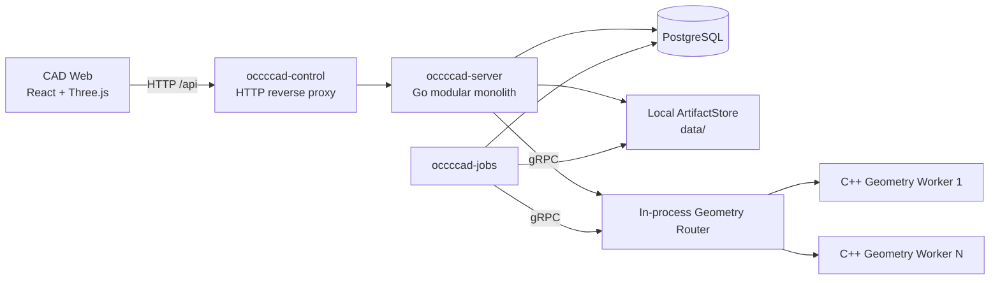
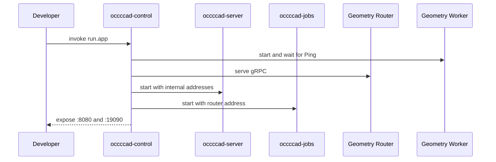
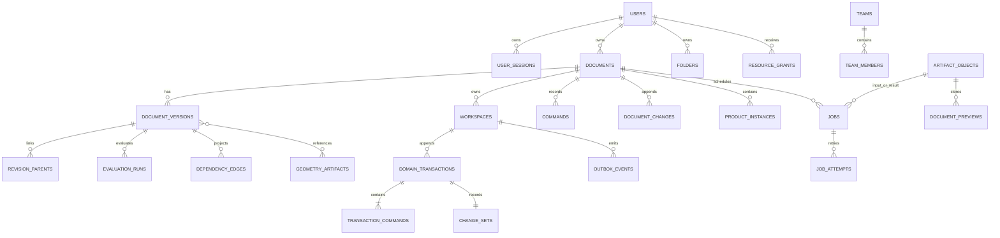
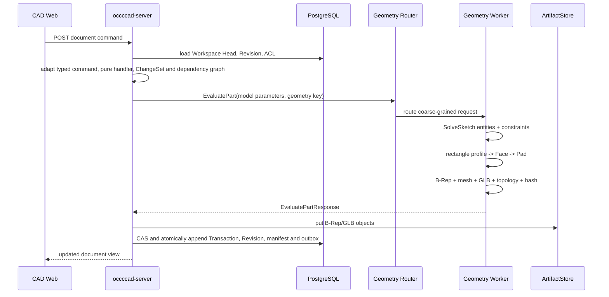
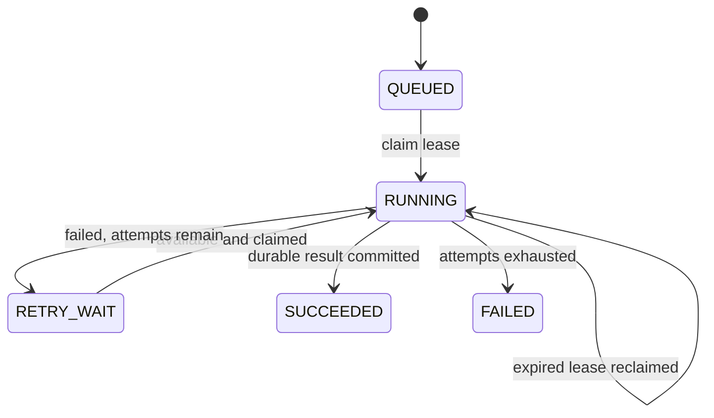
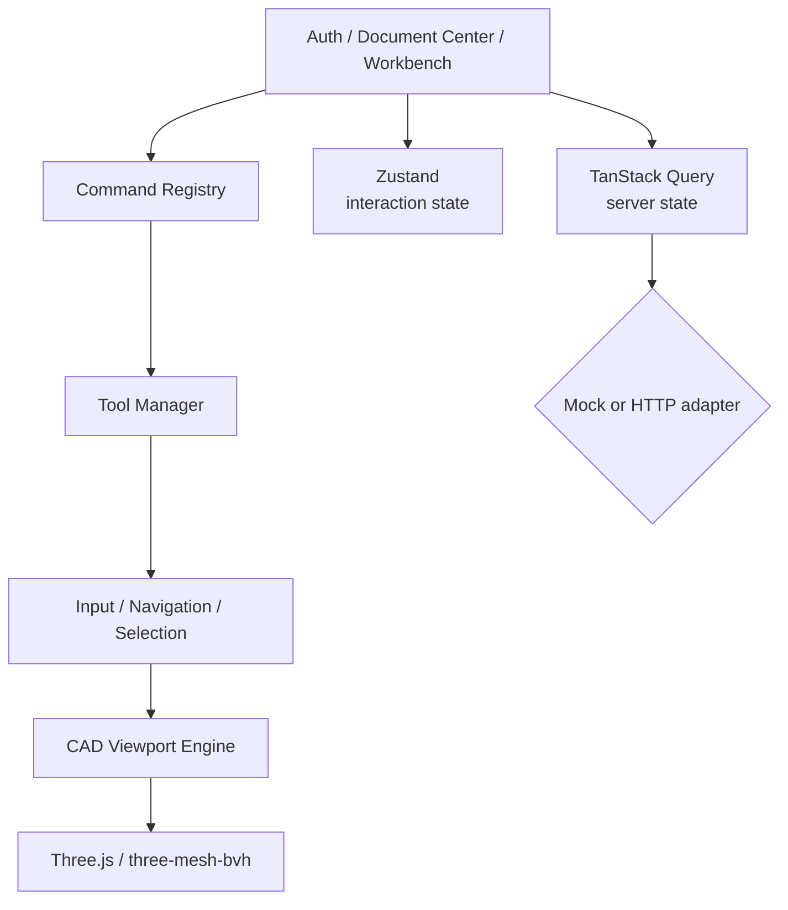

# occccad 现有架构

> 状态日期：2026-08-13
> 文档性质：事实基线。本文只描述当前仓库能够由源码、构建文件、数据库迁移和配置证明的行为；目标能力见[目标架构](TARGET_ARCHITECTURE.md)。

## 1. 结论

当前 occccad 是一个“模块化业务单体 + 持久任务进程 + C++ 几何计算 Worker + 独立 Web 应用”的早期分布式垂直切片。HTTP/WebSocket、数据库、后台任务与几何计算已经跨进程，但调度仅限本机，制品仅限共享本地目录，因此还不是真正的跨主机云平台。

图中的 `/api` 浏览器入口同时承载普通 HTTP 与 `/api/realtime` WebSocket Upgrade。`occccad-control` 是可选的本地聚合入口；单独运行时，Web、API、Jobs 和 Geometry Worker 也可分别启动。

## 2. 仓库与进程边界

| 路径/进程 | 技术 | 真实边界 |
|---|---|---|
| `web/apps/cad` | React/TypeScript/Three.js | 独立浏览器应用，可使用 Mock，或真实 REST + WebSocket API |
| `occccad-server` | Go/net/http | 身份、文档、ACL、版本、实时消息、任务提交和几何编排 |
| `occccad-jobs` | Go | PostgreSQL 任务消费者，无监听端口 |
| `occccad-migrate` | Go | 一次性数据库迁移任务 |
| `occccad-control` | Go HTTP/gRPC | 本地子进程管理、反向代理、Geometry Router、调试切流 |
| `workers/geometry` | C++/gRPC/OCCT | 精确几何、STEP、拓扑与显示制品计算 |
| `kernel/api` | C++ library | 不暴露 OCCT 类型的内核公共值类型和操作 |
| `kernel/occt` | C++ library | OCCT 适配实现，只链接进 Geometry Worker |
| `services/internal/*` | Go packages | 上述 Go 进程共享的内部模块，不是网络服务 |

每个可运行单元的启动、配置和故障语义见其目录 README。本文聚焦它们组成的系统。

## 3. 当前启动拓扑

### 3.1 统一本地模式

`invoke run.app` 构建后启动 `occccad-control`。控制进程：

1. 在 `127.0.0.1:18080` 启动 API；
2. 启动一个 Jobs 进程；
3. 在 `127.0.0.1:51001` 提供 Geometry gRPC Router；
4. 从 `127.0.0.1:51100` 起启动至少一个 C++ Worker；
5. 在 `0.0.0.0:8080` 提供稳定 HTTP 代理入口；
6. 在 `127.0.0.1:19090` 提供无认证的本机 Control API。

`invoke run.app --reset-data` 在启动控制进程前运行受保护的开发重置：删除配置数据库中固定的 `occcad` schema，清空 `OCCCCAD_DATA_DIR` 对应的本地 ArtifactStore，再从嵌入迁移重建 schema。该命令只面向当前未发布开发数据；Router、Worker resident geometry 和其他进程内状态由新进程自然重建。

### 3.2 独立模式

- `invoke run.worker`：单独启动 Geometry Worker；
- `invoke run.server`：单独启动 API；
- `invoke run.jobs`：单独启动任务消费者；
- `invoke run.web`：Mock 前端；
- `invoke run.web --mode=api`：前端代理真实 API。

当前没有容器编排清单、服务发现、跨主机 Worker 注册、分布式租户配额或生产网关。

## 4. 业务与数据模型

PostgreSQL schema 名为 `occccad`，当前迁移建立的主要关系如下。

### 4.1 Document 与 Version

- Document 类型当前为 Part 或 Product；
- Document 是容器；显式 Workspace 保存可变 Head/sequence/base，`document_versions` 是不可变 Revision 快照；
- 每个新建或复制的 Document 自动建立 `main` Workspace，旧 Document 由迁移确定性回填；可以从任意所属 Revision 创建并列出 Branch Workspace；
- Domain Transaction、typed command envelope、语义 ChangeSet、Revision parent、EvaluationRun、dependency edge 与 outbox 在 Head CAS 的同一短事务中追加；
- Restore 创建新的状态，而不是覆写历史；
- Product 保存对子文档的引用和实例 Transform，不展开复制完整子树；
- 实例可以跟随被引用文档 Head，也可以固定到 Version。

### 4.2 Command 与 Undo/Redo

HTTP transport DTO 在 API 边界转换为 `type_uri + schema_version + typed payload`，再由进程内 handler registry 执行；持久历史只保存 Domain Command，不存在第二套旧命令语义。Handler 的模型变换无数据库、网络、系统时间和 OCCT I/O；Product 外部引用先冻结，Part 几何在数据库事务外求值，提交阶段以 `(workspace head revision, head sequence)` 做 CAS。重复 request ID 只有 payload digest 相同才返回原结果。

Part 支持草图、拉伸、STEP 基础实体与参数 literal/expression 更新；Product 支持插入、移动和引用策略。Undo/Redo 以根 Domain Transaction 为稳定 identity：Revert 指向根 intent，Reapply 指向根 intent 并消费一个具体 Revert。服务端按 actor 折叠有序 action log 计算 capability，因此连续 Undo 两步可按逆序 Redo 两步；新 Domain/Restore 形成 redo boundary，但不删除历史。API 返回的 `canUndo/canRedo` 来自同一状态折叠，Web 按它置灰。删除上游实体前会检查当前结构依赖，字段 digest 或依赖冲突不会覆盖后续编辑。

### 4.3 实时消息与同文档同步

- `GET /api/realtime` 使用 `occccad.realtime.v1` WebSocket 子协议；现有 session cookie 负责身份，首条 `connection.initialize.v1` 再验证 CSRF token 和 Origin；
- JSON Envelope 支持 request/response/event/ack/error、correlation ID、版本化 type、Workspace sequence 和稳定错误；当前最大消息 1 MiB；
- Web 前端的建模命令使用 `workspace.command.execute.v1`，HTTP 命令入口仍保留并调用同一个 Workspace Service；
- 浏览器进入工作台后订阅 Document 并获得 DocumentView 快照。其他用户提交后，事务内 Outbox 由 API 轮询并向所有本机订阅者发布 `workspace.transaction.committed.v1`，浏览器刷新 Document、History、Properties 和目录投影；
- 客户端按 sequence 去重和发现 gap，断线指数退避重连并重新获取快照；服务端以 Ping/Pong 检测失联，有界 128 消息队列满时断开慢消费者；
- 当前实现多浏览器查看同一文档的提交后实时同步；presence、鼠标/选择和拖拽 preview 尚未接入 UI，多 API 实例间扇出也尚未实现。

### 4.4 参数、依赖与增量求值

- Rectangle width/height 与 Pad length 会确定性派生稳定 ParameterId 和 PropertySlot facade；
- Quantity 以 SI canonical value 和显式 Dimension 保存，当前注册 `mm/cm/m` 与 `deg/rad`，拒绝非有限值和量纲错误；
- 当前安全表达式 profile 支持数量字面量、Parameter read、括号和 `+ - * /`，在提交时完成名称绑定、单位检查、cost limit 和 dependency extraction；持久 AST 只保存 ParameterId，显示 key 重命名不破坏引用；
- Design Dependency Graph 使用稳定 key 与 typed edge，提交前检查 phase 和 cycle；handler 的 impact seed 计算 transitive dirty closure；
- 每个新模型 Revision 保存 model hash、dependency snapshot digest 和 EvaluationManifest，并投影 node input/output digest、dirty nodes 与 authoritative EvaluationRun；增量 evaluator 只在 input digest 相同才复用前一 manifest 结果，测试以清缓存冷求值为等价 oracle。

### 4.5 身份与访问控制

- 邮箱/密码登录与数据库会话 Cookie；
- 注册账号经管理员审批，平台角色为 `ADMIN` 或 `MEMBER`；
- 资源角色为 `OWNER`、`EDITOR`、`VIEWER`；
- 支持 User/Team、文件夹权限继承、文档/文件夹分享；
- API 请求绑定 Principal，成功写操作记录 Actor、Resource、Request ID 与 Trace ID 审计；
- Control API 没有认证，只能绑定环回地址。

## 5. Part 几何求值链

当前已不再保存 `origin + width + height` 测试矩形。Part 中的 `SKETCH` Feature 保存版本化 `SketchFeature v1`：Datum Plane support、具有稳定 ID 的 Point/Line、显式 GeometryRef、Constraint 和最近一次权威 solve 状态。线段持有自己的起终点；端点相接必须由 Coincident 明确表达。

Geometry Worker 内的项目自有 `SketchSolver` 已通过 `SolveSketch` 粗粒度 RPC 接入提交链，PlaneGCS 只存在于适配层内部。当前支持 Point、Line 以及 Coincident、Parallel、FixedPoint，返回 SOLVED/UNDER_CONSTRAINED/INVALID/REDUNDANT/CONFLICTING/FAILED、DoF 和约束诊断。Web 的鼠标移动预览是瞬态确定性预览；`EDIT_SKETCH` 提交后服务端求解结果才会进入不可变 Revision。

草图编辑的 ChangeSet 以最终写入 Revision 的求解后 `sketch.model` 为准，而不是命令处理器产生的求解前候选值；历史投影层能够独立读取和回写该稳定属性槽。Undo/Redo 还会从原事务不可变的 base/result Revision 重建实际 before/after，因此此前由求解前候选值生成的 ChangeSet 也可安全使用，且不放宽并发冲突检查。PlaneGCS 改写坐标、DoF 或诊断后，补偿和重放不会再产生候选值与 Revision 的 digest 冲突。

GeometryId 是 SHA-256 内容标识，不绑定 Worker。几何输出包括 B-Rep、GLB、三角形、边折线、包围盒、拓扑计数和体积。新增几何已接入本地制品对象；历史表结构仍保留部分内联数据字段。

### 5.1 PlaneGCS 技术验证边界

- 上游锁定 FreeCAD `1.0.2` commit `256fc7eff3379911ab5daf88e10182c509aa8052`；该版本原生满足仓库 C++17 基线，未为引入求解器升级全仓语言标准；
- 构建仅从 FreeCAD 官方仓库获取审计清单内的 PlaneGCS 源文件、必要支持头和许可证，每个文件都有 SHA-256 校验，不下载/链接 FreeCAD App、GUI 或 Python；
- PlaneGCS 编译为独立 `liboccccad_planegcs.so`，Eigen 3.4.0 与 header-only Boost 1.86.0 由 Conan 显式提供；FreeCAD 配置与日志依赖由 Worker 内窄兼容头隔离；
- Geometry Worker 持有项目自有 `SketchSolver`，业务头文件不暴露 `GCS::*`。构建目录同时输出 `LICENSE.FreeCAD-PlaneGCS`；
- 当前测试验证 Rectangle 宏展开后的 4 Line + 4 Coincident + 4 axis Parallel 求解、4 DoF，以及未知实体引用在调用 PlaneGCS 前失败；Go 测试还验证宏对象 ID 的确定性和一个批次内 4 实体/8 约束的原子展开。曲线、尺寸约束、拖拽 RPC、deadline 和 corpus conformance 仍属于后续工作。

### 5.2 Geometry Worker 真实 RPC

| RPC | 当前状态 | 说明 |
|---|---|---|
| `Ping` | 已实现 | 健康与 resident 数量 |
| `EvaluatePart` | 已实现 | 矩形 Pad 链与基础 B-Rep |
| `SolveSketch` | 已实现 | GeometryPool Router 转发到 Worker，执行 SketchModel v1 的权威 PlaneGCS 求解与诊断 |
| `InspectExchange` | 已实现 | 读取 STEP/BREP 制品清单，判定 Part 或可并行根组件 Product |
| `ImportExchange` | 已实现 | 从 ArtifactReference 导入一个 STEP 根或 BREP，输出 B-Rep/GLB 制品引用 |
| `ExportExchange` | 已实现 | 将一个或多个带放置的 B-Rep 制品合成为 STEP/BREP |
| `GetTopology` | 已实现 | 拓扑摘要与属性 |
| `LoadGeometry` / `UnloadGeometry` | 仅 Proto 声明 | 服务未覆盖，返回 `UNIMPLEMENTED` |
| `Tessellate` | 仅 Proto 声明 | 服务未覆盖 |
| `CreateChamfer` / `CreateFillet` | 仅 Proto 声明 | 服务未覆盖 |

这里特意区分“契约占位”和“已实现”，避免客户端基于 Proto 误判能力。

## 6. Geometry Router 与本机扩缩容

Router 实现与 GeometryWorker 相同的 gRPC 服务并转发请求。选择规则为：

1. 如果设置调试覆盖，所有请求发往调试 Worker；
2. 优先选择已知拥有目标 `geometryKey` 的 Worker；
3. 否则选择 resident + in-flight 未达到容量且负载较低的 Worker；
4. 无容量且未达最大数量时启动新进程；
5. 最后退化为选择 in-flight 最低的已有 Worker。

Worker 完成后 Router 通过 `Ping` 刷新 resident 数。失联 Worker 被移除并补足最小副本；超出最小副本的空闲 Worker 会被回收。

局限：所有注册和缓存亲和信息均在内存中；只会拉起本机进程；没有持久租约、跨节点资源报告、优先级、公平调度或租户预算。

## 7. 持久任务与制品

### 7.1 PostgreSQL 任务队列

API 使用 `(job_type, idempotency_key)` 去重提交。Jobs 进程用 `FOR UPDATE SKIP LOCKED` 领取任务，使用租约、心跳、尝试记录和延迟重试。

当前任务类型为 `EXCHANGE_IMPORT`、`EXCHANGE_EXPORT` 和 `THUMBNAIL_RENDER`。Exchange 导入先检查清单，再以最多 8 个并发调用导入独立根组件；每个组件形成带默认 DatumPlane、AxisSystem 和可扩展 `IMPORT_BODY` Feature 的 Part，多组件再形成引用这些 Part 的 Product。创建文档和后续命令共享稳定 request ID，任务重领后可继续未完成阶段。导出支持 Part 和展平后的 Product occurrence，最终格式为 STEP 或 BREP。语义是至少一次，不是恰好一次；过时缩略图会被安全跳过，文档 Head 已改变的导出任务会失败以避免输出混合版本。

### 7.2 ArtifactStore

本地后端按 SHA-256 内容寻址并原子写入 `OCCCCAD_DATA_DIR`。数据库保存对象元数据、大小、媒体类型和引用。`occccad-control` 以 `services/` 为相对路径基准，将该目录规范化为绝对路径并显式传给 API、Jobs 和每个动态 Geometry Worker；不能让子进程按各自 working directory 重新解释 `./data`。因此本地后端仍不能直接支撑无共享盘的多主机部署。

Document Center 的 `POST /api/exchange/imports` 接收原始 HTTP body，使用 `MaxBytesReader` 限制为 128 MiB，并直接以 `io.Reader` 流入 ArtifactStore；不使用 multipart、`ReadAll`、WebSocket 或 gRPC bytes 字段。`POST /api/exchange/exports` 只提交文档 ID、Head 和格式，`GET /api/jobs/{jobID}/download` 以流式响应下载结果。Geometry gRPC 只交换 opaque object key、digest、大小和媒体类型；当前 Worker 与 API/Jobs 通过相同 `OCCCCAD_DATA_DIR` 模拟对象存储。生产替换为 S3 signed upload/download 时，领域任务与 Worker 契约保持 ArtifactReference，不传本机绝对路径。

Exchange HTTP 提交只等待上传落盘和 Job 入队，随后立即关闭对话框；浏览器不轮询等待几何处理。Jobs 在最终 `SUCCEEDED` 或最终 `FAILED` 状态转换的同一 SQL statement 中写入 `JOB` Outbox，API 将 `job.state.changed.v1` 仅推送给任务发起用户。若该用户没有可接收的 WebSocket 会话，事件保持 unpublished，直到至少一个会话接受；导出成功通知提供显式下载动作，导入成功后刷新 Document Center 并可直接打开新文档。

当前 STEP 装配识别以 OCCT transferable root 为并行边界，能保存多根文件为 Product/Part 引用并保留根 Shape 自带放置；尚未使用 STEPCAF/XDE 恢复嵌套层级、名称、颜色、单位和共享实例关系，因此不能宣称完整 AP242 装配交换。

## 8. Web 应用架构

Three.js 被封装在 Viewport Engine 内，页面层不应直接操作 Scene/Renderer/Controls。统一输入系统处理 Pointer/Keyboard、导航、Tool、Selection、快捷键上下文和 Overlay。Sketcher 使用显式 `activeSketchID + plane`，不根据共面草图顺序猜测编辑目标；进入后显示独立 H/V 轴、原点和网格，只显示活动草图。Point、Line、端点和约束标记使用不同渲染 primitive，求解诊断以白/绿/紫/红显示。Point、Line、Rectangle 命令保持连续有效；两点命令支持点击—移动预览—点击，Esc 先取消当前采集、再次 Esc 返回选择；两阶段约束选择提供 hover/首选高亮和状态提示。

Mock 模式完全在浏览器运行，用于 UI 调试；它不能作为后端行为或权限正确性的证明。

## 9. 可观测性、构建与测试

- Go HTTP/gRPC 使用结构化日志和 OpenTelemetry Trace Context；
- 配置 OTLP 端点时导出 Trace，未配置时仍生成关联 ID；
- C++ Worker 记录 RPC、request ID 和 traceparent；
- 数据库迁移使用 Advisory Lock、事务和 checksum；
- C++ 由 CMake 3.30+、Conan 2、Ninja 构建，当前标准 C++17；
- 当前固定 OCCT 7.9.1 和 gRPC C++ 1.71.0；
- Go module 当前声明 Go 1.26.5；
- Web 锁定 pnpm 11.20.0，并执行 TypeScript 检查和 Vite 构建。

仓库包含 Go 单元/边界测试以及 C++ 测试配置。Web 的 `test:sketch` 使用 Vite SSR 加载真实 Tool 模块，覆盖 Rectangle 点击—移动—点击、Esc 分层取消、Point 标准元素提交、两阶段 Coincident 和 Point/Line 独立渲染数据；更完整的浏览器/WebGL E2E 仍待补充。根 README 中曾出现过不存在的 `tests/geometry` 目录，现已按真实结构修正。

## 10. 已实现与未实现矩阵

| 能力 | 状态 | 证据边界 |
|---|---|---|
| Part/Product 文档与版本 | 已实现基础闭环 | Go workspace、迁移、REST/WebSocket API |
| 账号、团队、ACL、审计 | 已实现基础闭环 | authn/access/API/迁移 |
| 矩形草图与 Pad | 已实现 | Web 命令、Proto、OCCT Worker |
| STEP/BREP Part 与多根 Product 导入导出 | 已实现基础闭环 | Document Center、流式 HTTP、持久任务与 ArtifactReference Worker |
| 本机 Geometry 扩缩容 | 已实现 | occccad-control |
| 跨主机 Geometry 调度 | 未实现 | 无注册中心/集群调度 |
| 二维草图与基础约束 | 已实现首个模板 | SketchFeature v1、Point/Line、Coincident/Parallel/FixedPoint、PlaneGCS 与 Sketcher 交互 |
| 三维装配约束/运动学 | 未实现 | Product 只有 Transform |
| 持久拓扑命名 | 未实现 | 当前 local ID 不可作长期 Feature 引用 |
| S3 兼容对象存储/CDN | 未实现 | 当前仅本地目录 |
| 实时多人同文档编辑 | 已实现首个提交同步闭环 | WebSocket request/event、Outbox、sequence、重连快照；尚无 presence/preview 与 semantic rebase |
| XDE/AP242 语义装配交换 | 未实现 | 当前仅按 transferable root 构建 Product，未恢复嵌套 BOM/颜色/共享实例 |
| 大装配 LOD/流式加载 | 未实现 | 当前为基础 GLB 显示 |
| 曲面、钣金、工程图、CAM、CAE | 未实现 | 无对应领域模型与 Worker |

## 11. 当前主要风险

1. **草图能力仍窄**：模型与交互模板已经建立，但尺寸约束、圆弧/样条、Trim、拖拽求解和通用 Profile Builder 尚未实现。
2. **拓扑引用不稳定**：面/边 local ID 只适合本次结果查询，不能支撑可靠圆角、倒角和下游引用。
3. **制品无法跨主机**：本地文件系统阻止 API/Jobs/Worker 任意调度。
4. **控制器仅为开发工具**：进程级 Router 不是集群 Scheduler。
5. **长计算边界不完整**：交换文件的 HTTP 流允许 15 分钟，但同步 Part 求值仍受 Geometry client 的短 deadline 限制；复杂再生尚未全部任务化。
6. **协议超前于实现**：部分 Proto RPC 未实现，版本化和能力协商尚未建立。
7. **测试金字塔不完整**：缺少模型语料库、确定性回归、大装配基准和浏览器 E2E。

这些风险决定了下一阶段应先建立模型内核、拓扑命名、约束求解和可重建制品协议，而不是先增加大量微服务。

## 12. 当前架构不变量

后续修改在显式架构决策改变前应维持以下规则：

- Document/Version/Command 是业务真相；Geometry 是派生结果；
- 任何持久引用都不能包含 Worker 地址或进程局部句柄；
- OCCT 类型不能穿过 `kernel/occt` 边界进入网络协议；
- 浏览器不执行权威 B-Rep 计算；
- 长任务必须可重试，成功条件是结果和状态均已持久化；
- 精确 B-Rep 与显示 Mesh/GLB 分离；
- 新能力先形成清晰模块边界，满足独立扩缩容或隔离需求后再拆进程。
