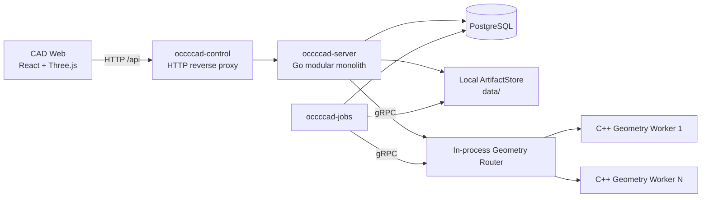
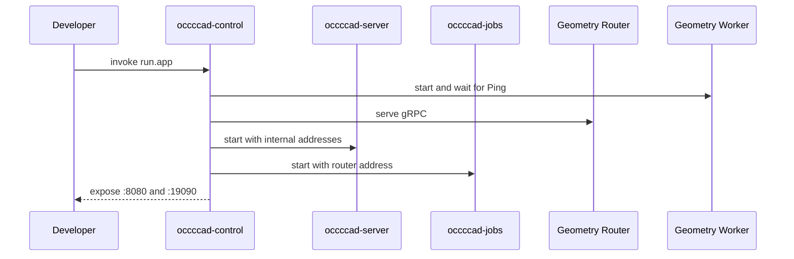
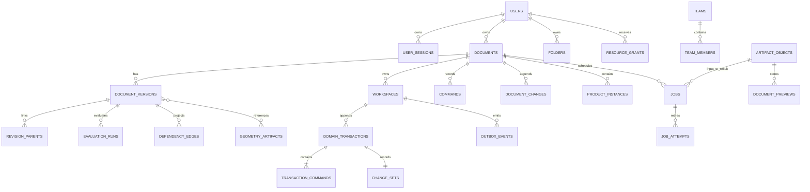
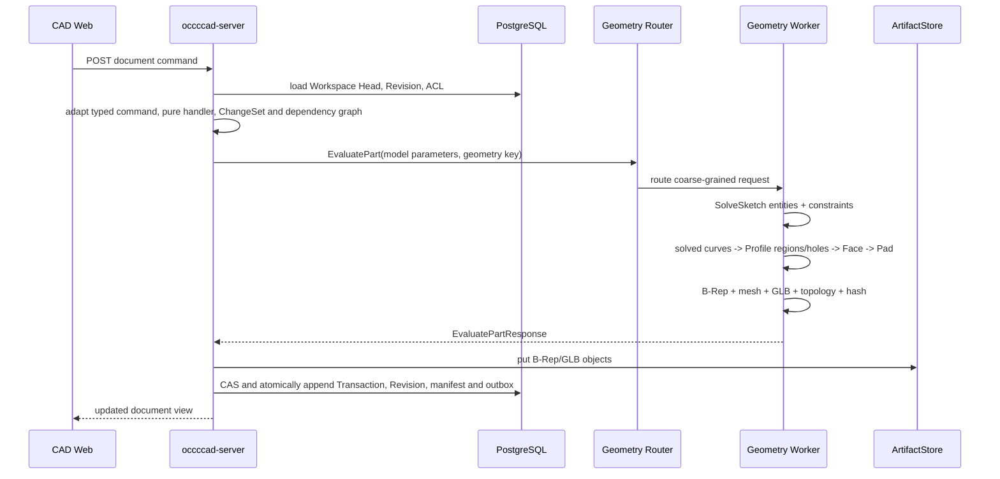
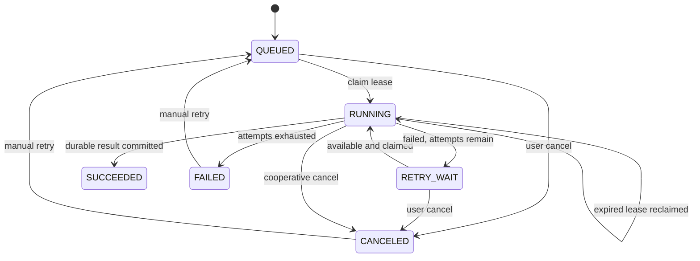
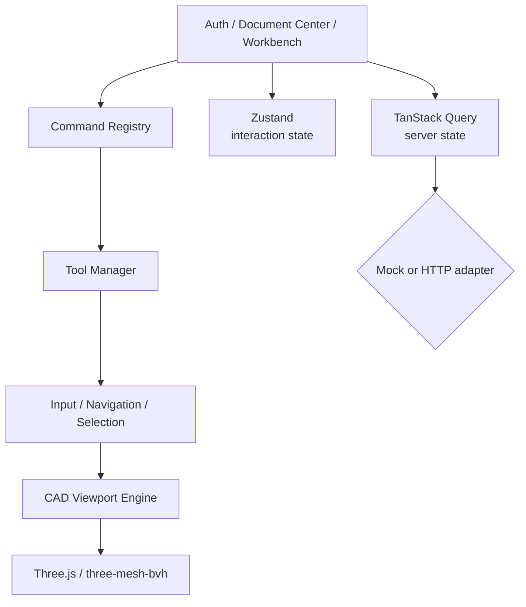

# occccad 现有架构

> 状态日期：2026-08-28
> 文档性质：事实基线。本文只描述当前仓库能够由源码、构建文件、数据库迁移和配置证明的行为；目标能力见[目标架构](TARGET_ARCHITECTURE.md)。

## 1. 结论

当前 occccad 是一个“模块化业务单体 + 持久任务进程 + C++ 几何计算 Worker + 独立 Web 应用”的早期分布式垂直切片。HTTP/WebSocket、数据库、后台任务与几何计算已经跨进程，但调度仅限本机，制品仅限共享本地目录，因此还不是真正的跨主机云平台。

图中的 `/api` 浏览器入口同时承载普通 HTTP 与 `/api/realtime` WebSocket Upgrade。`occccad-control` 是可选的本地聚合入口；单独运行时，Web、API、Jobs 和 Geometry Worker 也可分别启动。

## 2. 仓库与进程边界

| 路径/进程 | 技术 | 真实边界 |
|---|---|---|
| `web/apps/cad` | React/TypeScript/Three.js | 独立浏览器应用，可使用 Mock，或真实 REST + WebSocket API |
| `occccad-server` | Go/net/http | 身份、文档、ACL、版本、实时消息、任务提交和几何编排 |
| `occccad-jobs` | Go | PostgreSQL 任务消费者，无监听端口 |
| `occccad-migrate` | Go | 一次性数据库迁移任务 |
| `occccad-control` | Go HTTP/gRPC | 本地子进程管理、反向代理、Geometry Router、调试切流 |
| `workers/geometry` | C++/gRPC/OCCT | 精确几何、STEP、拓扑与显示制品计算 |
| `kernel/api` | C++ library | 不暴露 OCCT 类型的内核公共值类型和操作 |
| `kernel/occt` | C++ library | OCCT 适配实现，只链接进 Geometry Worker |
| `services/internal/*` | Go packages | 上述 Go 进程共享的内部模块，不是网络服务 |

每个可运行单元的启动、配置和故障语义见其目录 README。本文聚焦它们组成的系统。

## 3. 当前启动拓扑

### 3.1 统一本地模式

`invoke run.app` 构建后启动 `occccad-control`。控制进程：

1. 在 `127.0.0.1:18080` 启动 API；
2. 启动一个 Jobs 进程；
3. 在 `127.0.0.1:51001` 提供 Geometry gRPC Router；
4. 从 `127.0.0.1:51100` 起启动至少一个 C++ Worker；
5. 在 `0.0.0.0:8080` 提供稳定 HTTP 代理入口；
6. 在 `127.0.0.1:19090` 提供无认证的本机 Control API。

`invoke run.app --reset-data` 在启动控制进程前运行受保护的开发重置：删除配置数据库中固定的 `occcad` schema，清空 `OCCCCAD_DATA_DIR` 对应的本地 ArtifactStore，再从嵌入迁移重建 schema。该命令只面向当前未发布开发数据；Router、Worker resident geometry 和其他进程内状态由新进程自然重建。

### 3.2 独立模式

- `invoke run.worker`：单独启动 Geometry Worker；
- `invoke run.server`：单独启动 API；
- `invoke run.jobs`：单独启动任务消费者；
- `invoke run.web`：Mock 前端；
- `invoke run.web --mode=api`：前端代理真实 API。

当前没有容器编排清单、服务发现、跨主机 Worker 注册、分布式租户配额或生产网关。

## 4. 业务与数据模型

PostgreSQL schema 名为 `occccad`，当前迁移建立的主要关系如下。

### 4.1 Document 与 Version

- Document 类型当前为 Part 或 Product；
- Document 以 UUID `id` 为唯一身份，`name` 是允许重复的显示属性；创建界面按已有名称提供首个可用的 `PartN`/`ProductN` 默认值，但默认值和名称都不参与身份或引用解析；
- Document 是容器；显式 Workspace 保存可变 Head/sequence/base，`document_versions` 是不可变 Revision 快照；
- 每个新建或复制的 Document 自动建立 `main` Workspace，旧 Document 由迁移确定性回填；可以从任意所属 Revision 创建并列出 Branch Workspace；
- Domain Transaction、typed command envelope、语义 ChangeSet、Revision parent、EvaluationRun、dependency edge 与 outbox 在 Head CAS 的同一短事务中追加；
- Restore 创建新的状态，而不是覆写历史；
- Product 保存对子文档的引用和实例 Transform，不展开复制完整子树；
- 实例可以跟随被引用文档 Head，也可以固定到 Version。

### 4.2 Command 与 Undo/Redo

HTTP transport DTO 在 API 边界转换为 `type_uri + schema_version + typed payload`，再由进程内 handler registry 执行；持久历史只保存 Domain Command，不存在第二套旧命令语义。Handler 的模型变换无数据库、网络、系统时间和 OCCT I/O；Product 外部引用先冻结，Part 几何在数据库事务外求值，提交阶段以 `(workspace head revision, head sequence)` 做 CAS。重复 request ID 只有 payload digest 相同才返回原结果。

Part 支持草图、拉伸、STEP 基础实体与参数 literal/expression 更新；Product 支持插入、移动和引用策略。Specification Tree 是服务端模型投影：节点携带稳定领域 identity、owner 和允许的 capability，当前 Feature、Product Instance、Sketch Entity/Constraint 可按模型状态开放 `DELETE`，而 Document、Body、Origin、Datum Plane、Axis System/Axis 和引用子树默认受保护。删除仍是版本化 Domain Command；删除草图实体会在同一 `sketch.model` 变更中级联删除全部引用约束，删除 Feature 则先检查下游依赖。Undo/Redo 以根 Domain Transaction 为稳定 identity：Revert 指向根 intent，Reapply 指向根 intent 并消费一个具体 Revert。服务端按 actor 折叠有序 action log 计算 capability，因此连续 Undo 两步可按逆序 Redo 两步；新 Domain/Restore 形成 redo boundary，但不删除历史。API 返回的 `canUndo/canRedo` 来自同一状态折叠，Web 按它置灰。字段 digest 或依赖冲突不会覆盖后续编辑。

### 4.3 实时消息与同文档同步

- `GET /api/realtime` 使用 `occccad.realtime.v1` WebSocket 子协议；现有 session cookie 负责身份，首条 `connection.initialize.v1` 再验证 CSRF token 和 Origin；
- JSON Envelope 支持 request/response/event/ack/error、correlation ID、版本化 type、Workspace sequence 和稳定错误；当前最大消息 1 MiB；
- Web 前端的建模命令使用 `workspace.command.execute.v1`，HTTP 命令入口仍保留并调用同一个 Workspace Service；
- 浏览器进入工作台后订阅 Document 并获得 DocumentView 快照。其他用户提交后，事务内 Outbox 由 API 轮询并向所有本机订阅者发布 `workspace.transaction.committed.v1`，浏览器刷新 Document、History、Properties 和目录投影；
- 客户端按 sequence 去重和发现 gap，断线指数退避重连并重新获取快照；服务端以 Ping/Pong 检测失联，有界 128 消息队列满时断开慢消费者；
- 当前实现多浏览器查看同一文档的提交后实时同步；presence、鼠标/选择和拖拽 preview 尚未接入 UI，多 API 实例间扇出也尚未实现。

### 4.4 参数、依赖与增量求值

- Rectangle width/height 与 Pad length 会确定性派生稳定 ParameterId 和 PropertySlot facade；
- Quantity 以 SI canonical value 和显式 Dimension 保存，当前注册 `mm/cm/m` 与 `deg/rad`，拒绝非有限值和量纲错误；
- 当前安全表达式 profile 支持数量字面量、Parameter read、括号和 `+ - * /`，在提交时完成名称绑定、单位检查、cost limit 和 dependency extraction；持久 AST 只保存 ParameterId，显示 key 重命名不破坏引用；
- Design Dependency Graph 使用稳定 key 与 typed edge，提交前检查 phase 和 cycle；handler 的 impact seed 计算 transitive dirty closure；
- 每个新模型 Revision 保存 model hash、dependency snapshot digest 和 EvaluationManifest，并投影 node input/output digest、dirty nodes 与 authoritative EvaluationRun；增量 evaluator 只在 input digest 相同才复用前一 manifest 结果，测试以清缓存冷求值为等价 oracle。

### 4.5 身份与访问控制

- 邮箱/密码登录与数据库会话 Cookie；
- 注册账号经管理员审批，平台角色为 `ADMIN` 或 `MEMBER`；
- 资源角色为 `OWNER`、`EDITOR`、`VIEWER`；
- 支持 User/Team、文件夹权限继承、文档/文件夹分享；
- API 请求绑定 Principal，成功写操作记录 Actor、Resource、Request ID 与 Trace ID 审计；
- Control API 没有认证，只能绑定环回地址。

## 5. Part 几何求值链

当前已不再保存 `origin + width + height` 测试矩形。Part 中的 `SKETCH` Feature 保存版本化 `SketchFeature v1`：Datum Plane support、具有稳定 ID 的 Point/Line/Circle/Arc/Spline、显式 GeometryRef、Constraint 和最近一次权威 solve 状态。线段、圆弧和开放曲线持有可稳定引用的端点；端点相接必须由 Coincident 明确表达，不能以浮点坐标接近替代模型关系。

Geometry Worker 内的项目自有 `SketchSolver` 已通过 `SolveSketch` 粗粒度 RPC 接入提交链，PlaneGCS 只存在于适配层内部。当前支持 Coincident、Parallel、Fixed、Horizontal、Vertical、Perpendicular、Tangent、Equal、Distance、Length、Radius、Diameter、Angle、Concentric、PointOnObject、Midpoint 和 Symmetry；Symmetry 支持“点—直线—点”的轴对称及“点—点—点”的中心对称。维度明确携带 `mm` 或 `deg`，返回 SOLVED/UNDER_CONSTRAINED/INVALID/REDUNDANT/CONFLICTING/FAILED、DoF 和约束诊断。宏生成的 `internal` 约束仍参与求解和冲突诊断，但其纯冗余项不阻止整个原子宏提交；用户显式添加的无关冗余约束继续报告 REDUNDANT。Symmetry 属于包含两个标量方程的复合设计意图；当其基于内置 U/V 轴且其中一个方程已被同一线段的 Horizontal/Vertical/对应轴 Parallel 隐含时，适配层保留 Symmetry 并只容忍这一组关联冗余，冲突和其他冗余仍失败。当前 `Spline` 命令把采集点解释为曲线必须经过的拟合点：Web 用确定性插值折线预览与拾取，Profile Builder 用同语义采样检查区域，OCCT 用 `GeomAPI_Interpolate` 构造精确曲线；这些拟合点参与持久化、自由度与固定/端点关系，但尚未接入 PlaneGCS 的完整样条相切/曲率约束。Web 的鼠标移动预览是瞬态确定性预览；`EDIT_SKETCH` 提交后服务端求解结果才会进入不可变 Revision。

Pad 已不再调用四条轴对齐直线特判。OCCT-free Profile Builder 排除 Construction/Point，以 Coincident 等价类构建 Line/Arc/开放 Spline 端点图，并把 Circle/闭合 Spline 作为闭环；它拒绝开放端、T-junction、重叠/相交和自交，确定性遍历环，按包含深度区分外环、孔和岛，并生成稳定 ProfileLoop/ProfileRegion identity。`EvaluatePart.profile_pads` 将有向曲线和孔环送入 OCCT，后者构造 Edge/Wire/Face、执行 BRepCheck，再沿草图平面法向 Prism；一个草图中的多个偶数深度区域会一并拉伸。当前 Pad 仍以整个 Sketch 为 profile selection，尚未提供单独区域的视口选择。

草图编辑的 ChangeSet 以最终写入 Revision 的求解后 `sketch.model` 为准，而不是命令处理器产生的求解前候选值；历史投影层能够独立读取和回写该稳定属性槽。Undo/Redo 对持久 ChangeSet 先验证稳定 write-set 的 target/slot 唯一性，再从原事务不可变的 base/result Revision 重建实际 before/after 和 digest，最后执行当前值冲突检查；因此旧版本中已写入错误 digest 的求解后草图事务也能修复并回滚，但不会信任旧 ChangeSet 内容或放宽并发冲突检查。PlaneGCS 改写坐标、DoF 或诊断后，补偿和重放不会再产生候选值与 Revision 的 digest 冲突。

GeometryId 是精确 Body B-Rep 的 SHA-256 内容标识，不绑定 Worker；`geometry_key` 标识带 evaluator 和 Part 显示语义的求值结果，因此两个结果可以共享 GeometryId，但拥有不同的可视化制品。几何输出包括 B-Rep、GLB、三角形、边折线、包围盒、拓扑计数和体积。新增几何已接入本地制品对象；历史表结构仍保留部分内联数据字段。

每个 Part 求值结果还持有 schema v1 `VisualizationManifest`，并镜像到最终 GLB 的 `OCCCCAD_visualization` 扩展。Manifest 统一包含 DatumPlane/AxisSystem 和可选择的非实体 primitive；当前草图 Point 映射为 `POINTS`，Line/Circle/Arc/Spline 映射为 `POLYLINE`。全部几何约束映射为带约束类型的 `POINTS` glyph anchor；Distance/Length/Radius/Diameter/Angle 映射为 `LINE_SEGMENTS` 引线、箭头以及 label/labelPosition。约束 primitive 还携带 `relatedEntityIds`，使约束的视口/结构树 hover 和 select 同时作用于标记及全部引用草图元素。每个 primitive 保存稳定 entity/constraint ID、所属 FeatureId、类型、PROFILE/CONSTRUCTION role、求解状态和 Part 坐标。协议预留 `TRIANGLES`，供后续独立曲面显示使用，但当前尚未交付三维曲线/曲面建模命令。对象存储路径会读取 Worker 基础 GLB、注入 Manifest 后再登记最终不可变 GLB，不依赖数据库旁路元数据。

Web 的 Part 与 Product occurrence 共用同一个 Visualization renderer 和 selection identity builder。Product 只在 Part primitive 上施加 occurrence Transform；不会重新解释 SketchModel，也不会维护装配专用草图副本。因此零件中的点线样式、约束符号、可见性和稳定选择会原样出现在装配中。结构树在每个 Sketch 下投影 Geometry 与 Constraints 分组及其稳定子节点；草图实体和每条约束的显示 primitive 与树节点共享 selection identity，支持 Part/Product 中的树/视口双向选择和预选高亮。约束 primitive 是带 provenance 的可重建显示制品，不是参数模型之外的第二份业务状态。

活动 Sketch 的原点和 U/V 轴是稳定的内置 GeometryRef，而不是临时渲染对象：原点参与点类签名，U/V 轴参与直线/求解曲线签名，因此 Coincident、Parallel、Perpendicular、Tangent、PointOnObject、Angle、Symmetry 和点线 Distance 共用同一选择与服务端验证语义。线性尺寸当前覆盖线长、点点距离和点到直线/U/V 轴距离。圆与圆弧中心、圆弧和开放 Spline 端点均作为独立点标记显示和拾取；Line、Arc、Polyline、Spline、Rectangle 与独立 Point 命中已有稳定点时，会在同一原子编辑中写入显式 Coincident。结构树双击 Sketch 直接进入该 Sketch 的编辑上下文。

Sketch Entity 的 `PROFILE`/`CONSTRUCTION` role 是持久领域状态。结构树右键可在“轮廓元素/构造元素”之间切换，操作形成普通 `EDIT_SKETCH` Transaction，经过权威求解、最终 ChangeSet 和 Undo/Redo；Profile Builder 只消费 `PROFILE`，因此构造线、构造曲线和构造点不会进入 Pad。活动 Sketch 的 U/V 轴与原点采用相同的参考几何语义，但不作为可写 Sketch Entity 持久化。权威 VisualizationManifest 为 Circle/Arc 生成中心点、为 Arc 生成端点、为 Spline 生成全部拟合点；Select 工具拖动 Arc/Circle 中心或 Spline 拟合点时只显示瞬态点预览，并在 pointerup 提交一次 `UPDATE_ENTITY_POINT`。

### 5.1 PlaneGCS 技术验证边界

- 上游锁定 FreeCAD `1.0.2` commit `256fc7eff3379911ab5daf88e10182c509aa8052`；该版本原生满足仓库 C++17 基线，未为引入求解器升级全仓语言标准；
- 构建仅从 FreeCAD 官方仓库获取审计清单内的 PlaneGCS 源文件、必要支持头和许可证，每个文件都有 SHA-256 校验，不下载/链接 FreeCAD App、GUI 或 Python；
- PlaneGCS 编译为独立 `liboccccad_planegcs.so`，Eigen 3.4.0 与 header-only Boost 1.86.0 由 Conan 显式提供；FreeCAD 配置与日志依赖由 Worker 内窄兼容头隔离；
- Geometry Worker 持有项目自有 `SketchSolver`，业务头文件不暴露 `GCS::*`。构建目录同时输出 `LICENSE.FreeCAD-PlaneGCS`；
- 当前测试验证 Rectangle 宏求解、未知引用失败、Circle Radius + Line Tangent、Profile 外环/孔、Arc + Line 混合闭环、开放/T-junction 诊断，以及 OCCT 圆环 Pad 的体积和有效拓扑。拖拽 RPC、完整 B-Spline 约束和大规模 corpus conformance 仍属于后续工作。

### 5.2 Geometry Worker 真实 RPC

| RPC | 当前状态 | 说明 |
|---|---|---|
| `Ping` | 已实现 | 健康与 resident 数量 |
| `EvaluatePart` | 已实现 | ProfileRegion/孔环 Pad 链、基础 B-Rep；保留旧矩形字段作为当前开发期过渡入口 |
| `SolveSketch` | 已实现 | GeometryPool Router 转发到 Worker，执行 SketchModel v1 的权威 PlaneGCS 求解与诊断 |
| `InspectExchange` | 已实现 | 读取 STEP/BREP 制品清单，判定 Part 或可并行根组件 Product |
| `ImportExchange` | 已实现 | 从 ArtifactReference 导入一个 STEP 根或 BREP，输出 B-Rep/GLB 制品引用 |
| `ExportExchange` | 已实现 | 将一个或多个带放置的 B-Rep 制品合成为 STEP/BREP |
| `GetTopology` | 已实现 | 拓扑摘要与属性；同一 GeometryId 的完整拓扑分析在 Worker 内只计算一次 |
| `LoadGeometry` / `UnloadGeometry` | 仅 Proto 声明 | 服务未覆盖，返回 `UNIMPLEMENTED` |
| `Tessellate` | 仅 Proto 声明 | 服务未覆盖 |
| `CreateChamfer` / `CreateFillet` | 仅 Proto 声明 | 服务未覆盖 |

这里特意区分“契约占位”和“已实现”，避免客户端基于 Proto 误判能力。

## 6. Geometry Router 与本机扩缩容

Router 实现与 GeometryWorker 相同的 gRPC 服务并转发请求。当前 Part 只有一个权威求值 Body，因此其 `GeometryId` 就是驻留原子；同一 Part 的面/边/点查询以及 Product occurrence 引用复用这个原子。未来多 Body Part 必须为每个 Body 产生独立不可变 GeometryId/Artifact，不能以文档 ID 把多个 Body 强制绑在一起。选择规则为：

1. 如果设置调试覆盖，所有请求发往调试 Worker；
2. 优先选择已拥有目标 `GeometryId`/`geometryKey` 的 Worker；首次冷请求在发出 RPC 前即预留 owner，因此并发请求不会把同一 Body 加载到多个 Worker；
3. 否则选择 resident + in-flight 未达到容量且负载较低的 Worker；
4. 无容量且未达最大数量时启动新进程；
5. 最后退化为选择 in-flight 最低的已有 Worker。

`GetTopology` 从 Artifact 恢复 B-Rep 后会立即把请求 GeometryId 绑定到实际 Worker；后续元素查询即使 `OCCCCAD_GEOMETRY_PER_WORKER=1` 也绕过普通容量选择并命中同一 owner。Worker 对每个 GeometryId 缓存完整 `TopologyInfo`，单面查询只过滤缓存结果，不再重复遍历并分析整个 OCCT Shape。Worker 完成后 Router 通过 `Ping` 刷新 resident 数。失联 Worker 被移除并补足最小副本；超出最小副本且 `resident=0` 的空 Worker 才会在超时后回收，驻留 Body 不会被空闲缩容静默丢弃。

局限：所有注册和缓存亲和信息均在内存中；只会拉起本机进程；没有持久租约、跨节点资源报告、优先级、公平调度或租户预算。

## 7. 持久任务与制品

### 7.1 PostgreSQL 任务队列

API 使用 `(job_type, idempotency_key)` 去重提交。Jobs 进程用 `FOR UPDATE SKIP LOCKED` 领取任务，使用租约、心跳、尝试记录和延迟重试。

当前任务类型为 `EXCHANGE_IMPORT`、`EXCHANGE_EXPORT` 和 `THUMBNAIL_RENDER`。任务可显式标记为用户可见；自动缩略图不进入消息中心。`THUMBNAIL_RENDER` 使用 `svg-v3` 生成固定 `320×200`（`8:5`）SVG：平滑顶点法线负责曲面光照，边界/轮廓/强折线单独绘制，三角面不绘制低对比度逐面片边框。默认 `5s` deadline 可由 `OCCCCAD_THUMBNAIL_RENDER_TIMEOUT` 调整；超时会持久化默认 SVG，预览 HTTP 入口在任务尚未完成或制品不可用时也返回同一固定尺寸默认 SVG。Exchange 导入先检查清单，再以最多 8 个并发调用导入独立根组件；每个组件形成带默认 DatumPlane、AxisSystem 和可扩展 `IMPORT_BODY` Feature 的 Part，多组件再形成引用这些 Part 的 Product。导入文档名使用经路径清理后的完整文件名，保留 `.step`/`.brep` 后缀。创建文档和后续命令共享稳定 request ID，任务重领后可继续未完成阶段。导出支持 Part 和展平后的 Product occurrence，最终格式为 STEP 或 BREP。Product STEP 导出对每个 occurrence 单独 Transfer 一个带 placement 的 root，因此当前展平 Product 导出再导入仍被识别为 Product，而不会因先合并为 compound 而退化为 Part。语义是至少一次，不是恰好一次；过时缩略图会被安全跳过，文档 Head 已改变的导出任务会失败以避免输出混合版本。

用户可通过 `POST /api/jobs/{jobID}/cancel` 取消自己发起的排队或运行任务，并通过 `POST /api/jobs/{jobID}/retry` 让最终失败或已取消任务重新排队。运行任务每秒检查取消请求并取消其 Geometry 上下文；成功提交条件同时拒绝带取消请求的迟到结果。导入在进度 70% 进入正式文档提交阶段，此后不再开放取消，避免产生用户可见的半提交组件集合。Worker 在检查、几何转换、文档提交和制品登记等阶段单调更新进度。

### 7.2 ArtifactStore

本地后端按 SHA-256 内容寻址并原子写入 `OCCCCAD_DATA_DIR`。数据库保存对象元数据、大小、媒体类型和引用。`occccad-control` 以 `services/` 为相对路径基准，将该目录规范化为绝对路径并显式传给 API、Jobs 和每个动态 Geometry Worker；不能让子进程按各自 working directory 重新解释 `./data`。因此本地后端仍不能直接支撑无共享盘的多主机部署。

Document Center 的 `POST /api/exchange/imports` 接收原始 HTTP body，使用 `MaxBytesReader` 限制为 128 MiB，并直接以 `io.Reader` 流入 ArtifactStore；不使用 multipart、`ReadAll`、WebSocket 或 gRPC bytes 字段。`POST /api/exchange/exports` 只提交文档 ID、Head 和格式，`GET /api/jobs/{jobID}/download` 以流式响应下载结果。Geometry gRPC 只交换 opaque object key、digest、大小和媒体类型；当前 Worker 与 API/Jobs 通过相同 `OCCCCAD_DATA_DIR` 模拟对象存储。生产替换为 S3 signed upload/download 时，领域任务与 Worker 契约保持 ArtifactReference，不传本机绝对路径。

Exchange HTTP 提交只等待上传落盘和 Job 入队，随后立即关闭对话框；浏览器不会让提交请求等待几何处理。Jobs 在最终 `SUCCEEDED`、最终 `FAILED` 或 `CANCELED` 状态转换的同一 SQL statement 中写入 `JOB` Outbox，API 将 `job.state.changed.v1` 仅推送给任务发起用户。若该用户没有可接收的 WebSocket 会话，事件保持 unpublished，直到至少一个会话接受。Web 顶部消息中心同时从 `GET /api/jobs` 恢复最近 100 条用户可见任务，因此错过瞬时通知或重新登录后仍能看到状态、失败原因、进度和下载/打开入口；仅在存在活动任务时每 2.5 秒刷新进度，终态仍由 WebSocket 立即提示。前端把持久 Job 投影为通用 ActivityItem，任务类型展示与动作注册集中在 activity 模块，未来其他持久消息来源可增加独立 projector 后合并，而不复制 Drawer 或任务状态机。

当前 STEP 装配识别以 OCCT transferable root 为并行边界，能保存多根文件为 Product/Part 引用并保留根 Shape 自带放置；Product 导出同样保持“每个 occurrence 一个 transferable root”的当前对称契约。这只保证展平 Product 的类型和 placement round-trip；尚未使用 STEPCAF/XDE 恢复嵌套层级、名称、颜色、单位和共享实例关系，因此不能宣称完整 AP242 装配交换。

## 8. Web 应用架构

Three.js 被封装在 Viewport Engine 内，页面层不应直接操作 Scene/Renderer/Controls。统一输入系统处理 Pointer/Keyboard、导航、Tool、Selection、Capture 和 Overlay；Toolbar 命令不注册快捷键，Enter/Esc 只保留为多阶段手势的完成/取消输入，视图区底部不再显示工具提示条。Part Design、Sketcher、Assembly、历史与视图 Toolbar 使用同一套无文字、统一描边的 CAD 语义 SVG；Sketcher 将基础几何、几何约束、尺寸约束和常用图形拆为四个可拖动 Toolbar，常用图形统一为矩形、正六边形和圆。Distance 与 Length 共用一个线性尺寸工具：首次命中直线主体形成 Length，首次命中点后继续选择第二点形成 Distance；Radius、Diameter、Angle 保持独立尺寸类型。约束定义声明按顺序允许的拾取类型/数量、符号、尺寸类型和单位；相切排除 Spline 与 line-line，相等的第二个引用按首个引用限制为 line-line 或 circle/arc pair。Go 命令验证层再次执行相同的类型不变量，UI 过滤不是唯一正确性边界。所有创建/约束按钮统一为单击执行一个逻辑操作后回到选择、双击进入连续模式。Point、Line、Circle、Arc、Polyline、Spline 和 Rectangle 共用完整手势生命周期；Polyline/Spline 以双击或 Enter 结束本次多点采集。创建工具只上报 Point/Line/Circle 三类基础预览几何，由统一策略派生瞬态尺寸、精度和位置；矩形上报两条正交基线、正六边形上报一条代表边，后续复合工具无需自定义尺寸字符串。参考尺寸和持久尺寸 label 都以 CSS pixel 为目标，在每次渲染前根据相机深度/FOV/Viewport 高度反算 world scale，因此缩放长尺寸时保持固定屏幕大小。显示/输入精度统一为长度 2 位、角度 1 位小数；10 mm 网格是吸附步距，`0.01 mm` 是退化几何提交阈值，二者不再混用。尺寸约束按“选择引用 → 从当前已求解几何测量初值 → 移动并点击放置 → 内联编辑 → Enter 提交”的状态机创建；创建后的尺寸可在约束 glyph 或结构树叶节点上双击，并通过同一个编辑器提交 `UPDATE_CONSTRAINT_VALUE`。视口双击由 Pointer 手势状态机基于时间、位移和完整 down/up 序列识别，不依赖浏览器不稳定的 `PointerEvent.detail`。长度、两点距离、半径、直径和夹角均使用实际几何初值，不再要求用户从空值开始输入。

Capture 策略是独立于当前 Tool 和持久 Selection 的可恢复交互状态，默认全部开启。三维选择过滤覆盖点/顶点、曲线/边、曲面/面、实体/特征、草图、草图约束、基准面、基准轴/坐标系和装配实例；草图吸附过滤覆盖 10 mm 网格点、原点、独立点、端点、圆/圆弧中心、中点和曲线投影，并提供“全部”和“仅点”预设。Line、Circle、Arc 和 Spline 都进入同一个候选求解器，其中曲线投影使用显示采样折线作交互近似，提交后仍由权威 evaluator 验证。端点/独立点候选的语义优先级高于网格；Line 的起点或终点命中已有稳定点引用时，同一 `EDIT_SKETCH` batch 会同时创建实体和显式 Coincident，而不是只保存相同浮点坐标。SelectionIndex 会在按距离和语义优先级排序后跳过被过滤候选，而不是让最近的禁用类型遮挡后方可用元素。约束工具选择过程中，候选引用使用 hover 色，全部已保留引用使用 selected 色；Symmetry 选择第三点时，其 U/V 轴引用保持高亮，选择或 hover 已创建的轴约束也会重建轴高亮 Overlay。固定 Point 的 `WHOLE` 引用仍按点显示，固定 Line/Circle/Arc/Spline 则显示完整元素。草图创建工具从第一次点击前就持续求解并显示吸附候选；纯选择模式不求解或显示吸附圆环。进入 Sketcher 后，拾取作用域强制限制为 `activeSketchID` 的实体和约束，Pad 产生的面/边/点、Datum Plane 以及其他 Sketch 均不能被当前编辑选择命中；跨草图外部几何需等待显式 Reference/Projection 领域能力。吸附点用像素稳定的高亮点和圆环单独显示，导航、取消、切换策略或退出草图时清理，避免提交坐标已吸附但用户看不到反馈。语义视觉主题统一定义背景、实体、边、顶点、草图轮廓/构造线、约束、求解诊断、hover、selected、preview、snap、网格和轴色；U/V 基准轴使用不透明、低 renderOrder 的弱化底线，在草图曲线之前绘制，避免透明队列将重合的选中线遮住。所有约束符号使用较小的像素稳定 SDF glyph shader，尺寸引线使用 1.25 px 屏幕空间线，label 使用轻量半透明底，符号、引线和 label 均关闭 depth test/write。约束结构树叶节点与视口 glyph 使用同一 exact selection identity；选择任一入口都会高亮 glyph 及全部关联草图元素。Sketcher 使用显式 `activeSketchID + plane`，进入后自动显示稳定 H/V 轴、原点和网格。

选择状态由有序 `selections[]` 与最后一个主选择组成；属性面板和单目标命令读取主选择，结构树与视口高亮读取完整集合。视口 Ctrl/Meta 点击切换集合成员，空白点击清空；结构树普通点击替换、Ctrl/Meta 点击切换、Shift 点击按当前可见顺序连续选择、Ctrl/Meta+Shift 合并区间，点击空白清空。SelectionIndex 仅对结构树发起且显式带 `expandTreeDescendants` 的父节点选择，按稳定 `treeNodeId` 前缀展开全部已注册后代渲染对象；约束 selection 额外关联其全部引用草图元素，因此 hover/select 约束会同时高亮标记、引线和相关几何。最终 Body 制品绑定到结构树中最后一个产生实体的 Import/Extrude Feature，因此视口 Face/Edge/Vertex 选择落到该 Feature，而不是笼统落到 PartBody。当前 Artifact 仍是最终 Body 粒度，尚不能显示历史中每个 Feature 的独立 Result。精确元素只高亮命中元素，结构树显示单向投影到最近现存祖先，不会反向扩大视口高亮。拓扑面、边和点的 selected/hover Overlay 均关闭 depth test/write，使被实体遮挡的选择仍可见；边使用独立 4–5 px 屏幕空间线覆盖原始黑色边线。每次状态变化先恢复旧高亮和 Overlay，再按 hover 后 selected 重建。草图尺寸的 `labelPosition` 是版本化注释属性：Select 工具拖动引线/label 时只更新瞬态 preview，pointerup 才提交一次 `UPDATE_CONSTRAINT_PLACEMENT`；双击尺寸在原位置打开内联数值框，Enter 以 `UPDATE_CONSTRAINT_VALUE` 形成一次可 Undo 的 Revision。结构树不显示行内删除按钮；右键菜单锚定节点固定位置、使用固定 `176px` 宽度并作用于当前选择集合，选择集合变化立即关闭菜单；`DELETE_NODES` 在一个 typed Domain Command 中原子删除多个节点、合并同一 PropertySlot 的 ChangeSet，并形成一次可 Undo 的 Revision，不显示确认框。

工作台的 Pad、Insert 和命名版本输入使用统一、可拖动、无遮罩的 `CommandDialog`，因此命令打开时仍可选择和检查视口对象。Pad 面板在数值字段 blur 或 Enter 后调用 `POST /api/documents/{documentID}/command-previews`；服务端在当前 Head 上复用正式 command adapter、typed handler、Sketch Solver 和 Part evaluator，返回带 base Revision 与 evaluator provenance 的精确 Artifact，但不创建 Revision、历史、Outbox 或推进 Workspace。一个面板会话的预览和提交共享稳定 request identity，迟到或 base 已变化的响应由客户端丢弃，新的预览会取消旧请求，服务端交互求值最长 15 秒。内容寻址几何缓存可以复用，取消、关闭、提交或收到新的权威 DocumentView 时清理视口预览。

Mock 模式完全在浏览器运行，用于 UI 调试；它不能作为后端行为或权限正确性的证明。

## 9. 可观测性、构建与测试

- Go HTTP/gRPC 使用结构化日志和 OpenTelemetry Trace Context；
- 配置 OTLP 端点时导出 Trace，未配置时仍生成关联 ID；
- C++ Worker 记录 RPC、request ID 和 traceparent；
- 数据库迁移使用 Advisory Lock、事务和 checksum；
- C++ 由 CMake 3.30+、Conan 2、Ninja 构建，当前标准 C++17；
- 当前固定 OCCT 7.9.1 和 gRPC C++ 1.71.0；
- Go module 当前声明 Go 1.26.5；
- Web 锁定 pnpm 11.20.0，并执行 TypeScript 检查和 Vite 构建。
- Web 的非权威界面偏好由版本化 `occccad.ui-preferences.v1` Store 持久化；当前包含 Inspector 开合和各 Toolbar 的位置/方向。模型、选择和命令状态不得进入这一客户端偏好契约。
- C++ Geometry Worker 使用 Conan 固定的 spdlog 1.15.3，同时写彩色控制台和按 Worker 地址隔离的滚动文件；默认文件位于 `services/logs/`，单文件 10 MiB、保留 5 个，级别复用 `OCCCCAD_LOG_LEVEL`。

测试资产现在由被测模块拥有，而不是按语言堆在仓库根目录：C++ 场景位于对应 library 的 `tests/` 并由局部 CMake 注册；Web 场景位于 `src/**/testing/*.scenario.mjs`，统一 runner 自动发现后为每个场景启动独立进程；Go 遵循工具链，将 package 白盒测试保留为邻近 `_test.go`，只有跨 package、跨进程的公共契约测试进入 `tests/go`。`models/` 只保存可被多个实现复用的 STEP/BREP 回归语料，根 `tests/` 不再作为语言分类目录。`invoke test` 构建并运行 CTest、`services/` Go package tests、独立 `tests/go` module 和 Web 场景。Web 当前使用 Vite SSR 加载真实 Tool/状态模块，覆盖完整 pointer 手势、操作批次、约束选择、尺寸输入和实时生命周期；浏览器布局、WebGL 拾取及真实后端组合 E2E 仍待补充。

## 10. 已实现与未实现矩阵

| 能力 | 状态 | 证据边界 |
|---|---|---|
| Part/Product 文档与版本 | 已实现基础闭环 | Go workspace、迁移、REST/WebSocket API；文件夹组织、软删除/还原及 Owner 永久清理 |
| 账号、团队、ACL、审计 | 已实现基础闭环 | authn/access/API/迁移 |
| 通用闭合草图与 Pad | 已实现基础闭环 | Profile Builder、ProfilePad Proto、OCCT Edge/Wire/Face/Prism；当前整张草图选择 |
| STEP/BREP Part 与多根 Product 导入导出 | 已实现基础闭环 | Document Center、流式 HTTP、持久任务与 ArtifactReference Worker |
| 本机 Geometry 扩缩容 | 已实现 | occccad-control |
| 跨主机 Geometry 调度 | 未实现 | 无注册中心/集群调度 |
| 二维草图与基础约束 | 已实现基础集合 | Point/Line/Circle/Arc/插值 Spline、基本几何/尺寸/对称约束、PlaneGCS 与四组 Sketcher Toolbar |
| 三维装配约束/运动学 | 未实现 | Product 只有 Transform |
| 持久拓扑命名 | 未实现 | 当前 local ID 不可作长期 Feature 引用 |
| S3 兼容对象存储/CDN | 未实现 | 当前仅本地目录 |
| 实时多人同文档编辑 | 已实现首个提交同步闭环 | WebSocket request/event、Outbox、sequence、重连快照；尚无 presence/preview 与 semantic rebase |
| XDE/AP242 语义装配交换 | 未实现 | 当前仅按 transferable root 构建 Product，未恢复嵌套 BOM/颜色/共享实例 |
| 大装配 LOD/流式加载 | 未实现 | 当前为基础 GLB 显示 |
| 曲面、钣金、工程图、CAM、CAE | 未实现 | 无对应领域模型与 Worker |

## 11. 当前主要风险

1. **草图仍非完整专业实现**：基础实体、约束和 Profile Builder 已贯通，但尺寸值尚未升级为独立 ParameterBinding/表达式，Spline 尚无完整相切/曲率求解，Trim/Extend、拖拽求解、区域点选和大规模退化 corpus 尚未实现。
2. **拓扑引用不稳定**：面/边 local ID 只适合本次结果查询，不能支撑可靠圆角、倒角和下游引用。
3. **制品无法跨主机**：本地文件系统阻止 API/Jobs/Worker 任意调度。
4. **控制器仅为开发工具**：进程级 Router 不是集群 Scheduler。
5. **长计算边界不完整**：交换文件的 HTTP 流允许 15 分钟，但同步 Part 求值仍受 Geometry client 的短 deadline 限制；复杂再生尚未全部任务化。
6. **协议超前于实现**：部分 Proto RPC 未实现，版本化和能力协商尚未建立。
7. **测试金字塔不完整**：缺少模型语料库、确定性回归、大装配基准和浏览器 E2E。

这些风险决定了下一阶段应先建立模型内核、拓扑命名、约束求解和可重建制品协议，而不是先增加大量微服务。

## 12. 当前架构不变量

后续修改在显式架构决策改变前应维持以下规则：

- Document/Version/Command 是业务真相；Geometry 是派生结果；
- 任何持久引用都不能包含 Worker 地址或进程局部句柄；
- OCCT 类型不能穿过 `kernel/occt` 边界进入网络协议；
- 浏览器不执行权威 B-Rep 计算；
- 长任务必须可重试，成功条件是结果和状态均已持久化；
- 精确 B-Rep 与显示 Mesh/GLB 分离；
- 新能力先形成清晰模块边界，满足独立扩缩容或隔离需求后再拆进程。
