# occccad 目标架构

> 状态日期：2026-08-13
> 文档性质：架构决策基线，不代表已经实现。当前事实见[现有架构](CURRENT_ARCHITECTURE.md)。

## 0. 文档定位、权威性与使用方法

### 0.1 这份文档解决什么问题

本文档是 occccad 长期产品与技术架构的统一参考，用于回答四类问题：

1. **功能描述**：平台最终提供哪些 CAD/产品研发能力，用户意图和完成标准是什么；
2. **架构陈述**：领域对象、服务、Worker、数据、协议和一致性边界如何组织；
3. **技术研讨**：为什么采用某种方案，开源技术适合承担什么职责、有哪些限制和替代路径；
4. **开发指导**：一个模块应如何定义模型、命令、求值、诊断、测试、迁移和阶段门。

它不是当前功能清单、产品宣传、API 参考或某次迭代计划。当前已实现事实以[现有架构](CURRENT_ARCHITECTURE.md)、代码、数据库迁移和测试为准；目标能力以本文档为设计基线。二者存在差距是正常状态，但实现不得把尚未完成的目标描述成现状。

### 0.2 信息权威顺序

发生冲突时按问题类型判断，而不是机械规定单一文件永远优先：

| 问题 | 权威来源 | 处理方式 |
|---|---|---|
| 当前系统实际做什么 | 代码、迁移、测试、`CURRENT_ARCHITECTURE.md` | 文档与代码不符时先验证运行事实，再修正文档或缺陷 |
| 长期模型和边界应该是什么 | 本文档的平台不变量与目标契约 | 实现偏离前必须形成明确架构判断并更新本文档 |
| 某个可执行单元如何运行 | 对应服务 README、构建配置 | 接口、环境变量或故障语义变化时同步更新 README |
| 某个外部库当前版本/能力 | 锁文件、官方文档、验证报告 | 本文中的候选与版本可能过期，引入前必须重新核实 |
| 某次交付的具体范围 | Issue/计划/变更说明 | 不得用短期范围反向削弱长期数据兼容性和平台不变量 |

若现有实现证明目标设计不可行、过度复杂或已有更优方案，应以证据推动修订，而不是为了“符合文档”继续堆叠错误抽象。修订必须说明被替代假设、影响范围、迁移方式和验证证据。

### 0.3 规范强度

本文使用以下强度理解设计表述：

- **平台不变量 / 必须 / 禁止**：跨模块长期约束，除非完成架构变更评审与迁移设计，否则不得偏离；
- **目标契约 / 应**：默认实现方向；局部替代方案必须证明语义等价、复杂度更低或验证结果更好；
- **推荐 / 建议**：当前最合理的工程默认值，可基于实测数据调整；
- **候选 / 可评估**：技术研讨结论，不代表已经选型、引入依赖或承诺兼容；
- **路线阶段**：交付顺序与成熟度门，不表示前一阶段要实现最终全部功能。

文中的 Proto、类型和目录通常是契约草案，用来固定语义和边界，不要求逐字复制字段名。实现可以采用更简洁的数据结构，但稳定身份、单位、版本、错误、幂等和迁移语义不能丢失。

### 0.4 阅读路径

| 读者/任务 | 建议阅读顺序 |
|---|---|
| 新成员或 AI Agent 了解项目 | 0 → 1–4 → 5.1 → 当前任务对应的 5.x → 15 → 19 |
| 设计新 CAD Feature | 2 → 4.3 → 5.3/5.4 → 5.7 → 17 → 19 |
| 设计装配、DMU 或仿真 | 4.3 → 5.6 → 9–10 → 12–13 → 17 |
| 设计服务、任务或部署 | 3 → 5.1 → 6–8 → 10–13 → 16 |
| 评估开源库 | 2 → 对应模块“技术选型” → 11 → 12 → 16 |
| 评审一次实现是否完成 | 对应能力章节 → 4.3 → 17 → 19.2/19.3 |

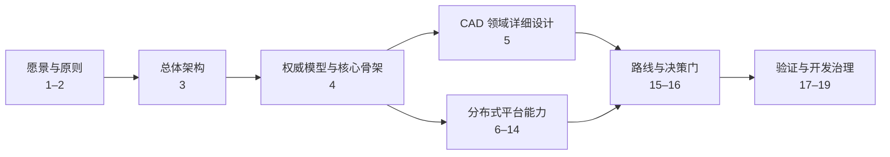

### 0.5 能力地图与章节索引

| 能力域 | 核心章节 | 主要产物 |
|---|---|---|
| 命令、历史、全局参数化 | 4.3 | Transaction、ChangeSet、Revision、Parameter Graph、EvaluationManifest |
| 二维草图与约束 | 5.3 | Sketch model、Constraint、Solver、Profile |
| Part 实体特征 | 5.4 | Body/Feature DAG、Pad/Pocket/Revolve/Shell/Draft/Loft |
| 曲面与线框 | 5.5 | Wireframe、Surface Feature、NURBS、连续性与质量分析 |
| Product、装配与 DMU | 5.6 | InstancePath、Publication、Connection、Kinematics、Space Analysis、Dynamics |
| 持久拓扑身份 | 5.7 | PersistentSelection、TopologyHistory、lineage 与歧义诊断 |
| 分布式计算 | 5.1、6–9 | Worker、Scheduler、任务、对象制品、LOD |
| 协作与扩展 | 10、14 | 语义并发、插件 SDK、工作台生态 |
| 工程质量 | 11–13、17 | 技术基线、安全、SLO、验证 corpus |
| 演进与治理 | 15–16、19 | 阶段门、决策触发条件、交付模板与架构变更 |

尚未单独详细设计的 Drawing/PMI/GD&T、Sheet Metal、Weld、CAM、CAE、Electrical、Requirements/PLM 等能力属于 14 章扩展路线。新增详细设计时应复用第 4 章核心骨架，并按 19.2 的模块模板补齐，而不是直接增加一个孤立 Worker 或功能枚举。

### 0.6 技术研讨的证据要求

技术选型必须区分“领域语义是否正确”和“某个库是否能实现部分算法”。每个重要候选至少评估：

- 功能覆盖、数值正确性、退化输入、诊断质量和确定性；
- 许可证、链接方式、专利/格式风险、SBOM 和供应链；
- 维护活跃度、发布节奏、平台支持、API 稳定性和可替代性；
- CPU/RAM/GPU、冷启动、并发、取消、超时和崩溃隔离；
- 与领域模型的适配成本，是否会把第三方类型泄漏到持久协议；
- golden corpus、基准、故障注入和至少一个替代/退出方案。

CATIA、3DEXPERIENCE 和其他商业 CAD 用于定义能力广度、交互意图与工程质量参照，不作为内部实现证据。开源项目文档用于分析可用能力，也不能代替 occccad 自己的 conformance tests。

## 1. 愿景与范围

occccad 的长期目标是一个开源、云原生、真正分布式的产品研发平台：在浏览器中完成参数化零件、复杂装配、工程表达与跨团队协作，并把精确 CAD 计算调度到可横向扩展的计算集群。CATIA 是能力广度和工程严谨性的参照，不是 UI 或内部实现的复制对象。

“真正分布式”在本项目中有可验证含义：

- 业务真相不依赖任一应用或 Worker 进程；
- 计算任务可在不同主机失败重试、迁移和重建；
- 大制品内容寻址、共享存储、就近缓存并通过 CDN/区域节点分发；
- 不同计算类型可以独立扩缩容、限流、升级和隔离；
- 文档版本、引用和命令在并发下具有明确一致性；
- 单机开发与集群生产使用相同领域契约，而不是两套产品。

它不意味着把每个领域类都做成微服务，也不意味着一次几何操作跨多台机器并行。B-Rep 内核通常更适合单任务单进程；分布式收益主要来自文档/零件/配置/仿真任务之间的并行、缓存复用和数据局部性。

### 1.1 目标产品工作流

平台最终应支持一条连续、可追溯的工程链：

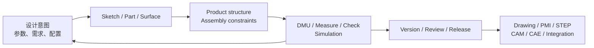

- 设计者在个人或共享 Workspace 中以参数和约束表达意图，通过即时预览和权威求值获得诊断；
- 团队复用不可变 Part/Product Revision，通过 Publication、InstancePath 和配置构建产品，而不是复制几何；
- 工程人员执行碰撞、间隙、测量、运动学、基础动力学和后续 CAE/CAM，所有结果绑定明确输入快照；
- 评审者比较 Revision、批注、检查规则并形成不可变 Version/Release；
- 下游通过开放协议、制品和插件读取发布数据，不直接依赖 Worker 内存或私有数据库结构；
- 任一阶段的失败都提供可定位诊断、可恢复历史和可重现输入，不以静默修复掩盖设计问题。

### 1.2 产品级质量属性

| 属性 | 目标含义 |
|---|---|
| 正确性 | 参数意图、单位、拓扑引用和装配身份不因重算或调度位置静默改变 |
| 可重现 | 清空缓存后可由 Revision、依赖快照和 evaluator 版本重建语义等价结果 |
| 可解释 | 失败指出领域对象、原因、残差/证据和修复方向，而非只返回内核异常 |
| 可扩展 | 新 Feature/Worker/插件复用稳定契约，负载可按文档、零件、配置和任务横向扩展 |
| 可协作 | 历史追加、并发有明确冲突、Undo 不抹除他人工作、发布版本不可变 |
| 开放性 | 数据与协议不被单一云、对象存储、求解器或几何库类型锁定 |
| 安全性 | 多租户隔离、不可信输入沙箱、最小权限、审计和供应链可追踪 |
| 可演进 | 旧 Revision 可读，schema/evaluator 升级可并存、比较和迁移 |

## 2. 设计原则

1. **参数模型是源，几何是缓存**：Document Revision + Typed Model Snapshot + Parameters/Relations 可重放；B-Rep、Mesh、缩略图均可淘汰重建。
2. **粗粒度远程，细粒度本地**：RPC 表达“求值 Part Revision”而不是 `MakeEdge`；草图求解与 Part 重生成之间的高频循环留在同一 Worker。
3. **确定性优先**：GeometryId 包含规范化输入、内核/算法版本、单位和容差策略；同一输入应产生语义等价结果。
4. **不可变版本，显式 Workspace**：已发布 Revision 不修改；编辑发生在 Workspace/Branch，通过乐观并发提交。
5. **开放契约与可替换后端**：业务层不泄漏 OCCT、求解器或对象存储类型。
6. **按负载隔离，不按名词拆分**：CPU/内存/安全/延迟模型不同才拆 Worker；早期业务控制面保持模块化单体。
7. **至少一次 + 幂等**：跨服务消息不承诺魔法般的 exactly-once；命令、任务和制品写入用幂等键、事务 Outbox 与状态机保证效果唯一。
8. **安全默认**：所有导入文件和插件代码视为不可信；计算容器无特权、有限额、无默认外网。
9. **演进式开源**：候选库先过许可证、维护活跃度、格式兼容性、正确性与基准测试，不因“流行”直接引入。

## 3. 目标总体架构

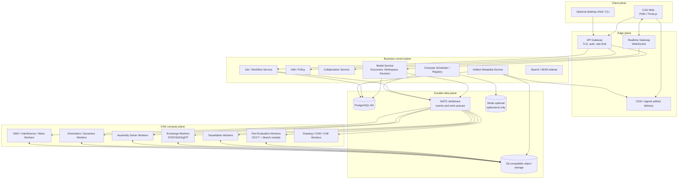

这是逻辑边界，不要求第一天部署为十几个进程。建议先把 Model、IAM、Job、Artifact Metadata 作为 Go 模块化单体部署；Realtime 和 Compute Scheduler 因连接模型/扩缩容不同独立；CAD Workers 天然独立。

## 4. 权威数据模型

### 4.1 聚合层级

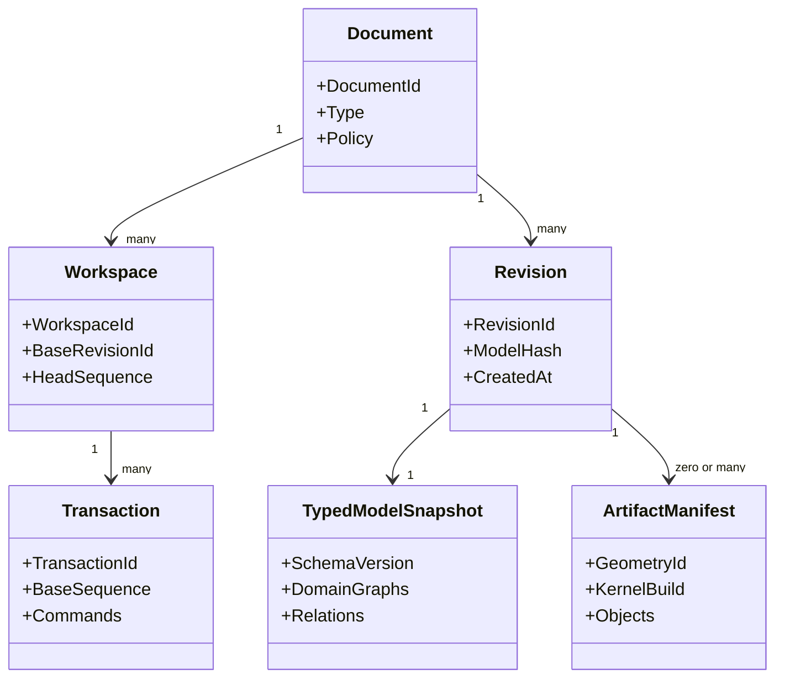

- **Document**：稳定业务身份、所有权、生命周期和策略；
- **Workspace/Branch**：可变编辑线，指向一个不可变基础 Revision；
- **Transaction**：用户认为原子的命令集合；
- **Revision**：不可变、可引用、可签名的模型快照；
- **Typed Model Snapshot**：按 Document 类型包含 Part Feature Graph、Product Structure、Drawing/Simulation setup 及其 Relation；
- **Product Structure**：实例图，引用确定的 Document/Revision 或显式 Follow-Head 策略；
- **Artifact Manifest**：计算产物清单，不能成为模型唯一来源。

ID 使用 UUIDv7/ULID 一类可排序业务 ID；内容使用 SHA-256/BLAKE3 等内容摘要。两者不能混用：RevisionId 代表业务身份，GeometryId 代表计算内容。

### 4.2 Feature Graph

Feature 不应继续编码为 `repeated RectangularPadSpec`。目标模型需要版本化的 typed node：

- 输入：参数、表达式、Sketch/Datum、上游 Feature 输出和外部 Revision 引用；
- 输出：Body/Shape/Datum/SelectionSet；
- 状态：Active、Suppressed、Failed、OutOfDate；
- 插件标识：`type_uri + schema_version + evaluator_version`；
- 依赖：显式 DAG，禁止隐藏读取当前 Worker 状态；
- 局部重生成：从变更节点计算 dirty subgraph，缓存未变输出。

表达式引擎应使用受限 AST、量纲类型和循环检测，不能远程执行任意脚本。内部统一 SI 或明确固定 mm/rad，并在每个协议字段携带/继承 units policy。

### 4.3 核心骨架：命令、事务、Undo/Redo 与全局参数化

前述草图、实体、特征、曲面、装配和 DMU 设计只有建立在同一套编辑语义与参数依赖骨架上，才能成为一个 CAD 系统，而不是若干互不兼容的功能模块。本节定义 Model Service 与所有工作台共同遵守的核心协议。

#### 4.3.1 设计目标与非目标

核心骨架必须同时满足：

- 一次用户意图形成一个可理解、可撤销、可审计的原子 Transaction；
- 已提交 Revision 不可变，任何 Undo、Redo、Restore、Merge 都产生新的历史事实或显式移动只读视图；
- 参数、公式、Feature、拓扑引用、Product occurrence 和仿真输入进入统一的 typed dependency model；
- 模型编辑与昂贵几何计算解耦，但不能发布未经指定 evaluator 验证的 Revision；
- 单人低延迟编辑、多人并发、跨会话历史和失败恢复使用同一语义；
- 模块新增命令不要求修改一个巨型 `switch`，插件也不能绕开权限、事务和求值门；
- 历史可长期读取，命令和模型 schema 可独立演进；
- 全局参数是版本化设计数据，不是藏在服务内存中的全局变量。

本节不把所有模型状态改造成 Event Sourcing，也不承诺任意跨文档修改都自动分布式强事务。几何 B-Rep、Mesh、求解器 warm start、UI selection、hover 和 camera 仍不是权威参数模型。

#### 4.3.2 当前实现基线与主要差距

当前后端已落实 C0–C4 的首个垂直切片：HTTP transport DTO 在边界转换为版本化 envelope 并进入 handler registry；显式 Workspace、Transaction、ChangeSet、Revision parent、EvaluationRun、dependency edge 和 outbox 已落库；新命令在事务外完成纯模型变换与求值并以 Head/sequence CAS 提交；Undo/Redo/Restore 使用根 Transaction 与有序 Revert/Reapply action log 产生追加 Revision；Rectangle/Pad property facade、Quantity、ID-bound arithmetic AST、typed dependency graph、dirty closure 和 EvaluationManifest 已贯通现有 Part/Product 路径。

仍需按后续阶段扩展而不能误报为完成的边界包括：表达式 profile 尚未覆盖布尔、条件、向量和完整纯函数目录；除现有 Rectangle/Pad/Instance 外的专业 schema 尚未注册 PropertySlot；通用删除/重排命令、多人 semantic rebase、跨文档 Publication/Configuration/Rule/Check 属于 C5–C6。当前没有已发布数据兼容承诺，开发 schema 直接重建并只维护这一套历史语义。

#### 4.3.3 四种“命令”必须分层

| 层 | 示例 | 是否持久化 | 是否创建 Revision |
|---|---|---:|---:|
| UI Command | 打开 Pad 面板、Fit All、切换工作台 | 否 | 否 |
| Interaction Session | 草图拖拽、Manipulator move、特征参数实时预览 | 只保留临时 telemetry/lease | 否 |
| Domain Command | `part.feature.create`、`parameter.set_expression`、`assembly.connection.edit` | 是 | 成功接受时是 |
| Compute Job | 求值 Part、网格化、装配求解、DMU 分析 | Job/attempt 持久化 | 不直接创建业务 Revision |

前端 `CommandRegistry` 继续负责 enable/visible/active 和快捷键，但持久编辑必须构造 Domain Transaction。Interaction Session 可以调用 preview API，结束时只提交一次最终意图；Compute Job 只能返回制品和诊断，不能越过 Model Service 修改 Head。

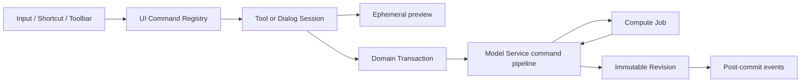

#### 4.3.4 权威对象之间的关系

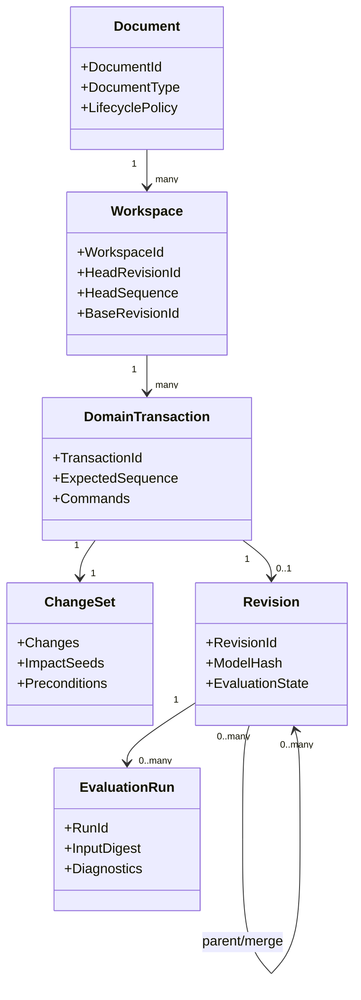

- **Command** 表达用户想做什么；
- **ChangeSet** 表达这个意图对 typed model property 造成什么语义变化；
- **Revision** 保存接受后的完整规范模型快照；
- **EvaluationRun** 证明某组 evaluator 对该模型及依赖快照求值的结果；
- **Event** 表达已经提交的事实，用于 WebSocket、索引、缩略图和集成，不作为核心模型唯一来源。

Revision 快照解决长期读取、恢复和快速打开；Command/ChangeSet 解决审计、语义合并与精确 Undo。两者并存，不选择“只存快照”或“只存事件”的极端。

#### 4.3.5 Domain Transaction 协议

```proto
message DomainTransactionRequest {
  string transaction_id = 1;          // UUIDv7, client generated
  string request_id = 2;              // retry idempotency
  string document_id = 3;
  string workspace_id = 4;
  uint64 expected_head_sequence = 5;
  string expected_head_revision_id = 6;
  repeated DomainCommand commands = 7;
  EvaluationPolicy evaluation_policy = 8;
  optional string interaction_id = 9;
  optional string undo_group_id = 10;
  ClientContext client = 11;
}

message DomainCommand {
  string command_id = 1;
  string type_uri = 2;                // occccad://part/feature/create
  uint32 schema_version = 3;
  google.protobuf.Any payload = 4;
  repeated EntityPrecondition preconditions = 5;
}
```

一个 Transaction 可以包含多个同聚合命令，例如“创建草图 + 创建四条线 + 添加尺寸”，但必须有上限。命令顺序只在同一 Transaction 内有意义，handler 输出共同候选模型；任一命令 schema、权限、引用或强不变量失败则全部拒绝。

`request_id` 对租户/调用者全局幂等，重复 payload 返回原结果；相同 key 不同 payload 返回 `IDEMPOTENCY_KEY_REUSED`。`transaction_id` 是业务历史身份，不因网络重试变化。时间、actor、tenant、trace、客户端版本由服务端上下文补充，客户端不能伪造。

#### 4.3.6 Command Handler Registry

```text
CommandHandler {
  type_uri
  supported_schema_versions
  target_document_types
  required_capabilities
  DecodeAndUpcast(payload)
  Authorize(actor, current_model, payload)
  Validate(current_model, payload)
  Apply(current_model, payload) -> ModelDelta + ImpactSeeds
  Describe(payload, locale) -> HistoryLabel
}
```

Handler 的 `Apply` 必须是确定性、无 I/O 的模型变换：不能访问数据库、网络、系统时间、随机数或 OCCT。所需 ID 在 command 中预分配；外部引用、选择描述符和依赖 Revision 在 Prepare 阶段解析并冻结后作为输入。几何可行性由后续 Evaluation 验证。

核心 handler 由进程内 registry 注册。插件命令使用 `type_uri + schema_version + plugin digest`，只能通过受控 Model Extension API 产生已登记 node/property；不能提交任意 JSON patch 修改未知字段。旧命令读取时 upcast 到当前内存模型，原始 payload 永久保留以供审计。

#### 4.3.7 ChangeSet 是语义差异，不是数据库补丁

```proto
message ModelChange {
  ChangeKind kind = 1;                // CREATE | UPDATE | DELETE | MOVE | BIND
  EntityRef target = 2;
  optional PropertyPath property = 3;
  optional CanonicalValue before = 4;
  optional CanonicalValue after = 5;
  string before_digest = 6;
  string after_digest = 7;
  optional OrderAnchor order = 8;
  optional EntitySnapshot tombstone = 9;
}

message ChangeSet {
  repeated ModelChange changes = 1;
  repeated DependencyKey impact_seeds = 2;
  repeated Diagnostic diagnostics = 3;
  string canonical_digest = 4;
}
```

PropertyPath 使用 schema 登记的 field ID/semantic slot，不使用 JSON pointer、数组下标或显示名称。删除实体时保存最小完整 tombstone、原父级和顺序 anchor；MOVE 保存稳定前后邻居，不只保存整数 position。ChangeSet 由 handler 产生后重新应用到基准快照做 conformance 校验，确保它确实得到候选快照。

ChangeSet 的 before 值用于审计、冲突解释和补偿式 Undo，但不意味着任意机械反转都合法；Undo 仍要经过当前 schema、引用和求值验证。

#### 4.3.8 命令执行状态机

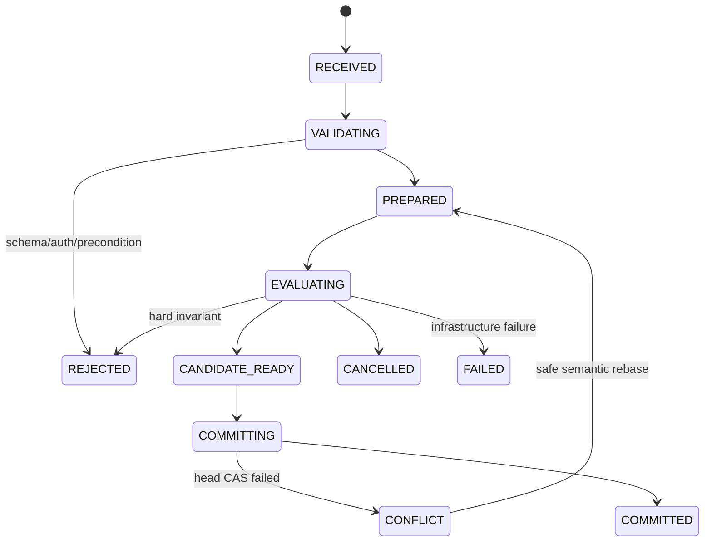

数据库行锁不能覆盖 Worker 求值。Prepare 读取 `(workspace, head_sequence, head_revision)` 和依赖快照，构造候选模型后释放事务；Evaluation 在 Worker 执行；Commit 使用短 PostgreSQL 事务 CAS Head、写 Transaction/ChangeSet/Revision/Outbox。CAS 失败时只对可证明 commute 的 ChangeSet 自动 rebase，并重新验证/求值。

简单 metadata 命令可在一个同步请求中走完相同状态机；重 Feature 可返回 operation handle。客户端断线不会取消已进入 Commit 的事务，按 `request_id` 查询最终结果。

#### 4.3.9 可提交的失败模型

CAD 必须允许用户修复模型，不能规定只有全绿几何才能形成历史。验证分三类：

| 级别 | 示例 | 是否提交 |
|---|---|---:|
| Structural hard error | 非法 schema、重复 ID、参数环、量纲错误、越权、引用类型错误 | 否 |
| Feature evaluation failure | 圆角因上游改变失败、拓扑选择消失、装配欠约束 | 是，Revision 标记 `PARTIAL/FAILED` 并带诊断 |
| Infrastructure failure | Worker crash、对象存储不可用、超时 | 不接受为已验证 Revision；可重试 |

失败 Feature 之后的依赖节点标记 `BLOCKED_BY_UPSTREAM`。允许显示上一成功 Revision 的几何作为 ghost/last-known-good，但必须带旧 `GeometryId` 和醒目的 stale 状态，不能冒充当前模型。Release/导出/仿真默认要求相应 Evaluation Gate 通过。

#### 4.3.10 Event 与 Outbox 边界

Commit 同一数据库事务写入 Outbox，例如：

- `workspace.transaction.committed.v1`；
- `document.revision.created.v1`；
- `model.dependencies.changed.v1`；
- `evaluation.completed.v1`；
- `publication.contract.changed.v1`。

事件携带 tenant、document/workspace、sequence、revision、transaction、actor、model/change digest 和 schema version，不内嵌大模型。消费者至少一次处理并以 event ID 幂等；Search/BOM/thumbnail/realtime projection 可以重建。核心 Head 变更不得依赖“稍后消费事件”才能成立。

#### 4.3.11 Preview 与最终提交

拖拽、尺寸输入和操纵器使用 `InteractionSession`：

```text
BeginInteraction(base_revision, selection_snapshot)
UpdatePreview(ephemeral parameters / drag target, monotonic preview_seq)
CommitInteraction(final DomainTransaction)
CancelInteraction()
```

Preview 结果带 `PREVIEW` 水印语义和短 TTL，不进入 Revision/Undo/Outbox。服务端可以丢弃中间 `preview_seq`，客户端 WASM/本地求解也只是非权威预测。Commit 必须包含最终值而不是鼠标轨迹，并由权威 evaluator 重算。

连续键盘输入、spinner 和拖拽通过显式 `undo_group_id` 合并为一个 Undo 项；服务端不以“500ms 内发生”之类时间猜测用户意图。进入另一工具、改变选择或显式结束后 group 关闭。同组 Transaction 仍逐条保留审计和 sequence；Undo 时按反向顺序组合成一个 Revert 候选，只有同 actor、同 Workspace、连续祖先链且所有补偿都安全时才原子提交，不能通过分组改写既有历史。

#### 4.3.12 Workspace 历史模型

每个 Workspace 是一条追加式 Transaction log 和一个 Head；Revision 形成有向无环历史图，普通提交一个 parent，Merge 两个 parent。历史条目永不因 Undo 后的新编辑而删除。

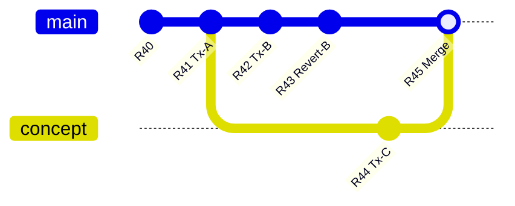

“查看历史点”只改变客户端 `view_revision_id`，不移动 Workspace Head。“创建 Version/Release”是在某 Revision 上建立不可变命名标记。“从此处创建 Branch”产生新 Workspace。三者都不能与 Undo 混为同一 cursor。

#### 4.3.13 Undo 的权威语义

Undo 默认指：在当前 Workspace/编辑上下文中，撤销当前 actor 最近一个仍可撤销的 Domain Transaction。服务端创建新的 `RevertTransaction(original_transaction_id)`，把原 ChangeSet 的 before intent 应用于当前 Head，然后形成新 Revision；旧 Revision 和其他人的后续提交不消失。

Revert 算法：

1. 找到原 Transaction 及其有效 ChangeSet，确认未被同一 undo chain 撤销；
2. 对每个 target 比较当前 digest、原 before/after digest 和 lineage；
3. 若当前仍等于原 after，安全恢复 before；
4. 若属性被后续命令改变，返回字段级 `UNDO_CONFLICT`，不覆盖他人结果；
5. CREATE 的撤销是删除仍可证明同一 identity 的对象；DELETE 的撤销用 tombstone 恢复并验证 ID/父级/引用；
6. Feature reorder 通过 anchor 恢复；若 anchor 已删除，返回候选位置；
7. 生成普通候选模型，执行完整依赖验证、求值与 CAS；
8. 记录 `reverts_transaction_id`，而不是伪造原命令从未发生。

可选 `LOCAL_SINGLE_USER_FAST_UNDO` 只是在确认 Workspace 没有其他写者、没有外部 observer 依赖且尚未发布时优化 UI；持久语义仍等价于 Revert，不建立第二套历史模型。

#### 4.3.14 Redo、Restore 与 Reset 的区别

- **Redo**：只对最近由当前 actor Undo 且此后未发生破坏性冲突的 Transaction，重新应用原始意图/after ChangeSet，形成 `ReapplyTransaction` 新 Revision；不是把 Head 指针移动到旧节点。
- **Restore**：选择任意历史 Revision，把其完整模型作为 source，与当前 Head 做 scope-aware replace，提交 `RestoreTransaction`；用于跨多个命令恢复，并保留 Restore 之前历史。
- **Branch from revision**：从历史点创建新 Workspace，适合探索替代方案。
- **Reset/force move Head**：仅管理员维护工具或未共享临时 Workspace 可用，必须审计；普通 CAD UI 不暴露破坏式 reset。

多人环境下 Undo 列表按 actor、document tab/working scope 和 transaction kind 过滤，但用户可以在 History 面板显式选择任意有权限 Transaction 执行 Revert。Onshape 同样区分个人 Undo 与把 Workspace 恢复到历史点；其追加历史/不可变 Version 思路与本设计一致。[Onshape Document Management](https://cad.onshape.com/help/Content/Document/document_management.htm) [Onshape Restore](https://cad.onshape.com/help/Content/Document/restoring.htm)

#### 4.3.15 为什么不以反向命令或 OCAF Undo 栈作为云端真相

“Pad 的反向命令是 DeletePad”只在没有后续引用时成立；删除/替换/重排、拓扑 lineage、装配 Publication 和跨文档引用都会使手写 inverse command 失真。ChangeSet before image + 当前状态 precondition 更适合生成可靠补偿。

OCCT OCAF 提供 Open/Commit/Abort transaction、依赖机制和多级 Undo/Redo，证明事务边界必须从应用设计早期建立；但标准 OCAF Undo 信息主要是进程内文档机制，默认不会随文档跨会话持久化。因此 occccad 借鉴其“所有数据修改位于命令事务”和稳定 attribute identity 思想，不把 TDocStd undo stack 当作分布式 Workspace 历史。[OCCT OCAF User Guide](https://dev.opencascade.org/doc/overview/html/occt_user_guides__ocaf.html) [TDocStd_Document](https://dev.opencascade.org/doc/refman/html/class_t_doc_std___document.html)

#### 4.3.16 Feature Rollback Bar 不是 Undo

Part 的 Feature Rollback/Insert Here 是模型内 `EvaluationTip`：它控制哪些 Feature 参与当前求值，以及新 Feature 插入位置。移动 tip 是可持久 Domain Command，可 Undo；它不改变 Workspace 历史 Head，也不删除 tip 之后 Feature。暂停重生成同样是编辑策略，不是历史回退。

#### 4.3.17 全局参数化的准确含义

“全局”不是一个所有文档都能隐式读写的变量字典，而是统一类型、身份、作用域、引用和求值规则：草图尺寸、Pad 长度、曲面 law、材料属性、装配 offset、机构 driver、仿真载荷和配置选项都可以绑定同一种 `ParameterRef/Expression`，同时保持各自聚合边界。

全局参数化分三层：

1. **Document-local design parameters**：Part/Product 内部权威参数；
2. **Published parameters**：通过 Publication 暴露的稳定只读契约；
3. **Configuration parameters**：在明确 ConfigurationContext 中选择/覆盖输入值。

跨文档消费者只能读取已发布参数和冻结的 Revision/ResolutionSnapshot。不存在“按名称搜索整个租户后取第一个 Width”，也不允许下游直接修改上游参数形成隐藏的双向绑定。

#### 4.3.18 ParameterDefinition

```proto
message ParameterDefinition {
  string parameter_id = 1;
  string key = 2;                       // owner scope 内稳定、可脚本引用
  string label = 3;                     // 可本地化显示名
  ParameterOwner owner = 4;
  ValueType value_type = 5;
  ParameterRole role = 6;               // INPUT | DERIVED | MEASURED | OUTPUT
  ValueSource source = 7;
  optional Unit display_unit = 8;
  optional ParameterBounds bounds = 9;
  ParameterVisibility visibility = 10;
  bool configurable = 11;
  map<string,string> metadata = 12;
}

message ValueSource {
  oneof source {
    CanonicalValue literal = 1;
    TypedExpression expression = 2;
    ExternalParameterRef external = 3;
    TableLookup table = 4;
    MeasurementRef measurement = 5;
  }
}
```

`ValueType` 至少包括 Boolean、Integer、Real、String、Enum、Quantity、Vector2/3、Point2/3、Direction、Transform、Color 和受限数组。几何选择不是普通 Parameter value，而是 `PersistentSelection/PublicationRef`；B-Rep 不得塞进表达式值。

ParameterId 永久稳定且不复用；`key` 可显式重命名，`label` 不参与解析。直接驱动某个 Feature property 时，Parameter 可以是该 property 的稳定 facade，不能复制两份互相同步的数值。

#### 4.3.19 Property Slot：统一绑定点

每个可参数化字段在 schema 中声明一个稳定 `PropertySlot`：

```text
PropertySlotDescriptor {
  owner_type_uri
  slot_id                 // stable schema identity, e.g. pad.length
  value_type
  allowed_sources
  default_value
  validation_rules
  affects                 // TOPOLOGY | GEOMETRY | PLACEMENT | DISPLAY | ANALYSIS
  evaluator_phase
}
```

实例上的 `PropertyAddress = (EntityId, slot_id)`。字段可以绑定 literal、ParameterRef 或 TypedExpression，但同一 slot 只能有一个 driving source。Measured/diagnostic output 是只读 slot，不能被命令直接赋值。插件只有先注册 descriptor 才能进入依赖图、属性面板和 ChangeSet。

这样草图 radius、Pad length、Shell thickness、Assembly offset 和 Load magnitude 共享绑定协议，同时仍由各自领域 schema 校验语义。

#### 4.3.20 作用域与名称解析

参数解析使用词法作用域并在提交时绑定 ID：

```text
feature/local parameters
    -> body or mechanism scope
    -> document ParameterSet
    -> active ConfigurationContext
    -> explicitly imported Publication aliases
```

- 同层 `key` 唯一；建议 ASCII identifier，label 可使用任意 Unicode；
- 表达式编辑器可以显示 `WallThickness`，持久 Typed AST 保存 ParameterId；
- rename 只改 key/label，所有已绑定 AST 不需要文本替换；UI 重新 pretty-print；
- copy/paste 使用 relocation table 为局部 ID 重映射，外部 publication 默认保留显式引用；
- 不允许通过父 Product occurrence 隐式反向读取任意 sibling 参数；必须通过 Product Parameter/Publication 建立 wiring；
- Instance override 只允许 Parameter 声明 `configurable=true` 且 Product policy 允许的输入。

#### 4.3.21 量纲与单位系统

内部 `Quantity` 使用 SI canonical value 加量纲向量，显示单位不参与相等性或 GeometryId。CAD 语义上 Angle 与无量纲 Real 分开，即使物理量纲分析常把 rad 视为 1；Temperature 与 TemperatureDelta、Point 与 Vector 也不能混算。

```text
Dimension = L^a M^b T^c I^d Θ^e N^f J^g + semantic_kind
Quantity  = finite decimal/binary value + Dimension
```

- parser 接受 `25 mm`、`2 * hole_diameter`、`90 deg`，不靠目标字段偷偷补单位；
- 加减要求相同量纲，乘除合成量纲，三角函数明确接受 Angle；
- 幂运算只允许能静态推导量纲的受限指数；
- unit conversion 在输入/显示边界完成，canonical serialization 固定舍入和非有限数拒绝规则；
- 公差不是 Quantity 的隐含误差，每个 Solver/Evaluator 使用版本化 ToleranceProfile；
- Decimal 适合表格/商务参数，几何 evaluator 最终转 double 时记录 conversion policy。

FreeCAD 的表达式系统证明单位感知、对象属性引用和依赖检查对参数 CAD 很重要；occcad 进一步用 ID-bound AST、property 级依赖和显式 Published Parameter 避免名称引用与粗粒度对象环的限制。[FreeCAD Expressions](https://github.com/FreeCAD/FreeCAD-documentation/blob/main/wiki/Expressions.md)

#### 4.3.22 表达式语言与 Typed AST

首期表达式只包含：字面量、Parameter/Property read、算术/比较/布尔运算、条件表达式、受白名单约束的纯函数、向量构造和受限 lookup。无赋值、循环、递归、I/O、网络、反射、随机数或当前时间。

```proto
message TypedExpression {
  string source_text = 1;
  bytes checked_ast = 2;
  string language_version = 3;
  ValueType result_type = 4;
  repeated DependencyKey reads = 5;
  string function_catalog_digest = 6;
  CostEstimate cost = 7;
}
```

Parse → name bind → static type/dimension check → constant fold → dependency extraction → cost check 后才能提交。Evaluation 只执行 checked AST；source text 用于编辑和诊断。所有函数必须纯、确定、版本化，错误返回 source span 和 expected/actual type。

[CEL](https://github.com/cel-expr/cel-spec)提供非图灵完备、无副作用、类型检查和可序列化 checked AST，可作为通用语法/运行时的重要候选；但 CAD Quantity、几何类型、单位字面量、跨 Go/C++ 数值一致性和长期 AST 兼容仍需项目自己的 profile 与 conformance suite，不能直接把任意 CEL 环境暴露给模型。

#### 4.3.23 Design Dependency Graph

统一依赖图的节点不是只有 Feature：

- Parameter/Property Slot；
- Expression、Rule、Check、Table Lookup；
- Sketch solve、Feature、Body result；
- Publication、External Revision Snapshot；
- Product configuration、Occurrence placement、Assembly Connection；
- Material/Mass、Mechanism、Simulation setup；
- 派生 report/measurement。

边必须带类型：`READ_VALUE`、`READ_GEOMETRY`、`READ_TOPOLOGY`、`READ_STRUCTURE`、`READ_CONFIGURATION`、`READ_MATERIAL`、`READ_MEASUREMENT`。图中保存稳定 DependencyKey，不保存 Worker 指针或显示名。

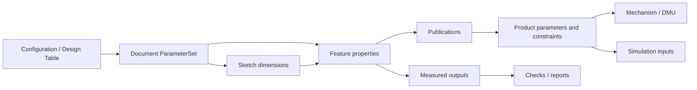

图存储逻辑边；Feature 内部的几何执行细节留在 evaluator。反向依赖索引是可重建 projection，但每个 Revision 必须能确定性重新提取并校验其 digest。

#### 4.3.24 环检测与反馈边界

提交前对 driving subgraph 做强连通分量检测；除专门 Solver Domain 外，任何环都是 hard error，并返回最短可解释 cycle path。

允许闭环的领域必须整体封装：Sketch constraint system、Assembly closed-loop mechanism、优化/方程组分别是一个 Solver Node，其内部变量和方程由专用求解器处理。普通表达式不能借“隐藏引用”绕过环检测。

Measured Parameter 默认只能驱动 Check、Report、UI 和下游 analysis，不能反向驱动产生它的几何。例如 `volume -> pad.length -> volume` 被拒绝。要实现“求长度使体积达到目标”，必须创建显式 `DesignStudy/GoalSolve`：声明 design variables、objectives、constraints、bounds 和 solver profile，输出 proposal；用户接受 proposal 后再提交普通参数 Transaction。

#### 4.3.25 参数求值阶段

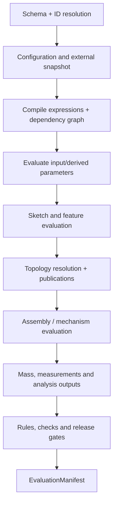

早期阶段只能读更早的 authoritative output；禁止一个表达式在求值时动态发现新依赖。相同 phase 内按拓扑序求值；可并行节点必须声明无共享可变状态。阶段和 evaluator version 写入 manifest，避免不同 Worker 自行决定顺序。

#### 4.3.26 增量重生成与影响分析

Command Handler 输出 `ImpactSeeds`，Dependency Engine 计算 transitive dirty closure。每个节点以以下 digest 查缓存：

```text
NodeInputDigest = hash(
  node type + schema + canonical inputs + resolved dependency digests
  + evaluator build + tolerance/unit/configuration profiles
)
```

节点结果分 `CLEAN | DIRTY | EVALUATING | SUCCEEDED | FAILED | BLOCKED | STALE_EXTERNAL`。只有 digest 相同才复用，不能因“参数看起来没变”复用隐藏依赖结果。结构变化先重建局部依赖边；value-only 变化通常不重建图。

增量粒度遵循成本：表达式/property 在 Model Service；Sketch/Feature DAG 在单个 Part Worker 内增量执行；不同 Part/配置可跨 Worker 并行；不能为每个 Feature 发远程 RPC。Worker 可以接收 prior EvaluationManifest 和可用 object digests 作为 hint，但正确性不能依赖 warm cache。

#### 4.3.27 Topology、Geometry 与 Display 三类影响

Property descriptor 的 `affects` 决定最小 invalidation：

- `DISPLAY`：颜色、可见性、UI label，不重算 B-Rep；
- `PLACEMENT`：装配矩阵/场景更新，可复用 Part GeometryId；
- `GEOMETRY`：形状度量改变但可能保留拓扑 lineage；
- `TOPOLOGY`：需要重做后续 PersistentSelection 解析；
- `STRUCTURE`：Feature/Product 图变化；
- `ANALYSIS`：只使质量、DMU 或仿真结果过期。

该声明只是 invalidation 下界，evaluator 可返回更强实际影响；绝不能把 topology-changing 误报为 display-only。通过 mutation testing 验证 descriptor。

#### 4.3.28 EvaluationPolicy 与手动更新

```text
EvaluationPolicy =
  IMMEDIATE_STRICT
  | IMMEDIATE_ALLOW_FEATURE_FAILURE
  | DEFER_EXPENSIVE_DERIVATIVES
  | PAUSED_DRAFT
```

默认建模使用 `IMMEDIATE_ALLOW_FEATURE_FAILURE`：结构与参数必须有效，核心 Part 求值完成后提交，网格/缩略图等可延后。`PAUSED_DRAFT` 允许批量编辑参数而暂不生成几何，但 Workspace 明确显示 dirty，选择型命令、发布、导出和仿真受限；执行 Regenerate 后形成新的 Evaluation 状态。暂停不能让旧几何无标识地代表新参数。

#### 4.3.29 Configuration、Design Table 与变体

Configuration 不复制 Feature Graph，而提供一个受 schema 约束的输入层：

```text
ConfigurationDefinition {
  inputs: enum/boolean/integer/quantity parameters
  rules: allowed combinations and defaults
  overrides: ParameterId -> typed value/expression
  suppression: FeatureId/InstanceId -> condition
}
```

Design Table 是 ConfigurationDefinition 的一种表格视图/导入格式，不是 Excel 文件本身成为业务真相。导入 CSV/XLSX 后规范化为 typed table、保存源文件 digest 和映射；重复 key、单位错误和缺列拒绝。每行有稳定 ConfigurationId，行号不是身份。

CATIA Knowledgeware 把 Parameter、Formula、Rule、Check 和 Design Table 贯穿建模/仿真字段；occcad 对标其设计知识表达能力，但把表格、规则和参数全部纳入不可变 Revision 与开放 schema。[CATIA Knowledgeware Parameters and Relations](https://help-3dexperience.aesvietnam.com/English/PreferencesMap/kwbasicspref-c-KnowledgeBasics.htm) [CATIA Design Tables](https://help-3dexperience.aesvietnam.com/English/KwBasicsUserMap/kwbasics-c-DesitnTableAbout.htm)

#### 4.3.30 Rule、Check 与自动化边界

- **Formula**：一个纯表达式驱动一个 Property/Parameter；
- **Rule**：声明式产生有限组 typed proposals，例如条件 suppression 或参数建议；
- **Check**：只读断言，输出 PASS/WARN/FAIL 与证据；
- **Release Gate**：聚合指定 Check 和 Evaluation capability；
- **Action/Macro**：显式用户/工作流触发，生成 Domain Commands，不在模型求值中偷偷写状态。

Rule 必须终止、无副作用并可静态提取 read/write set；同一 slot 多 writer 拒绝。Check 失败一般不阻止 Workspace Revision，但可以阻止 Release。Webhook、Python、WASM 插件和 AI proposal 只能生成待授权命令，不能嵌入公式阶段。

#### 4.3.31 External Parameter 与 Publication

```proto
message ExternalParameterRef {
  string source_document_id = 1;
  ReferenceSelector revision = 2;
  string publication_id = 3;
  ValueType expected_type = 4;
  UpdatePolicy update_policy = 5; // PINNED | FOLLOW_WORKSPACE_WITH_ACCEPT
}
```

Published Parameter contract 包含 PublicationId、类型/量纲、单位策略、semantic purpose、bounds、compatibility version 和 source ParameterId。下游 Revision 保存实际 resolved RevisionId/value digest。上游 Head 改变只产生 `UPDATE_AVAILABLE`，不会静默让已提交下游 Revision 几何漂移；用户/流水线执行 Update References Transaction 后统一重算。

跨文档写入使用 Saga/Change Proposal：先在各目标 Workspace 验证候选和权限，再按明确顺序 CAS；不能原子提交时记录 partial outcome 和补偿建议。核心建模首期限制一个 Transaction 只写一个 Document aggregate，读取任意多个冻结 Revision。

#### 4.3.32 并发合并矩阵

| A 与 B 的变化 | 自动 rebase | 说明 |
|---|---:|---|
| 不同无依赖 Entity/property | 是 | 重放并重新求值 |
| 同 Entity 不同独立 metadata slot | 是 | schema 声明可交换 |
| 同 Parameter value/expression | 否 | 字段级冲突 |
| 一个删除 Entity、一个编辑它 | 否 | delete/edit 冲突 |
| Feature reorder 与依赖其位置的插入 | 通常否 | 返回 anchor graph |
| 上游参数变化与下游 Feature edit | 条件式 | 合并后必须重新求值，失败仍可形成诊断 Revision |
| 两个配置行不同 Parameter override | 是 | ConfigurationId/ParameterId 分离 |
| 两个拓扑 rebind 指向不同目标 | 否 | 设计意图冲突 |

自动 rebase 的证明来自 ChangeSet read/write set、Dependency Graph 和 handler commutativity policy，不是简单比较 JSON path。最多重试有限次数；持续竞争返回当前 Head 与 minimal conflict set。

#### 4.3.33 EvaluationManifest 与可重现性

每次权威求值产生：

```text
EvaluationManifest {
  revision_id, model_hash, dependency_snapshot_digest
  configuration_context_digest
  expression_language/function_catalog versions
  unit/tolerance/profile digests
  evaluator/solver/kernel build digests
  node input/output digests and statuses
  evaluated parameter value table digest
  geometry/topology/publication artifact digests
  diagnostics digest, timings, resource summary
}
```

Revision 可以有多个 EvaluationRun，例如内核升级验证；只有符合 Workspace/Release policy 的 run 被标记 authoritative。重新求值不会修改 Revision 模型，只增加 run/manifest。若新 evaluator 得到不同结果，通过 compare/migration 流程产生新模型 Revision 或新发布基线，不能静默覆盖旧 GeometryId。

#### 4.3.34 服务与模块边界

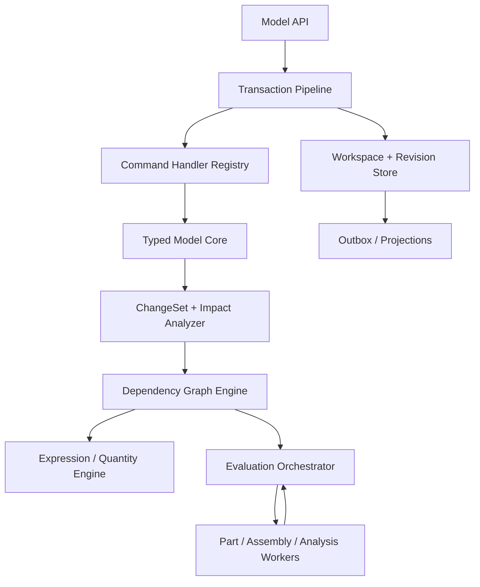

初期以上模块都可位于 Go Model Service 模块化单体，只有 CAD Worker、Realtime 和 Scheduler 独立部署。Expression/Quantity/Dependency Core 应做 OCCT-free library；C++ Worker 消费已求值参数和明确 typed inputs，不自行解析用户 source text。未来若 C++ 需要 law evaluation，使用同一版本化 AST/profile 与跨语言 conformance corpus。

#### 4.3.35 推荐存储投影

业务真相优先保存在规范 Revision manifest/JSONB 和追加事务表；关系表只索引需要查询/并发的边界。所谓“完整 Revision 快照”是逻辑完整，不要求为每次提交复制一个巨大 JSON：模型按 ParameterSet、Feature graph、Body、Product subtree、Relation graph 等稳定分块内容寻址，Revision manifest 指向不可变 chunk；未变化 chunk 结构共享，小模型仍可内联以降低复杂度。canonical model hash 由有序 manifest 和 chunk digests 计算，读取层向 handler 提供不可变 copy-on-write view。

推荐投影包括：

- `workspaces(id, document_id, head_revision_id, head_sequence, base_revision_id, policy)`；
- `transactions(id, workspace_id, sequence, actor, request_id, type, status, base_revision, result_revision, undo links)`；
- `transaction_commands(transaction_id, ordinal, type_uri, schema_version, payload_digest)`；
- `change_sets(transaction_id, canonical_blob_digest, read_set, write_set, impact_seeds)`；
- `revisions(id, document_id, parents, model_blob_digest, model_hash, state)`；
- `evaluation_runs(revision_id, capability, manifest_digest, status)`；
- `dependency_edges(revision_id, source_key, target_key, edge_kind)` 作为可重建索引；
- `outbox_events(...)`。

命令原 payload、ChangeSet、模型快照和 manifest 可压缩后放对象存储，但 PostgreSQL 保存 digest、大小、schema 和引用完整性。GC 不得删除仍被 Revision、Transaction、Release、审计或 legal hold 引用的对象。

#### 4.3.36 API 返回与错误模型

成功返回 `TransactionReceipt`：transaction/workspace/sequence/revision IDs、ChangeSummary、EvaluationSummary、diagnostics、artifact links、undo capability 和 correlation IDs。失败至少区分：

| Error | 语义 |
|---|---|
| `COMMAND_SCHEMA_UNSUPPORTED` | type/schema 无 handler 或无法 upcast |
| `PRECONDITION_FAILED` | entity/property digest 已变化 |
| `WORKSPACE_HEAD_CONFLICT` | expected sequence 过期且不能自动 rebase |
| `PARAMETER_TYPE_MISMATCH` / `UNIT_MISMATCH` | 静态类型或量纲错误 |
| `DEPENDENCY_CYCLE` | 返回 cycle path 和 edge kinds |
| `MULTIPLE_PARAMETER_WRITERS` | 一个 slot 被多个 source 驱动 |
| `UNDO_CONFLICT` / `REDO_NOT_AVAILABLE` | 补偿不再安全 |
| `EVALUATION_FAILED` | 可提交模型失败，receipt/diagnostics 说明是否形成 Revision |
| `EVALUATOR_UNAVAILABLE` | 基础设施失败，可安全重试 |
| `REFERENCE_UPDATE_REQUIRED` | 外部 Publication 有新版本但尚未接受 |

HTTP/gRPC status 只表示传输级类别，客户端行为依据稳定领域 error code。

#### 4.3.37 安全、配额与防滥用

- 命令 payload、数量、Transaction commands、AST nodes/depth、字符串、table rows、dependency edges 有硬上限；
- Expression cost 静态估算与运行预算双重限制，函数白名单无 I/O；
- 权限同时校验 Document write 和所有外部 Reference read，提交前后都防 confused deputy；
- 插件 command/evaluator digest、publisher、capability 和 schema 在 Revision/manifest 可追踪；
- 历史/ChangeSet 可能含旧敏感参数，遵守租户加密、保留、legal hold 和受控 redaction policy；
- Undo/Restore 不能恢复当前无权读取的外部数据，权限变化产生明确失败；
- 恶意 dependency fan-out、超大配置矩阵和重算风暴由租户预算、去重和 backpressure 控制。

#### 4.3.38 可观测性与性能指标

至少记录：command validation/apply、dependency extraction、expression compile/eval、dirty closure、cache hit、Worker queue/eval、CAS/rebase、outbox publish 的分段 trace。核心指标：

- Transaction p50/p95/p99、preview latency、commit conflict/rebase rate；
- Undo/Redo success/conflict rate；
- dirty nodes / total nodes、各类 invalidation、node cache hit；
- expression count/AST cost/cycle/type error；
- Feature regeneration critical path 与 fan-out；
- failed/blocked/stale node 数、last-known-good 使用时长；
- 每 Revision model/ChangeSet/manifest 大小和历史增长率。

性能面板必须能回答“哪个参数导致哪些节点重算、为何没有命中缓存”，而不只显示总耗时。

#### 4.3.39 验证体系

| 测试层 | 必须覆盖 |
|---|---|
| Command conformance | 每个 handler 的 schema、权限、纯函数、ChangeSet round-trip |
| History | Undo/Redo/Restore、delete-create、reorder、rename、跨会话和多 actor |
| Property/Parameter | ID rename、scope、copy relocation、type/unit/bounds、single writer |
| Expression | parser/type checker/AST compatibility、cost limits、Go/C++ golden corpus |
| Dependency | cycle、dirty closure、typed edges、dynamic dependency rejection |
| Incremental | 增量结果与冷启动全量重算语义等价 |
| Concurrency | commute matrix、CAS race、幂等重试、Worker late result |
| Failure injection | crash between object upload/commit/outbox、projection rebuild |
| Migration | 所有旧 `CommandRequest`、Part/Product JSON 和 history cursor 可读取 |
| Property/fuzz | command payload、AST、ChangeSet、dependency graph、tombstone/lineage |

最关键的 oracle 是：任意 Revision 清空所有缓存后，可从模型、依赖快照和 evaluator manifests 重建语义等价结果；任意 Transaction 的 ChangeSet 应与前后快照 diff 一致；增量求值必须与全量求值一致。

#### 4.3.40 新项目 Schema 策略

项目当前没有需要承诺兼容的生产数据。核心骨架只维护一套 Workspace/Transaction/ChangeSet/Revision 语义，不回填 cursor 历史、不保留平行 Undo 状态机，也不为实验数据增加读取 adapter。C0–C4 schema 变化时重建开发数据库，以 conformance corpus 和端到端场景验证新基线。

一旦产生正式发布或外部持久数据，本节策略必须通过架构变更切换为版本化迁移：从该发布点开始只追加 migration、旧 Revision 只读、命令 upcast 和 shadow diff。不能把“当前允许重建”误用到未来已发布数据。

#### 4.3.41 实施路线与阶段门

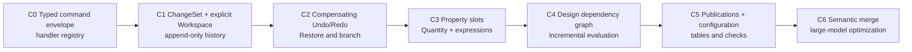

- **C0**：建立 UI/Domain/Job 分层、版本化 envelope、幂等和 handler conformance；
- **C1**：Transaction/ChangeSet/Revision/Outbox 原子提交，Workspace 成为显式聚合；
- **C2**：按 actor/scope 的 Revert/Reapply、tombstone、冲突诊断、Restore/Branch；
- **C3**：ParameterId、PropertySlot、量纲类型、ID-bound Typed AST 和安全表达式；
- **C4**：typed dependency edges、cycle/phase、dirty closure、manifest 和冷/增量等价测试；
- **C5**：Published Parameter、外部 snapshot、Configuration/Design Table、Rule/Check/Release Gate；
- **C6**：字段级 semantic rebase、100k+ graph、分区索引、批量参数研究与解释工具。

核心骨架的 Definition of Done：任何专业模块只能通过 versioned Domain Command 改模型；一个用户动作有明确 Transaction；Revision 可清缓存重建；Undo 不删除他人历史；参数引用不依赖显示名；单位/类型/环在提交前诊断；变更能解释 dirty closure；Worker 迟到结果不能覆盖 Head；旧模型和旧命令持续可读。缺少其中任一项，都不应继续用功能数量掩盖平台骨架债务。

## 5. CAD 领域能力与计算平面

### 5.1 推荐边界

| Worker | 是否独立进程 | 核心输入/输出 | 原因 |
|---|---|---|---|
| Part Evaluation | 是 | Feature Graph + upstream artifacts → B-Rep/manifest | OCCT 重内存、崩溃隔离、按 Part 并行 |
| 2D Sketch Solver module | **同 Part Worker 部署**，内部独立库 | Sketch entities/constraints → solved parameters/diagnostics | 与 Feature 求值高频交互；单草图很小，远程 RPC 得不偿失 |
| Tessellation | 初期嵌入，规模后独立 | B-Rep + quality profile → GLB/mesh/topology map | 可独立缓存，多 LOD、高并发、与 B-Rep 修改无关 |
| Exchange | 独立 | STEP/IGES 等不可信文件 ↔ canonical model/artifacts | 解析风险、长耗时、格式依赖和资源限制不同 |
| Assembly Solver | **独立 Worker** | instance graph + mates + datums → transforms/residuals | 稀疏非线性问题、独立扩缩容、不应携带完整 B-Rep |
| Interference/Mass | 独立 | assembly placements + geometry proxies → reports | 可批量/并行、内存大、通常异步 |
| Drawing | 后期独立 | revision + view spec → vector drawing | HLR/投影负载和发布节奏不同 |
| CAM/CAE | 插件式独立 Worker | immutable revision + setup → toolpath/result | 安全、许可证、GPU/HPC 与领域依赖隔离 |

### 5.2 为什么二维草图不做远程独立 Worker

草图求解器在代码结构上必须独立于 OCCT：拥有自己的实体、约束、自由度诊断、Jacobian 和序列化接口。但默认与 Part Evaluation Worker 同进程。

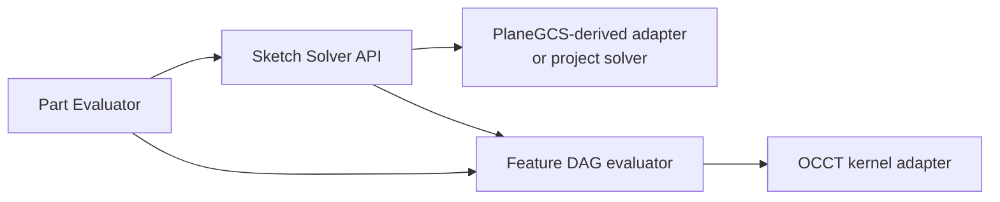

理由：拖拽时求解频率可达每帧多次，草图输出立刻影响 Profile/Feature；拆成网络服务会引入序列化、排队和网络抖动，而且无法带来有意义的跨草图并行。浏览器可以运行一个非权威的 WASM preview solver 提升拖拽体验，但提交后必须由服务端同版本求解器验证。

拆分触发条件只有两个：求解器需要独立 GPU/HPC 资源，或第三方许可证要求进程隔离。即使触发，也应保持可嵌入实现用于小草图。

### 5.3 二维约束求解路线

本节是草图及约束后端的开发规格。目标不是给测试矩形增加几个尺寸字段，而是建立可以长期承载 Part Design 的版本化二维参数模型、权威求解边界和 Profile 生成链。

#### 5.3.1 已落地的首个纵向切片

首个实现已经删除 `Feature.Rectangle` 测试模型。选择 Datum Plane 后先以 `CREATE_SKETCH` 创建空的 `SketchFeature v1`；点、线、约束和复合工具统一形成 `EDIT_SKETCH` operation batch。服务端在写 Revision 之前通过 Worker `SolveSketch` 执行权威求解并回写求解坐标、状态、DoF 与诊断。

当前链表示为：

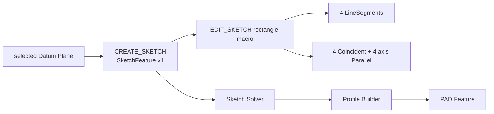

本切片处于尚未发布数据契约的开发阶段，按仓库的数据重置规则直接替换测试 schema，不保留 `RECTANGLE_SKETCH` 读取适配器；升级后开发环境必须执行数据重置。正式发布兼容承诺一旦建立，后续 schema 演进重新遵守版本化 adapter、只追加迁移和旧 Revision 可读规则。

#### 5.3.2 后端组件边界

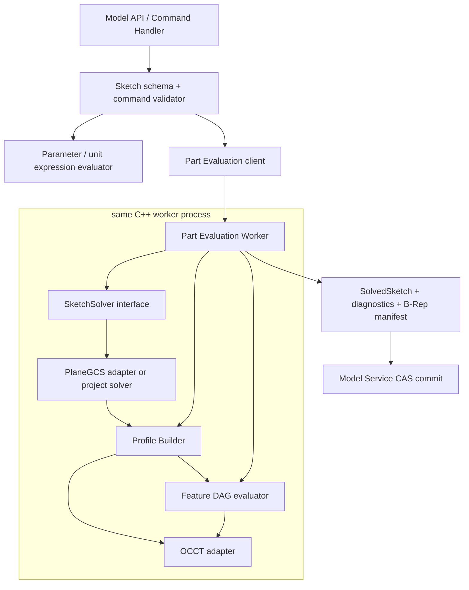

边界规则：

- **Model Service** 保存原始 SketchModel、表达式和命令，不包含求解算法；
- **Parameter evaluator** 解析单位和受限表达式，将 driving dimension 转为明确的 mm/rad 数值；
- **SketchSolver** 只处理二维实体、代数约束和诊断，不依赖 OCCT；
- **Profile Builder** 把已求解二维曲线变成有方向、有嵌套关系的闭合区域；
- **OCCT adapter** 只负责二维曲线到 Edge/Wire/Face 及后续精确 Feature；
- **浏览器/WASM solver** 只能产生交互预览，服务端结果始终权威；
- **Worker 内存** 只保存 warm start 和分解缓存，不是 SketchModel 的唯一副本。

#### 5.3.3 SketchFeature 领域模型

一个 Sketch 是 Feature Graph 中的 typed node，而不是独立 Document。推荐的规范模型如下；字段名表达语义，最终以版本化 Protobuf/JSON Schema 为准。

```text
SketchFeature
  id, name, schema_version
  support: SketchSupport
  placement: local 2D frame relative to support
  units_policy_id
  tolerance_profile_id
  entities: SketchEntity[]
  constraints: SketchConstraint[]
  parameters: ParameterBinding[]
  external_geometry: ExternalGeometry[]
  options: construction visibility / auto-constraint policy
```

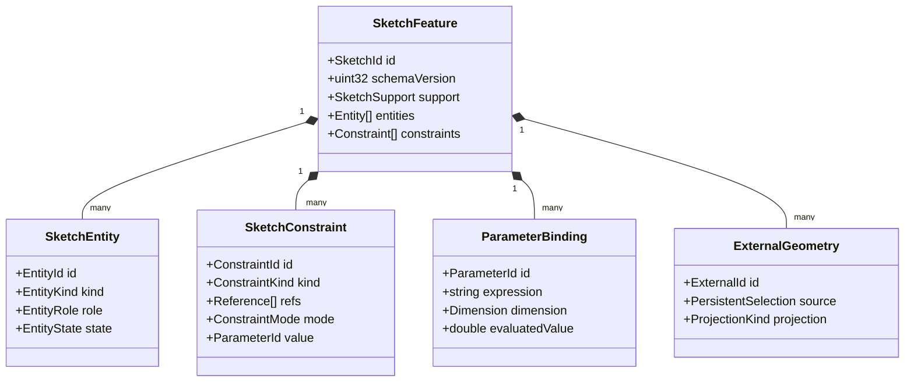

所有 Entity、Constraint、Parameter 和 ExternalGeometry 使用稳定、不复用的 ID。数组顺序只用于显示排序，引用永远使用 ID，禁止使用数组下标。删除后 ID 放入 Revision 的 tombstone 集合，至少在同一 Workspace 历史中不得复用。

**SketchSupport** 第一阶段支持：

1. `DATUM_PLANE`：引用当前 Part 的稳定 DatumPlaneId；
2. `PLANAR_FACE`：引用上游 Feature 的 PersistentSelection，并保存明确的原点、X 方向和法向定向规则；
3. `EXPLICIT_FRAME`：导入/迁移使用的不可变局部坐标系。

面支撑解析失败时，已有 Revision 仍可打开，Sketch/下游 Feature 标记 `OUT_OF_DATE` 或 `FAILED_SUPPORT`，不得把草图静默移动到 XY 平面。第一阶段不支持在任意曲面上直接绘制；圆柱/曲面的参数域草图需要新的 Support 类型和周期边界语义。

#### 5.3.4 实体模型

本节定义 Sketch Entity 后端模块的可实施规格。实体模块负责“草图中有什么几何、如何稳定引用、如何编辑和验证”，不负责约束求解、Profile 拓扑构造或 OCCT Shape 持久化。

##### 5.3.4.1 职责与非职责

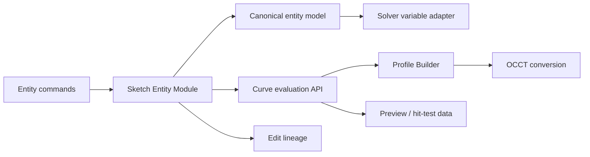

实体模块必须完成：

- 版本化 Entity schema、稳定 ID、角色和生命周期状态；
- 类型签名、参数范围、退化和有限数验证；
- 点值、导数、参数域、包围盒和最近点等 OCCT-free 曲线查询；
- Add/Update/Delete/Split/Trim/Extend/Transform 的确定性编辑语义；
- Entity/SubElement 引用解析和编辑 lineage；
- 持久参数与 Solver 内部变量之间的映射；
- 规范序列化、哈希、向旧/新 schema 迁移；
- 向 Profile Builder、渲染和 OCCT Adapter 提供只读曲线视图。

实体模块不完成：

- 不决定几何约束是否有解；
- 不把接近的端点自动视为重合，重合必须来自 Constraint 或显式 Auto-Constraint 命令；
- 不抽取闭合区域、不决定孔洞；
- 不保存 `Geom2d_Curve`、`TopoDS_Edge` 或第三方 Solver 指针；
- 不直接访问 PostgreSQL、ArtifactStore、网络或用户权限；
- 不保存视口颜色、像素线宽、选中状态等纯 UI 数据。

##### 5.3.4.2 核心不变量

1. 每个持久实体属于且只属于一个 Sketch，以 `(SketchId, EntityId)` 唯一标识。
2. EntityId 创建后不变、不复用；改变实体类型默认是 Delete + Add，而不是原 ID 原地变型。
3. 基本实体各自拥有完整参数。两条线的端点即使 Coincident，也不共享一个可变 Point 对象。
4. 引用只使用稳定 ID 与语义子元素，不使用数组下标、内存地址、浮点坐标或 OCCT Edge 序号。
5. 持久参数使用规范 mm/rad 和有限 `double`；原始用户表达式属于 ParameterBinding，不重复塞入每个 Entity。
6. 持久模型保存用户意图和权威求解后的参数；求解变量、缓存、采样折线和 OCCT 对象均可重建。
7. Suppressed 实体保留身份但不参与求解、Profile 或下游 Feature；Construction 参与求解但不进入 Profile。
8. 任何编辑要么原子地产生一个自洽候选模型，要么完全失败；不能遗留悬空 Constraint reference。
9. 同一 schema、同一规范输入必须得到相同的 canonical bytes 和 Entity digest。
10. 未知 Entity kind 不得被忽略后继续求值；旧客户端可以只读展示占位诊断，但不能提交有损编辑。

##### 5.3.4.3 通用实体封装

```text
SketchEntity
  id: EntityId
  schema_version: uint32
  role: PROFILE | CONSTRUCTION | CENTERLINE
  state: ACTIVE | SUPPRESSED
  label?: string
  geometry: oneof {
    Point2
    LineSegment2
    Circle2
    CircularArc2
    Ellipse2
    EllipticArc2
    Bezier2
    BSpline2
  }
  provenance?: EntityProvenance
  extensions: versioned, namespaced metadata
```

`role` 与 `state` 正交：Construction 可以 Active 或 Suppressed。`CENTERLINE` 在求解/Profile 行为上属于 Construction，但保留语义以支持对称、旋转轴和工程图；不能依靠颜色推断中心线。

`label` 仅用于人类识别，不唯一、不参与引用。`extensions` 只允许已登记的命名空间和大小上限，不允许用它绕过 schema 增加 Solver 关键参数。创建者、时间、权限属于 Command/Revision metadata，不逐实体重复保存。

##### 5.3.4.4 身份、内建几何与统一引用

EntityId 推荐使用 UUIDv7。为支持离线批量命令，客户端可以预分配 ID；服务端验证格式、当前 Sketch 内唯一性和 tombstone，不接受覆盖已有 ID。服务端生成的宏实体使用 `UUIDv5(namespace=request_id, name=operation_index/entity_slot)`，使幂等重放得到相同 ID。

草图原点和坐标轴不是普通可删除实体，使用内建 ID：

- `SKETCH_ORIGIN`：可引用 `POINT`；
- `SKETCH_X_AXIS`：可引用 `WHOLE`、`DIRECTION`；
- `SKETCH_Y_AXIS`：可引用 `WHOLE`、`DIRECTION`。

外部投影几何不伪装为普通可写 Entity。统一引用定义为：

```text
GeometryRef
  target: oneof {
    entity_id
    external_geometry_id
    builtin_geometry_id
  }
  sub_element: SubElement
  parameter_hint?: double
```

第一阶段 `SubElement`：

| 子元素 | 合法目标 |
|---|---|
| `WHOLE` | 所有曲线实体、内建轴、External curve |
| `POINT` | Point、External point、Sketch Origin |
| `START` / `END` | LineSegment、Arc、EllipticArc、Bezier、非周期 BSpline |
| `CENTER` | Circle、CircularArc、Ellipse、EllipticArc |
| `MAJOR_AXIS` / `MINOR_AXIS` | Ellipse、EllipticArc |
| `CONTROL_POINT(index)` | Bezier、BSpline |
| `DIRECTION` | LineSegment、内建轴 |
| `CURVE_PARAMETER(u)` | 只读测量/投影结果；普通 Constraint 优先使用专门 contact parameter |

`parameter_hint` 是相交/相切分支提示，不构成身份。引用解析返回 typed `ResolvedGeometryRef`，包含目标 kind、允许能力和当前值；非法组合在 Schema Validation 阶段失败。

##### 5.3.4.5 为什么端点不共享 Point 实体

LineSegment 持有自己的 start/end 参数；Coincident Constraint 表达两个端点相同。这比“多条线共享一个 Point 对象”更适合参数 CAD：

- 删除 Coincident 后，两端点可以立即分离，不需要复制共享对象；
- 删除一条线不会隐式删除另一条线的端点；
- Trim/Split 可以精确建立新约束和 lineage；
- Solver 方程来源清晰，冗余诊断可以指向 ConstraintId；
- 并发编辑能区分“移动 A 的端点”和“删除 A-B 重合关系”；
- 导入几何中坐标相同但拓扑不连接的点不会被错误合并。

独立 `POINT` Entity 只用于用户显式创建的构造点、定位点或下游需要独立身份的点；它不是所有曲线端点的公共存储。

##### 5.3.4.6 P0 实体详细参数化

| Entity | 持久参数 | Solver 自由变量 | 参数域 | 默认 DoF |
|---|---|---|---|---:|
| `POINT` | `x, y` | `x, y` | 单点 | 2 |
| `LINE_SEGMENT` | `start(x,y), end(x,y)` | 四个坐标 | `t ∈ [0,1]` | 4 |
| `CIRCLE` | `center(x,y), radius` | `cx, cy, radius` 或后端正值映射 | `u ∈ [0,2π)` 周期 | 3 |
| `CIRCULAR_ARC` | `center, radius, start_angle, sweep_angle` | `cx,cy,r,start,sweep`，允许后端等价参数化 | `t ∈ [0,1]` 映射到角度 | 5 |

**Point2**

```text
Point2 { double x_mm; double y_mm }
```

Point 可以是 Profile role，但孤立 Point 不形成 Profile。点与 Sketch Origin Coincident 比隐式 `(0,0)` 锁更易诊断。

**LineSegment2**

```text
LineSegment2 { Vec2 start; Vec2 end }
P(t) = start + t * (end - start), t in [0,1]
```

不保存 origin + angle + length：该形式在零长度和角度周期处不稳定，垂直线也易产生表达问题。长度、方向、中点均为派生量。`|end-start| <= degeneracy_tolerance` 时实体无效，不能靠后续 OCCT 自动修复。

**Circle2**

```text
Circle2 { Vec2 center; double radius_mm }
P(u) = center + radius * (cos(u), sin(u))
```

持久 radius 必须 `> degeneracy_tolerance`。Solver 内部可以使用 `log(radius)` 或有界变量保证正值，但 SolveResult 写回物理 radius。Circle 不具有 START/END；需要切口时必须转成 CircularArc。

**CircularArc2**

```text
CircularArc2 {
  Vec2 center
  double radius_mm
  double start_angle_rad
  double sweep_angle_rad
}
P(t) = center + radius * (cos(start + t*sweep), sin(start + t*sweep))
```

- `start_angle` 规范到 `[0,2π)`；
- `sweep_angle` 保留符号表达方向，范围为 `(-2π,2π)`，且绝对值大于 angular degeneracy；
- 近似整圆必须规范为 Circle，不能保存 `sweep≈2π` 的 Arc；
- START/END 是派生点，不能同时把冗余 endpoint 坐标持久化；
- Solver 必须保存 sweep sign 和象限/切向 branch，除非用户执行显式 Reverse/Complement 操作；
- 当约束使 Arc 穿越 `0/2π` 时只改变规范角度，不改变几何方向或 EntityId。

##### 5.3.4.7 P1/P2 曲线实体

**Ellipse2**

```text
Ellipse2 {
  Vec2 center
  double major_radius_mm
  double minor_radius_mm
  double rotation_rad
}
```

要求 `major_radius >= minor_radius > degeneracy_tolerance`，rotation 规范到 `[0,π)`。若求解中两轴接近相等，Ellipse 几何接近 Circle，但仍保持 Entity kind；此时 major direction 数值不稳定，引用 MAJOR_AXIS 的约束必须给出 `ELLIPSE_AXIS_AMBIGUOUS`，不能自动转成 Circle。轴交换需要显式规范化并同步调整 rotation，保持曲线不变。

**EllipticArc2** 在 Ellipse 参数上增加 `start_parameter_rad` 与有符号 `sweep_parameter_rad`，规则与 CircularArc 类似。Ellipse 的参数角不是极角，API 和 UI 不得混用。

**Bezier2**

```text
Bezier2 {
  repeated Vec2 control_points  // degree + 1
  optional repeated double weights
}
```

第一版限制 degree 1–5、控制点数量和正权重。控制点 ID 不能只用数组下标：持久数据为 `ControlPoint { ControlPointId id; Vec2 point; weight? }`，显示顺序单独保存；重排需要明确命令。端点是首尾控制点的语义别名。Rational Bezier 开启前必须增加权重约束与数值范围测试。

**BSpline2**

```text
BSpline2 {
  uint32 degree
  repeated ControlPoint control_points
  repeated double knots
  repeated uint32 multiplicities
  bool periodic
  optional repeated double weights
}
```

必须验证：degree 范围、控制点数、严格递增 knot、multiplicity 总数关系、正权重、periodic 闭合规则和连续性。第一阶段只允许控制点作为 Solver 自由变量；degree、knot、multiplicity、periodic 和权重由结构编辑命令改变，不作为连续求解变量。这样避免一个普通尺寸约束意外改变曲线拓扑或连续性。

OCCT `Geom2d` 支持 Line、Circle、Ellipse、Bezier 和 BSpline 等参数曲线，但也允许构造零长度或自交曲线，因此 OCCT 能构造不代表业务模型有效；验证必须在实体模块完成。[OCCT Geom2d_Curve 文档](https://dev.opencascade.org/doc/refman/html/class_geom2d___curve.html) [OCCT Geom2d_BSplineCurve 文档](https://dev.opencascade.org/doc/refman/html/class_geom2d___b_spline_curve.html)

`HYPERBOLA`、`PARABOLA`、`OFFSET_CURVE`、无限直线/射线暂不进入核心持久 schema。它们只有在明确的建模场景、约束签名、Profile 规则和交换需求成熟后才加入，不能因为 OCCT 已有类就直接暴露。

##### 5.3.4.8 复合图元不是底层实体

以下工具是原子命令宏，不新增 `RECTANGLE`、`POLYGON` 等底层 Entity kind：

| 工具 | 生成结果 |
|---|---|
| Rectangle | 4 LineSegments + 4 Coincident + 2 Parallel(X axis) + 2 Parallel(Y axis)；按模式增加尺寸/对称约束 |
| Polyline | N 个 LineSegments/Arcs + 相邻 Coincident；结束方式决定闭合约束 |
| Slot | 2 LineSegments + 2 CircularArcs + Coincident/Tangent/Parallel/Equal |
| Regular Polygon | N 条线 + Coincident + Equal + construction center/radial constraints |
| Centerline Rectangle | Profile lines + construction diagonals/center constraints |

宏在一个 `EDIT_SKETCH` operations 批次中提交，Entity/Constraint ID 由 request ID 和 slot 确定性生成。任一生成对象或约束无效则整个宏失败。宏完成后，用户可以像普通实体一样独立删除/修改各条边；系统不维持隐藏的 Rectangle 对象。

##### 5.3.4.9 实体生命周期与状态机

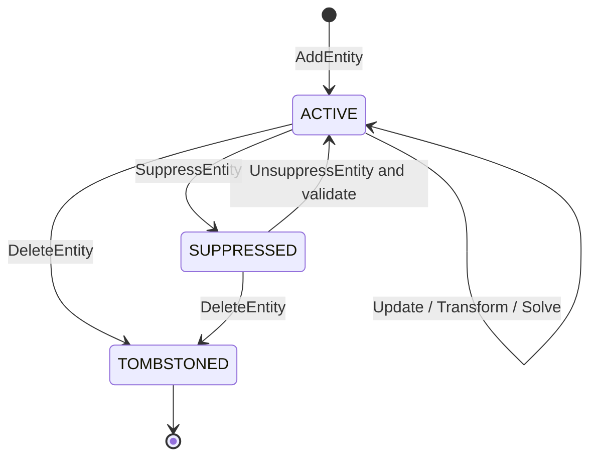

`TOMBSTONED` 不保存在当前 `entities[]` 中，而记录在 Workspace/Revision lineage metadata，防止 ID 复用并支持并发冲突解释。历史查看可以直接读取旧 Revision；持久 Undo/Restore 不修改旧 Revision，而是按 4.3.13 的补偿语义从 tombstone 恢复同一 identity、重新验证并形成新 Revision。

状态转换规则：

- Suppress 时同时把引用它的 Constraint 标为 `INACTIVE_DEPENDENCY`，保留但不求解；下游 Profile/Feature 重新验证；
- Unsuppress 必须重新验证所有 Constraint 和 Profile，失败则整个命令不提交；
- Delete 默认要求命令同时列出约束处理策略：`REJECT_IF_REFERENCED`、`DELETE_REFERENCING_CONSTRAINTS` 或明确 replacement map；
- Entity kind 变化使用 `ReplaceEntity`，内部语义为删除旧 ID、新建新 ID、显式迁移可兼容引用；
- Role 从 PROFILE 改为 CONSTRUCTION 会触发 Profile dirty，但几何求解可能无需重算；
- label/纯展示扩展变化不触发求解或 Profile dirty。

##### 5.3.4.10 命令与编辑操作

低层 operation 必须表达用户意图并能验证引用：

```text
EntityOperation = oneof {
  AddEntity
  UpdateEntityParameters
  SetEntityRole
  SetEntityState
  DeleteEntity
  ReplaceEntity
  TransformEntities
  SplitEntity
  TrimEntity
  ExtendEntity
  ReverseEntity
}
```

**UpdateEntityParameters** 携带 expected entity digest，避免同一 Sketch 并发修改时仅靠整个 Revision 冲突。它只能修改 kind 对应参数，不能修改 ID/kind。

**TransformEntities** 保存一个显式二维刚体/仿射变换和目标 ID 集：

- Move/Rotate 是刚体变换；
- Uniform Scale 允许，必须同时处理相关 Driving dimensions 的策略；
- 非均匀 Scale 会把 Circle 变 Ellipse，默认拒绝或要求 `ReplaceEntity`；
- Mirror 会反转 Arc sweep、Profile orientation 和部分角度 branch，必须由实体类型专用规则处理；
- 有约束实体的 Transform 通常转换为 DragTarget/初值并重新求解，不无视约束强改最终参数。

**SplitEntity** 在曲线参数 `u` 或精确交点处分裂：

- 旧实体 tombstone；生成两个新 EntityId；
- Line/CircularArc/EllipticArc/Bezier/BSpline 使用各自精确分割算法；
- 新相邻端点增加 Coincident（若它们本来同源且用户没有选择断开）；
- 返回 `EntityLineage { old -> [newA,newB], parameter_ranges }`；
- 约束只在语义唯一时自动迁移，例如旧 START → newA START、旧 END → newB END；WHOLE 引用必须由调用者或策略决定，不能猜测。

**TrimEntity** 不是简单隐藏曲线片段。它用选择点和相交候选确定保留参数域，底层执行 Replace/Split，并返回歧义候选。存在多个同距候选、切触、重叠或周期 seam 时必须要求分支提示。

**ExtendEntity** 第一阶段只支持 LineSegment 和 Arc 到明确的 target/intersection；若没有唯一可行交点则失败。**ReverseEntity** 交换 Line/开放曲线端点或反转 Arc sweep，并产生 sub-element mapping，使 START/END 引用可受控迁移。

所有几何编辑先产生候选实体和 Lineage，再统一执行 Constraint rewrite、Schema validation、Solve、Profile validation 与 CAS commit；不能让每个 operation 自行写数据库。

##### 5.3.4.11 EntityLineage 与引用迁移

```text
EntityLineage
  source_entity_ids[]
  result_entity_ids[]
  mappings[] {
    source_ref
    result_ref?
    parameter_transform?
    status: PRESERVED | SPLIT | MERGED | DELETED | AMBIGUOUS
  }
  operation_id
```

Lineage 是一次 Sketch 编辑事务的结果，不等同于 Part 的 Persistent Topological Naming，但遵循相同原则：能确定就迁移，不能确定就显式报告。

| 编辑 | 可自动迁移 | 必须显式处理 |
|---|---|---|
| Move/Rotate | 所有同 EntityId refs | 无 |
| Reverse Line/Arc | WHOLE；START/END 按 mapping 交换 | 有方向 Angle/Tangent branch 需重验 |
| Split | 原 START/END | WHOLE、任意内部 parameter ref |
| Trim | 被保留端点和唯一曲线段 | 被删除区间、多个候选 |
| Replace Circle→Arc | CENTER、可证明保留的曲线参数 | WHOLE Circle 约束、无端点到有端点语义 |
| Merge curves | 唯一连续参数映射 | 每个 WHOLE 引用及接缝约束 |

Constraint rewrite 必须产生审计结果：preserved、rewritten、deleted、unresolved。默认不静默删除尺寸；若命令选择级联删除，响应列出所有被删除 ConstraintId。

##### 5.3.4.12 OCCT-free 曲线查询接口

Solver、Profile、Trim 和预览需要相同几何语义，因此 `kernel/sketch/api` 提供只读接口：

```text
EntityGeometry
  Kind()
  Domain() -> bounded/periodic parameter domain
  Evaluate(u) -> point
  Derivatives(u, order<=2) -> point/tangent/curvature data
  SubElement(ref) -> point/axis/curve view
  BoundingBox(tolerance)
  ClosestPoint(query, branchHint?) -> candidates[]
  Intersections(other, tolerance) -> candidates[]
  IsDegenerate(tolerance)
  Canonicalize()
```

返回 Intersections/ClosestPoint 的是候选集合，每项包含双方参数、交点、类型 `CROSSING | TANGENT | OVERLAP_ENDPOINT | OVERLAP_INTERVAL`、残差和 multiplicity；上层根据用户 pick/branch hint 决定，实体模块不随意选择第一个结果。

解析几何优先使用项目自有稳定公式；复杂 Bezier/BSpline 可以在 OCCT-free 模块中使用经过验证的算法，或通过严格 Adapter 调用 OCCT 查询，但公共结果不得泄漏 OCCT 类型。OCCT `Geom2dAPI_InterCurveCurve` 可作为复杂曲线相交后端候选，并能区分交点与相切重叠段。[OCCT Geom2dAPI 文档](https://dev.opencascade.org/doc/refman/html/package_geom2dapi.html)

BoundingBox 必须保守包含曲线，不可只包围控制点或采样点后当成精确结果。预览折线由单独的 `Tessellate2D(chordTolerance, angularTolerance)` 生成并缓存，不进入 canonical model/hash。

##### 5.3.4.13 Solver 变量映射

实体模块产生稳定的 `VariableDescriptor`，而不是让 Solver Adapter自行遍历 Proto：

```text
VariableDescriptor
  variable_id = Hash(EntityId, semantic_parameter)
  entity_id
  semantic_parameter: X | Y | START_X | ... | CONTROL_POINT_X(index)
  dimension: LENGTH | ANGLE | DIMENSIONLESS
  scale
  lower_bound? / upper_bound?
```

映射规则：

- VariableId 由稳定语义生成，不依赖数组内存顺序；
- Suppressed、External、Builtin 不产生自由变量；
- Fixed/表达式直接驱动的参数由 Constraint/Parameter layer 标记锁定，而不是从实体删除；
- Circle radius、Ellipse axes、权重等正值参数允许 Adapter 使用内部变换，但必须提供 physical value/Jacobian chain rule；
- Arc 角度使用 unwrapped solver state，持久化时才规范化，防止穿越 `2π` 时跳变；
- BSpline control point ID 决定变量身份，knot/degree 第一阶段不是求解变量；
- 求解结果写回前按 Entity kind 重新验证和 canonicalize，失败返回 `SKETCH_DEGENERATE_ENTITY`。

##### 5.3.4.14 Profile、渲染与 OCCT 转换边界

**Profile Builder** 读取 Active + PROFILE 实体的权威求解结果；Construction/Centerline/Point 不形成边。连接优先依据 Coincident 等价类；纯坐标接近只用于诊断 `NEAR_MISS_ENDPOINTS`，不自动连接。

**渲染/拾取** 获取 `EntityRenderPacket`：EntityId、role/state、分段曲线、语义关键点和参数范围。客户端拾取回传 `(SketchId, EntityId, SubElement, curveParameter?)`，不能回传“第 12 段折线”作为持久引用。

**OCCT Adapter** 转换规则：

| 模型实体 | OCCT 目标 |
|---|---|
| LineSegment | `Geom2d_Line`/trimmed range → Edge |
| Circle | `Geom2d_Circle` → closed Edge |
| CircularArc | `Geom2d_Circle` + parameter range → trimmed Edge |
| Ellipse/EllipticArc | `Geom2d_Ellipse` + optional trim |
| Bezier | `Geom2d_BezierCurve` |
| BSpline | `Geom2d_BSplineCurve` |

OCCT 支持由二维曲线或点构建 Edge，但 EntityId/SubElement identity 必须由项目 Adapter 的 mapping 保留，不能从 OCCT 对象反推。[BRepBuilderAPI_MakeEdge2d](https://dev.opencascade.org/doc/refman/html/class_b_rep_builder_a_p_i___make_edge2d.html)

转换后执行 OCCT 完成状态、Edge 长度/退化、Wire 和 Face 检查。OCCT tolerance 是下游构造容差，不能反向改变原始 Sketch 参数或偷偷合并端点。

##### 5.3.4.15 Proto 草案

```proto
message SketchEntity {
  string id = 1;
  uint32 schema_version = 2;
  EntityRole role = 3;
  EntityState state = 4;
  string label = 5;
  oneof geometry {
    Point2 point = 20;
    LineSegment2 line_segment = 21;
    Circle2 circle = 22;
    CircularArc2 circular_arc = 23;
    Ellipse2 ellipse = 24;
    EllipticArc2 elliptic_arc = 25;
    Bezier2 bezier = 26;
    BSpline2 bspline = 27;
  }
  EntityProvenance provenance = 40;
}

message Vec2 { double x_mm = 1; double y_mm = 2; }
message Point2 { Vec2 point = 1; }
message LineSegment2 { Vec2 start = 1; Vec2 end = 2; }
message Circle2 { Vec2 center = 1; double radius_mm = 2; }
message CircularArc2 {
  Vec2 center = 1;
  double radius_mm = 2;
  double start_angle_rad = 3;
  double sweep_angle_rad = 4;
}
```

实际 Proto 应继续定义高阶曲线、GeometryRef 和 Operation。约定：

- `oneof` 中每个 kind 永久使用独立字段号；删除后 `reserved`；
- 坐标字段名包含规范单位，不能叫模糊的 `value`；
- 枚举零值是 `UNSPECIFIED`，业务验证拒绝；
- 不用 `google.protobuf.Any` 承载核心实体；插件实体使用另一个 namespaced extension 协议并要求 capability；
- 不在消息内存重复派生 start/end、length、bbox；
- Map 不用于需要规范顺序的核心几何；canonical serializer 按 EntityId 和明确字段序处理；
- 服务端限制 repeated 数量、消息深度和字符串长度。

##### 5.3.4.16 规范化、摘要与 Dirty 分类

`CanonicalEntity` 规则：验证 schema → 单位归一 → 角度/周期规范 → 清除 `-0` → 固定 IEEE-754 编码 → 按稳定 ID 排序子结构 → 序列化。禁止把数值四舍五入到建模容差后再哈希；这会让两个不同设计意图碰撞。缓存可额外使用 tolerance-aware spatial key，但业务 digest 必须精确对应规范输入。

```text
EntityDigest = Hash(
  entity schema version,
  id, kind, role, state,
  canonical physical parameters,
  solver-relevant registered extensions
)
```

变更分类：

| 变更 | Sketch solve | Profile | 下游 Part |
|---|---:|---:|---:|
| label/UI extension | 否 | 否 | 否 |
| role Profile→Construction | 约束仍有效时可复用解 | 是 | 是 |
| state suppress/unsuppress | 是 | 是 | 是 |
| physical parameter | 是 | 是 | 是 |
| construction-only geometry parameter | 是 | 否，除非约束带动 Profile | 由依赖传播决定 |
| provenance/lineage metadata | 否 | 否 | 否 |
| BSpline knot/degree | 是 | 是 | 是，且视为结构变化 |

Dirty propagation 按 Feature/Constraint dependency graph 计算，不能仅以 JSON 是否变化决定完整重生成。

##### 5.3.4.17 验证、错误与修复原则

验证分层：

1. **Wire format**：required/oneof/enum/长度；
2. **Entity schema**：kind 参数、数量、有限数、单位；
3. **Geometry**：退化、周期、连续性、knot/weight；
4. **Reference integrity**：Constraint/External/Lineage 引用存在且签名匹配；
5. **Solver result**：写回参数仍满足实体不变量；
6. **Profile eligibility**：是否可作为有界 Profile 曲线。

主要错误码：

| 错误码 | 条件 |
|---|---|
| `ENTITY_ID_INVALID` / `ENTITY_ID_EXISTS` / `ENTITY_ID_TOMBSTONED` | ID 不合法、重复或复用 |
| `ENTITY_KIND_UNSPECIFIED` / `ENTITY_KIND_UNSUPPORTED` | kind 缺失或 Worker 无能力 |
| `ENTITY_PARAMETER_NOT_FINITE` / `ENTITY_PARAMETER_OUT_OF_RANGE` | NaN/Inf 或超限 |
| `ENTITY_DEGENERATE_LINE` / `ENTITY_DEGENERATE_RADIUS` | 线长或半径低于阈值 |
| `ENTITY_ARC_SWEEP_INVALID` | sweep 为零、整圆或越界 |
| `ENTITY_ELLIPSE_AXES_INVALID` / `ELLIPSE_AXIS_AMBIGUOUS` | 长短轴不合法或轴引用不稳定 |
| `ENTITY_SPLINE_DEFINITION_INVALID` | degree/knot/multiplicity/weight 不满足规则 |
| `ENTITY_REFERENCE_INVALID_SUBELEMENT` | kind 与 SubElement 不匹配 |
| `ENTITY_REFERENCED_BY_CONSTRAINT` | 删除策略拒绝悬空引用 |
| `ENTITY_EDIT_AMBIGUOUS` | Trim/Extend/Split 分支不唯一 |
| `ENTITY_EDIT_STALE` | expected digest 或 Workspace sequence 过期 |
| `ENTITY_CONVERSION_FAILED` | 模型有效但 OCCT Adapter 构造失败 |

实体模块不做静默 healing。可逆、语义唯一的规范化（清除 `-0`、角度加减 `2π`）自动执行；会改变设计的修复（合并近点、删除短边、圆转弧、重建 spline knot）只能作为显式命令并预览影响。

##### 5.3.4.18 并发与幂等

一个 `EDIT_SKETCH` 仍以 Workspace sequence 做最终 CAS；实体级 `expected_entity_digest` 用于生成精确冲突说明和安全 rebase：

- 修改不同 Entity 且没有共同 Constraint/Profile 依赖，可以重放到新 Head 后重新求解；
- 修改同一 Entity 参数产生语义冲突；
- 一方删除 Entity、另一方修改/约束它，必须冲突；
- 一方移动端点、另一方新增 Coincident，可尝试重放后求解，但客户端必须收到重新求解后的权威位置；
- label 与几何参数修改可以字段级合并；
- Split/Trim/Replace 属结构编辑，遇到任何目标 Entity 新变更默认冲突，不基于坐标猜测重放。

每个 operation 有 OperationId；Add 使用请求中确定的 EntityId；重试相同 request/operation 得到相同结果。相同 OperationId 携带不同 payload 返回 `IDEMPOTENCY_KEY_REUSED`。

##### 5.3.4.19 性能与资源边界

- Entity 以紧凑值对象连续存储，ID→index 使用只在内存构建的索引；持久引用仍是 ID；
- 基本实体 Evaluate/Derivative/BoundingBox 不分配堆内存；批量 API 写入调用方缓冲；
- 空间索引（R-tree/BVH）是 `(SketchSolveKey, entity digests)` 的可丢失缓存；
- 修改 Entity 只重建其 bbox 和受影响空间节点；
- 相交查询先 bbox broad phase，再精确 narrow phase；
- 曲线预览按视图容差自适应细分，并设置每实体/每 Sketch 最大段数；
- BSpline degree、control point、knot、entity 总数和坐标范围有硬上限；
- 任何 O(n²) 全相交扫描必须在候选过滤后执行，并服从 deadline/cancellation；
- Canonical serialization 和 digest 支持增量 Merkle 组合，但最终根必须与全量规范序列化定义一致。

##### 5.3.4.20 实体模块测试矩阵

| 测试层 | 覆盖内容 |
|---|---|
| Schema golden | 每种 kind 的最小/完整 Proto、未知字段、旧版本迁移 |
| Parameter unit | Evaluate、D1/D2、domain、bbox、closest point 的解析案例 |
| Degeneracy | 零线、微小半径、Arc seam/整圆、Ellipse 近圆、坏 spline |
| Reference | 所有合法/非法 SubElement，Builtin/External/Entity 三类目标 |
| Edit operation | Add/Update/Delete/Suppress/Transform/Split/Trim/Extend/Reverse |
| Lineage | START/END/WHOLE/control point 映射与歧义结果 |
| Metamorphic | 平移/旋转/镜像/单位换算前后曲线不变量 |
| Differential | 自有解析几何与 OCCT evaluation/intersection 在容差内对照 |
| Canonical/hash | 字段顺序、`-0`、角度周期、跨 Go/C++ 字节一致 |
| Solver adapter | VariableId/physical mapping、角度 unwrap、正半径 chain rule |
| Profile integration | role/state、Coincident 连接、Circle/Arc、多曲线闭环 |
| Concurrency | expected digest、ID tombstone、结构编辑冲突、幂等重试 |
| Fuzz/property | Proto、参数域、spline knot、Split/Trim 候选与相交算法 |
| Benchmark | 10k lines/circles 的 validation、bbox index、hash 和局部更新 |

每个 Entity kind 合入核心 schema 的完成条件：schema + canonical mapping + validator + evaluate/D1 + conservative bbox + SubElement resolver + Solver variable adapter + render tessellation + OCCT conversion + corpus 全部存在。只有“能画出来”或“OCCT 有对应类”不算完成。

##### 5.3.4.21 实施顺序

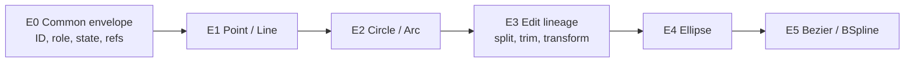

**E0**：完成 Proto envelope、GeometryRef、内建几何、ID/tombstone、canonical hash、错误模型。

**E1**：Point/LineSegment、矩形兼容迁移、P0 引用和 Profile 直线闭环。

**E2**：Circle/CircularArc、周期/branch、圆孔和圆弧 Profile。

**E3**：Lineage、Delete policy、Transform/Split/Trim/Reverse 与并发冲突。

**E4**：Ellipse/EllipticArc、轴歧义、相交和 OCCT 对照。

**E5**：Bezier/BSpline，先固定结构求控制点，再逐步开放高阶约束。

E0–E2 是草图 P0 权威求解的前置范围；不要等待 Spline 才交付通用草图。每一阶段都必须保持旧矩形 Revision 可读，并用同一 Entity Adapter 同时服务 Solver、Profile、渲染和 OCCT 转换。

#### 5.3.5 约束模型与交付顺序

约束分为几何约束、尺寸约束和求解控制约束。

| 优先级 | Constraint | 引用/参数 | 语义 |
|---|---|---|---|
| P0 | `COINCIDENT` | point, point | 两点重合 |
| P0 | `HORIZONTAL` / `VERTICAL` | line | 线方向水平/垂直 |
| P0 | `DISTANCE_X` / `DISTANCE_Y` | point, point, length | 有符号水平/垂直距离 |
| P0 | `DISTANCE` | point-point 或 point-line, length | 欧氏/垂直距离，需保存分支 |
| P0 | `LENGTH` | line, length | 线段长度 |
| P0 | `RADIUS` / `DIAMETER` | circle/arc, length | 圆弧尺寸 |
| P0 | `FIX_POINT` | point, x/y parameter | 将点固定到明确坐标，不用隐式全局锁 |
| P1 | `PARALLEL` / `PERPENDICULAR` | line, line | 方向关系 |
| P1 | `POINT_ON_OBJECT` | point, curve | 点位于曲线 |
| P1 | `TANGENT` | curve, curve + contact intent | 相切并保持内/外分支 |
| P1 | `EQUAL` | 同类 curve/line | 等长或等半径 |
| P1 | `CONCENTRIC` | circle/arc pair | 圆心重合 |
| P1 | `MIDPOINT` | point, line | 点在线段中点 |
| P1 | `ANGLE` | line-line 或 line-axis, angle | 有向角，规范到明确区间 |
| P2 | `SYMMETRIC` | entity pair + axis | 关于线或轴对称 |
| P2 | `COLLINEAR` | line pair | 共线，不等于仅平行 |
| P2 | `BLOCK` | entity | 固定实体当前全部参数，作为显式用户操作 |
| P2 | `CURVATURE_CONTINUITY` | spline/curve pair | 高阶曲线阶段 |

尺寸约束具有 `mode`：

- `DRIVING`：表达式/数值进入方程，驱动几何；
- `DRIVEN`：仅测量求解结果，不增加方程；
- `REFERENCE`：与 Driven 等价，但显式用于 UI/工程引用；
- `SUPPRESSED`：保留身份和表达式但本次不参与求解。

系统不使用“无限大权重”模拟硬约束。几何/Driving 约束是等式系统；拖拽目标是可行流形上的优化目标。自动约束建议（端点吸附、水平、相切）由客户端或独立 suggestion 模块生成，只有用户提交后才成为持久 Constraint。

**方程与残差约定**

设点 `p=(x,y)`，线方向 `u=p_end-p_start`，二维叉积 `cross(u,v)=u.x*v.y-u.y*v.x`。Adapter conformance suite 使用同一语义，而不要求不同后端使用完全相同的内部方程。

| 约束 | 独立标量方程/规范残差 | 实现注意 |
|---|---|---|
| Coincident(p,q) | `p.x-q.x = 0`；`p.y-q.y = 0` | 两个方程，不是一个距离软目标 |
| Horizontal(line) | `u.y = 0` | 除以 characteristic length 归一化 |
| Vertical(line) | `u.x = 0` | 同上 |
| DistanceX(p,q,d) | `(q.x-p.x)-d = 0` | `d` 有符号，镜像不会自动改符号 |
| DistanceY(p,q,d) | `(q.y-p.y)-d = 0` | `d` 有符号 |
| Distance(p,q,d) | `hypot(q-p)-d = 0` | 零距离使用 Coincident；避免零点不可导 |
| Length(line,d) | `hypot(u)-d = 0` | 中间迭代仍需防止退化到零 |
| Radius(circle,r) | `circle.r-r = 0` | 实体半径用正值参数化或显式边界 |
| Parallel(a,b) | `cross(u_a,u_b)=0` | 再以两线长度归一；近零线先判无效 |
| Perpendicular(a,b) | `dot(u_a,u_b)=0` | 同样归一 |
| PointOnLine(p,l) | `cross(p-l.start,u_l)=0` | 对 line segment 默认约束无限延长线；有界语义需新类型 |
| PointOnCircle(p,c) | `hypot(p-c.center)-c.r=0` | PointOnObject 根据 curve kind 分派 |
| Concentric(a,b) | 两圆心坐标分别相等 | 等价于 center Coincident，但保留用户语义 |
| Equal(line pair) | `length(a)-length(b)=0` | Equal(circle pair) 比较 radius |
| Midpoint(p,line) | `p-(start+end)/2=(0,0)` | 两个方程 |
| Angle(a,b,theta) | 方向的 `atan2(cross,dot)` 与 `theta` 同分支 | 在 ±π 附近用 branch state/周期残差避免跳变 |
| Tangent(curve pair) | 接触点重合 + 两切向平行，或等价解析式 | 必须保存接触参数及内切/外切意图，不能只比较距离 |
| FixPoint(p,x0,y0) | `p.x-x0=0`；`p.y-y0=0` | 固定值进入模型，不能取决于 Worker 当前坐标 |

同一个 Constraint 的方程数是 schema 的一部分。数值后端可以做解析消元，但诊断仍必须映射回原 ConstraintId。约束图中的每个方程保留 `(ConstraintId, equationIndex)` 来源，才能在秩分析和冲突定位后给出稳定结果。

自由度定义为 `DoF = freeVariableCount - rank(J)`，其中 `J` 是收敛解处按统一尺度归一后的硬约束 Jacobian；External 和 Fixed 参数不计入 free variables。Rank threshold 来自版本化 ToleranceProfile。全局总 DoF 是严格数值，`entity_dof` 是由 Jacobian null-space 支持集产生的解释性映射：若一个零空间方向同时移动多实体，应返回一个关联实体组，不能武断把该自由度只归给某一条线。

冗余表示新增方程没有提高 Jacobian rank；冲突表示约束系统在容差内不存在共同可行解。欠约束不是冲突。求解器必须先区分这三者，再决定是否执行较昂贵的冲突候选搜索。

#### 5.3.6 参数、单位与表达式

SketchModel 保存表达式文本和 ParameterId，不把表达式解析塞进数值求解器。Model/Part Evaluation 层负责：

1. 解析受限 AST；
2. 解析 `10 mm`、`2 in`、`45 deg` 等单位；
3. 解析 Part 参数、配置参数和允许的上游只读参数引用；
4. 检查量纲、循环和除零；
5. 输出规范 mm/rad 的 double 和依赖列表。

求解器只接收有限数值与 Dimension 类型。禁止 `eval`、文件/网络访问、随机数、当前时间或不确定函数。表达式结果、表达式引擎版本和依赖值进入 SketchSolveKey。

#### 5.3.7 求解器抽象与技术选择

公共 C++ 接口必须先于具体库稳定：

```text
SketchSolver
  Analyze(model, options) -> StructuralDiagnostics
  Solve(model, evaluatedParameters, options, warmStart?) -> SolveResult
  SolveDrag(model, evaluatedParameters, dragTarget, warmStart) -> SolveResult
```

`SolveOptions` 包含 tolerance profile、最大迭代、deadline、诊断等级和 branch policy；不能让业务层传任意后端调参。`WarmStart` 是同一 solver build 产生的可丢失提示，跨版本或输入 hash 不匹配时忽略。

推荐建立 `PlaneGCSAdapter` 技术验证。FreeCAD 的 Sketcher/PlaneGCS 已用于实际几何约束草图，FreeCAD 仓库采用 LGPL-2.1；但 PlaneGCS 是 FreeCAD 内部组件而非承诺稳定 ABI 的独立库，因此必须通过适配器隔离，并在引入前审计具体源码文件、依赖、修改发布和动态/静态链接义务。[FreeCAD 官方仓库](https://github.com/FreeCAD/FreeCAD)

初始技术基线锁定 FreeCAD 1.0.2 的 commit `256fc7eff3379911ab5daf88e10182c509aa8052`：只获取带逐文件 SHA-256 的 PlaneGCS 核心清单，构建独立 LGPL shared library，并随构建产物复制上游许可证。选择 1.0.2 而非当前 1.1.x 的原因是前者原生兼容项目已验证的 C++17 工具链；不能为了追随上游版本而在适配层外散布 C++20 补丁。升级时必须重新审计源文件清单、许可证、依赖、conformance corpus 和确定性结果，不能只替换 commit。项目 `SketchSolver` 接口及模型不得包含 `GCS::*` 类型。

建议交付顺序：

1. 用项目自有 SketchModel 和测试语料定义行为；
2. 将 PlaneGCS 作为单独构建的共享库/内部包做 P0/P1 约束 spike；
3. 以 adapter contract 跑相同 conformance suite；
4. 通过正确性、诊断质量、性能、确定性和许可证评审后才设为默认后端；
5. 保留替换为自研 solver 或其他后端的能力。

[SolveSpace](https://github.com/solvespace/solvespace)/libslvs 当前采用 GPL-3.0，不作为 MIT 核心进程的默认链接依赖；如未来使用，应经过许可证评审并采用明确隔离的可选插件。不要把 Ceres 直接当成完整 CAD 草图求解器：Ceres 擅长非线性最小二乘，但 CAD 仍需约束分解、冗余诊断、分支选择和退化处理。它可作为特定后端构件。[Ceres 文档](https://ceres-solver.readthedocs.io/latest/)

#### 5.3.8 求解流水线

```mermaid
flowchart LR
    Input["SketchModel + evaluated parameters"] --> Validate["Schema and numeric validation"]
    Validate --> Graph["Constraint graph decomposition"]
    Graph --> Reduce["Analytic reduction and variable mapping"]
    Reduce --> Init["Branch-aware initialization / warm start"]
    Init --> Numeric["Solve each connected component"]
    Numeric --> Rank["Jacobian rank / DoF analysis"]
    Rank --> Diagnose["Redundancy and conflict diagnosis"]
    Diagnose --> Geometry["Degeneracy and geometry validation"]
    Geometry --> Profiles["Profile extraction"]
    Profiles --> Output["SolveResult"]
```

具体要求：

1. **输入验证**：限制实体/约束数量、坐标范围、有限数、正半径、合法引用和表达式量纲；
2. **图分解**：以变量和约束构成二部图，按连通分量独立求解；只改一个局部时不重算无关分量；
3. **变量映射**：使用端点坐标、圆心/半径等无奇异参数化；识别固定/只读变量；
4. **尺度归一化**：长度残差按 Sketch characteristic length 归一，角度按 rad 归一，防止毫米值和角度值条件数失衡；
5. **分支保持**：Arc sweep、角度方向、内/外切、点在线段哪一侧等离散意图作为 branch hint；数值解不得无提示翻转；
6. **数值求解**：后端可使用 DogLeg/Levenberg-Marquardt/稀疏 QR，但必须服从统一 deadline 和诊断接口；
7. **秩分析**：根据约束 Jacobian 数值秩计算剩余自由度，并报告受影响实体；
8. **冲突定位**：先找结构冗余，再对不一致组件执行有界 deletion filtering，返回 irreducible conflict candidate；不承诺昂贵的全局最小冲突集；
9. **结果验证**：拒绝零长度、负/近零半径、非法 Arc、非有限参数和超出坐标策略的结果；
10. **规范输出**：清除 `-0`、规范角度和实体顺序，结果只按稳定 ID 关联。

Tolerance 不散落为魔法常量。版本化 `ToleranceProfile` 至少包含 length/angular residual、rank threshold、degeneracy、coincidence、max iterations 和 profile closure tolerance。默认值由单位跨度语料和 OCCT 下游容差共同标定；`tolerance_profile_id` 与 solver build digest 必须进入缓存键和诊断。

#### 5.3.9 求解状态与诊断契约

`SolveResult` 至少返回：

```text
SolveResult
  status
  solved_entities keyed by EntityId
  measured_parameters keyed by ParameterId
  remaining_dof
  entity_dof[]
  redundant_constraint_ids[]
  conflicting_constraint_ids[]
  diagnostics[] { code, severity, entities, constraints, message_key, details }
  iterations, normalized_residual, elapsed_ms
  solver_build_digest, tolerance_profile_id
  branch_state, warm_start_token?
  profiles[]
```

状态定义：

| 状态 | 可保存 Sketch | 可供 Pad 使用 | 默认命令行为 |
|---|---:|---:|---|
| `SOLVED_FULLY_CONSTRAINED` | 是 | 闭合 Profile 有效时是 | 提交 |
| `SOLVED_UNDER_CONSTRAINED` | 是 | 闭合 Profile 有效时是 | 提交并警告剩余 DoF |
| `REDUNDANT_CONSTRAINTS` | 否，已有旧 Revision 可读取 | 否 | 拒绝新增冗余约束，建议转 Driven |
| `CONFLICTING_CONSTRAINTS` | 否，已有坏模型可加载诊断 | 否 | 原子拒绝本次编辑 |
| `NON_CONVERGENT` | 否 | 否 | 拒绝并返回可定位诊断 |
| `INVALID_GEOMETRY` | 否 | 否 | 拒绝退化实体 |
| `UNRESOLVED_EXTERNAL` / `FAILED_SUPPORT` | 保留已有 Revision | 否 | 上游变化时标记失败，不静默重绑 |
| `UNSUPPORTED` | 否 | 否 | 返回具体 Entity/Constraint 类型 |

开放草图本身合法，只是没有可供 Pad 使用的 Profile。约束不足不等于错误；系统必须告诉用户哪些实体仍有平移/旋转/尺度自由度，而不是只返回一个总数。

统一机器错误码示例：`SKETCH_INVALID_SCHEMA`、`SKETCH_STALE_BASE`、`SKETCH_UNRESOLVED_SUPPORT`、`SKETCH_UNSUPPORTED_ENTITY`、`SKETCH_REDUNDANT_CONSTRAINT`、`SKETCH_CONFLICTING_CONSTRAINT`、`SKETCH_NON_CONVERGENT`、`SKETCH_DEGENERATE_ENTITY`、`SKETCH_OPEN_PROFILE`、`SKETCH_SELF_INTERSECTION`、`SKETCH_SOLVER_TIMEOUT`。人类文本由客户端按 `message_key` 本地化，服务端不要让调用方解析英文错误字符串。

#### 5.3.10 Profile Builder 与 OCCT 集成

求解成功不代表草图能生成实体。Profile Builder 是独立阶段：

1. 排除 construction、suppressed 和只读 external 辅助实体；
2. 把求解后的 Line/Circle/Arc 转换为二维曲线；
3. 依据 Coincident 等价类共享拓扑顶点，而不是仅按浮点距离猜测连接；
4. 检测零长度、重复/重叠曲线、自交、T-junction 和悬空边；
5. 建立 planar graph，抽取所有闭合 cycle；
6. 根据有向面积和包含关系确定外环/孔洞；
7. 为每个区域生成稳定 `ProfileRegionId`，其来源是有序 EntityId/方向及 SketchId，而不是 OCCT Edge 序号；
8. 映射到支撑平面，调用 OCCT 构建 Edge/Wire/Face；
9. 使用 `BRepCheck`/面积检查验证结果，再交给 Pad/Pocket 等 Feature。

OCCT 提供 Edge/Wire/Face 构造能力，但不承担参数约束系统；两层必须隔离。[OCCT BRepBuilderAPI](https://dev.opencascade.org/doc/refman/html/package_brepbuilderapi.html)

Pad 的输入从 `SketchId` 升级为 `ProfileSelection { sketch_id, region_ids, selection_policy }`。如果上游修改导致 region 分裂或合并，Persistent Selection Resolver 必须报告歧义，禁止按“第一个 Wire”继续拉伸。

#### 5.3.11 持久化、缓存与哈希

第一阶段继续把 SketchFeature 放在不可变 `document_versions.model_json` 中，避免为每条线建立高写放大的关系表。PostgreSQL 只额外索引有业务查询价值的 Sketch/Parameter/External reference；未来协作量证明需要时再投影成专用表。

模型中保存：用户/权威提交后的实体参数、约束、表达式、支撑引用和 branch intent。以下内容是可重建缓存，不是业务真相：Jacobian、分解、warm start、求解日志、Profile B-Rep 和预览网格。

```text
SketchSolveKey = Hash(
  canonical SketchFeature,
  evaluated parameter values,
  resolved support revision + frame,
  external geometry digests,
  solver build digest,
  expression engine version,
  tolerance profile id,
  units policy id
)
```

规范化必须按稳定 ID 排序、统一单位/角度、拒绝 NaN/Infinity、规范 `-0`，并使用明确的浮点编码，不能依赖语言默认 JSON 格式。缓存命中仍需验证 build/schema/capability；结果可以存入 ArtifactStore 小对象或 Worker LRU，丢失后可重算。

#### 5.3.12 命令、API 与 Proto

持久编辑继续通过 Document Command/Transaction 边界，不为每条线建立任意 CRUD API。一个用户动作提交一个 `EDIT_SKETCH`：

```text
EditSketchCommand
  request_id
  expected_workspace_sequence
  sketch_id
  operations[]:
    AddEntity | UpdateEntity | DeleteEntity
    AddConstraint | UpdateConstraint | DeleteConstraint
    SetDimensionExpression | SetConstruction
    SetSupport | AddExternalGeometry | RemoveExternalGeometry
  client_solve_digest?  // 仅诊断，不能作为可信结果
```

删除实体时，必须在同一事务显式删除/重定向引用它的约束；后端不猜测级联。矩形、圆角矩形等创建工具在客户端形成批量 operations，服务端只验证规范基本实体。

外部 HTTP 建议保留统一命令入口，并增加一个无持久副作用的求解入口：

| 接口 | 语义 |
|---|---|
| `POST /api/documents/{id}/commands` | 提交 `CREATE_SKETCH` / `EDIT_SKETCH`，求解后 CAS 形成新 Revision |
| `POST /api/documents/{id}/sketches/{sketchId}:solve` | 对完整候选 Snapshot 做权威预览求解，不写数据库 |
| `GET /api/documents/{id}/sketches/{sketchId}/diagnostics` | 获取当前 Revision 的缓存诊断；缺失时可重算 |

内部 Protobuf 采用新的 `SketchService` capability 或将 `SketchModel` 嵌入版本化 `EvaluatePartRequest`。推荐接口：

```text
rpc SolveSketch(SolveSketchRequest) returns (SolveSketchResponse)
rpc EvaluatePart(EvaluatePartRequest) returns (EvaluatePartResponse)

SolveSketchRequest
  request_id, tenant_id, model_hash
  SketchModel model
  EvaluatedParameter[] parameters
  SketchSupportSnapshot support
  SolveMode mode = ANALYZE | COMMIT | DRAG
  DragTarget drag_target?
  bytes warm_start_token?
  string tolerance_profile_id
```

大对象不放入 Proto；External curve snapshot 过大时以内容摘要和 signed artifact reference 传递。协议使用 `oneof` 表达 Entity/Constraint 变体，删除字段号必须保留。服务端根据 Worker capabilities 路由，不认识的 schema 返回 `UNSUPPORTED`，不能丢弃未知约束后继续计算。

#### 5.3.13 提交事务与并发控制

当前实现会在持有 Document 行锁的数据库事务中同步执行 Geometry gRPC。草图高频编辑上线前必须改为计算与提交分离：

```mermaid
sequenceDiagram
    participant C as Client
    participant M as Model Service
    participant P as PostgreSQL
    participant W as Part Evaluation Worker
    participant O as ArtifactStore

    C->>M: EDIT_SKETCH(expectedSeq=42, operations)
    M->>P: read Revision 42 + ACL
    P-->>M: immutable base model
    M->>M: apply operations to candidate
    M->>W: SolveSketch / Evaluate dirty Feature DAG
    W-->>M: solved candidate + diagnostics + artifacts
    M->>O: put content-addressed artifacts
    M->>P: short transaction: CAS head 42 -> 43
    alt head still 42
        P-->>M: commit Revision 43 + Outbox
        M-->>C: authoritative model and diagnostics
    else head changed
        P-->>M: zero rows updated
        M-->>C: SKETCH_STALE_BASE + conflict details
    end
```

计算阶段不持有数据库锁。最终短事务检查 `expected_workspace_sequence`/Head Revision，写入 Command、Revision、History、Artifact references 和 Outbox。若 Head 已改变，已生成内容寻址制品可以复用或由 GC 清理，但绝不能覆盖新 Head。

同一 Sketch 的并发编辑按 EntityId/ConstraintId 生成冲突集；不同 Sketch 或不相交 Feature 可在依赖允许时自动 rebase 后重新求解。软编辑 presence/lease 只改善体验，不替代乐观并发。`request_id`/幂等键保证客户端重试不会生成两个 Revision。

#### 5.3.14 拖拽与交互求解

拖拽不写 Command、不创建 Version、不在每个 pointer move 后重生成完整 Part。

创建交互采用 CATIA Sketcher 的渐进 characteristic-point 模式作为产品参照，而不复制其 UI：进入上下文必须绑定明确的 `SketchId + support plane`；Point 是一次采集，Line/两点 Rectangle 是“第一点 → pointer move 动态预览 → 第二点”；复合图元提交后工具保持激活以便连续创建。Esc 首先取消尚未完成的采集或约束首选，当前没有中间状态时才退出工具回到 Select。选择已有 Sketch 后使用同一入口重新进入编辑，不能创建另一个共面 Sketch 或根据数组顺序猜测活动对象。

视口必须分别渲染 Point、Curve、curve endpoints、construction geometry 和 constraint glyph，不能把单点塞入 Line primitive。活动 Sketch 独占显示本地 H/V 轴、origin 和可配置网格；默认诊断色遵循 White=under-constrained、Green=solved/fixed、Purple=over/redundant、Red=inconsistent，construction geometry 使用 Gray。SmartPick hover 与约束首选必须高亮稳定 GeometryRef，并以可访问状态文本说明下一步；hover 只产生建议，是否生成永久约束由显式策略决定。参照：[CATIA Sketcher tools](https://catiahelp.azurewebsites.net/English/DysUserMap/dys-c-BeforeYouBegin-ToolsSketchingUse.htm)、[CATIA constraint diagnosis colors](https://catiahelp.azurewebsites.net/English/DysUserMap/dys-c-BeforeYouBegin-ColorUse.htm)、[CATIA rectangle creation](https://catiahelp.azurewebsites.net/English/DysUserMap/dys-t-SimpleProfileSketch-Rectangle.htm)。

```mermaid
sequenceDiagram
    participant B as Browser
    participant L as Local WASM solver
    participant A as Authoritative backend

    B->>L: begin drag(entity point, target)
    loop pointer move
        B->>L: SolveDrag(snapshot, target, warm start)
        L-->>B: preview entities + DoF
    end
    opt periodic validation or no local solver
        B->>A: transient SolveSketch(DRAG, full snapshot)
        A-->>B: authoritative preview + diagnostics
    end
    B->>A: pointer-up EDIT_SKETCH(expectedSeq, final operations)
    A->>A: full COMMIT solve and downstream regeneration
    A-->>B: committed authoritative Revision
```

DragTarget 是临时目标，不成为持久硬约束。求解器在满足所有硬约束的可行流形上最小化目标位移；若目标不可达，返回最近可行位置和被约束方向。拖拽必须复用分解、变量映射和上一帧结果。Local WASM 与服务端必须共享 conformance tests 和 solver build/protocol version；即便算法相同，服务端仍重新求解并验证。

第一阶段可只提供无状态 unary preview：每次携带完整 Snapshot，易于重试和扩缩容。只有测量证明网络/序列化成为瓶颈后，才增加双向流式 Sketch Session；Session 可固定 Worker 并缓存 warm state，但断线后客户端必须能用完整 Snapshot 在另一 Worker 恢复。

#### 5.3.15 外部几何

ExternalGeometry 不复制一条“看起来相同”的普通线，而是保存：

- 上游 Revision/Feature 的 PersistentSelection；
- 投影方式（正交投影、交线、silhouette 等）；
- resolved source digest 与二维 curve snapshot；
- 可引用子元素和解析诊断。

上游变更时先经 Persistent Topological Naming 解析，再重新投影。来源删除、歧义或投影退化时标记 `UNRESOLVED_EXTERNAL`，所有依赖约束列出受影响 ID。External geometry 是只读变量，可以参与 Coincident/Distance/Tangent 等约束；用户若要脱离来源，必须执行显式 `DETACH_EXTERNAL_GEOMETRY` 生成普通实体。

#### 5.3.16 性能、资源限制与安全

性能优化顺序：约束图分解 → dirty component → warm start → 缓存符号稀疏结构 → 避免拖拽期间 Part 重生成 → 最后才考虑并行/GPU。一个 Sketch 的耦合组件通常必须在一个 Solver 实例中求解，不跨 Worker 分割；不同 Sketch/配置可以跨 Worker 并行。

工程预算作为基准目标而非协议承诺：典型少于 200 个实体的本地拖拽争取单帧级响应；服务端权威 preview 争取交互级响应；超大 Sketch 超过同步预算时返回可取消异步分析。所有路径强制：

- entity/constraint/expression node 数量上限；
- 坐标、半径和维度范围；
- CPU deadline、最大迭代和内存预算；
- 请求/响应大小限制；
- cancellation 传播；
- NaN/Infinity 和 protobuf/JSON fuzz 防护；
- 租户并发与 CPU 秒配额。

求解器不得访问网络、文件或数据库。Expression 不执行用户代码。恶意 Sketch 导致超时只终止本次计算，不能拖垮共享 API 进程，因此最终求解位于受限 C++ Worker 而不是 Go HTTP 进程。

#### 5.3.17 可观测性

每次权威求解记录 Trace Span，但不记录完整专有几何内容。指标至少包括：

- `sketch_solve_duration_ms`（mode、status、size bucket）；
- entity/constraint/connected-component 数；
- remaining DoF、iterations、normalized residual；
- warm/cache hit；
- redundancy/conflict/non-convergence/timeout 计数；
- Profile cycle 数、自交/开放失败数；
- CAS conflict/rebase 次数；
- solver build、schema version、tolerance profile。

诊断响应携带 request/trace ID，便于从用户看到的冲突约束追踪到 Worker；日志只写 ID、计数和错误码，不写表达式秘密或整个模型。

#### 5.3.18 测试体系

| 层级 | 必须覆盖 |
|---|---|
| Schema unit | 每种 Entity/Constraint 签名、非法引用、单位和有限数 |
| Equation unit | 每条约束的残差/Jacobian，与有限差分或自动微分对照 |
| Solver conformance | 全约束、欠约束、冗余、冲突、分支、退化和非收敛 |
| Property/metamorphic | 平移/旋转/单位换算后 DoF 与约束语义不变 |
| Migration | 旧矩形与 4 线约束模型产生等价 Profile、面积和 Pad |
| Profile corpus | 多环、孔、相切、自交、重叠、微小边、开放轮廓 |
| Kernel integration | Solve → Wire/Face → Pad/Pocket，检查 BRepCheck 和质量属性 |
| Protocol | 旧 schema 重放、未知 oneof、能力协商、确定性序列化 |
| Concurrency | stale sequence、幂等重试、不同 Sketch rebase、迟到结果 |
| Failure injection | Worker crash/timeout、上传后 CAS 失败、缓存丢失 |
| Fuzz | JSON/Proto、表达式、约束图、Profile Builder |
| Benchmark | 50/200/1000/5000 实体、稀疏/稠密图、拖拽连续帧 |

建立可公开的 Sketch corpus，每个案例保存输入 schema、期望 status/DoF/冲突集范围、几何不变量和允许容差。Golden 测试不能只比较浮点逐字节；比较约束满足、拓扑区域、测量值和分支意图。PlaneGCS adapter、自研 solver 与 WASM 后端运行同一 conformance suite。

#### 5.3.19 分阶段实施

```mermaid
flowchart LR
    S0["S0 Schema + compatibility"] --> S1["S1 P0 authoritative solve"]
    S1 --> S2["S2 diagnostics + drag"]
    S2 --> S3["S3 profiles + external geometry"]
    S3 --> S4["S4 scale + collaboration"]
```

**S0 — 模型与兼容层**

- 定义 SketchModel v1、稳定 ID、Support、Entity/Constraint `oneof`；
- 旧矩形确定性适配为四线模型；
- 建立 canonical serialization、ToleranceProfile 和 corpus；
- 先做 `SketchSolver` fake/reference adapter，不改现有 Pad 输出。

**S1 — 服务端权威 P0 求解**

- PlaneGCS adapter spike 和许可证评审；
- Point/Line/Circle/Arc 与 P0 constraints；
- SolveResult、DoF、基础冲突/冗余诊断；
- Profile Builder 和新的 EvaluatePart input；
- `EDIT_SKETCH` 计算外置 + CAS 提交。

**S2 — 专业交互**

- P1 constraints、branch preservation、driven dimensions；
- warm start、dirty component、无状态 preview；
- 同源 WASM 或兼容本地 solver；
- constraint suggestion 和局部化诊断 UI 契约。

**S3 — 稳定下游引用**

- 多 Profile/孔洞/自交诊断；
- Persistent `ProfileRegionId`；
- PLANAR_FACE support 与 ExternalGeometry；
- P2 constraints、ellipse/spline 的受控子集。

**S4 — 规模与协作**

- 大 Sketch 基准驱动的稀疏优化；
- 相同 Sketch entity-level conflict/rebase；
- 必要时流式 Sketch Session；
- 求解制品共享缓存、按租户配额和生产 SLO。

每阶段必须能读取所有旧 Revision；没有 corpus 通过、许可证结论和诊断正确性，不进入下一阶段。S1 完成前不应优先拆独立 Sketch 微服务，S3 完成前不应让大量下游 Feature 持久引用临时 OCCT Edge ID。

#### 5.3.20 建议的仓库模块布局

以下是目标边界，不要求一次创建全部目录：

```text
proto/occccad/sketch/v1/
  sketch_model.proto             Entity / Constraint / Support / Parameter
  sketch_solver.proto            Solve request/result/diagnostics

services/internal/sketch/
  model.go                       JSON/Proto domain mapping and validation
  commands.go                    EDIT_SKETCH operation application
  canonical.go                   deterministic model hash input
  compatibility.go               legacy rectangle adapter

kernel/sketch/api/
  include/occccad/sketch/        OCCT-free public model and interfaces

kernel/sketch/entity/
  model + validation             Point/Line/Circle/Arc/Ellipse/Spline
  geometry queries               evaluate, derivatives, bbox, intersections
  canonicalization               stable digest and schema migration

kernel/sketch/edit/
  operations + lineage           transform, split, trim, reverse, ref mapping

kernel/sketch/solver-api/
  variable mapping               stable physical variables and constraints
  SketchSolver interface         backend-neutral solve contract

kernel/sketch/solver-planegcs/
  PlaneGCS adapter               optional backend behind the interface

kernel/sketch/profile/
  planar graph, cycles, region identity and validation

kernel/occt/
  solved 2D curve -> OCCT Edge/Wire/Face adapter

workers/geometry/
  SolveSketch RPC                initial co-deployment in existing worker
  EvaluatePart orchestration     solve -> profile -> feature regeneration

tests/sketch/corpus/
  schema inputs, expected diagnostics and geometric invariants
```

依赖只能沿下图方向：

```mermaid
flowchart LR
    Proto["Versioned sketch Proto"] --> Go["Go model and commands"]
    Proto --> API["C++ sketch/api"]
    API --> Entity["Entity geometry"]
    Entity --> Edit["Edit + lineage"]
    Entity --> Solver["Solver adapter"]
    Entity --> Profile["Profile Builder"]
    Edit --> Solver
    Profile --> OCCT["OCCT adapter"]
    Solver --> Worker["Geometry / Part Worker"]
    Profile --> Worker
    OCCT --> Worker
```

- `kernel/sketch/api` 与 `entity/edit/solver-api` 不包含 OCCT/PlaneGCS 头文件，也不依赖网络；
- 所有 Entity consumer 必须复用同一 evaluate/reference/canonical 语义，不能在 Solver、Web 导出和 Profile 中各写一套几何公式；
- `solver-planegcs` 不能把 FreeCAD 内部类型暴露到公共 API；
- Profile Builder 的平面图算法尽量保持 OCCT-free，最终 Shape 构造才进入 `kernel/occt`；
- Go 和 C++ 由同一 Proto/schema 生成映射，但领域层仍验证业务不变量；
- `workers/geometry` 可以在能力成熟后更名为 Part Evaluation Worker，协议版本和 capability 保证客户端平滑迁移；
- Corpus 是跨后端契约，不能只放在某个 Adapter 的私有测试目录。

S1 的 Definition of Done：

1. 旧矩形 Revision 无数据改写即可重放，Pad 体积/包围盒在容差内一致；
2. P0 Entity/Constraint 的 schema、方程、Jacobian 和诊断 conformance tests 全部通过；
3. 全约束、欠约束、冗余、冲突和退化能返回稳定机器错误码与关联 ID；
4. 开放草图可保存，Pad 对无有效闭合 Profile 给出明确错误；
5. `EDIT_SKETCH` 不在数据库锁内执行远程计算，并以 Workspace sequence CAS 提交；
6. 请求重复不产生双 Revision，Worker 崩溃不会破坏原 Head；
7. Solver/Schema/Tolerance build 信息进入 SolveResult 与 SketchSolveKey；
8. PlaneGCS 或任何默认后端已完成书面许可证审计；
9. 代码依赖符合上述方向，没有 OCCT/第三方 solver 类型泄漏到 Proto 或 Go；
10. 典型 corpus、模糊测试与 50/200/1000 实体基准进入 CI。

### 5.4 Part Feature：实体特征详细设计

本节定义草图成为实体之后的权威建模语义，覆盖拉伸、切除、旋转体、旋转切除、抽壳、拔模和多截面实体，并为扫掠、筋、孔、圆角、倒角、阵列等后续能力建立同一扩展框架。当前 `PAD_SKETCH -> RectangularPadSpec -> BRepPrimAPI_MakePrism -> Fuse` 只保留为迁移入口，不再作为新的领域模型。

#### 5.4.1 核心决策：生成几何与材料操作正交

“切除”不是另一套拉伸几何算法，“旋转切除”也不是另一套旋转算法。生成类特征先构造 `ToolShape`，再以统一的 `BodyOperation` 将它应用到目标 Body：

| `BodyOperation` | 领域语义 | OCCT 操作 | 默认结果约束 |
|---|---|---|---|
| `NEW_BODY` | 以 Tool 创建新 Body | 不做布尔 | 恰好一个有效 Solid |
| `ADD` | 增加材料 | Fuse | 与原 Body 形成一个连通 Solid |
| `REMOVE` | 移除材料 | Cut | 材料确有减少，且默认不能删空 Body |
| `INTERSECT` | 只保留交集 | Common | 结果非空且满足 Body solid policy |

因此前端可以显示“凸台/拉伸”和“凹槽/切除”两个命令，后端都提交 `LinearExtrudeFeature`，分别设置 `ADD` 与 `REMOVE`。同理，“旋转体”和“旋转槽”都提交 `RevolveFeature`。这样能避免参数、终止条件、诊断和拓扑命名在两套实现中漂移。

抽壳、拔模、圆角和倒角属于 `ModifyFeature`：它们读取一个上游 Body，直接产生修改后的 Body，不经过 Tool 布尔阶段。阵列、镜像属于 `ReplicationFeature`；孔、筋可以先作为参数化组合特征实现，但必须输出与原子特征相同的拓扑血缘。

```mermaid
flowchart LR
    Source["Sketch / Datum / Face / Imported Shape"] --> Generator["Generator Feature<br/>Extrude / Revolve / Loft / Sweep"]
    Generator --> Tool["ToolShape + semantic slots"]
    Tip["Input Body Tip"] --> Boolean["BodyOperation<br/>ADD / REMOVE / INTERSECT"]
    Tool --> Boolean
    Tool --> NewBody["NEW_BODY"]
    Boolean --> BodyA["Result Body"]
    NewBody --> BodyA
    BodyA --> Modify["Modify Feature<br/>Shell / Draft / Fillet / Chamfer"]
    Modify --> BodyB["New Body Tip"]
    BodyB --> Replicate["Replication Feature<br/>Pattern / Mirror"]
```

#### 5.4.2 Part、Body、Feature 与 Tip

- `PartRevision` 可包含多个 Body、Datum、Sketch 和发布接口；
- `Body` 是有序 Feature Graph 的建模容器，具有一个显式 `tip_feature_id`；
- 标准 `SOLID_BODY` 在每个可发布 Tip 上要求恰好一个连通 Solid；多实体零件由多个 Body 表达；
- 后续若支持铸造流道、晶格等多实体工作流，必须引入显式 `MULTI_SOLID_BODY`，不能悄悄丢弃第二个 Solid；
- Feature 的输入引用明确的 `FeatureOutputRef`，而不使用“数据库里最近一个 Shape”；
- 一般线性建模表现为有序历史，但底层保留 DAG：Datum、Sketch、跨 Body 引用和派生 Shape 可以共享上游；
- 改变 Tip 只是 Workspace 编辑；发布 Revision 前必须把从根到 Tip 的依赖闭包完整求值。

```text
PartRevision
  bodies[]
    Body { body_id, kind, tip_feature_id, feature_ids[] }
  features[]
    FeatureNode { identity, typed definition, input refs, state }
  datums[] / sketches[] / published_interfaces[]
```

Feature 状态使用 `ACTIVE | SUPPRESSED | FAILED | OUT_OF_DATE | BLOCKED_BY_UPSTREAM`。`SUPPRESSED` 输出其主输入的 pass-through，并保留 FeatureId；`FAILED` 绝不能返回上一次成功 Shape 冒充新结果。按 4.3.9，结构和参数有效的候选图可以形成带 `PARTIAL/FAILED` Evaluation 状态的新 Revision，便于保存并修复设计；Failed/Blocked Tip 不能通过 READY/Release Gate，上一成功 Shape 只能作为明确标记的 stale ghost 显示。

#### 5.4.3 类型化 Feature 契约

公共 envelope 与具体参数分离，Proto 使用 `oneof definition`，禁止 `Any`、字符串类型名和未约束 JSON 成为权威格式：

```proto
message FeatureNode {
  string feature_id = 1;
  string body_id = 2;
  uint32 schema_version = 3;
  FeatureState state = 4;
  repeated FeatureOutputRef inputs = 5;
  oneof definition {
    LinearExtrudeFeature linear_extrude = 20;
    RevolveFeature revolve = 21;
    ShellFeature shell = 22;
    DraftFeature draft = 23;
    LoftFeature loft = 24;
  }
}

message FeatureResult {
  string feature_id = 1;
  FeatureEvaluationStatus status = 2;
  optional string result_body_geometry_id = 3;
  optional string tool_shape_geometry_id = 4;
  repeated SemanticOutput outputs = 5;
  TopologyHistory topology_history = 6;
  ShapeSummary summary = 7;
  repeated ResolvedParameter resolved_parameters = 8;
  repeated Diagnostic diagnostics = 9;
  EvaluatorProvenance provenance = 10;
}
```

`FeatureOutputRef` 至少包含 `part_revision_id/body_id/feature_id/output_slot`；同一候选 Workspace 内可使用临时 revision scope，但提交后解析为不可变 Revision。`output_slot` 使用稳定枚举或版本化 URI，例如 `RESULT_BODY`、`TOOL_SHAPE`、`START_CAP`、`END_CAP`、`SIDE_FROM_PROFILE_EDGE/<region-edge-id>`，不暴露 OCCT 的瞬时 `TopoDS_Shape` 地址或遍历序号。

#### 5.4.4 共用选择、方向与长度类型

所有特征复用相同的量纲和引用类型：

```proto
message LengthValue {
  oneof source {
    double literal_meters = 1;
    string parameter_id = 2;
    string expression_id = 3;
  }
}

message AngleValue {
  oneof source {
    double literal_radians = 1;
    string parameter_id = 2;
    string expression_id = 3;
  }
}

message DirectionRef {
  oneof source {
    SketchNormalRef sketch_normal = 1;
    DatumAxisRef datum_axis = 2;
    PersistentSelection linear_edge = 3;
    Vector3 explicit_vector = 4;
  }
  bool reversed = 10;
}

message AxisRef {
  oneof source {
    SketchLineRef sketch_line = 1;
    DatumAxisRef datum_axis = 2;
    PersistentSelection linear_edge = 3;
    Axis3 explicit_axis = 4;
  }
  bool reversed = 10;
}
```

- 权威 literal 使用 SI 米/弧度；参数或表达式只保存对 Parameter Graph 的稳定引用，不在 Feature 内再存一份可能漂移的数值；
- 本次解析出的 SI 值、Parameter revision/digest 写入 `FeatureResult.resolved_parameters` 和 FeatureEvaluationKey，使结果可重放；
- `explicit_vector` 必须有限且归一化前长度大于 tolerance；
- 引用方向解析后保存选择证据和归一化结果摘要，重算仍从引用恢复，不能只固化世界坐标；
- `reversed` 表示用户意图，不通过偷偷给长度/角度传负数表达；
- 面选择、边选择、Sketch Region 都使用 5.7 节的 `PersistentSelection`，并明确期望拓扑类型和歧义策略；
- 所有输入列表以 ID 或显式序号规范排序后 hash；有几何含义的有序列表（Loft section、Draft group）保持用户顺序。

#### 5.4.5 Profile 与 Region 契约

实体生成器不直接消费“整张草图”。它消费 Profile Builder 产生的 `ProfileSelection`：

```proto
message ProfileSelection {
  string sketch_id = 1;
  repeated string region_ids = 2;
  optional PersistentSelection planar_face = 3;
  ProfileUse use = 4; // SOLID_REGION | OPEN_WIRE | THIN
}
```

P0 的实体拉伸、旋转和多截面实体只接受 `SOLID_REGION`：每个 Region 必须是共面、闭合、无自交、方向已规范化的外环加零个或多个孔环。多 Region 是否允许由特征明确声明；不能把所有闭环无条件合并。`region_id` 来自草图平面图的稳定环身份，草图编辑后若无法唯一恢复，Feature 返回 `SELECTION_AMBIGUOUS`，不按面积或遍历顺序静默猜测。

开放轮廓用于曲面或薄壁特征，是后续独立能力；不要在 P0 中给开放 Wire 自动补线或自动生成零厚度实体。

#### 5.4.6 共用求值流水线

```mermaid
flowchart TD
    A["Canonical FeatureNode"] --> B["Schema + unit + reference validation"]
    B --> C["Resolve upstream outputs and PersistentSelection"]
    C --> D["Build profiles / axes / limit geometry"]
    D --> E{"Feature family"}
    E -->|Generator| F["Build ToolShape"]
    E -->|Modify| G["Modify input Body"]
    F --> H{"BodyOperation"}
    H -->|NEW_BODY| I["Adopt ToolShape"]
    H -->|ADD / REMOVE / INTERSECT| J["Boolean apply"]
    G --> K["Candidate result"]
    I --> K
    J --> K
    K --> L["B-Rep validation + Body policy"]
    L --> M["Topology lineage + semantic outputs"]
    M --> N["Canonical artifact + summary + provenance"]
```

每一步检查 cancellation/deadline。失败返回结构化诊断并丢弃候选 Shape；不得继续到对象存储，也不得改变 Workspace Head。Worker 的 OCCT 对象只在单次求值作用域存在，跨 RPC 只传内容寻址 GeometryId。

#### 5.4.7 BodyOperation 与布尔后处理

`ADD/REMOVE/INTERSECT` 分别映射到 `BRepAlgoAPI_Fuse/Cut/Common`。实现遵循 [OCCT Boolean Operations](https://dev.opencascade.org/doc/overview/html/specification__boolean_operations.html) 的错误、警告和历史接口，但领域层增加以下约束：

1. 输入先经快速 Shape 检查；非法 B-Rep 不进入布尔；
2. 默认不启用 fuzzy tolerance；确需使用时它属于版本化 `ToleranceProfile` 和 FeatureEvaluationKey；
3. `SimplifyResult` 会合并边/面并改变拓扑身份，只能由 evaluator policy 明确启用，且必须吸收其历史；
4. `ADD` 对标准 Body 默认拒绝互不接触的多个 Solid，错误为 `DISJOINT_RESULT`；
5. `REMOVE` 默认要求体积减少超过质量容差，零相交返回 `NO_MATERIAL_CHANGE`；
6. `INTERSECT` 空结果为失败；任何操作得到多个 Solid 时按 Body policy 处理，绝不只取第一个；
7. `REMOVE` 删除整个 Body 默认失败，未来可用显式 `allow_empty_result` 支持工具性工作流；
8. OCCT warnings 进入 Diagnostic；可疑但可接受的 warning policy 必须版本化，不能只写日志。

布尔后的质量属性使用独立算法计算体积、面积、包围盒和质心摘要，用于 no-op 判断、缓存审计和回归测试；这些摘要不是 Shape 身份。

#### 5.4.8 线性拉伸与切除

统一模型：

```proto
message LinearExtrudeFeature {
  ProfileSelection profile = 1;
  DirectionRef direction = 2;
  ExtrudeExtent extent = 3;
  BodyOperation operation = 4;
  optional AngleValue draft_angle = 5;
  DraftMaterialSide draft_side = 6;
  MergePolicy merge_policy = 7;
}

message ExtrudeExtent {
  oneof kind {
    BlindExtent blind = 1;
    SymmetricExtent symmetric = 2;
    TwoSidedExtent two_sided = 3;
    ThroughAllExtent through_all = 4;
    UpToFaceExtent up_to_face = 5;
    FromToExtent from_to = 6;
  }
}
```

| 终止类型 | 参数 | 精确语义 |
|---|---|---|
| `BLIND` | length、reversed | 从 Profile 平面沿方向移动给定正长度 |
| `SYMMETRIC` | total_length | 以 Profile 平面为中面，两侧各一半 |
| `TWO_SIDED` | forward_length、backward_length | 两侧长度独立，至少一侧非零 |
| `THROUGH_ALL` | direction/both_sides | 构造覆盖目标 Body bbox 加安全裕量的有限 Tool，再做布尔 |
| `UP_TO_FACE` | target face、offset、side | 沿方向以目标面/其偏置为终止，必须唯一截断所有相关射线 |
| `FROM_TO` | start face、end face、offsets | Profile 只提供截面形状，实际起止由两个限制面确定 |

第一阶段用 [BRepPrimAPI_MakePrism](https://dev.opencascade.org/doc/refman/html/class_b_rep_prim_a_p_i___make_prism.html) 生成直线扫掠，并读取 `FirstShape/LastShape/Generated` 建立初始血缘。`THROUGH_ALL` 的 Tool 长度由目标 Body 在归一化方向上的投影区间、Profile bbox 和版本化裕量计算；不能使用固定的“很大数”。`UP_TO_FACE/FROM_TO` 的 P0 范围先限定为可唯一确定半空间的平面；曲面终止只有在所有生成射线存在一致、唯一的首个交点且能够形成有效端盖时才开放。

对于 ADD/REMOVE 的到面特征，evaluator 可选择 [BRepFeat_MakePrism](https://dev.opencascade.org/doc/refman/html/class_b_rep_feat___make_prism.html) 等专用 OCCT 路径，而不是强制构造超长 Tool；这是内核策略，不改变领域层的 Profile/Extent/BodyOperation 契约。专用路径必须产生同等的 Shape gate、语义输出和 TopologyHistory。NEW_BODY/INTERSECT 或专用路径不适用时，才使用候选 Tool + 限制几何裁剪 + 通用布尔，并验证每个 Region 都得到预期封闭结果。

`draft_angle=0` 是普通棱柱。非零拉伸斜度在一个 Feature 求值事务内分两步完成：先生成棱柱，再以起始/中性平面和生成侧面执行局部 Draft；两步历史组合成该 Feature 的最终历史。若任何侧面无法拔模，整个拉伸失败，不能返回部分斜度。角度正负由 `DirectionRef + DraftSide` 的明确约定解释，不依赖面法向偶然方向。

**参数和几何校验**

- length 必须有限且大于 `linear_epsilon`；`SYMMETRIC.total_length` 是总长，不是单侧长度；
- Profile 平面法向与 Direction 可以不同，但近似平行于 Profile 平面时无法生成 Solid，返回 `SWEEP_DIRECTION_TANGENT_TO_PROFILE`；
- 实体 Profile 必须闭合；孔环方向由 Profile Builder 统一，不从客户端 wire 顺序推断；
- 多 Region 在 `NEW_BODY` 下若生成多个互不连接 Solid，标准 Body 拒绝；在 `ADD/REMOVE` 下允许每个 Region 形成同一布尔工具集合；
- `UP_TO_FACE` 若目标面在反方向、截断不唯一或只覆盖部分 Region，返回带 face/region ID 的诊断；
- `REMOVE` 的切除 Profile 可位于 Body 外，但默认 no-op 仍失败；预览 API 可返回 warning 而不提交。

**拓扑输出**

- `START_CAP/<region-id>` 与 `END_CAP/<region-id>`；
- `SIDE_FROM_PROFILE_EDGE/<entity-or-loop-edge-id>`；
- Profile 孔边生成的侧面保持 hole lineage；
- 经布尔修改的 Body face 同时记录 upstream face 与 Tool face 的来源集合；
- 被删除的面进入 tombstone，不能映射到任意“最相似”面。

#### 5.4.9 旋转体与旋转切除

```proto
message RevolveFeature {
  ProfileSelection profile = 1;
  AxisRef axis = 2;
  RevolveExtent extent = 3;
  BodyOperation operation = 4;
}

message RevolveExtent {
  AngleValue forward_angle = 1;
  optional AngleValue backward_angle = 2;
  RevolveMode mode = 3; // ONE_SIDE | SYMMETRIC | TWO_SIDED | FULL
}
```

使用 [BRepPrimAPI_MakeRevol](https://dev.opencascade.org/doc/refman/html/class_b_rep_prim_a_p_i___make_revol.html) 构造旋转 Tool，并收集 `FirstShape/LastShape/Generated`。语义约束：

- `ONE_SIDE` 的 `0 < angle <= 2π`；`FULL` 固定为精确一周，不接受接近 `2π` 的随意值；
- `SYMMETRIC` 的参数是总角度；`TWO_SIDED` 保存两个非负角度和明确方向；
- Axis 必须与 Profile 共面，或由专门的三维截面规则显式允许；P0 要求共面；
- 闭合 Profile 不得横跨 Axis；允许边界接触 Axis 形成无孔旋转体，但接触必须是可验证的点/边关系，不允许 tolerance 偶然相交；
- Profile 与 Axis 重合的边、零半径回转和自相交回转均失败；
- FULL 回转会产生 seam，seam 只作为拓扑实现细节，不作为用户选择的唯一身份来源；
- `operation` 仍使用统一 NEW/ADD/REMOVE/INTERSECT，因此旋转切除无需单独 schema。

语义输出包括 `REVOLVE_START_CAP`、`REVOLVE_END_CAP`（FULL 时不存在）、`REVOLVED_FACE_FROM_PROFILE_EDGE` 和 `AXIS_CONTACT`. 全周回转的周期面使用 profile edge lineage、axis、周期参数区间共同命名。

#### 5.4.10 抽壳 Shell

Shell 是对已有 Solid 的原子修改：删除指定开口面，并对其余边界做等距偏移和连接。

```proto
message ShellFeature {
  FeatureOutputRef input_body = 1;
  repeated PersistentSelection faces_to_remove = 2;
  LengthValue thickness = 3;
  ShellSide side = 4; // INWARD | OUTWARD
  ShellJoin join = 5; // ARC | INTERSECTION
  optional ToleranceOverride tolerance = 6;
}
```

`thickness` 始终为正数；INWARD/OUTWARD 单独编码，避免 signed length 与面朝向混淆。P0 要求 `faces_to_remove` 非空且唯一解析为 input Body 的 Face；“无开口偏置实心”应是独立 Offset Body 功能。

实现使用 [BRepOffsetAPI_MakeThickSolid::MakeThickSolidByJoin](https://dev.opencascade.org/doc/refman/html/class_b_rep_offset_a_p_i___make_thick_solid.html)。OCCT 文档明确指出全局 `SelfInter`/`Intersection` 算法选项并未完整实现，因此目标架构不暴露这些布尔开关来制造虚假的能力：

- P0 固定 `SelfInter=false`，不声称支持自交修复；
- P0 固定全局 `Intersection=false`；它与 `GeomAbs_Intersection` 面连接类型不是同一个选项；
- `join=ARC` 首先交付；`join=INTERSECTION` 只有通过独立 corpus 后才开放；
- offset sign 由 ShellSide 和外壳方向转换，转换规则纳入 evaluator version；
- 读取 `Modified` 历史并与被删除开口面 tombstone 合并；
- 结果必须是单一、闭合、有效 Solid，所有残留 sliver/开放边都视为失败。

典型失败必须可解释：厚度超过局部曲率半径、窄槽塌陷、相邻偏置面无法连接、开口面选择不连续、非流形输入或偏置自交。诊断至少给出 `problematic_selection_ids`、估算失败区域 bbox 和 OCCT status；不得只返回 `MakeThickSolid failed`。

P1 可增加 `MultiThicknessShellFeature`，但它不是简单给 face 列表附不同厚度：必须定义厚度分区边界、过渡规则和连接连续性，未设计前不放进当前 schema。

#### 5.4.11 拔模 Draft

Draft 以明确的中性元素、拉模方向和面组修改 Body：

```proto
message DraftFeature {
  FeatureOutputRef input_body = 1;
  PullDirection pull_direction = 2;
  repeated DraftGroup groups = 3;
}

message DraftGroup {
  repeated PersistentSelection faces = 1;
  NeutralElement neutral = 2; // DATUM_PLANE | PLANAR_FACE
  AngleValue angle = 3;
  DraftMaterialSide material_side = 4;
  DraftPropagation propagation = 5; // NONE | TANGENT
}
```

使用 [BRepOffsetAPI_DraftAngle](https://dev.opencascade.org/doc/refman/html/class_b_rep_offset_a_p_i___draft_angle.html)。每个 group 解析出中性平面和拉模方向后，对面逐一 `Add`；每次检查 `AddDone`，失败时读取 `ProblematicShape/Status`。整个 Feature 原子化：任一面失败就回滚所有 group，不允许“前五个面成功、第六个失败”的半成品成为 Body Tip。

- `angle` 保存绝对值与明确的 material side；P0 限制 `0 < abs(angle) < π/2 - angular_epsilon`；
- Pull Direction 是脱模运动方向，不等于任意所选面的法向；
- Neutral plane 表示几何保持位置，必须与 Pull Direction 的关系满足内核算法要求；
- `TANGENT` propagation 只扩展到版本化 tangent tolerance 下连续的面，最终扩展集合写入结果，不能在重算时不可见地变化；
- 同一 Face 不能属于语义冲突的两个 group；不同 group 的顺序进入 canonical definition；
- 修改历史通过 `Modified/Generated` 汇总，问题 Face 返回持久选择证据。

拉伸自带斜度可以在内部复用 Draft evaluator，但它仍是一个 `LinearExtrudeFeature`，不在用户 Feature Graph 中偷偷插入第二个 FeatureId。

#### 5.4.12 多截面实体 Loft

多截面实体是按用户给定顺序穿过多个截面构造 Solid，不按世界坐标自动排序：

```proto
message LoftFeature {
  repeated LoftSection sections = 1;
  LoftContinuity continuity = 2; // C0 | C1 | C2
  LoftMode mode = 3;             // SMOOTH | RULED
  SectionMatching matching = 4; // EXPLICIT | AUTO_COMPATIBLE
  BodyOperation operation = 5;
  optional uint32 max_degree = 6;
}

message LoftSection {
  oneof geometry {
    ProfileSelection profile = 1;
    PersistentSelection wire = 2;
    PointRef terminal_point = 3;
  }
  optional PersistentSelection seam_anchor = 4;
  repeated SectionMarker markers = 5;
}
```

使用 [BRepOffsetAPI_ThruSections](https://dev.opencascade.org/doc/refman/html/class_b_rep_offset_a_p_i___thru_sections.html) 构造 Solid。规则如下：

1. 至少两个 section；Point 只能作为首/末截面，内部必须是闭合 Wire；
2. 所有 Wire 的开闭属性一致；实体模式要求闭合 Wire；
3. `sections[]` 顺序是领域语义，服务端不按质心、法向或轴向重排；
4. 默认 `matching=EXPLICIT`：每个截面提供 seam anchor 与可选 markers，建立边段对应；
5. `AUTO_COMPATIBLE` 只用于交互建议/简单截面，实际采用的方向、起点和分段映射必须固化为 `ResolvedSectionMatching` 并计入求值结果；
6. 调用内核时设置输入不可变或传入副本，避免 compatibility 检查修改上游 Wire；
7. `SMOOTH` 才使用 continuity、smoothing weights 和 max degree；`RULED` 在相邻截面间生成直纹面，忽略平滑参数；
8. P0 不支持最后截面回接第一截面的周期 Loft；该能力需要独立的周期参数化与 seam 规则，不能用普通 `ThruSections` 冒充；
9. 截面自交、顺序折返、对应边交叉或结果非流形均失败；
10. Guide curve 与 centerline/spine 不混入 P0 Loft；它们属于带独立相交约束的 Guided Loft 或 Sweep 扩展。

截面对应是多截面实体可编辑性的关键。只依赖 OCCT 自动兼容会在截面加一条边后产生不可预测旋转或扭结。`SectionMarker` 应引用 Region edge/vertex 的稳定身份，解析后形成：

```text
ResolvedSectionMatching
  section_id -> orientation + seam_vertex
  interval_id -> [section_0 edge range, section_1 edge range, ...]
  inserted_split_vertices[]
```

若为了兼容而需要拆分 Wire，这些 split 只存在于 Feature 的求值副本，并把 `inserted_split_vertices` 记录为派生拓扑；绝不能反向修改 Sketch 或上游 Face。输出血缘使用 `GeneratedFace(interval_id)`、`StartCap`、`EndCap` 和 terminal point fan，不用结果面序号。

#### 5.4.13 后续特征如何扩展

| Feature | 分类 | 复用能力 | 需要新增的关键语义 |
|---|---|---|---|
| Sweep/Pipe | Generator | Profile、Axis/Path refs、BodyOperation | path frame、扭转、角点过渡、guide |
| Rib/Web | Composite generator | open Profile、extrude、boolean | 薄壁方向、到面终止、拐角连接 |
| Hole | Semantic composite | Axis、limits、REMOVE | 标准孔型、螺纹 metadata、沉头/沉孔 |
| Fillet | Modify | PersistentSelection、history | 半径 law、边链、rolling-ball 失败诊断 |
| Chamfer | Modify | PersistentSelection、history | distance-angle、reference face、链传播 |
| Pattern/Mirror | Replication | Feature refs、BodyOperation | 实例身份、跳过实例、合并策略 |
| Boolean Body | Combine | BodyOperation | 多 Body ownership、工具 Body 保留策略 |

这些能力应增加新的 `oneof` 分支和 evaluator，不增加通用脚本字段。孔虽然可由草图+切除组合生成，仍值得成为语义 Feature，便于制造信息、标准件配置和孔表；其内部子操作只出现在 provenance，不产生用户不可编辑的隐藏节点。

#### 5.4.14 Feature Graph 重算与编辑

命令面至少包含：

- `CREATE_FEATURE(body_id, after_feature_id, typed_definition)`；
- `EDIT_FEATURE(feature_id, expected_feature_digest, patch)`；
- `REORDER_FEATURE(feature_id, after_feature_id, expected_workspace_seq)`；
- `SUPPRESS_FEATURE` / `RESUME_FEATURE`；
- `SET_BODY_TIP(body_id, feature_id)`；
- `DELETE_FEATURE(feature_id, dependency_policy)`。

任何结构编辑先在 Model Service 构建候选 DAG 并检查无环、类型兼容和依赖闭包，再由 Scheduler 求值。长计算不持有数据库锁；Worker 返回候选 manifest 后，Model Service 用 Workspace sequence CAS 提交。CAS 失败时候选 artifact 可作为内容寻址缓存保留，但不改变 Head。

编辑 Feature `Fi` 只使它的传递下游 dirty；上游和不相关 Body 复用缓存。单个 Body 的依赖链通常顺序执行，不同 Body、独立派生和只读分析可并行。

```mermaid
sequenceDiagram
    participant C as Client
    participant M as Model Service
    participant S as Compute Scheduler
    participant W as Part Evaluation Worker
    participant O as Object Store

    C->>M: EDIT_FEATURE(expected workspace seq, typed patch)
    M->>M: build candidate DAG + static validation
    M->>S: Evaluate dirty dependency closure
    S->>W: canonical feature jobs + input manifests
    W->>O: fetch immutable upstream geometry
    W->>W: evaluate, validate, build topology history
    W->>O: put content-addressed artifacts
    W-->>S: candidate result manifest
    S-->>M: evaluation result
    M->>M: CAS workspace seq
    alt CAS succeeds
        M-->>C: committed feature graph + new seq
    else concurrent edit
        M-->>C: WORKSPACE_CONFLICT + current seq
    end
```

#### 5.4.15 缓存键与确定性

```text
FeatureEvaluationKey = hash(
  canonical FeatureNode definition,
  ordered input GeometryIds,
  resolved selection evidence digests,
  referenced Parameter values,
  feature schema version,
  evaluator build ID,
  OCCT build + compile profile,
  tolerance/boolean/healing policy,
  architecture determinism class
)
```

缓存命中仍验证 artifact manifest 和 policy compatibility。预览可以使用较低 tessellation 精度，但 B-Rep 求值不得因相机或前端质量设置改变。若不同 CPU/OCCT 构建不能保证字节级相同，应标记 `GEOMETRIC_EQUIVALENCE` determinism class，并在发布 worker pool 中固定平台；不能假装 hash 可跨任意内核构建复用。

#### 5.4.16 拓扑血缘与持久选择

每个 evaluator 建立三层证据：

1. **内核历史**：`Generated/Modified/IsDeleted`；
2. **语义来源**：Profile edge、cap、section interval、removed face、neutral plane 等；
3. **几何签名**：类型、邻接、面积/长度区间、参数域和局部 frame，作为消歧证据而非主要身份。

```proto
message TopologyHistory {
  repeated TopologyLineage lineage = 1;
  repeated TopologyTombstone deleted = 2;
  repeated AmbiguousLineage ambiguous = 3;
}

message TopologyLineage {
  repeated SemanticTopologyRef sources = 1;
  SemanticTopologyRef result = 2;
  LineageKind kind = 3; // GENERATED | MODIFIED | SPLIT | MERGED
  SelectionEvidence evidence = 4;
}
```

一个源面分裂为多个面时保留一对多；多个源面融合为一个面时保留多对一。下游选择若要求单 Face 而候选仍有多个，返回歧义并让用户重选，不能依靠容差最近匹配。布尔简化、Shell/Draft 的修改历史和 Loft 的显式 section matching 都必须进入同一图。

#### 5.4.17 Shape 验证与结果门禁

每个成功 Feature 至少通过：

- Shape 非 null，拓扑遍历无异常；
- `BRepCheck_Analyzer` 或等价完整检查通过；
- 标准 Body 恰好一个闭合、可定向、正体积 Solid；
- 不存在开放 shell、非流形边、零面积面和超出 policy 的微小边；
- bbox、体积和面积均有限，坐标不超过租户/项目上限；
- operation-specific invariant 成立，例如 REMOVE 减材、Shell 厚度方向正确；
- 拓扑历史中所有 result ref 可解析，已删除来源有 tombstone；
- 序列化再读后的 ShapeSummary 在容差内一致。

自动 healing 只允许执行 evaluator policy 中列出的确定性步骤，并在 provenance 中记录。不能把任意 `ShapeFix` 当成最后兜底，因为它可能改变设计意图和拓扑身份。

#### 5.4.18 诊断模型

| Code | 典型 Feature | 含义 |
|---|---|---|
| `INVALID_PROFILE` | Extrude/Revolve/Loft | Region 开放、自交或非平面 |
| `SELECTION_MISSING` | 全部 | 持久引用已删除 |
| `SELECTION_AMBIGUOUS` | 全部 | 引用解析到多个候选 |
| `INVALID_DIRECTION` / `INVALID_AXIS` | Extrude/Revolve/Draft | 零向量、退化轴或关系不合法 |
| `INVALID_EXTENT` | Extrude/Revolve | 长度、角度或限制面不合法 |
| `PROFILE_CROSSES_AXIS` | Revolve | 截面跨越回转轴 |
| `NO_MATERIAL_CHANGE` | ADD/REMOVE/INTERSECT | Tool 未产生预期材料变化 |
| `DISJOINT_RESULT` | ADD/New | 标准 Body 得到多个不连通 Solid |
| `EMPTY_RESULT` | REMOVE/INTERSECT | Body 被完全删除或交集为空 |
| `OFFSET_SELF_INTERSECTION` | Shell | 偏置发生自交/塌陷 |
| `THICKNESS_TOO_LARGE` | Shell | 局部几何无法容纳厚度 |
| `DRAFT_FACE_FAILED` | Draft | 指定面无法按中性面拔模 |
| `SECTION_MISMATCH` | Loft | 截面方向、seam 或边段对应失败 |
| `KERNEL_ALGORITHM_FAILED` | 全部 | 内核失败，附算法 stage/status |
| `INVALID_RESULT_SHAPE` | 全部 | 算法返回但未通过结果门禁 |
| `RESOURCE_LIMIT` / `DEADLINE_EXCEEDED` | 全部 | 资源或时间边界触发 |

Diagnostic 包含 `feature_id`、stage、parameter path、selection IDs、problematic topology evidence、kernel status、warning list 和可本地化 message key。内部异常栈只进受控日志，不能作为 API 的唯一错误信息。

#### 5.4.19 Worker 边界、资源与安全

Part Feature 初期与现有 Geometry Worker 同部署，但模块边界按 `PartEvaluationWorker` 设计：

- Worker 只接受类型化、大小受限的 Proto 和 immutable artifact manifest；
- 每 Job 限制 Profile 边数、Loft 截面/边数、Shape 拓扑数、内存、CPU、wall time 和输出大小；
- OCCT 求值运行在可回收进程池；崩溃只使 Job 失败，由 Scheduler 按幂等策略重试；
- 重试必须使用同一 canonical input 和 evaluator capability；非确定性失败不能无限重试；
- Shape 反序列化、表达式结果和选择证据都视为不可信输入并验证；
- Worker 无数据库写权限，artifact 只能写到 Job 授权的临时前缀，提交由服务端 manifest finalize；
- cancellation 从 API 传播到 Scheduler/Worker；无法中断的内核调用由进程超时终止隔离。

无需为 Extrude、Revolve、Shell、Draft、Loft 各部署一个微服务。它们共享 OCCT 运行时、Shape cache 和 feature protocol，先作为同一 Worker 内的独立 evaluator/capability；只有资源画像或发布节奏明显分化时再拆池。例如 Loft/复杂 Shell 可路由到 high-memory 队列，但不改变领域 API。

#### 5.4.20 可观测性

每次求值记录：

- feature type、schema/evaluator/OCCT build、operation 和 capability；
- 输入/输出 GeometryId、cache hit、dirty closure 大小；
- resolve、profile、tool build、boolean、modify、validation、serialization 各阶段耗时；
- 输入/输出 vertex-edge-face-solid 数量、bbox、体积变化；
- warnings、healing actions、selection ambiguity 和 kernel status；
- deadline、peak RSS、重试次数与 crash signature。

指标 label 不使用原始 FeatureId/GeometryId 造成高基数；这些 ID 放 trace attributes 并按租户权限控制。日志不得包含完整私有模型数据。

#### 5.4.21 测试矩阵

| 层级 | 拉伸/切除 | 旋转 | Shell/Draft | Loft | 共用 |
|---|---|---|---|---|---|
| Schema golden | 所有 extent/operation | angle modes/axis | face groups/side | section/marker | 版本迁移、未知字段 |
| 解析几何 | 孔、多 Region、到面 | 半周/全周/接触轴 | 方盒、圆柱、斜面 | 圆-方、点终止 | 质量属性、bbox |
| 失败 corpus | 开环、no-op、断开 | 跨轴、自交 | 厚度塌陷、坏中性面 | 扭结、错序、mismatch | 非流形、资源边界 |
| Boolean | NEW/ADD/REMOVE/COMMON | 同左 | 不适用 | 同左 | 多 Solid、空结果 |
| Topology | cap/side lineage | seam/生成面 | modified/deleted face | interval lineage | split/merge/歧义 |
| Incremental | 改长度/终止面 | 改角度/轴 | 改面/厚度 | 改 section/marker | dirty closure/cache key |
| Metamorphic | 刚体变换、单位换算 | 轴反向+角度等价 | 整体变换 | section 同变换 | 序列化重放 |
| Differential | 简单棱柱解析体积 | 圆环/圆柱体积 | 基准 CAD 文件 | 规则直纹体 | OCCT build 对照 |
| Fuzz | profile/limit | profile/axis/angle | face selections | section lists | Proto、Shape 导入 |
| Benchmark | 1/100 regions | 复杂 profile | 1k faces | 2/20/100 sections | memory、cancel、crash |

每次升级 OCCT 必须在固定 corpus 上比较：成功/失败分类、Shape validity、质量属性、拓扑血缘可解析率和性能。仅比较 BREP 字节不够；仅看截图也不够。

#### 5.4.22 推荐模块边界

```text
kernel/feature/api/
  typed definitions, common values, evaluator/result contracts

kernel/feature/selection/
  PersistentSelection resolver and evidence

kernel/feature/profile/
  Sketch Region / face / wire adapters

kernel/feature/generator/
  linear_extrude, revolve, loft, later sweep/rib/hole

kernel/feature/modify/
  shell, draft, later fillet/chamfer

kernel/feature/boolean/
  BodyOperation, result simplification policy, history merge

kernel/feature/validation/
  Shape checks, Body policy, mass properties, diagnostics

kernel/feature/history/
  semantic slots, Generated/Modified/Deleted, tombstones

kernel/occt/
  thin OCCT adapters only; no workspace or service semantics

workers/geometry/
  Part evaluation orchestration, artifact I/O, capability reporting
```

领域定义、canonical hash 和诊断不依赖 OCCT。OCCT adapter 不认识 Workspace sequence、租户或数据库。这样未来可以在同一契约后增加 CGAL/自研算法用于检查、网格或特定 Feature，而不会让 OCCT 类型泄漏到持久协议。

#### 5.4.23 现有 PAD 的兼容迁移

当前 `PAD_SKETCH` 保持可读，加载时通过版本化 adapter 映射为：

```text
LinearExtrudeFeature
  profile    = legacy rectangular sketch region
  direction  = sketch normal
  extent     = BLIND(legacy depth)
  operation  = legacy has base ? ADD : NEW_BODY
  draft      = 0
```

旧 Revision 的原始 payload 和 evaluator provenance 永远保留；adapter 只提供新 Worker 的解释视图，不原地改写历史数据。兼容 corpus 必须验证旧 Pad 的体积、bbox、方向和 Fuse 结果。新客户端不再创建 `RectangularPadSpec`，但在迁移窗口内服务端继续接受旧命令并立即规范化为新 schema。

#### 5.4.24 实施阶段与完成条件

```mermaid
flowchart LR
    F0["F0 Typed Feature framework<br/>Body, selection, history"] --> F1["F1 Linear Extrude<br/>NEW / ADD / REMOVE"]
    F1 --> F2["F2 Revolve<br/>one-side / full"]
    F2 --> F3["F3 Shell + Draft"]
    F3 --> F4["F4 Loft<br/>explicit section matching"]
    F4 --> F5["F5 Sweep / Hole / Fillet<br/>Pattern and advanced limits"]
```

**F0**：FeatureNode/Body/Tip、公共 units/refs、PersistentSelection、BodyOperation、TopologyHistory、结果门禁和缓存键；完成 legacy Pad adapter。

**F1**：BLIND/SYMMETRIC/TWO_SIDED，NEW/ADD/REMOVE，多 Region 与孔；之后交付 THROUGH_ALL 和 UP_TO_FACE。拉伸斜度只有在 Draft corpus 通过后开放。

**F2**：ONE_SIDE/FULL、共面轴、NEW/ADD/REMOVE；之后交付双向角度和复杂轴引用。

**F3**：单厚度 ARC Shell、单/多 group Draft，结构化失败和原子回滚；复杂 join、多厚度延期。

**F4**：2+ 闭合截面、RULED/SMOOTH、显式 seam/marker、点终止和 lineage；guide/spine 延期。

**F5**：沿同一协议扩展 Sweep、Hole、Fillet/Chamfer、Pattern/Mirror 和 Body Boolean。

任一 Feature 宣布完成必须同时具备：版本化 schema、领域 validator、canonical hash、OCCT evaluator、cancellation/resource limits、Shape gate、TopologyHistory、持久选择重算、结构化诊断、golden/failure/fuzz/performance corpus、legacy/版本迁移策略和服务 README/API 更新。只有菜单可用、能生成一次 Shape 或 demo 截图正确，不算完成。

### 5.5 Surface & Shape Design：曲面模块详细设计

CATIA 的曲面能力不是一个“Loft 按钮”，而是线框、关联曲面、修剪组合、质量分析、显式控制点和跨零件复用组成的体系。occccad 对标其工程能力和设计严谨性，不复制商业产品的内部实现、命令名称或 UI。第一目标是达到 Generative Shape Design（GSD）式的关联机械曲面；第二目标是 FreeStyle/Class-A 所需的连续性、光顺和诊断；Subdivision/隐式造型作为第三条表示路线，不能反过来降低精确 B-Rep 主线的标准。

[CATIA GSD 官方能力说明](https://3dswym.3dexperience.3ds.com/wiki/catia-user-community/catia-generative-shape-design-2-gsd_vgfymamHROiaVx-Nf0Ghhg)列出关联线框、拉伸/旋转/扫掠/偏置/填充、组合、裁剪、分割和规格复用；以下矩阵把它转化为 occccad 可验证的目标，而不是宣称已实现。

#### 5.5.1 对标范围和边界

| 能力层 | 对标目标 | occccad 设计结论 |
|---|---|---|
| 关联线框 | 3D 点/线/曲线、投影、相交、偏移、边界、连接 | 建立独立 `WireFeature` 输出，所有引用可重算 |
| 机械曲面 | Extrude、Revolve、Sweep、Multi-section、Fill、Offset | 以精确 OCCT B-Rep/NURBS 为权威结果 |
| 曲面组合 | Trim、Split、Join、Healing、Extrapolate、Extract | 每项都是显式 Feature；禁止隐式大容差修补 |
| 混合建模 | 曲面与 Part Design 双向使用 | Extract/Thicken/Close/Trim Solid 形成明确桥接 |
| 规格驱动 | Feature tree、参数/Law、替换、发布元素 | 复用现有 Feature Graph、Parameter Graph 和 Revision |
| 质量诊断 | G0/G1/G2/G3、gap、zebra、曲率、偏差 | 服务端生成权威 `SurfaceQualityReport`，客户端实时可视化 |
| FreeStyle | pole 编辑、Match、Blend、局部变形 | 单独 `ExplicitSurface` 与约束优化模块，不改写生成特征 |
| Class-A | 高阶连续性、反射质量、低阶低跨数、可审计偏差 | 作为质量等级和验收门，不以“算法成功”冒充 Class-A |
| Subdivision | 概念雕塑、快速形态探索 | 独立 SubD 表示；通过受控拟合/转换进入 NURBS/B-Rep |
| 逆向工程 | 点云/网格分段、拟合、偏差闭环 | 后期独立 Reconstruction pipeline，不塞进 Fill Feature |

第一阶段不追求 CATIA ICEM 级汽车外覆盖件能力。G3 构造、多补片全局 Class-A 优化、非均匀偏置、全局 Morph、扫描点云自动曲面重建都需要长期算法投入；文档将其明确列为研究阶段，避免路线图把功能名称等同于工程完成。

#### 5.5.2 现状基线

仓库已有以下可复用基础：

- `kernel/occt` 能识别 Plane、Cylinder、Cone、Sphere、Torus、Bezier、BSpline、SurfaceOfExtrusion、SurfaceOfRevolution、OffsetSurface；
- 能读取 Face 的 UV 范围、周期性、容差、面积、解析面参数和 BSpline degree/poles/knots；
- Topology/STEP/GLB、GeometryId、对象缓存、Worker RPC 与 `GENERATIVE_SHAPE_DESIGN` 工作台入口已经存在；
- Part Feature 设计已经定义 typed Feature、PersistentSelection、TopologyHistory、缓存和候选提交。

当前仍然**没有**曲面 Feature schema、3D 曲线领域模型、曲面构造/裁剪/缝合 API、连续性验收、Surface Set 或曲面专用测试 corpus。UI 中存在工作台名称不代表能力已经实现；`FaceInfo.surface_type` 也只是只读分类，不是可重放曲面模型。

#### 5.5.3 三种几何表示严格分层

```mermaid
flowchart LR
    Wire["Parametric wireframe<br/>3D curves + laws"] --> BRep["Exact surface B-Rep<br/>analytic + NURBS + trims"]
    SubD["Subdivision control cage"] --> Fit["Explicit conversion<br/>fit + deviation report"]
    Fit --> BRep
    Implicit["Implicit / voxel field"] --> Reconstruct["Explicit reconstruction<br/>segment + fit + validate"]
    Reconstruct --> BRep
    BRep --> Tess["Tessellation + UV + analysis channels"]
    SubD --> Preview["GPU limit-surface preview"]
    Implicit --> Preview
```

1. **Exact B-Rep/NURBS** 是工程曲面、STEP 交换、裁剪、缝合、实体化和制造的权威表示；
2. **Subdivision** 保存控制笼、crease 和拓扑，适合概念造型与交互，不宣称天然可制造；
3. **Implicit/voxel** 适合晶格、生成式结果、形态布尔和重建中间态，不保存精确边界；
4. Tessellation 永远是视图/分析制品，不成为 Feature 输入真相；
5. 三类之间只有显式 Conversion Feature，必须给出 tolerance、偏差、失败区域和来源血缘。

不能设计一个字段叫 `surface_blob`，让它有时存 NURBS、有时存三角网格。不同表示的参数、拓扑身份、可交换性和确定性完全不同。

#### 5.5.4 Part 内的混合容器

```text
PartRevision
  solid_bodies[]           // 5.4 SOLID_BODY，Tip 必须为有效 Solid
  geometrical_sets[]       // 组织 wire/surface/datum Feature，可为 DAG
  ordered_sets[]           // 有显式顺序与 current result 的几何集合
  features[]               // 同一 typed Feature Graph
  published_elements[]     // 可供其他 Part 稳定引用的曲线/曲面/Datum
```

- `GeometricalSet` 是组织与可见性边界，不是几何 Compound 的别名；
- `OrderedGeometricalSet` 适合连续的构造历史，但每个 Feature 仍显式引用输入，不能依赖树中“上一行”；
- Surface Feature 输出 `CURVE | WIRE | FACE | OPEN_SHELL | CLOSED_SHELL | SURFACE_SET`；
- `SURFACE_SET` 可以含多个不相连 Face，必须保留 face set identity；
- Surface Set 允许 free boundary；Closed Shell 才允许经 `CloseSurfaceFeature` 进入 Solid；
- 隐藏/显示、工作对象和树文件夹不进入 GeometryId；Suppress、Isolate、Replace 等建模语义进入 Revision；
- 下游跨 Part 只引用 `PublishedElement`，不直接钻取另一个 Part 的任意内部 Feature。

#### 5.5.5 3D 线框是曲面的前置领域

Surface 不直接消费客户端折线。3D 线框模块至少提供：

| 类别 | Feature | 输出与关键语义 |
|---|---|---|
| 基本元素 | Point3D、Line3D、Plane、AxisSystem | 参数化 Datum/Curve，不复制 Sketch 2D 类型 |
| 样条 | InterpolateCurve、ControlPointCurve | degree、poles、weights、knots、end conditions |
| 派生 | ProjectCurve、IntersectionCurve | 支撑面、投影方向/最近点、分支身份 |
| 边界 | Extract、Boundary、IsoparametricCurve | 来源 Face、UV 方向/参数、传播范围 |
| 变换 | Translate、Rotate、Scale、Symmetry、Affinity | 关联 Transform 和血缘 |
| 曲线修改 | TrimCurve、SplitCurve、JoinCurve、ExtrapolateCurve | 保留分支、端点映射、容差 |
| 质量 | SmoothCurve、ConnectCurve | G0/G1/G2 目标、最大偏差、曲率梳报告 |
| 工程曲线 | Helix、Spiral、ParallelCurve、CurveOnSurface | 周期、支撑面 UV 与 seam 语义 |

`CurveOnSurface` 必须同时保存 3D curve 与支撑面的 pcurve/UV 关系；两者偏差超限即失败。投影和相交可能得到多条 Curve，FeatureResult 返回稳定 `solution_id` 集合；需要单曲线的下游必须保存用户选择的 branch evidence，不能每次取最长曲线。

#### 5.5.6 曲面基础值类型

```proto
enum GeometricContinuity { G0 = 0; G1 = 1; G2 = 2; G3 = 3; }

message SurfaceBoundaryConstraint {
  PersistentSelection boundary = 1;      // curve or surface edge
  optional PersistentSelection support = 2;
  GeometricContinuity continuity = 3;
  optional DirectionSense sense = 4;
  optional LawRef tension = 5;
}

message ApproximationPolicy {
  double max_position_error_m = 1;
  double max_normal_error_rad = 2;
  double max_curvature_error_ratio = 3;
  uint32 max_u_degree = 4;
  uint32 max_v_degree = 5;
  uint32 max_u_spans = 6;
  uint32 max_v_spans = 7;
  FairnessObjective fairness = 8;
}

message SurfaceBranchSelection {
  string solution_id = 1;
  optional Point3 keep_point = 2;
  optional DirectionSense side = 3;
  SelectionEvidence evidence = 4;
}
```

连续性分为参数连续性 `C0/C1/C2...` 和几何连续性 `G0/G1/G2/G3`。用户建模约束主要表达 G 连续性；内核的 `GeomAbs_C2` 不能直接当作两个修剪面之间已经 G2。每个 continuity constraint 必须说明 support、边界、方向和容差。

`LawRef` 引用 Parameter Graph 中的一维标量函数：constant、linear、S-curve、piecewise spline 或 expression。权威 domain 规范为 `[0,1]`，同时记录它映射到 spine arc length、curve parameter 还是 section index；禁止不同 Feature 各自猜测 law 自变量。

#### 5.5.7 Surface Feature 类型契约

在 5.4 的 `FeatureNode.oneof definition` 中增加明确分支：

```proto
oneof definition {
  // existing solid features
  SurfaceExtrudeFeature surface_extrude = 100;
  SurfaceRevolveFeature surface_revolve = 101;
  SurfaceSweepFeature surface_sweep = 102;
  MultiSectionSurfaceFeature multi_section_surface = 103;
  FillSurfaceFeature fill_surface = 104;
  OffsetSurfaceFeature offset_surface = 105;
  TrimSurfaceFeature trim_surface = 106;
  SplitSurfaceFeature split_surface = 107;
  JoinSurfaceFeature join_surface = 108;
  ExtrapolateSurfaceFeature extrapolate_surface = 109;
  ExtractSurfaceFeature extract_surface = 110;
  BlendSurfaceFeature blend_surface = 111;
  MatchSurfaceFeature match_surface = 112;
  ThickenSurfaceFeature thicken_surface = 113;
  CloseSurfaceFeature close_surface = 114;
  ExplicitNurbsSurfaceFeature explicit_nurbs = 115;
}
```

Surface Feature 不使用 `BodyOperation`；它产生或修改 Surface outputs。只有 Thicken/Close/Surface-cut-Solid 这类桥接 Feature 输出 Solid Body，并服从 5.4 的 Body policy。实体 `LoftFeature` 与 `MultiSectionSurfaceFeature` 共享 section matching 库，但 schema 和结果门禁不同：前者要求闭合截面和 Solid，后者允许开放截面并产生 Face/Open Shell。

#### 5.5.8 共用求值流水线

```mermaid
flowchart TD
    A["Typed Surface Feature"] --> B["Resolve curves, faces, laws and branches"]
    B --> C["Validate topology + parameter domains"]
    C --> D["Normalize orientation, seam and coupling"]
    D --> E["Construct untrimmed support surface or operation graph"]
    E --> F["Intersect / trim / assemble faces"]
    F --> G["B-Rep and pcurve validation"]
    G --> H["Continuity + deviation + fairness verification"]
    H --> I{"quality contract met?"}
    I -->|no| J["Structured failure + worst locations"]
    I -->|yes| K["TopologyHistory + SurfaceQualitySummary"]
    K --> L["BREP + analysis + tessellation artifacts"]
```

构造算法返回 Done 只是进入验证阶段，不是成功。特别是 Fill 算法可能在约束不兼容时忽略局部约束，Sweep 可能产生扭结，Sewing 可能留下 free edge；这些情况必须由领域层检测并按用户的质量合同失败。

#### 5.5.9 拉伸面与旋转面

`SurfaceExtrudeFeature` 输入一条或多条 Wire、Direction 和 Extent；开放曲线扫出 Face，闭合 Wire 默认产生 Open Shell，不自动封盖或造 Solid。`SurfaceRevolveFeature` 输入 Wire、Axis 和角度；同样不隐式封闭。

- 复用 5.4 的 DirectionRef、AxisRef、Length/Angle 和 extent 语义；
- OCCT 路径可使用 `BRepPrimAPI_MakePrism/MakeRevol`，但提取 surface result 而非强制 Solid；
- 输出 `START_BOUNDARY`、`END_BOUNDARY`、`SURFACE_FROM_SOURCE_EDGE`；
- 全周旋转明确记录 periodic seam 与 pole/singularity；
- 输入曲线与方向相切、回转跨轴、自交或输出零面积时失败；
- 解析输入应尽量保留 Plane/Cylinder/Cone 等 canonical surface，canonical detection policy 进入 evaluator version。

这两个 Feature 是曲面 P0，用于建立后续 Trim/Join/Thicken 的最小闭环。

#### 5.5.10 扫掠曲面 Sweep

```proto
message SurfaceSweepFeature {
  WireRef profile = 1;
  CurveRef spine = 2;
  repeated CurveRef guides = 3;
  SweepFrameMode frame_mode = 4;
  optional SurfaceRef support = 5;
  ProfilePlacement placement = 6;
  repeated SweepSection sections = 7;
  optional LawRef scale_law = 8;
  optional LawRef twist_law = 9;
  SweepTransition transition = 10;
  SurfaceBranchSelection branch = 11;
  ApproximationPolicy approximation = 12;
}
```

| Frame mode | 语义 | 交付顺序 |
|---|---|---|
| `CORRECTED_FRENET` | 尽量避免 Frenet 在低曲率/拐点翻转 | P0 默认 |
| `FRENET` | 经典切向-法向-副法向 frame | P1 |
| `FIXED_FRAME` | 全程保持初始 frame 方向 | P0 |
| `CONSTANT_BINORMAL` | 指定副法向，截面保持约束角 | P1 |
| `SUPPORT_NORMAL` | spine 在支撑面上，以支撑面法向控制 | P1 |
| `TWO_GUIDES` | 由两条 guide 与 anchor/coupling 控制尺度和方向 | P2 |

初期使用 [BRepOffsetAPI_MakePipeShell](https://dev.opencascade.org/doc/refman/html/class_b_rep_offset_a_p_i___make_pipe_shell.html)，它支持多截面、不同 frame、Generated history、错误状态与 surface error。算法适配器必须：

1. 将 profile 的 anchor point、x direction 和初始 plane 固化为 `ProfilePlacement`；
2. 以 spine arc-length fraction 驱动 scale/twist law，避免原始参数化改变后形状突变；
3. 对多 section 保存每个 section 在 spine 上的 location 和 coupling；
4. 检测 frame 翻转、cusp、guide 多交点、截面自交、surface folding 和不相连多结果；
5. `transition` 明确为 `FAIL_AT_CORNER | MITER | ROUND | TRANSFORMED`，P0 只交付 FAIL/MITER；
6. 记录 `ErrorOnSurface`，再以独立采样验证 profile/guide deviation；
7. 对多解保存 branch，而不保存易变的“solution number”。

CATIA Sweep 提供 law、guide、reference surface、canonical detection、扭曲区域诊断与多解管理；这些是能力目标，但“自动删除扭曲部分”不能作为默认修复。occcad 应返回 fold interval，让用户显式增加 relimiter 或修改输入。[CATIA Sweep 行为说明](https://help-3dexperience.aesvietnam.com/English/GsdUserMap/gsd-c-SweptSurface.htm)

#### 5.5.11 多截面曲面

`MultiSectionSurfaceFeature` 复用 5.4.12 的 ordered section、seam anchor、marker 和 `ResolvedSectionMatching`，但有以下差异：

- section 可以是开放 Wire；所有 section 开闭属性必须一致；
- 使用 [BRepOffsetAPI_ThruSections](https://dev.opencascade.org/doc/refman/html/class_b_rep_offset_a_p_i___thru_sections.html) 的 surface/shell 模式，不造 Solid、不自动端盖；
- 支持首末 Point 作为退化截面，但必须标识 singular fan；
- `RULED | SMOOTH`、degree、span、parameterization 和 smoothing weights 全部进入 schema；
- spine/guide 不塞进基本 Loft；P2 的 `GuidedMultiSectionSurface` 需要定义 section-guide 唯一交点和 coupling；
- 每对 section interval 输出独立 patch lineage，不能把整个结果当一个无身份 Shell；
- 检验扭结、法向翻转、内部自交、跨 patch G0/G1 及最大偏差。

截面数增加通常会提高约束而非必然提高质量。UI 应显示 section coupling 和异常扭曲位置，不提供“加更多截面总会更准”的误导。

#### 5.5.12 Fill / N-side Patch

```proto
message FillSurfaceFeature {
  repeated SurfaceBoundaryConstraint outer = 1;
  repeated BoundaryLoop inner_loops = 2;
  repeated PointRef passing_points = 3;
  repeated CurveRef passing_curves = 4;
  optional SurfaceRef initial_surface = 5;
  ApproximationPolicy approximation = 6;
  BoundaryRepairPolicy boundary_policy = 7;
}
```

使用 [BRepFill_Filling](https://dev.opencascade.org/doc/refman/html/class_b_rep_fill___filling.html) 作为首个 N-side evaluator。它支持边界/内部约束、G0/G1/G2、初始面、误差查询和 degree/segment 控制，但官方文档指出不兼容约束可能不被采纳，因此必须逐项读取/复算 `G0Error/G1Error/G2Error`，任何声明约束未达标都使 Feature 失败。

- outer boundary 按用户顺序形成单一闭环，相邻端点 gap 必须在输入容差内；
- inner loop 不相交、不接触 outer，方向由 surface normal 规范化；
- G1/G2 boundary 必须提供明确 support Face，且 boundary 确实位于 support 上；
- passing point 必须在目标参数域/边界内部的可行区域，passing curve 不得与边界产生未声明冲突；
- 缺口修补、相邻边延长和交点重裁剪只有 `boundary_policy=EXPLICIT_REPAIR` 才允许，并把派生曲线写入输出；
- 自动生成的 missing edge 不得悄悄改变设计意图；P0 默认要求闭合；
- initial surface 只是优化初值，不成为未记录依赖；
- 输出报告包含每个 constraint 的最大误差、最坏点、degree/spans 和是否产生 non-isoparametric trim。

[CATIA Fill](https://help-3dexperience.aesvietnam.com/English/CcvUserMap/gsd-t-Surfaces-Fill.htm)把边界支撑、Point/Tangent/Curvature、内边界、passing elements 和 deviation 都作为显式输入；occcad 保持同等级别的设计可见性，但首期对自动延长/重裁剪采取更保守策略。

#### 5.5.13 Offset Surface

```proto
message OffsetSurfaceFeature {
  SurfaceOutputRef input = 1;
  LengthValue distance = 2;
  OffsetSide side = 3;
  OffsetJoin join = 4;
  OffsetFailurePolicy failure_policy = 5;
  optional LawRef variable_distance = 6;
}
```

P0 只支持常量 offset，使用 [BRepOffsetAPI_MakeOffsetShape](https://dev.opencascade.org/doc/refman/html/class_b_rep_offset_a_p_i___make_offset_shape.html) 或对单支持面的等价路径。距离为正值，side 单独表示；输入 Face 法向规范化进入结果证据。

- `failure_policy=FAIL` 是默认，不能自动删除失败区域；
- `KEEP_VALID_REGIONS` 只用于交互诊断，返回候选区域但不能提交为原 Feature 成功；
- 检测局部曲率半径小于 offset、offset 自交、消失面、尖角和 free edge 变化；
- OCCT 的全局 `Intersection=true` 未完全实现且不推荐，默认固定 false；
- join `ARC | INTERSECTION` 分阶段开放，不能和全局 Intersection 开关混淆；
- variable offset 不是常量算法循环，需独立拟合与连续性设计，放到 P3；
- trim boundary 的映射、seam 和被删除区域进入 TopologyHistory。

#### 5.5.14 Trim、Split 与交线

曲面修剪分为三个显式阶段：计算交线、选择分支、构造修剪 Face。一次命令可以在 evaluator 内原子完成，但结果必须保存中间语义。

```proto
message TrimSurfaceFeature {
  repeated SurfaceOutputRef targets = 1;
  repeated TrimTool tools = 2; // surface, face, plane, closed wire on support
  repeated SurfaceBranchSelection kept_regions = 3;
  MutualTrimMode mode = 4;
}
```

- surface/surface intersection 输出 3D curve、双方 pcurve、端点、闭合/周期和 branch identity；
- keep point/side 是用户意图，局部 face index 不是；
- 多条交线、tangent contact、overlap、near-coincident 和周期 seam 必须返回候选；
- `Trim` 只保留选定区域，`Split` 保留所有子区域并输出稳定 region slots；
- Mutual trim 同时改变两个输入的求值副本，但仍产生一个原子 FeatureResult；
- 交线的 3D/pcurve mismatch 超过 tolerance 时失败，不靠增大 edge tolerance 掩盖；
- no-op trim 默认失败，预览可返回 `NO_INTERSECTION` warning；
- 下游选择沿 split lineage 迁移，歧义时要求 rebind。

OCCT Boolean/Splitter/Section 只能作为适配器候选；公共契约不暴露具体算法类，因为曲面-曲线、曲面-曲面和 Face/Shell 的最佳路径不同。

#### 5.5.15 Join、Sew 与 Healing

Join 不是 Fuse。它把相邻 Face/Curve 组装为更高层 Shape，并验证连接；不会生成材料交集。

```proto
message JoinSurfaceFeature {
  repeated SurfaceOutputRef inputs = 1;
  LengthValue sewing_tolerance = 2;
  ManifoldPolicy manifold = 3;
  ContinuityRequirement required = 4;
  JoinRepairPolicy repair = 5;
}
```

初期使用 [BRepBuilderAPI_Sewing](https://dev.opencascade.org/doc/refman/html/class_b_rep_builder_a_p_i___sewing.html)，收集 free edges、multiple edges、degenerated shapes、modified subshapes 和实际使用 tolerance。规则：

- P0 只允许 manifold Join，non-manifold 必须是另一个明确 Body kind 和使用场景；
- sewing tolerance 有项目上限，不能高于相邻最小特征尺度的安全比例；
- `required=G0` 只保证位置连接；要求 G1/G2 时必须经连续性检查，Sewing 本身不创造切向/曲率连续；
- 允许的 edge splitting、orientation correction 和 tiny-edge removal 逐项列入 `JoinRepairPolicy`；
- 实际修补动作、前后 free-edge 数、最大 gap 和 tolerance growth 进入 provenance；
- 输出可为一个 Open/Closed Shell；多个不相连结果若未显式允许则失败。

`HealingFeature` 只用于导入数据或用户明确修复，封装 [ShapeFix](https://dev.opencascade.org/doc/refman/html/class_shape_fix___shape.html) 的白名单动作。自动 healing 不得隐藏在每个 Surface Feature 末尾；否则模型会随内核版本改变而不可解释。

#### 5.5.16 Extract、Boundary 与 Extrapolate

- `ExtractSurfaceFeature` 从 Solid/Shell 发布一个或多个关联 Face，可按 tangent/curvature propagation 扩展；实际传播集合固化到结果；
- `BoundaryFeature` 产生 free boundary、完整 outer/inner loop 或指定 edge chain，输出 Curve lineage；
- `IsoparametricCurveFeature` 保存 support surface、U/V、parameter 和 trim policy；
- `ExtrapolateSurfaceFeature` 选择一条 boundary、长度/到元素终止和 continuity intent，延长 underlying support 后重建 trim；
- 对周期面、singularity、非等参边和多 patch Shell，必须明确选中具体 boundary patch；
- “Untrim” 恢复 underlying surface 的自然/指定参数域，是独立 Feature，不能把原始面无限域全部暴露；
- Extrapolate 后用原 boundary 及新 outer boundary 建立 lineage，并验证法向翻转和自交。

#### 5.5.17 Blend、Surface Fillet 与 Match

这三类在 UI 上相似，但语义不同：

| Feature | 主要目标 | 是否修改输入 support |
|---|---|---|
| Blend Surface | 在两条 boundary/两支持面间新建过渡面 | 否 |
| Surface Fillet | 以半径/law 构造滚动球式过渡并可 trim supports | 可选 |
| Match Surface | 移动目标 NURBS 边界 poles，使其贴合 reference | 是，生成新显式面 |

`BlendSurfaceFeature` 保存两侧 boundary、support、G0/G1/G2、方向、tension/shape law、spine/limits 和 trim policy。P1 可用 constrained filling/plate 算法做双边 Blend；P2 才做稳定多解、variable tension 和自动 trim。

`SurfaceFilletFeature` 保存 support pair、radius/law、spine、rolling side、trim/keep 方案和 corner strategy。不能直接复用 Solid edge fillet schema，因为开放面没有同样的 Body 邻接语义。

`MatchSurfaceFeature` 属于 FreeStyle 层：输入必须是 `ExplicitNurbsSurface` 或显式转换副本，选择目标 boundary 与 reference boundary，指定 G0/G1/G2、mapping、frozen rows、max deviation 和 fairness。生成特征的 Loft/Sweep 不能被 Match 暗中改 poles；用户需先 `IsolateToExplicitSurface`，接受失去部分历史语义。

G3 构造、全局多 patch Match 与 styling fillet 是研究级。CATIA 质量工具能分析到 G3，但分析能力不等于当前开源内核可靠构造能力。[CATIA Connect Checker](https://help-3dexperience.aesvietnam.com/English/CatHfmUserMap/gsd-c-ConnectCheckerAnalysis.htm)

#### 5.5.18 Explicit NURBS 与控制点编辑

```proto
message NurbsSurfaceDefinition {
  uint32 u_degree = 1;
  uint32 v_degree = 2;
  repeated double u_knots = 3;
  repeated uint32 u_multiplicities = 4;
  repeated double v_knots = 5;
  repeated uint32 v_multiplicities = 6;
  repeated ControlPoint4 poles = 7;
  bool u_periodic = 8;
  bool v_periodic = 9;
  repeated TrimLoop trims = 10;
}
```

- pole 使用稳定 `(u_index,v_index)` identity；结构编辑后返回 mapping；
- weights 必须正且有界，knots 非降、multiplicity 与 degree 合法；
- periodic seam 不重复拥有两套可独立移动的逻辑 poles；
- MovePole、MoveRow、Align、Smooth、Insert/RemoveKnot、Elevate/ReduceDegree 都是 typed edit command；
- degree reduction、knot removal 和 surface rebuild 是近似操作，必须给 max deviation；
- 冻结边界、对称、平面/方向约束和 G1/G2 match 进入优化问题；
- 交互预览可用局部增量求值，提交必须在服务端完成完整质量门禁。

Class-A 质量不是无限增加 poles。默认优化目标应惩罚弯曲能、曲率振荡、过多 knots/spans 和边界误差，并把 pole 数/degree 作为预算。高阶连续性若靠极端 weights 或密集 knots 获得，应触发质量 warning。

#### 5.5.19 曲面到实体的桥接

```mermaid
flowchart LR
    Solid["Solid Body"] --> Extract["Extract Surface"]
    Extract --> Surf["Surface Set / Shell"]
    Surf --> Trim["Trim / Join / Blend / Offset"]
    Trim --> Close{"watertight closed shell?"}
    Close -->|yes| Solidize["Close Surface -> Solid"]
    Trim --> Thicken["Thicken Surface"]
    Thicken --> Solid2["Solid Body"]
    Solidize --> Solid2
    Surf --> Cut["Surface Cut / Split Solid"]
    Solid --> Cut
```

**ThickenSurfaceFeature**：输入 Face/Open Shell、正 thickness、side（ONE_SIDE/TWO_SIDE/SYMMETRIC）、join 和 side-wall policy；构造 offset skin、边界侧壁并缝合为 Solid。它与 Solid ShellFeature 不同：Shell 是从 Solid 删除面并偏置，Thicken 是从开放面生成 Solid。

**CloseSurfaceFeature**：输入 Closed Shell，经 oriented shell、free/multiple edge、self-intersection 和体积检查后造 Solid；不进行超容差 sewing。若需 Join/Healing，用户必须在前面显式建 Feature。

**SurfaceCutSolidFeature**：输入 Solid Body 和定向 Surface/Shell，保存保留 side/keep point；工具必须能把 Solid 唯一分区。无限支持面扩展策略必须明确，no split/多个歧义 region 时失败。

桥接输出进入 Solid Body 后，继续使用 5.4 的 Body/Tip、布尔、拓扑历史和正体积门禁。

#### 5.5.20 开源技术选型分析

| 技术 | 适合职责 | 不适合职责 | 采用结论 |
|---|---|---|---|
| OCCT | 解析面/NURBS、B-Rep、Sweep/Loft/Fill/Offset/Sewing、STEP | 完整 Class-A 产品语义、自动保证 G2/G3、公差策略 | 权威精确内核；领域层包裹并独立验收 |
| Eigen | 稀疏/稠密线代、最小二乘、fairness 能量 | 曲面拓扑、B-Rep、Feature 语义 | 内部数学基础，固定求解配置 |
| Ceres Solver | 非线性拟合、受约束参数优化原型 | 直接作为曲面建模器 | P2 Explicit NURBS/Fit evaluator 候选 |
| openNURBS | 3DM 数据结构和读写、NURBS 交换适配 | 通用建模/裁剪/缝合内核 | 可选 Exchange Worker；先审计当前许可与格式兼容 |
| SISL / GoTools | NURBS 相交、拟合、光顺、Coons/Gordon 等研究算法 | 默认宽松许可核心依赖 | GPL/商业许可；只作对照或经法律审计的隔离可选后端 |
| CGAL | robust predicates、网格/点云、离散曲率、AABB | 精确 trimmed NURBS B-Rep 主模型 | 包级许可差异大；仅选定包、隔离 mesh/reconstruction |
| libigl | 轻量网格处理、参数化和分析原型 | NURBS/B-Rep | 可选分析工具；逐模块核验 MPL/GPL 依赖 |
| OpenSubdiv | CPU/GPU SubD limit surface、高效概念预览 | 工程 NURBS、Trim/Sew/STEP | 独立 SubD Worker/客户端 evaluator，不替换 OCCT |
| OpenVDB | 稀疏体、隐式场、voxel CSG/滤波 | 精确曲面与尺寸标注 | 后期隐式造型/重建中间态 |

OCCT 是 [LGPL-2.1 with additional exception](https://dev.opencascade.org/doc/overview/html/index.html)。CGAL 高层包常为 GPL、基础包可能 LGPL，必须按实际 header/package 生成 SBOM 与许可清单，不能笼统写“CGAL 开源所以可直接链接”。[CGAL 官方许可说明](https://www.cgal.org/license.html) SISL/GoTools 的 GPL/商业模式也要求相同审计。[SINTEF 工具下载与许可](https://www.sintef.no/projectweb/geometry-toolkits/downloads/)

OpenSubdiv 面向静态拓扑控制笼的高性能 limit-surface evaluation，适合概念层；OpenVDB 面向稀疏离散体。二者都不是 trimmed NURBS kernel。[OpenSubdiv 官方仓库](https://github.com/PixarAnimationStudios/OpenSubdiv) [OpenVDB 官方仓库](https://github.com/AcademySoftwareFoundation/openvdb)

#### 5.5.21 连续性和质量的权威定义

对两条待连接边界，以公共弧长参数 `s∈[0,1]` 比较：

| 指标 | 定义 | 说明 |
|---|---|---|
| G0 gap | `||P1(s)-P2(s)||` 的最大值 | 位置连续性 |
| G1 angle | 两侧单位切平面法向的夹角，考虑 orientation | 切向连续性，不能只比较一处 |
| G2 mismatch | 法截曲率向量/主曲率的归一化差 | 曲率连续性，零曲率处用绝对阈值 |
| G3 mismatch | 曲率沿跨边方向变化率差 | 先分析，构造延期 |
| overlap | 边界在公差内重叠但拓扑未连接/错向 | 与 gap 分开报告 |

CATIA Connect Checker 区分 G0/G1/G2/G3、overlap、曲线/曲面连接并显示最大偏差；occcad 采用相同分析维度，但 tolerance 由项目 `SurfaceQualityProfile` 决定，不照搬某一产品默认值。[CATIA 连续性定义](https://help-3dexperience.aesvietnam.com/English/CatHfmUserMap/gsd-c-ConnectCheckerAnalysis.htm)

```proto
message SurfaceQualityProfile {
  string profile_id = 1;
  double g0_max_m = 2;
  double g1_max_rad = 3;
  double g2_relative_max = 4;
  double g2_absolute_max_per_m = 5;
  double max_surface_deviation_m = 6;
  double min_jacobian = 7;
  uint32 adaptive_depth = 8;
  QualityGrade grade = 9; // CONSTRUCTION | ENGINEERING | STYLING | CLASS_A_CANDIDATE
}
```

验证使用“拓扑事件点 + knot/span 边界 + 自适应区间采样 + 局部极值细化”，而不是固定 10 个点。报告注明这是 tolerance-bounded 数值验证，不声称数学证明。Surface 构造成功但未满足所请求 continuity 时状态为失败；只请求 G0 而 G1 很差可以成功并附 quality summary。

#### 5.5.22 曲面质量分析服务

`AnalyzeSurface` 是只读派生 Job，不修改 Feature Graph，输出内容寻址 `SurfaceQualityReport`：

- Connect Checker：G0/G1/G2/G3、overlap、内部/外部边；
- Zebra/Reflection lines：服务端生成稳定 analysis field，客户端 shader 实时显示；
- curvature comb/porcupine：曲线曲率、法曲率、主曲率方向；
- Gaussian/mean/principal curvature heatmap；
- draft analysis：相对 Pull Direction 的角度和 undercut；
- deviation：surface-surface、surface-mesh、fit-original，最大/RMS/percentile；
- highlight：最坏点/区间、UV、3D point、关联 Feature/edge；
- topology：free edge、multiple edge、bad orientation、tiny face/edge、singularity；
- parameterization：Jacobian、U/V stretch、pole/span/degree、knot clustering；
- fairness：曲率变化、inflection、wiggle 和近似 bending energy。

```mermaid
flowchart LR
    Shape["Exact B-Rep + selected boundaries"] --> Sample["Adaptive evaluator"]
    Sample --> Metrics["Gap / normals / curvature / deviation"]
    Metrics --> Report["SurfaceQualityReport"]
    Report --> Gate["Publish quality gate"]
    Report --> Mesh["Analysis mesh attributes"]
    Mesh --> Web["WebGL zebra / heatmap / comb"]
```

[ShapeAnalysis_Surface](https://dev.opencascade.org/doc/refman/html/class_shape_analysis___surface.html)、[ShapeAnalysis_Shell](https://dev.opencascade.org/doc/refman/html/class_shape_analysis___shell.html)和 OCCT local continuity 可以提供底层查询，但统一指标、采样、阈值和报告由 `kernel/surface/quality` 定义。浏览器 shader 只负责可视化，不负责最终 pass/fail。

#### 5.5.23 Class-A 候选质量门

“Class-A”没有仅靠一个 G2 开关就能证明的通用标准。occccad 使用 `CLASS_A_CANDIDATE` 作为可审计质量等级，至少要求：

1. 所有指定外观接缝满足项目 G2；关键接缝可要求 G3 分析通过；
2. 没有非设计性的 curvature spike、normal flip、fold、自交和 sliver patch；
3. degree、span、pole、knot 数在预算内，无过密局部参数化；
4. zebra/reflection line 在设计方向连续，无可见波纹；
5. 与 styling/master surface 的最大和 percentile deviation 达标；
6. patch layout、seam 方向和 singularity 位置符合显式设计意图；
7. 所有构造、近似、healing 和 tolerance growth 可追踪；
8. 通过项目指定的人工评审 checklist。

系统可以自动证明“通过了某版本质量规则”，不能自动宣称满足所有行业和客户对 Class-A 的主观/专有要求。

#### 5.5.24 拓扑命名与参数域身份

Surface lineage 除 5.7 的拓扑历史外，还必须记录：

- underlying support identity 与 trimmed Face identity 分开；
- U/V orientation、parameter interval、periodicity 和 seam；
- singularity/pole；
- boundary loop、section interval、guide、profile edge 和 fill constraint 来源；
- intersection branch、trim region、split one-to-many；
- sewing edge pair、actual gap、orientation correction；
- NURBS pole/knot 结构编辑 mapping；
- canonical surface recognition 前后的等价证据。

下游引用边界时保存语义如 `FILL_BOUNDARY/constraint-id`、`SWEEP_SIDE/profile-edge-id`、`LOFT_PATCH/interval-id`，不保存 Face/Edge 遍历号。周期 seam 若移动但曲面等价，引用应依靠来源与参数域规范化迁移；多个候选仍需 rebind。

#### 5.5.25 发布、替换与可复用曲面方法

对标 GSD 的 specification reuse，曲面模块需要三种复用层次：

1. **Published Element**：Part Revision 发布稳定命名的 Curve/Surface/Datum/Interface Set；
2. **Associative External Reference**：消费方钉住提供方 Revision 或跟随显式 Branch/Release channel；
3. **Surface Feature Template**：把一段经过验证的 typed Feature subgraph 参数化为可重复实例化的方法。

```proto
message SurfaceFeatureTemplate {
  string template_id = 1;
  string template_version = 2;
  repeated TemplatePort inputs = 3;
  repeated TemplateParameter parameters = 4;
  FeatureSubgraph graph = 5;
  repeated TemplatePort outputs = 6;
  repeated QualityRequirement quality_gates = 7;
  DependencyLock dependency_lock = 8;
}
```

- port 必须声明 `CURVE/WIRE/FACE/SHELL/DATUM`、数量、连续性和位置关系，不以字符串路径选对象；
- template graph 仍只包含白名单 typed Feature，不允许任意服务端脚本直接操作 OCCT；
- 实例保存 template version、输入 binding、参数覆盖和展开后的 canonical graph digest；
- template 升级是显式命令，先生成影响/质量报告，再由用户或发布流程接受；
- 外部引用默认钉住不可变 Revision；“始终跟随最新”只允许通过受控 channel，并产生 dependency update 事件；
- `ReplaceReference` 先检查 port contract、重算候选和 topology rebind，再原子提交；
- `Isolate` 把关联输出固化为 Explicit Curve/Surface，保留来源 provenance，但明确切断后续更新；
- Master Surface 可被多个 Part 引用，消费方只能做本地派生 Feature，不能修改提供方 Revision；
- 循环跨 Part 依赖在图提交前拒绝；大型产品按 Published Interface 构建依赖层，不允许任意深层拓扑引用。

模板不是宏录制：它必须有版本、端口合同、质量门、依赖锁和迁移策略。这样才能在分布式环境中复现设计方法，并支持团队并行而不把外部模型变化静默传播到已发布零件。

#### 5.5.26 分布式 Worker 设计

无需为每个曲面命令建微服务。初期在 `PartEvaluationWorker` 内提供独立 capability：

```text
surface.wire.v1
surface.basic.v1        extrude/revolve/extract/boundary
surface.compose.v1      trim/split/join/close/thicken
surface.sweep.v1        sweep/multi-section
surface.fill.v1         fill/blend/offset
surface.quality.v1      continuity/deviation/topology analysis
surface.explicit.v1     NURBS pole edit/fairing
```

```mermaid
flowchart TB
    Model["Model Service<br/>typed Feature DAG"] --> Scheduler["Compute Scheduler"]
    Scheduler --> Basic["Part Worker<br/>basic surface + compose"]
    Scheduler --> Advanced["High-memory Surface Pool<br/>sweep/fill/fit"]
    Scheduler --> Quality["Surface Quality Pool<br/>parallel analysis"]
    Basic <--> Obj[("Object Store")]
    Advanced <--> Obj
    Quality <--> Obj
    Basic --> Result["FeatureResult manifest"]
    Advanced --> Result
    Quality --> Report["QualityReport manifest"]
```

- Feature DAG 的单个原子 evaluator 在一台 Worker/进程完成，不能把一次 NURBS 构造拆成网络级小调用；
- 大型质量分析可按 Face/connection partition 并行，再确定性归并最大值和统计量；
- Fill/Sweep/fit 根据预估 degree、span、section 和 topology 路由 high-memory pool；
- explicit optimization 后期可独立 `SurfaceOptimizationWorker`，但仍实现相同 Feature evaluator contract；
- Web 端做低延迟 tessellated/limit-surface preview；最终 B-Rep 和质量门只在权威 Worker；
- capability 包含 OCCT/algorithm build、quality profile、maximum limits 和 determinism class。

#### 5.5.27 交互预览与提交

控制点拖动、law 曲线和 Sweep placement 需要 30–60 FPS 反馈，但不能每帧创建 Revision：

1. Client 建立 `PreviewSession(base_workspace_seq, feature_digest)`；
2. 本地/近端 evaluator 用降阶采样或已有 tessellation 产生视觉候选；
3. 以 100–250 ms debounce 向 Preview Worker 发送可取消候选；
4. 返回低分辨 B-Rep mesh、quality hints 和多个 branch；
5. 用户确认后发送一次 typed edit command；
6. 权威 Worker 完整求值/质量门，Model Service CAS 提交；
7. 预览与权威不一致时显示明确失败，不提交预览 mesh。

Preview artifact 有短 TTL、不可被下游 Revision 引用。Branch 选择使用 solution ID/evidence，不能依赖预览列表序号。

#### 5.5.28 缓存与确定性

SurfaceEvaluationKey 在 5.4 基础上增加：

```text
ordered curve/surface input GeometryIds
resolved branch + seam + orientation + coupling digests
Law definitions + resolved parameter values
ApproximationPolicy + SurfaceQualityProfile
surface algorithm/evaluator build
canonical detection + healing policy
```

质量报告 Key 还包含 selection scope、analysis types、sampling policy 和 report schema。Zebra 的观察方向/环境纹理是 View state，不进入 B-Rep GeometryId；若生成可复现审查截图，则进入该截图 artifact key。

#### 5.5.29 诊断模型

| Code | 场景 |
|---|---|
| `CURVE_NOT_G1` | Sweep spine/guide 不满足最低连续性 |
| `PCURVE_MISMATCH` | Face edge 的 3D curve 与 UV pcurve 偏差超限 |
| `SURFACE_FOLD` / `NORMAL_FLIP` | Jacobian 退化、局部折叠或法向翻转 |
| `SWEEP_FRAME_SINGULARITY` | frame 在 cusp/低曲率区无法稳定定义 |
| `GUIDE_COUPLING_AMBIGUOUS` | normal plane 与 guide 有多个候选交点 |
| `SECTION_COUPLING_INVALID` | Loft section marker/seam 对应交叉 |
| `FILL_BOUNDARY_OPEN` | Fill outer loop 未闭合 |
| `FILL_CONSTRAINT_UNSATISFIED` | G0/G1/G2 或 passing element 超差 |
| `OFFSET_SELF_INTERSECTION` | offset 曲面自交/塌陷 |
| `INTERSECTION_AMBIGUOUS` | 相交产生多分支且未选择 |
| `TRIM_REGION_AMBIGUOUS` | keep point/side 无法唯一确定 region |
| `SEWING_FREE_EDGES` | Join 后存在非预期 free edges |
| `SEWING_MULTIPLE_EDGE` | 产生非流形共享边 |
| `CONTINUITY_NOT_MET` | 结果未达到请求 G 等级 |
| `APPROXIMATION_BUDGET_EXCEEDED` | 需要超过 degree/span/pole 预算 |
| `QUALITY_GATE_FAILED` | 发布质量规则未通过 |
| `SURFACE_TO_SOLID_NOT_WATERTIGHT` | Close/Thicken 无法生成闭合 Solid |

每个错误给出 Feature stage、输入 IDs、problem boundary/UV interval、3D bbox、max measured value、required threshold、kernel status 和 repair suggestion key。对 fold/continuity/deviation 生成小型 highlight artifact，帮助浏览器定位，而不是只显示一句“Update failed”。

#### 5.5.30 资源、安全和数值边界

- 限制每 Feature 的 input faces/curves、sections/guides、NURBS degree/poles/knots/spans、intersection branches 和 output topology；
- 限制 UV/世界坐标、weight dynamic range、law samples 和 tolerance ratio；
- 曲面-曲面 intersection、Fill、fit 和 self-intersection 检测都有独立 CPU/RAM/deadline 预算；
- 任何 O(n²) patch pair 检查先用 BVH/bbox broad phase；
- 导入 BREP/STEP/3DM/mesh 都是不可信输入，在隔离 Exchange Worker 做结构/大小验证；
- OCCT 崩溃由可回收子进程隔离，原 Revision/Workspace 不受影响；
- 自动 tolerance growth 有绝对上限和局部 feature-size 比率上限；
- quality sampling 对退化/恶意参数化有最大递归深度，达到上限返回 inconclusive/失败，不能错误通过。

#### 5.5.31 测试与验证矩阵

| 层级 | 覆盖内容 |
|---|---|
| Schema golden | 每个 Surface Feature、Law、continuity、branch、版本迁移 |
| Analytic oracle | Plane/Cylinder/Cone/Sphere/Torus 的位置、法向、曲率、面积 |
| Curve-on-surface | 3D/pcurve 一致、周期 seam、singularity、projection branches |
| Sweep | frame modes、cusp、closed spine、guide 多交点、scale/twist law、fold |
| Multi-section | open/closed、seam/marker、点终止、section 增删、twist |
| Fill | 3/4/N 边、内孔、G0/G1/G2、passing point/curve、冲突约束 |
| Offset | 正反 side、曲率塌陷、自交、尖角、periodic face |
| Trim/Split | 多交线、相切、重叠、no-op、keep region、周期面 |
| Join/Heal | gap 梯度、free/multiple edge、orientation、tolerance growth |
| Blend/Match | G0/G1/G2、映射、冻结 rows、最大偏差和 fairness |
| Bridge | Extract/Thicken/Close/Surface-cut-Solid、watertight gate |
| Quality | 自适应采样、已知最大误差、zebra/curvature fields、worst point |
| Topology | patch/boundary/seam/split/sew lineage、编辑后 rebind |
| Exchange | STEP/IGES/3DM（若启用）round-trip 类型、trim、单位、容差 |
| Metamorphic | 刚体变换、单位换算、U/V reverse、等价重参数化 |
| Differential | OCCT 版本对照、解析算法/第二后端对照，不以一致错误为正确 |
| Fuzz | Proto、NURBS knots/weights、pcurve、交线、导入坏 Shape |
| Benchmark | 1k faces、100 sections、复杂 Fill、质量分析、cancel、peak RSS |

Corpus 必须包含公开可再分发模型和项目自建参数化案例，不依赖无法进入 CI 的商业 CATIA 文件。可使用 STEP 作为几何交换对照，但 Feature history 不做无依据的跨 CAD 反推。

#### 5.5.32 推荐模块边界

```text
kernel/wire3d/api/              typed 3D curve/domain/reference contracts
kernel/wire3d/evaluate/         curve evaluation, projection, intersection

kernel/surface/api/             feature definitions, laws, quality contracts
kernel/surface/selection/       boundary/patch/seam/branch resolver
kernel/surface/generator/       extrude, revolve, sweep, multi-section, fill
kernel/surface/compose/         trim, split, join, offset, extract, extrapolate
kernel/surface/styling/         explicit NURBS, blend, match, fairing
kernel/surface/bridge/          thicken, close, cut-solid
kernel/surface/quality/         continuity, curvature, deviation, topology
kernel/surface/history/         patch/boundary/UV lineage

kernel/occt/                    thin OCCT adapters and status translation
workers/geometry/               authoritative feature orchestration
workers/surface-quality/        optional independently scaled analysis pool
tests/surface/corpus/           analytic, regression, failure and quality data
```

`kernel/surface/api` 不包含 OCCT header。算法适配器接受值语义输入并返回项目定义的 status/history/metrics。若未来增加 SISL、GoTools 或自研 fitting backend，它们实现相同内部接口，不改变 Proto。

#### 5.5.33 实施路线

```mermaid
flowchart LR
    S0["S0 Surface foundation<br/>Wire3D, outputs, quality"] --> S1["S1 Basic surfaces<br/>extrude, revolve, extract"]
    S1 --> S2["S2 Compose<br/>intersection, trim, join"]
    S2 --> S3["S3 Sweep + multi-section<br/>laws and coupling"]
    S3 --> S4["S4 Fill + offset + bridge<br/>G0/G1/G2 verification"]
    S4 --> S5["S5 Styling<br/>blend, explicit NURBS, match"]
    S5 --> S6["S6 SubD / reconstruction<br/>controlled conversion"]
```

**S0**：Surface/Wire output types、GeometricalSet、3D curve、Law、UV/pcurve、PersistentSelection extension、QualityProfile/Report 和 analytic evaluator。

**S1**：Surface Extrude/Revolve、Extract/Boundary/Isoparametric、基础 tessellation UV channel；形成开放曲面可重放闭环。

**S2**：curve/surface intersection、branch、Trim/Split、manifold Join、free-edge/continuity report；此阶段后才适合真实多片工程曲面。

**S3**：Corrected-Frenet/Fixed Sweep、显式 placement、scale/twist law、多截面曲面和 coupling；guide/support modes 分批开放。

**S4**：N-side Fill、constant Offset、Thicken/Close/Surface-cut-Solid；每个 G0/G1/G2 约束独立验收。

**S5**：Blend、Surface Fillet、Explicit NURBS、pole edit、fairing、G1/G2 Match 与 Class-A candidate quality gate。

**S6**：OpenSubdiv 概念体、SubD-to-NURBS fitting、点云/网格重建、隐式中间态；所有转换附 deviation report。

曲面模块的 Definition of Done：typed schema、canonical hash、branch/seam/coupling、算法 evaluator、B-Rep/pcurve gate、continuity/deviation report、TopologyHistory、资源/cancel、失败 corpus、跨版本 regression、交互 preview 与发布质量门全部存在。只生成一张看起来平滑的 tessellation，或 OCCT `IsDone()` 返回 true，不算完成。

### 5.6 Product、Assembly 与 DMU：三维装配详细设计

本节把当前“Product 包含带平移的实例”演进为 CATIA 级别的产品结构、定位约束、Engineering Connection、Publication、柔性子装配和数字样机分析。对标的是 CATIA Assembly Design 与 DMU Space Analysis/Kinematics 的工程能力，不复制商业产品的数据格式或内部算法。[CATIA Assembly Design 官方能力说明](https://3dswym.3dexperience.3ds.com/wiki/catia-user-community/catia-assembly-design-2-asd_Lx2jW-oPR9qcb3gZNgrKhw)强调分层产品结构、无数据复制复用、约束定位、柔性子装配、碰撞/间隙、上下文设计、BOM 和爆炸视图；这些都必须建立在稳定 occurrence 身份和不可变 Revision 上。

#### 5.6.1 能力分层与明确边界

| 层级 | 负责内容 | 不负责内容 |
|---|---|---|
| Product Structure | Reference/Instance、层级、配置、版本解析、BOM | 几何约束数值求解 |
| Assembly Design | Placement、Engineering Connection、DOF、Publication、上下文引用 | 接触动力学、FEA |
| DMU Navigator/Space | 大装配浏览、测量、剖切、干涉、间隙、比较、审查 | 改写权威 Part B-Rep |
| DMU Kinematics | Mechanism、Joint、Driver/Law、运动包络、轨迹 | 基于质量/力的真实动力学 |
| Basic Dynamics | 刚体质量惯量、力、弹簧阻尼、接触近似 | 应力、变形、疲劳、CFD |
| Multi-domain | FMI Model Exchange/Co-Simulation、外部系统模型 | 把任意 FMU 结果冒充 CAD 设计状态 |

设计定位、运动学状态和动力学状态是三种不同结果：

- `AssemblySolveResult` 是满足装配定义的静态 Pose，可提交到 Workspace；
- `KinematicRun` 是一段由 joint coordinate/driver 决定的 Pose 时序，只是 Simulation Artifact；
- `DynamicsRun` 是由质量、力和积分器产生的状态时序，也只是 Simulation Artifact；
- 仿真帧不能直接覆盖 Instance 的设计 Placement。用户若要采用某一帧，必须执行显式 `CAPTURE_POSITION`，重新验证约束后生成新的 Workspace 命令。

#### 5.6.2 当前实现基线

当前 Product 已具备可迁移基础：

- Part/Product Document 与不可变 Version；
- `ProductInstance` 引用 Document/Version，支持 `FOLLOW_HEAD | PINNED`；
- 插入时检测 Product 引用环；
- Product 可以递归嵌套并解析到叶 Part；
- 已生成字符串 `occurrencePath`，相同 GeometryId 的多个实例共享渲染制品；
- 具有 `INSERT_INSTANCE`、`MOVE_INSTANCE`、`SET_REFERENCE_MODE`、Undo/Redo。

当前不足：Placement 只有三维平移；`occurrencePath` 只是展示字符串；实例定义、上下文 occurrence 和叶表示没有类型区分；没有旋转、配置、Publication、Assembly Constraint、柔性子装配、DOF/冲突诊断、干涉报告或仿真模型。本节所有能力均为目标设计，不代表现有代码已经实现。

#### 5.6.3 Reference、Instance、Occurrence 与 Representation

这是装配模型最重要的身份边界：

```mermaid
classDiagram
    class ProductReference {
      +DocumentId
      +RevisionId
      +publications
      +instanceDefinitions
    }
    class InstanceDefinition {
      +InstanceId
      +referenceSelector
      +nominalPlacement
      +behavior
    }
    class Occurrence {
      +InstancePath
      +resolvedRevisionId
      +worldPose
      +configuration
    }
    class Representation {
      +RepresentationId
      +kind
      +GeometryId
      +accuracy
    }
    ProductReference "1" *-- "many" InstanceDefinition
    InstanceDefinition "many" --> "1" ProductReference : references
    InstanceDefinition "1" --> "many" Occurrence : appears in contexts
    ProductReference "1" --> "many" Representation
```

- **Reference**：可复用定义，即 Part/Product 的不可变 Revision；
- **InstanceDefinition**：某 Product Reference 直接拥有的一条实例边；同一 Part 可有多个不同 InstanceId；
- **Occurrence**：从某个根 Product/配置沿实例边展开后得到的上下文对象；
- **Representation**：Reference 的精确 B-Rep、轻量网格、包围盒、碰撞代理或简化包络；
- **Occurrence 不持有复制 B-Rep**，它只绑定 resolved reference、上下文 Pose、属性覆盖和表示选择；
- 同一个 InstanceDefinition 可以在不同祖先 occurrence 下出现多次，因此仅用 InstanceId 不能唯一指向大装配中的对象。

文档和 API 不混用 component/instance/occurrence。UI 可以显示“组件”，但 selection、constraint 和 DMU report 必须携带准确身份。

#### 5.6.4 InstancePath 的权威定义

```proto
message InstancePath {
  string root_product_revision_id = 1;
  repeated InstancePathSegment segments = 2;
  string configuration_snapshot_id = 3;
}

message InstancePathSegment {
  string owner_product_revision_id = 1;
  string instance_id = 2;
  string resolved_reference_revision_id = 3;
}
```

Canonical textual form 只用于 URL、日志和 UI：

```text
rootRevision/instanceId@resolvedRevision/instanceId@resolvedRevision/...
```

权威持久格式是 typed segments，不解析 display name，不使用数组下标，也不把 `/` 拼接字符串当数据库主键。

规则：

1. `InstanceId` 在拥有它的 Product Reference 历史内稳定且不复用；
2. 约束由两端最低共同 Product ancestor 拥有，端点保存相对于该 owner 的 `RelativeInstancePath`；
3. Product Revision 发布时，所有路径都通过同一 `ConfigurationSnapshot` 解析为确定 Revision；
4. Workspace 的 FOLLOW_HEAD 可以浮动，但每次 solve/DMU Job 先生成 immutable Resolution Snapshot；
5. Reparent/Replace 操作必须生成 path rewrite map，逐项重写 Constraint、Publication、Scene、DMU scope；无法唯一重写就拒绝命令；
6. Delete 留下 Instance tombstone，报告和审查问题仍可解释历史路径；
7. 一个叶 occurrence 的稳定审查身份为 `(root revision, configuration snapshot, instance path)`，不以 world transform 或显示名称识别；
8. 权限检查沿路径验证每个被引用 Revision；无权访问的分支可显示受保护占位符，但不能泄露几何或属性。

#### 5.6.5 ReferenceSelector 与确定性依赖解析

```proto
message ReferenceSelector {
  string document_id = 1;
  oneof policy {
    string pinned_revision_id = 2;
    string release_channel_id = 3;
    FollowWorkspaceHead follow_workspace_head = 4;
  }
}
```

- `PINNED` 用于已发布和可复现产品；
- `RELEASE_CHANNEL` 用于受控依赖升级，例如 `released/main`，解析结果仍进入 snapshot；
- `FOLLOW_WORKSPACE_HEAD` 只适合编辑态，发布 Product Revision 前必须锁定完整 dependency closure；
- snapshot 记录 selector、resolved Revision、解析时间、策略版本和访问证据；
- Head 变化不直接修改 Product Revision，只令 Workspace 标记 `DEPENDENCY_UPDATE_AVAILABLE`；
- 用户接受更新时先重算 Publication/Constraint/DMU 影响，再以单个事务提交；
- dependency resolution 检查跨 Revision 引用环，而不只检查当前数据库 Head。

当前 `FOLLOW_HEAD | PINNED` 可以平滑映射到此模型；旧 Revision 的具体 resolved version 仍保留。

#### 5.6.6 完整 Placement 与坐标系约定

```proto
message RigidTransform {
  Vector3 translation_m = 1;
  Quaternion rotation = 2; // x,y,z,w
}

message InstancePlacement {
  RigidTransform nominal = 1;
  PlacementMode mode = 2; // FREE | FIXED | SOLVED
}
```

- Placement 只允许 SE(3) 刚体变换；assembly instance 不允许 scale、shear 或 reflection；
- Quaternion 必须有限、单位化并使用统一符号规范，例如首个非零分量为正，避免同一旋转有两个 hash；
- 坐标为右手系，角度弧度、长度 SI 米；矩阵采用明确的 column-vector convention；
- `T_world_occurrence = T_world_parent × T_parent_instance`；组合顺序写入 conformance tests；
- `nominal` 是用户插入/上次接受求解后的设计 Pose，不是临时拖拽帧；
- Solver 输出完整 Pose map，Model Service 只提交发生变化的 occurrence-local placements；
- 浮点近等不直接决定是否改变 Revision，使用 canonical pose 与 pose tolerance；
- 任何使用 Euler angle 的 UI 必须在 API 边界转换，持久层不以 Euler angle 保存旋转。

#### 5.6.7 产品结构、配置与 BOM

```proto
message InstanceDefinition {
  string instance_id = 1;
  string display_name = 2;
  ReferenceSelector reference = 3;
  InstancePlacement placement = 4;
  InstanceBehavior behavior = 5;
  SuppressionRule suppression = 6;
  repeated PropertyOverride properties = 7;
  optional string reference_designator = 8;
}
```

`ConfigurationContext` 至少包含 configuration ID、effectivity/date/serial context、option selections、representation policy 和 dependency snapshot。相同 Product Revision 在不同配置下可以展开为不同 occurrence 集，但每个分析 Job 必须绑定一个完整 snapshot。

BOM 区分：

- **Engineering BOM** 按 Reference/part number 聚合 quantity；
- **Occurrence BOM** 保留每个 InstancePath/reference designator；
- `NORMAL | PHANTOM | REFERENCE | PURCHASED | MAKE` 等 BOM 行为显式配置；
- suppressed occurrence 不进入当前配置的数量，但保留结构历史；
- flexible occurrence 仍只计一个 subassembly Reference，其内部展开规则由 BOM view 决定；
- 质量、材料、惯量来自 resolved Part Revision，instance override 必须显式并有审计；
- BOM/Search 是 Product Revision 的派生索引，可以重建，不是 Product 图的第二真相。

装配阵列和镜像不应退化为一批无关系的复制 Instance。`AssemblyPattern` 以源 Instance、方向/轴、数量、间距或引用的 Part Pattern 为输入，为每个成员分配持久 `member_key`；成员 InstancePath 使用稳定 member key，而不是当前数组下标。阵列参数变化时保留仍可匹配成员的 identity、Publication 绑定和约束；删除成员形成 tombstone，不能让后续成员“顶替”旧路径。镜像必须显式记录左右件策略：复用同一 Reference 仅改变 Placement，或创建派生 mirrored Part Revision；系统不得用负 scale 伪造镜像刚体。

#### 5.6.8 Publication：装配接口而非显示别名

Publication 是 Part/Product 对外承诺的稳定几何或功能接口：

```proto
message Publication {
  string publication_id = 1;
  string name = 2;
  PublicationType type = 3;
  PublishedTarget target = 4;
  InterfaceContract contract = 5;
  string semantic_version = 6;
}

message PublishedTarget {
  oneof target {
    PersistentSelection local_geometry = 1;
    DatumRef datum = 2;
    RelativeOccurrencePublication occurrence_publication = 3;
    ConnectorDefinition connector = 4;
  }
}
```

Publication 类型至少包括 `POINT | AXIS | PLANE | FRAME | CURVE | SURFACE | BODY | CONNECTOR | PARAMETER`。`CONNECTOR` 在几何 frame 上增加功能语义：接口种类、轴向、旋转对称性、极性、允许的 Connection 类型、名义间隙/尺寸和自定义属性。

- Part Publication 指向本 Revision 内稳定 Datum/Feature output/PersistentSelection；
- Product Publication 可以转发某个相对 occurrence 的子 Publication，形成稳定顶层接口；
- 下游约束优先引用 PublicationId，而不是任意 face；
- Publication target 改变但 contract 兼容时，下游可重算；类型、对称性或单位不兼容则标记 `BROKEN_PUBLICATION`；
- rename 不改变 PublicationId；semantic version 用于表达合同变化，不进入显示名称；
- Replacement Part 必须满足被使用的 Publication contracts，才能自动替换；
- Publication 可以隐藏内部拓扑和敏感参数，支持供应商黑盒模型；
- 外部上下文设计只能引用已发布接口或经策略批准的 deep link；发布 Revision 默认禁止新增未治理 deep link。

#### 5.6.9 装配上下文设计

In-context Part Feature 使用：

```text
ContextReference = owning Part Workspace
                 + root Product Resolution Snapshot
                 + source InstancePath
                 + source Publication/PersistentSelection
                 + transform into owning Part frame
```

- 上下文引用是单向依赖；Part 不反向修改 Product；
- 创建时保存 root Product、configuration、InstancePath 和 Publication contract；
- 更新时先解析同一 context，再把几何描述转换到 Part local frame；
- 禁止 Part A 通过 Product 引用 Part B，同时 B 又反向引用 A；提交前对跨文档依赖 DAG 做环检测；
- `ISOLATE_CONTEXT_REFERENCE` 固化几何快照并切断更新，保留 provenance；
- FOLLOW_HEAD 上下文只用于 Workspace；发布 Part Revision 锁定 source snapshot；
- 同一个 Part Reference 的两个 occurrence 可能有不同上下文，不能把 occurrence-specific 外部几何写回共享 Reference；必要时创建派生 Part Revision 或 Context Variant。

#### 5.6.10 AssemblyGeometryRef 与几何描述符

```proto
message AssemblyGeometryRef {
  RelativeInstancePath occurrence = 1;
  oneof target {
    string publication_id = 2;
    PersistentSelection selection = 3;
  }
  AssemblyGeometryKind expected_kind = 4;
  SelectionEvidence evidence = 5;
}

message MatingGeometryDescriptor {
  AssemblyGeometryKind kind = 1;
  RigidTransform local_frame = 2;
  repeated Symmetry symmetry = 3;
  GeometryParameters parameters = 4;
  string source_geometry_id = 5;
}
```

Geometry Worker 从 Part Revision 提取小型 descriptor：Point、Line/Axis、Plane、Circle、Cylinder、Cone、Sphere、Curve、Surface、Frame。Assembly Solver 不需要读取完整 B-Rep；只有 Contact/复杂曲线约束或诊断需要按需请求更精确描述。

Descriptor 必须表达几何对称性：圆柱绕轴旋转不改变几何，平面内平移/绕法向旋转不由单一平面约束，球面只约束球心和半径。Solver 的 DOF 计算必须尊重对称性，不能把一个圆柱面错误当成完整坐标系。

#### 5.6.11 Engineering Connection 与原子 Constraint

CATIA Engineering Connection 是一个或多个装配约束的功能组合；occcad 采用相同分层：

```proto
message EngineeringConnection {
  string connection_id = 1;
  string name = 2;
  ConnectionType declared_type = 3;
  repeated AssemblyConstraint constraints = 4;
  ConnectionState state = 5;
  optional InterferencePolicy interference = 6;
}

message AssemblyConstraint {
  string constraint_id = 1;
  ConstraintMode mode = 2; // DRIVING | MEASURED | CONTROLLED | SUPPRESSED
  repeated AssemblyGeometryRef endpoints = 3;
  oneof definition {
    CoincidenceConstraint coincidence = 10;
    ContactConstraint contact = 11;
    OffsetConstraint offset = 12;
    AngleConstraint angle = 13;
    ParallelConstraint parallel = 14;
    PerpendicularConstraint perpendicular = 15;
    DistanceConstraint distance = 16;
    FixConstraint fix = 17;
    SymmetryConstraint symmetry = 18;
  }
}
```

`DRIVING` 进入方程；`MEASURED` 只计算当前值；`CONTROLLED` 值来自 Parameter/Law；`SUPPRESSED` 保留身份但不参与。一个 Connection 原子提交：内部任何 Constraint 不合法或产生未接受冲突，整个 Connection 不创建。

#### 5.6.12 基础约束语义与兼容几何

| Constraint | 典型输入 | 独立语义 |
|---|---|---|
| Fix | occurrence/frame | 将指定 body frame 固定到目标 Pose |
| Coincidence | point-point、axis-axis、plane-plane | 重合；需 direction/side branch |
| Contact | plane-plane、cylinder-cylinder、sphere-surface | 零间隙接触，不自动引入力学接触 |
| Offset | plane-plane、axis-axis、point-plane | 有符号距离，保存 side |
| Angle | direction/axis/plane pair | 有向角与 sector branch |
| Parallel | axes/planes/directions | 平行或反平行 branch 明确 |
| Perpendicular | axes/planes/directions | 正交 |
| Distance | point/axis/surface combinations | 最短或指定方向距离，定义 branch |
| Symmetry | frames/occurrences + plane/axis | 对称位置，不生成镜像零件 |

约束 schema 定义允许的 geometry-kind 组合、方程数、单位和 branch。客户端只能在服务端 capability 表允许的组合中建议命令；服务端仍重新验证。复杂 surface contact P0 不支持任意 NURBS-NURBS 全局接触，因为它可能多点、多分支且不适合静态定位；优先用 Datum/Connector Publication。

`CONTACT` 在 Assembly Design 中只是位置关系。动力学中的摩擦、恢复系数和接触力属于 Dynamics Contact Model，不能复用同一字段制造语义混淆。

#### 5.6.13 连接类型与自由度

预定义 Connection 是一组约束加运动语义：

| Connection | 剩余 DOF | 首期 |
|---|---:|---|
| Rigid/Fastened | 0 | A1 |
| Revolute/Hinge | 1R | A2 |
| Prismatic/Slider | 1T | A2 |
| Cylindrical | 1R + 1T（同轴） | A2 |
| Planar | 2T + 1R | A2 |
| Spherical/Ball | 3R | A3 |
| Universal | 2R | A3 |
| Screw | 1 coupled R/T | A3 |
| Gear | 两 Revolute 的比例关系 | A4 |
| Rack-and-pinion | Revolute/Prismatic 比例 | A4 |
| Point-on-curve / Curve slide | 1 path parameter + orientation policy | A4 |
| Roll/Slide curve、Cable、CV | 专用关系 | 研究阶段 |

`declared_type` 不是 UI 标签：Solver 验证 constraint Jacobian 的自由度确实与 Connection contract 一致。用户自定义约束组合可保持 `USER_DEFINED`；系统可以建议识别为 Hinge/Prismatic，但转换必须显式，不能静默改变运动语义。

[CATIA Engineering Connection](https://3dswym.3dexperience.3ds.com/post/3dexperience-edu-students/creating-assemblies-with-catia-3dexperience-r2022x_3AhyqEsmTOueqlaoNXes2A)同样由多条 assembly constraint 构成；CATIA 可用 constraint symbol 包含 Coincidence、Contact、Fix、Offset、Angle、Hinge、Roll、Slide 等。occcad 分阶段交付并对每种类型建立 DOF conformance corpus，而不是一次性暴露未验证的枚举。

#### 5.6.14 装配求解数学模型

每个可动刚体 occurrence/rigid cluster 有 Pose `T_i ∈ SE(3)`。优化不直接对 quaternion 四分量做无约束加法，而在李代数局部增量 `δξ_i ∈ se(3)` 上更新：

```text
T_i(new) = Exp(δξ_i) · T_i(current)
r_c(T_a, T_b, parameters, branch) = 0
```

长度残差按 `length_scale`、角度残差按 `angle_scale` 归一化。硬约束不靠“无限权重”；Driving Constraint 组成等式系统，拖拽目标和首选 Pose 是二级优化目标。Measured Constraint 不增加方程。

自由度/冗余诊断基于约束 Jacobian 的数值秩并结合图结构。固定 occurrence/ground rigid cluster 先从变量向量消元，剩余自由变量记为 `q_free`：

```text
remaining_dof = dim(q_free) - rank(J_active(q_free))
```

若连通分量没有 Ground/Fix，则 6 个整体刚体运动作为 `gauge_dof` 单独报告，而不是再从 `remaining_dof` 重复扣除。Rank tolerance 是 SolverProfile 一部分。报告必须映射回 `(ConnectionId, ConstraintId, equationIndex)`，不能只返回矩阵列号。

#### 5.6.15 Assembly Solver 流水线

```mermaid
flowchart TD
    A["Product + Resolution Snapshot"] --> B["Expand relevant occurrence graph"]
    B --> C["Resolve publications and geometry descriptors"]
    C --> D["Validate paths, kinds, branches and units"]
    D --> E["Collapse rigid connections into clusters"]
    E --> F["Constraint graph connected components"]
    F --> G["Ground/gauge and symbolic DOF analysis"]
    G --> H["Analytic placement and branch initialization"]
    H --> I["SE(3) nonlinear solve per component"]
    I --> J["Jacobian rank + conflict/redundancy diagnosis"]
    J --> K["Residual, limits and pose validation"]
    K --> L["AssemblySolveResult + provenance"]
```

1. 只展开受约束、受拖拽或被请求的 occurrence 子图，大装配无需全部进入 Solver；
2. Rigid Connection 先合并为 cluster，减少变量；
3. Constraint graph 按连通分量拆解；不同分量可并行；
4. 每个无 Fix/ground 的分量存在 6 个全局 gauge DOF，不能误报欠约束冲突；
5. 平面、圆柱、球等简单组合先解析初始化，再进入数值 refinement；
6. 保存 orientation、angle sector、contact side、轴向等 branch，防止 update 时翻转；
7. 数值收敛后仍检查每条 constraint 的物理残差、limit 和 invalid pose；
8. 解相对 nominal pose 选择最小变化，多个合法分支时返回候选而非随机选择；
9. 求解失败不改变 Workspace；已有 Revision 仍可加载并显示 failed/broken connection；
10. Solver 只输出 Pose/DOF/diagnostic，不生成或修改 B-Rep。

#### 5.6.16 求解状态与诊断

```proto
message AssemblySolveResult {
  AssemblySolveStatus status = 1;
  repeated OccurrencePose poses = 2;
  repeated ComponentDof dofs = 3;
  repeated string redundant_constraint_ids = 4;
  repeated string conflicting_constraint_ids = 5;
  repeated ConstraintResidual residuals = 6;
  repeated Diagnostic diagnostics = 7;
  SolverProvenance provenance = 8;
}
```

| 状态 | 是否可普通提交 | 含义 |
|---|---|---|
| `SOLVED_FULLY` | 是 | 除允许 gauge 外 0 DOF |
| `SOLVED_UNDER_CONSTRAINED` | 是 | 存在明确剩余 DOF，Pose 由 nominal 选定 |
| `REDUNDANT` | 默认否 | 方程线性相关；可按策略转 Measured/Suppress |
| `CONFLICTING` | 否 | 不存在满足容差的解 |
| `BROKEN_REFERENCE` | 否 | InstancePath/Publication/Selection 无法解析 |
| `AMBIGUOUS_BRANCH` | 否 | 多个几何解且没有 branch intent |
| `NON_CONVERGENT` | 否 | 有效输入但数值后端未收敛 |
| `LIMIT_VIOLATION` | 否 | Connection/joint limit 超出 |
| `RESOURCE_LIMIT` | 否 | 超时、内存或模型上限 |

欠约束不是错误；系统显示每个 connected component 的剩余平移/旋转方向和图形操纵器。冗余与冲突必须给出最小或接近最小解释集，至少能指向新增 Constraint 及其冲突邻域。

#### 5.6.17 交互拖拽与自动定位

Constrained drag 使用临时目标：

```text
minimize || log(T_drag_target^-1 T_selected) ||
subject to all active Driving constraints
```

- Preview Session 绑定 base workspace seq、resolution snapshot 和 solve key；
- 鼠标事件只更新临时目标，不创建 Revision；
- Solver warm-start，并只求受影响 connected component；
- fully constrained occurrence 不移动；under-constrained 只沿剩余 DOF 移动；
- Snap suggestion（同轴、贴面、Connector）只是候选，用户接受后才创建 Connection；
- collision-aware drag 可用 proxy 阻止明显穿透，但不能自动生成 Contact Constraint；
- 松开鼠标时提交一次 `ACCEPT_SOLVED_PLACEMENT`，服务端重算并 CAS；
- `FREE_MOVE` 是显式模式，可暂时忽略约束做预览，但提交前必须选择 suppress、modify constraints 或恢复。

#### 5.6.18 刚性与柔性子装配

默认 `RIGID_SUBASSEMBLY`：父装配只看到子 Product occurrence 的整体 6 DOF，内部相对 Pose 取子 Product 自己的已解设计状态。

`FLEXIBLE_SUBASSEMBLY`：父上下文展开子装配中标记 `REPOSITIONABLE` 的内部 occurrences 和相关 Connections，并允许每个外部 occurrence 独立求解：

```proto
message FlexibleOccurrenceOverride {
  RelativeInstancePath flexible_root = 1;
  repeated OccurrencePoseOverride poses = 2;
  repeated ConstraintValueOverride constraints = 3;
  string source_subassembly_revision_id = 4;
}
```

- Override 由父 Product Revision 拥有，不修改共享子 Product Reference；
- 同一子 Product 的两个 occurrences 可有不同内部位置；
- 只有子装配显式暴露为 overloadable/repositionable 的路径和 Driving 参数可覆盖；
- 子 Product 更新后按 InstanceId/ConnectionId 重放 override，无法解析则标记 broken；
- BOM 结构仍保持原子子装配，可在 occurrence view 中展开；
- Rigid/Flexible 切换先做影响分析，不能丢弃父层约束；
- Flexible 展开可能显著增加变量，Scheduler 预估并设置上限。

这对应 CATIA Flexible Sub-Assembly 的关键语义：结构复用与机械行为解耦，不通过复制子装配文件实现。[CATIA Flexible Component 说明](https://help-3dexperience.aesvietnam.com/English/KimUserMap/engconnect-c-FlexibleProduct.htm)

#### 5.6.19 装配命令与并发一致性

核心命令：

- `INSERT_INSTANCE` / `DELETE_INSTANCE` / `REORDER_INSTANCE` / `REPARENT_INSTANCE`；
- `REPLACE_REFERENCE` / `SET_REFERENCE_SELECTOR` / `ACCEPT_DEPENDENCY_UPDATE`；
- `SET_PLACEMENT` / `FIX_INSTANCE` / `UNFIX_INSTANCE`；
- `CREATE_CONNECTION` / `EDIT_CONNECTION` / `SUPPRESS_CONNECTION` / `DELETE_CONNECTION`；
- `SET_SUBASSEMBLY_BEHAVIOR` / `EDIT_FLEXIBLE_OVERRIDE`；
- `CREATE_PUBLICATION` / `REPLACE_PUBLICATION_TARGET` / `DELETE_PUBLICATION`；
- `CREATE_CONFIGURATION` / `SET_EFFECTIVITY` / `SET_SUPPRESSION`；
- `CAPTURE_POSITION` / `CREATE_SCENE` / `CREATE_EXPLODED_VIEW`。

结构变更先生成 path/dependency rewrite plan，再求候选 Assembly。长求解不持有数据库锁；Model Service 用 Workspace sequence CAS 提交。不同 occurrences 的无共同约束 Placement 编辑可以 rebase；共享 Connection、ancestor path、configuration 或 Publication 的编辑必须报告冲突。幂等 request ID 决定新 Instance/Connection ID，重试不重复插入。

#### 5.6.20 Mechanism 与 Assembly Constraint 的关系

Assembly Constraint 用于定义设计位置；Mechanism 用于定义运动模型。两者共享 geometry refs，但不是同一个聚合：

```proto
message Mechanism {
  string mechanism_id = 1;
  InstancePath root = 2;
  repeated RigidBody bodies = 3;
  repeated Joint joints = 4;
  repeated Driver drivers = 5;
  repeated Sensor sensors = 6;
  repeated Probe probes = 7;
}
```

- Rigid bodies 由 occurrence 或 Rigid Connection cluster 组成；
- Joint 可以从已验证的 Engineering Connection 显式转换，也可独立定义；
- 自动识别只产生 mapping proposal，例如 Hinge Connection → Revolute Joint；用户确认后固化；
- Assembly Connection 的 offset/angle 可以作为 Mechanism 初始坐标，但 joint limit/driver 不反写原 Constraint；
- 删除或改变 source Connection 使 Joint `OUT_OF_DATE`，不会静默换成其他 joint；
- 一个 Product 可有多个 Mechanism/Scenario，绑定不同 configuration；
- Mechanism 需要至少一个 grounded body，闭环机制显式标记 loop closures。

#### 5.6.21 Joint 模型

```proto
message Joint {
  string joint_id = 1;
  JointType type = 2;
  BodyFrameRef frame_a = 3;
  BodyFrameRef frame_b = 4;
  repeated JointLimit limits = 5;
  optional JointCoupling coupling = 6;
  optional string source_connection_id = 7;
}
```

P0：Rigid、Revolute、Prismatic、Cylindrical、Planar；P1：Spherical、Universal、Screw、Gear、Rack；P2：Point/Curve、Slide/Roll Curve、Cable、Constant Velocity。每种 Joint 明确 generalized coordinates `q`、velocity `v`、frame convention、零位、正方向、周期和 limits。

- Revolute angle 使用连续 unwrap，不在 `±π` 跳变；
- Screw pitch 使用 `meters/radian`，正负表达手性；
- Gear/Rack 是已有 Joint 坐标的耦合，不直接约束任意 Face；
- Planar/Spherical 的坐标 chart 不泄漏到公共语义；
- hard stop 与 soft limit 分开；soft limit 的 stiffness/damping 只对 Dynamics 生效；
- Closed-loop joint graph 必须保留 loop constraint，不能为强行树化删掉一条关节。

#### 5.6.22 运动学求解与 Driver/Law

Kinematics 有四种请求：

- Forward Kinematics：给定独立 joint coordinates 求所有 Pose；
- Inverse Kinematics：给定末端 Frame/点/方向目标求 q；
- Constrained Drag：在 joint manifold 上拖拽；
- Time Simulation：用 Driver/Law 在时间域生成状态。

`Driver` 绑定一个独立 joint coordinate 或 Parameter；Law 复用 5.5 的 constant/linear/S-curve/piecewise spline/expression，但 domain 明确为 time 秒。多个 driver 过定义闭环时返回冲突。每一时步从上一帧 warm-start 并保持 branch continuity；不能独立随机求每帧。

```mermaid
flowchart LR
    Product["Resolved occurrences"] --> Map["Rigid clusters + Joint graph"]
    Connection["Engineering Connections"] --> Proposal["Joint mapping proposal"]
    Proposal --> Map
    Drivers["Drivers + Laws + Limits"] --> Solve["Kinematics solver"]
    Map --> Solve
    Solve --> Pose["Time-indexed poses + q/v"]
    Pose --> Probe["Interference / distance / sensors"]
    Pose --> Trace["Trace / swept envelope"]
```

#### 5.6.23 运动学 Scenario、Sensor 与结果

```proto
message KinematicScenario {
  string scenario_id = 1;
  string mechanism_id = 2;
  TimeRange time = 3;
  IntegratorSampling sampling = 4;
  repeated DriverOverride drivers = 5;
  repeated Probe probes = 6;
  EventPolicy events = 7;
}

message SimulationRunManifest {
  string run_id = 1;
  string input_snapshot_id = 2;
  string solver_build = 3;
  TimeSeriesArtifact states = 4;
  repeated Event events = 5;
  repeated ProbeSeries probes = 6;
  RunQuality quality = 7;
}
```

结果存 joint q/v、关键 occurrence poses、limits、residual、event、sensor series；高频 Pose 使用分块压缩 artifact，不放数据库行或单个 Proto。结果绑定不可变 Product/Mechanism/geometry snapshot；输入改变后结果仍可回放但标记 stale，不能冒充当前模型。

支持点轨迹、frame 轨迹、joint coordinate、速度/加速度、两 occurrence 最小距离、是否 clash、包络 bbox。Swept volume 分级：采样 pose union/voxel envelope 用于快速空间预留；精确 B-Rep sweep 只对简单轨迹和受限规模开放，并报告误差。CATIA DMU Kinematics 也把 joint、law、干涉/距离、trace 与 swept volume 作为同一验证工作流。[CATIA DMU Kinematics 官方说明](https://3dswym.3dexperience.3ds.com/wiki/catia-user-community/dmu-kinematics-simulator-2-kin_5TFJgAkXQbuBy3zwMAj1dg)

#### 5.6.24 DMU 表示层级

| Representation | 内容 | 用途 |
|---|---|---|
| `EXACT_BREP` | OCCT B-Rep + topology map | 精确测量、最终干涉、剖切 |
| `ANALYSIS_MESH` | 有误差界的三角网格 + BVH | 大装配距离/碰撞窄相 |
| `CONVEX_PROXY` | convex hull/decomposition | 连续碰撞、交互动力学 |
| `ENVELOPE` | 简化包络/安全距离外扩 | 空间预留、快速筛选 |
| `LOD_MESH` | 多级显示网格 | 浏览器可视化 |
| `BBOX/OBB` | 包围体 | 层级宽相、流式加载 |

每个 Representation manifest 记录 source GeometryId、误差界、生成器版本、单位、local bbox、triangle/convex 数和用途 capability。相同 Reference Revision 的 occurrences 共享 local representation/BVH，运行时只应用 world Pose。近似结果必须标 `APPROXIMATE`；只有 Exact Worker 可签发 `EXACT_WITH_TOLERANCE`。

#### 5.6.25 DMU Interference Specification

```proto
message InterferenceSpecification {
  string specification_id = 1;
  OccurrenceScope group_a = 2;
  OccurrenceScope group_b = 3;
  InterferenceMode mode = 4; // CLASH | CONTACT | CLEARANCE
  LengthValue clearance = 5;
  RepresentationPolicy representation = 6;
  repeated PairRule pair_rules = 7;
  bool include_hidden = 8;
  bool include_same_rigid_cluster = 9;
}
```

Scope 可按 InstancePath subtree、Publication set、BOM 属性、标签、selection set 或显式 paths 定义，并在 Job 开始解析为固定 occurrence list。PairRule 支持 `CHECK | IGNORE | CONTACT_EXPECTED | CUSTOM_CLEARANCE`，有优先级和审计来源；不能用任意未经沙箱的脚本遍历租户数据。

分类：

- **Clash**：体积/表面发生超过 penetration tolerance 的相交；
- **Contact**：无显著穿透且最小距离在 contact tolerance；
- **Clearance violation**：距离小于要求值；
- **Pass**：大于要求值；
- **Inconclusive**：表示精度、deadline 或退化几何不足以可靠分类。

#### 5.6.26 干涉与距离流水线

```mermaid
flowchart TD
    A["Resolved occurrence scopes"] --> B["Exclude rules + same rigid cluster"]
    B --> C["Hierarchy bbox/OBB broad phase"]
    C --> D["Mesh BVH collision / distance"]
    D --> E{"near threshold or exact requested?"}
    E -->|no| F["Approximate classified pair"]
    E -->|yes| G["Fetch exact B-Rep pair"]
    G --> H["OCCT exact intersection / distance"]
    H --> I["Curves, witness points, volume and topology refs"]
    F --> J["Persistent InterferenceReport"]
    I --> J
```

- 宽相使用 Product hierarchy bbox 与动态 AABB tree，避免 O(n²) 全对比较；
- FCL/Coal 类库适合 mesh collision、distance、tolerance 和 continuous collision；
- 距 threshold 远的 pair 可由有误差界 proxy 直接判定；边界附近升级 exact；
- 精确 clash 用 OCCT common/section/distance 等适配器，输出 penetration volume、intersection curve、witness points 和 involved topology refs；
- Contact 不用浮点 `distance == 0` 判断，而使用版本化 tolerance interval；
- 对开放曲面只报告 surface intersection/contact，不能伪造 penetration volume；
- movement analysis 可先做 continuous proxy collision 找 time of impact，再对该时间附近 exact refinement；
- deadline 结束时报告已完成 pairs 和 completeness，不把 partial report 标为通过。

[CATIA DMU Space Analysis](https://3dswym.3dexperience.3ds.com/wiki/catia-user-community/dmu-space-analysis-1-sp1_150CZcx7T6iYBW1RZrspRA)覆盖 clash、clearance、contact、精确测量、剖切和 3D comparison；occcad 把每一结果的 representation/fidelity 明确写入报告。

#### 5.6.27 持久干涉问题与增量复算

```proto
message InterferenceIssue {
  string issue_id = 1;
  InstancePath occurrence_a = 2;
  InstancePath occurrence_b = 3;
  InterferenceClassification classification = 4;
  double measured_distance_m = 5;
  optional double penetration_volume_m3 = 6;
  repeated Witness witnesses = 7;
  IssueDisposition disposition = 8;
  Fidelity fidelity = 9;
}
```

IssueId 由 specification、无序 occurrence pair、相关 topology lineage/region signature 和 classification family 确定；不使用列表序号。Revision 更新后可将问题匹配为 `NEW | UNCHANGED | CHANGED | RESOLVED | UNRESOLVED_IDENTITY`。用户可标记 Reviewed/Accepted/False-positive、添加评论和责任人；Disposition 属审查数据，不改变几何分类。

增量复算只重查：Pose 改变、GeometryId 改变、scope/rule 改变或其 bbox 邻域受影响的 pairs。报告仍绑定完整 snapshot；合并旧结果时验证每个 pair 的 input digest。

#### 5.6.28 测量、剖切与 3D Compare

**Measure**：点/边/面/occurrence 之间的最小距离、投影距离、角度、半径/直径、长度、面积、体积、质心和惯量。报告保存两端 InstancePath + topology ref + witness，UI 测量默认是临时；Pin/Publish 后才进入审查 artifact。

**Section**：一个或多个 datum plane/box 与 occurrence scope，快速模式裁剪 mesh，精确模式求 B-Rep section curves。保存 plane frame、configuration、paths、fidelity 和 section artifacts；注释锚定 section curve lineage。Section View 不修改 Part/Product。

**3D Compare**：比较两个 Reference/Occurrence/Configuration snapshots：

- 结构差异：added/removed/replaced/moved occurrences；
- 几何差异：有符号/无符号 deviation、added/removed volume；
- 属性/BOM/Publication/Connection 差异；
- 快速 mesh distance field 与可选 exact B-Rep classification；
- 结果包含热图、最大/RMS/percentile deviation 和不可比较区域。

#### 5.6.29 Scene、Explode 与 Review Markup

Scene/Exploded View 是非破坏性表示状态：

```proto
message ProductScene {
  string scene_id = 1;
  string base_product_revision_id = 2;
  repeated OccurrenceVisualOverride visuals = 3;
  repeated OccurrencePoseOverride exploded_poses = 4;
  CameraState camera = 5;
  repeated Markup markups = 6;
}
```

- exploded pose 不进入 Assembly Solver，也不改变 nominal Placement；
- 自动 explode 可按层级、连接图或 bbox 生成 proposal，用户接受后保存 override；
- Scene 可保存 visibility、color、transparency、section、camera 和 markup；
- Markup anchor 使用 InstancePath + Publication/topology/section witness；
- Product Revision 更新后尝试 rebind，失败显示 orphan，不移动到最近面；
- Scene/Review 可有独立 ACL 和生命周期，但必须引用不可变模型 snapshot。

#### 5.6.30 基础刚体动力学

Dynamics 是独立模型：

```proto
message RigidBodyDynamicsModel {
  string model_id = 1;
  string mechanism_id = 2;
  repeated BodyInertia bodies = 3;
  repeated ForceElement forces = 4;
  repeated ContactMaterial contacts = 5;
  Gravity gravity = 6;
  IntegratorProfile integrator = 7;
}
```

Body mass/inertia 来源优先级：显式经审核 override > Part 材料/密度计算 > 缺失失败。惯量必须位于 body local frame，验证对称正定并记录质心。基础力元素包括重力、常力/力矩、Joint actuator、线性/扭转 spring-damper 和规定运动；ContactMaterial 含 friction/restitution/compliance，仅用于 Dynamics。

| 可信度等级 | 能力 | 结果声明 |
|---|---|---|
| `KINEMATIC` | 无质量，只满足 joint geometry | 几何运动 |
| `BASIC_RIGID_DYNAMICS` | 刚体、关节、力、简化接触 | 工程早期趋势/载荷估计 |
| `VALIDATED_MULTIBODY` | 经基准/积分器/接触模型认证的专用后端 | 指定场景验证 |
| `MULTIPHYSICS_COSIM` | FMI/外部求解器 | 由各 FMU/耦合质量声明 |

基础动力学不输出应力、塑性、振动模态或疲劳结论。需要这些能力时把 joint reaction/load history 传给后续 CAE Worker。

#### 5.6.31 FMI 与多领域仿真边界

[FMI](https://fmi-standard.org/docs/main/)定义 Model Exchange、Co-Simulation 和 Scheduled Execution，适合作为机械机构与控制、电气、液压、热等系统模型的开放接口。

- `FmuArtifact` 是不可信可执行制品，必须签名、病毒扫描、无外网、最小文件系统、CPU/RAM/step 限额；
- FMU port 通过 typed `SimulationPublication` 绑定 joint coordinate、force、sensor 或 parameter；
- unit、causality、variability、clock 和 step capability 在 Scenario 创建时验证；
- Co-Simulation master 处理 communication point、early return、event 和 rollback capability；
- 每次 Run 固定 FMU digest、platform binary、solver/master build 和参数；
- 黑盒 FMU 不进入 GeometryId，也不能修改 Product Revision；
- FMI 作为接口标准，不代表系统已经验证任意第三方模型的物理正确性。

#### 5.6.32 开源技术选型

| 技术 | 适用职责 | 限制与结论 |
|---|---|---|
| Eigen | SE(3) 数学、Jacobian、稀疏线代 | 基础数学层 |
| Ceres Solver | 装配/IK 非线性 least-squares 后端候选 | 不提供 Constraint/DOF/branch 领域语义；稀疏依赖逐项审计 |
| Pinocchio | 关节树/闭环运动学、刚体动力学、解析导数 | BSD-2-Clause；Mechanism Worker 首选技术验证候选 |
| FCL / Coal | mesh collision、distance、tolerance、continuous collision | 近似几何窄相；最终精确结果仍由 OCCT |
| OCCT | 精确 B-Rep intersection/common/section/distance、质量属性 | 不做装配图求解/实时动力学 |
| Bullet | 交互刚体和接触仿真 | zlib；适合 preview，不自动达到工程动力学精度 |
| Project Chrono | 多体 DAE、接触和更高级多物理 | BSD-3-Clause；后期 Validated Dynamics 独立 Worker 候选 |
| FMI | 模型交换与 Co-Simulation 标准 | 接口而非求解器；FMU 必须沙箱 |
| OpenUSD/glTF | 可视化场景与交换候选 | 不是 Product Revision、Constraint 或 BOM 权威模型 |

[Pinocchio](https://github.com/stack-of-tasks/pinocchio)支持 articulated rigid-body、closed-loop、constraint dynamics 与导数，适合运动学/动力学 PoC；[FCL](https://github.com/flexible-collision-library/fcl)提供 collision、distance、tolerance 和 continuous collision；[Bullet](https://github.com/bulletphysics/bullet3)是许可宽松的实时物理候选；[Project Chrono](https://github.com/projectchrono/chrono)提供更完整的多体/多物理能力。任何库先通过 license/SBOM、数值 corpus、确定性、取消、Windows/Linux 和长时稳定性门槛，领域 Proto 不泄漏其类型。

#### 5.6.33 Worker 与服务边界

```mermaid
flowchart TB
    Model["Model Service<br/>Product graph, publications, connections"] --> Scheduler["Compute Scheduler"]
    Scheduler --> Assembly["Assembly Solver Worker<br/>SE(3), DOF, constraints"]
    Scheduler --> Geometry["Geometry Worker<br/>descriptors + exact B-Rep"]
    Scheduler --> DMU["DMU Analysis Worker<br/>BVH, clash, distance, section"]
    Scheduler --> Kin["Kinematics Worker<br/>mechanisms, joints, laws"]
    Scheduler --> Dyn["Dynamics / Co-sim Worker<br/>optional isolated pool"]
    Assembly <--> Obj[("Object Store")]
    Geometry <--> Obj
    DMU <--> Obj
    Kin <--> Obj
    Dyn <--> Obj
```

- Product Structure、Publication contract 和命令事务留在 Model Service；
- Assembly Solver 是独立 Worker，因为输入是小型 instance/constraint graph、负载与 OCCT 不同；
- Geometry Worker 批量解析 Publication/PersistentSelection 为 descriptors；
- DMU Worker 维护可丢失 BVH/representation cache，并按需调用/排队 exact geometry；
- Kinematics 与 Dynamics 最初可同一部署不同 capability，资源/依赖成熟后拆池；
- FMU/第三方 dynamics 放更严格沙箱，不与 Model/Geometry Worker 共进程；
- 每个 Worker 只写 Job 授权对象前缀，Model Service 最终 CAS manifest；
- 一次 connected constraint component 或 closed-loop mechanism 不跨网络拆成逐方程 RPC。

#### 5.6.34 装配求值调用流程

```mermaid
sequenceDiagram
    participant C as Client
    participant M as Model Service
    participant S as Scheduler
    participant G as Geometry Worker
    participant A as Assembly Solver
    participant O as Object Store

    C->>M: Create/Edit Engineering Connection
    M->>M: candidate Product graph + path validation
    M->>S: Resolve descriptors + solve candidate snapshot
    S->>G: batch ResolveAssemblyGeometry(refs)
    G->>O: fetch immutable B-Rep/topology manifests
    G-->>S: mating descriptors + evidence
    S->>A: occurrence graph + descriptors + constraints
    A->>A: graph decomposition + SE(3) solve + rank diagnosis
    A->>O: put solve result artifact
    A-->>S: result manifest
    S-->>M: candidate solve result
    M->>M: CAS workspace sequence
    M-->>C: committed poses/connections or diagnostics
```

#### 5.6.35 缓存、增量与确定性

```text
AssemblySolveKey = hash(
  canonical relevant occurrence graph,
  dependency/configuration snapshot,
  nominal poses + flexible overrides,
  active connection definitions,
  resolved descriptor digests,
  parameter values,
  solver build/profile + architecture class
)
```

DMU Key 加入 occurrence Pose map、representation manifests、scope/rules、clearance/tolerance 和 exact policy。Simulation Key 加入 Mechanism/Dynamics model、laws、time/integrator、collision proxies 和 solver build。

- 改一个 rigid cluster 只重求其 constraint connected component；
- 改一个 occurrence Pose/GeometryId 只更新其 BVH leaf 和潜在 overlap pairs；
- Publication descriptor 缓存按 Part GeometryId + PublicationId + resolver version；
- 同一 Reference 的多 occurrences 共享 geometry cache，不共享 world Pose；
- 结果归并按 canonical InstancePath/ConstraintId 排序，禁止线程完成顺序影响 hash；
- 数值解跨架构不能保证字节一致时标 `GEOMETRIC_EQUIVALENCE` 并固定发布 Worker platform；
- Simulation 浮点轨迹默认不作为跨平台内容等同，manifest 仍可内容寻址并记录环境。

#### 5.6.36 可观测性、资源与安全

Assembly 指标：occurrence/reference/leaf 数、展开深度、rigid clusters、constraints、connected components、remaining DOF、iterations、residual、conflict set、cache hit。

DMU 指标：scope/pair 数、broad-phase candidates、proxy/exact pairs、BVH build/refit、minimum distance、clash volume、completeness、peak RSS。

Simulation 指标：bodies/joints/loops、steps/rejected steps/events、constraint drift、energy error、collision queries、real-time factor、output bytes。

资源边界：最大层深/occurrences/constraints、路径长度、Publication 数、pair candidates、exact pair 数、time steps、output series、FMU wall time。Product 展开和 recursive reference 有 cycle/depth/size 防护；恶意或退化 geometry/mesh/FMU 隔离处理。Metrics 不用 InstancePath 作为高基数 label，ID 放受权限控制的 trace。

#### 5.6.37 统一错误模型

| Code | 含义 |
|---|---|
| `INSTANCE_PATH_NOT_FOUND` | 路径段被删或配置中不存在 |
| `REFERENCE_CYCLE` | Product/context dependency 构成环 |
| `REFERENCE_RESOLUTION_CHANGED` | Snapshot 与提交时依赖解析不一致 |
| `PUBLICATION_BROKEN` / `PUBLICATION_INCOMPATIBLE` | 发布目标丢失或合同不兼容 |
| `CONSTRAINT_GEOMETRY_INCOMPATIBLE` | Constraint 与 endpoint kind 不匹配 |
| `CONSTRAINT_REDUNDANT` / `CONSTRAINT_CONFLICTING` | 冗余或过约束 |
| `ASSEMBLY_UNDER_CONSTRAINED` | 成功但仍有 DOF |
| `ASSEMBLY_BRANCH_AMBIGUOUS` | angle/side/orientation 多解 |
| `ASSEMBLY_SOLVER_NON_CONVERGENT` | 数值求解未收敛 |
| `FLEXIBLE_OVERRIDE_BROKEN` | 子装配更新后 override 无法重放 |
| `JOINT_MAPPING_AMBIGUOUS` | Connection 不能唯一转换为 Joint |
| `KINEMATIC_LOOP_INCONSISTENT` | 闭环机构不可满足 |
| `JOINT_LIMIT_VIOLATION` | q 超出 limit |
| `INTERFERENCE_INCONCLUSIVE` | 表示精度/资源不足以分类 |
| `DYNAMICS_MASS_PROPERTIES_MISSING` | body 缺失有效质量/惯量 |
| `SIMULATION_CONSTRAINT_DRIFT` | 动力学约束漂移超限 |
| `FMU_SECURITY_REJECTED` | FMU 签名/平台/沙箱策略不通过 |

Diagnostic 包含 Product Revision/config snapshot、InstancePaths、Connection/Constraint/Joint IDs、geometry evidence、residual/threshold、solver stage、suggestion key 和 highlight artifact。用户文本本地化，服务端不让客户端解析英文错误。

#### 5.6.38 测试与验证矩阵

| 层级 | 覆盖内容 |
|---|---|
| Schema golden | Reference/Instance/Path/Publication/Constraint/Mechanism/DMU/Run |
| Path identity | 多级复用、同 Reference 多 occurrence、reparent、replace、tombstone |
| Resolution | PINNED/FOLLOW/channel、配置、依赖锁、cycle、权限 |
| Transform | SE(3) 组合、quaternion 规范、局部/世界 frame、单位 |
| Publication | 转发、替换合同、拓扑变化、黑盒接口、context link |
| Constraint unit | 每种几何组合的方程/Jacobian/branch/残差 |
| Solver | fully/under/redundant/conflicting、gauge、rigid cluster、large sparse |
| Flexible | 同一子装配多 occurrence 独立 override、升级重放 |
| Mechanism | 每种 Joint、closed loop、limit、gear/rack、FK/IK |
| Motion | law、branch continuity、trace、swept envelope、stop-on-clash |
| DMU | clash/contact/clearance、exact/proxy、open shell、rules、partial |
| Incremental | 单 occurrence move、单 Part geometry update、BVH refit、issue diff |
| Measure/Section | exact witness、periodic/degenerate geometry、annotation rebind |
| Dynamics | pendulum、four-bar、energy/momentum、spring-damper、contact corpus |
| FMI | state machine、units、event、early return、timeout、恶意 FMU |
| Exchange | STEP assembly structure/placement/name、units、shared references |
| Metamorphic | 整体刚体变换、root change、路径显示 rename、等价 quaternion |
| Fuzz/security | Proto、deep graph、cycles、bad mesh/B-Rep/FMU、resource limits |
| Benchmark | 1k/10k/100k occurrences、10k constraints、million candidate pairs |

Constraint Jacobian 用 finite-difference/automatic differentiation 对照解析实现；Mechanism 用已知解析机构和第二后端对照；DMU proxy 结果用 exact subset 校验 false-negative rate，发布规则默认不允许未知 false negative。

#### 5.6.39 推荐模块边界

```text
model/product/api/              reference, instance, path, configuration, BOM
model/product/resolve/          dependency/configuration snapshot and expansion
model/product/publication/      contracts, forwarding, replacement compatibility
model/product/context/          in-context external references and cycle checks

kernel/assembly/api/            connection, constraint, descriptor, result contracts
kernel/assembly/graph/          rigid clusters, components, DOF and diagnostics
kernel/assembly/solver-api/     backend-neutral SE(3) solver
kernel/assembly/solver-ceres/   optional numeric adapter

kernel/mechanism/api/           bodies, joints, drivers, laws, sensors
kernel/mechanism/solver/        FK, IK, loops and time kinematics
kernel/dynamics/api/            inertia, forces, contacts, run contracts

kernel/dmu/api/                 scope, pair rules, reports, scenes and compare
kernel/dmu/proximity/           BVH, mesh collision/distance, continuous queries
kernel/dmu/exact/               OCCT exact refinement adapter
kernel/dmu/section/             section and measurement

workers/assembly-solver/
workers/dmu-analysis/
workers/mechanism/
workers/dynamics/
tests/assembly-corpus/
tests/dmu-corpus/
tests/simulation-corpus/
```

产品结构模块不依赖 OCCT/FCL/Pinocchio。公共 Proto 不包含第三方 Solver 或物理引擎类型；所有后端经内部 Adapter 和 conformance suite 替换。

#### 5.6.40 现有 Product 兼容迁移

旧 `ProductInstance` 映射：

```text
instance.id                  -> stable InstanceId
documentId/versionId         -> ReferenceSelector
translation                 -> RigidTransform.translation
rotation                    -> identity quaternion
referenceMode FOLLOW_HEAD   -> FollowWorkspaceHead
referenceMode PINNED        -> pinned_revision_id
occurrencePath string       -> derived display form of typed InstancePath
```

旧 Product Revision 不原地改写。读取 adapter 以旧递归解析结果生成 `ResolutionSnapshotV1`；旧平移结果保持一致。新客户端改用完整 RigidTransform 和 typed path；过渡期服务端继续输出 legacy `translation/occurrencePath` view。数据库 migration 只有在新 schema/读写 adapter/corpus 全部可用后执行。

#### 5.6.41 实施路线

```mermaid
flowchart LR
    A0["A0 Product identity<br/>SE(3), InstancePath, snapshots"] --> A1["A1 Publications + rigid connections"]
    A1 --> A2["A2 Assembly Solver<br/>DOF, drag, diagnostics"]
    A2 --> A3["A3 DMU Space<br/>clash, clearance, measure, section"]
    A3 --> A4["A4 Flexible + configuration<br/>BOM, context design"]
    A4 --> A5["A5 Kinematics<br/>joints, laws, traces"]
    A5 --> A6["A6 Basic Dynamics<br/>forces, contacts, FMI"]
    A6 --> A7["A7 Large-scale validation<br/>100k+ occurrences"]
```

**A0**：完整 SE(3)、typed InstancePath、ReferenceSelector/ResolutionSnapshot、递归/权限/环检查和旧 Product adapter。

**A1**：Part/Product Publication、Connector、Fix/Coincidence/Contact/Offset/Angle、Rigid Connection 和 descriptor resolver。

**A2**：SE(3) Solver、rigid cluster、constraint graph、DOF/rank/conflict、under-constrained drag、原子 CAS。

**A3**：多精度 representations、BVH、clash/contact/clearance、exact refinement、测量、剖切、持久 issue。

**A4**：Configuration/effectivity、BOM、Replace、in-context design、Flexible Subassembly 和 per-occurrence override。

**A5**：Mechanism、P0/P1 joints、FK/IK、closed loop、driver/law、limits、trace、swept envelope、motion DMU probes。

**A6**：质量惯量、基础刚体动力学、spring/damper/contact、Run artifact 和 FMI sandbox/co-simulation。

**A7**：大装配流式加载、分区分析、分布式 DMU batch、长期数值稳定性和发布质量门。

装配能力的 Definition of Done：typed identity/path、不可变 dependency snapshot、完整 Transform、Publication contract、Constraint 方程/Jacobian、DOF/冲突诊断、flexible semantics、幂等命令、资源/cancel、DMU fidelity、持久 issue、simulation provenance、测试 corpus 和旧数据迁移全部存在。只把零件拖到看起来正确的位置、播放一段动画或用 mesh 检出一次碰撞，不算 CATIA 级装配能力。

### 5.7 拓扑命名是平台级能力

没有 Persistent Topological Naming，就无法可靠实现圆角、倒角、面上草图、装配 Mate 和工程图标注。目标不能把 `edge_local_id` 持久化。

每次 Feature 求值应产生 `TopologyHistory`：

- 输入选择的稳定语义（Feature output + selector）；
- OCCT Modified/Generated/Deleted 历史；
- 几何签名（类型、面积/长度、质心、邻接、方向、参数域）；
- 一对多/多对一 lineage；
- 匹配置信度与歧义诊断。

```mermaid
flowchart LR
    Ref["PersistentSelection"] --> Resolve["Topology Resolver"]
    Resolve --> History["Feature lineage"]
    Resolve --> Signature["Geometry + adjacency signature"]
    Resolve --> Policy["Selection intent policy"]
    History --> Match{"unique match?"}
    Signature --> Match
    Policy --> Match
    Match -->|"yes"| Local["current local topology ID"]
    Match -->|"ambiguous/deleted"| Diagnostic["rebind required"]
```

发生歧义时必须显式失败并让用户重新绑定，不能静默选择“看起来最近”的边。

## 6. Scheduler、Registry 与数据局部性

Kubernetes 负责容器放置与副本生命周期；CAD Compute Scheduler 负责领域级任务选择、缓存亲和、配额和结果提交，两者不能混为一层。

调度评分建议为：

```text
score = artifact_locality + warm_kernel + capability_match
      + tenant_fairness + deadline_priority - queue_delay - memory_pressure
```

Worker 通过租约注册：capabilities、kernel build digest、solver versions、CPU/RAM/GPU、resident artifact bloom/filter、current load。Scheduler 只发 immutable input manifest 和 signed object URLs，不传数据库凭证。

```mermaid
stateDiagram-v2
    [*] --> SUBMITTED
    SUBMITTED --> LEASED: scheduler assigns
    LEASED --> RUNNING: worker accepts
    RUNNING --> COMMITTING: output objects uploaded
    COMMITTING --> SUCCEEDED: manifest CAS succeeds
    RUNNING --> RETRYABLE: timeout or worker lost
    LEASED --> RETRYABLE: lease expires
    RETRYABLE --> LEASED: retry budget remains
    RETRYABLE --> FAILED: budget exhausted
    RUNNING --> CANCELLED: cooperative cancellation
```

任务结果提交使用 compare-and-set：只有当前 attempt token 能把 manifest 标为成功；迟到 Worker 上传的对象允许成为未引用内容，后续 GC 清理。这样实现“效果唯一”，不依赖消息中间件声称的 exactly-once。

Kubernetes 使用 node pool/taint 区分普通 Go、内存型 OCCT、GPU/CAE 节点，并用 topology spread 跨故障域部署控制面。官方文档支持通过节点标签、taint 和 topology spread 控制放置。[Kubernetes 调度文档](https://kubernetes.io/docs/concepts/scheduling-eviction/)

## 7. 通信协议

### 7.1 结论：双平面而不是 WebSocket 全面替代 REST

WebSocket 对服务端主动推送、低延迟双向消息、同文档订阅、在线状态、交互预览和任务进度有明显优势；单靠 REST 若不轮询、长轮询或 SSE，无法及时把另一用户已经提交的操作送到当前浏览器。但 WebSocket 不是更好的通用文件/资源协议：登录和管理 CRUD 需要清晰的 HTTP 状态与审计边界，GET 需要缓存和条件请求，STEP/GLB/B-Rep 需要流式上传下载、Range/CDN/signed URL，健康检查还需要负载均衡器直接理解。

因此目标不是把所有 HTTP 包进一个长连接，而是共享同一领域层的两个 transport：

- **REST 控制与制品面**：认证、管理 CRUD、首次查询、健康检查、上传下载和 signed URL；
- **WebSocket 实时消息面**：版本化请求/响应、Document/Workspace 订阅、已提交事件、异步进度、presence 和短期 interaction preview；
- 两个入口必须调用同一个 typed Command Handler、ACL、幂等表、Workspace CAS 和 Outbox，不能分别实现业务规则；
- 大 payload 只在消息中携带 ArtifactId/URL/digest，不通过 WebSocket 搬运 B-Rep、GLB 或 STEP。

浏览器标准 `WebSocket` 没有应用级 backpressure，接收方过慢可能造成缓冲和内存压力；`WebSocketStream` 虽提供 backpressure，但仍是非标准实验能力。因此服务端必须使用有界发送队列，并在队列满时断开慢消费者，让其重连并恢复权威快照，而不是无限缓冲。[MDN WebSocket API](https://developer.mozilla.org/en-US/docs/Web/API/WebSockets_API) [MDN WebSocketStream](https://developer.mozilla.org/en-US/docs/Web/API/WebSocketStream)

### 7.2 统一消息 Envelope

当前 JSON 子协议固定为 `occccad.realtime.v1`，握手通过 `Sec-WebSocket-Protocol` 协商。每条应用消息都是完整 Envelope，不依赖 WebSocket frame 边界之外的隐式上下文：

```text
RealtimeEnvelope
  protocol: "occccad.realtime.v1"
  id: UUID
  kind: request|response|event|ack|error
  type: versioned.message.name.v1
  correlationId?: request.id
  sequence?: Workspace sequence
  sentAt: RFC3339Nano
  payload?: typed JSON object
  error?: { code, message, retryable }
```

同步请求由 `response/error.correlationId` 完成；异步事件使用稳定 event type 和 Workspace sequence；`ack` 表示客户端已处理到的序列位置，不等价于业务事务提交。当前消息目录：

| 消息 | 方向 | 语义 |
|---|---|---|
| `connection.initialize.v1` / `connection.ready.v1` | C→S / S→C | CSRF 初始化、连接能力与心跳参数 |
| `document.subscribe.v1` / `document.subscribed.v1` | C→S / S→C | ACL 校验、订阅 main Workspace，并返回权威快照与 sequence |
| `document.unsubscribe.v1` | C→S | 释放文档订阅 |
| `workspace.command.execute.v1` / `workspace.command.completed.v1` | C→S / S→C | 执行现有 typed Domain Command；request ID 仍是幂等 identity |
| `workspace.transaction.committed.v1` | S→C | Outbox 中的持久提交事实与 sequence |
| `stream.ack.v1` | C→S | 单调确认已处理 sequence |
| `request.failed.v1` | S→C | 稳定错误 code、可重试提示与 correlation |

### 7.3 连接、顺序与恢复

```mermaid
sequenceDiagram
    participant A as Browser A
    participant R as Realtime API
    participant M as Model Handler
    participant P as PostgreSQL
    participant B as Browser B
    A->>R: initialize(CSRF)
    R-->>A: ready(connectionId, limits)
    B->>R: subscribe(documentId)
    R->>P: ACL + Workspace Head
    R-->>B: subscribed(snapshot, sequence=N)
    A->>R: command.execute(requestId)
    R->>M: shared typed handler
    M->>P: CAS + Revision + Outbox
    R-->>A: command.completed(DocumentView)
    P-->>R: Outbox dispatcher
    R-->>A: transaction.committed(N+1)
    R-->>B: transaction.committed(N+1)
    B->>R: stream.ack(N+1)
    B->>R: refetch authoritative projections
```

- WebSocket/TCP 只保证当前连接内有序传输，不提供业务 exactly-once；RFC 6455 允许中间层拆分/合并 frame，因此应用只按完整 message 和 envelope 解释数据。[RFC 6455](https://www.rfc-editor.org/rfc/rfc6455)
- Domain Command 依靠持久 `request_id + payload digest` 幂等；事件依靠 Outbox 在事务提交后产生，客户端按 Workspace sequence 去重。
- 客户端发现 sequence gap、发送队列溢出、网络切换或进程重启时，不猜测缺失 patch：指数退避重连、重新订阅、获取权威快照，再继续接收事件。
- 服务端每 25 秒发送 Ping，60 秒未收到 Pong 判定失联；单连接一条 reader loop 和一条 writer loop，遵守 Gorilla WebSocket 的并发约束。[Gorilla WebSocket concurrency](https://pkg.go.dev/github.com/gorilla/websocket#hdr-Concurrency)
- 当前每连接发送队列上限 128 条、单消息上限 1 MiB。事件只携带小型变更事实；几何和大列表通过 REST/Artifact 协议读取。

### 7.4 安全、权限与协作语义

- Upgrade 使用现有 HttpOnly session cookie；连接后必须以可读 CSRF cookie 完成 `connection.initialize.v1`，服务端同时校验 Origin/允许列表；
- 每次 subscribe 和 command 都重新检查资源 ACL，不能因为连接建立时有权限就永久信任；
- 同一 Workspace 的并发提交仍由 Head/sequence CAS 决定。实时传输让冲突更快可见，但不会自动把两个不兼容 Feature edit 合并；后续 semantic rebase 必须位于 Model 层；
- `workspace.transaction.committed` 是持久事实。Presence、光标、预选和拖拽 preview 是带 TTL、限频、可丢失且不得进入 Revision/Undo 的 ephemeral message；提交后必须由权威 evaluator 替换 preview；
- 当前实现让另一浏览器实时看到“已提交操作”的结果，不宣称已经实现逐像素鼠标轨迹共享、OT/CRDT 或多人草图求解。

### 7.5 单机实现与横向扩展边界

当前模块化单体使用 PostgreSQL Outbox 轮询并向进程内 subscription hub 扇出，适合一个 API 实例。断线客户端通过 snapshot 恢复，不要求服务端为每个浏览器永久保存消费游标。

扩展到多个 API/Realtime 实例时，不能让某实例独占 Outbox 后只通知本机连接。届时 Outbox Publisher 把事件发布到按 tenant/document 分区的 Event Bus，每个 Realtime 实例建立独立 consumer/fanout subscription；sticky session 只是优化，不是正确性条件。Presence 可以放 Valkey TTL，持久 Workspace event 仍来自 PostgreSQL/事件总线。引入总线前应先有多实例和吞吐证据。

| 路径 | 协议 | 用途 |
|---|---|---|
| Browser → Gateway | HTTPS JSON/REST | 认证、CRUD、短查询、上传下载；发布 OpenAPI |
| Browser ↔ Realtime | WebSocket | 命令请求响应、订阅、workspace events、presence、selection、job progress |
| Service → Service | gRPC/Protobuf | 低延迟 typed query/command |
| Control → Event Bus | Protobuf events | 事务后事件、索引、通知、审计 |
| Scheduler → Workers | JetStream work queue + gRPC control | 持久任务与取消/心跳 |
| Any → Artifact | HTTPS/S3 signed URL | 大 B-Rep/GLB/STEP/result，不穿过 gRPC |

Proto 规则：包名包含 major version；字段只追加；保留删除字段号；所有请求有 `request_id`、`idempotency_key`、`tenant_id`、deadline 与 trace context；Worker 用 capability negotiation 声明可处理的 schema/feature 类型。

NATS JetStream 适合作为轻量开源事件和工作队列基线，支持 work-queue retention；仍应按至少一次设计并配置最大投递次数与死信处理。[JetStream 文档](https://docs.nats.io/nats-concepts/jetstream)

Temporal 只在出现多日工作流、补偿、人工步骤、跨服务扇出等复杂度后引入；它提供可恢复工作流执行，但对当前三个任务类型过重。[Temporal 文档](https://docs.temporal.io/)

## 8. 存储架构

### 8.1 PostgreSQL

保存租户、IAM 映射、Document、Workspace、Revision metadata、Command/Transaction、引用图、ACL、Job 状态、Artifact metadata、Outbox 和审计。生产采用 HA、PITR、连接池和分区；租户隔离在应用策略与 PostgreSQL RLS 双层验证。

大型 JSON Feature Graph 初期可用 JSONB + schema version，成熟后把高查询价值的引用/参数索引关系化。不能把所有 B-Rep 放入 bytea，也不能让 Worker 直接更新领域表。

### 8.2 S3 兼容对象存储

保存不可变 B-Rep、STEP、GLB、LOD、拓扑映射、缩略图、仿真与工具路径。对象键基于内容摘要；Metadata 服务管理引用、保留策略、legal hold 与 GC mark/sweep。

开源自托管基线可评估 SeaweedFS 或 Ceph RGW；SeaweedFS 提供 Apache 许可的 S3/文件存储与水平扩展能力。[SeaweedFS 项目](https://github.com/seaweedfs/seaweedfs) 选择必须经过故障注入、纠删码、小对象、备份恢复和 S3 兼容测试，而不是写死供应商。

### 8.3 Redis

Redis/Valkey 只用于可丢失数据：presence、短期 rate limit、热点路由提示、分布式锁的辅助 lease。Document、Job、Geometry location 不能只存在其中。只有实际测量表明 PostgreSQL/进程缓存不足时才引入。

### 8.4 搜索与分析

早期使用 PostgreSQL FTS/GIN；BOM、属性、全文与大规模聚合成为瓶颈后，通过 Outbox 事件构建 OpenSearch 索引。搜索索引永远可从 PostgreSQL 与 Revision 重建。

## 9. 制品协议与大装配

### 9.1 文档交换管线

导入导出是 Document Center 的文档级能力，不属于 Part Workbench toolbar，也不是对某个已有 Part 的二进制覆盖命令。控制面保持模块化单体中的独立 `Exchange` 模块；只有持续出现独立安全沙箱、格式依赖发布节奏或资源池证据后，才把 transport/orchestrator 拆成网络服务。无论部署形态如何，大文件数据面与任务控制面分离：

```mermaid
flowchart LR
    Browser["Document Center"] -->|"raw HTTPS stream / signed upload"| Artifact["ArtifactStore"]
    Browser -->|"submit format + ArtifactId"| Exchange["Exchange API / Job"]
    Exchange -->|"inspect manifest"| Worker["Exchange-capable Geometry Worker"]
    Exchange -->|"parallel Part roots"| Workers["Worker pool"]
    Workers -->|"B-Rep/GLB ArtifactReference"| Artifact
    Exchange --> Model["Part/Product commands + revisions"]
    Model -->|"export manifest"| Worker
    Worker -->|"STEP/BREP result"| Artifact
    Artifact -->|"stream / signed download"| Browser
```

- 浏览器上传原始流，网关只执行认证、限额、digest 和制品登记；不得把 100 MiB 文件组装为 Go/JS byte array、WebSocket message 或 unary gRPC `bytes`。
- 本地开发以受约束共享目录实现 ArtifactStore；Worker 只接收 backend/object key/digest/size/content type，不能接收或持久化宿主机绝对路径。对象存储上线后改为短期 signed URL 或 Worker storage adapter。
- `Inspect` 先生成版本化 import manifest。Part 是一个根；Product 的独立 Part/root 形成可并行 fan-out，每个输出单独内容寻址，最后由控制面以幂等 Domain Command 组装 Product。最终 STEP/BREP writer 是 reduce 阶段，不因“并行”而把一个 OCCT Shape 写成相互竞争的文件片段。
- 导入文档名来自路径清理后的完整上传文件名，包含扩展名；不允许客户端用第二个 `documentName` 字段制造命名分支。未来若支持显式重命名，应作为导入成功后的独立 Domain Command。
- Imported Part 不是不可编辑的特殊文档。它使用普通 Part 初始模板（Origin、DatumPlane、AxisSystem、Body），以版本化 `ImportBodyFeature` 引用源制品/provenance；未来 healing、单位映射、颜色、PMI 或 external reference 使用新 typed feature/manifest 字段扩展，不能继续膨胀一个可选字段 JSON。
- 任务保存 source digest、格式、importer/evaluator 版本、component identity 和输出 manifest；至少一次重试复用稳定 request ID。部分 fan-out 成功不能让同一 Part 重复创建，迟到 attempt 不能覆盖新 Head，未引用 staging object 由 GC 清理。
- HTTP 提交只返回持久 Job identity，不让页面持有长轮询或等待 Promise。Job 终态与 Outbox 原子写入，Realtime 按 requested user 推送版本化终态事件；没有在线消费者时保留待投递事件，重连后再通知。进度事件可以节流且允许合并，但最终成功/失败通知不能只存在进程内。
- STEP 装配目标适配层是 OCCT XDE/STEPCAF：保留嵌套层级、名称、单位、颜色、placement 和共享引用。仅按 STEP transferable root 切分可作为早期能力；早期 Product writer 也应按 occurrence 分别 Transfer root，保持当前展平契约的 Product 类型与 placement round-trip，不能先合并成单一 compound 导致再导入退化为 Part。该边界必须写入事实文档，并以 XDE corpus/round-trip conformance 作为完整装配交换的验收门。
- 导入文件一律不可信：同时限制上传字节、解压/实体数量、解析时间、内存、递归深度和输出放大率；取消或超时后丢弃候选模型，不提交半成品 Revision。

一个 GeometryId 对应 Artifact Manifest，而不是单个 GLB：

```text
GeometryManifest
  exact: BREP
  display: GLB LOD0..N, edge stream, topology-picking map
  analysis: bbox, OBB, mass properties, collision proxies
  provenance: model hash, kernel build, evaluator version, tolerance profile
```

大装配加载顺序：Product Structure → 包围盒/低 LOD → 视锥与屏幕误差选择 → 高 LOD → 精确边/拓扑按需。相同 GeometryId 的多个实例共享 GPU buffers，只改变 transform/material/visibility。

```mermaid
sequenceDiagram
    participant B as Browser
    participant M as Model Service
    participant C as CDN/Object Store

    B->>M: open Product revision
    M-->>B: instance graph + manifests + signed roots
    B->>C: fetch bounding boxes / lowest LOD
    B->>B: cull, batch and instance
    loop visible high-error nodes
        B->>C: fetch higher LOD
    end
    opt user hovers/selects
        B->>C: fetch topology picking chunk
    end
```

Mesh 生成可用 OCCT triangulation；传输优化候选包括 glTF、[meshoptimizer](https://github.com/zeux/meshoptimizer)、Draco/KTX2。权威拾取映射必须能从 `(GeometryId, primitive range)` 解析到稳定选择语义，而不只是三角形序号。

## 10. 协作与一致性

参数化 CAD 不能把所有命令无条件 CRDT 合并。目标分层：

- Presence、光标、临时选择：最终一致，可用 CRDT/ephemeral channel；
- 评论、标注：对象级 CRDT 或追加事件；
- Workspace 建模命令：服务端序列号 + optimistic concurrency；
- 同一 Feature/参数并发修改：语义冲突，显式合并；
- 不同独立 Feature 分支：验证依赖后自动 rebase；
- 发布 Revision：原子 compare-and-swap Workspace Head。

```mermaid
sequenceDiagram
    participant A as User A
    participant B as User B
    participant M as Model Service

    A->>M: Transaction(baseSeq=40, edit Feature X)
    M-->>A: committed seq=41
    B->>M: Transaction(baseSeq=40, edit Feature Y)
    M->>M: dependency-aware rebase
    alt changes commute
        M-->>B: committed seq=42
    else semantic conflict
        M-->>B: conflict set + current values
    end
```

所有计算只针对明确的 Workspace sequence 或 RevisionId；迟到计算结果不得覆盖更新后的 Head。

## 11. 开源技术基线

| 层 | 推荐基线 | 决策说明 |
|---|---|---|
| 精确几何 | OCCT 固定可重现基线 | 仓库现为 7.9.1；上游已发布 8.0.0，但属于广泛源码不兼容的重大升级候选，需独立 migration spike 和完整 corpus 后决策。[OCCT 8.0.0 公告](https://dev.opencascade.org/content/open-cascade-technology-800-release) [升级说明](https://dev.opencascade.org/doc/overview/html/occt__upgrade.html) |
| 二维草图 | 自有接口 + PlaneGCS 评估 | 功能成熟；必须审计 LGPL 与抽取维护成本 |
| 数值优化 | Eigen + Ceres 候选 | 装配/特殊约束；保持 backend adapter，审计可选稀疏依赖 |
| 精确交换 | OCCT XDE/STEPCAF | 逐步支持 AP242、颜色、名称和装配语义 |
| 碰撞 | BVH/FCL 候选 + OCCT 精确验证 | 交互代理与发布级精确检查分离 |
| Web | React + TypeScript + Three.js | 延续现有投入；WebGPU 作为渐进加速而非硬依赖 |
| 业务服务 | Go + gRPC/Protobuf | 延续现有实现，控制面效率高 |
| 数据库 | PostgreSQL | 强事务、JSONB、RLS、成熟 HA |
| 对象存储 | S3 API；SeaweedFS/Ceph 评估 | 避免供应商绑定，内容寻址 |
| 消息 | NATS JetStream | 比 Kafka 更轻；事件量/保留需求改变后再评估 Kafka/Redpanda |
| 编排 | Kubernetes | Worker pools、隔离、弹性；领域调度由自有 Scheduler 完成 |
| 可观测 | OpenTelemetry + Prometheus/Grafana/Loki/Tempo | OTel 是厂商中立的 traces/metrics/logs 框架，[官方文档](https://opentelemetry.io/docs/) |
| IAM | OIDC provider（Keycloak/Zitadel 等） | 平台不长期自研企业 SSO/MFA；领域 ACL 仍由 Model Service 管理 |

候选不等于依赖。所有第三方组件登记 SPDX、版本、链接方式、许可证、CVE 和替代方案，生成 SBOM；强 copyleft 工具可通过独立插件进程使用，但必须由法律与项目许可证策略明确批准。

## 12. 安全与多租户

- Gateway 终止 TLS，使用 OIDC/OAuth2；短生命周期访问令牌，浏览器优先安全 HttpOnly 会话；
- 每个请求携带 tenant/principal，服务端执行 RBAC + resource ACL，PostgreSQL RLS 作纵深防御；
- Signed URL 限制对象、动作、大小、有效期和内容摘要；
- STEP/IGES/插件 Worker 运行在 seccomp/AppArmor、只读根文件系统、无特权、无默认 egress 的沙箱；
- Worker 不持有业务数据库凭证，只通过任务 token 和对象 URL 获取最小输入；
- 审计日志追加写，覆盖登录、权限、下载、发布、导出和管理员操作；
- 配额包括并发计算、CPU 秒、内存、对象容量、导出频率；
- 供应链使用锁文件、签名镜像、SBOM、依赖扫描和可复现构建。

## 13. 可观测性与 SLO

统一 OpenTelemetry resource：tenant、service、worker type、build digest；传播 W3C Trace Context。禁止把模型内容、密码或 signed URL 写入日志。

关键指标：

- API p50/p95/p99、冲突率、数据库等待；
- Queue latency、attempts、lease expiry、dead-letter；
- Part regeneration duration/feature count/cache hit；
- Sketch/Assembly solve iterations、residual、failure class；
- OCCT worker RSS、crash/OOM、resident bytes；
- Artifact hit rate、egress、LOD first-visible time；
- 每租户计算成本。

初始 SLO 建议先测量再承诺；交互拖拽预览目标 < 50 ms，本地小 Part 增量重生成目标 p95 < 2 s，长任务必须异步显示进度和可取消。

## 14. 插件与高阶工作台

对标 CATIA 的能力广度必须依赖扩展平台，而不是把所有领域编进核心 Worker。

插件描述：manifest、semantic version、capabilities、input/output schemas、required worker image、license、resource class。插件只能通过稳定 SDK 读取 immutable Revision/Artifact，并提交新 Artifact/Report/Feature transaction，不能直接写核心数据库。

```mermaid
flowchart LR
    Registry["Extension Registry"] --> UI["Signed UI extension"]
    Registry --> Worker["Sandboxed compute image"]
    SDK["Versioned SDK / schemas"] --> UI
    SDK --> Worker
    Worker --> Artifact["Artifact API"]
    Worker --> Command["Validated command API"]
```

建议演进领域：

1. Part Design + Sketch + Assembly；
2. Surface/Wireframe 与稳定交换；
3. Drawing/PMI/GD&T；
4. Sheet Metal/Weld；
5. CAM toolpath；
6. CAE pre/post，连接 CalculiX/Code_Aster 等独立求解器；
7. Electrical/BOM/Requirements/PLM 集成。

每个领域先定义模型语义和交换测试，再选择开源库；不能用“有一个开源求解器”代替领域架构。

## 15. 演进路线与阶段门槛

路线表示架构依赖和成熟度，不是固定发布日期。当前未发布阶段通过同步修改调用方、重建开发数据来保持垂直切片可运行；建立发布基线后，每阶段再通过兼容 adapter 演进。每阶段选择至少一个真实用户工作流端到端交付；禁止先建设多年不可用的平台，也禁止为短期 Demo 绕过长期身份、版本和诊断契约。

```mermaid
flowchart LR
    P0["P0 当前垂直切片"] --> P1["P1 核心编辑骨架"]
    P1 --> P2["P2 参数化建模正确性"]
    P2 --> P3["P3 共享制品与持久计算"]
    P3 --> P4["P4 跨主机计算平面"]
    P4 --> P5["P5 Product / Assembly / 协作"]
    P5 --> P6["P6 工程工作台生态"]
```

### P1：核心编辑骨架

- versioned Domain Command、Handler Registry、Transaction/ChangeSet；
- 显式 Workspace、追加历史、补偿式 Undo/Redo、Restore/Branch；
- ParameterId、PropertySlot、Quantity/Typed Expression；
- Design Dependency Graph、dirty closure、EvaluationManifest；
- 当前矩形 Sketch/Pad/Product 命令通过 adapter 迁移并 shadow diff；
- 幂等、CAS、Outbox、失败 Revision 和诊断基础契约。

**门槛**：现有工作流全部经过新骨架且结果等价；任意提交可审计、可重试、可跨会话 Undo；参数重命名不破坏引用；清空缓存可重建当前结果。

### P2：参数化建模正确性

- 通用 Sketch schema 与二维约束求解；
- typed Part/Body/Feature DAG 与实体、曲面基础 Feature；
- Persistent Topological Naming v1；
- Kernel/solver build 写入 GeometryId；
- 几何 golden corpus、模糊测试、确定性回归；
- Proto capability/version negotiation。

**门槛**：草图自由度/冲突诊断可靠；修改上游参数后 dirty closure 正确；下游引用不静默错绑；增量与冷启动全量重算语义等价。

### P3：共享制品与持久计算

- S3 ArtifactStore、manifest、signed URL、GC；
- 同步长计算迁移为 durable jobs；
- transactional outbox；
- Tessellation/Exchange 独立任务；
- API/Jobs 多副本测试。

**门槛**：任意应用实例可处理请求；杀死 Worker 后任务自动恢复；本地目录不再是生产依赖。

### P4：跨主机计算平面

- NATS JetStream、Worker capability lease、Scheduler；
- Kubernetes worker pools、配额、公平性和 backpressure；
- 内容局部缓存和冷/热启动基准；
- 多可用区控制面与灾难恢复演练。

**门槛**：跨节点重试无重复业务提交；节点丢失不丢模型；按租户限制资源。

### P5：Product、Assembly 与协作

- InstancePath、Publication、配置/BOM、独立 Assembly Solver；
- Engineering Connection、碰撞/间隙、基础运动学和大装配 LOD；
- Realtime Gateway、presence、语义冲突/rebase；
- AP242/XDE 装配交换。

**门槛**：大型基准装配可渐进打开；约束冲突可诊断；并发编辑不会静默覆盖。

### P6：工程工作台生态

- 完整 Surface/Class-A 演进、Drawing/PMI、Sheet Metal；
- 插件 SDK 与 Registry；
- CAM/CAE/Electrical Worker；
- 企业 IAM、审批、发布、基线与变更流程。

**门槛**：至少一个外部扩展不修改核心服务即可注册模型/命令或计算能力；发布数据能由开放格式和稳定 SDK 消费；插件失败或升级不破坏核心 Revision。

## 16. 架构决策触发条件

| 决策 | 现在 | 何时改变 |
|---|---|---|
| 业务模块化单体 | 保持 | 团队/发布/扩缩容/安全边界至少一项独立且持续成为瓶颈 |
| PostgreSQL Jobs | 保持到 P2 | 多队列公平、跨区域、高吞吐事件或复杂工作流超过简单租约模型 |
| Sketch Solver 同进程 | 保持 | 许可证隔离或特殊算力需求；不能仅因“微服务化”拆分 |
| Tessellation 嵌入 Geometry | 短期保持 | 多 LOD/高并发占用主求值容量或需要 GPU |
| 本地 ArtifactStore | 仅开发 | 首个跨主机/多副本生产部署前必须替换 |
| Three.js WebGL2 | 保持兼容基线 | WebGPU 覆盖目标浏览器且性能数据证明收益 |
| OCCT 版本 | 固定可复现 | 新版本通过完整 corpus、STEP、性能和拓扑回归后升级 |

## 17. 验证体系

架构可持续性的核心不是图，而是可重复验证：

- **Geometry corpus**：退化边、微小特征、复杂布尔、曲面、导入脏数据；
- **Metamorphic tests**：平移/旋转/单位转换不改变拓扑语义；
- **Golden artifacts**：不要求二进制逐字相同，但比较体积、bbox、拓扑、签名和可视差异；
- **Solver tests**：自由度、冗余/冲突最小集、拖拽连续性、装配闭环；
- **Failure injection**：Worker OOM、消息重复、对象上传后断网、数据库 failover；
- **Scale benchmarks**：Feature 数、实例数、唯一 Geometry 数、并发用户、对象大小；
- **Compatibility**：旧 Revision/Proto/Feature schema 在新 Worker 上重放；
- **Security**：恶意 STEP、压缩炸弹、越权 signed URL、租户逃逸。

## 18. 明确不做的事

- 不把 Worker 内存当数据库；
- 不把 OCCT `TopoDS_Shape`、指针或 local topology ID 放入持久协议；
- 不把 B-Rep 大对象通过事件总线广播；
- 不用 Redis 锁代替数据库一致性；
- 不在浏览器执行最终权威求值；
- 不承诺任意并发 CAD 命令都能自动 CRDT 合并；
- 不在模型核心成熟前先拆几十个业务微服务；
- 不把 Kubernetes 默认 Scheduler 当 CAD cache-aware Scheduler；
- 不静默修复拓扑歧义或装配冲突；
- 不以候选库的存在替代许可证、正确性和维护能力评估。

## 19. 从架构到开发

### 19.1 当前推荐主线

近期工作首先落实 4.3 的 C0–C4，并用空数据重建后的 Rectangle Sketch → Pad → Product Instance 垂直切片验证唯一基线；随后按 5.3、5.4 和 5.7 扩展通用草图、Feature 与持久拓扑身份。共享对象存储、跨主机 Scheduler 和高级装配建立在可重放 Revision/EvaluationManifest 之上，不能反过来成为模型正确性的前置大工程。

```mermaid
flowchart LR
    Legacy["现有可运行切片"] --> Core["Command / ChangeSet<br/>Parameter / Dependency core"]
    Core --> Sketch["通用 Sketch + Constraint"]
    Sketch --> Part["Typed Part Feature + Topology"]
    Part --> Artifact["Shared artifacts + durable evaluation"]
    Artifact --> Distributed["Cross-host scheduler"]
    Part --> Assembly["Product / Assembly / DMU"]
    Distributed --> Assembly
    Assembly --> Ecosystem["Drawing / CAM / CAE / Plugins"]
```

当前未发布阶段的每一箭头直接切换到唯一实现并重建开发数据；建立发布基线后才通过兼容 adapter 逐步切换并保证旧 Revision 可读。可以并行研究后续算法和原型，但进入产品主线的数据模型不得跳过其上游平台契约。

### 19.2 新模块详细设计模板

任何新增 CAD 模块、Worker 或重要平台能力，在实现前至少回答下列问题。简单能力可以在 Issue/PR 中精简回答；复杂领域应在本文对应章节形成完整设计。

1. **能力与场景**：用户要完成什么；对标范围、非目标、P0/P1/P2 和可验证完成条件是什么；
2. **当前基线**：仓库已有的类型、调用链、数据和兼容负担是什么，不能把目标当成现状；
3. **领域语义**：稳定实体、值对象、身份、作用域、单位、状态、不变量和生命周期；
4. **命令与历史**：Domain Command、Transaction 粒度、ChangeSet、幂等、Undo/Redo、并发 read/write set；
5. **依赖与参数化**：PropertySlot、Parameter/Expression、typed dependency edges、dirty 分类和环边界；
6. **求值与算法**：输入、输出、阶段、分支意图、容差、确定性、增量策略和失败模型；
7. **边界与调用**：哪些在 Model Service、浏览器、现有 Worker、独立 Worker；为什么需要网络边界；
8. **持久化与制品**：Revision 中保存什么，哪些是可重建 cache，digest/provenance/GC 如何处理；
9. **协议与兼容**：versioned schema、capability negotiation、旧数据 adapter、升级/回滚和外部格式；
10. **诊断与交互**：preview 与权威结果、错误代码、证据、repair/rebind 和可访问的 UI 状态；
11. **质量属性**：性能规模、资源上限、取消、崩溃隔离、安全、权限和可观测性；
12. **验证**：unit/conformance/golden/metamorphic/fuzz/integration/failure/scale/compatibility corpus；
13. **开源技术分析**：候选库职责、许可证、限制、适配层、基准和退出方案；
14. **实施路线**：最小垂直切片、阶段门、风险最高的 spike，以及哪些内容明确延后。

设计不需要为了填模板制造无价值章节；若某项不适用，应简述原因。相反，涉及稳定身份、单位、选择、历史、外部依赖和几何失败的模块不得省略相关设计。

### 19.3 垂直切片交付方式

一个有效切片应从用户意图贯穿到可验证结果，而不是只完成一层：

```mermaid
flowchart LR
    UX["User intent + interaction"] --> Cmd["Versioned Domain Command"]
    Cmd --> Model["Typed model + ChangeSet"]
    Model --> Eval["Evaluator / Worker"]
    Eval --> Artifact["Artifact + diagnostics"]
    Artifact --> View["Query / render / history"]
    View --> Tests["Conformance + end-to-end evidence"]
```

推荐优先选择能同时验证最多核心风险的薄切片。例如通用 Distance Constraint 不只是增加一个 Solver 方程，还要覆盖 Parameter binding、单位、Command、Undo、dirty propagation、Profile 更新、诊断和旧矩形迁移。允许暂时使用受控 adapter 或单机部署，但领域契约要能演进到目标边界。

### 19.4 Definition of Ready

进入正式实现前应具备：

- 已定位本文对应能力与平台不变量，明确当前代码入口和现状差距；
- 用户场景、范围、非目标和至少一个失败场景清楚；
- 稳定身份、权威数据、API/Worker 边界和兼容策略没有关键歧义；
- 风险最高的算法/许可证/性能假设已有证据或安排 time-boxed spike；
- 验收测试和完成条件能够在实现前表述；
- 对既有未提交改动、迁移和跨模块影响有明确处理方案。

小型、低风险、局部变更不需要额外设计会议；Agent 或开发者可以依据本文和代码直接实施。只有会改变平台不变量、持久协议、跨服务一致性或用户数据迁移的决策才需要先升级架构讨论。

### 19.5 Definition of Done

模块“完成”至少意味着：

- 功能行为、错误行为和非目标均与相应阶段契约一致；
- 领域类型不泄漏第三方内核对象，ID/单位/版本/容差/分支语义明确；
- 持久命令幂等、可审计、可 Undo，CAS/重试/迟到结果不会覆盖新 Head；
- 权威模型可清缓存重建，增量结果与全量结果语义等价；
- 失败提供稳定 error code、对象定位和证据，不静默替换设计意图；
- 新旧 Revision/协议通过兼容测试，数据迁移可恢复或可安全重试；
- 测试覆盖该模块风险，而不只是提高行覆盖率；关键 corpus 可在 CI 重复运行；
- 性能、资源、安全和可观测性达到当前阶段门，或有明确记录的限制；
- 对应服务 README、当前架构和本文按事实变化同步更新；
- 没有为未来假设添加未使用的抽象，也没有把已知平台债务藏在临时旁路中。

### 19.6 设计追溯

重要变更应能形成以下链路：

```text
Capability / user scenario
  -> architecture section and invariant
  -> Domain Command / schema / evaluator capability
  -> implementation modules
  -> tests, corpus and operational signals
  -> migration and documentation evidence
```

不强制维护庞大需求编号系统。Issue/PR 描述只需引用本文稳定章节标题并列出实现与验证证据；当章节移动时使用语义标题定位。发布级能力应有机器可查询的 capability/version，而不是依赖文档声称“支持”。

### 19.7 架构变更流程

以下变更必须先分析其架构影响：

- 新增/改变持久身份、Revision/Workspace/Transaction 语义；
- 修改公开 Proto、Artifact Manifest、GeometryId 或外部格式承诺；
- 引入跨文档写、隐式依赖、强一致性边界或新的网络服务；
- 变更单位、容差、拓扑选择、求值顺序或确定性策略；
- 引入第三方求解器、内核、运行插件或许可证边界；
- 删除旧 schema、迁移路径或安全隔离。

架构变更记录直接维护在本文相关章节和 Git 历史中，至少说明：背景、决策、替代方案、影响、不兼容点、迁移、验证和回退。为保持文档集中，默认不新增零散 ADR 文件；只有某决策需要独立长期审计且无法清晰嵌入本文时才例外。

候选技术的版本升级、部署规模和性能阈值可以依据基准快速调整，只要不改变领域语义。若实践证明本文方案过度复杂，应优先删除抽象并更新本文，而不是保留两套等价机制。

### 19.8 文档维护与周期性复核

- 每次功能合并同时检查：当前事实是否应更新 `CURRENT_ARCHITECTURE.md`，目标决策是否变化，所属 README 是否变化；
- 本文只保留仍有效的目标设计，过时方案应删除或在迁移说明中明确替代关系，不积累“历史提案坟场”；
- Mermaid 图与正文必须表达同一边界；图只展示重要关系，不承担未说明的语义；
- 外部库版本、许可证和能力属于易变信息，在真正引入/升级时重新查证；
- 每个主要里程碑复核章节交叉一致性、路线阶段和“明确不做的事”；
- 当实现达到目标章节描述后，把事实同步到现有架构，但不要从目标文档删除仍需长期遵守的平台契约。

本文的价值不在篇幅，而在于让产品意图、领域语义、分布式边界和验证证据保持一致。后续设计可以更优、更简洁，但必须对用户数据和工程语义负责。
