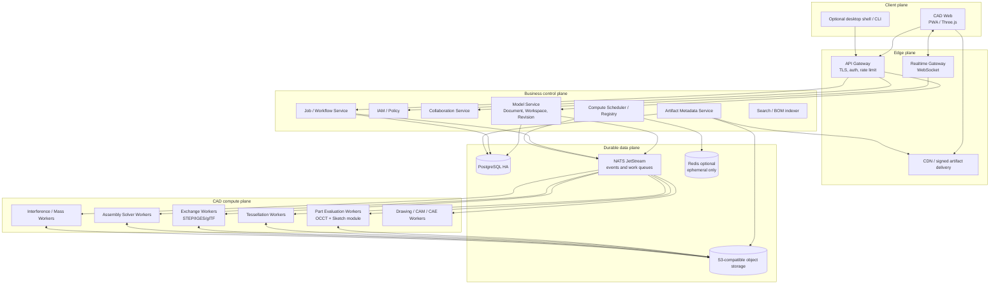
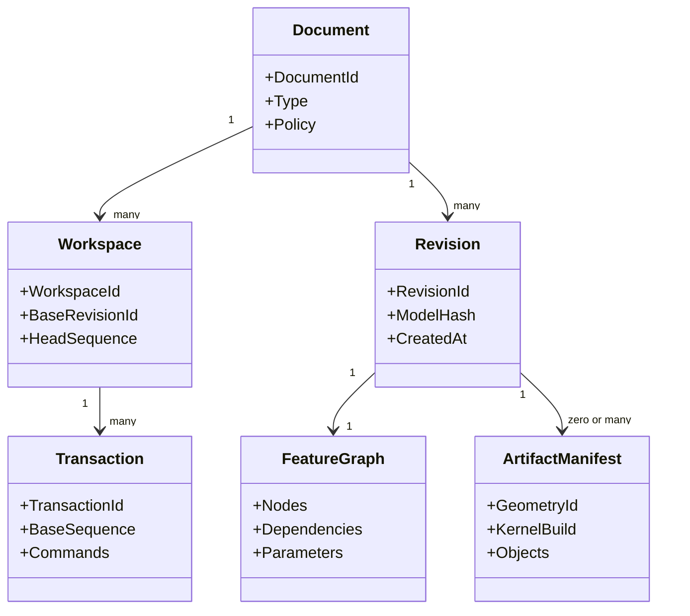
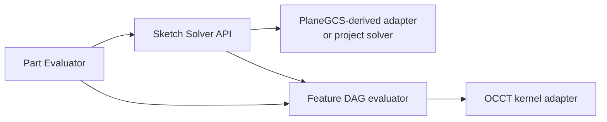
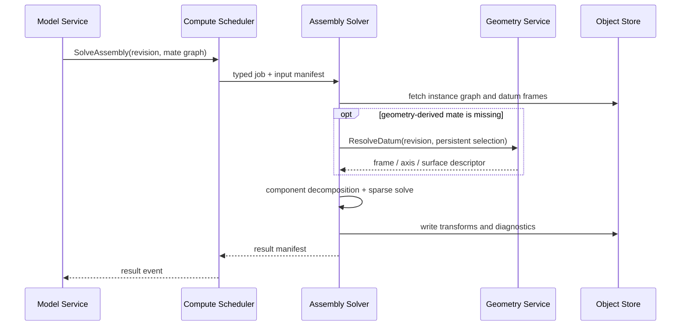
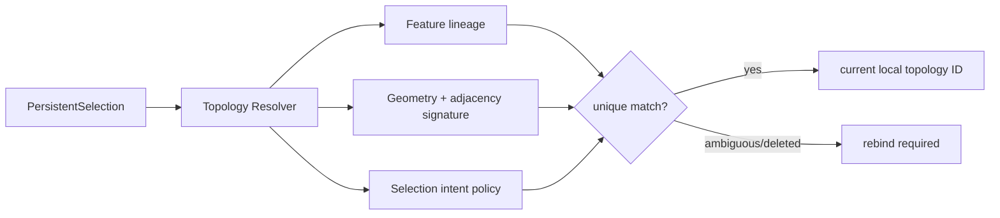
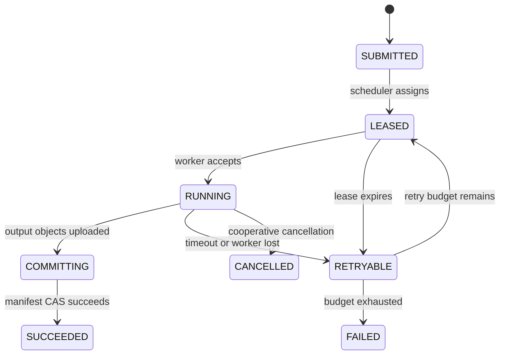
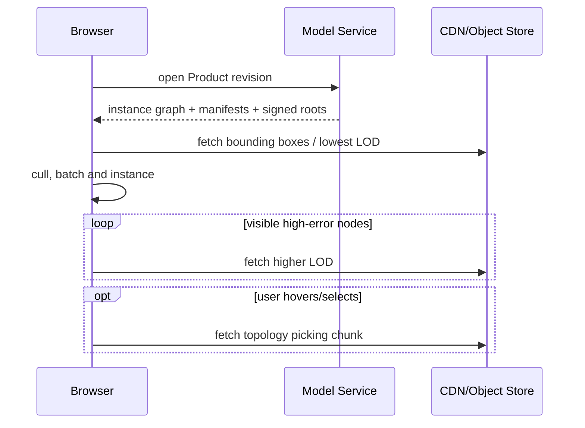
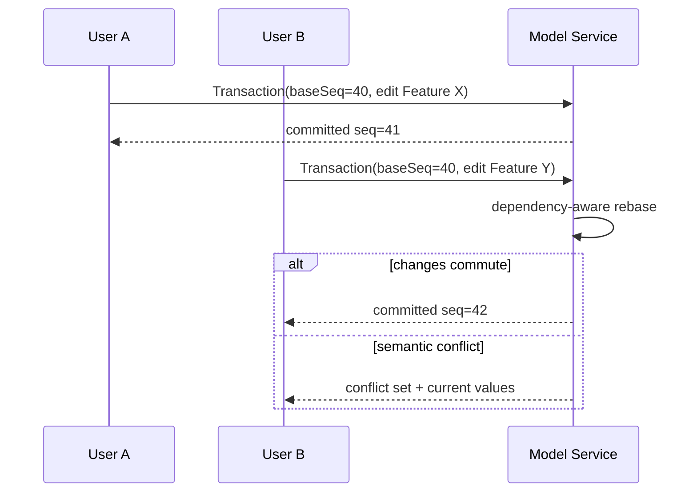
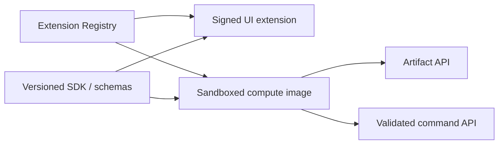
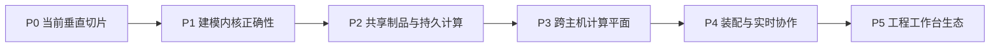

# occccad 目标架构

> 状态日期：2026-08-12  
> 文档性质：架构决策基线，不代表已经实现。当前事实见[现有架构](CURRENT_ARCHITECTURE.md)。

## 1. 愿景与范围

occccad 的长期目标是一个开源、云原生、真正分布式的产品研发平台：在浏览器中完成参数化零件、复杂装配、工程表达与跨团队协作，并把精确 CAD 计算调度到可横向扩展的计算集群。CATIA 是能力广度和工程严谨性的参照，不是 UI 或内部实现的复制对象。

“真正分布式”在本项目中有可验证含义：

- 业务真相不依赖任一应用或 Worker 进程；
- 计算任务可在不同主机失败重试、迁移和重建；
- 大制品内容寻址、共享存储、就近缓存并通过 CDN/区域节点分发；
- 不同计算类型可以独立扩缩容、限流、升级和隔离；
- 文档版本、引用和命令在并发下具有明确一致性；
- 单机开发与集群生产使用相同领域契约，而不是两套产品。

它不意味着把每个领域类都做成微服务，也不意味着一次几何操作跨多台机器并行。B-Rep 内核通常更适合单任务单进程；分布式收益主要来自文档/零件/配置/仿真任务之间的并行、缓存复用和数据局部性。

## 2. 设计原则

1. **参数模型是源，几何是缓存**：Document Revision + Feature Graph + Parameters 可重放；B-Rep、Mesh、缩略图均可淘汰重建。
2. **粗粒度远程，细粒度本地**：RPC 表达“求值 Part Revision”而不是 `MakeEdge`；草图求解与 Part 重生成之间的高频循环留在同一 Worker。
3. **确定性优先**：GeometryId 包含规范化输入、内核/算法版本、单位和容差策略；同一输入应产生语义等价结果。
4. **不可变版本，显式 Workspace**：已发布 Revision 不修改；编辑发生在 Workspace/Branch，通过乐观并发提交。
5. **开放契约与可替换后端**：业务层不泄漏 OCCT、求解器或对象存储类型。
6. **按负载隔离，不按名词拆分**：CPU/内存/安全/延迟模型不同才拆 Worker；早期业务控制面保持模块化单体。
7. **至少一次 + 幂等**：跨服务消息不承诺魔法般的 exactly-once；命令、任务和制品写入用幂等键、事务 Outbox 与状态机保证效果唯一。
8. **安全默认**：所有导入文件和插件代码视为不可信；计算容器无特权、有限额、无默认外网。
9. **演进式开源**：候选库先过许可证、维护活跃度、格式兼容性、正确性与基准测试，不因“流行”直接引入。

## 3. 目标总体架构



这是逻辑边界，不要求第一天部署为十几个进程。建议先把 Model、IAM、Job、Artifact Metadata 作为 Go 模块化单体部署；Realtime 和 Compute Scheduler 因连接模型/扩缩容不同独立；CAD Workers 天然独立。

## 4. 权威数据模型

### 4.1 聚合层级



- **Document**：稳定业务身份、所有权、生命周期和策略；
- **Workspace/Branch**：可变编辑线，指向一个不可变基础 Revision；
- **Transaction**：用户认为原子的命令集合；
- **Revision**：不可变、可引用、可签名的模型快照；
- **Feature Graph**：Part 参数、表达式、引用与有向依赖；
- **Product Structure**：实例图，引用确定的 Document/Revision 或显式 Follow-Head 策略；
- **Artifact Manifest**：计算产物清单，不能成为模型唯一来源。

ID 使用 UUIDv7/ULID 一类可排序业务 ID；内容使用 SHA-256/BLAKE3 等内容摘要。两者不能混用：RevisionId 代表业务身份，GeometryId 代表计算内容。

### 4.2 Feature Graph

Feature 不应继续编码为 `repeated RectangularPadSpec`。目标模型需要版本化的 typed node：

- 输入：参数、表达式、Sketch/Datum、上游 Feature 输出和外部 Revision 引用；
- 输出：Body/Shape/Datum/SelectionSet；
- 状态：Active、Suppressed、Failed、OutOfDate；
- 插件标识：`type_uri + schema_version + evaluator_version`；
- 依赖：显式 DAG，禁止隐藏读取当前 Worker 状态；
- 局部重生成：从变更节点计算 dirty subgraph，缓存未变输出。

表达式引擎应使用受限 AST、量纲类型和循环检测，不能远程执行任意脚本。内部统一 SI 或明确固定 mm/rad，并在每个协议字段携带/继承 units policy。

## 5. 计算平面与 Worker 划分

### 5.1 推荐边界

| Worker | 是否独立进程 | 核心输入/输出 | 原因 |
|---|---|---|---|
| Part Evaluation | 是 | Feature Graph + upstream artifacts → B-Rep/manifest | OCCT 重内存、崩溃隔离、按 Part 并行 |
| 2D Sketch Solver module | **同 Part Worker 部署**，内部独立库 | Sketch entities/constraints → solved parameters/diagnostics | 与 Feature 求值高频交互；单草图很小，远程 RPC 得不偿失 |
| Tessellation | 初期嵌入，规模后独立 | B-Rep + quality profile → GLB/mesh/topology map | 可独立缓存，多 LOD、高并发、与 B-Rep 修改无关 |
| Exchange | 独立 | STEP/IGES 等不可信文件 ↔ canonical model/artifacts | 解析风险、长耗时、格式依赖和资源限制不同 |
| Assembly Solver | **独立 Worker** | instance graph + mates + datums → transforms/residuals | 稀疏非线性问题、独立扩缩容、不应携带完整 B-Rep |
| Interference/Mass | 独立 | assembly placements + geometry proxies → reports | 可批量/并行、内存大、通常异步 |
| Drawing | 后期独立 | revision + view spec → vector drawing | HLR/投影负载和发布节奏不同 |
| CAM/CAE | 插件式独立 Worker | immutable revision + setup → toolpath/result | 安全、许可证、GPU/HPC 与领域依赖隔离 |

### 5.2 为什么二维草图不做远程独立 Worker

草图求解器在代码结构上必须独立于 OCCT：拥有自己的实体、约束、自由度诊断、Jacobian 和序列化接口。但默认与 Part Evaluation Worker 同进程。



理由：拖拽时求解频率可达每帧多次，草图输出立刻影响 Profile/Feature；拆成网络服务会引入序列化、排队和网络抖动，而且无法带来有意义的跨草图并行。浏览器可以运行一个非权威的 WASM preview solver 提升拖拽体验，但提交后必须由服务端同版本求解器验证。

拆分触发条件只有两个：求解器需要独立 GPU/HPC 资源，或第三方许可证要求进程隔离。即使触发，也应保持可嵌入实现用于小草图。

### 5.3 二维约束求解路线

推荐先评估 FreeCAD 的 PlaneGCS 思路/代码并建立适配层。FreeCAD 是 LGPL-2.1 项目并长期用于几何约束草图，但复用前必须对具体文件、修改和动态链接方式做许可证审计。[FreeCAD 官方仓库](https://github.com/FreeCAD/FreeCAD)

求解接口至少返回：

- solved entity parameters；
- remaining degrees of freedom；
- redundant/conflicting constraint set；
- convergence status、iterations、residual；
- stable entity/constraint IDs；
- drag target 和 warm-start state。

不要把 Ceres 直接当成完整 CAD 草图求解器。Ceres 擅长非线性最小二乘，但 CAD 仍需约束分解、冗余诊断、分支选择和几何退化处理。它可作为某些约束或装配求解后端；官方说明其为成熟的开源 C++ 非线性优化库。[Ceres 文档](https://ceres-solver.readthedocs.io/latest/)

### 5.4 为什么三维装配求解独立

Assembly Solver 处理的是实例刚体位姿和 Mate 图，不是修改每个 Part 的 B-Rep。它只应读取：

- InstanceId、父子关系与初始 Transform；
- Mate 类型、方向、offset/angle、limits；
- 从 Part Revision 发布的稳定 Datum/Connector Frame；
- 必要时由 Geometry Worker 提取的小型几何特征描述。



求解先按 Mate 图连通分量分解，再对每个分量选择解析解或稀疏数值解。候选基础是 Eigen + Ceres；大型稀疏后端要逐项审计许可证，Ceres 官方安装文档明确提醒 SuiteSparse 组件可能带来 GPL/商业许可影响。[Ceres 安装与许可证注意事项](https://ceres-solver.readthedocs.io/latest/installation.html)

装配碰撞/距离不是约束求解器内部的默认职责。可用 [FCL](https://github.com/flexible-collision-library/fcl) 作为宽相/窄相候选，精确干涉最终由 OCCT 验证；交互拖拽使用简化 BVH/凸体，发布检查使用精确 B-Rep。

### 5.5 拓扑命名是平台级能力

没有 Persistent Topological Naming，就无法可靠实现圆角、倒角、面上草图、装配 Mate 和工程图标注。目标不能把 `edge_local_id` 持久化。

每次 Feature 求值应产生 `TopologyHistory`：

- 输入选择的稳定语义（Feature output + selector）；
- OCCT Modified/Generated/Deleted 历史；
- 几何签名（类型、面积/长度、质心、邻接、方向、参数域）；
- 一对多/多对一 lineage；
- 匹配置信度与歧义诊断。



发生歧义时必须显式失败并让用户重新绑定，不能静默选择“看起来最近”的边。

## 6. Scheduler、Registry 与数据局部性

Kubernetes 负责容器放置与副本生命周期；CAD Compute Scheduler 负责领域级任务选择、缓存亲和、配额和结果提交，两者不能混为一层。

调度评分建议为：

```text
score = artifact_locality + warm_kernel + capability_match
      + tenant_fairness + deadline_priority - queue_delay - memory_pressure
```

Worker 通过租约注册：capabilities、kernel build digest、solver versions、CPU/RAM/GPU、resident artifact bloom/filter、current load。Scheduler 只发 immutable input manifest 和 signed object URLs，不传数据库凭证。



任务结果提交使用 compare-and-set：只有当前 attempt token 能把 manifest 标为成功；迟到 Worker 上传的对象允许成为未引用内容，后续 GC 清理。这样实现“效果唯一”，不依赖消息中间件声称的 exactly-once。

Kubernetes 使用 node pool/taint 区分普通 Go、内存型 OCCT、GPU/CAE 节点，并用 topology spread 跨故障域部署控制面。官方文档支持通过节点标签、taint 和 topology spread 控制放置。[Kubernetes 调度文档](https://kubernetes.io/docs/concepts/scheduling-eviction/)

## 7. 通信协议

| 路径 | 协议 | 用途 |
|---|---|---|
| Browser → Gateway | HTTPS JSON/REST | CRUD、命令、短查询；发布 OpenAPI |
| Browser ↔ Realtime | WebSocket | presence、selection、workspace events、job progress |
| Service → Service | gRPC/Protobuf | 低延迟 typed query/command |
| Control → Event Bus | Protobuf events | 事务后事件、索引、通知、审计 |
| Scheduler → Workers | JetStream work queue + gRPC control | 持久任务与取消/心跳 |
| Any → Artifact | HTTPS/S3 signed URL | 大 B-Rep/GLB/STEP/result，不穿过 gRPC |

Proto 规则：包名包含 major version；字段只追加；保留删除字段号；所有请求有 `request_id`、`idempotency_key`、`tenant_id`、deadline 与 trace context；Worker 用 capability negotiation 声明可处理的 schema/feature 类型。

NATS JetStream 适合作为轻量开源事件和工作队列基线，支持 work-queue retention；仍应按至少一次设计并配置最大投递次数与死信处理。[JetStream 文档](https://docs.nats.io/nats-concepts/jetstream)

Temporal 只在出现多日工作流、补偿、人工步骤、跨服务扇出等复杂度后引入；它提供可恢复工作流执行，但对当前三个任务类型过重。[Temporal 文档](https://docs.temporal.io/)

## 8. 存储架构

### 8.1 PostgreSQL

保存租户、IAM 映射、Document、Workspace、Revision metadata、Command/Transaction、引用图、ACL、Job 状态、Artifact metadata、Outbox 和审计。生产采用 HA、PITR、连接池和分区；租户隔离在应用策略与 PostgreSQL RLS 双层验证。

大型 JSON Feature Graph 初期可用 JSONB + schema version，成熟后把高查询价值的引用/参数索引关系化。不能把所有 B-Rep 放入 bytea，也不能让 Worker 直接更新领域表。

### 8.2 S3 兼容对象存储

保存不可变 B-Rep、STEP、GLB、LOD、拓扑映射、缩略图、仿真与工具路径。对象键基于内容摘要；Metadata 服务管理引用、保留策略、legal hold 与 GC mark/sweep。

开源自托管基线可评估 SeaweedFS 或 Ceph RGW；SeaweedFS 提供 Apache 许可的 S3/文件存储与水平扩展能力。[SeaweedFS 项目](https://github.com/seaweedfs/seaweedfs) 选择必须经过故障注入、纠删码、小对象、备份恢复和 S3 兼容测试，而不是写死供应商。

### 8.3 Redis

Redis/Valkey 只用于可丢失数据：presence、短期 rate limit、热点路由提示、分布式锁的辅助 lease。Document、Job、Geometry location 不能只存在其中。只有实际测量表明 PostgreSQL/进程缓存不足时才引入。

### 8.4 搜索与分析

早期使用 PostgreSQL FTS/GIN；BOM、属性、全文与大规模聚合成为瓶颈后，通过 Outbox 事件构建 OpenSearch 索引。搜索索引永远可从 PostgreSQL 与 Revision 重建。

## 9. 制品协议与大装配

一个 GeometryId 对应 Artifact Manifest，而不是单个 GLB：

```text
GeometryManifest
  exact: BREP
  display: GLB LOD0..N, edge stream, topology-picking map
  analysis: bbox, OBB, mass properties, collision proxies
  provenance: model hash, kernel build, evaluator version, tolerance profile
```

大装配加载顺序：Product Structure → 包围盒/低 LOD → 视锥与屏幕误差选择 → 高 LOD → 精确边/拓扑按需。相同 GeometryId 的多个实例共享 GPU buffers，只改变 transform/material/visibility。



Mesh 生成可用 OCCT triangulation；传输优化候选包括 glTF、[meshoptimizer](https://github.com/zeux/meshoptimizer)、Draco/KTX2。权威拾取映射必须能从 `(GeometryId, primitive range)` 解析到稳定选择语义，而不只是三角形序号。

## 10. 协作与一致性

参数化 CAD 不能把所有命令无条件 CRDT 合并。目标分层：

- Presence、光标、临时选择：最终一致，可用 CRDT/ephemeral channel；
- 评论、标注：对象级 CRDT 或追加事件；
- Workspace 建模命令：服务端序列号 + optimistic concurrency；
- 同一 Feature/参数并发修改：语义冲突，显式合并；
- 不同独立 Feature 分支：验证依赖后自动 rebase；
- 发布 Revision：原子 compare-and-swap Workspace Head。



所有计算只针对明确的 Workspace sequence 或 RevisionId；迟到计算结果不得覆盖更新后的 Head。

## 11. 开源技术基线

| 层 | 推荐基线 | 决策说明 |
|---|---|---|
| 精确几何 | OCCT 稳定补丁版 | 仓库现为 7.9.1；升级前跑几何语料回归。上游当前稳定维护版为 7.9.3，[OCCT 7.9.3 公告](https://dev.opencascade.org/content/open-cascade-technology-793-released) |
| 二维草图 | 自有接口 + PlaneGCS 评估 | 功能成熟；必须审计 LGPL 与抽取维护成本 |
| 数值优化 | Eigen + Ceres 候选 | 装配/特殊约束；保持 backend adapter，审计可选稀疏依赖 |
| 精确交换 | OCCT XDE/STEPCAF | 逐步支持 AP242、颜色、名称和装配语义 |
| 碰撞 | BVH/FCL 候选 + OCCT 精确验证 | 交互代理与发布级精确检查分离 |
| Web | React + TypeScript + Three.js | 延续现有投入；WebGPU 作为渐进加速而非硬依赖 |
| 业务服务 | Go + gRPC/Protobuf | 延续现有实现，控制面效率高 |
| 数据库 | PostgreSQL | 强事务、JSONB、RLS、成熟 HA |
| 对象存储 | S3 API；SeaweedFS/Ceph 评估 | 避免供应商绑定，内容寻址 |
| 消息 | NATS JetStream | 比 Kafka 更轻；事件量/保留需求改变后再评估 Kafka/Redpanda |
| 编排 | Kubernetes | Worker pools、隔离、弹性；领域调度由自有 Scheduler 完成 |
| 可观测 | OpenTelemetry + Prometheus/Grafana/Loki/Tempo | OTel 是厂商中立的 traces/metrics/logs 框架，[官方文档](https://opentelemetry.io/docs/) |
| IAM | OIDC provider（Keycloak/Zitadel 等） | 平台不长期自研企业 SSO/MFA；领域 ACL 仍由 Model Service 管理 |

候选不等于依赖。所有第三方组件登记 SPDX、版本、链接方式、许可证、CVE 和替代方案，生成 SBOM；强 copyleft 工具可通过独立插件进程使用，但必须由法律与项目许可证策略明确批准。

## 12. 安全与多租户

- Gateway 终止 TLS，使用 OIDC/OAuth2；短生命周期访问令牌，浏览器优先安全 HttpOnly 会话；
- 每个请求携带 tenant/principal，服务端执行 RBAC + resource ACL，PostgreSQL RLS 作纵深防御；
- Signed URL 限制对象、动作、大小、有效期和内容摘要；
- STEP/IGES/插件 Worker 运行在 seccomp/AppArmor、只读根文件系统、无特权、无默认 egress 的沙箱；
- Worker 不持有业务数据库凭证，只通过任务 token 和对象 URL 获取最小输入；
- 审计日志追加写，覆盖登录、权限、下载、发布、导出和管理员操作；
- 配额包括并发计算、CPU 秒、内存、对象容量、导出频率；
- 供应链使用锁文件、签名镜像、SBOM、依赖扫描和可复现构建。

## 13. 可观测性与 SLO

统一 OpenTelemetry resource：tenant、service、worker type、build digest；传播 W3C Trace Context。禁止把模型内容、密码或 signed URL 写入日志。

关键指标：

- API p50/p95/p99、冲突率、数据库等待；
- Queue latency、attempts、lease expiry、dead-letter；
- Part regeneration duration/feature count/cache hit；
- Sketch/Assembly solve iterations、residual、failure class；
- OCCT worker RSS、crash/OOM、resident bytes；
- Artifact hit rate、egress、LOD first-visible time；
- 每租户计算成本。

初始 SLO 建议先测量再承诺；交互拖拽预览目标 < 50 ms，本地小 Part 增量重生成目标 p95 < 2 s，长任务必须异步显示进度和可取消。

## 14. 插件与高阶工作台

对标 CATIA 的能力广度必须依赖扩展平台，而不是把所有领域编进核心 Worker。

插件描述：manifest、semantic version、capabilities、input/output schemas、required worker image、license、resource class。插件只能通过稳定 SDK 读取 immutable Revision/Artifact，并提交新 Artifact/Report/Feature transaction，不能直接写核心数据库。



建议演进领域：

1. Part Design + Sketch + Assembly；
2. Surface/Wireframe 与稳定交换；
3. Drawing/PMI/GD&T；
4. Sheet Metal/Weld；
5. CAM toolpath；
6. CAE pre/post，连接 CalculiX/Code_Aster 等独立求解器；
7. Electrical/BOM/Requirements/PLM 集成。

每个领域先定义模型语义和交换测试，再选择开源库；不能用“有一个开源求解器”代替领域架构。

## 15. 演进路线与阶段门槛



### P1：建模内核正确性

- 通用 Sketch schema 与二维约束求解；
- typed Feature DAG、表达式/单位、dirty propagation；
- Persistent Topological Naming v1；
- Kernel/solver build 写入 GeometryId；
- 几何 golden corpus、模糊测试、确定性回归；
- Proto capability/version negotiation。

**门槛**：常用草图诊断可靠；修改上游尺寸后下游引用不静默错绑；同一输入跨重复运行结果稳定。

### P2：共享制品与持久计算

- S3 ArtifactStore、manifest、signed URL、GC；
- 同步长计算迁移为 durable jobs；
- transactional outbox；
- Tessellation/Exchange 独立任务；
- API/Jobs 多副本测试。

**门槛**：任意应用实例可处理请求；杀死 Worker 后任务自动恢复；本地目录不再是生产依赖。

### P3：跨主机计算平面

- NATS JetStream、Worker capability lease、Scheduler；
- Kubernetes worker pools、配额、公平性和 backpressure；
- 内容局部缓存和冷/热启动基准；
- 多可用区控制面与灾难恢复演练。

**门槛**：跨节点重试无重复业务提交；节点丢失不丢模型；按租户限制资源。

### P4：装配与协作

- 独立 Assembly Solver、Mate/Datum schema；
- 碰撞/间隙、BOM、配置和大装配 LOD；
- Realtime Gateway、presence、语义冲突/rebase；
- AP242/XDE 装配交换。

**门槛**：大型基准装配可渐进打开；约束冲突可诊断；并发编辑不会静默覆盖。

### P5：工程工作台生态

- Drawing/PMI、Surface、Sheet Metal；
- 插件 SDK 与 Registry；
- CAM/CAE/Electrical Worker；
- 企业 IAM、审批、发布、基线与变更流程。

## 16. 架构决策触发条件

| 决策 | 现在 | 何时改变 |
|---|---|---|
| 业务模块化单体 | 保持 | 团队/发布/扩缩容/安全边界至少一项独立且持续成为瓶颈 |
| PostgreSQL Jobs | 保持到 P2 | 多队列公平、跨区域、高吞吐事件或复杂工作流超过简单租约模型 |
| Sketch Solver 同进程 | 保持 | 许可证隔离或特殊算力需求；不能仅因“微服务化”拆分 |
| Tessellation 嵌入 Geometry | 短期保持 | 多 LOD/高并发占用主求值容量或需要 GPU |
| 本地 ArtifactStore | 仅开发 | 首个跨主机/多副本生产部署前必须替换 |
| Three.js WebGL2 | 保持兼容基线 | WebGPU 覆盖目标浏览器且性能数据证明收益 |
| OCCT 版本 | 固定可复现 | 新版本通过完整 corpus、STEP、性能和拓扑回归后升级 |

## 17. 验证体系

架构可持续性的核心不是图，而是可重复验证：

- **Geometry corpus**：退化边、微小特征、复杂布尔、曲面、导入脏数据；
- **Metamorphic tests**：平移/旋转/单位转换不改变拓扑语义；
- **Golden artifacts**：不要求二进制逐字相同，但比较体积、bbox、拓扑、签名和可视差异；
- **Solver tests**：自由度、冗余/冲突最小集、拖拽连续性、装配闭环；
- **Failure injection**：Worker OOM、消息重复、对象上传后断网、数据库 failover；
- **Scale benchmarks**：Feature 数、实例数、唯一 Geometry 数、并发用户、对象大小；
- **Compatibility**：旧 Revision/Proto/Feature schema 在新 Worker 上重放；
- **Security**：恶意 STEP、压缩炸弹、越权 signed URL、租户逃逸。

## 18. 明确不做的事

- 不把 Worker 内存当数据库；
- 不把 OCCT `TopoDS_Shape`、指针或 local topology ID 放入持久协议；
- 不把 B-Rep 大对象通过事件总线广播；
- 不用 Redis 锁代替数据库一致性；
- 不在浏览器执行最终权威求值；
- 不承诺任意并发 CAD 命令都能自动 CRDT 合并；
- 不在模型核心成熟前先拆几十个业务微服务；
- 不把 Kubernetes 默认 Scheduler 当 CAD cache-aware Scheduler；
- 不静默修复拓扑歧义或装配冲突；
- 不以候选库的存在替代许可证、正确性和维护能力评估。

## 19. 下一步建议

当前最有价值的连续交付顺序是：

1. 定义通用 Sketch/Constraint Proto 与服务端求解接口；
2. 把现有矩形 Pad 迁移为 typed Feature Graph 的第一个兼容节点；
3. 建立拓扑 lineage/selection schema 和几何回归语料；
4. 设计 Artifact Manifest，把 B-Rep/GLB/拓扑映射统一内容寻址；
5. 将同步求值包装为可取消、可重试的 Evaluation Job；
6. 通过 S3 兼容后端解除共享本地目录约束；
7. 再实现跨主机 Registry/Scheduler；
8. 在稳定 Part Revision/Datum 基础上启动 Assembly Solver。

这一顺序刻意先解决 CAD 正确性，再解决分布式规模。否则只是把不稳定模型更快地分发到更多机器。
