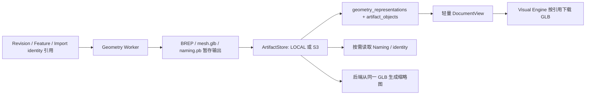

# Part 几何结果与显示制品

返回[当前架构](../../CURRENT_ARCHITECTURE.md)。本文描述当前唯一持久数据链，不提供旧数据库内联载荷兼容层。

## 所有权与数据流

参数模型、Feature、Revision、稳定引用、导入 identity 分配和状态属于业务真相。Geometry Worker 只接收冻结输入并输出计算制品；PostgreSQL 保存业务模型及几何摘要，ArtifactStore 保存大载荷。LOCAL/S3 使用同一 Store 接口。

Worker 输出通过摘要/长度验证后登记 READY 对象；GLB 业务显示扩展在暂存阶段合并后只发布最终一份 GLB。几何摘要和全部 role 引用在同一个短事务提交，网络上传不占用数据库事务。数据库事务失败可能留下无引用对象，不能产生已发布但尚未上传的引用；自动 GC 不在本阶段。

## 持久模型

- `geometry_artifacts`：不可变 GeometryKey/GeometryId、evaluator/OCCT 版本、毫米单位、bbox、volume、拓扑计数、显示顶点/三角形计数，以及轻量业务基准几何。没有 `brep_data`、`glb_data`、`mesh_json`、`topology_manifest_data`。`reference_geometry_json` 的数据库约束禁止放入非空显示 primitives。
- `geometry_representations`：`geometry_key + role` 唯一，引用 `object_id` 并记录 representation schema version。role 是可扩展字符串，不将结果模型写死为三个文件。
- `artifact_objects`：object id、kind、SHA-256、大小、媒体类型、后端、opaque key、状态和验证时间。不同角色可共享同一内容寻址对象；可增加材质、纹理、LOD、PMI 等角色，而无需给几何结果继续加文件列。
- `import_definitions`：保留 Feature/Body、源文件/组件、冻结 BREP digest、单位/策略和身份制品索引。完整随机 identity 分配只存 `identity.pb`；数据库约束禁止 `definition` 内再次保存 identities 数组。

当前角色为 `BREP`、`VISUAL`、`NAMING`。源文件、交换导出、缩略图、导入 identity 继续使用统一 Artifact 对象模型，但不必全部成为一个 Part 几何结果的角色。

## 唯一显示载荷

持久实体显示只读取 `mesh.glb`，没有 protobuf Mesh → 数据库 JSON → DocumentView Mesh 的第二条路径。GLB 保留标准三角形 POSITION/indices，并使用 `OCCCCAD_cad` schema 1 扩展提供：

- 明确的毫米单位和 Part 局部坐标系；
- 每三角形对应的 Face local pick index，二进制 accessor；
- Edge local pick ID 与二进制折线 accessor、Vertex local pick ID 与坐标；
- `拓扑类型:localId → semantic anchor 摘要` 映射，支持在同一冻结结果中把显示元素对应到稳定语义身份。

local ID 和三角形序号仍只是该 GeometryKey 的临时拾取定位。持久选择继续走 source Revision + GeometryKey + local pick 的服务器 bind 门，形成 PersistentSelection；不能把显示 ID 当成跨 Revision 的拓扑身份或替代 lineage resolver。

`OCCCCAD_visualization` 保存非实体 primitives、Feature/entity identity 和显示所需的基准几何。DocumentView 只返回角色索引和轻量摘要；后端缩略图及前端 VisualRepository 解码同一文件。解码的 Mesh 是消费者自己的内存工作集，不持久化，不塞回 TanStack Query 的 DocumentView。

下载入口为 `GET /api/documents/{documentID}/representations/{objectID}?versionId=...`。先校验文档权限，再校验对象属于指定 Revision 及其冻结 Product 引用；ContextVariant 使用既有领域解析门验证。不能拿任意 object id 读取其他文档对象。响应支持 ETag 私有重验证。前端按对象/摘要合并下载，每次最多 4 路；检查长度、representation/CAD schema，支持 WebCrypto 的上下文还校验 SHA-256；过期 render 请求不覆盖新视图，切换文档时清除旧场景。释放视口时取消加载并释放缓存。

## Naming、RPC 与预览

完整 `PartTopologyManifest` 只存在 `naming.pb`，其中包含 FeatureResults、semantic outputs、lineage 和 evidence。`PartEvaluationManifest` 只携带策略摘要、轻量 Feature identity 及 Naming ArtifactReference，不再重复传完整 FeatureResults。导入重放 RPC 传 identity ArtifactReference，Worker 校验并读取 seed，而非让大型 identities 数组再次穿过请求。

`EvaluatePartResponse` 的持久结果标记为 `PERSISTENT`，只返回几何摘要、计数及 ArtifactReference；移除了 BREP/GLB 内联字段，`preview_mesh` 只允许临时预览。声明中的 Tessellate 输出也只使用引用，不再定义三套内联字节载荷；这不代表独立 Tessellate RPC 已实现。

Naming 在 bind/resolver 时按需读取并校验摘要；普通 DocumentView 加载仅查询索引，不下载完整拓扑图。Naming 索引 READY 表示已登记可用制品，实际内容或策略损坏仍由解析门明确拒绝。

预览响应标记 `TRANSIENT_PREVIEW`，只返回 Artifact 引用；`previewMesh` 已从前后端 Artifact 模型移除。PreviewCommand 仍复用求值和 verified candidate，GLB 经候选限定授权从 HTTP 文件路由获取。取消/覆盖/断线撤销候选和读取授权，独立加载器避免迟到 GLB 覆盖当前视图；完整协议见[realtime 控制面](realtime.md)。底层内部 Worker 的临时 `preview_mesh` 不作为 Web realtime 输出。

## 验证与边界

定向入口包括真实 Router 的 Cut/Hole 和 Face/Edge/Vertex/导入命名历史回归、`TestRepresentationDownloadAuthorizationAndSnapshot`、`TestCppWorkerAcceptsPartNamingContract`、`TestS3WorkerExchangeRoundTrip`，以及前端 `mesh-glb` 场景。真实 C++ GLB 可通过 `OCCCCAD_TEST_GLB_FIXTURE` 同时交给 Go 缩略图与 TypeScript 解码器核对拾取映射。

2026-09-25 定向验证：空 schema 下 Router 的 Cut/Hole、Face/Edge/Vertex、导入命名与 Undo/Redo 通过；下载权限、嵌套 Product 及历史 Revision 归属通过；C++ GLB 的 Go/TypeScript 解码和拾取映射通过。`LD200 torsen v7.step` 经 S3 和真实 Router 的交换导入结果包含 114 Solid、310,731 显示顶点、404,796 三角形，响应为 594 字节，整项测试约 139 秒。这是交换层回归，不等同于多文档 Jobs 导入或浏览器显示性能验收。

这次是数据职责收敛，不是 1 GiB 几何容量验收。OCCT 求值、GLB 合成/解码及 BVH 仍可能持有完整工作集；LOD、chunk、按字节预算、跨主机 Worker 数据面尚未实现。GLB 容器有 32 位长度上限，写入超限会失败。STEP XDE/AP242 结构未改造；WebSocket 控制面见独立分册。未发布 schema/Proto 直接修正，切换前需停止旧进程并通过 `invoke data.reset --yes` 重建数据；不支持旧内联数据回退。
