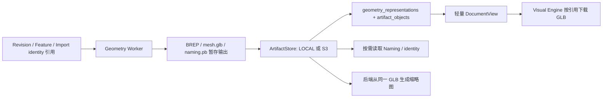

# Part 几何结果与显示制品

返回[当前架构](../../CURRENT_ARCHITECTURE.md)。本文描述当前唯一持久数据链，不提供旧数据库内联载荷兼容层。

Part Revision 通过 `bodies[].geometryKey` 引用独立 Body 结果，DocumentView 的 `artifacts` 按 GeometryKey 提供轻量描述；没有 Part 级合并 GLB 或唯一 geometryKey。属性面板按 Body 展示当前 Revision 的 BREP / mesh.glb / naming.pb 索引、字节大小、schema 与 digest，并通过受权限保护的 HTTP 文件接口逐项下载。请求的 `bodyId`（若提供）也必须匹配该 Revision 的真实归属；历史 Revision 与冻结 Product 子树同样可验证。

## 所有权与数据流

参数模型、Feature、Revision、稳定引用、导入 identity 分配和状态属于业务真相。Geometry Worker 只接收冻结输入并输出计算制品；所选关系数据库（PostgreSQL/SQLite）保存业务模型及几何摘要，ArtifactStore 保存大载荷。LOCAL/S3 使用同一 Store 接口。

```mermaid
flowchart LR
    Model["Revision / Feature / Import identity 引用"] --> Worker["Geometry Worker"]
    Worker --> Scratch["BREP / mesh.glb / naming.pb 暂存输出"]
    Scratch --> Store["ArtifactStore: LOCAL 或 S3"]
    Store --> Index["geometry_representations + artifact_objects"]
    Index --> View["轻量 DocumentView"]
    View --> Visual["Visual Engine 按引用下载 GLB"]
    Store --> Naming["按需读取 Naming / identity"]
    Store --> Thumbnail["后端从同一 GLB 生成缩略图"]
```

Worker 输出通过摘要/长度验证后登记 READY 对象；GLB 业务显示扩展在暂存阶段合并后只发布最终一份 GLB。几何摘要和全部 role 引用在同一个短事务提交，网络上传不占用数据库事务。数据库事务失败可能留下无引用对象，不能产生已发布但尚未上传的引用；自动 GC 不在本阶段。

## 持久模型

- `geometry_artifacts`：不可变 GeometryKey/GeometryId、evaluator/OCCT 版本、毫米单位、bbox、volume、拓扑计数、显示顶点/三角形计数，以及轻量业务基准几何。没有 `brep_data`、`glb_data`、`mesh_json`、`topology_manifest_data`。`reference_geometry_json` 的数据库约束禁止放入非空显示 primitives。
- `geometry_representations`：`geometry_key + role` 唯一，引用 `object_id` 并记录 representation schema version。role 是可扩展字符串，不将结果模型写死为三个文件。
- `artifact_objects`：object id、kind、SHA-256、大小、媒体类型、后端、opaque key、状态和验证时间。不同角色可共享同一内容寻址对象；可增加材质、纹理、LOD、PMI 等角色，而无需给几何结果继续加文件列。
- `import_definitions`：保留 Feature/Body、源文件/组件、冻结 BREP digest、单位/策略和身份制品索引。完整随机 identity 分配只存 `identity.pb`；数据库约束禁止 `definition` 内再次保存 identities 数组。

当前角色为 `BREP`、`VISUAL`、`NAMING`。源文件、交换导出、缩略图、导入 identity 继续使用统一 Artifact 对象模型，但不必全部成为一个 Part 几何结果的角色。

## 唯一显示载荷

持久实体显示只读取 `mesh.glb`，没有 protobuf Mesh → 数据库 JSON → DocumentView Mesh 的第二条路径。当前为 [Visual/Naming v2 契约](../visual-naming-artifact-v2.md)：

- 标准 glTF POSITION/NORMAL/indices，加上多个 mesh/primitive；
- FACE 三角形、EDGE 折线、VERTEX 点统一使用 1-based topology localId，mapping 与数值均为 binary accessor；
- `OCCCCAD_cad.schemaVersion=2` 只保留单位、坐标空间、轻量 Geometry/Naming 关联；删除旧语义哈希 `stableIds`；
- `OCCCCAD_visualization.schemaVersion=2` 的 positions/indices 使用 accessor，辅助显示也生成标准 glTF primitive。显示变体替换自己拥有的二进制后缀，不累计历史草图数组。

local ID 和三角形序号仍只是该 GeometryKey 的临时拾取定位。持久选择继续走 source Revision + GeometryKey + local pick 的服务器 bind 门，形成 PersistentSelection；不能把显示 ID 当成跨 Revision 的拓扑身份或替代 lineage resolver。

`OCCCCAD_visualization` 保存非实体 primitives、Feature/entity identity 和显示所需的基准几何。DocumentView 只返回角色索引和轻量摘要；后端缩略图及前端 VisualRepository 解码同一文件。解码的 Mesh 是消费者自己的内存工作集，不持久化，不塞回 TanStack Query 的 DocumentView。

下载入口为 `GET /api/documents/{documentID}/representations/{objectID}?versionId=...`。先校验文档权限，再校验对象属于指定 Revision 及其冻结 Product 引用；ContextVariant 使用既有领域解析门验证。不能拿任意 object id 读取其他文档对象。响应支持 ETag 私有重验证。前端按对象/摘要合并下载，每次最多 4 路；检查长度、representation/CAD schema，支持 WebCrypto 的上下文还校验 SHA-256；过期 render 请求不覆盖新视图，切换文档时清除旧场景。释放视口时取消加载并释放缓存。

## 拓扑感知的离散快照

内核 `OcctKernel::tessellate` 是实体可视化唯一几何入口：对驻留精确 Shape 深拷贝（含几何，不复制旧剖分），整 Body 进行一次 OCCT 剖分，然后固定面节点、三角形、法线、Edge 折线、Vertex 点和 localId 映射。源 Shape 和 Naming 不因显示精度变化而修改。解析曲面也启用内部偏差控制；剖分失败状态、缺失面/边界和邻接边界不一致均显式失败，不能发布部分成功。

附面 Edge 遍历全部有向 EdgeUse，从同次 `PolygonOnTriangulation` 取节点；包含周期面的双接缝、位置变换和退化极点。所有邻接 use 的节点序列须按原模型边/点容差正向或反向一致，验证后才选取确定顺序的显示折线；不独立采样、不全局焊接、不放大显示容差。退化边确认收缩为一点后不产生零长显示线。只有无邻接面的孤立曲线使用自适应离散。`GetTopology` 保持精确属性查询，保留的 `render_points` 字段为空，不触发剖分。

Worker 的 `fill_evaluation` 统一调度离散与编码，`make_glb` 消费快照法线。Worker 仍通过互斥锁串行管理同一驻留内核；整 Body 剖分和曲面抽壳布尔复用 OCCT 内部至多 4 路并行，不拆分相邻 Face。快照以 `shared_ptr<const ...>` 缓存，编码/提取目前按稳定顺序执行。不同 Worker 可并发计算独立输入。

两级易失缓存分别保存冻结请求的完整求值结果和 GeometryId/精度/离散策略对应的可视化快照，各最多 8 项、64 MiB 计数预算；超大结果正常计算但不缓存。请求键包含真实输入、命名策略及精度，不以调用者 geometryKey 代替输入身份。串行门合并排队的相同请求，命中后复用 BREP/GLB/Naming 字节并写入当前 attempt 路径，不重复求值或编码。Naming 仍由该请求的实际命名历史绑定到同一 GeometryId；Go 在现有 GLB 制品装配阶段加入 Naming digest。前端要求带 Naming 的制品具有完整关联，成套 hydrate 后切换，显示/hover/selected 读取同一 mesh.edges。

`visual_snapshot` 日志记录剖分、面提取、边界提取/验证、法线、编码耗时及顶点/三角形/边节点/GLB 字节数，缓存命中另有标识。缓存预算不包含驻留 BREP 与计算峰值；尚未实现进程整体按字节淘汰或 OCCT 算法中途强制取消。

定向验证包括 `CurvedVisualSnapshotUsesEveryAdjacentMeshBoundary`（圆柱、球面接缝、修剪曲面、圆角、嵌套变换、串并行字节一致与 BREP 精度抽样）、真实 Worker 缓存/抽壳测试，以及 `OCCCCAD_TEST_CURVED_GLB` 注入真实 C++ GLB 的前端 `multi-body` 场景（接缝拾取、hover/selected 折线及过期快照隔离）。这些检查不替代实机 WebGL 验收，也不构成任意曲面的全局 Hausdorff 误差证明。

## Naming、RPC 与预览

每个 Body 的完整 `PartTopologyManifest` 只存在自己的 `naming.pb`，采用共享 SemanticRef/Evidence 表、逐 Feature transition 与显式 Body Tip locator 索引；历史 Feature 不再持久保存完整快照。`PartEvaluationManifest` 只携带策略摘要、轻量 Feature identity 及 Naming ArtifactReference，不再重复传完整 FeatureResults。导入重放 RPC 传 identity ArtifactReference，Worker 校验并读取 seed，而非让大型 identities 数组再次穿过请求。

`EvaluatePartResponse` 的持久结果标记为 `PERSISTENT`，只返回几何摘要、计数及 ArtifactReference；移除了 BREP/GLB 内联字段，`preview_mesh` 只允许临时预览。声明中的 Tessellate 输出也只使用引用，不再定义三套内联字节载荷；这不代表独立 Tessellate RPC 已实现。

Naming 在 bind/resolver 时按 sourceBodyId 定位，按需读取并校验摘要、GeometryId 和 BREP SHA-256；普通 DocumentView 加载仅查询索引，不下载完整拓扑图。Naming 索引 READY 表示已登记可用制品，实际内容或策略损坏仍由解析门明确拒绝。

预览响应标记 `TRANSIENT_PREVIEW`，只返回 Artifact 引用；`previewMesh` 已从前后端 Artifact 模型移除。PreviewCommand 仅求值目标 Body，返回 bodyId，视口只替换对应 occurrence/Body；提交时各 Body 按输入缓存复用 candidate 或求值，不无条件重建其他 Body。PreviewCommand 复用 verified candidate，GLB 经候选限定授权从 HTTP 文件路由获取。取消/覆盖/断线撤销候选和读取授权，独立加载器避免迟到 GLB 覆盖当前视图；完整协议见[realtime 控制面](realtime.md)。底层内部 Worker 的临时 `preview_mesh` 不作为 Web realtime 输出。

## 验证与边界

Multi-Body 定向入口为 `TestMultiBodyIndependentGeometryAndHistory`（双 Body、ADD/REMOVE、Naming 隔离、Preview promotion、Undo/Redo、装配展开与 STEP 导出），前端 `multi-body.scenario.mjs` 和 `workbench-inspector.scenario.mjs` 验证场景绑定及文件面板。

其他定向入口包括真实 Router 的 Cut/Hole 和 Face/Edge/Vertex/导入命名历史回归、`TestRepresentationDownloadAuthorizationAndSnapshot`、`TestCppWorkerAcceptsPartNamingContract`、`TestS3WorkerExchangeRoundTrip`，以及前端 `mesh-glb` 场景。真实 C++ GLB 可通过 `OCCCCAD_TEST_GLB_FIXTURE` 同时交给 Go 缩略图与 TypeScript 解码器核对拾取映射。

这次是数据职责收敛，不是 1 GiB 几何容量验收。OCCT 求值、GLB 合成/解码及 BVH 仍可能持有完整工作集；LOD、chunk、按字节预算、跨主机 Worker 数据面尚未实现。GLB 容器有 32 位长度上限，写入超限会失败。STEP XDE 基础结构已改造，颜色/PMI 等完整 AP242 扩展尚未交付；WebSocket 控制面见独立分册。未发布 schema/Proto 直接修正，切换前需停止旧进程并通过 `invoke data.reset --yes` 重建数据；不支持旧内联数据回退。

## 独立几何分析的 exact 输入

底层独立几何分析使用完整 occurrence + Body 的 GeometryKey、带 SHA/size 的 BREP 引用及实例 Pose。当前机构应用已撤回静态/运动干涉入口，运动研究不再加载这些分析输入。`AnalyzeInterference` 经现有递归 Artifact staging 和 Router 加载多输入；Worker 请求内去重源 B-Rep，但保留实例身份，并在隔离形体上做距离/布尔。DisplayFallback 和显示 mesh 不参与实体判定，未完成/无效结果为 INCONCLUSIVE。当前包围盒只筛除 Boolean common 工作，最小距离仍逐 pair 精确计算；这些底层能力不代表 DMU 应用已交付，后续独立分析应用的目标见[DMU 目标](../target/kinematics-dmu.md)。
