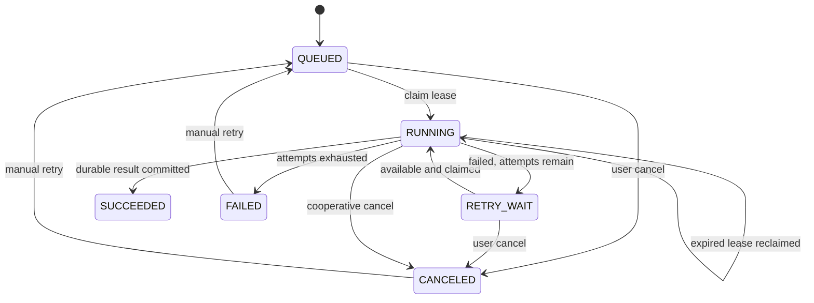

# Router、持久任务、制品与交换

> 2026-09-21 文档核对基线。返回[当前架构目录](../../CURRENT_ARCHITECTURE.md)。这里只记录实现事实；测试存在不等于本轮已经运行，验证缺口见[统一路线](../../../plans/README.md)。

## Geometry Router 与本机扩缩容

Router 实现与 GeometryWorker 相同的 gRPC 服务并转发请求。当前 Part 只有一个权威求值 Body，因此其 `GeometryId` 就是驻留原子；同一 Part 的面/边/点查询以及 Product occurrence 引用复用这个原子。未来多 Body Part 必须为每个 Body 产生独立不可变 GeometryId/Artifact，不能以文档 ID 把多个 Body 强制绑在一起。选择规则为：

1. 如果设置调试覆盖，所有请求发往调试 Worker；
2. 优先选择已拥有目标 `GeometryId`/`geometryKey` 的 Worker；首次冷请求在发出 RPC 前即预留 owner，因此并发请求不会把同一 Body 加载到多个 Worker；
3. 否则选择 resident + in-flight 未达到容量且负载较低的 Worker；
4. 无容量且未达最大数量时启动新进程；
5. 最后退化为选择 in-flight 最低的已有 Worker。

`GetTopology` 从 Artifact 恢复 B-Rep 后会立即把请求 GeometryId 绑定到实际 Worker；后续元素查询即使 `OCCCCAD_GEOMETRY_PER_WORKER=1` 也绕过普通容量选择并命中同一 owner。Worker 对每个 GeometryId 缓存完整 `TopologyInfo`，单面查询只过滤缓存结果，不再重复遍历并分析整个 OCCT Shape。Worker 完成后 Router 通过 `Ping` 刷新 resident 数。失联 Worker 被移除并补足最小副本；超出最小副本且 `resident=0` 的空 Worker 才会在超时后回收，驻留 Body 不会被空闲缩容静默丢弃。

局限：所有注册和缓存亲和信息均在内存中；只会拉起本机进程；没有持久租约、跨节点资源报告、优先级、公平调度或租户预算。

## 持久任务与制品

### PostgreSQL 任务队列

API 使用 `(job_type, idempotency_key)` 去重提交。Jobs 进程用 `FOR UPDATE SKIP LOCKED` 领取任务，使用租约、心跳、尝试记录和延迟重试。
Document Center 一次可选择或拖入最多 32 个文件，并发提交最多 3 个独立 `EXCHANGE_IMPORT` Job；单文件提交失败保留该文件供重试，不取消已入队的兄弟任务。单个 Jobs 进程默认运行 2 个独立领取循环，可用 `OCCCCAD_JOB_CONCURRENCY` 调整为 1–8；每个循环使用独立 lease owner 和 Workspace 缓存。它们共享 PostgreSQL 连接池、ArtifactStore 和 Geometry Router；Router 按负载启动多个本机 Geometry Worker 进程。此并发是有界任务并发，不构成按内存预算的大文件容量保证。

当前任务类型为 `EXCHANGE_IMPORT`、`EXCHANGE_EXPORT` 和 `THUMBNAIL_RENDER`。任务可显式标记为用户可见；自动缩略图不进入消息中心。`THUMBNAIL_RENDER` 使用 `png-v4` 生成 `640×400`（`8:5`）PNG：与视口一致的 `(1,-1,1)` / Z-up 正交 ISO、完整 occurrence 旋转/平移、投影范围 Fit、CPU 扫描线深度缓冲、面内平滑光照和 2× 超采样；固定中性材质不随 GeometryKey 改色，B-Rep 边经过深度测试，缺边时提取轮廓/折线。实体缩略图排除草图编辑覆盖，草图/线框文档使用 Visualization primitives。渲染不依赖 GPU 或浏览器，同场景按 GeometryKey 复用法线准备。默认 `5s` deadline 可由 `OCCCCAD_THUMBNAIL_RENDER_TIMEOUT` 调整；超时或超过场景预算（100 万展开三角形、300 万顶点/曲线点、1 万 occurrence）返回缓存默认 PNG；父任务取消同步结束，无遗留渲染 goroutine。API 在任务未完成或制品不可用时返回同尺寸默认 PNG；就绪图片提供 ETag 私有重验证，仍核对权限/当前 Head。迁移 `0025` 仅回填可重建预览任务，RendererVersion 隔离旧 SVG 缓存和旧任务。Exchange 导入先检查清单，再以最多 8 个并发调用导入独立根组件；每个组件形成带默认 DatumPlane、AxisSystem 和可扩展 `IMPORT_BODY` Feature 的 Part，多组件再形成引用这些 Part 的 Product。导入文档名使用经路径清理后的完整文件名，保留 `.step`/`.brep` 后缀。创建文档和后续命令共享稳定 request ID，任务重领后可继续未完成阶段。导出支持 Part 和展平后的 Product occurrence，最终格式为 STEP 或 BREP。Product STEP 导出对每个 occurrence 单独 Transfer 一个带 placement 的 root，因此当前展平 Product 导出再导入仍被识别为 Product，而不会因先合并为 compound 而退化为 Part。语义是至少一次，不是恰好一次；过时缩略图会被安全跳过，文档 Head 已改变的导出任务会失败以避免输出混合版本。

用户可通过 `POST /api/jobs/{jobID}/cancel` 取消自己发起的排队或运行任务，并通过 `POST /api/jobs/{jobID}/retry` 让最终失败或已取消任务重新排队。运行任务每秒检查取消请求并取消其 Geometry 上下文；成功提交条件同时拒绝带取消请求的迟到结果。导入在进度 70% 进入正式文档提交阶段，此后不再开放取消，避免产生用户可见的半提交组件集合。Worker 在检查、几何转换、文档提交和制品登记等阶段单调更新进度。

### Geometry RPC 消息预算

API/Jobs Geometry client、Router 的接收/发送端和 Worker 连接（包括 debug override）、C++ Worker 统一使用 128 MiB 的单消息上限；Go 配置集中于 `internal/geometryrpc`，C++ 使用相同常量。此上限与 16 GiB 文件上传上限分开：源文件、BREP 和 GLB 使用 ArtifactReference，但 EvaluatePartResponse 仍内联完整 Mesh，拓扑和命名响应也走 unary gRPC。原默认 4 MiB 会拒绝约 27.6 MiB 的正常 STEP 导入响应。当前保持明确的有限预算，不宣称任意大模型可经 unary RPC 传输；完整网格外置/小摘要响应仍属于 LARGE-COMPUTE。

定向回归：`TestGeometryRouterLargeRequestAndMeshResponse` 验证 >4 MiB 双向请求/响应并保留旧默认接收器的拒绝对照；`TestLargeSTEPImportThroughManagedRouter` 使用实际 `LD200 torsen v7.step`（17,031,606 字节），经 S3 → 受管理 Router → C++ Worker 返回 28,893,147 字节响应，包含 310,731 顶点、404,796 三角形、114 Solid，通过。该测试覆盖计算与传输，不创建业务文档；未进行浏览器或全量测试。

### ArtifactStore

`artifact.Store` 以 `Backend/Put/Open/Delete` 隔离存储供应商，当前提供 LOCAL 和 S3。所有已登记业务文件（源文件、导出结果、BREP、GLB、拓扑 manifest、缩略图）通过同一接口存取；数据库保存稳定对象 ID、SHA-256、大小、媒体类型与后端 key。S3 使用 MinIO Go SDK v7（Apache-2.0），配置来自 `.env` 的 `OCCCCAD_ARTIFACT_BACKEND` 与 `OCCCCAD_S3_*`，凭据不进入 Worker 或浏览器协议。

LOCAL 按 SHA-256 内容寻址并原子写入。S3 上传先以有界内存写临时文件并计算完整 SHA-256，再对内容寻址 key 执行顺序 multipart；分片由 SDK 传输，单次异常失败，不做续传或请求重试。失败使用独立 10 秒 deadline 撤销本次 upload ID，服务不可达时记录清理失败；进程崩溃/对象存储持续不可达后的孤儿回收仍需后续 GC。只有完整上传成功后才写 READY 元数据；数据库失败可能留下未引用对象，不会让引用指向未完成上传。下载直接从 Store reader 流入 HTTP，不在 API 缓冲整个文件。

`POST /api/exchange/imports` 仍接收原始 HTTP body，经 `MaxBytesReader` 校验 `OCCCCAD_EXCHANGE_MAX_BYTES`（默认 16 GiB）；Web 从 capabilities 获取同一限制。导出下载使用浏览器原生下载，不构造完整 Blob。HTTP 与制品相关几何 RPC 最长 2 小时，调用方取消仍生效。上传成功只表示文件已完整存储及任务入队，不表示几何计算完成。

OCCT 使用文件接口：Go Geometry client 将远端引用按 RPC 下载到独立 scratch，校验大小和 SHA-256，并在调用完成/失败后清理；同 RPC 内相同输入只暂存一次。Worker 输出通过 `Adopt` 上传并登记后清理 staging。`occccad-control` 仍以 `services/` 为相对目录基准将 `OCCCCAD_DATA_DIR` 规范化并传给各进程，所以 API、Jobs 和本机 Worker 仍共享计算暂存目录；这不是跨主机 Worker 数据传输的交付。永久业务制品由 S3 保存，临时盘仍需覆盖并发上传和几何计算工作集。

`occccad-artifacts --migrate-local` 分批迁移旧 LOCAL 对象及尚无对象引用的数据库 bytea；bytea 按 1 MiB 查询块读取。复制和校验成功后更新对象位置，保留 ID、Revision 和原始备份，不在网络传输期间占用数据库事务。允许重复运行；切换过程中仍可读取旧 LOCAL 引用。初始化桶和迁移命令见[存储运维](../../../services/cmd/occccad-artifacts/README.md)。

2026-09-24 定向验证：真实 MinIO 的 1 GiB 往返及完整 SHA-256 通过；取消分片独立清理、HTTP chunked 超限拒绝、Worker 输入校验/清理、小模型 STEP/BREP 交换链通过；Go 相关包定向测试、C++ Worker 构建及 Web 类型检查通过。开发库迁移了 408 个 LOCAL 对象并补齐 19 处 embedded 引用（内容去重），最终 409 个 READY 对象均在 S3 完成逐对象大小与摘要核验。原件保留，未做浏览器或全量测试。

Exchange HTTP 提交只等待完整上传和 Job 入队，随后立即关闭对话框；浏览器不会让提交请求等待几何处理。Jobs 在最终 `SUCCEEDED`、最终 `FAILED` 或 `CANCELED` 状态转换的同一 SQL statement 中写入 `JOB` Outbox，API 将 `job.state.changed.v1` 仅推送给任务发起用户。若该用户没有可接收的 WebSocket 会话，事件保持 unpublished，直到至少一个会话接受。Web 顶部消息中心同时从 `GET /api/jobs` 恢复最近 100 条用户可见任务，因此错过瞬时通知或重新登录后仍能看到状态、失败原因、进度和下载/打开入口；仅在存在活动任务时每 2.5 秒刷新进度，终态仍由 WebSocket 立即提示。前端把持久 Job 投影为通用 ActivityItem，任务类型展示与动作注册集中在 activity 模块，未来其他持久消息来源可增加独立 projector 后合并，而不复制 Drawer 或任务状态机。

当前 STEP 装配识别以 OCCT transferable root 为并行边界，能保存多根文件为 Product/Part 引用并保留根 Shape 自带放置；Product 导出同样保持“每个 occurrence 一个 transferable root”的当前对称契约。这只保证展平 Product 的类型和 placement round-trip；尚未使用 STEPCAF/XDE 恢复嵌套层级、名称、颜色、单位和共享实例关系，因此不能宣称完整 AP242 装配交换。

## 实现与验证入口

- [Jobs](../../../services/internal/jobs)
- [Artifact](../../../services/internal/artifact)
- [Geometry 路由](../../../services/internal/control)

## 大文件与导入编辑的已知限制（2026-09-22 代码核对）

存储层已通过真实 MinIO 的 1 GiB 上传/下载 SHA-256 往返，以及小模型 S3 → C++ Worker → S3 的 STEP/BREP 验证；尚无 1 GiB 几何/显示容量验收。API 与 Worker 文件上限默认 16 GiB，制品 RPC deadline 为 2 小时。STEP inspect 和每个 component 的 `loadStepRoot` 分别 ReadFile；固定最多 8 路不能视作按内存预算的调度。Jobs 在 results 中保留所有组件 EvaluatePartResponse，Worker 即使输出 BREP/GLB 对象，仍通过 gRPC 返回完整 Mesh；数据库 `mesh_json`、DocumentView 与前端完整数组构造也未实现有界工作集。

ImportExchange 先生成精确快照，CommitImportedPart 再冻结导入定义并通过带 seed 的 EvaluatePart 生成根 manifest；后续 evaluator 传播 imported base 的已有命名。单 Solid 的命名/编辑链与旧 Head 显式修复已完成，见[导入根命名](persistent-naming.md#导入根命名import-naming-已完成2026-09-22)。没有定义的旧快照仍报告命名不可用。大文件设计与分批验收见[大模型提案](../target/large-models.md)及[执行计划](../../../plans/import-large-models.md)。

## IMPORT-DIAGNOSTICS 完成记录（2026-09-22）

两个 manifest 读取入口统一使用可空 digest 和内容校验，不再将 SQL NULL 扫描进 string。Artifact 暴露 `naming.status/canBind/diagnosticCode/diagnostic`：READY 可绑定；UNAVAILABLE 表示未生成命名；FAILED 表示 history 不完整；CORRUPT 表示元数据、摘要或内容损坏/丢失；INCOMPATIBLE 表示 schema/policy 不匹配。存储配置、数据库及其他 I/O 故障仍作为基础设施错误传播，不能吞成“无命名”。已知命名问题不阻止文档打开和几何属性查询，但持久子拓扑绑定明确拒绝；已有装配引用解析失败继续按 Broken 隔离，不伪造成功。

前端显示具体诊断，限制当前已知不可绑定拓扑的面上草图、外部投影、发布与拓扑装配约束入口；服务端保留权威校验。显示、法线视图、基准几何及 Instance/Body 级操作不因缺少 naming 被统一禁用。该诊断层自身不补命名；后续 IMPORT-NAMING 已补齐受支持单 Solid 的编辑链。

[只读审计 SQL](../../../services/scripts/audit-import-naming.sql)按 HEAD/HISTORY 汇总导入文档命名元数据。本轮回归写入测试 fixture 前的开发库基线为 2 个当前导入文档，均 NAMING_ABSENT；元数据审计不等于制品内容完整性验证，未重写已有文档。

验证：workspace 包测试通过；真实数据库、Router 与 Worker 的 `TestEdgeVertexPersistentSelectionThroughRealRouter` 通过，覆盖实际 BREP ImportExchange、提交、冷重开、精确属性、禁止面上草图且 Head 不变、基准面草图，以及原生持久拓扑回归。前端类型检查与 naming capability、publication selection、assembly constraint UX、workbench command model 四组场景通过。未做浏览器、全仓或大文件验收。测试入口为 [诊断单测](../../../services/internal/workspace/topology_naming_diagnostics_test.go)与[导入集成断言](../../../services/internal/control/import_naming_diagnostics_test.go)。
