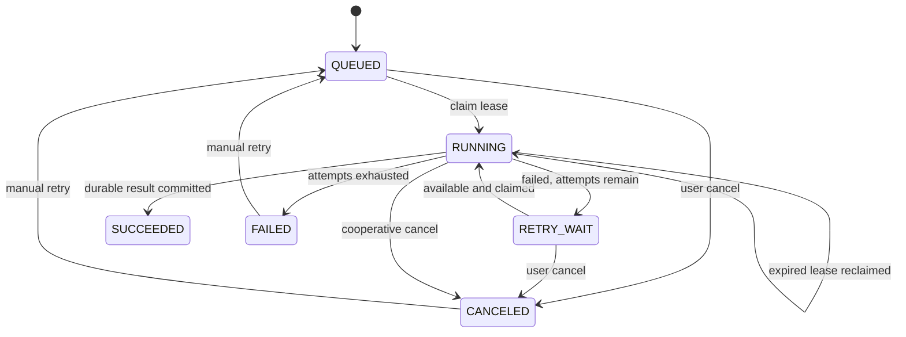

# Router、持久任务、制品与交换

> 2026-09-21 文档核对基线。返回[当前架构目录](../../CURRENT_ARCHITECTURE.md)。这里只记录实现事实；测试存在不等于本轮已经运行，验证缺口见[统一路线](../../../plans/README.md)。

## Geometry Router 与本机扩缩容

Router 实现与 GeometryWorker 相同的 gRPC 服务并转发请求。当前 Part 只有一个权威求值 Body，因此其 `GeometryId` 就是驻留原子；同一 Part 的面/边/点查询以及 Product occurrence 引用复用这个原子。未来多 Body Part 必须为每个 Body 产生独立不可变 GeometryId/Artifact，不能以文档 ID 把多个 Body 强制绑在一起。选择规则为：

1. 如果设置调试覆盖，所有请求发往调试 Worker；
2. 优先选择已拥有目标 `GeometryId`/`geometryKey` 的 Worker；首次冷请求在发出 RPC 前即预留 owner，因此并发请求不会把同一 Body 加载到多个 Worker；
3. 否则选择 resident + in-flight 未达到容量且负载较低的 Worker；
4. 无容量，或所有可选 Worker 均有在途请求，且未达最大数量时启动新进程；驻留容量不是单进程原生计算并行度；
5. 最后退化为选择 in-flight 最低的已有 Worker。

`GetTopology` 从 Artifact 恢复 B-Rep 后会立即把请求 GeometryId 绑定到实际 Worker；后续元素查询即使 `OCCCCAD_GEOMETRY_PER_WORKER=1` 也绕过普通容量选择并命中同一 owner。Worker 对每个 GeometryId 缓存完整 `TopologyInfo`，单面查询只过滤缓存结果，不再重复遍历并分析整个 OCCT Shape。Worker 完成后 Router 通过 `Ping` 刷新 resident 数。`Ping` 不等待 OCCT 运算锁：空闲时读取准确驻留数，忙碌时返回原子快照，避免长时间 STEP 解析/导入阻塞存活探测。Router 按 Worker 串行处理探测结果，单次失败不驱逐；连续三次探测失败，或探测失败且本地进程已退出，才移除并补足最小副本。成功探测重置失败计数；已移除 Worker 的迟到完成不能恢复 owner 映射。超出最小副本且 `resident=0` 的空 Worker 才会在超时后回收，驻留 Body 不会被空闲缩容静默丢弃。

定向健康探测回归验证长时间 STEP 解析期间并发 Ping/短 RPC 正常，主动终止测试进程后替换与 owner 清理正常。XDE 共享定义和完整 Jobs 导入验证见本页末尾；这些正确性回归不作为耗时基准。

局限：所有注册和缓存亲和信息均在内存中；只会拉起本机进程；没有持久租约、跨节点资源报告、优先级、公平调度或租户预算。

## 持久任务与制品

### PostgreSQL 任务队列

API 使用 `(job_type, idempotency_key)` 去重提交。Jobs 进程用 `FOR UPDATE SKIP LOCKED` 领取任务，使用租约、心跳、尝试记录和延迟重试。
Document Center 一次可选择或拖入最多 32 个文件，并发提交最多 3 个独立 `EXCHANGE_IMPORT` Job；单文件提交失败保留该文件供重试，不取消已入队的兄弟任务。单个 Jobs 进程默认运行 2 个独立领取循环，可用 `OCCCCAD_JOB_CONCURRENCY` 调整为 1–8；每个循环使用独立 lease owner 和 Workspace 缓存。它们共享 PostgreSQL 连接池、ArtifactStore 和 Geometry Router；Router 按负载启动多个本机 Geometry Worker 进程。此并发是有界任务并发，不构成按内存预算的大文件容量保证。

当前任务类型为 `EXCHANGE_IMPORT`、`EXCHANGE_EXPORT` 和 `THUMBNAIL_RENDER`。任务可显式标记为用户可见；自动缩略图不进入消息中心。`THUMBNAIL_RENDER` 使用 `png-v4` 生成 `640×400`（`8:5`）PNG：与视口一致的 `(1,-1,1)` / Z-up 正交 ISO、完整 occurrence 旋转/平移、投影范围 Fit、CPU 扫描线深度缓冲、面内平滑光照和 2× 超采样；固定中性材质不随 GeometryKey 改色，B-Rep 边经过深度测试，缺边时提取轮廓/折线。实体缩略图排除草图编辑覆盖，草图/线框文档使用 Visualization primitives。渲染不依赖 GPU 或浏览器，同场景按 GeometryKey 复用法线准备。默认 `5s` deadline 可由 `OCCCCAD_THUMBNAIL_RENDER_TIMEOUT` 调整；超时或超过场景预算（100 万展开三角形、300 万顶点/曲线点、1 万 occurrence）返回缓存默认 PNG；父任务取消同步结束，无遗留渲染 goroutine。API 在任务未完成或制品不可用时返回同尺寸默认 PNG；就绪图片提供 ETag 私有重验证，仍核对权限/当前 Head。迁移 `0025` 仅回填可重建预览任务，RendererVersion 隔离旧 SVG 缓存和旧任务。Exchange 导入准备阶段只解析一次 STEP/XDE，输出 Definition/Occurrence graph 和 definition-local BREP 快照。每个唯一 Part Definition 经有效性检查、必要的受限修复后形成带默认 DatumPlane、AxisSystem 和可扩展 `IMPORT_BODY` Feature 的 Part，Product Definition 按源图引用 Part/Sub Product。几何求值与 Part 命名/创建分两阶段有界并行，`OCCCCAD_IMPORT_CONCURRENCY` 默认 4、正整数，作为同一 Jobs 进程所有导入共享的活动工作上限；准备解析也占额度，各文件组件并发取组件数与上限的较小值，任务结束/失败释放额度，Router 总进程数仍由 `OCCCCAD_GEOMETRY_WORKER_MAX` 限制；Product 每批最多 128 个实例以一个命令插入并固定到已导入版本，避免逐实例重复解析整棵装配。导入优先保留 STEP 源名称，缺失时使用上传文件名。创建文档和后续命令共享稳定 request ID，任务重领会复用已提交文档/命令，但组件计算尚无持久 checkpoint，仍可能重做。导出支持共享/嵌套 Product，STEP 通过 XDE Definition/Occurrence 图写出，BREP 仍合成为 Compound。语义是至少一次，不是恰好一次；过时缩略图会被安全跳过，文档 Head 已改变的导出任务会失败以避免输出混合版本。

用户可通过 `POST /api/jobs/{jobID}/cancel` 取消自己发起的排队或运行任务，并通过 `POST /api/jobs/{jobID}/retry` 让最终失败或已取消任务重新排队。运行任务每秒检查取消请求并取消其 Geometry 上下文；成功提交条件同时拒绝带取消请求的迟到结果。导入在进度 70% 进入正式文档提交阶段，此后不再开放取消，避免产生用户可见的半提交组件集合。进度为 PREPARING（5%）、EVALUATING（15–65%，按组件完成数）、CREATING_PARTS（70–94%，按命名/文档完成数）、ASSEMBLING（95%）、成功（100%）。`payload.progressDetail` 记录阶段、完成/总数、attempt 与阶段进度；百分比跨自动重试、人工重试和租约重领保留高水位，同一 attempt 的迟到阶段不覆盖新阶段，新 attempt 可显示实际重做阶段。界面明确标注等待重试/尝试次数。确定性的域校验、Worker INVALID_ARGUMENT 不自动重试；基础设施暂态失败保留重试。组件并发不改变按文档的事务/CAS/幂等语义，也不构成整个导入集的原子发布。

### Geometry RPC 消息预算

API/Jobs、Router 和 C++ Worker 保留 128 MiB 的有限 RPC 预算，但持久 `EvaluatePartResponse` 已不再传完整 Mesh、BREP/GLB 字节或完整 Naming。大载荷通过 ArtifactReference；GLB 取代数据库和 DocumentView 的 Mesh。独立 transient preview 可携带 preview_mesh。当前合同与验证入口见[几何制品](geometry-representations.md)。文件上传上限仍独立于 RPC 单消息预算。

### ArtifactStore

`artifact.Store` 以 `Backend/Put/Open/Delete` 隔离存储供应商，当前提供 LOCAL 和 S3。所有已登记业务文件（源文件、导出结果、BREP、GLB、拓扑 manifest、缩略图）通过同一接口存取；数据库保存稳定对象 ID、SHA-256、大小、媒体类型与后端 key。S3 使用 MinIO Go SDK v7（Apache-2.0），配置来自 `.env` 的 `OCCCCAD_ARTIFACT_BACKEND` 与 `OCCCCAD_S3_*`，凭据不进入 Worker 或浏览器协议。

LOCAL 按 SHA-256 内容寻址并原子写入。S3 上传先以有界内存写临时文件并计算完整 SHA-256，再对内容寻址 key 执行顺序 multipart；分片由 SDK 传输，单次异常失败，不做续传或请求重试。失败使用独立 10 秒 deadline 撤销本次 upload ID，服务不可达时记录清理失败；进程崩溃/对象存储持续不可达后的孤儿回收仍需后续 GC。只有完整上传成功后才写 READY 元数据；数据库失败可能留下未引用对象，不会让引用指向未完成上传。下载直接从 Store reader 流入 HTTP，不在 API 缓冲整个文件。

`POST /api/exchange/imports` 仍接收原始 HTTP body，经 `MaxBytesReader` 校验 `OCCCCAD_EXCHANGE_MAX_BYTES`（默认 16 GiB）；Web 从 capabilities 获取同一限制。导出下载使用浏览器原生下载，不构造完整 Blob。HTTP 与制品相关几何 RPC 最长 2 小时，调用方取消仍生效。上传成功只表示文件已完整存储及任务入队，不表示几何计算完成。

OCCT 使用文件接口：Go Geometry client 将远端引用按 RPC 下载到独立 scratch，校验大小和 SHA-256，并在调用完成/失败后清理；同 RPC 内相同输入只暂存一次。Worker 输出通过 `Adopt` 上传并登记后清理 staging。`occccad-control` 仍以 `services/` 为相对目录基准将 `OCCCCAD_DATA_DIR` 规范化并传给各进程，所以 API、Jobs 和本机 Worker 仍共享计算暂存目录；这不是跨主机 Worker 数据传输的交付。永久业务制品由 S3 保存，临时盘仍需覆盖并发上传和几何计算工作集。开发重置通过独立的 `DevelopmentResetter` 管理能力清空当前 S3 桶全部对象版本、删除标记和未完成分片，保留桶；不扩张普通 `Store` 的业务接口。必须停止写入，跨存储删除无法原子回滚，失败不报告成功，可修复后重跑。

`occccad-artifacts --migrate-local` 可复制并核验已有 LOCAL 对象后切换索引。旧 bytea 内联迁移/回退已移除；当前未发布数据架构通过开发 reset 重建，不能继续使用旧 schema。初始化桶和配置见[存储运维](../../../services/cmd/occccad-artifacts/README.md)。

2026-09-24 定向验证：真实 MinIO 的 1 GiB 往返及完整 SHA-256 通过；取消分片独立清理、HTTP chunked 超限拒绝、Worker 输入校验/清理、小模型 STEP/BREP 交换链通过；Go 相关包定向测试、C++ Worker 构建及 Web 类型检查通过。开发库迁移了 408 个 LOCAL 对象并补齐 19 处 embedded 引用（内容去重），最终 409 个 READY 对象均在 S3 完成逐对象大小与摘要核验。原件保留，未做浏览器或全量测试。

Exchange HTTP 提交只等待完整上传和 Job 入队，随后立即关闭对话框；浏览器不会让提交请求等待几何处理。Jobs 在排队、领取、进度、重试与取消等生命周期状态转换的同一 SQL statement 或领取事务中写入 `JOB` Outbox，API 将 `job.state.changed.v1` 仅推送给任务发起用户。若该用户没有可接收的 WebSocket 会话，事件保持 unpublished，直到至少一个会话接受。Web 顶部消息中心同时从 `GET /api/jobs` 恢复最近 100 条用户可见任务，因此错过瞬时通知或重新登录后仍能看到状态、失败原因、进度和下载/打开入口；仅在存在活动任务时每 2.5 秒刷新进度，终态仍由 WebSocket 立即提示。前端把持久 Job 投影为通用 ActivityItem，任务类型展示与动作注册集中在 activity 模块，未来其他持久消息来源可增加独立 projector 后合并，而不复制 Drawer 或任务状态机。

STEP 交换使用 `STEPCAFControl_Reader/Writer` 和 XDE document。Definition identity 来自源 XDE label（仅在这份源文件的导入过程有效），不由几何 hash 推断；同一 Part/Sub Product 的多个 occurrence 引用同一文档。名称、局部平移/单位四元数、嵌套层级和共享引用进入已有 ProductInstance/PINNED Revision/typed InstancePath。几何内容寻址只复用 Artifact；相同几何的不同源 Definition 仍是不同 Part 文档与独立 Naming 身份。

`InspectExchange` 返回临时 `ExchangeGraph`：definitions 含 id/name/kind、PART 的 BREP 引用或 PRODUCT 的 children；roots/children 含 occurrence id、definitionId、name 和 local placement。准备阶段每个唯一 Part 只写一份本地坐标 BREP，Jobs 仅对这些 Definition 并行求值和创建 Naming/Part，然后按依赖顺序提交 Product。根为一个单位 placement 的 Definition 时直接返回该文档；多个根或非单位根 placement 用源容器 Product 表达。图不是独立的长期业务模型。同级源名称冲突时，内部 InstanceName 添加确定性后缀保持已有唯一性规则，并以 importedName 保存源名与分配名；未被用户重命名的实例导出恢复源名。实例引用仍依赖 typed stable ID。

`ImportExchange.definition_id` 选择 STEP Part Definition；空 ID 只接受唯一 Part 的图，不再按 transferable root ordinal 选择业务 Part。BREP 没有装配身份，作为一个 Part/合法 Solid Compound 导入，不伪造 Product；多 Solid Definition 的有效性、无散落拓扑、Naming 全覆盖与修复前后 Solid 数保持均受检验。

导出从根 Revision 递归读取已接受的 Part/Product 引用，保留局部 placement；按 document + revision + 实际上下文几何/子定义结果复用 Definition。同一业务 Definition 的上下文变体必要时分开表达，避免互相覆盖。Release 导出使用冻结根 Revision 和冻结几何，不查询子文档最新 Head。XDE writer 使用显式独立 label 创建业务定义，不用 AddShape 的几何匹配替代身份；BREP 导出仍将图合成为几何 Compound。

图验证拒绝缺失/重复身份、悬空引用、环、非法 pose、不可达定义及超限；深度最多 128、定义最多 100000、定义内总引用最多 1000000，业务上下文现有展开上限仍独立生效。STEP 外部文件引用在 Transfer 前拒绝，避免访问未授权路径。共享定义不表示 OCCT/XDE 已实现 out-of-core；颜色、材质、层、PMI 和完整 AP242 尚未交付。

## 实现与验证入口

- [Jobs](../../../services/internal/jobs)
- [Artifact](../../../services/internal/artifact)
- [Geometry 路由](../../../services/internal/control)

### XDE 定向验证

内核测试覆盖 100 次 Part 引用、重复 Sub Product、同几何不同 Definition、名称/平移/旋转、两轮 XDE round-trip、文件体积和 Solid Compound Naming。Jobs 集成通过真实 PostgreSQL、ArtifactStore、Router 和 Worker 验证唯一文档创建、冻结命名、显式 placement、Undo/Redo 与导出后重新导入。入口：`GeometryExchange.Xde*`、`TestXdeImportSharedDefinitionsAndRoundTrip`。这些测试不代表 1 GiB 几何容量或浏览器验收。

真实 `data/LD200 torsen v7.step` 在独立测试 PostgreSQL、LOCAL ArtifactStore 和正式 Router/4 Worker 链路通过导入、全部唯一 Part FACE 绑定及 STEP 导出回读：16 个 Part + 7 个 Product Definition，60 个展开 Part occurrence，总 Solid 数仍为 114。此前按 Solid 展平为 114 个 Part；此处多 Solid 源 Definition 保持单 Part，未丢弃实体。实测为该语料正确性回归，不构成 1 GiB 容量或跨环境性能承诺。
