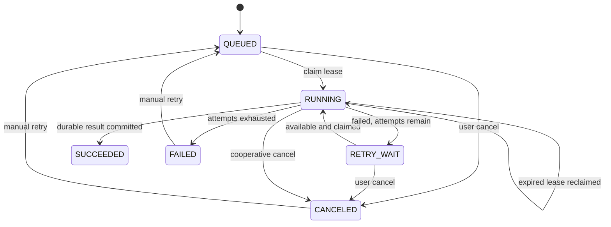

# Router、持久任务、制品与交换

> 2026-09-21 文档核对基线。返回[当前架构目录](../../CURRENT_ARCHITECTURE.md)。这里只记录实现事实；测试存在不等于本轮已经运行，验证缺口见[统一路线](../../../plans/README.md)。

## Geometry Router 与本机扩缩容

Router 实现与 GeometryWorker 相同的 gRPC 服务并转发请求。当前 Part 只有一个权威求值 Body，因此其 `GeometryId` 就是驻留原子；同一 Part 的面/边/点查询以及 Product occurrence 引用复用这个原子。未来多 Body Part 必须为每个 Body 产生独立不可变 GeometryId/Artifact，不能以文档 ID 把多个 Body 强制绑在一起。选择规则为：

1. 如果设置调试覆盖，所有请求发往调试 Worker；
2. 优先选择已拥有目标 `GeometryId`/`geometryKey` 的 Worker；首次冷请求在发出 RPC 前即预留 owner，因此并发请求不会把同一 Body 加载到多个 Worker；
3. 否则选择 resident + in-flight 未达到容量且负载较低的 Worker；
4. 无容量且未达最大数量时启动新进程；
5. 最后退化为选择 in-flight 最低的已有 Worker。

`GetTopology` 从 Artifact 恢复 B-Rep 后会立即把请求 GeometryId 绑定到实际 Worker；后续元素查询即使 `OCCCCAD_GEOMETRY_PER_WORKER=1` 也绕过普通容量选择并命中同一 owner。Worker 对每个 GeometryId 缓存完整 `TopologyInfo`，单面查询只过滤缓存结果，不再重复遍历并分析整个 OCCT Shape。Worker 完成后 Router 通过 `Ping` 刷新 resident 数。失联 Worker 被移除并补足最小副本；超出最小副本且 `resident=0` 的空 Worker 才会在超时后回收，驻留 Body 不会被空闲缩容静默丢弃。

局限：所有注册和缓存亲和信息均在内存中；只会拉起本机进程；没有持久租约、跨节点资源报告、优先级、公平调度或租户预算。

## 持久任务与制品

### PostgreSQL 任务队列

API 使用 `(job_type, idempotency_key)` 去重提交。Jobs 进程用 `FOR UPDATE SKIP LOCKED` 领取任务，使用租约、心跳、尝试记录和延迟重试。

当前任务类型为 `EXCHANGE_IMPORT`、`EXCHANGE_EXPORT` 和 `THUMBNAIL_RENDER`。任务可显式标记为用户可见；自动缩略图不进入消息中心。`THUMBNAIL_RENDER` 使用 `png-v4` 生成 `640×400`（`8:5`）PNG：与视口一致的 `(1,-1,1)` / Z-up 正交 ISO、完整 occurrence 旋转/平移、投影范围 Fit、CPU 扫描线深度缓冲、面内平滑光照和 2× 超采样；固定中性材质不随 GeometryKey 改色，B-Rep 边经过深度测试，缺边时提取轮廓/折线。实体缩略图排除草图编辑覆盖，草图/线框文档使用 Visualization primitives。渲染不依赖 GPU 或浏览器，同场景按 GeometryKey 复用法线准备。默认 `5s` deadline 可由 `OCCCCAD_THUMBNAIL_RENDER_TIMEOUT` 调整；超时或超过场景预算（100 万展开三角形、300 万顶点/曲线点、1 万 occurrence）返回缓存默认 PNG；父任务取消同步结束，无遗留渲染 goroutine。API 在任务未完成或制品不可用时返回同尺寸默认 PNG；就绪图片提供 ETag 私有重验证，仍核对权限/当前 Head。迁移 `0025` 仅回填可重建预览任务，RendererVersion 隔离旧 SVG 缓存和旧任务。Exchange 导入先检查清单，再以最多 8 个并发调用导入独立根组件；每个组件形成带默认 DatumPlane、AxisSystem 和可扩展 `IMPORT_BODY` Feature 的 Part，多组件再形成引用这些 Part 的 Product。导入文档名使用经路径清理后的完整文件名，保留 `.step`/`.brep` 后缀。创建文档和后续命令共享稳定 request ID，任务重领后可继续未完成阶段。导出支持 Part 和展平后的 Product occurrence，最终格式为 STEP 或 BREP。Product STEP 导出对每个 occurrence 单独 Transfer 一个带 placement 的 root，因此当前展平 Product 导出再导入仍被识别为 Product，而不会因先合并为 compound 而退化为 Part。语义是至少一次，不是恰好一次；过时缩略图会被安全跳过，文档 Head 已改变的导出任务会失败以避免输出混合版本。

用户可通过 `POST /api/jobs/{jobID}/cancel` 取消自己发起的排队或运行任务，并通过 `POST /api/jobs/{jobID}/retry` 让最终失败或已取消任务重新排队。运行任务每秒检查取消请求并取消其 Geometry 上下文；成功提交条件同时拒绝带取消请求的迟到结果。导入在进度 70% 进入正式文档提交阶段，此后不再开放取消，避免产生用户可见的半提交组件集合。Worker 在检查、几何转换、文档提交和制品登记等阶段单调更新进度。

### ArtifactStore

本地后端按 SHA-256 内容寻址并原子写入 `OCCCCAD_DATA_DIR`。数据库保存对象元数据、大小、媒体类型和引用。`occccad-control` 以 `services/` 为相对路径基准，将该目录规范化为绝对路径并显式传给 API、Jobs 和每个动态 Geometry Worker；不能让子进程按各自 working directory 重新解释 `./data`。因此本地后端仍不能直接支撑无共享盘的多主机部署。

Document Center 的 `POST /api/exchange/imports` 接收原始 HTTP body，使用 `MaxBytesReader` 限制为 128 MiB，并直接以 `io.Reader` 流入 ArtifactStore；不使用 multipart、`ReadAll`、WebSocket 或 gRPC bytes 字段。`POST /api/exchange/exports` 只提交文档 ID、Head 和格式，`GET /api/jobs/{jobID}/download` 以流式响应下载结果。Geometry gRPC 只交换 opaque object key、digest、大小和媒体类型；当前 Worker 与 API/Jobs 通过相同 `OCCCCAD_DATA_DIR` 模拟对象存储。生产替换为 S3 signed upload/download 时，领域任务与 Worker 契约保持 ArtifactReference，不传本机绝对路径。

Exchange HTTP 提交只等待上传落盘和 Job 入队，随后立即关闭对话框；浏览器不会让提交请求等待几何处理。Jobs 在最终 `SUCCEEDED`、最终 `FAILED` 或 `CANCELED` 状态转换的同一 SQL statement 中写入 `JOB` Outbox，API 将 `job.state.changed.v1` 仅推送给任务发起用户。若该用户没有可接收的 WebSocket 会话，事件保持 unpublished，直到至少一个会话接受。Web 顶部消息中心同时从 `GET /api/jobs` 恢复最近 100 条用户可见任务，因此错过瞬时通知或重新登录后仍能看到状态、失败原因、进度和下载/打开入口；仅在存在活动任务时每 2.5 秒刷新进度，终态仍由 WebSocket 立即提示。前端把持久 Job 投影为通用 ActivityItem，任务类型展示与动作注册集中在 activity 模块，未来其他持久消息来源可增加独立 projector 后合并，而不复制 Drawer 或任务状态机。

当前 STEP 装配识别以 OCCT transferable root 为并行边界，能保存多根文件为 Product/Part 引用并保留根 Shape 自带放置；Product 导出同样保持“每个 occurrence 一个 transferable root”的当前对称契约。这只保证展平 Product 的类型和 placement round-trip；尚未使用 STEPCAF/XDE 恢复嵌套层级、名称、颜色、单位和共享实例关系，因此不能宣称完整 AP242 装配交换。

## 实现与验证入口

- [Jobs](../../../services/internal/jobs)
- [Artifact](../../../services/internal/artifact)
- [Geometry 路由](../../../services/internal/control)

## 大文件与导入编辑的已知限制（2026-09-22 代码核对）

以下为代码阅读结论，尚无 1 GiB 级容量验收。除 API 的 128 MiB 外，Geometry Worker 的输入/输出制品还有 512 MiB 上限；`InspectExchange` 的 30 秒与 `ImportExchange` 的 5 分钟是当前客户端 deadline。STEP inspect 和每个 component 的 `loadStepRoot` 分别 ReadFile；固定最多 8 路不能视作按内存预算的调度。Jobs 在 results 中保留所有组件 EvaluatePartResponse，Worker 即使输出 BREP/GLB 对象，仍通过 gRPC 返回完整 Mesh；数据库 `mesh_json`、DocumentView 与前端完整数组构造也未实现有界工作集。

当前 ImportExchange 未生成 feature topology manifest，`persistEvaluation` 可把 `topology_manifest_digest` 写为 NULL；`topologyManifestForVersion` 却扫描到 string，因此导入文档的持久子拓扑操作可能出现 `cannot scan NULL into *string`。这是当前路径的缺陷，不仅是旧数据兼容问题。后续 native evaluator 对 imported `base_brep` 也没有已有 named topology seed，会报告 `TOPOLOGY_HISTORY_UNNAMED_BASE`。修复需覆盖可空诊断、Import 根身份和后续 lineage，不能只消除数据库异常文本。

设计与分批验收见[大模型提案](../target/large-models.md)及[执行计划](../../../plans/import-large-models.md)；这些问题本轮仅分析和记录，未修改实现。
