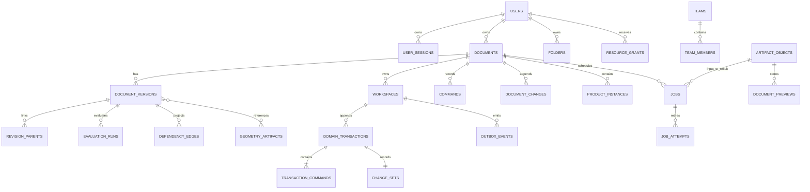

# 模型、命令、历史与参数

> 2026-09-21 文档核对基线。返回[当前架构目录](../../CURRENT_ARCHITECTURE.md)。这里只记录实现事实；测试存在不等于本轮已经运行，验证缺口见[统一路线](../../../plans/README.md)。

## 业务与数据模型

PostgreSQL schema 名为 `occccad`，当前迁移建立的主要关系如下。

### Document 与 Version

- Document 类型当前为 Part 或 Product；
- Document 以 UUID `id` 为唯一身份，`name` 是允许重复的显示属性；创建界面按已有名称提供首个可用的 `PartN`/`ProductN` 默认值，但默认值和名称都不参与身份或引用解析；
- Document 是容器；显式 Workspace 保存可变 Head/sequence/base，`document_versions` 是不可变 Revision 快照；
- 每个新建或复制的 Document 自动建立 `main` Workspace，旧 Document 由迁移确定性回填；可以从任意所属 Revision 创建并列出 Branch Workspace；
- Domain Transaction、typed command envelope、语义 ChangeSet、Revision parent、EvaluationRun、dependency edge 与 outbox 在 Head CAS 的同一短事务中追加；
- Restore 创建新的状态，而不是覆写历史；
- Product 保存对子文档的引用和实例 Transform，不展开复制完整子树；

### Command 与 Undo/Redo

HTTP transport DTO 在 API 边界转换为 `type_uri + schema_version + typed payload`，再由进程内 handler registry 执行；持久历史只保存 Domain Command，不存在第二套旧命令语义。Handler 的模型变换无数据库、网络、系统时间和 OCCT I/O；Product 外部引用先冻结，Part 几何在数据库事务外求值，提交阶段以 `(workspace head revision, head sequence)` 做 CAS。重复 request ID 只有 payload digest 相同才返回原结果。运行时事务经统一数据库调度获取一个执行名额；命令、历史和跨文档提交将连续写入按最多 128 条批量发送，批次共享同一事务，任一批次失败仍回滚所有 Revision/ChangeSet/Head/Outbox 写入，不存在分批提交。

Part 支持草图、拉伸、STEP 基础实体与参数 literal/expression 更新；Product 支持插入、移动和引用策略。Specification Tree 是服务端模型投影：节点携带稳定领域 identity、owner 和允许的 capability，当前 Feature、Product Instance、Sketch Entity/Constraint 可按模型状态开放 `DELETE`，而 Document、Body、Origin、Datum Plane、Axis System/Axis 和引用子树默认受保护。删除仍是版本化 Domain Command；删除草图实体会在同一 `sketch.model` 变更中级联删除全部引用约束，删除 Feature 则先检查下游依赖。Undo/Redo 以根 Domain Transaction 为稳定 identity：Revert 指向根 intent，Reapply 指向根 intent 并消费一个具体 Revert。服务端按 actor 折叠有序 action log 计算 capability，因此连续 Undo 两步可按逆序 Redo 两步；新 Domain/Restore 形成 redo boundary，但不删除历史。API 返回的 `canUndo/canRedo` 来自同一状态折叠，Web 按它置灰。字段 digest 或依赖冲突不会覆盖后续编辑。

### 实时消息与同文档同步

- `GET /api/realtime` 使用 `occccad.realtime.v1` WebSocket 子协议；现有 session cookie 负责身份，首条 `connection.initialize.v1` 再验证 CSRF token 和 Origin；
- JSON Envelope 支持 request/response/event/ack/error、correlation ID、版本化 type、Workspace sequence 和稳定错误；当前最大消息 1 MiB；
- Web 前端的建模命令使用 `workspace.command.execute.v1`，HTTP 命令入口仍保留并调用同一个 Workspace Service；
- 浏览器进入工作台后订阅 Document 并获得 DocumentView 快照。其他用户提交后，事务内 Outbox 由 API 轮询并向所有本机订阅者发布 `workspace.transaction.committed.v1`，浏览器刷新 Document、History、Properties 和目录投影；
- Product 浏览器会话还递归订阅结构树中未被 `PINNED` 边截断的 FOLLOW_HEAD Reference Document。子 Part/Product 提交后，客户端失效并重新读取 Product Update Plan，再按叶到根串行自动接受；服务端仍以计划 digest 拒绝 stale candidate，每一级都形成正常不可变 Revision，失败只显示阻塞诊断而不令旧 Revision 漂移。激活文档即使位于 PINNED occurrence 下也会单独订阅，以支持该 Reference Document 自身的协同编辑；
- 客户端按 sequence 去重和发现 gap，断线指数退避重连并重新获取快照；服务端以 Ping/Pong 检测失联，有界 128 消息队列满时断开慢消费者；
- 当前实现多浏览器查看同一文档的提交后实时同步；presence、鼠标/选择和拖拽 preview 尚未接入 UI，多 API 实例间扇出也尚未实现。

### 参数、依赖与增量求值

- Distance、Length、Radius、Diameter、Angle 草图驱动尺寸与 Pad length 会从所属 Sketch/Constraint/Feature identity 确定性派生稳定 ParameterId 和 PropertySlot facade；草图尺寸不再以匿名数值作为权威来源；
- Quantity 以 SI canonical value 和显式 Dimension 保存，当前注册 `mm/cm/m/in` 与 `deg/rad`，拒绝非有限值和量纲错误；
- 当前安全表达式 profile 支持数量字面量、Parameter read、括号和 `+ - * /`，在提交时完成名称绑定、单位检查、cost limit 和 dependency extraction；持久 AST 只保存 ParameterId，显示 key 重命名不破坏引用，并由 checked AST 重新生成当前可读别名文本；参数删除、缺失引用、循环和量纲错误在新 Head 前失败；
- Design Dependency Graph 使用稳定 key 与 typed edge，提交前检查 phase 和 cycle；handler 的 impact seed 计算 transitive dirty closure；
- 每个新模型 Revision 保存 model hash、dependency snapshot digest 和 EvaluationManifest，并投影 node input/output digest、dirty nodes 与 authoritative EvaluationRun；增量 evaluator 只在 input digest 相同才复用前一 manifest 结果，测试以清缓存冷求值为等价 oracle。
- 参数 literal/expression 在 Sketch Solver 和 Feature evaluator 之前按同一拓扑序求值；DocumentView/属性面板显示 ParameterId、别名、source text 与规范计算值，Part Design 的文档级参数面板集中列出全部参数并复用同一版本化编辑命令。新建 Linear Extrude 的 length 可提交 literal 或同一 Part 的别名表达式；legacy UI command adapter 在创建前完成量纲检查和稳定 ParameterId 绑定，typed create handler 在同一个 Domain Transaction 中创建 Feature 及其参数 source，preview/commit 共用该路径且求值结果必须为正有限长度。别名和 source 编辑继续通过版本化 Domain Command、ChangeSet 与 Undo/Redo。

## 实现与验证入口

- [Workspace 模型](../../../services/internal/workspace/model.go)
- [命令处理](../../../services/internal/workspace/model_core.go)
- [参数/依赖](../../../services/internal/workspace/evaluation_projection.go)
- [连续 Undo/Redo](../../../services/internal/workspace/history_integration_test.go)

### 拉伸编辑的输入单位

REST `EDIT_FEATURE` 的数值 `length` 在省略 `unit` 时按模型毫米解释，与前端 `linearExtrudeLengthInput` 输出一致；显式单位仍经 Quantity 转换，表达式保留长度量纲验证。编辑适配器先构造有量纲 Quantity，再进入统一 typed edit/evaluation/ChangeSet 路径，预览和提交共享此规则。`TestEditFeatureAdapterDefaultsLengthToMillimeters` 覆盖缺省/显式单位及补偿恢复，避免无量纲 literal 引发 `UNIT_MISMATCH`。

导入 Feature 使用 `importDefinitionId` 引用独立冻结的重放输入，包含 BREP 摘要、策略与随机拓扑身份映射；它不是可丢弃的求值缓存。`REPAIR_IMPORT_NAMING` 通过现有 entity PropertySlot 更新引用并生成新 Revision，支持正常补偿。命令重试在依据当前 Head 检查创建/修复前置条件之前核对已提交 request digest，避免成功后因前置条件已变化而错误拒绝重复请求；相同 request ID 的不同 payload 仍拒绝。

装配历史恢复不能隐式执行“重新计算”：历史中的 NotUpdated/Impossible/Broken 及位姿属于当时的不可变结果。Product Undo/Redo 恢复精确字段；已成功快照仅在副本上生成验证证据，验证不得移动组件。反向操作的字段冲突前置条件来自实际最近一次补偿 Revision，恢复目标来自原命令，不能仅假设上次补偿未经过 evaluator 规范化。
