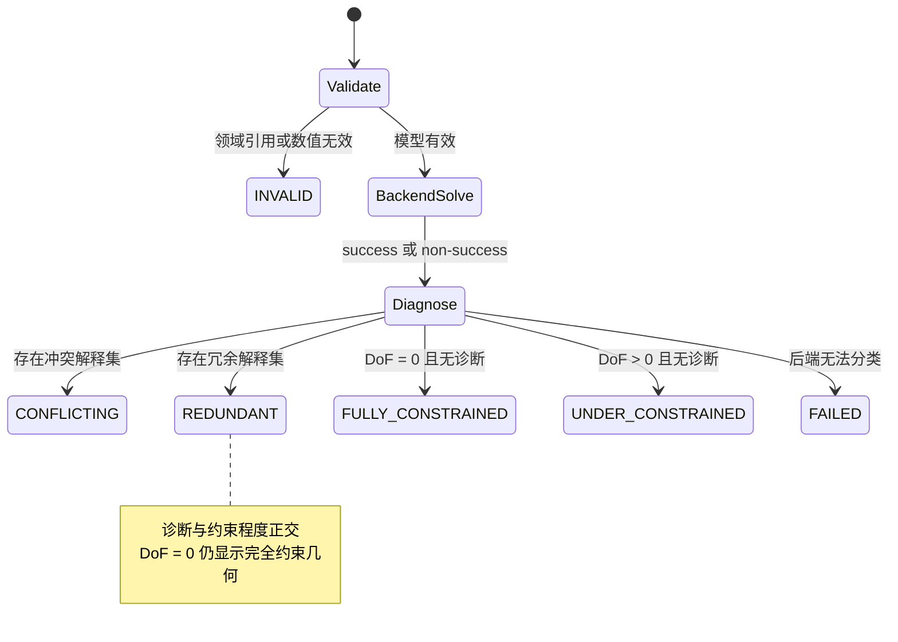

# Part、Sketch 与权威求值

> 2026-09-21 文档核对基线。返回[当前架构目录](../../CURRENT_ARCHITECTURE.md)。这里只记录实现事实；测试存在不等于本轮已经运行，验证缺口见[统一路线](../../../plans/README.md)。

Part 中的 `SKETCH` Feature 保存版本化 `SketchFeature v2`：Datum/PLANAR_FACE support、具有稳定 ID 的 Point/Line/Circle/Arc/Spline、独立 ExternalGeometry、显式 GeometryRef、Constraint 和最近一次权威 solve 状态。线段、圆弧和开放曲线持有可稳定引用的端点；端点相接必须由 Coincident 明确表达，不能以浮点坐标接近替代模型关系。

## 草图模型与求解

Geometry Worker 内的项目自有 `SketchSolver` 已通过 `SolveSketch` 粗粒度 RPC 接入提交链，PlaneGCS 只存在于适配层内部。当前支持 Coincident、Parallel、Fixed、Horizontal、Vertical、Perpendicular、Tangent、Equal、Distance、Length、Radius、Angle、Concentric、PointOnObject、Midpoint 和 Symmetry。Geometry client 是唯一协议适配边界：Worker 的历史 `SOLVED`/`INVALID_MODEL` 名称在此归一为平台 `FULLY_CONSTRAINED`/`INVALID`，PlaneGCS 整数返回码不会进入服务、Revision 或用户错误。求解结果把约束程度 `FULLY_CONSTRAINED / UNDER_CONSTRAINED / UNRESOLVED` 与诊断 `REDUNDANT / CONFLICTING` 正交保存；零 DoF 的闭包即使存在冗余，几何仍显示完全约束色，只有冗余约束本身显示诊断色。宏生成的 `internal` 约束仍参与求解和冲突诊断，但其纯冗余项不阻止整个原子宏提交；用户显式添加的无关冗余约束报告 REDUNDANT。Symmetry 支持“点—直线—点”的轴对称及“点—点—点”的中心对称；当其基于内置 U/V 轴且一个方程已被同一线段的 Horizontal/Vertical/对应轴 Parallel 隐含时，适配层保留复合设计意图。当前 `Spline` 命令把采集点解释为必须经过的拟合点；尚未接入完整样条相切/曲率约束。Web 预览是瞬态状态；`EDIT_SKETCH` 提交后服务端求解结果才进入不可变 Revision。

PlaneGCS 适配器按 `DogLeg → Levenberg-Marquardt → BFGS` 执行确定性收敛回退；只有三种算法都失败且诊断不能产生冲突/冗余解释集时才返回平台 `FAILED`。`diagnose()` 会为冗余分析临时求解 reduced systems 并恢复 parameter reference，因此完整系统的 `applySolution()` 必须在诊断结束后执行；否则含 internal 冗余的六边形会让之后其他连通分量的约束看似提交成功却保存旧坐标。仓库保存了真实 XZ“圆弧闭包 + 内置 U 轴角度”以及“六边形 + 后建直线/Spline 分量”的数值回归。

## Profile 与 Feature

OCCT-free Profile Builder 排除 Construction/Point，以 Coincident 等价类构建 Line/Arc/开放 Spline 端点图，并把 Circle/闭合 Spline 作为闭环；它拒绝开放端、T-junction、重叠/相交和自交，确定性遍历环，按包含深度区分外环、孔和岛，并生成稳定 ProfileLoop/ProfileRegion identity。实体求值采用两阶段协议：`LINEAR_EXTRUDE` 或 `REVOLVE` 先从 ProfileRegion 产生临时 Tool Shape，再以 `NEW_BODY / ADD / REMOVE / INTERSECT` 对当前 Body 执行采用、Fuse、Cut 或 Common。OCCT 适配层对空结果、无材料变化、无效 B-Rep 和非单一连通 Solid 给出稳定领域诊断；连续拉伸不再各自产生互相穿透但未合并的实体。旋转轴使用稳定引用，可指向任意 Sketch Line（包括 Profile/Construction 及其他草图中的直线）、AxisSystem 的 X/Y/Z 方向或 DatumAxis；三维参考轴必须位于轮廓草图的支撑平面，服务端将其投影到草图局部框架后再交给 Worker，不能静默使用与轮廓异面的轴。旋转面板作为选择收集器保持打开并等待用户拾取直线或轴；角度、轴引用和反向意图进入 Feature 与求值 digest。当前仍是单 Body、整张 Sketch profile selection，尚未提供区域点选、多 Body 或 merge scope。

## 支撑与外部几何

Sketch support 不再由 `XY/XZ/YZ` 字符串隐式决定坐标。默认平面和用户创建的基准面保存 `origin + normal + uDirection` 右手坐标框架；`PLANAR_FACE` support 保存上游 Face 的 PersistentSelection、source Revision、origin/X direction/normal、定向规则和 dependency snapshot。提交前控制面先对草图之前的完整 body prefix 求值，再以 semantic topology history 解析当前平面，采用最终实体面的有向法向并把保存的 X direction 投影到新平面（不再为了保持旧符号而翻转新法向）；缺失、歧义、类型变化和非法顺序以顶层 `FAILED_SUPPORT` 及具体 diagnostic 拒绝候选 Revision、保留旧 Head，且不会静默退回默认平面。Visualization、拾取、Sketch 编辑和 Worker Profile 构造共享同一支撑框架，依赖图显式串联顺序 body tip，并以 `READ_GEOMETRY` 连接 DatumPlane、以 `READ_TOPOLOGY` 连接面支撑与其直接上游 body tip。`CREATE_DATUM_PLANE` 与 `CREATE_DATUM_AXIS` 继续具有稳定 identity、结构树投影、显示/选择和 Undo/Redo PropertySlot。

ExternalGeometry 与普通 Sketch Entity 分开持久化。每项保存稳定 ExternalId、Edge/Vertex PersistentSelection、source Revision、`ORTHOGONAL` projection kind、resolved source digest、dependency snapshot 和 Worker 生成的二维 Point/Line/Circle snapshot；Constraint 通过 `EXTERNAL + ExternalId + stable sub-element` 引用它。控制面固定按 naming resolver → Worker projection → Sketch solve → downstream Feature 顺序处理，求解边界把外部几何作为内部 fixed geometry 输入 PlaneGCS，但不会把求解结果写回它。`DETACH_EXTERNAL_GEOMETRY` 将当前已连接 snapshot 原子冻结为同 ID 的普通 Construction Entity 并改写引用；Reconnect 只替换 PersistentSelection，保留 ExternalId。显式 ADD/RECONNECT 若无法完成权威投影，会以 `EXTERNAL_GEOMETRY_PROJECTION` 阶段和 Worker 稳定诊断原子拒绝，旧 Head 不变；只有先前已连接的来源因上游更新而缺失、歧义、类型变化或投影退化时，才清除旧 snapshot、列出受影响 constraint/profile/downstream Feature 并提交可检查、可 Reconnect 的 FAILED Revision。FAILED Revision 不得把 dependency snapshot 的上游 prefix geometry key 冒充自己的最终制品；读取时只生成与当前模型 Manifest 匹配的诊断可视化，因此失败状态仍可继续检查和编辑。当前圆 Edge 投影只覆盖完整圆；部分圆弧缺少起始方向和有向 sweep evidence，明确返回 `EXTERNAL_PROJECTION_TYPE_UNSUPPORTED`，Arc snapshot 属于[投影支线](../../../plans/sketch-projection.md)。

草图编辑的 ChangeSet 以最终写入 Revision 的求解后 `sketch.model` 为准，而不是命令处理器产生的求解前候选值；历史投影层能够独立读取和回写该稳定属性槽。Undo/Redo 对持久 ChangeSet 先验证稳定 write-set 的 target/slot 唯一性，再从原事务不可变的 base/result Revision 重建实际 before/after 和 digest，最后执行当前值冲突检查；因此旧版本中已写入错误 digest 的求解后草图事务也能修复并回滚，但不会信任旧 ChangeSet 内容或放宽并发冲突检查。PlaneGCS 改写坐标、DoF 或诊断后，补偿和重放不会再产生候选值与 Revision 的 digest 冲突。

GeometryId 是精确 Body B-Rep 的 SHA-256 内容标识，不绑定 Worker；`geometry_key` 标识带 evaluator 和 Part 显示语义的求值结果，因此两个结果可以共享 GeometryId，但拥有不同的可视化制品。几何输出包括 B-Rep、GLB、三角形、边折线、包围盒、拓扑计数和体积。新增几何已接入本地制品对象；历史表结构仍保留部分内联数据字段。Body 的 ADD/REMOVE/INTERSECT 在 OCCT 布尔完成后统一同域面和同域边，再进行 B-Rep 校验和内容寻址；因此相交且等高的拉伸不会把连续顶面暴露成多个共面选择区域。

命名、history 和完整 Shape gate 见[持久命名](persistent-naming.md)；Revolve/Import 未声明完整 naming，不得作为已完整支持的持久拓扑来源。

几何驻留按不可变 GeometryKey/GeometryId 路由，详见[Router 与制品](jobs-artifacts.md)。

活动 Sketch 的原点和 U/V 轴是稳定的内置 GeometryRef，而不是临时渲染对象：原点参与点类签名，U/V 轴参与直线/求解曲线签名，因此 Coincident、Parallel、Perpendicular、Tangent、PointOnObject、Angle、Symmetry 和点线 Distance 共用同一选择与服务端验证语义。线性尺寸当前覆盖线长、点点距离和点到直线/U/V 轴距离。圆与圆弧中心、圆弧和开放 Spline 端点均作为独立点标记显示和拾取；Line、Arc、Polyline、Spline、Rectangle 与独立 Point 命中已有稳定点时，会在同一原子编辑中写入显式 Coincident。结构树双击 Sketch 直接进入该 Sketch 的编辑上下文。

Sketch Entity 的 `PROFILE`/`CONSTRUCTION` role 是持久领域状态。结构树右键可在“轮廓元素/构造元素”之间切换，操作形成普通 `EDIT_SKETCH` Transaction，经过权威求解、最终 ChangeSet 和 Undo/Redo；Profile Builder 只消费 `PROFILE`，因此构造线、构造曲线和构造点不会进入 Pad。活动 Sketch 的 U/V 轴与原点采用相同的参考几何语义，但不作为可写 Sketch Entity 持久化。权威 VisualizationManifest 为 Circle/Arc 生成中心点、为 Arc 生成端点、为 Spline 生成全部拟合点；Select 工具拖动 Arc/Circle 中心或 Spline 拟合点时只显示瞬态点预览，并在 pointerup 提交一次 `UPDATE_ENTITY_POINT`。

Part 交互在退出 Sketcher 后把选择提升为整个 Sketch Feature，并保持未被实体特征消费的草图可见；已消费 profile 仅在重新编辑时临时显示。视图区在 Sketcher 外命中草图点、线或约束时同样投影到整个草图，因此可以直接继续 Pad/Pocket/Revolve。新建实体特征成功后自动选择结果 Feature，保持“选平面→建草图→绘制→退出→拉伸”的连续操作链。

### PlaneGCS 技术验证边界

- 上游锁定 FreeCAD `1.0.2` commit `256fc7eff3379911ab5daf88e10182c509aa8052`；该版本原生满足仓库 C++17 基线，未为引入求解器升级全仓语言标准；
- 构建仅从 FreeCAD 官方仓库获取审计清单内的 PlaneGCS 源文件、必要支持头和许可证，每个文件都有 SHA-256 校验，不下载/链接 FreeCAD App、GUI 或 Python；
- PlaneGCS 编译为独立 `liboccccad_planegcs.so`，Eigen 3.4.0 与 header-only Boost 1.86.0 由 Conan 显式提供；FreeCAD 配置与日志依赖由 Worker 内窄兼容头隔离；
- Geometry Worker 持有项目自有 `SketchSolver`，业务头文件不暴露 `GCS::*`。构建目录同时输出 `LICENSE.FreeCAD-PlaneGCS`；
- 当前测试验证 Rectangle 宏求解、未知引用失败、Circle Radius + Line Tangent、Profile 外环/孔、Arc + Line 混合闭环、开放/T-junction 诊断，以及 OCCT 圆环 Pad 的体积和有效拓扑。Sketch 实体与约束支持持久抑制：被抑制项保留稳定身份，但退出 Solver、Profile、Pad 与 VisualizationManifest；实体抑制会同时抑制引用它的约束。服务端按约束引用图拆分连通闭包并分别求解，向 Web 投影组件级 status/DoF、冲突集与冗余集。拖拽 RPC、完整 B-Spline 曲率约束和大规模 corpus conformance 仍属于后续工作。

### Geometry Worker 真实 RPC

| RPC | 当前状态 | 说明 |
|---|---|---|
| `Ping` | 已实现 | 健康与 resident 数量 |
| `EvaluatePart` | 已实现 | ProfileRegion/孔环 Pad 链、基础 B-Rep；Profile Pad 强制稳定 Feature/Body/source identity 与 naming policy，回传逐 Feature semantic outputs/TopologyHistory，并输出不可变 topology manifest artifact；保留旧矩形字段作为当前开发期过渡入口 |
| `SolveSketch` | 已实现 | GeometryPool Router 转发到 Worker，执行 SketchModel v2 的权威 PlaneGCS 求解与诊断 |
| `ProjectExternalGeometry` | 已实现 | Router 转发 Edge/Vertex evidence 与 support frame，Worker 权威生成 Point/Line/Circle 投影及稳定失败诊断 |
| `InspectExchange` | 已实现 | 读取 STEP/BREP 制品清单，判定 Part 或可并行根组件 Product |
| `ImportExchange` | 已实现 | 从 ArtifactReference 导入一个 STEP 根或 BREP，输出 B-Rep/GLB 制品引用 |
| `ExportExchange` | 已实现 | 将一个或多个带放置的 B-Rep 制品合成为 STEP/BREP |
| `GetTopology` | 已实现 | 拓扑摘要与属性；同一 GeometryId 的完整拓扑分析在 Worker 内只计算一次 |
| `LoadGeometry` / `UnloadGeometry` | 仅 Proto 声明 | 服务未覆盖，返回 `UNIMPLEMENTED` |
| `Tessellate` | 仅 Proto 声明 | 服务未覆盖 |
| `CreateChamfer` / `CreateFillet` | 仅 Proto 声明 | 服务未覆盖 |

这里特意区分“契约占位”和“已实现”，避免客户端基于 Proto 误判能力。

## 实现与验证入口

- [Part 关联测试](../../../services/internal/workspace/associative_design_test.go)
- [Profile corpus](../../../services/internal/workspace/profile_builder_test.go)
- [Worker 协议](../../../proto/occccad/worker/v1/geometry_worker.proto)
- [OCCT corpus](../../../kernel/occt/tests/geometry_exchange_scenarios.cpp)

平面 Face 的 `normal` 与 SelectionEvidence.direction 均包含 OCCT Face Orientation：有效闭合 Solid 指向材料外部，凹腔壁指向空腔；`xDirection × yDirection = normal`。拓扑 history 的 Face 身份匹配忽略 Orientation，因此生成证据前必须取最终 Solid 中的 Face occurrence，不能沿用 Prism/Boolean 工具面的朝向。面上新建草图从精确 B-Rep 读取有向法向，持久引用仍使用原 manifest evidence，已存在的源制品也能正确建立草图框架。Part evaluator 已更新为 `part-solid-generators-v12-oriented-face-normal`，重新求值不复用旧几何求值缓存；不重写历史 Revision 或源拓扑证据。
