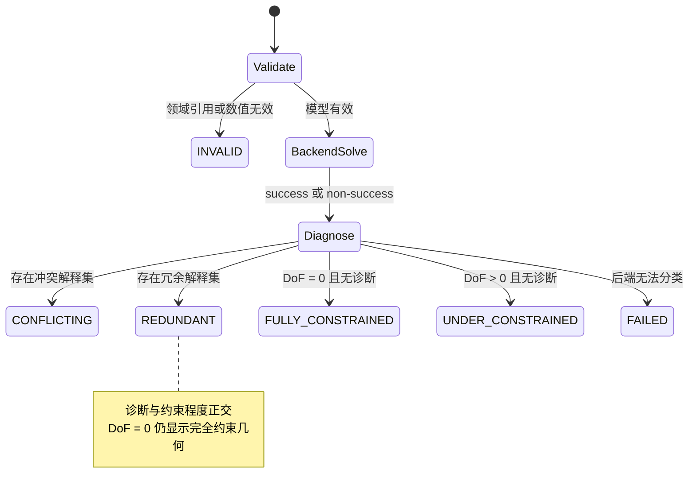

# Part、Sketch 与权威求值

> 返回[当前架构目录](../../CURRENT_ARCHITECTURE.md)。代码和测试定义当前事实；验证范围见[验证说明](validation.md)。

Part 中的 `SKETCH` Feature 保存版本化 `SketchFeature v2`：Datum/PLANAR_FACE support、具有稳定 ID 的 Point/Line/Circle/Arc/Ellipse/EllipticalArc/Spline、独立 ExternalGeometry、显式 GeometryRef、Constraint 和最近一次权威 solve 状态。线段、圆弧和开放曲线持有可稳定引用的端点；端点相接必须由 Coincident 明确表达，不能以浮点坐标接近替代模型关系。

## Part 与 Body

Part Revision 的 `model_json` 保存显式 `bodies[]`、`activeBodyId` 和带 `bodyId/order` 的 Feature。Body 保存稳定 ID、名称、显隐、顺序和本 Revision 的派生 `geometryKey`；Part 不再有唯一最终 Geometry，`document_versions.geometry_key` 已移除。空 Part 初始包含 Body.1，也可以删除全部 Body 后重新创建。Body/Feature 的顺序随历史恢复，不能用恢复时的 map 遍历顺序决定求值链。

`CREATE_BODY / DELETE_BODY / RENAME_BODY / SET_ACTIVE_BODY / SET_DEFINITION_VISIBILITY` 经现有 realtime Domain Command、ChangeSet、CAS 和 Undo/Redo 执行。普通 ADD/REMOVE/INTERSECT 始终作用于指定 Body；未指定目标的实体命令默认使用其 Sketch 所属 Body。`NEW_BODY` 原子创建恰好一个 Body 并将生成 Feature 归入该 Body，链内记录 ADD。一个 Body 的有效结果可包含多个 Solid；普通 ADD 不因不连通而改变 Body 身份。Preview 与提交使用同一归属规则。已有 Feature 编辑保持其 Body 归属，不因编辑重分配持久身份。删除 Body 同时删除其 Feature/参数；跨 Body profile 依赖禁止悬空删除。

工作台在会话中可显式指定当前工作 Body；实体 Feature 表单在打开时固定目标 `bodyId`，Preview 和提交共用这一值，不受之后工作 Body 切换影响。Preview 返回最终 `resultBodyId/resultBodyName/bodyAssignment`，仅区分既有目标 Body 和显式 `NEW_BODY`。保存的 `activeBodyId` 仍可供旧命令作为默认值；已有 Revision 加载时不重分配 Body。

建模树只把 Body 作为建模历史与独立求值单元、Feature 作为设计步骤；Solid 是几何结果，不自动成为业务树节点。未使用 Sketch 留在所属 Body；同 Body 单个生成 Feature 消费时可以收纳为其输入；多次或跨 Body 使用时保留唯一 Sketch 定义和只读输入引用入口。树上的收纳不改变 `Feature.BodyID`、`Profile`、求值顺序或删除依赖验证；当前没有从树入口单独移除 Profile 关系的命令。

由实体 Feature 创建的 Body 保存 `createdByFeatureId`，删除该 Feature 时同一 ChangeSet 删除对应 Body 并调整 Active Body，独立 profile Sketch 保留；若 Body 内还有其他 Feature，先拒绝删除以避免静默丢失后续操作。创建、删除及其 Undo/Redo 同时恢复 Feature、Body、参数及独立制品引用。属性面板只展示信息与文件下载，业务编辑经正式命令执行。

协调器为每个 Body 构建独立 Feature chain，只附带其实际引用的 Sketch profile/轴输入。Body 独立求值、Naming 和缓存；未变化的输入命中原有 Geometry/Artifact。草图支撑和外部投影按 PersistentSelection 的 SourceBodyId 求值对应前缀。同 Part 的跨 Body Boolean 使用明确的 Feature 输出阶段；实体能力和边界见[实体 Feature](solid-features.md)。当前没有 Body local transform 或跨文档 Boolean。所有 Body 的几何坐标均为 Part-local。

不可变 Revision 保存 Body → GeometryKey，继续复用 `geometry_artifacts/geometry_representations`；完整 BREP、Visual、Naming 在 ArtifactStore。每个实体 Body 独立拥有三类制品，空 Body/仅草图 Body 只有可用的 Visual，不伪造空实体 Naming。ContextVariant 和 ProductRelease 同样保存 Body 结果列表。STEP Definition 导入仍是一个 Part/一个 Body；多 Body Part 导出时只在交换阶段将各 BREP 组合为同一个 Part Definition，不生成新的 Part 级持久制品。

## 草图模型与求解

Geometry Worker 内的项目自有 `SketchSolver` 已通过 `SolveSketch` 粗粒度 RPC 接入提交链，PlaneGCS 只存在于适配层内部。当前支持 Coincident、H/V、Parallel、Perpendicular、Collinear、Fixed/FixedPoint、按精确类型限制的 Tangent/Equal/Concentric/PointOnObject、Midpoint/Symmetry，驱动 Distance、signed H/V Distance、Length、Radius/Diameter、Angle、Major/Minor Radius，以及生成操作的 MIRROR/SAME_SUPPORT 关系。Geometry client 是唯一协议适配边界：Worker 的历史 `SOLVED`/`INVALID_MODEL` 名称在此归一为平台 `FULLY_CONSTRAINED`/`INVALID`，PlaneGCS 整数返回码不会进入服务、Revision 或用户错误。求解结果把约束程度 `FULLY_CONSTRAINED / UNDER_CONSTRAINED / UNRESOLVED` 与诊断 `REDUNDANT / CONFLICTING` 正交保存；零 DoF 的闭包即使存在冗余，几何仍显示完全约束色，只有冗余约束本身显示诊断色。宏生成的 `internal` 约束仍参与求解和冲突诊断，但其纯冗余项不阻止整个原子宏提交；用户显式添加的无关冗余约束报告 REDUNDANT。Symmetry 支持“点—直线—点”的轴对称及“点—点—点”的中心对称；当其基于内置 U/V 轴且一个方程已被同一线段的 Horizontal/Vertical/对应轴 Parallel 隐含时，适配层保留复合设计意图。Spline 显式区分 FIT 插值通过点与 CONTROL 控制极点。FIT 的 `controlPoints` 历史字段仍表示拟合点，`controlPointIds` 是其稳定身份；CONTROL 使用 `poles/poleIds`。权威 OCCT 返回非周期 clamped rational B-Spline 的实际 degree、唯一 knots、multiplicities、weights 和参数域，显示及 Profile 消费该 canonical 曲线。FIT 点移动/插入/删除后重新插值；CONTROL 点移动保留 basis，增加/删除通过合法 knot insertion/removal，后者通过齐次系数逆操作一致性验证，不重拟合采样点。改变 basis 时失去唯一对应的点引用须显式释放；保持的点身份不随数组插入变化。FIT 转 CONTROL 是正式操作，保留拟合来源和精确 canonical 曲线；开闭操作不承诺闭合接缝的切向连续。完整样条曲率/G2/G3 约束未交付。Web 预览是瞬态状态；`EDIT_SKETCH` 提交后服务端求解结果才进入不可变 Revision。

`CREATE_POLYGON` 生成普通边、构造圆和正式内部约束。内接圆模式中，偶数边的等长相切多边形额外用构造半径连接圆心与第一边中点，并约束半径垂直该边，消除交替切线长度自由度；省去由闭合隐含的最后一项等长。奇数边的等长相切关系已隐含中点切触，不重复添加方程。辅助半径不参与 Profile，和整体创建共用稳定操作来源及原子历史。

进入草图会原子清空浏览选择与候选，支撑面不成为下一条草图命令的预选。样条绘制、编辑预览及持久显示共用屏幕像素点标记；CONTROL 额外显示控制多边形，FIT 只显示拟合点。自动点捕获及显式点拾取保留 `controlPointId`，不会将控制极点误当成曲线上的采样点；禁用点捕获不禁用显式编辑拾取。Select 拖动样条点沿冻结手势基线计算目标，再捕获其它可见草图元素；排除被编辑样条自身和网格，Alt 暂时跳过捕获。捕获位置预览不隐式建立新的 Coincident。

```mermaid
stateDiagram-v2
    [*] --> Validate
    Validate --> INVALID: 领域引用或数值无效
    Validate --> BackendSolve: 模型有效
    BackendSolve --> Diagnose: success 或 non-success
    Diagnose --> CONFLICTING: 存在冲突解释集
    Diagnose --> REDUNDANT: 存在冗余解释集
    Diagnose --> FULLY_CONSTRAINED: DoF = 0 且无诊断
    Diagnose --> UNDER_CONSTRAINED: DoF > 0 且无诊断
    Diagnose --> FAILED: 后端无法分类
    note right of REDUNDANT
      诊断与约束程度正交
      DoF = 0 仍显示完全约束几何
    end note
```

PlaneGCS 适配器按 `DogLeg → Levenberg-Marquardt → BFGS` 执行确定性收敛回退；只有三种算法都失败且诊断不能产生冲突/冗余解释集时才返回平台 `FAILED`。`diagnose()` 会为冗余分析临时求解 reduced systems 并恢复 parameter reference，因此完整系统的 `applySolution()` 必须在诊断结束后执行；否则含 internal 冗余的六边形会让之后其他连通分量的约束看似提交成功却保存旧坐标。仓库保存了真实 XZ“圆弧闭包 + 内置 U 轴角度”以及“六边形 + 后建直线/Spline 分量”的数值回归。

大步线长或真实两线间距编辑若局部数值求解失败，适配器可在同一 PlaneGCS 内以最多 16 个渐进目标取得初值；仅使用已通过残差验证的结果推进，最终恢复原始目标并完整诊断，不增加固定或修改持久约束。该路径仅识别正式长度/整线间距角色，不混用端点距离。SolveSketch RPC 上限为 15 秒，其它计算接口不变；保留原圆弧有向范围的周期表达，求解不能将四分之一弧变成互补大弧。

普通逻辑约束的定义编辑保留 ConstraintId，可以原子替换逻辑种类、引用及停用状态；不跨越逻辑/尺寸类型，也不改变内部生成关系归属。生成关系更改引用需其操作的显式影响策略；关联镜像可以替换轴但不偷换来源/目标。删除单尺寸只删除其 managed 参数，保留可见支持逻辑关系；存在表达式下游读时原子拒绝。删除 MIRROR 明确解除关联并保留几何和正式连接；其他内部关系独立删除需显式释放。

尺寸保留稳定 ParameterId、Quantity 与 checkedAST 绑定；默认别名为可读的种类编号。统一尺寸定义编辑将引用、值/表达式、名称、停用与驱动/参考模式放入一次 Domain Command。参考尺寸保留原驱动 Source，退出 Solver 与 DoF 计算，解后按当前精确几何重新测量；不可测的约束值和参数 EvaluatedValue 均为空。恢复驱动须显式选择原 Source 或当前测量，不覆盖公式。当前 evaluator 明确拒绝表达式读取参考尺寸，以免形成同一草图的测量—驱动反馈环。

本地 `OFFSET_ENTITIES` 生成独立 Line/Circle/Arc 精确副本，保留曲线种类、Construction role 及确定性来源/输出身份；支持单元素和由正式连接构成的适用连续链。正距离沿链方向左法向，独立完整圆按逆时针处理；MITER 使用解析支撑曲线交点，ROUND 使用真实圆弧和正式连接。圆/弧半径非正、非法短段、重叠和自交原子拒绝。不复制原驱动关系、不承诺持续偏移关联，也不把椭圆或任意样条的等距曲线折线化。原始几何、驱动尺寸和公式不因偏移创建被修改。

圆角/倒角的主长度参数若携带值或表达式 Source，控制面先按文档单位编译 checkedAST 并求值，再把毫米 Quantity 交给精确候选构造；持久尺寸保留该 Source/AST，而不是把前端预览值当成公式结果。非法维度、未解析依赖或非正长度原子拒绝。圆角点击仅确定支撑曲线及保留侧；连接相邻边使用主值扫掠的 minor 弧，不因点击远离角点生成互补的 270° major 弧。

周期 Circle/Ellipse 在两个位置分割时，参数接缝两侧合并为同一循环区间，产生两段真实曲线；任意参数接缝不是额外拓扑端点。删除命中模式在没有内部交点时删除整条命中曲线，保留命中/仅打断须有适用分割区间。编辑按稳定端点和正式关系报告用户引用影响，不按最近端点重绑。删除一段 Circle/Arc 时，中心和半径/直径/同心引用只可迁移到正式 SAME_SUPPORT 关系证明的共享支撑曲线；端点和其它整体曲线引用仍须显式处理或拒绝，不能套用这种迁移。

分割拾取将屏幕阈值内的解析交点或已落在目标支撑上的稳定端点或独立点作为候选；预选单条曲线限制目标角色，避免交叉处换选其它曲线。提交的 `firstReference/secondReference` 由 Worker 精确交点或裁剪端点确认并落为 Coincident/PointOnObject；候选与坐标近似本身不产生模型连接。裁剪保留规范区间的原端点，非周期曲线仅允许跨语言端点表示的最多 8 ULP 归一化，真正越界仍拒绝。

Sketch Move/Rotate/Copy 共用现有 manipulator 的平面模式、屏幕缩放与冻结手势基线。选集由工具持有，手柄和派生几何挂统一只读 preview layer；中心只编辑操作基点，释放一次提交原有 Transform/Copy command。失败恢复手柄，未知结果沿原 request/base version 查询；不改装配求解合同、不解除驱动关系以让变换成功。

## Profile 与 Feature

Profile Builder 排除 Construction/Point，以正式连接等价类构建 Line/Arc/EllipticalArc/开放 Spline 端点图，并把 Circle/Ellipse/闭合 Spline 作为闭环；拓扑遍历拒绝开放端/T-junction，生成循环序列和反向无关的稳定 ProfileLoop identity。生产 Extrude 和 GetDocument 通过 `buildProfileLoops(feature,true)` 只按正式连接构建环，然后向 Worker `ComputeSketchCurves PROFILE` 提交同一组真实曲线，由 OCCT 精确分类外环/孔/岛及验证交叉、重叠和退化；不使用显示采样多边形作为权威区域。OCCT 分类保留输入环原有方向，孔环反向以该原方向为基准，不依赖构造临时面时内核可能调整的方向。ProfileRegion identity 基于外环身份。旧近似多边形 helper 仅用于局部测试/预览。实体求值采用两阶段协议：`LINEAR_EXTRUDE` 或 `REVOLVE` 先从 ProfileRegion 产生临时 Tool Shape，再以 `NEW_BODY / ADD / REMOVE / INTERSECT` 对指定 Body 执行采用、Fuse、Cut 或 Common。OCCT 适配层对空结果、无材料变化、无效 B-Rep 和游离拓扑给出领域诊断；有效多 Solid 结果保留在同一 Body；连续拉伸不再各自产生互相穿透但未合并的实体。旋转轴使用稳定引用，可指向任意 Sketch Line（包括 Profile/Construction 及其他草图中的直线）、AxisSystem 的 X/Y/Z 方向或 DatumAxis；三维参考轴必须位于轮廓草图的支撑平面，服务端将其投影到草图局部框架后再交给 Worker，不能静默使用与轮廓异面的轴。旋转面板作为选择收集器保持打开并等待用户拾取直线或轴；角度、轴引用和反向意图进入 Feature 与求值 digest。当前支持独立多 Body，仍使用整张 Sketch profile selection，尚未提供区域点选；跨 Body 组合通过独立 Boolean Feature 明确工具输出阶段。

## 支撑与外部几何

基准面/轴的创建面板可自由设置中心/原点、法向/方向，或复制同一编辑上下文的标准/自定义基准。基准面也可从实体平面复制，以精确面的面积中心和方向初始化。复制保存明确框架，不产生关联偏置依赖；参数修改仅更新本地几何预览，确认才提交一次创建命令。服务端验证有限坐标、非零方向和正交框架并归一化。自定义轴显示原点标记和正方向实线箭头，属性展示原点及方向；自定义面/轴支持正式删除和补偿，标准基准和被引用的自定义基准受保护。

Sketch support 不再由 `XY/XZ/YZ` 字符串隐式决定坐标。默认平面和用户创建的基准面保存 `origin + normal + uDirection` 右手坐标框架；`PLANAR_FACE` support 保存上游 Face 的 PersistentSelection、source Revision、origin/X direction/normal、定向规则和 dependency snapshot。提交前控制面先对草图之前的完整 body prefix 求值，再以 semantic topology history 解析当前平面，采用最终实体面的有向法向并把保存的 X direction 投影到新平面（不再为了保持旧符号而翻转新法向）；缺失、歧义、类型变化和非法顺序以顶层 `FAILED_SUPPORT` 及具体 diagnostic 拒绝候选 Revision、保留旧 Head，且不会静默退回默认平面。Visualization、拾取、Sketch 编辑和 Worker Profile 构造共享同一支撑框架，依赖图显式串联顺序 body tip，并以 `READ_GEOMETRY` 连接 DatumPlane、以 `READ_TOPOLOGY` 连接面支撑与其直接上游 body tip。`CREATE_DATUM_PLANE` 与 `CREATE_DATUM_AXIS` 继续具有稳定 identity、结构树投影、显示/选择和 Undo/Redo PropertySlot。

ExternalGeometry 与普通 Sketch Entity 分开持久化。每项保存稳定 ExternalId、Edge/Vertex PersistentSelection、source Revision、`ORTHOGONAL` projection kind、resolved source digest、dependency snapshot 和 Worker 生成的二维 Point/Line/Circle snapshot；Constraint 通过 `EXTERNAL + ExternalId + stable sub-element` 引用它。控制面固定按 naming resolver → Worker projection → Sketch solve → downstream Feature 顺序处理，求解边界把外部几何作为内部 fixed geometry 输入 PlaneGCS，但不会把求解结果写回它。`DETACH_EXTERNAL_GEOMETRY` 将当前已连接 snapshot 原子冻结为同 ID 的普通 Construction Entity 并改写引用；Reconnect 只替换 PersistentSelection，保留 ExternalId。显式 ADD/RECONNECT 若无法完成权威投影，会以 `EXTERNAL_GEOMETRY_PROJECTION` 阶段和 Worker 稳定诊断原子拒绝，旧 Head 不变；只有先前已连接的来源因上游更新而缺失、歧义、类型变化或投影退化时，才清除旧 snapshot、列出受影响 constraint/profile/downstream Feature 并提交可检查、可 Reconnect 的 FAILED Revision。FAILED Revision 不得把 dependency snapshot 的上游 prefix geometry key 冒充自己的最终制品；读取时只生成与当前模型 Manifest 匹配的诊断可视化，因此失败状态仍可继续检查和编辑。当前圆 Edge 投影只覆盖完整圆；部分圆弧缺少起始方向和有向 sweep evidence，明确返回 `EXTERNAL_PROJECTION_TYPE_UNSUPPORTED`，Arc snapshot 属于[投影支线](../target/sketch-projection.md)。

草图编辑的 ChangeSet 以最终写入 Revision 的求解后 `sketch.model` 为准，而不是命令处理器产生的求解前候选值；历史投影层能够独立读取和回写该稳定属性槽。Undo/Redo 对持久 ChangeSet 先验证稳定 write-set 的 target/slot 唯一性，再从原事务不可变的 base/result Revision 重建实际 before/after 和 digest，最后执行当前值冲突检查；因此旧版本中已写入错误 digest 的求解后草图事务也能修复并回滚，但不会信任旧 ChangeSet 内容或放宽并发冲突检查。PlaneGCS 改写坐标、DoF 或诊断后，补偿和重放不会再产生候选值与 Revision 的 digest 冲突。

GeometryId 是精确 Body B-Rep 的 SHA-256 内容标识，不绑定 Worker；`geometry_key` 标识带 evaluator 策略和可视化几何内容的求值结果；纯显隐元数据及可读名称不进入该键，因此两个结果可以共享 GeometryId，但拥有不同的可视化制品。几何输出包括 B-Rep、GLB、三角形、边折线、包围盒、拓扑计数和体积。几何大数据仅保存在 ArtifactStore/S3；数据库保存轻量索引与摘要。Body 的 ADD/REMOVE/INTERSECT 在 OCCT 布尔完成后统一同域面和同域边，再进行 B-Rep 校验和内容寻址；因此相交且等高的拉伸不会把连续顶面暴露成多个共面选择区域。

命名、history 和完整 Shape gate 见[持久命名](persistent-naming.md)；Revolve/Import 未声明完整 naming，不得作为已完整支持的持久拓扑来源。

几何驻留按不可变 GeometryKey/GeometryId 路由，详见[Router 与制品](jobs-artifacts.md)。

活动 Sketch 的原点和 U/V 轴是稳定的内置 GeometryRef，而不是临时渲染对象：原点参与点类签名，U/V 轴参与直线/求解曲线签名，因此 Coincident、Parallel、Perpendicular、Tangent、PointOnObject、Angle、Symmetry 和点线 Distance 共用同一选择与服务端验证语义。线性尺寸覆盖线长、点点真实距离、点到无限支撑直线/U/V 轴距离、平行线间非负支撑线间距，以及有符号 ΔX/ΔY（第二引用减第一引用）。平行线间距使用可见 PARALLEL 关系，已有平行关系不重复创建；它不是有限线段最近距离。椭圆轴尺寸为主/次半轴的毫米值。圆与圆弧中心、圆弧和开放 Spline 端点均作为独立点标记显示和拾取；Line、Arc、Polyline、Spline、Rectangle 与独立 Point 命中已有稳定点时，会在同一原子编辑中写入显式 Coincident。结构树双击 Sketch 直接进入该 Sketch 的编辑上下文。

Sketch Entity 的 `PROFILE`/`CONSTRUCTION` role 是持久领域状态。结构树右键可在“轮廓元素/构造元素”之间切换，操作形成普通 `EDIT_SKETCH` Transaction，经过权威求解、最终 ChangeSet 和 Undo/Redo；Profile Builder 只消费 `PROFILE`，因此构造线、构造曲线和构造点不会进入 Pad。活动 Sketch 的 U/V 轴与原点采用相同的参考几何语义，但不作为可写 Sketch Entity 持久化。权威 VisualizationManifest 为 Circle/Arc 生成中心点、为 Arc 生成端点、为 Spline 生成全部拟合点；Select 工具拖动 Arc/Circle 中心或 Spline 拟合点时只显示瞬态点预览，并在 pointerup 提交一次 `UPDATE_ENTITY_POINT`。

Part 交互在退出 Sketcher 后把选择提升为整个 Sketch Feature，并保持未被实体特征消费的草图可见；已消费 profile 仅在重新编辑时临时显示。视图区在 Sketcher 外命中草图点、线或约束时同样投影到整个草图，因此可以直接继续 Pad/Pocket/Revolve。新建实体特征成功后自动选择结果 Feature，保持“选平面→建草图→绘制→退出→拉伸”的连续操作链。

草图“移动”命令共用平移与旋转手柄，不再提供独立旋转命令。`DRAG_ENTITIES` 保存冻结基线上的绝对目标意图；控制面向现有 `SolveSketch` 传入临时坐标目标，PlaneGCS 用负 tag 的辅助目标在正式约束可行域内求解。目标不持久化为约束、不改变公式/尺寸定义、不扣减正式 DoF；固定、方向及跨选集连接允许限制目标或带动邻接几何。内部计算结果带源几何/约束摘要，提交验证稳定身份后经普通 ChangeSet、CAS 和 Undo/Redo。复制和显式刚性 `TRANSFORM_ENTITIES` 继续使用原有内部/跨选集约束合同。

移动预览单飞合并最新绝对目标，显示已求解的可见几何；松开手柄等待最终目标的只读候选，再原子提交一次。求解失败保留选集，未知提交结果沿原请求回执恢复。手柄中心只捕获可见草图元素，不计算背景网格吸附，也不覆盖绘图工具的吸附引用。Worker Proto 新增临时 `SketchModel.drag_targets`，服务端与 Worker 必须使用匹配构建；持久 Sketch 格式不变。

多边形创建以 `CREATE_POLYGON` 原子操作接收中心、参考圆半径、方向、3–50 整数边数及内接/外接模式。模式采用 Onshape 参考圆的命名：INSCRIBED 的边在圆外相切，CIRCUMSCRIBED 的顶点在圆上。控制面生成确定身份的普通线段与 Construction 圆，显式闭环 Coincident、Equal、Tangent/PointOnObject 保持其圆关系；中心吸附成为显式 Coincident。参数修改、Profile、拉伸及历史沿现有求解链，未新增特殊多边形实体类型。

### PlaneGCS 技术验证边界

- 上游锁定 FreeCAD `1.0.2` commit `256fc7eff3379911ab5daf88e10182c509aa8052`；该版本原生满足仓库 C++17 基线，未为引入求解器升级全仓语言标准；
- 构建仅从 FreeCAD 官方仓库获取审计清单内的 PlaneGCS 源文件、必要支持头和许可证，每个文件都有 SHA-256 校验，不下载/链接 FreeCAD App、GUI 或 Python；
- PlaneGCS 编译为独立 `liboccccad_planegcs.so`，Eigen 3.4.0 与 header-only Boost 1.86.0 由 Conan 显式提供；FreeCAD 配置与日志依赖由 Worker 内窄兼容头隔离；
- Geometry Worker 持有项目自有 `SketchSolver`，业务头文件不暴露 `GCS::*`。构建目录同时输出 `LICENSE.FreeCAD-PlaneGCS`；
- 当前测试验证 Rectangle 宏求解、未知引用失败、Circle Radius + Line Tangent、Profile 外环/孔、Arc + Line 混合闭环、开放/T-junction 诊断，以及 OCCT 圆环 Pad 的体积和有效拓扑。Sketch 实体与约束支持持久抑制：被抑制项保留稳定身份，但退出 Solver、Profile、Pad 与 VisualizationManifest；实体抑制会同时抑制引用它的约束。服务端按约束引用图拆分连通闭包并分别求解，向 Web 投影组件级 status/DoF、冲突集与冗余集。带约束拖动复用 `SolveSketch` 的临时目标，未新增会话 RPC；完整 B-Spline 曲率约束和大规模 corpus conformance 仍属于后续工作。

### Geometry Worker 真实 RPC

| RPC | 当前状态 | 说明 |
|---|---|---|
| `Ping` | 已实现 | 健康与 resident 数量 |
| `EvaluatePart` | 已实现 | ProfileRegion/孔环 Pad 链、基础 B-Rep；Profile Pad 强制稳定 Feature/Body/source identity 与 naming policy，按单 Body 求值链执行，回传摘要/ArtifactReference，完整 Naming 只写入该 Body 的制品 |
| `SolveSketch` | 已实现 | GeometryPool Router 转发到 Worker，执行 SketchModel v2 的权威 PlaneGCS 求解与诊断 |
| `ProjectExternalGeometry` | 已实现 | Router 转发 Edge/Vertex evidence 与 support frame，Worker 权威生成 Point/Line/Circle 投影及稳定失败诊断 |
| `InspectExchange` | 已实现 | 读取 STEP/BREP 制品清单，判定 Part 或可并行根组件 Product |
| `ImportExchange` | 已实现 | 从 ArtifactReference 导入一个 STEP 根或 BREP，输出 B-Rep/GLB 制品引用 |
| `ExportExchange` | 已实现 | 将一个或多个带放置的 B-Rep 制品合成为 STEP/BREP |
| `GetTopology` | 已实现 | 拓扑摘要与属性；同一 GeometryId 的完整拓扑分析在 Worker 内只计算一次 |
| `LoadGeometry` / `UnloadGeometry` | 仅 Proto 声明 | 服务未覆盖，返回 `UNIMPLEMENTED` |
| `Tessellate` | 仅 Proto 声明 | 服务未覆盖 |
| `CreateChamfer` / `CreateFillet` | 仅 Proto 声明 | 服务未覆盖 |

这里特意区分“契约占位”和“已实现”，避免客户端基于 Proto 误判能力。

DocumentView 的 `sketchAnalyses` 是统一 Profile Builder 的只读分析投影。开放端、分支、重复、退化和失效连接携带实体/引用/模型位置；Web 只展示后端分析，不另建闭合判定；仅 `geometryVerified=true` 的闭合结果显示检查通过，未精确验证的连通闭环明确显示等待验证。合法开放草图可以保存；封闭实体拉伸在消费 Profile 时拒绝开放边界。闭合状态与求解约束程度独立。功能支持组合及定向验证入口见[二维草图能力](../../sketch-capabilities.md)。

草图生产命令目录由增量迁移 `0031_sketch_workflow.sql` 加入统一编辑工具及更多创建/约束/尺寸入口，更新原工具帮助并移除 Slot；保留已应用迁移的 checksum，不重写旧目录迁移或建立旧 Slot 兼容命令。Mock 与真实目录消费同一 Web CommandRegistry 语义。

## 实现与验证入口

- [Part 关联测试](../../../services/internal/workspace/associative_design_test.go)
- [Profile corpus](../../../services/internal/workspace/profile_builder_test.go)
- [Worker 协议](../../../proto/occccad/worker/v1/geometry_worker.proto)
- [OCCT corpus](../../../kernel/occt/tests/geometry_exchange_scenarios.cpp)

平面 Face 的 `normal` 与 SelectionEvidence.direction 均包含 OCCT Face Orientation：有效闭合 Solid 指向材料外部，凹腔壁指向空腔；`xDirection × yDirection = normal`。拓扑 history 的 Face 身份匹配忽略 Orientation，因此生成证据前必须取最终 Solid 中的 Face occurrence，不能沿用 Prism/Boolean 工具面的朝向。面上新建草图从精确 B-Rep 读取有向法向，持久引用仍使用原 manifest evidence，已存在的源制品也能正确建立草图框架。Part evaluator 已更新为 `part-solid-generators-v12-oriented-face-normal`，重新求值不复用旧几何求值缓存；不重写历史 Revision 或源拓扑证据。

草图编辑工具可调用只读生产 Preview 路径：`EDIT_SKETCH` 候选通过同一领域验证和权威求解，响应中的 `sketchCandidates` 仅复制已求解实体和 Solve 状态，不能从操作输入或旧显示快照推导。预览不修改文档 Head、Revision、Undo/Redo 或应用数据；取消、过期版本和迟到结果只丢弃候选。Web 近似预览明确标识，精确求解候选与正式模型分开；操作选项、引用释放和最终采用仍通过正式命令。状态所有权和尺寸引用更换见[Web 架构](web.md)，定向验证见[草图交互补齐](../../sketch-ux-02.md)。

圆角/倒角裁剪子段由 SAME_SUPPORT 保持支撑，生成关系不重复添加 cut-point PointOnObject；相切引用实际连接的裁剪子段。线支撑已有端点 Coincident 时省略重复定位方程，保留模型关系。两侧内部相切圆角的局部/补弧分支翻转触发现有数值尺寸 continuation，禁止以补弧替代原圆角。自由延伸投影到 Line/Arc/EllipticalArc 的解析支撑，边界延伸继续使用 ComputeSketchCurves 精确交点并生成稳定连接。统一缩放停止支持，带 scale 的变换请求明确拒绝；已持久 Revision 的几何和历史不重写。

派生裁剪线的 SAME_SUPPORT 与平行关系使用 PlaneGCS 既有角度原语的最近平行/反平行分支，避免原生叉积方程通过坍缩边取得伪零残差；不增加固定或持久角度尺寸。有限范围、非退化和原有约束残差仍是提交校验。

## 草图关联阵列

`SketchFeature.patterns` 保存选定种子 EntityId 和与[实体/空间阵列](solid-features.md#参数化阵列)共用的分布定义。PlaneGCS 只求解种子；Profile 与显示消费解后派生成员，不复制成员驱动尺寸或 Fixed 约束。一个有效阵列最多派生 4096 个实体，同一源实体不能同时归属多个启用的草图内阵列。二维阵列必须保持草图平面。

`EDIT_SKETCH` 的 `CREATE_PATTERN / EDIT_PATTERN / DELETE_PATTERN / DETACH_PATTERN` 是原子领域操作，阵列参数拥有稳定 managed ParameterID。成员默认只读；`DETACH_PATTERN` 才生成独立几何并复制必要的 Coincident 连接，原种子转为 Construction。删除阵列恢复普通种子，不保留无关联成员。选中种子或任一派生成员执行 Delete、删除工具或框选删除时，`DELETE_ENTITIES` 在权威端归并为删除所属阵列定义；同阵列多成员只删除一次，混选普通几何仍正常删除。派生成员的 `sketchPatternMembers` 是 DocumentView 显示投影，不进入持久模型或求解自由度。

草图内阵列的中心保存当前草图原点、点、端点或圆心引用；线性方向保存当前草图 U/V 轴、直线或已连接的投影直线引用，并支持反向。引用只能来自当前草图及其投影快照，不直接引用世界轴或其他草图；视图区使用草图引用的 hover/选中反馈，中心辅助点不生成新几何。参数投影与种子求解后重新解析引用；不存在、已抑制或不在草图平面内的引用明确失败。阵列定义及只读派生几何进入结构树，定义支持编辑、抑制和删除，成员可拾取和高亮。成员约束颜色使用源几何所在求解分量，不受无关自由几何影响；独立修改仍需解除关联。

草图阵列新建时线性默认绑定 U 轴、圆周默认绑定草图原点。阵列通过既有草图引用选择器处理 hover 与按下确认，普通点/尺寸拖动和框选不接管指针；种子几何复用草图屏幕空间拾取。当前 hover 候选使用蓝色，已绑定的默认轴、原点或种子不以选中色遮盖候选；移出后恢复选中反馈。树删除通过 `DELETE_NODE / DELETE_NODES` 入口校验所属草图后进入同一原子删除逻辑。
