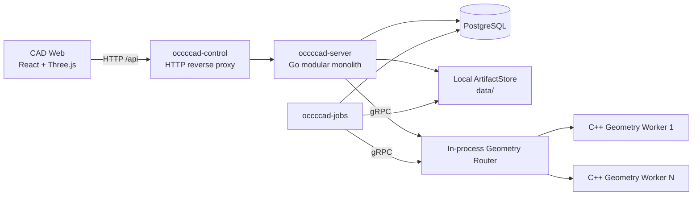
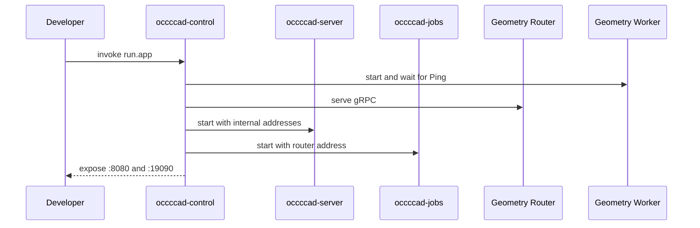

# 进程、部署与访问边界

> 2026-09-21 文档核对基线。返回[当前架构目录](../../CURRENT_ARCHITECTURE.md)。这里只记录实现事实；测试存在不等于本轮已经运行，验证缺口见[统一路线](../../../plans/README.md)。

当前 occccad 是一个“模块化业务单体 + 持久任务进程 + C++ 几何计算 Worker + 独立 Web 应用”的早期分布式垂直切片。HTTP/WebSocket、数据库、后台任务与几何计算已经跨进程，但调度仅限本机，制品仅限共享本地目录，因此还不是真正的跨主机云平台。

图中的 `/api` 浏览器入口同时承载普通 HTTP 与 `/api/realtime` WebSocket Upgrade。`occccad-control` 是可选的本地聚合入口；单独运行时，Web、API、Jobs 和 Geometry Worker 也可分别启动。

## 仓库与进程边界

| 路径/进程 | 技术 | 真实边界 |
|---|---|---|
| `web/apps/cad` | React/TypeScript/Three.js | 独立浏览器应用，可使用 Mock，或真实 REST + WebSocket API |
| `occccad-server` | Go/net/http | 身份、文档、ACL、版本、实时消息、任务提交和几何编排 |
| `occccad-jobs` | Go | PostgreSQL 任务消费者，无监听端口 |
| `occccad-migrate` | Go | 一次性数据库迁移任务 |
| `occccad-control` | Go HTTP/gRPC | 本地子进程管理、反向代理、Geometry Router、调试切流 |
| `occccad-monitor` | Go/Bubble Tea v2 | 只读 TUI；消费 Control 的版本化监控快照，不拥有采集或业务状态 |
| `workers/geometry` | C++/gRPC/OCCT | 精确几何、STEP、拓扑与显示制品计算 |
| `kernel/api` | C++ library | 不暴露 OCCT 类型的内核公共值类型和操作 |
| `kernel/assembly` | C++ library | 独立三维装配几何约束算法；由 Geometry Worker 的粗粒度 `SolveAssembly` RPC 调用 |
| `kernel/occt` | C++ library | OCCT 适配实现，只链接进 Geometry Worker |
| `services/internal/*` | Go packages | 上述 Go 进程共享的内部模块，不是网络服务 |

每个可运行单元的启动、配置和故障语义见其目录 README。本文聚焦它们组成的系统。

## 数据库执行边界

运行时数据库访问统一经进程内 `database.Pool`，复用 pgx 与有界 semaphore 调度。普通查询、结果流或完整事务作为一个调度单元，事务内语句不会重新排队；API 后台轮询使用独立等待预算和后台执行上限。数据库断连不提供离线提交，队列满或等待超时显式失败，写入不自动重试或提前返回成功。每个进程独立限流，连接数与等待容量需按部署进程数预算。配置、资源释放契约和观测说明见 [数据库层 README](../../../services/internal/database/README.md)。

监控四项统计通过单个 SQL 获取；文档列表的 Undo/Redo 能力复用单文档历史判定 SQL，按最多 128 条批量发送。普通命令、补偿历史和跨文档设计事务中的连续写入及 Product 实例投影也在原事务内分批发送，保持原锁/CAS 与原子提交边界。当前没有新增跨请求模型缓存、消息中间件或独立数据库代理。

## 当前启动拓扑

### 统一本地模式

`invoke run.app` 构建后启动 `occccad-control`。控制进程：

1. 在 `127.0.0.1:18080` 启动 API；
2. 启动一个 Jobs 进程；
3. 在 `127.0.0.1:51001` 提供 Geometry gRPC Router；
4. 从 `127.0.0.1:51100` 起启动至少一个 C++ Worker；
5. 在 `0.0.0.0:8080` 提供稳定 HTTP 代理入口；
6. 在 `127.0.0.1:19090` 提供无认证的本机 Control API。

`invoke run.app --reset-data` 在启动控制进程前运行受保护的开发重置：删除配置数据库中固定的 `occcad` schema，清空 `OCCCCAD_DATA_DIR` 对应的本地 ArtifactStore/暂存目录；S3 模式还清空当前配置专用桶中的全部对象、历史版本、删除标记和未完成分片（保留桶），再从嵌入迁移重建 schema。必须先停止写入进程；跨存储删除不具备原子回滚，失败后可修复并重跑。该命令只面向当前未发布开发数据；Router、Worker resident geometry 和其他进程内状态由新进程自然重建。

### 独立模式

- `invoke run.worker`：单独启动 Geometry Worker；
- `invoke run.server`：单独启动 API；
- `invoke run.jobs`：单独启动任务消费者；
- `invoke run.web`：Mock 前端；
- `invoke run.web --mode=api`：前端代理真实 API。

当前没有容器编排清单、服务发现、跨主机 Worker 注册、分布式租户配额或生产网关。

### 身份与访问控制

- 邮箱/密码登录与数据库会话 Cookie；
- 注册账号经管理员审批，平台角色为 `ADMIN` 或 `MEMBER`；
- 资源角色为 `OWNER`、`EDITOR`、`VIEWER`；
- 支持 User/Team、文件夹权限继承、文档/文件夹分享；
- API 请求绑定 Principal，成功写操作记录 Actor、Resource、Request ID 与 Trace ID 审计；
- Control API 没有认证，只能绑定环回地址。
- Control API 的 `occccad.monitoring.snapshot.v1` 聚合托管进程的 Linux `/proc` 资源统计、Geometry 池负载与 API 业务计数；Control 到 API 的内部采集端点以进程启动时随机令牌保护。`occccad-monitor` 每秒消费该契约，UI 与采集模型分离；API 不记录内部快照端点的正常访问日志（GET、2xx 且耗时小于 1 秒），非 2xx 或耗时达到 1 秒的请求仍保留，采集和响应不受影响；非 Linux 当前不提供 CPU/RSS 统计。

## 实现与验证入口

- [Control](../../../services/internal/control)
- [数据库与实际 schema](../../../services/internal/database/database.go)
- [API](../../../services/internal/api)
