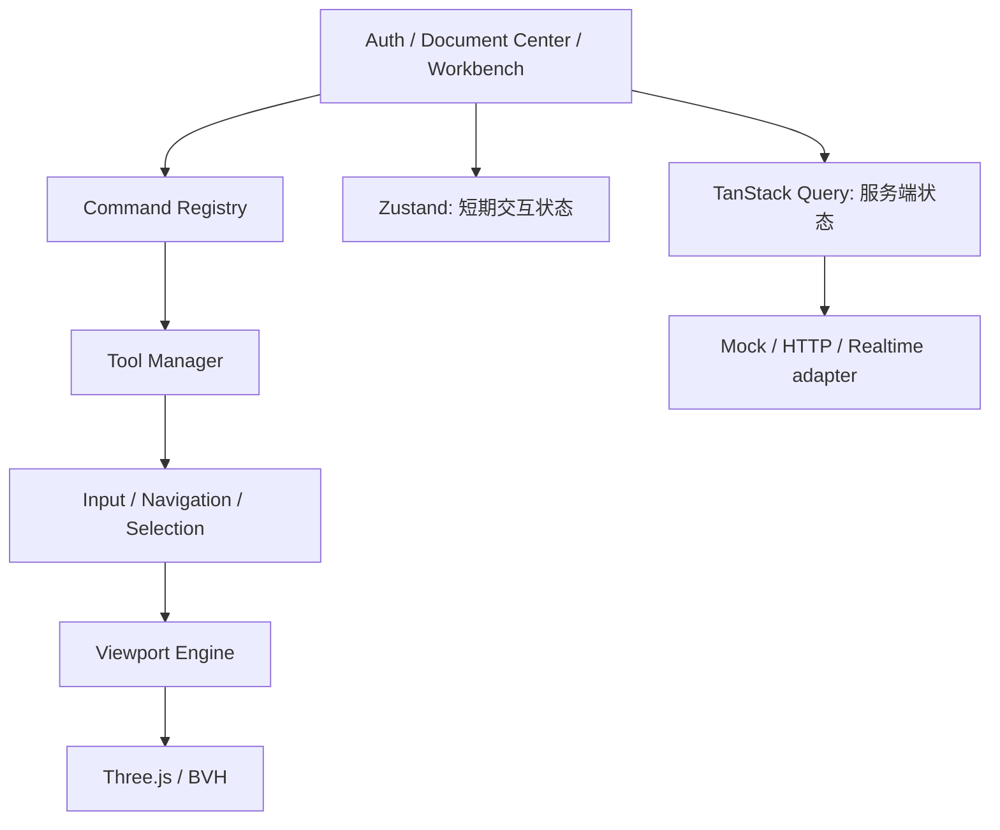

# Web 工作台与交互边界

> 2026-09-21 文档核对。返回[当前架构](../../CURRENT_ARCHITECTURE.md)。本页描述实现，Product/WebGL 人工验收已由维护者确认通过，自动化测试与限制见[完成记录](product-assembly.md#accept-product-完成记录)。

## 状态与模块职责

页面通过 Viewport Engine 操作视口，不直接拥有 Three.js Scene/Renderer。模型、权限、Revision 与最终求值属于服务端；camera、hover、selection、工具采集和渲染插值是可丢弃状态。Mock 用于 UI 调试，不证明后端权限或几何正确性。

工作台由独立结构树、视口和属性/历史面板组成。树筛选保留祖先与 stable key，虚拟树支持键盘和集合选择；Inspector 关闭时卸载，按页签请求数据，读取失败明确报错。Document tabs 位于全局标题栏，支持切换、关闭、新建、排序及会话恢复。

## 根场景与编辑上下文

Product 始终显示根装配场景，Active Occurrence 的 Reference Workspace 决定命令、历史和属性目标。`ViewportEditContext`/`editingView` 将活动 Part 草图的拾取、约束、尺寸拖拽和编辑从根 Product 投影中分离；切换激活状态不产生空 Revision。创建 Part、Context Catalog、Pin/Follow 和产品版本中心的领域行为见[Product 架构](product-assembly.md)。

进入 Sketcher 保留权威 Body 作为只读环境，活动 Sketch、约束与预览叠加其上。普通工具只接受活动 Sketch；显式 Projection 才能进入上游 Body Edge/Vertex 选择并绑定 PersistentSelection。ExternalGeometry 独立、只读，使用同一捕捉/约束路径。退出后选择提升为 Sketch Feature；未消费草图保持可见，已消费草图在选择或重新编辑时临时显示。

## 显示制品与稳定选择

Part 求值输出 schema v1 `VisualizationManifest` 并写入 GLB 的 `OCCCCAD_visualization` 扩展。Point、曲线、约束 glyph 和尺寸引线携带稳定 entity/constraint/Feature identity、role、求解状态和关联实体；它们是可重建显示制品。Part 与 Product 共用 renderer 与 selection identity builder，Product 只施加 occurrence Transform，不维护另一份 Sketch 模型。

InputManager、Tool、Selection 和 Overlay 共用完整 pointer down/move/up/cancel、capture/lost capture、Esc/blur 生命周期。hover、正式选择和工具保留引用独立呈现；切换状态先释放旧覆盖再重建。隐藏对象及其子孙退出拾取候选。工具声明 geometry/instance 选择模式，在 hover/select 之前完成语义投影；树和视口按稳定 identity 同步，树祖先高亮不反向扩大精确拓扑选择。装配约束工具通过同一 selectionInput 消费视口点击、结构树节点和启动前选择集；固定/刚性先执行 instance 投影，再转换为 AssemblyGeometryRef。一个有效支持保留等待第二项，两个不同 occurrence 的支持进入现有约束定义和预览流程；重复支持不重复提交。工具激活先发布状态再消费预选，避免完成后又被激活通知覆盖。

最终 Body 制品绑定结果 Feature；当前没有历史中每个 Feature 的独立可视 Result。`geometryKey + local topology ID` 只用于当前制品拾取证据，持久引用仍由服务端绑定。Publication 同时关联视口、所属树节点及发布节点；无法解析约束显示锚点时回退 occurrence 中心，保持 Broken 可选、可修复。

捕捉过滤与 Selection 独立。三维类型过滤、草图网格/端点/中心/中点/曲线投影共用候选排序；禁用候选不能遮挡后方可用对象。显示折线上的投影仅是交互近似。命中稳定点时，同一编辑批次显式添加 Coincident，不能只保存相同坐标。

## 命令、预览与提交

Toolbar 来自服务端版本化 Presentation Catalog，稳定 ToolbarId 表达用户意图类别；命令仍需本地 CommandRegistry 注册并满足上下文 capability。未知命令不可执行，目录不承载远程代码。默认命令区按工作台/锚点呈现；导航、捕捉和显示单位属于偏好。全局快捷键避开输入框、IME、重复按键和对话框；上下文帮助点击不执行命令。

工具单击完成一个逻辑操作后回到选择，双击进入连续模式；Polyline/Spline 用 Enter 或双击完成多点采集。尺寸工具按引用选择、真实几何测量初值、放置、内联输入、提交运行；拖动尺寸位置和实体点只在 pointerup 形成一个 Domain Command。显示/输入单位在 UI 转换，权威数量和表达式由服务端验证。

非模态 CommandDialog 允许继续拾取。Part preview 复用正式 adapter、handler、参数/Sketch/Feature evaluator，返回带 base Revision/provenance 的精确结果；它不产生 Revision/历史/Outbox。提交可携带 verified candidate token，仅当 actor、document、base head/sequence、命令类型与 payload digest 全部匹配时提升候选，否则重新求值。当前候选和 warm-start cache 有 45 秒 TTL、256 项进程上限；丢失只影响性能。

交互以 interactionId 和单调 previewSequence 取消旧请求、丢弃迟到响应。装配前端 actor 管理草拟/预览/确认/取消，服务端 workflow 管理解析/求解/应用/失败；二者不替代 Revision 或 solver 数值状态。nominal pose 来自 Revision，前次权威解只作短期 initial guess。数值输入通常在 blur/Enter 请求权威预览，成功后才能提交。

实体 Feature preview 显示后端完整结果并临时替换当前 occurrence 的旧实体；取消恢复原可见性。Placement 动画只插值 TRS，旋转使用 quaternion slerp，同批 occurrence 共用时钟；新目标从当前显示帧接续，最终精确落到权威姿态。手柄与 Instance 使用同一确认帧。MOVE 的约束能力仍受临时 Fix 路径限制，不能据此宣称最近可行拖拽。

## 导航、布局与偏好

默认正交 ISO 朝向，Fit 按可见内容计算；普通刷新保留视图，草图进入/退出保存并恢复相机上下文。进入草图、正对草图与法线视图先选择最近法向侧，再从支撑面两轴的四个正交朝向中选择旋转最少的一种，使平面坐标轴在屏幕上横平竖直；没有平面轴时使用投影后的世界轴。上述切换及退出草图通过280 ms缓入缓出动画完成，旋转用 quaternion slerp，围绕插值关注点运动并保留比例。新目标从当前显示帧接续，用户输入、切换文档或销毁视口会取消动画；不反转业务平面。网格独立于模型包围盒、Fit 和拾取。草图网格绘制和吸附共用自适应间距，吸附距离按实际屏幕投影衡量。草图原生轴线、引用高亮及约束拾取共用固定 CSS 像素长度；轴仍位于实际草图面，近乎正对视线的退化轴不显示或参与选择。裁剪范围包含草图、辅助轴、交互预览；没有实体时仍按草图/导航关注点计算，避免小尺寸草图被远近裁剪剔除。Default、CATIA 和 SOLIDWORKS 导航由独立状态机实现；适用手势、参考资料与验证限制见[导航 README](../../../web/apps/cad/src/cad/navigation/README.md)。

schema 7 的 `occccad.ui-preferences.v1` 保存 Inspector、面板/工具条布局、树宽/显隐覆盖、导航、捕捉、基准元素分类显隐、实体正常/线框显示及独立边线/交点开关，以及默认/按 DocumentId 的显示单位。显示单位影响格式和新输入，不重写已有表达式或变成共享 Revision 属性；隐藏为本地显示，抑制是持久领域状态。当前树使用独立侧栏、全高 resize separator 和展开箭头，不再采用旧 UX 计划中的圆环图标与角形 grip。

基准轴/面是屏幕稳定的辅助几何，关闭深度测试并有专用拾取层，避免被实体遮挡后不可选择；轴线以射线到命中点的实际距离执行像素容差，不依赖可选的 distanceToRay 字段。显示设置统一控制基准面、基准轴、坐标系，和树节点隐藏共同生效；隐藏对象不参与视区拾取。底部视区设置将捕获与显示合并为一个向上弹出的气泡，使用捕获阶段的外部 pointerdown 关闭，因此视口阻止冒泡不影响收起。基准面、基准轴、坐标系分别开关。实体正常/线框显示与交点显隐独立，正常显示还可单独开关边线；线框始终保留 CAD 拓扑边（包含背面边），不暴露显示三角剖分。旧显示预设迁移为对应开关，显式选择反馈独立于普通实体显示。默认表面使用低金属度、适中粗糙度的哑光材质，提高半球漫反射填充并降低直射高光对比，避免放大粗曲面网格的法线差异；这不替代网格细分或曲面法线优化。环境由宽幅、低对比的 HDR 柔光板生成，每个视口初始化时通过 PMREM 预过滤一次，由视口持有并释放；不依赖外部 HDR 资产，不捕获模型、不逐帧重建，也不替换方向渐变背景。构造虚线的节距和编辑草图尺寸箭头按 CSS 像素计算，动态几何在渲染上传及拾取前更新，不改变领域几何或尺寸值。语义色集中在 visual tokens，selection/hover/preview、求解诊断和坐标轴保持不同含义；精确像素、色值和动画时长由实现及视觉场景维护，不作为架构契约复制。

Insert 复用 ACL 文档搜索和缩略图 API，支持范围、文件夹、搜索、分页及失败重试；提交只传稳定 DocumentId，循环引用由服务端验证。诊断下载使用文档 ACL/CSRF，导出命令、Workspace、manifest 和日志关联，排除凭据、无关文档日志和原始 B-Rep。

Document Center 支持跨页保留文档多选、全选当前页或当前筛选结果，并以最多四路请求批量移入回收站；部分失败时保留失败项。文件夹删除为软删除整个子树；所属文档随文件夹从活动列表隐藏，不改写各文档的 Revision 或独立回收站状态。回收站展示根文件夹，可整体恢复；原本单独删除的文档在文件夹恢复后仍留在文档回收站。当前永久清空仍只处理单独删除的文档，文件夹回收站只提供恢复。

## 实现与验证入口

- [Web 运行与测试](../../../web/apps/cad/README.md)
- [编辑上下文](../../../web/apps/cad/src/features/workbench/product-edit-context.ts)
- [Product 场景](../../../web/apps/cad/src/features/workbench/testing/product-edit-context.scenario.mjs)
- [Publication 选择](../../../web/apps/cad/src/features/workbench/testing/publication-selection.scenario.mjs)
- [偏好 schema](../../../web/apps/cad/src/state/ui-preferences.ts)

新建草图会话记录所属文档和 FeatureId；退出或切换编辑上下文时，仅对本次新建、未执行草图编辑且仍无实体/约束/外部几何的草图提交正常删除命令，保留 Revision 历史。重新编辑已有空草图不触发清理。直线拉伸创建的默认方向按持久支持平面法向确定：NEW_BODY/ADD 为正向，REMOVE 为反向，不依赖相机观察方向；切换 Body 操作重设默认值，反向开关仍允许显式覆盖。

工作台消费服务端 Artifact 的 `naming` 能力与属性查询的 `namingDiagnostic`，展示未生成、生成不完整、损坏和合同不匹配的具体原因。已知不可绑定的面/边/点限制面上草图、拓扑发布、外部投影及拓扑约束入口，提交仍由服务端验证；基准几何、法线视图和 Instance/Body 级选择不因缺少 naming 被统一禁用。纯逻辑回归入口为 `topology-naming-capability.scenario.mjs`。

已有无命名定义的 ImportBody 在工作台告警中提供“建立导入命名”，调用正常 `REPAIR_IMPORT_NAMING` 命令并刷新权威 DocumentView；有编辑权限时可用，提交期间显示忙碌状态。修复形成新 Revision，可 Undo/Redo，未修复旧快照保持不可绑定诊断。

实体显示唯一数据源为 `mesh.glb`；DocumentView 只有轻量引用和摘要，VisualRepository 独立下载、校验和解码，不向服务器状态回填 Mesh。GLB CAD 拾取映射、下载权限及 transient preview 边界见[几何制品](geometry-representations.md)。

CAD Command 与 Preview 统一通过[realtime 控制面](realtime.md)提交；Preview 仅携带 GLB 引用。视口独立取消预览文件加载，sequence/generation 拒绝迟到结果；realtime client 在重连和 gap 后主动恢复权威快照。
