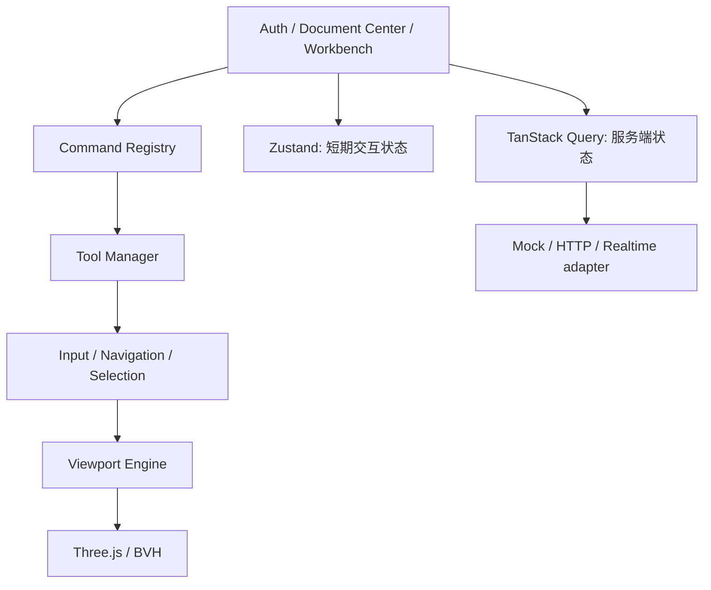

# Web 工作台与交互边界

> 返回[当前架构目录](../../CURRENT_ARCHITECTURE.md)。代码和测试定义当前事实；验证范围见[验证说明](validation.md)。

## 状态与模块职责

```mermaid
flowchart TD
    Pages["Auth / Document Center / Workbench"] --> Query["TanStack Query: 服务端状态"]
    Pages --> Store["Zustand: 短期交互状态"]
    Pages --> Command["Command Registry"]
    Command --> Tool["Tool Manager"]
    Tool --> Interaction["Input / Navigation / Selection"]
    Interaction --> Engine["Viewport Engine"]
    Engine --> Three["Three.js / BVH"]
    Query --> Adapter["Mock / HTTP / Realtime adapter"]
```

页面通过 Viewport Engine 操作视口，不直接拥有 Three.js Scene/Renderer。模型、权限、Revision 与最终求值属于服务端；camera、hover、selection、工具采集和渲染插值是可丢弃状态。Mock 用于 UI 调试，不证明后端权限或几何正确性。

工作台由独立结构树、视口和属性/历史面板组成。树筛选保留祖先与 stable key，虚拟树支持键盘和集合选择；Inspector 关闭时卸载，按页签请求数据，读取失败明确报错。Document tabs 位于全局标题栏，支持切换、关闭、新建、排序及窗口会话恢复。普通文档读取和依赖刷新不打开或重排标签；显式打开生命周期与窗口内稳定顺序见 [编辑上下文](product-edit-context.md)。

## 根场景与编辑上下文

Product 始终显示根装配场景，宿主 Product 决定路由与活动标签，唯一 Edit Target 的 Reference Workspace 决定工作台、命令、历史和属性目标。Product 内只有携带完整 occurrence 路径的上下文编辑，不存在脱离 occurrence 的定义编辑切换；独立 Part 标签是另一个宿主工作空间。`ViewportEditContext`/`editingView` 将活动 Part 草图的拾取、约束、尺寸拖拽和编辑从根 Product 投影中分离；切换激活状态不产生空 Revision。创建 Part、Context Catalog、Pin/Follow 和产品版本中心的领域行为见[Product 架构](product-assembly.md)。

进入 Sketcher 保留权威 Body 作为只读环境，活动 Sketch、约束与预览叠加其上。普通工具只接受活动 Sketch；显式 Projection 才能进入上游 Body Edge/Vertex 选择并绑定 PersistentSelection。ExternalGeometry 独立、只读，使用同一捕捉/约束路径。退出后选择提升为 Sketch Feature；未消费草图保持可见，已消费草图在选择或重新编辑时临时显示。

## 显示制品与稳定选择

Part 求值输出 schema v1 `VisualizationManifest` 并写入 GLB 的 `OCCCCAD_visualization` 扩展。Point、曲线、约束 glyph 和尺寸引线携带稳定 entity/constraint/Feature identity、role、求解状态和关联实体；它们是可重建显示制品。Part 与 Product 共用 renderer 与 selection identity builder，Product 只施加 occurrence Transform，不维护另一份 Sketch 模型。

InputManager、Tool、Selection 和 Overlay 共用完整 pointer down/move/up/cancel、capture/lost capture、Esc/blur 生命周期。hover、正式选择和工具保留引用独立呈现；切换状态先释放旧覆盖再重建。隐藏对象及其子孙退出拾取候选。工具声明 geometry/instance 选择模式，在 hover/select 之前完成语义投影；树和视口按稳定 identity 同步，树祖先高亮不反向扩大精确拓扑选择。装配约束工具通过同一 selectionInput 消费视口点击、结构树节点和启动前选择集；固定/刚性先执行 instance 投影，再转换为 AssemblyGeometryRef。一个有效支持保留等待第二项，两个不同 occurrence 的支持进入现有约束定义和预览流程；重复支持不重复提交。工具激活先发布状态再消费预选，避免完成后又被激活通知覆盖。

各 Body 的 GLB 独立下载/缓存，视口以 occurrence + Body 绑定显示与拾取；Body 选择、显隐与目标 Body Preview 不影响兄弟 Body。属性面板只读展示 Body 名称、活动/显隐状态与按 Revision 索引分组的 Part Files 下载，Product occurrence 中的 Body 属性也按其 resolved Revision 查询；编辑通过正式业务命令执行。最终 Body 制品绑定该 Body；历史 Feature 的阶段结果通过既有只读 feature-input 按需重建，不为每个 Feature 常驻完整网格。`BodyId + Revision + geometryKey + local topology ID` 只用于当前制品拾取证据，持久引用仍由服务端绑定。Publication 树入口选择保持 Publication 业务身份，只有同 Body、Revision、Geometry 范围内可唯一解析的目标才关联几何高亮；无法解析约束显示锚点时回退 occurrence 中心，保持 Broken 可选、可修复。

结构树消费服务端 `DocumentStructureNode`：Product 的 Instance 下保留独立 Part/Product 定义根，Part 与 Product 内 Part 共用 Body/Feature/Sketch 投影；被多个 Feature 使用的 Sketch 保留一个定义入口和多个只读输入引用。节点显式携带 `EntityRef`、`OccurrenceRef`、`SnapshotScope`、owner、Body、能力，以及可分别读取的连接、时效、求值、子节点加载状态；树路径只标识当前投影入口。选择键包含文档、完整 occurrence、Revision/variant、Body 与几何范围；折叠祖先只显示后代提示，不变更精确命令目标。行虚拟化保留，Product/Part 历史分支默认按需展开；目前服务端仍构造完整结构快照，尚未实现分页获取子树。更多设计与 CATIA 对照见[语义结构树与交互上下文](../semantic-tree-interaction.md)。

单击树节点只选择，不改变编辑目标。双击 Instance 是激活其下 Part/Product 根的快捷方式；双击定义根得到同一目标，双击根 Product 返回装配编辑。只有类型、DocumentId 与完整 InstancePath 均匹配的 Part/Product 根显示文档编辑态，Instance 行不共用该标记。激活 Body 只改变会话工作 Body，覆盖持久 `activeBodyId` 默认值；选择、展开和临时显隐不写入 Revision。Feature 选择保持设计定义身份，使用 Naming 派生的当前面/边贡献集合高亮；无当前贡献与关联缺失分别提示。视图的真实面/边保持主选择，关联树节点只作定位提示，不再触发 Feature/Body 选择。“查看此步骤结果”显式加载历史制品，禁用其建模拾取并提供恢复当前结果；历史编辑使用上游阶段，结束恢复正常显示。Product 自动更新订阅来自服务端的非 PINNED 领域引用投影，并继续通过 UpdatePlan 按叶到根接受；过滤和展开状态不参与更新决策。

捕捉过滤与 Selection 独立。三维类型过滤、草图网格/端点/中心/中点/曲线投影共用候选排序；禁用候选不能遮挡后方可用对象。显示折线上的投影仅是交互近似。命中稳定点时，同一编辑批次显式添加 Coincident，不能只保存相同坐标。

## 命令、预览与提交

文档、Toolbar Tab/命令组、命令和图标来自服务端校验的统一配置；呈现与实现通过稳定 ID 关联，本地 CommandRegistry 统一执行并独立检查可用条件。文档适配器、编辑事实、注册与操作清理见[公共框架](document-command-framework.md)。未知实现使目录校验失败，目录不承载远程代码。默认命令区按工作台/锚点呈现；导航、捕捉和显示单位属于偏好。全局快捷键避开输入框、IME、重复按键和对话框；上下文帮助点击不执行命令。

工具单击完成一个逻辑操作后回到选择，双击进入连续模式；Polyline/Spline 用 Enter 或双击完成多点采集。尺寸工具按引用选择、真实几何测量初值、放置、内联输入、提交运行；实体点拖动只在 pointerup 形成一个 Domain Command；尺寸标注位置拖动仅更新以 owner Document/Sketch/Constraint 稳定身份索引的浏览器显示偏好，不发送命令、不求解、不改变 Revision 或 Undo/Redo。显示重建与尺寸编辑预览复用此位置。显示/输入单位在 UI 转换，权威数量和表达式由服务端验证。

草图工具通过 `SketchCommandState` 投影选择、定义、放置、提交及未知结果阶段，ToolManager/Input Router 拥有手势和工具生命周期；工作台状态栏显示当前 role、接受数量和完成入口；inline 以引线数值显示工具显式请求的字段，点击或键入时才展开紧凑白色编辑框，advanced 面板保留高级选项。两者只是投影并派发字段、确认和取消动作，不从提示文字判断阶段；数值焦点由 input.id 代际控制，失焦不取消工具。线性尺寸同屏距离重叠候选优先 PROFILE 子边；Construction 仍可单独命中或通过主动预选选择。悬停、选集和尺寸预览使用独立显示层，选集/候选高于透明尺寸文字，避免互相清除或遮挡。尺寸进入 Placement 后冻结引用和尺寸种类，hover 其他几何不会改写定义。尺寸编辑器持有未提交值/表达式草稿，角色槽位使用 typed stable ref，面板只展示对象角色与定位，视图仅高亮引用几何。尺寸面板移除引用更换和折叠的更多设置，直接呈现名称、删除、停用和参考状态；逻辑约束编辑仍复用受控引用更换会话，按角色过滤候选并在排名前排除不兼容命中，定位/高亮不改模型选择。手动引用拾取独立于自动吸附偏好。尺寸面板开启时输入屏障阻止几何拖动，允许中键导航；逻辑约束引用子会话中 Esc/右键先取消更换，IME 不确认或取消。显示/输入采用文档长度单位，数值初始化最多六位小数并去除尾零，极小非零值使用科学计数；原始 Quantity 与表达式不因格式化改写。数值输入节点首次聚焦全选，返回视图后再聚焦保留光标；数量与表达式仍由服务端处理。

草图提交持有原 requestId、baseVersionId 和操作快照；未知响应重试携带 `retryReceipt=true` 查询原请求，不重新生成操作身份。Engine 持有待确认回执；正常等待不增加底部提示框，未知回执通过状态栏查询恢复，关闭面板不撤销已发请求；回执待确认时继续阻止新编辑。请求已成功确认后渲染刷新失败不被当作领域提交失败重发。异步结果必须匹配文档/草图/版本/会话代际。操作交互与人工验证入口见[草图交互补齐](../../sketch-ux-02.md)。

CommandDialog 允许由显式子选择会话继续拾取；尺寸面板默认输入屏障不允许任意修改其它几何。Part preview 复用正式 adapter、handler、参数/Sketch/Feature evaluator，返回带 base Revision/provenance 的精确结果；它不产生 Revision/历史/Outbox。提交可携带 verified candidate token，仅当 actor、document、base head/sequence、命令类型与 payload digest 全部匹配时提升候选，否则重新求值。当前候选和 warm-start cache 有 45 秒 TTL、256 项进程上限；丢失只影响性能。

交互以 interactionId 和单调 previewSequence 取消旧请求、丢弃迟到响应。装配前端 actor 管理草拟/预览/确认/取消，服务端 workflow 管理解析/求解/应用/失败；二者不替代 Revision 或 solver 数值状态。nominal pose 来自 Revision，前次权威解只作短期 initial guess。数值输入通常在 blur/Enter 请求权威预览，成功后才能提交。

实体 Feature preview 显示后端完整结果并临时替换当前 occurrence 的旧实体；取消恢复原可见性。Placement 动画只插值 TRS，旋转使用 quaternion slerp，同批 occurrence 共用时钟；新目标从当前显示帧接续，最终精确落到权威姿态。手柄与 Instance 使用同一确认帧。MOVE 的约束能力仍受临时 Fix 路径限制，不能据此宣称最近可行拖拽。

## 导航、布局与偏好

默认正交 ISO 朝向，Fit 按可见内容计算；普通刷新保留视图，草图进入/退出保存并恢复相机上下文。进入草图、正对草图与法线视图先选择最近法向侧，再从支撑面两轴的四个正交朝向中选择旋转最少的一种，使平面坐标轴在屏幕上横平竖直；没有平面轴时使用投影后的世界轴。上述切换及退出草图通过280 ms缓入缓出动画完成，旋转用 quaternion slerp，围绕插值关注点运动并保留比例。新目标从当前显示帧接续，用户输入、切换文档或销毁视口会取消动画；不反转业务平面。网格独立于模型包围盒、Fit 和拾取。草图网格绘制和吸附共用自适应间距，吸附距离按实际屏幕投影衡量。草图原生轴线、引用高亮及约束拾取共用固定 CSS 像素长度；轴仍位于实际草图面，近乎正对视线的退化轴不显示或参与选择。裁剪范围包含草图、辅助轴、交互预览；没有实体时仍按草图/导航关注点计算，避免小尺寸草图被远近裁剪剔除。Default、CATIA 和 SOLIDWORKS 导航由独立状态机实现；适用手势、参考资料与验证限制见[导航 README](../../../web/apps/cad/src/cad/navigation/README.md)。

schema 7 的 `occccad.ui-preferences.v1` 保存 Inspector、面板/工具条布局、树宽/显隐覆盖、导航、捕捉、基准元素分类显隐、实体正常/线框显示及独立边线/交点开关，以及默认/按 DocumentId 的显示单位。显示单位影响格式和新输入，不重写已有表达式或变成共享 Revision 属性；隐藏为本地显示，抑制是持久领域状态。当前树使用独立侧栏、全高 resize separator 和展开箭头，不再采用旧 UX 计划中的圆环图标与角形 grip。

基准轴/面是屏幕稳定的辅助几何，关闭深度测试并有专用拾取层，避免被实体遮挡后不可选择；轴线以射线到命中点的实际距离执行像素容差，不依赖可选的 distanceToRay 字段。显示设置统一控制基准面、基准轴、坐标系，和树节点隐藏共同生效；隐藏对象不参与视区拾取。底部视区设置将捕获与显示合并为一个向上弹出的气泡，使用捕获阶段的外部 pointerdown 关闭，因此视口阻止冒泡不影响收起。基准面、基准轴、坐标系分别开关。实体正常/线框显示与交点显隐独立，正常显示还可单独开关边线；线框始终保留 CAD 拓扑边（包含背面边），不暴露显示三角剖分。旧显示预设迁移为对应开关，显式选择反馈独立于普通实体显示。默认表面使用低金属度、适中粗糙度的哑光材质，提高半球漫反射填充并降低直射高光对比，避免放大粗曲面网格的法线差异；这不替代网格细分或曲面法线优化。环境由宽幅、低对比的 HDR 柔光板生成，每个视口初始化时通过 PMREM 预过滤一次，由视口持有并释放；不依赖外部 HDR 资产，不捕获模型、不逐帧重建，也不替换方向渐变背景。构造虚线的节距和编辑草图尺寸箭头按 CSS 像素计算，动态几何在渲染上传及拾取前更新，不改变领域几何或尺寸值。语义色集中在 visual tokens，selection/hover/preview、求解诊断和坐标轴保持不同含义；精确像素、色值和动画时长由实现及视觉场景维护，不作为架构契约复制。

Insert 复用 ACL 文档搜索和缩略图 API，支持范围、文件夹、搜索、分页及失败重试；提交只传稳定 DocumentId，循环引用由服务端验证。诊断下载使用文档 ACL/CSRF，导出命令、Workspace、manifest 和日志关联，排除凭据、无关文档日志和原始 B-Rep。

Document Center 支持跨页保留文档多选、全选当前页或当前筛选结果，并以最多四路请求批量移入回收站；部分失败时保留失败项。文件夹删除为软删除整个子树；所属文档随文件夹从活动列表隐藏，不改写各文档的 Revision 或独立回收站状态。回收站展示根文件夹，可整体恢复；原本单独删除的文档在文件夹恢复后仍留在文档回收站。当前永久清空仍只处理单独删除的文档，文件夹回收站只提供恢复。

## 实现与验证入口

- [Web 运行与测试](../../../web/apps/cad/README.md)
- [编辑上下文](../../../web/apps/cad/src/features/workbench/product-edit-context.ts)
- [Product 场景](../../../web/apps/cad/src/features/workbench/testing/product-edit-context.scenario.mjs)
- [Publication 选择](../../../web/apps/cad/src/features/workbench/testing/publication-selection.scenario.mjs)
- [偏好 schema](../../../web/apps/cad/src/state/ui-preferences.ts)

新建草图会话记录所属文档和 FeatureId；退出或切换编辑上下文时，仅对本次新建、未执行草图编辑且仍无实体/约束/外部几何的草图提交正常删除命令，保留 Revision 历史。重新编辑已有空草图不触发清理。直线拉伸创建的默认方向按持久支持平面法向确定：NEW_BODY/ADD 为正向，REMOVE 为反向，不依赖相机观察方向；切换 Body 操作重设默认值，反向开关仍允许显式覆盖。

工作台消费服务端 Artifact 的 `naming` 能力与属性查询的 `namingDiagnostic`，展示未生成、生成不完整、损坏和合同不匹配的具体原因。已知不可绑定的面/边/点限制面上草图、拓扑发布、外部投影及拓扑约束入口，提交仍由服务端验证；基准几何、法线视图和 Instance/Body 级选择不因缺少 naming 被统一禁用。纯逻辑回归入口为 `topology-naming-capability.scenario.mjs`。

已有无命名定义的 ImportBody 在工作台告警中提供“建立导入命名”，调用正常 `REPAIR_IMPORT_NAMING` 命令并刷新权威 DocumentView；有编辑权限时可用，提交期间显示忙碌状态。修复形成新 Revision，可 Undo/Redo，未修复旧快照保持不可绑定诊断。

实体显示唯一数据源为 `mesh.glb`；DocumentView 只有轻量引用和摘要，VisualRepository 独立下载、校验和解码，不向服务器状态回填 Mesh。GLB CAD 拾取映射、下载权限及 transient preview 边界见[几何制品](geometry-representations.md)。

CAD Command 与 Preview 统一通过[realtime 控制面](realtime.md)提交；Preview 仅携带 GLB 引用。视口独立取消预览文件加载，sequence/generation 拒绝迟到结果；realtime client 在重连和 gap 后主动恢复权威快照。

草图普通选择和工具角色共用屏幕距离及几何角色优先级；构造几何低于普通几何，尺寸引线、文字、hover、选中与修剪反馈分层。尺寸文本附着支持平面、按缩放维持显示尺度；圆角/倒角候选复用尺寸定义和渲染器。Select 框选及 Delete 经原有选择与正式命令路径执行。尺寸编辑保留相机和导航，草稿通过只读 Preview 显示，取消/版本变化/迟到结果不写回模型。

状态栏/inline 输入的动作合同、单击单次/双击连续策略及人工步骤见[草图当前动作与 inline 输入](../../sketch-inline-input.md)。

草图编辑共用状态栏/内联输入，相关创建与样条编辑命令通过服务端 `variants:*` 目录标记合并为分体按钮；主按钮显示并执行当前激活变体，没有激活变体时使用本页会话中记住的合法变体，下拉切换立即执行，隐藏或已移除的默认项回退到当前目录第一项。尺寸呈现线性/轴/角度三组，搜索仍保留每个具体命令。草图中底部 `view.normal` 无预选也正对活动草图，独立 `sketch.normal` 入口已删除。修剪只有一个用户入口，构造转换直接执行。圆角和倒角选取完成后进入既有尺寸标注的内联数值编辑；拖动标注只改 placement。Engine 所有草图临时显示使用单一非拾取 preview layer，几何/尺寸/hover/snap/只读编辑候选保持各自生命周期；工具与模态会话继续负责草稿、Revision/occurrence、代际和回执，显示层不成为第二套状态中心。直接延伸支持点选目标或拖动释放，边界捕获的精确预览合并指针更新并丢弃过期结果。

工作台公共视觉 tokens、分体按钮、非模态面板和视口文本适配见 [UI 规格与组件入口](../../workbench-ui.md)。呈现层不改变 Command/Preview、选择来源或历史语义。

工作台 Ribbon 按容器宽度与目录优先级分页，整组优先、超宽组按双行列拆分；切页仅改变呈现，不执行或取消命令。前端数量、坐标、测量及数值控件的非编辑显示统一最多两位小数；表达式和技术诊断原文保留，模型与 Quantity 不舍入，未修改的格式化字段不覆盖原值。

工作台结构树侧栏底部显示最后完成的一次后端请求的整数毫秒耗时；初始无请求时显示占位。HTTP 统计到响应体处理结束，WebSocket 统计连接等待、发送到响应/错误/超时/取消完成；同一命令的不同请求分别更新显示，按完成顺序取最后一次。该时间包含客户端与网络等待，是操作反馈的粗略 wall time，不是后端 CPU 时间，也不累计成命令总时长。耗时记录是页面内有界交互状态，既有诊断采样保留 200 项，不持久化模型、Revision 或导航状态。

## 机构研究与只读回放

Assembly Design 的 `assembly.motion-study` 使用公共命令目录打开机构与 DMU 面板。定义保存走正式版本化命令，后台运行及结果列表走既有 API/Jobs 和 TanStack Query；播放/定位只持有临时冻结 view 与整帧 Pose。Viewport 先验证 owning 单元组全部加载，再通过 TransformTransitionSystem immediate 批量应用，保持刚体后代和闭环，不做普通位姿插值。关闭、版本/编辑上下文切换清理覆盖与高亮，代际门禁阻止迟到结果覆盖新显示；旧运行需显式加载并提示冻结版本。回放期间编辑命令受 availability 门禁，不提供姿态写回。详细单位、方程、scope、运行和未验收边界见[当前机构合同](kinematics-dmu.md)。
