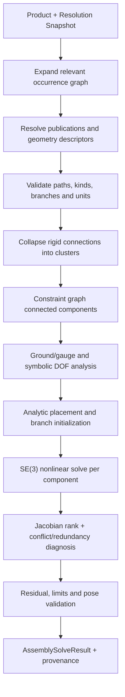

# 装配约束、求解与交互

> 目标契约，不等于已交付能力。返回[目标架构目录](../../TARGET_ARCHITECTURE.md)；当前事实见[当前架构](../../CURRENT_ARCHITECTURE.md)，实施顺序只在[统一路线](../../../plans/README.md)维护。

### 5.6.10 AssemblyGeometryRef 与几何描述符

```proto
message AssemblyGeometryRef {
  RelativeInstancePath occurrence = 1;
  oneof target {
    string publication_id = 2;
    PersistentSelection selection = 3;
  }
  AssemblyGeometryKind expected_kind = 4;
  SelectionEvidence evidence = 5;
}

message MatingGeometryDescriptor {
  AssemblyGeometryKind kind = 1;
  RigidTransform local_frame = 2;
  repeated Symmetry symmetry = 3;
  GeometryParameters parameters = 4;
  string source_geometry_id = 5;
}
```

Geometry Worker 从 Part Revision 提取小型 descriptor：Point、Line/Axis、Plane、Circle、Cylinder、Cone、Sphere、Curve、Surface、Frame。Assembly Solver 不需要读取完整 B-Rep；只有 Contact/复杂曲线约束或诊断需要按需请求更精确描述。

Descriptor 必须表达几何对称性：圆柱绕轴旋转不改变几何，平面内平移/绕法向旋转不由单一平面约束，球面只约束球心和半径。Solver 的 DOF 计算必须尊重对称性，不能把一个圆柱面错误当成完整坐标系。

### 5.6.11 Engineering Connection 与原子 Constraint

CATIA Engineering Connection 是一个或多个装配约束的功能组合；occcad 采用相同分层：

```proto
message EngineeringConnection {
  string connection_id = 1;
  string name = 2;
  ConnectionType declared_type = 3;
  repeated AssemblyConstraint constraints = 4;
  ConnectionState state = 5;
  optional InterferencePolicy interference = 6;
}

message AssemblyConstraint {
  string constraint_id = 1;
  ConstraintMode mode = 2; // DRIVING | MEASURED | CONTROLLED | SUPPRESSED
  repeated AssemblyGeometryRef endpoints = 3;
  oneof definition {
    CoincidenceConstraint coincidence = 10;
    ContactConstraint contact = 11;
    OffsetConstraint offset = 12;
    UnsignedAngleConstraint unsigned_angle = 13;
    ParallelConstraint parallel = 14;
    PerpendicularConstraint perpendicular = 15;
    DistanceConstraint distance = 16;
    FixConstraint fix = 17;
    SymmetryConstraint symmetry = 18;
    DirectedAngleConstraint directed_angle = 19;
  }
}
```

`DRIVING` 进入方程；`MEASURED` 只计算当前值；`CONTROLLED` 值来自 Parameter/Law；`SUPPRESSED` 保留身份但不参与。一个 Connection 原子提交：内部任何 Constraint 不合法或产生未接受冲突，整个 Connection 不创建。

### 5.6.12 基础约束语义与兼容几何

| Constraint | 典型输入 | 独立语义 |
|---|---|---|
| Fix | occurrence/frame | 将指定 body frame 固定到目标 Pose |
| Coincidence | point-point、axis-axis、plane-plane | 重合；需 direction/side branch |
| Contact | plane-plane、cylinder-cylinder、sphere-surface | 零间隙接触，不自动引入力学接触 |
| Offset | plane-plane、axis-axis、point-plane | 有符号距离，保存 side |
| UnsignedAngle | direction/axis/plane pair | `[0, π]` 无向夹角与 orientation branch |
| DirectedAngle | direction/axis/plane pair + reference axis/sense | `atan2(k·(a×b), a·b)` 有向角与 sector branch |
| Parallel | axes/planes/directions | 平行或反平行 branch 明确 |
| Perpendicular | axes/planes/directions | 正交 |
| Distance | point/axis/surface combinations | 最短或指定方向距离，定义 branch |
| Symmetry | frames/occurrences + plane/axis | 对称位置，不生成镜像零件 |

约束 schema 定义允许的 geometry-kind 组合、方程数、单位和 branch。`UnsignedAngle` 与 `DirectedAngle` 是不同的 typed definition，不能用字符串选项或求值时动态翻转互相模拟。静态 Assembly Revision 只保存 modulo `2π` 的姿态语义；unwrapped angle、winding 和多圈累计属于 Interaction、Kinematics 或 Simulation 状态。客户端只能在服务端 capability 表允许的组合中建议命令；服务端仍重新验证。复杂 surface contact P0 不支持任意 NURBS-NURBS 全局接触，因为它可能多点、多分支且不适合静态定位；优先用 Datum/Connector Publication。

当前第一版几何约束能力矩阵如下；横纵交换保持相同语义。拓扑 `Vertex` 解析为 Point descriptor，直线 `Edge` 解析为 Line/Axis descriptor，平面/圆柱 Face 分别解析为 Plane/Cylinder descriptor。这里的 Line-Line Coincidence 表示两条无限支撑线共线，Line-Plane 表示整条支撑线位于平面内；“两条边的交点重合”应选择已有拓扑 Vertex，未来任意曲线交点必须保存带 branch evidence 的派生 Point，不能临时选择第一个交点。

| 第一元素 | 第二元素 | Coincidence | Concentric | Angle | Distance |
|---|---|---|---|---|---|
| Point | Point | 点点重合 | — | — | 点点距离 |
| Point | Line/Axis | 点在线上 | — | — | 待实现点线最短距离 |
| Point | Plane | 点在面上 | — | — | 点面距离 |
| Line/Axis | Line/Axis | 两支撑线共线 | 两轴同轴 | 线线夹角 `[0, π]` | 线线最短距离 |
| Line/Axis | Plane | 整条支撑线位于平面 | — | 线面法向夹角 `[0, π]` | 待实现线面距离 |
| Plane | Plane | 两平面重合 | — | 面法向夹角 `[0, π]` | 面面有符号/无符号距离 |
| Cylinder | Line/Axis | 圆柱轴与直线共线 | 同轴 | 轴线夹角 `[0, π]` | 轴线最短距离 |
| Cylinder | Cylinder | 同轴且半径相等 | 同轴 | 轴线夹角 `[0, π]` | 轴线最短距离 |

`CONTACT` 在 Assembly Design 中只是位置关系。动力学中的摩擦、恢复系数和接触力属于 Dynamics Contact Model，不能复用同一字段制造语义混淆。

### 5.6.13 连接类型与自由度

预定义 Connection 是一组约束加运动语义：

| Connection | 剩余 DOF | 首期 |
|---|---:|---|
| Rigid/Fastened | 0 | A1 |
| Revolute/Hinge | 1R | A2 |
| Prismatic/Slider | 1T | A2 |
| Cylindrical | 1R + 1T（同轴） | A2 |
| Planar | 2T + 1R | A2 |
| Spherical/Ball | 3R | A3 |
| Universal | 2R | A3 |
| Screw | 1 coupled R/T | A3 |
| Gear | 两 Revolute 的比例关系 | A4 |
| Rack-and-pinion | Revolute/Prismatic 比例 | A4 |
| Point-on-curve / Curve slide | 1 path parameter + orientation policy | A4 |
| Roll/Slide curve、Cable、CV | 专用关系 | 研究阶段 |

`declared_type` 不是 UI 标签：Solver 验证 constraint Jacobian 的自由度确实与 Connection contract 一致。用户自定义约束组合可保持 `USER_DEFINED`；系统可以建议识别为 Hinge/Prismatic，但转换必须显式，不能静默改变运动语义。

[CATIA Engineering Connection](https://3dswym.3dexperience.3ds.com/post/3dexperience-edu-students/creating-assemblies-with-catia-3dexperience-r2022x_3AhyqEsmTOueqlaoNXes2A)同样由多条 assembly constraint 构成；CATIA 可用 constraint symbol 包含 Coincidence、Contact、Fix、Offset、Angle、Hinge、Roll、Slide 等。occcad 分阶段交付并对每种类型建立 DOF conformance corpus，而不是一次性暴露未验证的枚举。

### 5.6.14 装配求解数学模型

每个可动刚体 occurrence/rigid cluster 有 Pose `T_i ∈ SE(3)`。优化不直接对 quaternion 四分量做无约束加法，而在李代数局部增量 `δξ_i ∈ se(3)` 上更新：

```text
T_i(new) = Exp(δξ_i) · T_i(current)
r_c(T_a, T_b, parameters, branch) = 0
```

长度残差按 `length_scale`、角度残差按 `angle_scale` 归一化。硬约束不靠“无限权重”；Driving Constraint 组成等式系统，拖拽目标和首选 Pose 是二级优化目标。Measured Constraint 不增加方程。一次 solve 开始时从持久 branch intent 或 nominal/warm-start pose 选择 `Same/Opposite/Unoriented` 等离散分支，并在本次迭代中冻结；残差求值不得随当前迭代点动态换支。无向角和有向角分别采用适合零度、π 和周期边界的 `atan2` 表达，不能以 `acos(dot)` 作为最终工程实现。

自由度/冗余诊断基于约束 Jacobian 的数值秩并结合图结构。固定 occurrence/ground rigid cluster 先从变量向量消元，剩余自由变量记为 `q_free`：

```text
remaining_dof = dim(q_free) - rank(J_active(q_free))
```

若连通分量没有 Ground/Fix，则 6 个整体刚体运动作为 `gauge_dof` 单独报告，而不是再从 `remaining_dof` 重复扣除。SolverProfile 必须分别表达 geometry/degeneracy、convergence、rank 和 conflict/classification tolerance，禁止用单个 residual tolerance 同时承担几何等价、迭代终止、秩判断和业务分类。报告必须映射回 `(ConnectionId, ConstraintId, equationIndex)`，不能只返回矩阵列号；中期结果还应返回 null-space basis 并解释为平移方向、旋转轴或组合自由度。

### 5.6.15 Assembly Solver 流水线



1. 只展开受约束、受拖拽或被请求的 occurrence 子图，大装配无需全部进入 Solver；
2. Rigid Connection 先合并为 cluster，减少变量；
3. Constraint graph 按连通分量拆解；不同分量可并行；
4. 每个无 Fix/ground 的分量存在 6 个全局 gauge DOF，不能误报欠约束冲突；
5. 平面、圆柱、球等简单组合先解析初始化，再进入数值 refinement；
6. 保存 orientation、angle sector、contact side、轴向等 branch，并在一次 solve 中冻结，防止迭代时翻转；
7. 数值收敛后仍检查每条 constraint 的物理残差、limit 和 invalid pose；
8. 解相对 nominal pose 选择最小变化，多个合法分支时返回候选而非随机选择；
9. 求解失败不改变 Workspace；已有 Revision 仍可加载并显示 failed/broken connection；
10. Solver 只输出 Pose/DOF/diagnostic，不生成或修改 B-Rep。


### 5.6.15.1 Preview 与求解编排状态

状态管理分成三个正交层次，不建立跨浏览器、API 与数值内核的单一巨型状态机：Constraint 几何/branch 是领域输入，Solver status 是一次数值计算的结果，Preview/solve workflow 才是可转换的编排状态。Web 端采用 XState actor 表达 `idle / pending / succeeded / failed`，以 guard 管理 sequence、取消和迟到结果；Go Workspace 端采用 `qmuntal/stateless` 表达 `RESOLVING_GEOMETRY / SOLVING / APPLYING_RESULT / COMPLETED / FAILED`。两端通过稳定的 `code / phase / retryable / diagnostic` 契约衔接，但各自拥有本地运行时，避免把前端瞬态状态持久化或让网络协议依赖某个库的内部表示。

选型边界如下：XState 适合 React 中可解释的 actor、guard 和异步事件生命周期；`qmuntal/stateless` 提供小型、typed comparable state/trigger 与可检查 transition 的 Go statechart。`looplab/fsm` 的字符串事件/回调模型可用于简单流程，但不如前者贴合当前 typed workflow；手写 switch/reducer 虽无依赖，却会继续分散合法转换、失败阶段和观测逻辑。两个库均封装在装配 preview/workspace 内部适配层；若未来替换，公共 HTTP/Proto 与持久模型不变。状态机不得成为第二业务真相：Revision、Command/ChangeSet、Job 数据库状态与数值诊断仍由原有权威模型管理。

装配约束编辑器采用 schema-driven definition，而不是为每种约束复制一套对话框。公共区域展示支持元素、元素类型/所属 occurrence、连接状态和逐项 Reconnect；类型 schema 决定方向、side/sector、值、上下限、Driving/Measured/Controlled 等字段。支持元素替换先在临时 draft 中完成并以同一个 PreviewCommand 验证，确认后一个 Transaction 原子替换引用、参数和全部求解 Pose。树节点、约束 glyph、dimension/leader 与支持几何映射到同一 Selection relation；拓扑支持只高亮对应 subshape overlay，不能因为内部资源共享而扩大到整个 occurrence。创建时的初始值来自当前几何测量：角度取当前可定义 sector，点点/点面/轴轴距离取相应度量，非平行平面不存在常量 offset 时回退为 0 并要求用户定义。每次 draft 修改都可以请求权威预览，但鼠标轨迹和预览 Pose 不进入 Revision。

Fix 和 Rigid 的支持身份必须是 occurrence/rigid body，不接受 Face/Edge 等会随引用 Part 重算失效的拓扑选择。方向字段同样由 geometry-pair schema 决定：Point-Point、Point-Line、Line-Line coincidence 没有 orientation branch；Plane-Plane coincidence/offset 必须在创建时落定 Same/Opposite，不允许长期保留会在更新时翻面的 Undefined。首个 0–360°平面角度切片可以持久保存 reference body 局部 frame 中的 reference direction，以 `atan2(k·(a×b),a·b)`区分两侧，并在整体刚体运动下保持不变；后续显式 DirectedAngle 应把自动方向升级为可选择的 Datum Axis/Publication 引用。

### 5.6.16 求解状态与诊断

```proto
message AssemblySolveResult {
  AssemblySolveStatus status = 1;
  repeated OccurrencePose poses = 2;
  repeated ComponentDof dofs = 3;
  repeated string redundant_constraint_ids = 4;
  repeated string conflicting_constraint_ids = 5;
  repeated ConstraintResidual residuals = 6;
  repeated Diagnostic diagnostics = 7;
  SolverProvenance provenance = 8;
}
```

| 状态 | 是否可普通提交 | 含义 |
|---|---|---|
| `SOLVED_FULLY` | 是 | 除允许 gauge 外 0 DOF |
| `SOLVED_UNDER_CONSTRAINED` | 是 | 存在明确剩余 DOF，Pose 由 nominal 选定 |
| `REDUNDANT` | 默认否 | 方程线性相关；可按策略转 Measured/Suppress |
| `CONFLICTING` | 否 | 不存在满足容差的解 |
| `UNSATISFIED` | 否 | 当前候选在 classification tolerance 下仍有未满足方程，尚未证明不存在共同可行解 |
| `INCONSISTENT` | 否 | 符号消元、冻结分支或零自由变量系统已能证明输入条件互不相容 |
| `BROKEN_REFERENCE` | 否 | InstancePath/Publication/Selection 无法解析 |
| `AMBIGUOUS_BRANCH` | 否 | 多个几何解且没有 branch intent |
| `NON_CONVERGENT` | 否 | 有效输入但数值后端未收敛 |
| `LIMIT_VIOLATION` | 否 | Connection/joint limit 超出 |
| `RESOURCE_LIMIT` | 否 | 超时、内存或模型上限 |

`UNSATISFIED`、`INCONSISTENT`、`CONFLICTING` 和 `NON_CONVERGENT` 不得混用：最终残差超限只足以证明未满足，组合冲突分析才可声称不存在共同可行解，数值后端停滞则属于不收敛。欠约束不是错误；系统显示每个 connected component 的剩余平移/旋转方向和图形操纵器。近期诊断至少指向新增 Constraint 及其冲突邻域；MUS 或最小/接近最小解释集是更后阶段能力，不能作为 M1.6 数值正确性的前置条件。

### 5.6.17 交互拖拽与自动定位

Constrained drag 使用临时目标：

```text
minimize || log(T_drag_target^-1 T_selected) ||
subject to all active Driving constraints
```

- Preview Session 绑定 base workspace seq、resolution snapshot 和 solve key；
- 鼠标事件只更新临时目标，不创建 Revision；
- Solver warm-start，并只求受影响 connected component；
- fully constrained occurrence 不移动；under-constrained 只沿剩余 DOF 移动；
- Snap suggestion（同轴、贴面、Connector）只是候选，用户接受后才创建 Connection；
- collision-aware drag 可用 proxy 阻止明显穿透，但不能自动生成 Contact Constraint；
- 松开鼠标时提交一次 `ACCEPT_SOLVED_PLACEMENT`；精确匹配的服务端 verified candidate 直接 CAS 提升，否则重算并 CAS；
- `FREE_MOVE` 是显式模式，可暂时忽略约束做预览，但提交前必须选择 suppress、modify constraints 或恢复。

### 5.6.18 刚性与柔性子装配

默认 `RIGID_SUBASSEMBLY`：父装配只看到子 Product occurrence 的整体 6 DOF，内部相对 Pose 取子 Product 自己的已解设计状态。

`FLEXIBLE_SUBASSEMBLY`：父上下文展开子装配中标记 `REPOSITIONABLE` 的内部 occurrences 和相关 Connections，并允许每个外部 occurrence 独立求解：

```proto
message FlexibleOccurrenceOverride {
  RelativeInstancePath flexible_root = 1;
  repeated OccurrencePoseOverride poses = 2;
  repeated ConstraintValueOverride constraints = 3;
  string source_subassembly_revision_id = 4;
}
```

- Override 由父 Product Revision 拥有，不修改共享子 Product Reference；
- 同一子 Product 的两个 occurrences 可有不同内部位置；
- 只有子装配显式暴露为 overloadable/repositionable 的路径和 Driving 参数可覆盖；
- 子 Product 更新后按 InstanceId/ConnectionId 重放 override，无法解析则标记 broken；
- BOM 结构仍保持原子子装配，可在 occurrence view 中展开；
- Rigid/Flexible 切换先做影响分析，不能丢弃父层约束；
- Flexible 展开可能显著增加变量，Scheduler 预估并设置上限。

这对应 CATIA Flexible Sub-Assembly 的关键语义：结构复用与机械行为解耦，不通过复制子装配文件实现。[CATIA Flexible Component 说明](https://help-3dexperience.aesvietnam.com/English/KimUserMap/engconnect-c-FlexibleProduct.htm)

### 5.6.19 装配命令与并发一致性

核心命令：

- `INSERT_INSTANCE` / `DELETE_INSTANCE` / `REORDER_INSTANCE` / `REPARENT_INSTANCE`；
- `REPLACE_REFERENCE` / `SET_REFERENCE_SELECTOR` / `ACCEPT_DEPENDENCY_UPDATE`；
- `SET_PLACEMENT` / `FIX_INSTANCE` / `UNFIX_INSTANCE`；
- `CREATE_CONNECTION` / `EDIT_CONNECTION` / `SUPPRESS_CONNECTION` / `DELETE_CONNECTION`；
- `SET_SUBASSEMBLY_BEHAVIOR` / `EDIT_FLEXIBLE_OVERRIDE`；
- `CREATE_PUBLICATION` / `REPLACE_PUBLICATION_TARGET` / `DELETE_PUBLICATION`；
- `CREATE_CONFIGURATION` / `SET_EFFECTIVITY` / `SET_SUPPRESSION`；
- `CAPTURE_POSITION` / `CREATE_SCENE` / `CREATE_EXPLODED_VIEW`。

结构变更先生成 path/dependency rewrite plan，再求候选 Assembly。长求解不持有数据库锁；Model Service 用 Workspace sequence CAS 提交。不同 occurrences 的无共同约束 Placement 编辑可以 rebase；共享 Connection、ancestor path、configuration 或 Publication 的编辑必须报告冲突。幂等 request ID 决定新 Instance/Connection ID，重试不重复插入。
