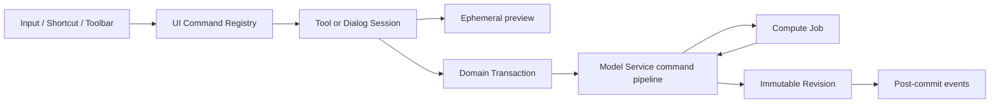
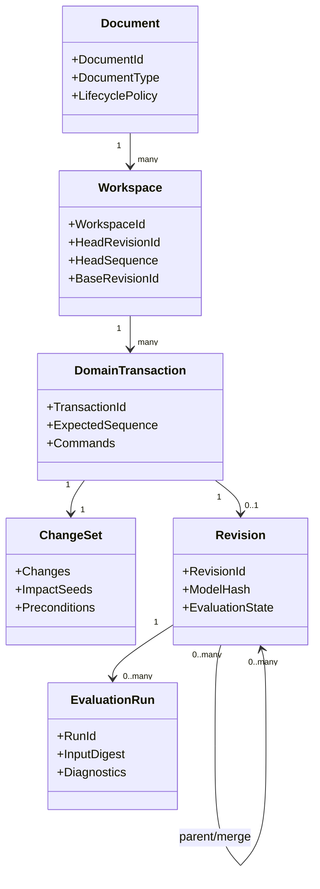
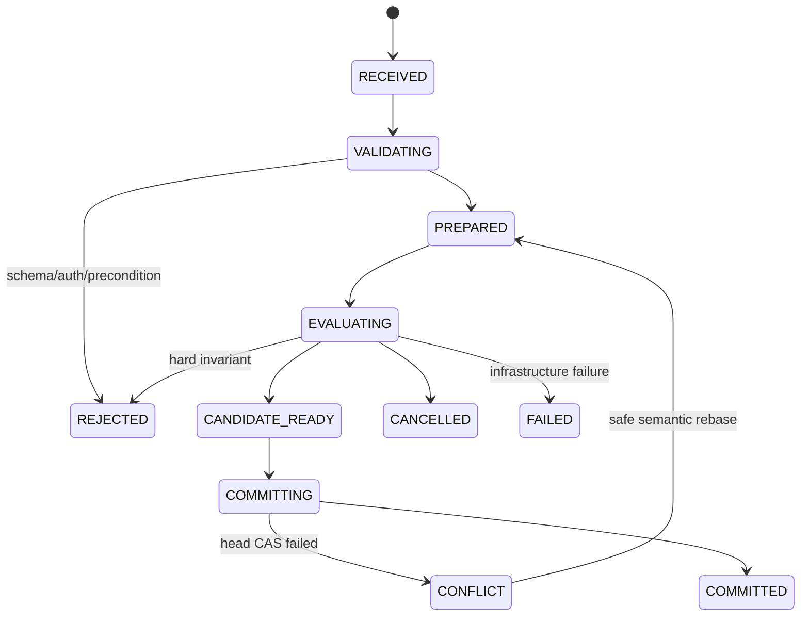
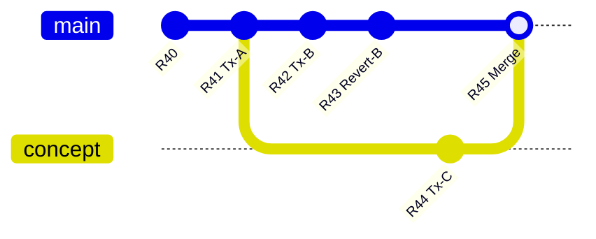

# 命令、事务与历史

> 目标契约，不等于已交付能力。返回[目标架构目录](../../TARGET_ARCHITECTURE.md)；当前事实见[当前架构](../../CURRENT_ARCHITECTURE.md)，实施顺序只在[统一路线](../../../plans/README.md)维护。

前述草图、实体、特征、曲面、装配和 DMU 设计只有建立在同一套编辑语义与参数依赖骨架上，才能成为一个 CAD 系统，而不是若干互不兼容的功能模块。本节定义 Model Service 与所有工作台共同遵守的核心协议。

### 4.3.1 设计目标与非目标

核心骨架必须同时满足：

- 一次用户意图形成一个可理解、可撤销、可审计的原子 Transaction；
- 已提交 Revision 不可变，任何 Undo、Redo、Restore、Merge 都产生新的历史事实或显式移动只读视图；
- 参数、公式、Feature、拓扑引用、Product occurrence 和仿真输入进入统一的 typed dependency model；
- 模型编辑与昂贵几何计算解耦，但不能发布未经指定 evaluator 验证的 Revision；
- 单人低延迟编辑、多人并发、跨会话历史和失败恢复使用同一语义；
- 模块新增命令不要求修改一个巨型 `switch`，插件也不能绕开权限、事务和求值门；
- 历史可长期读取，命令和模型 schema 可独立演进；
- 全局参数是版本化设计数据，不是藏在服务内存中的全局变量。

本节不把所有模型状态改造成 Event Sourcing，也不承诺任意跨文档修改都自动分布式强事务。几何 B-Rep、Mesh、求解器 warm start、UI selection、hover 和 camera 仍不是权威参数模型。

### 4.3.3 四种“命令”必须分层

| 层 | 示例 | 是否持久化 | 是否创建 Revision |
|---|---|---:|---:|
| UI Command | 打开 Pad 面板、Fit All、切换工作台 | 否 | 否 |
| Interaction Session | 草图拖拽、Manipulator move、特征参数实时预览 | 只保留临时 telemetry/lease | 否 |
| Domain Command | `part.feature.create`、`parameter.set_expression`、`assembly.connection.edit` | 是 | 成功接受时是 |
| Compute Job | 求值 Part、网格化、装配求解、DMU 分析 | Job/attempt 持久化 | 不直接创建业务 Revision |

前端 `CommandRegistry` 继续负责 enable/visible/active 和快捷键，但持久编辑必须构造 Domain Transaction。Interaction Session 可以调用 preview API，结束时只提交一次最终意图；Compute Job 只能返回制品和诊断，不能越过 Model Service 修改 Head。

工作台的 Toolbar 采用服务端维护的版本化 Presentation Catalog：目录拥有稳定 ToolbarId/CommandId、工作台与能力条件、顺序、默认停靠、图标语义键、短名称和上下文帮助引用；一个 ToolbarId 对应一个可命名的用户意图类别，不在单个大型栏中依靠视觉分隔符伪造多个职责。前端按目录装配，不为每个页面复制按钮清单。该目录不是远程代码或领域命令注册表：客户端仍必须拥有对应 CommandRegistry adapter，未知命令默认不可执行，服务端权限和 Domain Command validator 仍是最终边界。普通 tooltip 只承载短命令名；“这是什么？”模式读取详细帮助且必须截断当前点击的执行链。共享目录、组织策略与用户的本地布局/可见偏好分层存储，避免把个人拖动位置写成所有人的产品配置；捕捉、输入手势和显示单位属于跨工作台用户偏好，不作为重复 Toolbar 命令。文档级单位若影响协作语义必须进入版本化文档属性与 Domain Command；用户侧按文档显示覆盖只能改变格式和新输入，不能改写模型坐标或既有表达式。目录后续增加 locale、feature flag、role/capability predicate 时应提升 schema version，并以确定性契约测试保证旧客户端安全降级。



### 4.3.4 权威对象之间的关系



- **Command** 表达用户想做什么；
- **ChangeSet** 表达这个意图对 typed model property 造成什么语义变化；
- **Revision** 保存接受后的完整规范模型快照；
- **EvaluationRun** 证明某组 evaluator 对该模型及依赖快照求值的结果；
- **Event** 表达已经提交的事实，用于 WebSocket、索引、缩略图和集成，不作为核心模型唯一来源。

Revision 快照解决长期读取、恢复和快速打开；Command/ChangeSet 解决审计、语义合并与精确 Undo。两者并存，不选择“只存快照”或“只存事件”的极端。

### 4.3.5 Domain Transaction 协议

```proto
message DomainTransactionRequest {
  string transaction_id = 1;          // UUIDv7, client generated
  string request_id = 2;              // retry idempotency
  string document_id = 3;
  string workspace_id = 4;
  uint64 expected_head_sequence = 5;
  string expected_head_revision_id = 6;
  repeated DomainCommand commands = 7;
  EvaluationPolicy evaluation_policy = 8;
  optional string interaction_id = 9;
  optional string undo_group_id = 10;
  ClientContext client = 11;
}

message DomainCommand {
  string command_id = 1;
  string type_uri = 2;                // occccad://part/feature/create
  uint32 schema_version = 3;
  google.protobuf.Any payload = 4;
  repeated EntityPrecondition preconditions = 5;
}
```

一个 Transaction 可以包含多个同聚合命令，例如“创建草图 + 创建四条线 + 添加尺寸”，但必须有上限。命令顺序只在同一 Transaction 内有意义，handler 输出共同候选模型；任一命令 schema、权限、引用或强不变量失败则全部拒绝。

`request_id` 对租户/调用者全局幂等，重复 payload 返回原结果；相同 key 不同 payload 返回 `IDEMPOTENCY_KEY_REUSED`。`transaction_id` 是业务历史身份，不因网络重试变化。时间、actor、tenant、trace、客户端版本由服务端上下文补充，客户端不能伪造。

### 4.3.6 Command Handler Registry

```text
CommandHandler {
  type_uri
  supported_schema_versions
  target_document_types
  required_capabilities
  DecodeAndUpcast(payload)
  Authorize(actor, current_model, payload)
  Validate(current_model, payload)
  Apply(current_model, payload) -> ModelDelta + ImpactSeeds
  Describe(payload, locale) -> HistoryLabel
}
```

Handler 的 `Apply` 必须是确定性、无 I/O 的模型变换：不能访问数据库、网络、系统时间、随机数或 OCCT。所需 ID 在 command 中预分配；外部引用、选择描述符和依赖 Revision 在 Prepare 阶段解析并冻结后作为输入。几何可行性由后续 Evaluation 验证。

核心 handler 由进程内 registry 注册。插件命令使用 `type_uri + schema_version + plugin digest`，只能通过受控 Model Extension API 产生已登记 node/property；不能提交任意 JSON patch 修改未知字段。旧命令读取时 upcast 到当前内存模型，原始 payload 永久保留以供审计。

### 4.3.7 ChangeSet 是语义差异，不是数据库补丁

```proto
message ModelChange {
  ChangeKind kind = 1;                // CREATE | UPDATE | DELETE | MOVE | BIND
  EntityRef target = 2;
  optional PropertyPath property = 3;
  optional CanonicalValue before = 4;
  optional CanonicalValue after = 5;
  string before_digest = 6;
  string after_digest = 7;
  optional OrderAnchor order = 8;
  optional EntitySnapshot tombstone = 9;
}

message ChangeSet {
  repeated ModelChange changes = 1;
  repeated DependencyKey impact_seeds = 2;
  repeated Diagnostic diagnostics = 3;
  string canonical_digest = 4;
}
```

PropertyPath 使用 schema 登记的 field ID/semantic slot，不使用 JSON pointer、数组下标或显示名称。删除实体时保存最小完整 tombstone、原父级和顺序 anchor；MOVE 保存稳定前后邻居，不只保存整数 position。ChangeSet 由 handler 产生后重新应用到基准快照做 conformance 校验，确保它确实得到候选快照。

ChangeSet 的 before 值用于审计、冲突解释和补偿式 Undo，但不意味着任意机械反转都合法；Undo 仍要经过当前 schema、引用和求值验证。

### 4.3.8 命令执行状态机



数据库行锁不能覆盖 Worker 求值。Prepare 读取 `(workspace, head_sequence, head_revision)` 和依赖快照，构造候选模型后释放事务；Evaluation 在 Worker 执行；Commit 使用短 PostgreSQL 事务 CAS Head、写 Transaction/ChangeSet/Revision/Outbox。CAS 失败时只对可证明 commute 的 ChangeSet 自动 rebase，并重新验证/求值。

简单 metadata 命令可在一个同步请求中走完相同状态机；重 Feature 可返回 operation handle。客户端断线不会取消已进入 Commit 的事务，按 `request_id` 查询最终结果。

### 4.3.9 可提交的失败模型

CAD 必须允许用户修复模型，不能规定只有全绿几何才能形成历史。验证分三类：

| 级别 | 示例 | 是否提交 |
|---|---|---:|
| Structural hard error | 非法 schema、重复 ID、参数环、量纲错误、越权、引用类型错误 | 否 |
| Feature evaluation failure | 圆角因上游改变失败、拓扑选择消失、装配欠约束 | 是，Revision 标记 `PARTIAL/FAILED` 并带诊断 |
| Infrastructure failure | Worker crash、对象存储不可用、超时 | 不接受为已验证 Revision；可重试 |

失败 Feature 之后的依赖节点标记 `BLOCKED_BY_UPSTREAM`。允许显示上一成功 Revision 的几何作为 ghost/last-known-good，但必须带旧 `GeometryId` 和醒目的 stale 状态，不能冒充当前模型。Release/导出/仿真默认要求相应 Evaluation Gate 通过。

### 4.3.10 Event 与 Outbox 边界

Commit 同一数据库事务写入 Outbox，例如：

- `workspace.transaction.committed.v1`；
- `document.revision.created.v1`；
- `model.dependencies.changed.v1`；
- `evaluation.completed.v1`；
- `publication.contract.changed.v1`。

事件携带 tenant、document/workspace、sequence、revision、transaction、actor、model/change digest 和 schema version，不内嵌大模型。消费者至少一次处理并以 event ID 幂等；Search/BOM/thumbnail/realtime projection 可以重建。核心 Head 变更不得依赖“稍后消费事件”才能成立。

### 4.3.11 Preview 与最终提交

拖拽、尺寸输入和操纵器使用 `InteractionSession`：

```text
BeginInteraction(base_revision, selection_snapshot)
UpdatePreview(ephemeral parameters / drag target, monotonic preview_seq)
CommitInteraction(final DomainTransaction)
CancelInteraction()
```

Preview 结果带 `PREVIEW` 水印语义和短 TTL，不进入 Revision/Undo/Outbox。服务端可以丢弃中间 `preview_seq`，客户端 WASM/本地求解也只是非权威预测。Commit 必须包含最终值而不是鼠标轨迹。若 preview 是服务端权威 evaluator 产生的 verified candidate，且 actor、document、base revision/sequence、规范 typed command digest、依赖快照和 evaluator policy/build 全部精确匹配，Commit 可以一次性提升该候选并只执行短事务 CAS；任何字段不匹配、token 过期、进程丢失或 Head 前移都必须重新求值。客户端近似预览永远不可提升。

Interaction 编排状态使用 `IDLE → DRAFTING → PREVIEWING → READY → COMMITTING → COMMITTED`，并允许从活动状态进入 `CANCELLED`、从 preview/commit 进入带 phase/code/retryable 的 `FAILED`。状态机只管理生命周期、取消、sequence 和结果采纳；Domain Command、Revision、Job 与 solver status 保持各自权威，不能混成第二套持久状态。连续 preview 可以按稳定 `interaction_id` 复用服务端 warm start，但 nominal input 与最终摘要仍取自 base Revision。

视觉连续性位于权威状态与 Render Object 之间的独立 transition 层，不进入 Interaction、Domain Model 或 Revision。指针直接操控必须逐输入帧即时响应；异步 solver preview、约束带动的其他 occurrence、取消回滚、提交和 Realtime reconciliation 才使用短时、可取消、可重定向的语义动画。同一求解结果的全部 occurrence 必须批量共享进度时钟，不能各自启动会相位漂移的大量 RAF。Placement 以稳定 occurrence identity 关联，采用 translation/scale 插值和 quaternion 最短弧插值，禁止逐元素插值 matrix。新权威目标总是从当前渲染帧接续并最终精确落点；删除、跨文档切换、初次加载和 reduced-motion 直接 snap。动画完成、取消或浏览器中断不得改变命令采纳、preview sequence、CAS 或历史结果。

连续键盘输入、spinner 和拖拽通过显式 `undo_group_id` 合并为一个 Undo 项；服务端不以“500ms 内发生”之类时间猜测用户意图。进入另一工具、改变选择或显式结束后 group 关闭。同组 Transaction 仍逐条保留审计和 sequence；Undo 时按反向顺序组合成一个 Revert 候选，只有同 actor、同 Workspace、连续祖先链且所有补偿都安全时才原子提交，不能通过分组改写既有历史。

### 4.3.12 Workspace 历史模型

每个 Workspace 是一条追加式 Transaction log 和一个 Head；Revision 形成有向无环历史图，普通提交一个 parent，Merge 两个 parent。历史条目永不因 Undo 后的新编辑而删除。



“查看历史点”只改变客户端 `view_revision_id`，不移动 Workspace Head。“创建 Version/Release”是在某 Revision 上建立不可变命名标记。“从此处创建 Branch”产生新 Workspace。三者都不能与 Undo 混为同一 cursor。

### 4.3.13 Undo 的权威语义

Undo 默认指：在当前 Workspace/编辑上下文中，撤销当前 actor 最近一个仍可撤销的 Domain Transaction。服务端创建新的 `RevertTransaction(original_transaction_id)`，把原 ChangeSet 的 before intent 应用于当前 Head，然后形成新 Revision；旧 Revision 和其他人的后续提交不消失。

可逆且只修改当前 Workspace 参数模型的普通编辑默认直接执行，不用确认对话框打断用户；Delete、Suppress、Reorder 等入口应保持单一动作，并通过统一 Undo/Redo 恢复。多选上的一个动作必须形成一个原子 Domain Transaction，不能在客户端拆成多个 Revision。确认只保留给 Undo 无法覆盖的外部副作用、已发布/外部数据破坏、权限或兼容边界变化等不可逆操作。

Revert 算法：

1. 找到原 Transaction 及其有效 ChangeSet，确认未被同一 undo chain 撤销；
2. 对每个 target 比较当前 digest、原 before/after digest 和 lineage；
3. 若当前仍等于原 after，安全恢复 before；
4. 若属性被后续命令改变，返回字段级 `UNDO_CONFLICT`，不覆盖他人结果；
5. CREATE 的撤销是删除仍可证明同一 identity 的对象；DELETE 的撤销用 tombstone 恢复并验证 ID/父级/引用；
6. Feature reorder 通过 anchor 恢复；若 anchor 已删除，返回候选位置；
7. 生成普通候选模型，执行完整依赖验证、求值与 CAS；
8. 记录 `reverts_transaction_id`，而不是伪造原命令从未发生。

可选 `LOCAL_SINGLE_USER_FAST_UNDO` 只是在确认 Workspace 没有其他写者、没有外部 observer 依赖且尚未发布时优化 UI；持久语义仍等价于 Revert，不建立第二套历史模型。

### 4.3.14 Redo、Restore 与 Reset 的区别

- **Redo**：只对最近由当前 actor Undo 且此后未发生破坏性冲突的 Transaction，重新应用原始意图/after ChangeSet，形成 `ReapplyTransaction` 新 Revision；不是把 Head 指针移动到旧节点。
- **Restore**：选择任意历史 Revision，把其完整模型作为 source，与当前 Head 做 scope-aware replace，提交 `RestoreTransaction`；用于跨多个命令恢复，并保留 Restore 之前历史。
- **Branch from revision**：从历史点创建新 Workspace，适合探索替代方案。
- **Reset/force move Head**：仅管理员维护工具或未共享临时 Workspace 可用，必须审计；普通 CAD UI 不暴露破坏式 reset。

多人环境下 Undo 列表按 actor、document tab/working scope 和 transaction kind 过滤，但用户可以在 History 面板显式选择任意有权限 Transaction 执行 Revert。Onshape 同样区分个人 Undo 与把 Workspace 恢复到历史点；其追加历史/不可变 Version 思路与本设计一致。[Onshape Document Management](https://cad.onshape.com/help/Content/Document/document_management.htm) [Onshape Restore](https://cad.onshape.com/help/Content/Document/restoring.htm)

### 4.3.15 为什么不以反向命令或 OCAF Undo 栈作为云端真相

“Pad 的反向命令是 DeletePad”只在没有后续引用时成立；删除/替换/重排、拓扑 lineage、装配 Publication 和跨文档引用都会使手写 inverse command 失真。ChangeSet before image + 当前状态 precondition 更适合生成可靠补偿。

OCCT OCAF 提供 Open/Commit/Abort transaction、依赖机制和多级 Undo/Redo，证明事务边界必须从应用设计早期建立；但标准 OCAF Undo 信息主要是进程内文档机制，默认不会随文档跨会话持久化。因此 occccad 借鉴其“所有数据修改位于命令事务”和稳定 attribute identity 思想，不把 TDocStd undo stack 当作分布式 Workspace 历史。[OCCT OCAF User Guide](https://dev.opencascade.org/doc/overview/html/occt_user_guides__ocaf.html) [TDocStd_Document](https://dev.opencascade.org/doc/refman/html/class_t_doc_std___document.html)

### 4.3.16 Feature Rollback Bar 不是 Undo

Part 的 Feature Rollback/Insert Here 是模型内 `EvaluationTip`：它控制哪些 Feature 参与当前求值，以及新 Feature 插入位置。移动 tip 是可持久 Domain Command，可 Undo；它不改变 Workspace 历史 Head，也不删除 tip 之后 Feature。暂停重生成同样是编辑策略，不是历史回退。
