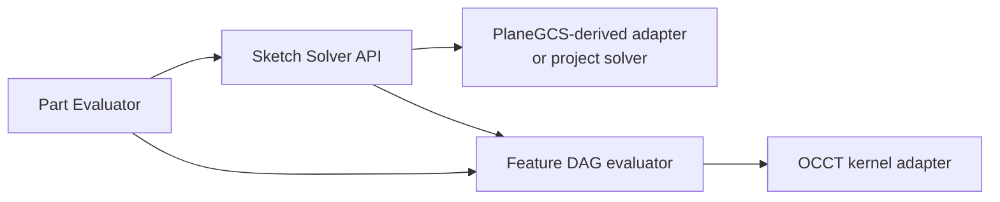

# 计算模块与进程边界

> 目标契约，不等于已交付能力。返回[目标架构目录](../../TARGET_ARCHITECTURE.md)；当前事实见[当前架构](../../CURRENT_ARCHITECTURE.md)，实施顺序只在[统一路线](../../../plans/README.md)维护。

## 5.1 推荐边界

| Worker | 是否独立进程 | 核心输入/输出 | 原因 |
|---|---|---|---|
| Part Evaluation | 是 | Feature Graph + upstream artifacts → B-Rep/manifest | OCCT 重内存、崩溃隔离、按 Part 并行 |
| 2D Sketch Solver module | **同 Part Worker 部署**，内部独立库 | Sketch entities/constraints → solved parameters/diagnostics | 与 Feature 求值高频交互；单草图很小，远程 RPC 得不偿失 |
| Tessellation | 初期嵌入，规模后独立 | B-Rep + quality profile → GLB/mesh/topology map | 可独立缓存，多 LOD、高并发、与 B-Rep 修改无关 |
| Exchange | 初期复用 Geometry，隔离需求触发独立 | STEP/IGES 等不可信文件 ↔ canonical model/artifacts | 解析风险、长耗时、格式依赖和资源限制不同 |
| Assembly Solver | 独立算法库；规模/隔离证据触发独立 Worker | instance graph + mates + datums → transforms/residuals | 稀疏非线性问题、独立扩缩容、不应携带完整 B-Rep |
| Interference/Mass | 独立 | assembly placements + geometry proxies → reports | 可批量/并行、内存大、通常异步 |
| Drawing | 后期独立 | revision + view spec → vector drawing | HLR/投影负载和发布节奏不同 |
| CAM/CAE | 插件式独立 Worker | immutable revision + setup → toolpath/result | 安全、许可证、GPU/HPC 与领域依赖隔离 |

## 5.2 为什么二维草图不做远程独立 Worker

草图求解器在代码结构上必须独立于 OCCT：拥有自己的实体、约束、自由度诊断、Jacobian 和序列化接口。但默认与 Part Evaluation Worker 同进程。

理由：拖拽时求解频率可达每帧多次，草图输出立刻影响 Profile/Feature；拆成网络服务会引入序列化、排队和网络抖动，而且无法带来有意义的跨草图并行。浏览器可以运行一个非权威的 WASM preview solver 提升拖拽体验，但提交后必须由服务端同版本求解器验证。

拆分触发条件只有两个：求解器需要独立 GPU/HPC 资源，或第三方许可证要求进程隔离。即使触发，也应保持可嵌入实现用于小草图。
