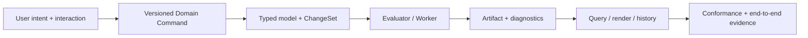

# 决策触发、验证与交付

> 目标契约，不等于已交付能力。返回[目标架构目录](../../TARGET_ARCHITECTURE.md)；当前事实见[当前架构](../../CURRENT_ARCHITECTURE.md)，实施顺序只在[统一路线](../../../plans/README.md)维护。

## 16. 架构决策触发条件

| 决策 | 现在 | 何时改变 |
|---|---|---|
| 业务模块化单体 | 保持 | 团队/发布/扩缩容/安全边界至少一项独立且持续成为瓶颈 |
| PostgreSQL Jobs | 按负载保持 | 多队列公平、跨区域、高吞吐事件或复杂工作流超过简单租约模型 |
| Sketch Solver 同进程 | 保持 | 许可证隔离或特殊算力需求；不能仅因“微服务化”拆分 |
| Tessellation 嵌入 Geometry | 短期保持 | 多 LOD/高并发占用主求值容量或需要 GPU |
| 本地 ArtifactStore | 仅开发 | 首个跨主机/多副本生产部署前必须替换 |
| Three.js WebGL2 | 保持兼容基线 | WebGPU 覆盖目标浏览器且性能数据证明收益 |
| OCCT 版本 | 固定可复现 | 新版本通过完整 corpus、STEP、性能和拓扑回归后升级 |

## 17. 验证体系

架构可持续性的核心不是图，而是可重复验证：

- **Geometry corpus**：退化边、微小特征、复杂布尔、曲面、导入脏数据；
- **Metamorphic tests**：平移/旋转/单位转换不改变拓扑语义；
- **Golden artifacts**：不要求二进制逐字相同，但比较体积、bbox、拓扑、签名和可视差异；
- **Solver tests**：自由度、冗余/冲突最小集、拖拽连续性、装配闭环；
- **Failure injection**：Worker OOM、消息重复、对象上传后断网、数据库 failover；
- **Scale benchmarks**：Feature 数、实例数、唯一 Geometry 数、并发用户、对象大小；
- **Compatibility**：旧 Revision/Proto/Feature schema 在新 Worker 上重放；
- **Security**：恶意 STEP、压缩炸弹、越权 signed URL、租户逃逸。

验证入口应形成可升级的证据层级：具体 test match → 所属模块 → 受影响集成 → 全仓。match 只能缩小一个已知域的反馈环，不能代替公共行为的模块/集成验证；dry-run plan 应能解释 scope 与底层命令。局部实现默认不承担无关语言和领域的完整成本；公共 Proto、数据库 schema、Revision/history、共享构建系统和跨语言边界必须保守升级。Agent-facing 命令成功时只保留步骤与耗时摘要；失败时终端可有界提取高信号，但完整原始诊断必须保存并返回可复制的底层命令。这只约束开发命令呈现，不降低生产/开发运行时 observability。changed-file routing 是便利层而不是正确性证明，无法确定所有权时必须升级而非猜测。

## 18. 明确不做的事

- 不把 Worker 内存当数据库；
- 不把 OCCT `TopoDS_Shape`、指针或 local topology ID 放入持久协议；
- 不把 B-Rep 大对象通过事件总线广播；
- 不用 Redis 锁代替数据库一致性；
- 不在浏览器执行最终权威求值；
- 不承诺任意并发 CAD 命令都能自动 CRDT 合并；
- 不在模型核心成熟前先拆几十个业务微服务；
- 不把 Kubernetes 默认 Scheduler 当 CAD cache-aware Scheduler；
- 不静默修复拓扑歧义或装配冲突；
- 不以候选库的存在替代许可证、正确性和维护能力评估。

## 19. 从架构到开发

## 19.2 新模块详细设计模板

任何新增 CAD 模块、Worker 或重要平台能力，在实现前至少回答下列问题。简单能力可以在 Issue/PR 中精简回答；复杂领域应在本文对应章节形成完整设计。

1. **能力与场景**：用户要完成什么；对标范围、非目标、P0/P1/P2 和可验证完成条件是什么；
2. **当前基线**：仓库已有的类型、调用链、数据和兼容负担是什么，不能把目标当成现状；
3. **领域语义**：稳定实体、值对象、身份、作用域、单位、状态、不变量和生命周期；
4. **命令与历史**：Domain Command、Transaction 粒度、ChangeSet、幂等、Undo/Redo、并发 read/write set；
5. **依赖与参数化**：PropertySlot、Parameter/Expression、typed dependency edges、dirty 分类和环边界；
6. **求值与算法**：输入、输出、阶段、分支意图、容差、确定性、增量策略和失败模型；
7. **边界与调用**：哪些在 Model Service、浏览器、现有 Worker、独立 Worker；为什么需要网络边界；
8. **持久化与制品**：Revision 中保存什么，哪些是可重建 cache，digest/provenance/GC 如何处理；
9. **协议与兼容**：versioned schema、capability negotiation、旧数据 adapter、升级/回滚和外部格式；
10. **诊断与交互**：preview 与权威结果、错误代码、证据、repair/rebind 和可访问的 UI 状态；
11. **质量属性**：性能规模、资源上限、取消、崩溃隔离、安全、权限和可观测性；
12. **验证**：unit/conformance/golden/metamorphic/fuzz/integration/failure/scale/compatibility corpus；
13. **开源技术分析**：候选库职责、许可证、限制、适配层、基准和退出方案；
14. **实施路线**：最小垂直切片、阶段门、风险最高的 spike，以及哪些内容明确延后。

设计不需要为了填模板制造无价值章节；若某项不适用，应简述原因。相反，涉及稳定身份、单位、选择、历史、外部依赖和几何失败的模块不得省略相关设计。

## 19.3 垂直切片交付方式

一个有效切片应从用户意图贯穿到可验证结果，而不是只完成一层：



推荐优先选择能同时验证最多核心风险的薄切片。例如通用 Distance Constraint 不只是增加一个 Solver 方程，还要覆盖 Parameter binding、单位、Command、Undo、dirty propagation、Profile 更新、诊断和适用的 schema 验证。允许使用边界明确的 transport adapter 或单机部署，但领域契约要能演进到目标边界。

## 19.4 Definition of Ready

进入正式实现前应具备：

- 已定位本文对应能力与平台不变量，明确当前代码入口和现状差距；
- 用户场景、范围、非目标和至少一个失败场景清楚；
- 稳定身份、权威数据、API/Worker 边界和兼容策略没有关键歧义；
- 风险最高的算法/许可证/性能假设已有证据或安排 time-boxed spike；
- 验收测试和完成条件能够在实现前表述；
- 对既有未提交改动、迁移和跨模块影响有明确处理方案。

小型、低风险、局部变更不需要额外设计会议；Agent 或开发者可以依据本文和代码直接实施。只有会改变平台不变量、持久协议、跨服务一致性或用户数据迁移的决策才需要先升级架构讨论。

## 19.5 Definition of Done

模块“完成”至少意味着：

- 功能行为、错误行为和非目标均与相应阶段契约一致；
- 领域类型不泄漏第三方内核对象，ID/单位/版本/容差/分支语义明确；
- 持久命令幂等、可审计、可 Undo，CAS/重试/迟到结果不会覆盖新 Head；
- 权威模型可清缓存重建，增量结果与全量结果语义等价；
- 失败提供稳定 error code、对象定位和证据，不静默替换设计意图；
- 已承诺兼容的 Revision/协议通过兼容测试；未发布阶段按唯一 schema 与空库验证，发布后迁移可恢复或可安全重试；
- 测试覆盖该模块风险，而不只是提高行覆盖率；关键 corpus 可在 CI 重复运行；
- 性能、资源、安全和可观测性达到当前阶段门，或有明确记录的限制；
- 对应服务 README、当前架构和本文按事实变化同步更新；
- 没有为未来假设添加未使用的抽象，也没有把已知平台债务藏在临时旁路中。

## 19.6 设计追溯

重要变更应能形成以下链路：

```text
Capability / user scenario
  -> architecture section and invariant
  -> Domain Command / schema / evaluator capability
  -> implementation modules
  -> tests, corpus and operational signals
  -> migration and documentation evidence
```

不强制维护庞大需求编号系统。Issue/PR 描述只需引用本文稳定章节标题并列出实现与验证证据；当章节移动时使用语义标题定位。发布级能力应有机器可查询的 capability/version，而不是依赖文档声称“支持”。

## 19.7 架构变更流程

以下变更必须先分析其架构影响：

- 新增/改变持久身份、Revision/Workspace/Transaction 语义；
- 修改公开 Proto、Artifact Manifest、GeometryId 或外部格式承诺；
- 引入跨文档写、隐式依赖、强一致性边界或新的网络服务；
- 变更单位、容差、拓扑选择、求值顺序或确定性策略；
- 引入第三方求解器、内核、运行插件或许可证边界；
- 删除旧 schema、迁移路径或安全隔离。

架构变更记录直接维护在本文相关章节和 Git 历史中，至少说明：背景、决策、替代方案、影响、不兼容点、迁移、验证和回退。为保持文档集中，默认不新增零散 ADR 文件；只有某决策需要独立长期审计且无法清晰嵌入本文时才例外。

候选技术的版本升级、部署规模和性能阈值可以依据基准快速调整，只要不改变领域语义。若实践证明本文方案过度复杂，应优先删除抽象并更新本文，而不是保留两套等价机制。

## 19.8 文档维护与周期性复核

- 根与 local `AGENTS.md` 只保存稳定行为、不变量、导航和验证入口；模块 README 保存当前职责/接口/运行；本文件保存长期领域语义与跨模块决策；短期任务状态留在 Issue/会话，不形成第三份架构书；
- focused architecture projection 可以为高频横切主题提供短入口，但必须链接本文件或 Current Architecture 的 canonical 章节，避免复制易漂移事实；只有 router 数据证明长文档仍被反复整读时才新增；
- AI Agent 使用 Search → Read → Expand → Architecture：先定位所属模块、符号和邻近测试，只有任务触及稳定身份、Revision/history、数据库、公共协议、Worker/服务一致性或新 CAD 领域抽象时才按 `docs/README.md` 扩展架构上下文；
- 每次功能合并同时检查：当前事实所属分册是否应更新，目标决策是否变化，所属 README 是否变化；
- 本文只保留仍有效的目标设计，过时方案应删除或在迁移说明中明确替代关系，不积累“历史提案坟场”；
- Mermaid 图与正文必须表达同一边界；图只展示重要关系，不承担未说明的语义；
- 外部库版本、许可证和能力属于易变信息，在真正引入/升级时重新查证；
- 每个主要里程碑复核章节交叉一致性、路线阶段和“明确不做的事”；
- 当实现达到目标章节描述后，把事实同步到现有架构，但不要从目标文档删除仍需长期遵守的平台契约。

本文的价值不在篇幅，而在于让产品意图、领域语义、分布式边界和验证证据保持一致。后续设计可以更优、更简洁，但必须对用户数据和工程语义负责。
