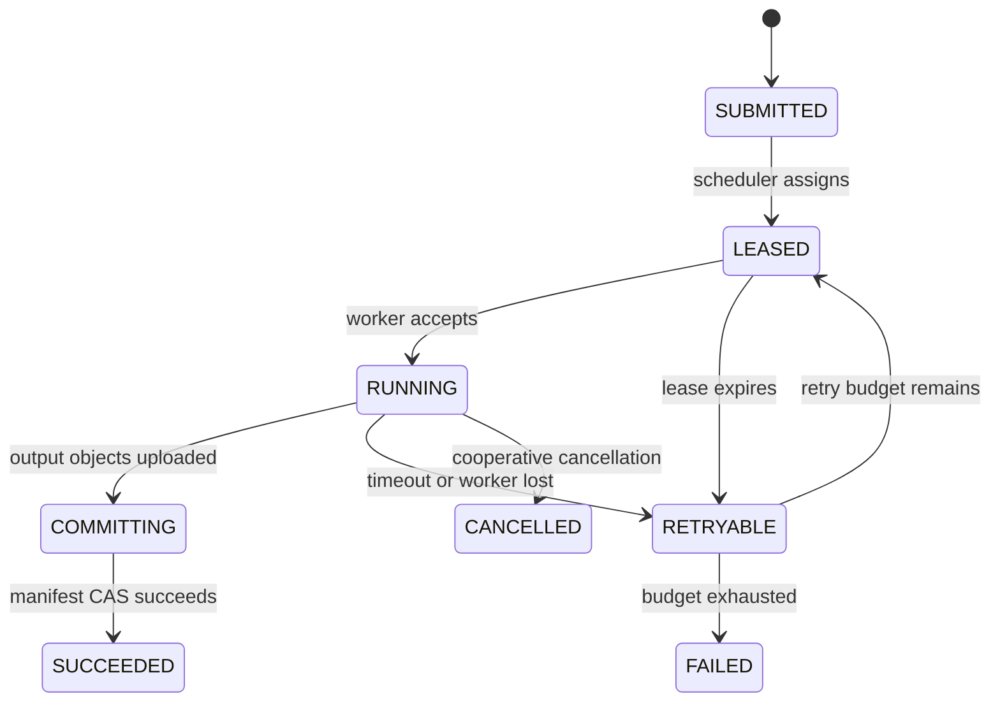
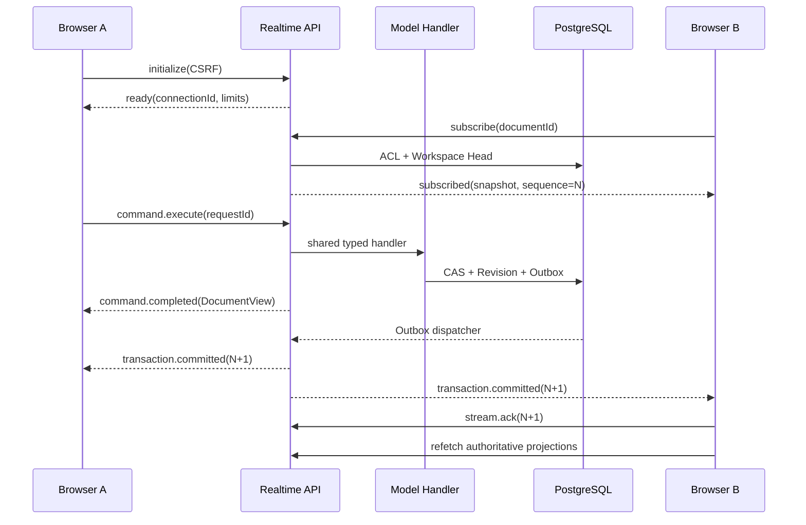
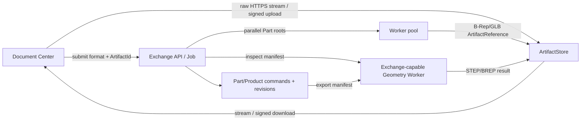
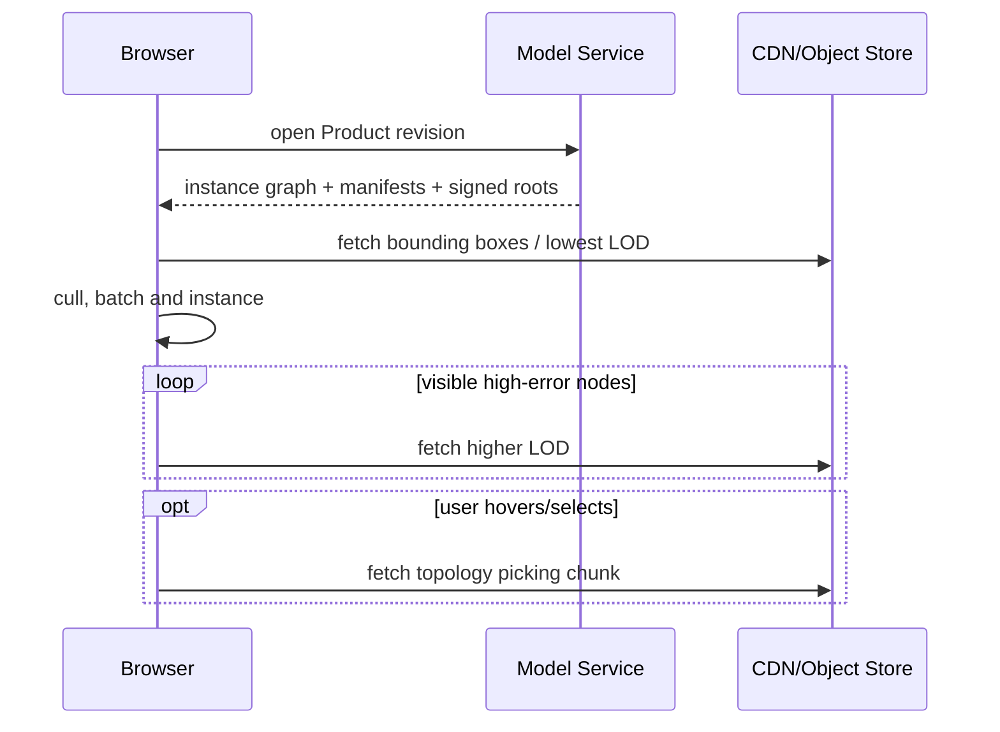
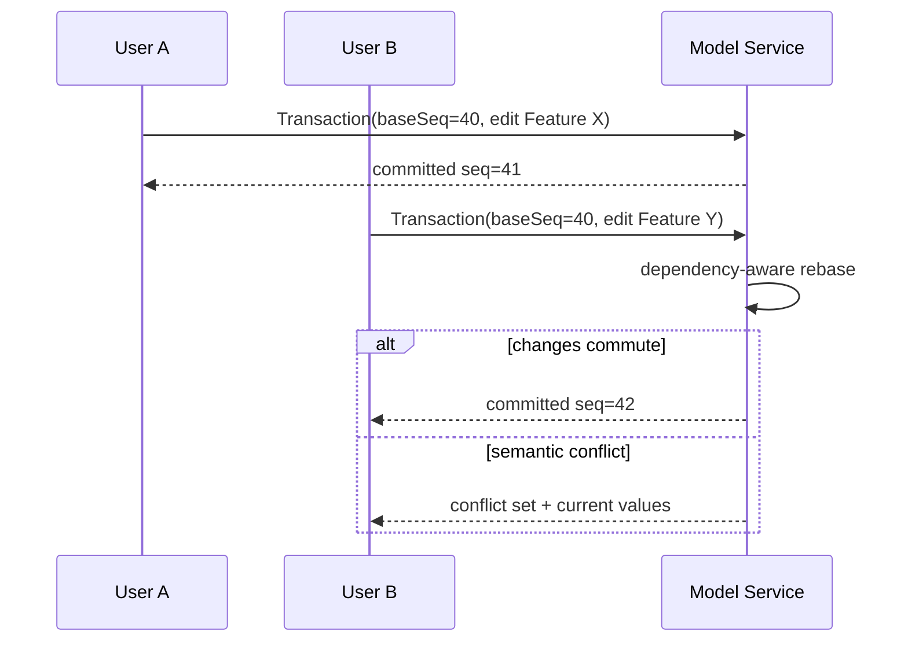

# 调度、通信、存储与制品

> 目标契约，不等于已交付能力。返回[目标架构目录](../../TARGET_ARCHITECTURE.md)；当前事实见[当前架构](../../CURRENT_ARCHITECTURE.md)，实施顺序只在[统一路线](../../../plans/README.md)维护。

## 6. Scheduler、Registry 与数据局部性

Kubernetes 负责容器放置与副本生命周期；CAD Compute Scheduler 负责领域级任务选择、缓存亲和、配额和结果提交，两者不能混为一层。

调度评分建议为：

```text
score = artifact_locality + warm_kernel + capability_match
      + tenant_fairness + deadline_priority - queue_delay - memory_pressure
```

Worker 通过租约注册：capabilities、kernel build digest、solver versions、CPU/RAM/GPU、resident artifact bloom/filter、current load。Scheduler 只发 immutable input manifest 和 signed object URLs，不传数据库凭证。

几何驻留和亲和的最小单位是不可变 Body GeometryId，而不是 DocumentId、面选择或 Product occurrence。一个 Body 的 B-Rep、拓扑索引和派生查询缓存必须由同一 owner Worker 原子管理；首次冷加载期间也要预留 owner，避免并发请求重复解析。多 Body Part 可以按 BodyGeometryId 独立调度，Product 中引用相同 Part/Body 的 occurrence 共享几何驻留，只携带各自 InstancePath/Transform。跨节点生产调度使用带租约的 owner/replica 记录；只有显式 eviction、内存压力策略或 Worker 失联才能解除绑定，且客户端必须能从 Artifact 重建。



任务结果提交使用 compare-and-set：只有当前 attempt token 能把 manifest 标为成功；迟到 Worker 上传的对象允许成为未引用内容，后续 GC 清理。这样实现“效果唯一”，不依赖消息中间件声称的 exactly-once。

Kubernetes 使用 node pool/taint 区分普通 Go、内存型 OCCT、GPU/CAE 节点，并用 topology spread 跨故障域部署控制面。官方文档支持通过节点标签、taint 和 topology spread 控制放置。[Kubernetes 调度文档](https://kubernetes.io/docs/concepts/scheduling-eviction/)

## 7. 通信协议

## 7.1 结论：双平面而不是 WebSocket 全面替代 REST

WebSocket 对服务端主动推送、低延迟双向消息、同文档订阅、在线状态、交互预览和任务进度有明显优势；单靠 REST 若不轮询、长轮询或 SSE，无法及时把另一用户已经提交的操作送到当前浏览器。但 WebSocket 不是更好的通用文件/资源协议：登录和管理 CRUD 需要清晰的 HTTP 状态与审计边界，GET 需要缓存和条件请求，STEP/GLB/B-Rep 需要流式上传下载、Range/CDN/signed URL，健康检查还需要负载均衡器直接理解。

因此目标不是把所有 HTTP 包进一个长连接，而是共享同一领域层的两个 transport：

- **REST 控制与制品面**：认证、管理 CRUD、首次查询、健康检查、上传下载和 signed URL；
- **WebSocket 实时消息面**：版本化请求/响应、Document/Workspace 订阅、已提交事件、异步进度、presence 和短期 interaction preview；
- 两个入口必须调用同一个 typed Command Handler、ACL、幂等表、Workspace CAS 和 Outbox，不能分别实现业务规则；
- 大 payload 只在消息中携带 ArtifactId/URL/digest，不通过 WebSocket 搬运 B-Rep、GLB 或 STEP。

浏览器标准 `WebSocket` 没有应用级 backpressure，接收方过慢可能造成缓冲和内存压力；`WebSocketStream` 虽提供 backpressure，但仍是非标准实验能力。因此服务端必须使用有界发送队列，并在队列满时断开慢消费者，让其重连并恢复权威快照，而不是无限缓冲。[MDN WebSocket API](https://developer.mozilla.org/en-US/docs/Web/API/WebSockets_API) [MDN WebSocketStream](https://developer.mozilla.org/en-US/docs/Web/API/WebSocketStream)

## 7.2 统一消息 Envelope

当前 JSON 子协议固定为 `occccad.realtime.v1`，握手通过 `Sec-WebSocket-Protocol` 协商。每条应用消息都是完整 Envelope，不依赖 WebSocket frame 边界之外的隐式上下文：

```text
RealtimeEnvelope
  protocol: "occccad.realtime.v1"
  id: UUID
  kind: request|response|event|ack|error
  type: versioned.message.name.v1
  correlationId?: request.id
  sequence?: Workspace sequence
  sentAt: RFC3339Nano
  payload?: typed JSON object
  error?: { code, message, retryable }
```

同步请求由 `response/error.correlationId` 完成；异步事件使用稳定 event type 和 Workspace sequence；`ack` 表示客户端已处理到的序列位置，不等价于业务事务提交。当前消息目录：

| 消息 | 方向 | 语义 |
|---|---|---|
| `connection.initialize.v1` / `connection.ready.v1` | C→S / S→C | CSRF 初始化、连接能力与心跳参数 |
| `document.subscribe.v1` / `document.subscribed.v1` | C→S / S→C | ACL 校验、订阅 main Workspace，并返回权威快照与 sequence |
| `document.unsubscribe.v1` | C→S | 释放文档订阅 |
| `workspace.command.execute.v1` / `workspace.command.completed.v1` | C→S / S→C | 执行现有 typed Domain Command；request ID 仍是幂等 identity |
| `workspace.transaction.committed.v1` | S→C | Outbox 中的持久提交事实与 sequence |
| `stream.ack.v1` | C→S | 单调确认已处理 sequence |
| `request.failed.v1` | S→C | 稳定错误 code、可重试提示与 correlation |

## 7.3 连接、顺序与恢复



- WebSocket/TCP 只保证当前连接内有序传输，不提供业务 exactly-once；RFC 6455 允许中间层拆分/合并 frame，因此应用只按完整 message 和 envelope 解释数据。[RFC 6455](https://www.rfc-editor.org/rfc/rfc6455)
- Domain Command 依靠持久 `request_id + payload digest` 幂等；事件依靠 Outbox 在事务提交后产生，客户端按 Workspace sequence 去重。
- 客户端发现 sequence gap、发送队列溢出、网络切换或进程重启时，不猜测缺失 patch：指数退避重连、重新订阅、获取权威快照，再继续接收事件。
- 服务端每 25 秒发送 Ping，60 秒未收到 Pong 判定失联；单连接一条 reader loop 和一条 writer loop，遵守 Gorilla WebSocket 的并发约束。[Gorilla WebSocket concurrency](https://pkg.go.dev/github.com/gorilla/websocket#hdr-Concurrency)
- 当前每连接发送队列上限 128 条、单消息上限 1 MiB。事件只携带小型变更事实；几何和大列表通过 REST/Artifact 协议读取。

## 7.4 安全、权限与协作语义

- Upgrade 使用现有 HttpOnly session cookie；连接后必须以可读 CSRF cookie 完成 `connection.initialize.v1`，服务端同时校验 Origin/允许列表；
- 每次 subscribe 和 command 都重新检查资源 ACL，不能因为连接建立时有权限就永久信任；
- 同一 Workspace 的并发提交仍由 Head/sequence CAS 决定。实时传输让冲突更快可见，但不会自动把两个不兼容 Feature edit 合并；后续 semantic rebase 必须位于 Model 层；
- `workspace.transaction.committed` 是持久事实。Presence、光标、预选和拖拽 preview 是带 TTL、限频、可丢失且不得进入 Revision/Undo 的 ephemeral message；提交后必须由权威 evaluator 替换 preview；
- 当前实现让另一浏览器实时看到“已提交操作”的结果，不宣称已经实现逐像素鼠标轨迹共享、OT/CRDT 或多人草图求解。

## 7.5 单机实现与横向扩展边界

当前模块化单体使用 PostgreSQL Outbox 轮询并向进程内 subscription hub 扇出，适合一个 API 实例。断线客户端通过 snapshot 恢复，不要求服务端为每个浏览器永久保存消费游标。

扩展到多个 API/Realtime 实例时，不能让某实例独占 Outbox 后只通知本机连接。届时 Outbox Publisher 把事件发布到按 tenant/document 分区的 Event Bus，每个 Realtime 实例建立独立 consumer/fanout subscription；sticky session 只是优化，不是正确性条件。Presence 可以放 Valkey TTL，持久 Workspace event 仍来自 PostgreSQL/事件总线。引入总线前应先有多实例和吞吐证据。

| 路径 | 协议 | 用途 |
|---|---|---|
| Browser → Gateway | HTTPS JSON/REST | 认证、CRUD、短查询、上传下载；发布 OpenAPI |
| Browser ↔ Realtime | WebSocket | 命令请求响应、订阅、workspace events、presence、selection、job progress |
| Service → Service | gRPC/Protobuf | 低延迟 typed query/command |
| Control → Event Bus | Protobuf events | 事务后事件、索引、通知、审计 |
| Scheduler → Workers | JetStream work queue + gRPC control | 持久任务与取消/心跳 |
| Any → Artifact | HTTPS/S3 signed URL | 大 B-Rep/GLB/STEP/result，不穿过 gRPC |

Proto 规则：包名包含 major version；字段只追加；保留删除字段号；所有请求有 `request_id`、`idempotency_key`、`tenant_id`、deadline 与 trace context；Worker 用 capability negotiation 声明可处理的 schema/feature 类型。

NATS JetStream 适合作为轻量开源事件和工作队列基线，支持 work-queue retention；仍应按至少一次设计并配置最大投递次数与死信处理。[JetStream 文档](https://docs.nats.io/nats-concepts/jetstream)

Temporal 只在出现多日工作流、补偿、人工步骤、跨服务扇出等复杂度后引入；它提供可恢复工作流执行，但对当前三个任务类型过重。[Temporal 文档](https://docs.temporal.io/)

## 8. 存储架构

## 8.1 PostgreSQL

保存租户、IAM 映射、Document、Workspace、Revision metadata、Command/Transaction、引用图、ACL、Job 状态、Artifact metadata、Outbox 和审计。生产采用 HA、PITR、连接池和分区；租户隔离在应用策略与 PostgreSQL RLS 双层验证。

大型 JSON Feature Graph 初期可用 JSONB + schema version，成熟后把高查询价值的引用/参数索引关系化。不能把所有 B-Rep 放入 bytea，也不能让 Worker 直接更新领域表。

## 8.2 S3 兼容对象存储

保存不可变 B-Rep、STEP、GLB、LOD、拓扑映射、缩略图、仿真与工具路径。对象键基于内容摘要；Metadata 服务管理引用、保留策略、legal hold 与 GC mark/sweep。

开源自托管基线可评估 SeaweedFS 或 Ceph RGW；SeaweedFS 提供 Apache 许可的 S3/文件存储与水平扩展能力。[SeaweedFS 项目](https://github.com/seaweedfs/seaweedfs) 选择必须经过故障注入、纠删码、小对象、备份恢复和 S3 兼容测试，而不是写死供应商。

## 8.3 Redis

Redis/Valkey 只用于可丢失数据：presence、短期 rate limit、热点路由提示、分布式锁的辅助 lease。Document、Job、Geometry location 不能只存在其中。只有实际测量表明 PostgreSQL/进程缓存不足时才引入。

## 8.4 搜索与分析

早期使用 PostgreSQL FTS/GIN；BOM、属性、全文与大规模聚合成为瓶颈后，通过 Outbox 事件构建 OpenSearch 索引。搜索索引永远可从 PostgreSQL 与 Revision 重建。

## 9. 制品协议与大装配

## 9.1 文档交换管线

导入导出是 Document Center 的文档级能力，不属于 Part Workbench toolbar，也不是对某个已有 Part 的二进制覆盖命令。控制面保持模块化单体中的独立 `Exchange` 模块；只有持续出现独立安全沙箱、格式依赖发布节奏或资源池证据后，才把 transport/orchestrator 拆成网络服务。无论部署形态如何，大文件数据面与任务控制面分离：



- 浏览器上传原始流，网关只执行认证、限额、digest 和制品登记；不得把 100 MiB 文件组装为 Go/JS byte array、WebSocket message 或 unary gRPC `bytes`。
- 本地开发以受约束共享目录实现 ArtifactStore；Worker 只接收 backend/object key/digest/size/content type，不能接收或持久化宿主机绝对路径。对象存储上线后改为短期 signed URL 或 Worker storage adapter。
- `Inspect` 先生成版本化 import manifest。Part 是一个根；Product 的独立 Part/root 形成可并行 fan-out，每个输出单独内容寻址，最后由控制面以幂等 Domain Command 组装 Product。最终 STEP/BREP writer 是 reduce 阶段，不因“并行”而把一个 OCCT Shape 写成相互竞争的文件片段。
- 导入文档名来自路径清理后的完整上传文件名，包含扩展名；不允许客户端用第二个 `documentName` 字段制造命名分支。未来若支持显式重命名，应作为导入成功后的独立 Domain Command。
- Imported Part 不是不可编辑的特殊文档。它使用普通 Part 初始模板（Origin、DatumPlane、AxisSystem、Body），以版本化 `ImportBodyFeature` 引用源制品/provenance；未来 healing、单位映射、颜色、PMI 或 external reference 使用新 typed feature/manifest 字段扩展，不能继续膨胀一个可选字段 JSON。
- 任务保存 source digest、格式、importer/evaluator 版本、component identity 和输出 manifest；至少一次重试复用稳定 request ID。部分 fan-out 成功不能让同一 Part 重复创建，迟到 attempt 不能覆盖新 Head，未引用 staging object 由 GC 清理。
- HTTP 提交只返回持久 Job identity，不让页面持有长轮询或等待 Promise。Job 终态与 Outbox 原子写入，Realtime 按 requested user 推送版本化终态事件；没有在线消费者时保留待投递事件，重连后再通知。进度事件可以节流且允许合并，但最终成功/失败通知不能只存在进程内。
- Web 消息中心是多个持久来源的统一读模型，不是 Toast 历史或第二套 Job 状态机。任务、协作、安全和系统公告分别通过版本化 projector 形成统一 ActivityItem；动作仍回到各自领域 API。服务端保存跨设备需要一致的已读/确认语义，短期 UI 展开状态才可留在浏览器。活动任务只在可取消阶段暴露取消 capability，手动重试保留原任务和 attempt provenance，下载动作引用受权限与生命周期约束的 Artifact。
- STEP 装配目标适配层是 OCCT XDE/STEPCAF：保留嵌套层级、名称、单位、颜色、placement 和共享引用。仅按 STEP transferable root 切分可作为早期能力；早期 Product writer 也应按 occurrence 分别 Transfer root，保持当前展平契约的 Product 类型与 placement round-trip，不能先合并成单一 compound 导致再导入退化为 Part。该边界必须写入事实文档，并以 XDE corpus/round-trip conformance 作为完整装配交换的验收门。
- 导入文件一律不可信：同时限制上传字节、解压/实体数量、解析时间、内存、递归深度和输出放大率；取消或超时后丢弃候选模型，不提交半成品 Revision。

一个 GeometryId 对应 Artifact Manifest，而不是单个 GLB：

```text
GeometryManifest
  exact: BREP
  display: GLB LOD0..N, edge stream, topology-picking map, VisualizationManifest
  analysis: bbox, OBB, mass properties, collision proxies
  provenance: model hash, kernel build, evaluator version, tolerance profile
```

`VisualizationManifest` 是 Part Revision 的显示契约，不是 B-Rep 的附属注释。它以 Part 坐标保存稳定 ID 的 typed primitives：`POINTS`、`POLYLINE/CURVE` 和 `TRIANGLES/SURFACE`，并记录 owner feature、construction/profile 角色、选择策略和生成 provenance。实体 B-Rep 相同但非实体元素不同的两个 Part Revision 可以共享 GeometryId，却必须得到不同的 display artifact identity。Part viewport、缩略图和 Product occurrence 都消费同一 manifest；装配只组合 InstancePath/Transform/visual override，禁止从被引用 PartModel 临时重建另一份场景。编辑期约束 glyph、hover 和 solver diagnostics 属于可丢弃 overlay，不写入权威显示制品。

大装配加载顺序：Product Structure → 包围盒/低 LOD → 视锥与屏幕误差选择 → 高 LOD → 精确边/拓扑按需。相同 GeometryId 的多个实例共享 GPU buffers，只改变 transform/material/visibility。



Mesh 生成可用 OCCT triangulation；传输优化候选包括 glTF、[meshoptimizer](https://github.com/zeux/meshoptimizer)、Draco/KTX2。权威拾取映射必须能从 `(GeometryId, primitive range)` 解析到稳定选择语义，而不只是三角形序号。

## 10. 协作与一致性

参数化 CAD 不能把所有命令无条件 CRDT 合并。目标分层：

- Presence、光标、临时选择：最终一致，可用 CRDT/ephemeral channel；
- 评论、标注：对象级 CRDT 或追加事件；
- Workspace 建模命令：服务端序列号 + optimistic concurrency；
- 同一 Feature/参数并发修改：语义冲突，显式合并；
- 不同独立 Feature 分支：验证依赖后自动 rebase；
- 发布 Revision：原子 compare-and-swap Workspace Head。



所有计算只针对明确的 Workspace sequence 或 RevisionId；迟到计算结果不得覆盖更新后的 Head。
