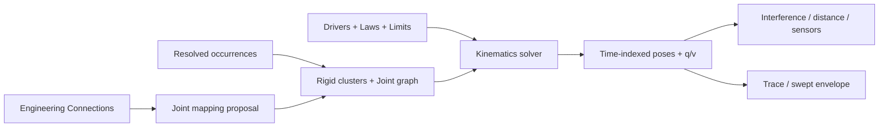
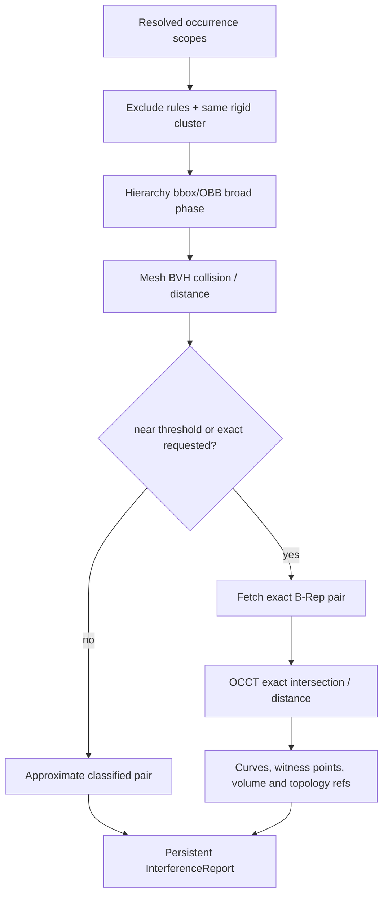

# 运动学、DMU 与仿真候选

> 目标契约，不等于已交付能力。返回[目标架构目录](../../TARGET_ARCHITECTURE.md)；当前事实见[当前架构](../../CURRENT_ARCHITECTURE.md)，实施顺序只在[统一路线](../../../plans/README.md)维护。

本页为长期候选设计；尚无完整产品实现。引入新模型、第三方库或服务前必须完成范围、许可证、corpus 与资源边界验证。

### 5.6.20 Mechanism 与 Assembly Constraint 的关系

Assembly Constraint 用于定义设计位置；Mechanism 用于定义运动模型。两者共享 geometry refs，但不是同一个聚合：

```proto
message Mechanism {
  string mechanism_id = 1;
  InstancePath root = 2;
  repeated RigidBody bodies = 3;
  repeated Joint joints = 4;
  repeated Driver drivers = 5;
  repeated Sensor sensors = 6;
  repeated Probe probes = 7;
}
```

- Rigid bodies 由 occurrence 或 Rigid Connection cluster 组成；
- Joint 可以从已验证的 Engineering Connection 显式转换，也可独立定义；
- 自动识别只产生 mapping proposal，例如 Hinge Connection → Revolute Joint；用户确认后固化；
- Assembly Connection 的 offset/angle 可以作为 Mechanism 初始坐标，但 joint limit/driver 不反写原 Constraint；
- 删除或改变 source Connection 使 Joint `OUT_OF_DATE`，不会静默换成其他 joint；
- 一个 Product 可有多个 Mechanism/Scenario，绑定不同 configuration；
- Mechanism 需要至少一个 grounded body，闭环机制显式标记 loop closures。

### 5.6.21 Joint 模型

```proto
message Joint {
  string joint_id = 1;
  JointType type = 2;
  BodyFrameRef frame_a = 3;
  BodyFrameRef frame_b = 4;
  repeated JointLimit limits = 5;
  optional JointCoupling coupling = 6;
  optional string source_connection_id = 7;
}
```

P0：Rigid、Revolute、Prismatic、Cylindrical、Planar；P1：Spherical、Universal、Screw、Gear、Rack；P2：Point/Curve、Slide/Roll Curve、Cable、Constant Velocity。每种 Joint 明确 generalized coordinates `q`、velocity `v`、frame convention、零位、正方向、周期和 limits。

- Revolute angle 使用连续 unwrap，不在 `±π` 跳变；
- Screw pitch 使用 `meters/radian`，正负表达手性；
- Gear/Rack 是已有 Joint 坐标的耦合，不直接约束任意 Face；
- Planar/Spherical 的坐标 chart 不泄漏到公共语义；
- hard stop 与 soft limit 分开；soft limit 的 stiffness/damping 只对 Dynamics 生效；
- Closed-loop joint graph 必须保留 loop constraint，不能为强行树化删掉一条关节。

### 5.6.22 运动学求解与 Driver/Law

Kinematics 有四种请求：

- Forward Kinematics：给定独立 joint coordinates 求所有 Pose；
- Inverse Kinematics：给定末端 Frame/点/方向目标求 q；
- Constrained Drag：在 joint manifold 上拖拽；
- Time Simulation：用 Driver/Law 在时间域生成状态。

`Driver` 绑定一个独立 joint coordinate 或 Parameter；Law 复用 5.5 的 constant/linear/S-curve/piecewise spline/expression，但 domain 明确为 time 秒。多个 driver 过定义闭环时返回冲突。每一时步从上一帧 warm-start 并保持 branch continuity；不能独立随机求每帧。



### 5.6.23 运动学 Scenario、Sensor 与结果

```proto
message KinematicScenario {
  string scenario_id = 1;
  string mechanism_id = 2;
  TimeRange time = 3;
  IntegratorSampling sampling = 4;
  repeated DriverOverride drivers = 5;
  repeated Probe probes = 6;
  EventPolicy events = 7;
}

message SimulationRunManifest {
  string run_id = 1;
  string input_snapshot_id = 2;
  string solver_build = 3;
  TimeSeriesArtifact states = 4;
  repeated Event events = 5;
  repeated ProbeSeries probes = 6;
  RunQuality quality = 7;
}
```

结果存 joint q/v、关键 occurrence poses、limits、residual、event、sensor series；高频 Pose 使用分块压缩 artifact，不放数据库行或单个 Proto。结果绑定不可变 Product/Mechanism/geometry snapshot；输入改变后结果仍可回放但标记 stale，不能冒充当前模型。

支持点轨迹、frame 轨迹、joint coordinate、速度/加速度、两 occurrence 最小距离、是否 clash、包络 bbox。Swept volume 分级：采样 pose union/voxel envelope 用于快速空间预留；精确 B-Rep sweep 只对简单轨迹和受限规模开放，并报告误差。CATIA DMU Kinematics 也把 joint、law、干涉/距离、trace 与 swept volume 作为同一验证工作流。[CATIA DMU Kinematics 官方说明](https://3dswym.3dexperience.3ds.com/wiki/catia-user-community/dmu-kinematics-simulator-2-kin_5TFJgAkXQbuBy3zwMAj1dg)

### 5.6.24 DMU 表示层级

| Representation | 内容 | 用途 |
|---|---|---|
| `EXACT_BREP` | OCCT B-Rep + topology map | 精确测量、最终干涉、剖切 |
| `ANALYSIS_MESH` | 有误差界的三角网格 + BVH | 大装配距离/碰撞窄相 |
| `CONVEX_PROXY` | convex hull/decomposition | 连续碰撞、交互动力学 |
| `ENVELOPE` | 简化包络/安全距离外扩 | 空间预留、快速筛选 |
| `LOD_MESH` | 多级显示网格 | 浏览器可视化 |
| `BBOX/OBB` | 包围体 | 层级宽相、流式加载 |

每个 Representation manifest 记录 source GeometryId、误差界、生成器版本、单位、local bbox、triangle/convex 数和用途 capability。相同 Reference Revision 的 occurrences 共享 local representation/BVH，运行时只应用 world Pose。近似结果必须标 `APPROXIMATE`；只有 Exact Worker 可签发 `EXACT_WITH_TOLERANCE`。

### 5.6.25 DMU Interference Specification

```proto
message InterferenceSpecification {
  string specification_id = 1;
  OccurrenceScope group_a = 2;
  OccurrenceScope group_b = 3;
  InterferenceMode mode = 4; // CLASH | CONTACT | CLEARANCE
  LengthValue clearance = 5;
  RepresentationPolicy representation = 6;
  repeated PairRule pair_rules = 7;
  bool include_hidden = 8;
  bool include_same_rigid_cluster = 9;
}
```

Scope 可按 InstancePath subtree、Publication set、BOM 属性、标签、selection set 或显式 paths 定义，并在 Job 开始解析为固定 occurrence list。PairRule 支持 `CHECK | IGNORE | CONTACT_EXPECTED | CUSTOM_CLEARANCE`，有优先级和审计来源；不能用任意未经沙箱的脚本遍历租户数据。

分类：

- **Clash**：体积/表面发生超过 penetration tolerance 的相交；
- **Contact**：无显著穿透且最小距离在 contact tolerance；
- **Clearance violation**：距离小于要求值；
- **Pass**：大于要求值；
- **Inconclusive**：表示精度、deadline 或退化几何不足以可靠分类。

### 5.6.26 干涉与距离流水线



- 宽相使用 Product hierarchy bbox 与动态 AABB tree，避免 O(n²) 全对比较；
- FCL/Coal 类库适合 mesh collision、distance、tolerance 和 continuous collision；
- 距 threshold 远的 pair 可由有误差界 proxy 直接判定；边界附近升级 exact；
- 精确 clash 用 OCCT common/section/distance 等适配器，输出 penetration volume、intersection curve、witness points 和 involved topology refs；
- Contact 不用浮点 `distance == 0` 判断，而使用版本化 tolerance interval；
- 对开放曲面只报告 surface intersection/contact，不能伪造 penetration volume；
- movement analysis 可先做 continuous proxy collision 找 time of impact，再对该时间附近 exact refinement；
- deadline 结束时报告已完成 pairs 和 completeness，不把 partial report 标为通过。

[CATIA DMU Space Analysis](https://3dswym.3dexperience.3ds.com/wiki/catia-user-community/dmu-space-analysis-1-sp1_150CZcx7T6iYBW1RZrspRA)覆盖 clash、clearance、contact、精确测量、剖切和 3D comparison；occcad 把每一结果的 representation/fidelity 明确写入报告。

### 5.6.27 持久干涉问题与增量复算

```proto
message InterferenceIssue {
  string issue_id = 1;
  InstancePath occurrence_a = 2;
  InstancePath occurrence_b = 3;
  InterferenceClassification classification = 4;
  double measured_distance_m = 5;
  optional double penetration_volume_m3 = 6;
  repeated Witness witnesses = 7;
  IssueDisposition disposition = 8;
  Fidelity fidelity = 9;
}
```

IssueId 由 specification、无序 occurrence pair、相关 topology lineage/region signature 和 classification family 确定；不使用列表序号。Revision 更新后可将问题匹配为 `NEW | UNCHANGED | CHANGED | RESOLVED | UNRESOLVED_IDENTITY`。用户可标记 Reviewed/Accepted/False-positive、添加评论和责任人；Disposition 属审查数据，不改变几何分类。

增量复算只重查：Pose 改变、GeometryId 改变、scope/rule 改变或其 bbox 邻域受影响的 pairs。报告仍绑定完整 snapshot；合并旧结果时验证每个 pair 的 input digest。

### 5.6.28 测量、剖切与 3D Compare

**Measure**：点/边/面/occurrence 之间的最小距离、投影距离、角度、半径/直径、长度、面积、体积、质心和惯量。报告保存两端 InstancePath + topology ref + witness，UI 测量默认是临时；Pin/Publish 后才进入审查 artifact。

**Section**：一个或多个 datum plane/box 与 occurrence scope，快速模式裁剪 mesh，精确模式求 B-Rep section curves。保存 plane frame、configuration、paths、fidelity 和 section artifacts；注释锚定 section curve lineage。Section View 不修改 Part/Product。

**3D Compare**：比较两个 Reference/Occurrence/Configuration snapshots：

- 结构差异：added/removed/replaced/moved occurrences；
- 几何差异：有符号/无符号 deviation、added/removed volume；
- 属性/BOM/Publication/Connection 差异；
- 快速 mesh distance field 与可选 exact B-Rep classification；
- 结果包含热图、最大/RMS/percentile deviation 和不可比较区域。

### 5.6.29 Scene、Explode 与 Review Markup

Scene/Exploded View 是非破坏性表示状态：

```proto
message ProductScene {
  string scene_id = 1;
  string base_product_revision_id = 2;
  repeated OccurrenceVisualOverride visuals = 3;
  repeated OccurrencePoseOverride exploded_poses = 4;
  CameraState camera = 5;
  repeated Markup markups = 6;
}
```

- exploded pose 不进入 Assembly Solver，也不改变 nominal Placement；
- 自动 explode 可按层级、连接图或 bbox 生成 proposal，用户接受后保存 override；
- Scene 可保存 visibility、color、transparency、section、camera 和 markup；
- Markup anchor 使用 InstancePath + Publication/topology/section witness；
- Product Revision 更新后尝试 rebind，失败显示 orphan，不移动到最近面；
- Scene/Review 可有独立 ACL 和生命周期，但必须引用不可变模型 snapshot。

### 5.6.30 基础刚体动力学

Dynamics 是独立模型：

```proto
message RigidBodyDynamicsModel {
  string model_id = 1;
  string mechanism_id = 2;
  repeated BodyInertia bodies = 3;
  repeated ForceElement forces = 4;
  repeated ContactMaterial contacts = 5;
  Gravity gravity = 6;
  IntegratorProfile integrator = 7;
}
```

Body mass/inertia 来源优先级：显式经审核 override > Part 材料/密度计算 > 缺失失败。惯量必须位于 body local frame，验证对称正定并记录质心。基础力元素包括重力、常力/力矩、Joint actuator、线性/扭转 spring-damper 和规定运动；ContactMaterial 含 friction/restitution/compliance，仅用于 Dynamics。

| 可信度等级 | 能力 | 结果声明 |
|---|---|---|
| `KINEMATIC` | 无质量，只满足 joint geometry | 几何运动 |
| `BASIC_RIGID_DYNAMICS` | 刚体、关节、力、简化接触 | 工程早期趋势/载荷估计 |
| `VALIDATED_MULTIBODY` | 经基准/积分器/接触模型认证的专用后端 | 指定场景验证 |
| `MULTIPHYSICS_COSIM` | FMI/外部求解器 | 由各 FMU/耦合质量声明 |

基础动力学不输出应力、塑性、振动模态或疲劳结论。需要这些能力时把 joint reaction/load history 传给后续 CAE Worker。

### 5.6.31 FMI 与多领域仿真边界

[FMI](https://fmi-standard.org/docs/main/)定义 Model Exchange、Co-Simulation 和 Scheduled Execution，适合作为机械机构与控制、电气、液压、热等系统模型的开放接口。

- `FmuArtifact` 是不可信可执行制品，必须签名、病毒扫描、无外网、最小文件系统、CPU/RAM/step 限额；
- FMU port 通过 typed `SimulationPublication` 绑定 joint coordinate、force、sensor 或 parameter；
- unit、causality、variability、clock 和 step capability 在 Scenario 创建时验证；
- Co-Simulation master 处理 communication point、early return、event 和 rollback capability；
- 每次 Run 固定 FMU digest、platform binary、solver/master build 和参数；
- 黑盒 FMU 不进入 GeometryId，也不能修改 Product Revision；
- FMI 作为接口标准，不代表系统已经验证任意第三方模型的物理正确性。

### 5.6.32 开源技术选型

| 技术 | 适用职责 | 限制与结论 |
|---|---|---|
| Eigen | SE(3) 数学、Jacobian、稀疏线代 | 基础数学层 |
| Ceres Solver | 装配/IK 非线性 least-squares 后端候选 | 不提供 Constraint/DOF/branch 领域语义；稀疏依赖逐项审计 |
| Pinocchio | 关节树/闭环运动学、刚体动力学、解析导数 | BSD-2-Clause；Mechanism Worker 首选技术验证候选 |
| FCL / Coal | mesh collision、distance、tolerance、continuous collision | 近似几何窄相；最终精确结果仍由 OCCT |
| OCCT | 精确 B-Rep intersection/common/section/distance、质量属性 | 不做装配图求解/实时动力学 |
| Bullet | 交互刚体和接触仿真 | zlib；适合 preview，不自动达到工程动力学精度 |
| Project Chrono | 多体 DAE、接触和更高级多物理 | BSD-3-Clause；后期 Validated Dynamics 独立 Worker 候选 |
| FMI | 模型交换与 Co-Simulation 标准 | 接口而非求解器；FMU 必须沙箱 |
| OpenUSD/glTF | 可视化场景与交换候选 | 不是 Product Revision、Constraint 或 BOM 权威模型 |

[Pinocchio](https://github.com/stack-of-tasks/pinocchio)支持 articulated rigid-body、closed-loop、constraint dynamics 与导数，适合运动学/动力学 PoC；[FCL](https://github.com/flexible-collision-library/fcl)提供 collision、distance、tolerance 和 continuous collision；[Bullet](https://github.com/bulletphysics/bullet3)是许可宽松的实时物理候选；[Project Chrono](https://github.com/projectchrono/chrono)提供更完整的多体/多物理能力。任何库先通过 license/SBOM、数值 corpus、确定性、取消、Windows/Linux 和长时稳定性门槛，领域 Proto 不泄漏其类型。
