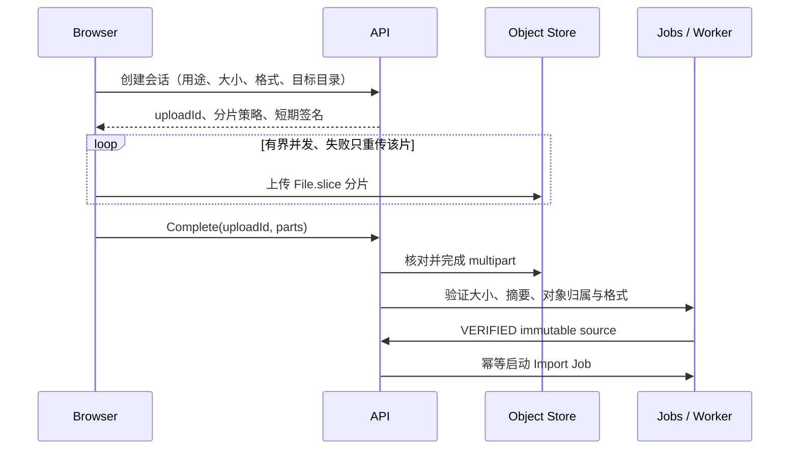

# 大文件导入与大模型工作集设计

> 2026-09-22 设计提案；IMPORT-DIAGNOSTICS 与单 Solid IMPORT-NAMING 已实现，其余待实施与实测，不构成大模型能力或性能承诺。返回[目标架构](../../TARGET_ARCHITECTURE.md)，执行依赖见[导入与大模型计划](../../../plans/import-large-models.md)。适用于外部 STEP/BREP 导入和原生 Part/Product；存储与交换基础合同仍见[分布式平台](distributed-platform.md)。

## 1. 结论与边界

建议现在引入 S3 兼容 ArtifactStore 与可续传上传协议，但它只解决大对象存取、传输恢复和跨主机共享。1 GiB 文件能够上传，不等于它能够解析、编辑或在浏览器完整驻留。交付能力应分别声明：上传完成、精确几何可用、可显示、可持久选择、可编辑、可发布。

保留现有模块化控制面、PostgreSQL Jobs、不可变 Revision、ArtifactReference 和 Geometry Router；本轮不要求同时引入 Kubernetes、消息总线或独立网络微服务。大模型精确求值需要异步任务和资源隔离，并不意味着每个小命令都变成后台任务。

文件大小只是准入维度之一。相同 1 GiB 文件可能是大量共享 occurrence、巨量独立零件、单一复杂 B-Rep、长文本属性或高密度样条，实际成本不同。不能用固定“文件大小 × 倍数”宣称内存足够；先建立 corpus 和阶段测量，再标定估算器与拒绝策略。

## 2. 当前事实与根因

以下来自代码阅读，不是本轮性能测试结果。

| 位置 | 当前事实 | 影响 |
|---|---|---|
| `services/internal/api/jobs.go` | raw body 上传限制 `128 << 20`，上传以 Reader 写本地 Store | 当前 HTTP 入口不接受 1 GiB；已有流式写入基础 |
| `workers/geometry/src/main.cpp` | `kMaximumExchangeBytes = 512 MiB`，输入和输出均受限制；BREP `read_artifact` 返回整个 vector | 仅提高 API 上限仍失败；文件流入磁盘不代表几何求值流式化 |
| `services/internal/artifact/store.go`、`local.go` | Store 只有 Put/Open/Delete；LOCAL 内容寻址、SHA-256、共享目录 | 还缺 multipart session、签名访问、Range、租约和对象验证能力 |
| `services/cmd/occccad-jobs/main.go` | inspect 后最多 8 路导入，`results` 持有各组件的 EvaluatePartResponse；最后逐文档提交 | 并发按数量，未按内存；批量结果堆积；70% 后禁止取消不等于跨文档原子可见 |
| `kernel/occt/src/occt_kernel.cpp` | `inspectStepRootCount` 和每次 `loadStepRoot` 均 `ReadFile` | 多 root 重复解析整份 STEP；并发会放大 CPU/RSS/I/O |
| Worker `fill_evaluation` | 同时准备完整 topology、mesh、BREP、GLB；即使大制品外置，仍填充 protobuf mesh | 大数据仍可能穿过 unary gRPC，并在多个进程复制 |
| `services/internal/workspace/service.go` | `mesh_json` 存入数据库，读取时整份反序列化；Web Artifact 带 mesh | 数据库、API 响应和浏览器仍承担完整显示数组；当前主路径不是 GLB 分块加载 |
| `web/apps/cad/src/viewport/cad-viewport-engine.ts` | `.flat()` 转换完整数组，同步构建 BVH；makeSolid 构造所有边线与拓扑点 | 主线程长任务、CPU/GPU 内存放大；单文件 gzip 或单一 GLB 不能根治 |
| OCCT `evaluateProfilePadsWithHistory` | output adjacency 使用嵌套两两循环 | 拓扑规模扩大后有平方级扫描风险，需要 incidence 索引 |
| Geometry client | InspectExchange 为 30 秒，ImportExchange 为 5 分钟 deadline | 是当前配置事实，不是 1 GiB 的性能能力或合理 SLA |

### 2.1 NULL 报错不是导入命名的完整修复

原始缺陷是 `topologyManifestForVersion` 查询 `topology_manifest_digest` 并扫描到 Go `string`；迁移 `0008` 允许该列 NULL。旧导入流程在 ImportExchange 后直接提交没有 feature topology manifest 的制品，缺失 digest 写为 NULL，因此并非只能归因于历史数据。当前提交已加入冻结命名定义和带 seed 的 EvaluatePart。该读取缺陷已通过 IMPORT-DIAGNOSTICS 修复。

已实施的诊断层采用可空读取并区分“尚无 naming”“生成失败”“摘要损坏/合同不匹配”；不能把 NULL COALESCE 成空字符串后继续假装可解析，也不能吞掉全部错误。缺失 naming 的文档仍允许打开、显示、查询不依赖稳定子拓扑的属性；面上草图、持久装配引用等操作需要明确的 capability/诊断和修复入口。具体实现与测试范围见[当前架构完成记录](../current/jobs-artifacts.md#import-diagnostics-完成记录2026-09-22)，导入 naming 生成与修复入口也已实现，见[导入根命名](../current/persistent-naming.md#导入根命名import-naming-已完成2026-09-22)。

原链路更深一层的问题是：即使为初始导入补一份 manifest，后续 evaluator 只拿到 `base_brep`、没有导入拓扑 seed 时仍会产生 `TOPOLOGY_HISTORY_UNNAMED_BASE`。必须把 ImportBody 的完整 Face/Edge/Vertex 身份种子传入后续布尔求值，否则“能选面、不能可靠编辑”问题仍在；当前 IMPORT-NAMING 已按此补齐 seed 初始化和后续 history。

## 3. 数据面：上传、S3 与制品生命周期

### 3.1 统一上传会话

建议 API 以版本化 UploadSession 表达以下流程，具体路由在实现阶段冻结：

会话状态为 CREATED → UPLOADING → VERIFYING → READY；另有 ABORTED/EXPIRED/FAILED。上传进度与几何处理进度分别显示；上传中断不会伪装成几何任务失败。Complete 可重试，同一会话最多产生一个有效导入输入/幂等任务。服务端恢复与持久化分片账本，不依赖内存 Toast；页面重新打开后可能需用户重新选择本地文件，并校验文件身份后续传，不假设浏览器重启后仍有 File 访问权。

建议先以 32–64 MiB 分片、2–4 路并发作为待标定默认，动态受客户端内存和带宽限制；不是性能保证。大文件摘要在 Web Worker 增量计算或服务端验证任务中计算，不调用整文件 arrayBuffer。上传 bytes、完成对象 bytes、解析结果膨胀率分别限额；取消显式 Abort multipart，过期未完成上传有回收策略。

S3 multipart 支持分片重试和独立上传；完整对象 ETag 不一定是对象内容 MD5，更不能充当项目 SHA-256。不同 checksum 的 FULL_OBJECT/COMPOSITE 支持有区别：保留独立的可信全内容 SHA-256，必要时由验证任务流式读取计算；不能把 multipart SHA-256 composite 当成内容摘要。[AWS multipart](https://docs.aws.amazon.com/AmazonS3/latest/userguide/mpuoverview.html)、[AWS checksum](https://docs.aws.amazon.com/AmazonS3/latest/userguide/checking-object-integrity-upload.html)。

### 3.2 Store 边界与安全

- LOCAL 保留用于开发/受限单机；生产实现一个 S3 兼容后端，供应商、SDK 和部署方式尚未选定。1 GiB 本身不强制某家云，也不强制 Ceph 等集群。
- Put/Open/Delete 继续作为基础接口；上传 session、对象 Stat/Range、签名访问、Complete/Abort 作为明确能力扩展，不把 AWS SDK 类型泄漏到领域模型。
- ArtifactReference 仍只保存 opaque key、摘要、大小、媒体类型及 backend identity；签名 URL 是短期 transport credential，不进 Revision/长期 manifest。Worker 由受信 resolver 获得授权下载，不能接受任意 URL 抓取。
- 上传先进入会话隔离的 staging key；验证后再绑定内容寻址对象。S3 没有本地 rename 的等价物，明确选择受控复制到 digest key 或元数据绑定，核算大对象复制成本；不在验证前信任客户端报告的 SHA-256。
- 以 UploadSession/Job attempt 限定写入路径、大小、租户/目录权限、并发和有效期；私有读取支持 Range、缓存与短期签名，发布/历史引用保护对象免于 GC。ETag 与内容摘要分工明确。
- 规范 GC roots：已提交 Revision/ImportDefinition/Release、活动上传、活动 attempt 和显式保留。失败 staging/废弃分片延时清理；数据库提交与对象上传之间通过候选 manifest、提交 gate 和清扫补偿衔接，不假设分布式原子提交。

## 4. 导入模型必须成为可编辑的普通模型

### 4.1 ImportBody 的输入真相和身份

本节单 Solid 冻结快照方案已落地，具体持久化形式和验证边界见[当前导入根命名](../current/persistent-naming.md#导入根命名import-naming-已完成2026-09-22)。源文件替换和内核升级的身份迁移仍属后续扩展。

`IMPORT_BODY` 保存不可变源对象 digest、格式、导入器/kernel/healing/unit policy、组件定义标识、规范化精确形体与 ImportIdentityMap 的引用。没有源 CAD 的参数特征历史时，不伪造 Extrude/Fillet 历史；在导入 Body 上添加新特征、草图和约束属于正常后续建模。

为各 Body、Face、Edge、Vertex 分配 opaque stable ID；逻辑引用例如 `ImportFeatureId + ImportedTopologyId`。首次建立后持久化整份身份种子，重试读取已持久化的候选种子，不重新分配。STEP entity/representation/产品关联可作为来源证据，但不是跨任意重新导出文件的唯一身份保证；裸 BREP 无业务 ID 时同样使用冻结种子。

ImportIdentityMap 绑定精确 BREP digest 与 importer policy，包含 stable ID、几何/邻接证据和制品内定位映射。**数组下标、mesh 序号、OCCT local ID 均不能成为业务 stable ID**；local ID 只允许在绑定某个 digest 的制品映射中出现。冷加载该冻结快照时用映射恢复；更换源文件、kernel 或规范化策略属于新求值/显式替换，不能按“第 n 个面”继承身份。几何签名和邻接可辅助对照，但对称面匹配不唯一时必须 Ambiguous/Reconnect。

源文件、规范化种子形体与身份分配记录是 ImportDefinition 的必要重放输入；不能把唯一 identity map 当临时缓存回收。Mesh/LOD/BVH 等显示派生物可以删除重建。只有源 bytes 不足以保证任意新版导入器重新分配相同 ID。

### 4.2 初始命名与后续 lineage

导入完成生成与普通 Feature 同合同的 topology manifest：import owner、Body、完整 Face/Edge/Vertex outputs、邻接、几何类型、最终实体有向法向、digest/policy。没有上游 Feature 不等于没有命名；这是有稳定根身份的初始输出，而不是普通 Extrude 的虚假 history。

后续 EvaluatePart 输入必须带 base BREP + ImportIdentityMap/manifest seed，初始化已有 named topology。Add/Remove/Intersect 等通过 OCCT history 传播 unchanged/modified/generated/deleted/split/merged；完整性门检查最终子拓扑覆盖，不再把所有 imported base 都标为 unnamed。隐藏/LOD 不影响精确引用解析。

初批可编辑验收聚焦有效闭合单 Solid Part 与其装配 occurrence。一个 transferable root 不一定只有一个 Solid，也不等于一个业务 Part；多 Solid、开放壳、混合线框分别标明结构和可用操作，采用已有 Body 能力内的明确拆分策略。完整多 Body 编辑、特征识别和直接编辑不是本轮默认承诺。

### 4.3 已有无 manifest 的导入文档

1. 已完成 IMPORT-DIAGNOSTICS：可空读取和明确诊断；打开文档不因缺失可选 naming 制品崩溃。
2. 已实现显式修复命令，对当前导入 Head 以冻结源/精确 BREP 建立 ImportIdentityMap 与 manifest；已有有效 stable ID 不能重分配。把新的导入定义输入纳入正常命令和 Revision/ChangeSet，并覆盖 Undo/Redo。
3. 旧快照只读时诚实显示 naming 不可用，不伪造可编辑状态；新 Head 的后续引用使用新身份。历史是否能以原输入重建需有实测，不覆盖旧 Revision。
4. 项目未发布，采用唯一导入模型/协议演进，不增加永久双写或两套 naming resolver。开发数据重置仅遵循仓库既有授权边界，不作为设计或实施的默认前提。

## 5. 计算与持久任务：消除重复工作，限制峰值

### 5.1 一份源文件只建立一次解析会话

建议导入 Job 分阶段：SOURCE_VERIFIED → INSPECTING → TRANSFERRING → NAMING → EXACT_READY → DISPLAY_BUILDING → COMMITTING → SUCCEEDED。恢复依据持久 stage/component manifest，不仅依据进度百分数。

同一 attempt 对 STEP 只 ReadFile 一次，逐根 transfer；完成的规范化组件 BREP/identity seed 立即写不可变 checkpoint，再由独立任务生成显示制品。初期可在专用进程内保留解析器，重启时允许重读源文件，但不能每个 root 都重新解析整份文件。结果数组只持有组件摘要和对象引用，不能累计所有 Mesh/GLB/protobuf response。

长远装配语义采用 XDE/STEPCAF 恢复 definition/occurrence、共享引用、层级、placement、颜色/名称；嵌套装配不按 transferable root 数量猜测。OCCT 官方说明 XDE 支持扩展结构与属性，STEPCAF 可转入文档；是否降低本项目内存必须实测，XDE 并非 out-of-core 保证。[OCCT XDE](https://github.com/Open-Cascade-SAS/OCCT/wiki/xde)。首批 parse-once 优化可先保持当前展平交换合同，完整 XDE 另设 conformance 门。

### 5.2 资源与失败隔离

- Admission 输入包含源 bytes、候选实体/样条规模、unique Body 数、预计三角形、历史长度；解析前未知的项在阶段间修正预算。按预留 RSS/临时盘/CPU/GPU 显示预算准入，不再固定“8 路就是合理”。
- 大解析/精确求值占专用 Worker 进程和租约，避免占满交互池；单个 Body 仍可能需要完整 OCCT Shape 常驻，不能许诺任意 1 GiB 文件都可低内存计算。
- gRPC 成功响应只返回受限元数据及 ArtifactReference，Mesh、完整 topology/lineage、显示 buffer 大结果外置；查询单 Face 不构造所有边线点。缓存采用预算和 LRU/引用计数，不能无限按 resident 个数扩展。
- Worker 支持本地磁盘缓存下载、校验、有限容量和淘汰；尽量使用文件/stream API 避免 BREP bytes/string/vector 多份复制，但须逐处确认 OCCT 算法仍需的内存。
- deadline 随阶段/工作负载配置；OCCT 能协作取消的阶段使用进度回调，不能及时取消时终止隔离 attempt 进程并丢弃候选。OOM/确定性资源超限不在同一预算下自动无限重试。
- 提交前检查 lease/attempt/deadline、源摘要、权限、目标 Workspace Head/CAS；迟到结果不得推进 Head。组件清单在导入事务边界原子可见或以可恢复的隐藏候选导入集发布，不能把逐个创建文档称为原子导入。
- exact、naming、display 是不同完成状态。精确失败不能显示为成功导入；已有 exact snapshot 的高 LOD 失败可以保留粗显示并重试，不回滚有效业务 Revision。业务编辑至少要求 exact+naming，轻量浏览可在表示就绪后开放。

### 5.3 原生大模型共用同一条链路

原生 Part 的长 Feature 链、Boolean/Pattern 和大型 Product 同样使用 immutable evaluation input、durable Job、ArtifactReference 和分级显示。交互预览有独立短预算；提交长计算以 pending candidate 表达，成功后再通过 CAS 形成/推进权威结果，不让 HTTP 持有完整大模型求值生命周期。小模型保留快速路径，但输出 manifest 和最终验证合同相同。

先按 Feature/Body 复用规范化输入和中间结果，再按测量决定稀疏/增量算法。单个大 Body 的布尔运算不能因显示分块而随意拆分为独立精确运算；出现不可分割的内存上限时应明确报告支持边界。

## 6. 显示与选择：按工作集加载，而非下载一份更大的 GLB

### 6.1 元数据与表示分离

DocumentView 只携带必要模型/结构信息、分页或按子树查询入口、bbox、表示状态和 manifest 引用；不内联全部 mesh/边/顶点数组。草图编辑按活动文档/草图请求，巨量 Feature/Product 树也不应默认完整展开返回。

统一 Geometry/VisualizationManifest 指向 exact BREP、稳定拓扑映射、bbox、粗到细 LOD、空间 chunk、edge stream、topology vertex stream。按 canonical GeometryKey 共享定义，同一零件的多个 occurrence 只增加 placement/override；CPU buffer、GPU buffer 和 BVH 都有引用计数，材质/选择高亮不强迫复制基础 geometry。

小模型可只有一个 chunk；大单体需要空间块，大装配先按定义/occurrence，再对过大 Body 分块。压缩、量化、meshopt/Draco 等仅为待基准选型，不能靠添加解码依赖替代分块设计。HTTP Range 也不会让当前单一 GLB 自动成为渐进场景，客户端必须懂 manifest 和独立资源。

### 6.2 预算与层级

加载顺序：结构摘要/包围盒 → 可见粗 LOD → 按屏幕误差细化 → 交互区域的边与拓扑点。滚动/移动视角取消过时请求，限制在途 bytes、解码队列、GPU 上传时间片和总驻留预算；超额时退回低 LOD/代理，不让主线程一次性处理全模型。

解码和 BVH 构建进入 Web Worker，typed buffer Transfer 交接，避免 JSON number[][]、flat 和多次复制。未压缩基本缓冲的下界估算可用 `24V + 16T bytes`（float32 position+normal、uint32 三角形索引+每三角形 face index），还未含边、BVH、解码缓存、JS 对象、GPU 复制或双缓冲。因此文件压缩大小不能充当浏览器内存预算。

### 6.3 边线、顶点、交点和精确选择

- BREP Edge/Vertex 是拓扑；三角形边、显示轮廓、屏幕交点、捕捉点不是同一种对象。视觉简化不能改变 PersistentSelection。
- 边按空间块和屏幕弦差独立离散/缓存，缩远时减少边和顶点加载；光标邻域或活动草图再加载精确候选。线宽、遮挡和选取优先级沿用统一交互系统。
- Face↔Edge↔Vertex 邻接从拓扑 incidence 建立索引，替换全量两两邻接扫描；内核边界遍历复杂度按实体/关联数量度量。
- 屏幕曲线交点先用空间索引过滤可见邻域，再做局部计算；不预计算所有边的两两交点。临时捕捉点带来源和容差，不作为稳定顶点落库；真正的几何相交由精确 feature/evaluator 求解和命名。
- chunk/LOD 的拾取结果必须经过带 GeometryKey、Revision、representation digest 的映射绑定精确拓扑。不能唯一对应 BREP Face 的粗代理仅支持 Body/occurrence 选择；进入面/边工具时细化或请求精确拾取。
- 正式提交始终核对 source Revision/精确 PersistentSelection；切换 LOD、隐藏部件、缓冲淘汰不改变选择身份，迟到拾取不能命中新 Head。

## 7. 验证与是否承诺 1 GiB

本轮没有运行大文件测试，也没有证明当前硬件可处理某个 1 GiB 模型。下面是待实施验收矩阵。

| 维度 | corpus / 场景 | 必须记录 |
|---|---|---|
| 传输 | 100 MiB、1 GiB、2 GiB；真实文件与纯传输 fixture 分开 | 吞吐、客户端/API RSS、失败分片重试量、重启续传、取消后残留；padding 文件不能算 CAD 验收 |
| 精确模型 | 单复杂 Solid、多独立 Solid、复杂样条/孔洞/薄壁、开放/无效几何 | 源 bytes、F/E/V、parser 实体数、各阶段时间、峰值 RSS/临时盘、输出放大率 |
| 装配 | 同一零件重复 1k/10k occurrence 与等数量独立几何分别测试；嵌套层级 | 解析次数、唯一几何数、结构/实例内存、资源共享率、提交原子性 |
| 原生模型 | 长 Feature 链、Boolean、高面数实体、重复引用的 Product | 冷/热重建、无关修改增量命中、编辑/Undo/Redo、超限与 CAS 冲突 |
| 显示 | 1M/10M/50M 总三角形分档，区分总量与驻留量 | manifest 后首个粗表示时间、细化时间、帧时间 p50/p95、主线程长任务、CPU/GPU 峰值、draw calls |
| 选择/命名 | 导入面上草图、六面 Pad/Pocket、边点投影、装配约束、再布尔、LOD 切换 | stable ID 保持、split/merge/delete/ambiguous、精确误差、冷加载/重试复现 |
| 故障 | 网络断开、会话过期、分片损坏、Worker 崩溃/OOM、租约失效、提交前权限变化 | 不丢已有 Head、不重复创建、无迟到覆盖、可定位失败阶段、GC/重试可恢复 |

先冻结参考硬件和浏览器版本：建议记录 CPU 核数/内存/磁盘余量、GPU/VRAM、客户端内存、网络 RTT/带宽、kernel/evaluator build。不得把开发机空闲情况下单次成功当容量结论；至少区分冷/热 cache、单任务/并发及受限网络，重复测量并保留分位数和原始报告。

第一轮建议资源策略目标（待实测标定）：客户端显示 CPU 工作集 1 GiB、GPU 512 MiB、可见场景交互 p95 ≤33 ms；只在指定硬件、驻留预算与低 LOD 策略下验收，不要求 50M 三角形同时驻留。大任务 RSS/临时盘采用配置硬上限和准入预留，API 不出现与源文件或全量 mesh 线性相关的整文件峰值。上传完成后到精确就绪、manifest 后到首屏分别计时，不将上传时间隐去。

1 GiB 能力退出门应写成“哪些 corpus / 硬件 / 预算 / 操作通过”，而不是“所有 ≥1 GiB 文件均支持”。真实大文件、编辑正确性、WebGL 工作集和故障恢复均通过后才能对外声明。测试数据生成器、输入 digest、重放命令和观测报告归入版本化测试资产；大原始文件只放授权对象存储，不直接提交 Git。

## 8. 实施前需冻结的选择

实现首批时确定 S3 endpoint/部署方与权限、参考硬件/资源预算、实际 STEP/BREP 样本授权及期望首屏/导入时间。当前设计不因这些参数未提供而停止；也不据此安装对象存储、升级 OCCT、修改公开 Proto 或承诺跨导入自动匹配。具体稳定身份、ImportDefinition schema 和大结果 RPC 变更必须在实施前按仓库边界审查并冻结合同。
