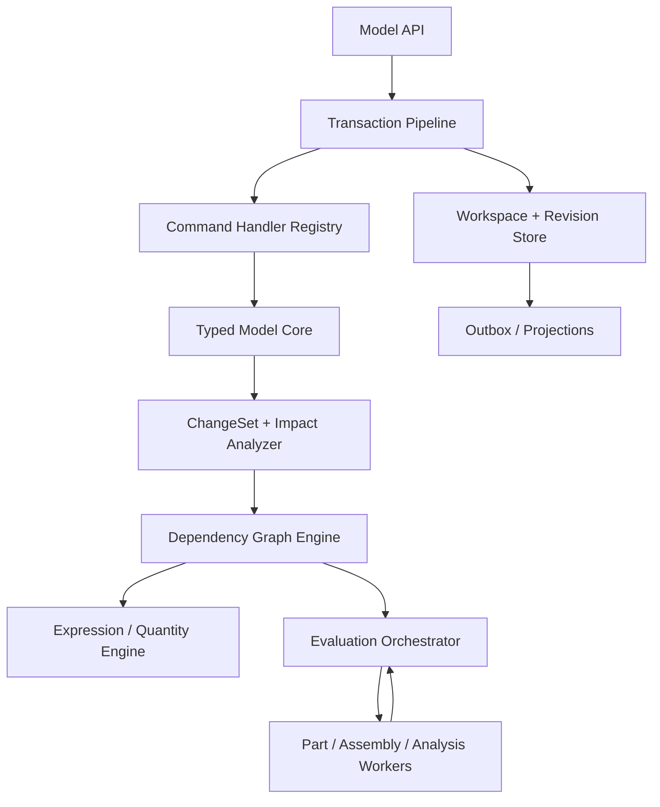

# 模型接口、存储与验证

> 目标契约，不等于已交付能力。返回[目标架构目录](../../TARGET_ARCHITECTURE.md)；当前事实见[当前架构](../../CURRENT_ARCHITECTURE.md)，实施顺序只在[统一路线](../../../plans/README.md)维护。

### 4.3.34 服务与模块边界

初期以上模块都可位于 Go Model Service 模块化单体，CAD Worker 独立部署；Realtime 和 Scheduler 仅在负载或隔离需求触发时独立。Expression/Quantity/Dependency Core 应做 OCCT-free library；C++ Worker 消费已求值参数和明确 typed inputs，不自行解析用户 source text。未来若 C++ 需要 law evaluation，使用同一版本化 AST/profile 与跨语言 conformance corpus。

### 4.3.35 推荐存储投影

业务真相优先保存在规范 Revision manifest/JSONB 和追加事务表；关系表只索引需要查询/并发的边界。所谓“完整 Revision 快照”是逻辑完整，不要求为每次提交复制一个巨大 JSON：模型按 ParameterSet、Feature graph、Body、Product subtree、Relation graph 等稳定分块内容寻址，Revision manifest 指向不可变 chunk；未变化 chunk 结构共享，小模型仍可内联以降低复杂度。canonical model hash 由有序 manifest 和 chunk digests 计算，读取层向 handler 提供不可变 copy-on-write view。

推荐投影包括：

- `workspaces(id, document_id, head_revision_id, head_sequence, base_revision_id, policy)`；
- `transactions(id, workspace_id, sequence, actor, request_id, type, status, base_revision, result_revision, undo links)`；
- `transaction_commands(transaction_id, ordinal, type_uri, schema_version, payload_digest)`；
- `change_sets(transaction_id, canonical_blob_digest, read_set, write_set, impact_seeds)`；
- `revisions(id, document_id, parents, model_blob_digest, model_hash, state)`；
- `evaluation_runs(revision_id, capability, manifest_digest, status)`；
- `dependency_edges(revision_id, source_key, target_key, edge_kind)` 作为可重建索引；
- `outbox_events(...)`。

命令原 payload、ChangeSet、模型快照和 manifest 可压缩后放对象存储，但 PostgreSQL 保存 digest、大小、schema 和引用完整性。GC 不得删除仍被 Revision、Transaction、Release、审计或 legal hold 引用的对象。

### 4.3.36 API 返回与错误模型

成功返回 `TransactionReceipt`：transaction/workspace/sequence/revision IDs、ChangeSummary、EvaluationSummary、diagnostics、artifact links、undo capability 和 correlation IDs。失败至少区分：

| Error | 语义 |
|---|---|
| `COMMAND_SCHEMA_UNSUPPORTED` | type/schema 无 handler 或无法 upcast |
| `PRECONDITION_FAILED` | entity/property digest 已变化 |
| `WORKSPACE_HEAD_CONFLICT` | expected sequence 过期且不能自动 rebase |
| `PARAMETER_TYPE_MISMATCH` / `UNIT_MISMATCH` | 静态类型或量纲错误 |
| `DEPENDENCY_CYCLE` | 返回 cycle path 和 edge kinds |
| `MULTIPLE_PARAMETER_WRITERS` | 一个 slot 被多个 source 驱动 |
| `UNDO_CONFLICT` / `REDO_NOT_AVAILABLE` | 补偿不再安全 |
| `EVALUATION_FAILED` | 可提交模型失败，receipt/diagnostics 说明是否形成 Revision |
| `EVALUATOR_UNAVAILABLE` | 基础设施失败，可安全重试 |
| `REFERENCE_UPDATE_REQUIRED` | 外部 Publication 有新版本但尚未接受 |

HTTP/gRPC status 只表示传输级类别，客户端行为依据稳定领域 error code。

### 4.3.37 安全、配额与防滥用

- 命令 payload、数量、Transaction commands、AST nodes/depth、字符串、table rows、dependency edges 有硬上限；
- Expression cost 静态估算与运行预算双重限制，函数白名单无 I/O；
- 权限同时校验 Document write 和所有外部 Reference read，提交前后都防 confused deputy；
- 插件 command/evaluator digest、publisher、capability 和 schema 在 Revision/manifest 可追踪；
- 历史/ChangeSet 可能含旧敏感参数，遵守租户加密、保留、legal hold 和受控 redaction policy；
- Undo/Restore 不能恢复当前无权读取的外部数据，权限变化产生明确失败；
- 恶意 dependency fan-out、超大配置矩阵和重算风暴由租户预算、去重和 backpressure 控制。

### 4.3.38 可观测性与性能指标

至少记录：command validation/apply、dependency extraction、expression compile/eval、dirty closure、cache hit、Worker queue/eval、CAS/rebase、outbox publish 的分段 trace。核心指标：

- Transaction p50/p95/p99、preview latency、commit conflict/rebase rate；
- Undo/Redo success/conflict rate；
- dirty nodes / total nodes、各类 invalidation、node cache hit；
- expression count/AST cost/cycle/type error；
- Feature regeneration critical path 与 fan-out；
- failed/blocked/stale node 数、last-known-good 使用时长；
- 每 Revision model/ChangeSet/manifest 大小和历史增长率。

性能面板必须能回答“哪个参数导致哪些节点重算、为何没有命中缓存”，而不只显示总耗时。

### 4.3.39 验证体系

| 测试层 | 必须覆盖 |
|---|---|
| Command conformance | 每个 handler 的 schema、权限、纯函数、ChangeSet round-trip |
| History | Undo/Redo/Restore、delete-create、reorder、rename、跨会话和多 actor |
| Property/Parameter | ID rename、scope、copy relocation、type/unit/bounds、single writer |
| Expression | parser/type checker/AST compatibility、cost limits、Go/C++ golden corpus |
| Dependency | cycle、dirty closure、typed edges、dynamic dependency rejection |
| Incremental | 增量结果与冷启动全量重算语义等价 |
| Concurrency | commute matrix、CAS race、幂等重试、Worker late result |
| Failure injection | crash between object upload/commit/outbox、projection rebuild |
| Migration | 所有旧 `CommandRequest`、Part/Product JSON 和 history cursor 可读取 |
| Property/fuzz | command payload、AST、ChangeSet、dependency graph、tombstone/lineage |

最关键的 oracle 是：任意 Revision 清空所有缓存后，可从模型、依赖快照和 evaluator manifests 重建语义等价结果；任意 Transaction 的 ChangeSet 应与前后快照 diff 一致；增量求值必须与全量求值一致。

### 4.3.40 新项目 Schema 策略

项目当前没有需要承诺兼容的生产数据。核心骨架只维护一套 Workspace/Transaction/ChangeSet/Revision 语义，不回填 cursor 历史、不保留平行 Undo 状态机，也不为实验数据增加读取 adapter。开发 schema 变化时重建开发数据库，以 conformance corpus 和端到端场景验证新基线。

一旦产生正式发布或外部持久数据，本节策略必须通过架构变更切换为版本化迁移：从该发布点开始只追加 migration、旧 Revision 只读、命令 upcast 和 shadow diff。不能把“当前允许重建”误用到未来已发布数据。
