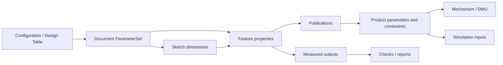
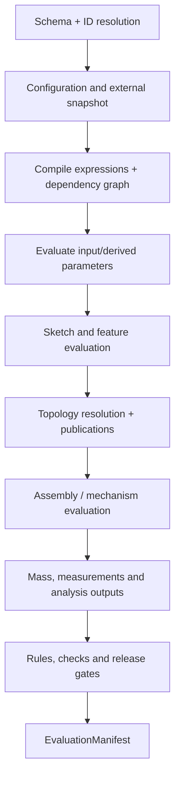

# 参数、依赖与求值

> 目标契约，不等于已交付能力。返回[目标架构目录](../../TARGET_ARCHITECTURE.md)；当前事实见[当前架构](../../CURRENT_ARCHITECTURE.md)，实施顺序只在[统一路线](../../../plans/README.md)维护。

### 4.3.17 全局参数化的准确含义

“全局”不是一个所有文档都能隐式读写的变量字典，而是统一类型、身份、作用域、引用和求值规则：草图尺寸、Pad 长度、曲面 law、材料属性、装配 offset、机构 driver、仿真载荷和配置选项都可以绑定同一种 `ParameterRef/Expression`，同时保持各自聚合边界。

全局参数化分三层：

1. **Document-local design parameters**：Part/Product 内部权威参数；
2. **Published parameters**：通过 Publication 暴露的稳定只读契约；
3. **Configuration parameters**：在明确 ConfigurationContext 中选择/覆盖输入值。

跨文档消费者只能读取已发布参数和冻结的 Revision/ResolutionSnapshot。不存在“按名称搜索整个租户后取第一个 Width”，也不允许下游直接修改上游参数形成隐藏的双向绑定。

### 4.3.18 ParameterDefinition

```proto
message ParameterDefinition {
  string parameter_id = 1;
  string key = 2;                       // owner scope 内稳定、可脚本引用
  string label = 3;                     // 可本地化显示名
  ParameterOwner owner = 4;
  ValueType value_type = 5;
  ParameterRole role = 6;               // INPUT | DERIVED | MEASURED | OUTPUT
  ValueSource source = 7;
  optional Unit display_unit = 8;
  optional ParameterBounds bounds = 9;
  ParameterVisibility visibility = 10;
  bool configurable = 11;
  map<string,string> metadata = 12;
}

message ValueSource {
  oneof source {
    CanonicalValue literal = 1;
    TypedExpression expression = 2;
    ExternalParameterRef external = 3;
    TableLookup table = 4;
    MeasurementRef measurement = 5;
  }
}
```

`ValueType` 至少包括 Boolean、Integer、Real、String、Enum、Quantity、Vector2/3、Point2/3、Direction、Transform、Color 和受限数组。几何选择不是普通 Parameter value，而是 `PersistentSelection/PublicationRef`；B-Rep 不得塞进表达式值。

ParameterId 永久稳定且不复用；`key` 可显式重命名，`label` 不参与解析。直接驱动某个 Feature property 时，Parameter 可以是该 property 的稳定 facade，不能复制两份互相同步的数值。

### 4.3.19 Property Slot：统一绑定点

每个可参数化字段在 schema 中声明一个稳定 `PropertySlot`：

```text
PropertySlotDescriptor {
  owner_type_uri
  slot_id                 // stable schema identity, e.g. pad.length
  value_type
  allowed_sources
  default_value
  validation_rules
  affects                 // TOPOLOGY | GEOMETRY | PLACEMENT | DISPLAY | ANALYSIS
  evaluator_phase
}
```

实例上的 `PropertyAddress = (EntityId, slot_id)`。字段可以绑定 literal、ParameterRef 或 TypedExpression，但同一 slot 只能有一个 driving source。Measured/diagnostic output 是只读 slot，不能被命令直接赋值。插件只有先注册 descriptor 才能进入依赖图、属性面板和 ChangeSet。

这样草图 radius、Pad length、Shell thickness、Assembly offset 和 Load magnitude 共享绑定协议，同时仍由各自领域 schema 校验语义。

### 4.3.20 作用域与名称解析

参数解析使用词法作用域并在提交时绑定 ID：

```text
feature/local parameters
    -> body or mechanism scope
    -> document ParameterSet
    -> active ConfigurationContext
    -> explicitly imported Publication aliases
```

- 同层 `key` 唯一；建议 ASCII identifier，label 可使用任意 Unicode；
- 表达式编辑器可以显示 `WallThickness`，持久 Typed AST 保存 ParameterId；
- rename 只改 key/label，所有已绑定 AST 不需要文本替换；UI 重新 pretty-print；
- copy/paste 使用 relocation table 为局部 ID 重映射，外部 publication 默认保留显式引用；
- 不允许通过父 Product occurrence 隐式反向读取任意 sibling 参数；必须通过 Product Parameter/Publication 建立 wiring；
- Instance override 只允许 Parameter 声明 `configurable=true` 且 Product policy 允许的输入。

### 4.3.21 量纲与单位系统

内部 `Quantity` 使用 SI canonical value 加量纲向量，显示单位不参与相等性或 GeometryId。CAD 语义上 Angle 与无量纲 Real 分开，即使物理量纲分析常把 rad 视为 1；Temperature 与 TemperatureDelta、Point 与 Vector 也不能混算。

```text
Dimension = L^a M^b T^c I^d Θ^e N^f J^g + semantic_kind
Quantity  = finite decimal/binary value + Dimension
```

- parser 接受 `25 mm`、`2 * hole_diameter`、`90 deg`，不靠目标字段偷偷补单位；
- 加减要求相同量纲，乘除合成量纲，三角函数明确接受 Angle；
- 幂运算只允许能静态推导量纲的受限指数；
- unit conversion 在输入/显示边界完成，canonical serialization 固定舍入和非有限数拒绝规则；
- 公差不是 Quantity 的隐含误差，每个 Solver/Evaluator 使用版本化 ToleranceProfile；
- Decimal 适合表格/商务参数，几何 evaluator 最终转 double 时记录 conversion policy。

FreeCAD 的表达式系统证明单位感知、对象属性引用和依赖检查对参数 CAD 很重要；occcad 进一步用 ID-bound AST、property 级依赖和显式 Published Parameter 避免名称引用与粗粒度对象环的限制。[FreeCAD Expressions](https://github.com/FreeCAD/FreeCAD-documentation/blob/main/wiki/Expressions.md)

### 4.3.22 表达式语言与 Typed AST

首期表达式只包含：字面量、Parameter/Property read、算术/比较/布尔运算、条件表达式、受白名单约束的纯函数、向量构造和受限 lookup。无赋值、循环、递归、I/O、网络、反射、随机数或当前时间。

```proto
message TypedExpression {
  string source_text = 1;
  bytes checked_ast = 2;
  string language_version = 3;
  ValueType result_type = 4;
  repeated DependencyKey reads = 5;
  string function_catalog_digest = 6;
  CostEstimate cost = 7;
}
```

Parse → name bind → static type/dimension check → constant fold → dependency extraction → cost check 后才能提交。Evaluation 只执行 checked AST；source text 用于编辑和诊断。所有函数必须纯、确定、版本化，错误返回 source span 和 expected/actual type。

[CEL](https://github.com/cel-expr/cel-spec)提供非图灵完备、无副作用、类型检查和可序列化 checked AST，可作为通用语法/运行时的重要候选；但 CAD Quantity、几何类型、单位字面量、跨 Go/C++ 数值一致性和长期 AST 兼容仍需项目自己的 profile 与 conformance suite，不能直接把任意 CEL 环境暴露给模型。

### 4.3.23 Design Dependency Graph

统一依赖图的节点不是只有 Feature：

- Parameter/Property Slot；
- Expression、Rule、Check、Table Lookup；
- Sketch solve、Feature、Body result；
- Publication、External Revision Snapshot；
- Product configuration、Occurrence placement、Assembly Connection；
- Material/Mass、Mechanism、Simulation setup；
- 派生 report/measurement。

边必须带类型：`READ_VALUE`、`READ_GEOMETRY`、`READ_TOPOLOGY`、`READ_STRUCTURE`、`READ_CONFIGURATION`、`READ_MATERIAL`、`READ_MEASUREMENT`。图中保存稳定 DependencyKey，不保存 Worker 指针或显示名。



图存储逻辑边；Feature 内部的几何执行细节留在 evaluator。反向依赖索引是可重建 projection，但每个 Revision 必须能确定性重新提取并校验其 digest。

### 4.3.24 环检测与反馈边界

提交前对 driving subgraph 做强连通分量检测；除专门 Solver Domain 外，任何环都是 hard error，并返回最短可解释 cycle path。

允许闭环的领域必须整体封装：Sketch constraint system、Assembly closed-loop mechanism、优化/方程组分别是一个 Solver Node，其内部变量和方程由专用求解器处理。普通表达式不能借“隐藏引用”绕过环检测。

Measured Parameter 默认只能驱动 Check、Report、UI 和下游 analysis，不能反向驱动产生它的几何。例如 `volume -> pad.length -> volume` 被拒绝。要实现“求长度使体积达到目标”，必须创建显式 `DesignStudy/GoalSolve`：声明 design variables、objectives、constraints、bounds 和 solver profile，输出 proposal；用户接受 proposal 后再提交普通参数 Transaction。

### 4.3.25 参数求值阶段



早期阶段只能读更早的 authoritative output；禁止一个表达式在求值时动态发现新依赖。相同 phase 内按拓扑序求值；可并行节点必须声明无共享可变状态。阶段和 evaluator version 写入 manifest，避免不同 Worker 自行决定顺序。

### 4.3.26 增量重生成与影响分析

Command Handler 输出 `ImpactSeeds`，Dependency Engine 计算 transitive dirty closure。每个节点以以下 digest 查缓存：

```text
NodeInputDigest = hash(
  node type + schema + canonical inputs + resolved dependency digests
  + evaluator build + tolerance/unit/configuration profiles
)
```

节点结果分 `CLEAN | DIRTY | EVALUATING | SUCCEEDED | FAILED | BLOCKED | STALE_EXTERNAL`。只有 digest 相同才复用，不能因“参数看起来没变”复用隐藏依赖结果。结构变化先重建局部依赖边；value-only 变化通常不重建图。

增量粒度遵循成本：表达式/property 在 Model Service；Sketch/Feature DAG 在单个 Part Worker 内增量执行；不同 Part/配置可跨 Worker 并行；不能为每个 Feature 发远程 RPC。Worker 可以接收 prior EvaluationManifest 和可用 object digests 作为 hint，但正确性不能依赖 warm cache。

### 4.3.27 Topology、Geometry 与 Display 三类影响

Property descriptor 的 `affects` 决定最小 invalidation：

- `DISPLAY`：颜色、可见性、UI label，不重算 B-Rep；
- `PLACEMENT`：装配矩阵/场景更新，可复用 Part GeometryId；
- `GEOMETRY`：形状度量改变但可能保留拓扑 lineage；
- `TOPOLOGY`：需要重做后续 PersistentSelection 解析；
- `STRUCTURE`：Feature/Product 图变化；
- `ANALYSIS`：只使质量、DMU 或仿真结果过期。

该声明只是 invalidation 下界，evaluator 可返回更强实际影响；绝不能把 topology-changing 误报为 display-only。通过 mutation testing 验证 descriptor。

### 4.3.28 EvaluationPolicy 与手动更新

```text
EvaluationPolicy =
  IMMEDIATE_STRICT
  | IMMEDIATE_ALLOW_FEATURE_FAILURE
  | DEFER_EXPENSIVE_DERIVATIVES
  | PAUSED_DRAFT
```

默认建模使用 `IMMEDIATE_ALLOW_FEATURE_FAILURE`：结构与参数必须有效，核心 Part 求值完成后提交，网格/缩略图等可延后。`PAUSED_DRAFT` 允许批量编辑参数而暂不生成几何，但 Workspace 明确显示 dirty，选择型命令、发布、导出和仿真受限；执行 Regenerate 后形成新的 Evaluation 状态。暂停不能让旧几何无标识地代表新参数。

### 4.3.29 Configuration、Design Table 与变体

Configuration 不复制 Feature Graph，而提供一个受 schema 约束的输入层：

```text
ConfigurationDefinition {
  inputs: enum/boolean/integer/quantity parameters
  rules: allowed combinations and defaults
  overrides: ParameterId -> typed value/expression
  suppression: FeatureId/InstanceId -> condition
}
```

Design Table 是 ConfigurationDefinition 的一种表格视图/导入格式，不是 Excel 文件本身成为业务真相。导入 CSV/XLSX 后规范化为 typed table、保存源文件 digest 和映射；重复 key、单位错误和缺列拒绝。每行有稳定 ConfigurationId，行号不是身份。

CATIA Knowledgeware 把 Parameter、Formula、Rule、Check 和 Design Table 贯穿建模/仿真字段；occcad 对标其设计知识表达能力，但把表格、规则和参数全部纳入不可变 Revision 与开放 schema。[CATIA Knowledgeware Parameters and Relations](https://help-3dexperience.aesvietnam.com/English/PreferencesMap/kwbasicspref-c-KnowledgeBasics.htm) [CATIA Design Tables](https://help-3dexperience.aesvietnam.com/English/KwBasicsUserMap/kwbasics-c-DesitnTableAbout.htm)

### 4.3.30 Rule、Check 与自动化边界

- **Formula**：一个纯表达式驱动一个 Property/Parameter；
- **Rule**：声明式产生有限组 typed proposals，例如条件 suppression 或参数建议；
- **Check**：只读断言，输出 PASS/WARN/FAIL 与证据；
- **Release Gate**：聚合指定 Check 和 Evaluation capability；
- **Action/Macro**：显式用户/工作流触发，生成 Domain Commands，不在模型求值中偷偷写状态。

Rule 必须终止、无副作用并可静态提取 read/write set；同一 slot 多 writer 拒绝。Check 失败一般不阻止 Workspace Revision，但可以阻止 Release。Webhook、Python、WASM 插件和 AI proposal 只能生成待授权命令，不能嵌入公式阶段。

### 4.3.31 External Parameter 与 Publication

```proto
message ExternalParameterRef {
  string source_document_id = 1;
  ReferenceSelector revision = 2;
  string publication_id = 3;
  ValueType expected_type = 4;
  UpdatePolicy update_policy = 5; // PINNED | FOLLOW_WORKSPACE_WITH_ACCEPT
}
```

Published Parameter contract 包含 PublicationId、类型/量纲、单位策略、semantic purpose、bounds、compatibility version 和 source ParameterId。下游 Revision 保存实际 resolved RevisionId/value digest。上游 Head 改变只产生 `UPDATE_AVAILABLE`，不会静默让已提交下游 Revision 几何漂移；用户/流水线执行 Update References Transaction 后统一重算。

独立 Part 对明确外部库或受控发布通道的依赖仍可使用 `ExternalParameterRef`。Product 内普通关联设计不直接把 source Document 写进共享 Part，而由 Part 的 typed `ContextInput` 与 root Product 拥有的 `ContextBinding` 表达，见 5.6.9。

同一 Model Service/PostgreSQL 边界内，由一个根 Product 协调的多 Workspace 建模动作使用 `ProductDesignTransaction`：先在事务外验证候选、权限、求值和制品，再在一个短数据库事务中对所有 Workspace Head/sequence 做 CAS，并原子追加 Revision、ChangeSet 和 Outbox。任一 Head 不匹配则整体拒绝，不产生半条关联。跨 Model Service、外部 PLM 或其他无法共享原子提交边界的写入才使用 Saga/Change Proposal，并记录 partial outcome 和补偿建议。

### 4.3.32 并发合并矩阵

| A 与 B 的变化 | 自动 rebase | 说明 |
|---|---:|---|
| 不同无依赖 Entity/property | 是 | 重放并重新求值 |
| 同 Entity 不同独立 metadata slot | 是 | schema 声明可交换 |
| 同 Parameter value/expression | 否 | 字段级冲突 |
| 一个删除 Entity、一个编辑它 | 否 | delete/edit 冲突 |
| Feature reorder 与依赖其位置的插入 | 通常否 | 返回 anchor graph |
| 上游参数变化与下游 Feature edit | 条件式 | 合并后必须重新求值，失败仍可形成诊断 Revision |
| 两个配置行不同 Parameter override | 是 | ConfigurationId/ParameterId 分离 |
| 两个拓扑 rebind 指向不同目标 | 否 | 设计意图冲突 |

自动 rebase 的证明来自 ChangeSet read/write set、Dependency Graph 和 handler commutativity policy，不是简单比较 JSON path。最多重试有限次数；持续竞争返回当前 Head 与 minimal conflict set。

### 4.3.33 EvaluationManifest 与可重现性

每次权威求值产生：

```text
EvaluationManifest {
  revision_id, model_hash, dependency_snapshot_digest
  configuration_context_digest
  expression_language/function_catalog versions
  unit/tolerance/profile digests
  evaluator/solver/kernel build digests
  node input/output digests and statuses
  evaluated parameter value table digest
  geometry/topology/publication artifact digests
  diagnostics digest, timings, resource summary
}
```

Revision 可以有多个 EvaluationRun，例如内核升级验证；只有符合 Workspace/Release policy 的 run 被标记 authoritative。重新求值不会修改 Revision 模型，只增加 run/manifest。若新 evaluator 得到不同结果，通过 compare/migration 流程产生新模型 Revision 或新发布基线，不能静默覆盖旧 GeometryId。
