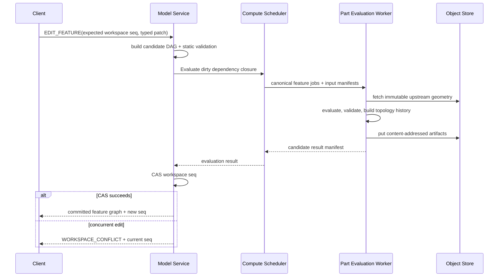

# Feature 求值、命名与质量门

> 目标契约，不等于已交付能力。返回[目标架构目录](../../TARGET_ARCHITECTURE.md)；当前事实见[当前架构](../../CURRENT_ARCHITECTURE.md)，实施顺序只在[统一路线](../../../plans/README.md)维护。

### 5.4.14 Feature Graph 重算与编辑

命令面至少包含：

- `CREATE_FEATURE(body_id, after_feature_id, typed_definition)`；
- `EDIT_FEATURE(feature_id, expected_feature_digest, patch)`；
- `REORDER_FEATURE(feature_id, after_feature_id, expected_workspace_seq)`；
- `SUPPRESS_FEATURE` / `RESUME_FEATURE`；
- `SET_BODY_TIP(body_id, feature_id)`；
- `DELETE_FEATURE(feature_id, dependency_policy)`。

任何结构编辑先在 Model Service 构建候选 DAG 并检查无环、类型兼容和依赖闭包，再由 Scheduler 求值。长计算不持有数据库锁；Worker 返回候选 manifest 后，Model Service 用 Workspace sequence CAS 提交。CAS 失败时候选 artifact 可作为内容寻址缓存保留，但不改变 Head。

编辑 Feature `Fi` 只使它的传递下游 dirty；上游和不相关 Body 复用缓存。单个 Body 的依赖链通常顺序执行，不同 Body、独立派生和只读分析可并行。



### 5.4.15 缓存键与确定性

```text
FeatureEvaluationKey = hash(
  canonical FeatureNode definition,
  ordered input GeometryIds,
  resolved selection evidence digests,
  referenced Parameter values,
  feature schema version,
  evaluator build ID,
  OCCT build + compile profile,
  tolerance/boolean/healing policy,
  architecture determinism class
)
```

缓存命中仍验证 artifact manifest 和 policy compatibility。预览可以使用较低 tessellation 精度，但 B-Rep 求值不得因相机或前端质量设置改变。若不同 CPU/OCCT 构建不能保证字节级相同，应标记 `GEOMETRIC_EQUIVALENCE` determinism class，并在发布 worker pool 中固定平台；不能假装 hash 可跨任意内核构建复用。

### 5.4.16 拓扑血缘与持久选择

每个 evaluator 建立三层证据：

1. **内核历史**：`Generated/Modified/IsDeleted`；
2. **语义来源**：Profile edge、cap、section interval、removed face、neutral plane 等；
3. **几何签名**：类型、邻接、面积/长度区间、参数域和局部 frame，作为消歧证据而非主要身份。

```proto
message TopologyHistory {
  repeated TopologyLineage lineage = 1;
  repeated TopologyTombstone deleted = 2;
  repeated AmbiguousLineage ambiguous = 3;
}

message TopologyLineage {
  repeated SemanticTopologyRef sources = 1;
  SemanticTopologyRef result = 2;
  LineageKind kind = 3; // GENERATED | MODIFIED | SPLIT | MERGED
  SelectionEvidence evidence = 4;
}
```

一个源面分裂为多个面时保留一对多；多个源面融合为一个面时保留多对一。下游选择若要求单 Face 而候选仍有多个，返回歧义并让用户重选，不能依靠容差最近匹配。布尔简化、Shell/Draft 的修改历史和 Loft 的显式 section matching 都必须进入同一图。

### 5.4.17 Shape 验证与结果门禁

每个成功 Feature 至少通过：

- Shape 非 null，拓扑遍历无异常；
- `BRepCheck_Analyzer` 或等价完整检查通过；
- 标准 Body 恰好一个闭合、可定向、正体积 Solid；
- 不存在开放 shell、非流形边、零面积面和超出 policy 的微小边；
- bbox、体积和面积均有限，坐标不超过租户/项目上限；
- operation-specific invariant 成立，例如 REMOVE 减材、Shell 厚度方向正确；
- 拓扑历史中所有 result ref 可解析，已删除来源有 tombstone；
- 序列化再读后的 ShapeSummary 在容差内一致。

自动 healing 只允许执行 evaluator policy 中列出的确定性步骤，并在 provenance 中记录。不能把任意 `ShapeFix` 当成最后兜底，因为它可能改变设计意图和拓扑身份。

### 5.4.18 诊断模型

| Code | 典型 Feature | 含义 |
|---|---|---|
| `INVALID_PROFILE` | Extrude/Revolve/Loft | Region 开放、自交或非平面 |
| `SELECTION_MISSING` | 全部 | 持久引用已删除 |
| `SELECTION_AMBIGUOUS` | 全部 | 引用解析到多个候选 |
| `INVALID_DIRECTION` / `INVALID_AXIS` | Extrude/Revolve/Draft | 零向量、退化轴或关系不合法 |
| `INVALID_EXTENT` | Extrude/Revolve | 长度、角度或限制面不合法 |
| `PROFILE_CROSSES_AXIS` | Revolve | 截面跨越回转轴 |
| `NO_MATERIAL_CHANGE` | ADD/REMOVE/INTERSECT | Tool 未产生预期材料变化 |
| `DISJOINT_RESULT` | ADD/New | 标准 Body 得到多个不连通 Solid |
| `EMPTY_RESULT` | REMOVE/INTERSECT | Body 被完全删除或交集为空 |
| `OFFSET_SELF_INTERSECTION` | Shell | 偏置发生自交/塌陷 |
| `THICKNESS_TOO_LARGE` | Shell | 局部几何无法容纳厚度 |
| `DRAFT_FACE_FAILED` | Draft | 指定面无法按中性面拔模 |
| `SECTION_MISMATCH` | Loft | 截面方向、seam 或边段对应失败 |
| `KERNEL_ALGORITHM_FAILED` | 全部 | 内核失败，附算法 stage/status |
| `INVALID_RESULT_SHAPE` | 全部 | 算法返回但未通过结果门禁 |
| `RESOURCE_LIMIT` / `DEADLINE_EXCEEDED` | 全部 | 资源或时间边界触发 |

Diagnostic 包含 `feature_id`、stage、parameter path、selection IDs、problematic topology evidence、kernel status、warning list 和可本地化 message key。内部异常栈只进受控日志，不能作为 API 的唯一错误信息。

### 5.4.19 Worker 边界、资源与安全

Part Feature 初期与现有 Geometry Worker 同部署，但模块边界按 `PartEvaluationWorker` 设计：

- Worker 只接受类型化、大小受限的 Proto 和 immutable artifact manifest；
- 每 Job 限制 Profile 边数、Loft 截面/边数、Shape 拓扑数、内存、CPU、wall time 和输出大小；
- OCCT 求值运行在可回收进程池；崩溃只使 Job 失败，由 Scheduler 按幂等策略重试；
- 重试必须使用同一 canonical input 和 evaluator capability；非确定性失败不能无限重试；
- Shape 反序列化、表达式结果和选择证据都视为不可信输入并验证；
- Worker 无数据库写权限，artifact 只能写到 Job 授权的临时前缀，提交由服务端 manifest finalize；
- cancellation 从 API 传播到 Scheduler/Worker；无法中断的内核调用由进程超时终止隔离。

无需为 Extrude、Revolve、Shell、Draft、Loft 各部署一个微服务。它们共享 OCCT 运行时、Shape cache 和 feature protocol，先作为同一 Worker 内的独立 evaluator/capability；只有资源画像或发布节奏明显分化时再拆池。例如 Loft/复杂 Shell 可路由到 high-memory 队列，但不改变领域 API。

### 5.4.20 可观测性

每次求值记录：

- feature type、schema/evaluator/OCCT build、operation 和 capability；
- 输入/输出 GeometryId、cache hit、dirty closure 大小；
- resolve、profile、tool build、boolean、modify、validation、serialization 各阶段耗时；
- 输入/输出 vertex-edge-face-solid 数量、bbox、体积变化；
- warnings、healing actions、selection ambiguity 和 kernel status；
- deadline、peak RSS、重试次数与 crash signature。

指标 label 不使用原始 FeatureId/GeometryId 造成高基数；这些 ID 放 trace attributes 并按租户权限控制。日志不得包含完整私有模型数据。

### 5.4.21 测试矩阵

| 层级 | 拉伸/切除 | 旋转 | Shell/Draft | Loft | 共用 |
|---|---|---|---|---|---|
| Schema golden | 所有 extent/operation | angle modes/axis | face groups/side | section/marker | 版本迁移、未知字段 |
| 解析几何 | 孔、多 Region、到面 | 半周/全周/接触轴 | 方盒、圆柱、斜面 | 圆-方、点终止 | 质量属性、bbox |
| 失败 corpus | 开环、no-op、断开 | 跨轴、自交 | 厚度塌陷、坏中性面 | 扭结、错序、mismatch | 非流形、资源边界 |
| Boolean | NEW/ADD/REMOVE/COMMON | 同左 | 不适用 | 同左 | 多 Solid、空结果 |
| Topology | cap/side lineage | seam/生成面 | modified/deleted face | interval lineage | split/merge/歧义 |
| Incremental | 改长度/终止面 | 改角度/轴 | 改面/厚度 | 改 section/marker | dirty closure/cache key |
| Metamorphic | 刚体变换、单位换算 | 轴反向+角度等价 | 整体变换 | section 同变换 | 序列化重放 |
| Differential | 简单棱柱解析体积 | 圆环/圆柱体积 | 基准 CAD 文件 | 规则直纹体 | OCCT build 对照 |
| Fuzz | profile/limit | profile/axis/angle | face selections | section lists | Proto、Shape 导入 |
| Benchmark | 1/100 regions | 复杂 profile | 1k faces | 2/20/100 sections | memory、cancel、crash |

每次升级 OCCT 必须在固定 corpus 上比较：成功/失败分类、Shape validity、质量属性、拓扑血缘可解析率和性能。仅比较 BREP 字节不够；仅看截图也不够。

### 5.4.22 推荐模块边界

```text
kernel/feature/api/
  typed definitions, common values, evaluator/result contracts

kernel/feature/selection/
  PersistentSelection resolver and evidence

kernel/feature/profile/
  Sketch Region / face / wire adapters

kernel/feature/generator/
  linear_extrude, revolve, loft, later sweep/rib/hole

kernel/feature/modify/
  shell, draft, later fillet/chamfer

kernel/feature/boolean/
  BodyOperation, result simplification policy, history merge

kernel/feature/validation/
  Shape checks, Body policy, mass properties, diagnostics

kernel/feature/history/
  semantic slots, Generated/Modified/Deleted, tombstones

kernel/occt/
  thin OCCT adapters only; no workspace or service semantics

workers/geometry/
  Part evaluation orchestration, artifact I/O, capability reporting
```

领域定义、canonical hash 和诊断不依赖 OCCT。OCCT adapter 不认识 Workspace sequence、租户或数据库。这样未来可以在同一契约后增加 CGAL/自研算法用于检查、网格或特定 Feature，而不会让 OCCT 类型泄漏到持久协议。
