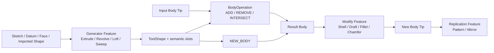
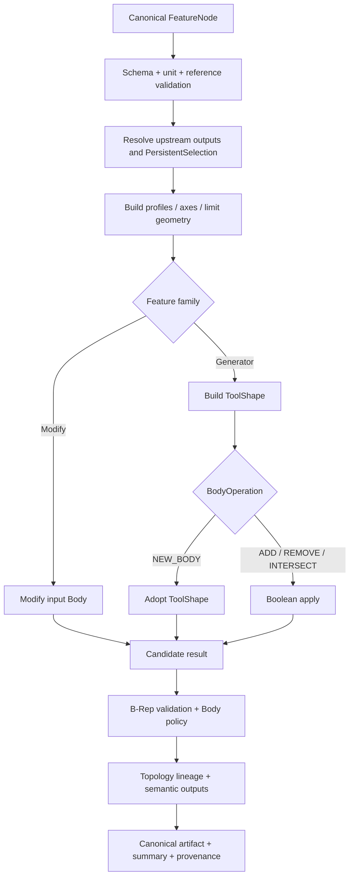

# Part、Body 与实体生成

> 目标契约，不等于已交付能力。返回[目标架构目录](../../TARGET_ARCHITECTURE.md)；当前事实见[当前架构](../../CURRENT_ARCHITECTURE.md)，实施顺序只在[统一路线](../../../plans/README.md)维护。

### 5.4.1 核心决策：生成几何与材料操作正交

“切除”不是另一套拉伸几何算法，“旋转切除”也不是另一套旋转算法。生成类特征先构造 `ToolShape`，再以统一的 `BodyOperation` 将它应用到目标 Body：

| `BodyOperation` | 领域语义 | OCCT 操作 | 默认结果约束 |
|---|---|---|---|
| `NEW_BODY` | 以 Tool 创建新 Body | 不做布尔 | 恰好一个有效 Solid |
| `ADD` | 增加材料 | Fuse | 与原 Body 形成一个连通 Solid |
| `REMOVE` | 移除材料 | Cut | 材料确有减少，且默认不能删空 Body |
| `INTERSECT` | 只保留交集 | Common | 结果非空且满足 Body solid policy |

因此前端可以显示“凸台/拉伸”和“凹槽/切除”两个命令，后端都提交 `LinearExtrudeFeature`，分别设置 `ADD` 与 `REMOVE`。同理，“旋转体”和“旋转槽”都提交 `RevolveFeature`。这样能避免参数、终止条件、诊断和拓扑命名在两套实现中漂移。

抽壳、拔模、圆角和倒角属于 `ModifyFeature`：它们读取一个上游 Body，直接产生修改后的 Body，不经过 Tool 布尔阶段。阵列、镜像属于 `ReplicationFeature`；孔、筋可以先作为参数化组合特征实现，但必须输出与原子特征相同的拓扑血缘。



### 5.4.2 Part、Body、Feature 与 Tip

- `PartRevision` 可包含多个 Body、Datum、Sketch 和发布接口；
- `Body` 是有序 Feature Graph 的建模容器，具有一个显式 `tip_feature_id`；
- 标准 `SOLID_BODY` 在每个可发布 Tip 上要求恰好一个连通 Solid；多实体零件由多个 Body 表达；
- 后续若支持铸造流道、晶格等多实体工作流，必须引入显式 `MULTI_SOLID_BODY`，不能悄悄丢弃第二个 Solid；
- Feature 的输入引用明确的 `FeatureOutputRef`，而不使用“数据库里最近一个 Shape”；
- 一般线性建模表现为有序历史，但底层保留 DAG：Datum、Sketch、跨 Body 引用和派生 Shape 可以共享上游；
- 改变 Tip 只是 Workspace 编辑；发布 Revision 前必须把从根到 Tip 的依赖闭包完整求值。

```text
PartRevision
  bodies[]
    Body { body_id, kind, tip_feature_id, feature_ids[] }
  features[]
    FeatureNode { identity, typed definition, input refs, state }
  datums[] / sketches[] / published_interfaces[]
```

Feature 状态使用 `ACTIVE | SUPPRESSED | FAILED | OUT_OF_DATE | BLOCKED_BY_UPSTREAM`。`SUPPRESSED` 输出其主输入的 pass-through，并保留 FeatureId；`FAILED` 绝不能返回上一次成功 Shape 冒充新结果。按 4.3.9，结构和参数有效的候选图可以形成带 `PARTIAL/FAILED` Evaluation 状态的新 Revision，便于保存并修复设计；Failed/Blocked Tip 不能通过 READY/Release Gate，上一成功 Shape 只能作为明确标记的 stale ghost 显示。

### 5.4.3 类型化 Feature 契约

公共 envelope 与具体参数分离，Proto 使用 `oneof definition`，禁止 `Any`、字符串类型名和未约束 JSON 成为权威格式：

```proto
message FeatureNode {
  string feature_id = 1;
  string body_id = 2;
  uint32 schema_version = 3;
  FeatureState state = 4;
  repeated FeatureOutputRef inputs = 5;
  oneof definition {
    LinearExtrudeFeature linear_extrude = 20;
    RevolveFeature revolve = 21;
    ShellFeature shell = 22;
    DraftFeature draft = 23;
    LoftFeature loft = 24;
  }
}

message FeatureResult {
  string feature_id = 1;
  FeatureEvaluationStatus status = 2;
  optional string result_body_geometry_id = 3;
  optional string tool_shape_geometry_id = 4;
  repeated SemanticOutput outputs = 5;
  TopologyHistory topology_history = 6;
  ShapeSummary summary = 7;
  repeated ResolvedParameter resolved_parameters = 8;
  repeated Diagnostic diagnostics = 9;
  EvaluatorProvenance provenance = 10;
}
```

`FeatureOutputRef` 至少包含 `part_revision_id/body_id/feature_id/output_slot`；同一候选 Workspace 内可使用临时 revision scope，但提交后解析为不可变 Revision。`output_slot` 使用稳定枚举或版本化 URI，例如 `RESULT_BODY`、`TOOL_SHAPE`、`START_CAP`、`END_CAP`、`SIDE_FROM_PROFILE_EDGE/<region-edge-id>`，不暴露 OCCT 的瞬时 `TopoDS_Shape` 地址或遍历序号。

### 5.4.4 共用选择、方向与长度类型

所有特征复用相同的量纲和引用类型：

```proto
message LengthValue {
  oneof source {
    double literal_meters = 1;
    string parameter_id = 2;
    string expression_id = 3;
  }
}

message AngleValue {
  oneof source {
    double literal_radians = 1;
    string parameter_id = 2;
    string expression_id = 3;
  }
}

message DirectionRef {
  oneof source {
    SketchNormalRef sketch_normal = 1;
    DatumAxisRef datum_axis = 2;
    PersistentSelection linear_edge = 3;
    Vector3 explicit_vector = 4;
  }
  bool reversed = 10;
}

message AxisRef {
  oneof source {
    SketchLineRef sketch_line = 1;
    DatumAxisRef datum_axis = 2;
    PersistentSelection linear_edge = 3;
    Axis3 explicit_axis = 4;
  }
  bool reversed = 10;
}
```

- 权威 literal 使用 SI 米/弧度；参数或表达式只保存对 Parameter Graph 的稳定引用，不在 Feature 内再存一份可能漂移的数值；
- 本次解析出的 SI 值、Parameter revision/digest 写入 `FeatureResult.resolved_parameters` 和 FeatureEvaluationKey，使结果可重放；
- `explicit_vector` 必须有限且归一化前长度大于 tolerance；
- 引用方向解析后保存选择证据和归一化结果摘要，重算仍从引用恢复，不能只固化世界坐标；
- `reversed` 表示用户意图，不通过偷偷给长度/角度传负数表达；
- 面选择、边选择、Sketch Region 都使用 5.7 节的 `PersistentSelection`，并明确期望拓扑类型和歧义策略；
- 所有输入列表以 ID 或显式序号规范排序后 hash；有几何含义的有序列表（Loft section、Draft group）保持用户顺序。

### 5.4.5 Profile 与 Region 契约

实体生成器不直接消费“整张草图”。它消费 Profile Builder 产生的 `ProfileSelection`：

```proto
message ProfileSelection {
  string sketch_id = 1;
  repeated string region_ids = 2;
  optional PersistentSelection planar_face = 3;
  ProfileUse use = 4; // SOLID_REGION | OPEN_WIRE | THIN
}
```

P0 的实体拉伸、旋转和多截面实体只接受 `SOLID_REGION`：每个 Region 必须是共面、闭合、无自交、方向已规范化的外环加零个或多个孔环。多 Region 是否允许由特征明确声明；不能把所有闭环无条件合并。`region_id` 来自草图平面图的稳定环身份，草图编辑后若无法唯一恢复，Feature 返回 `SELECTION_AMBIGUOUS`，不按面积或遍历顺序静默猜测。

开放轮廓用于曲面或薄壁特征，是后续独立能力；不要在 P0 中给开放 Wire 自动补线或自动生成零厚度实体。

### 5.4.6 共用求值流水线



每一步检查 cancellation/deadline。失败返回结构化诊断并丢弃候选 Shape；不得继续到对象存储，也不得改变 Workspace Head。Worker 的 OCCT 对象只在单次求值作用域存在，跨 RPC 只传内容寻址 GeometryId。

### 5.4.7 BodyOperation 与布尔后处理

`ADD/REMOVE/INTERSECT` 分别映射到 `BRepAlgoAPI_Fuse/Cut/Common`。实现遵循 [OCCT Boolean Operations](https://dev.opencascade.org/doc/overview/html/specification__boolean_operations.html) 的错误、警告和历史接口，但领域层增加以下约束：

1. 输入先经快速 Shape 检查；非法 B-Rep 不进入布尔；
2. 默认不启用 fuzzy tolerance；确需使用时它属于版本化 `ToleranceProfile` 和 FeatureEvaluationKey；
3. `SimplifyResult` 会合并边/面并改变拓扑身份，只能由 evaluator policy 明确启用，且必须吸收其历史；
4. `ADD` 对标准 Body 默认拒绝互不接触的多个 Solid，错误为 `DISJOINT_RESULT`；
5. `REMOVE` 默认要求体积减少超过质量容差，零相交返回 `NO_MATERIAL_CHANGE`；
6. `INTERSECT` 空结果为失败；任何操作得到多个 Solid 时按 Body policy 处理，绝不只取第一个；
7. `REMOVE` 删除整个 Body 默认失败，未来可用显式 `allow_empty_result` 支持工具性工作流；
8. OCCT warnings 进入 Diagnostic；可疑但可接受的 warning policy 必须版本化，不能只写日志。

布尔后的质量属性使用独立算法计算体积、面积、包围盒和质心摘要，用于 no-op 判断、缓存审计和回归测试；这些摘要不是 Shape 身份。

### 5.4.8 线性拉伸与切除

统一模型：

```proto
message LinearExtrudeFeature {
  ProfileSelection profile = 1;
  DirectionRef direction = 2;
  ExtrudeExtent extent = 3;
  BodyOperation operation = 4;
  optional AngleValue draft_angle = 5;
  DraftMaterialSide draft_side = 6;
  MergePolicy merge_policy = 7;
}

message ExtrudeExtent {
  oneof kind {
    BlindExtent blind = 1;
    SymmetricExtent symmetric = 2;
    TwoSidedExtent two_sided = 3;
    ThroughAllExtent through_all = 4;
    UpToFaceExtent up_to_face = 5;
    FromToExtent from_to = 6;
  }
}
```

| 终止类型 | 参数 | 精确语义 |
|---|---|---|
| `BLIND` | length、reversed | 从 Profile 平面沿方向移动给定正长度 |
| `SYMMETRIC` | total_length | 以 Profile 平面为中面，两侧各一半 |
| `TWO_SIDED` | forward_length、backward_length | 两侧长度独立，至少一侧非零 |
| `THROUGH_ALL` | direction/both_sides | 构造覆盖目标 Body bbox 加安全裕量的有限 Tool，再做布尔 |
| `UP_TO_FACE` | target face、offset、side | 沿方向以目标面/其偏置为终止，必须唯一截断所有相关射线 |
| `FROM_TO` | start face、end face、offsets | Profile 只提供截面形状，实际起止由两个限制面确定 |

第一阶段用 [BRepPrimAPI_MakePrism](https://dev.opencascade.org/doc/refman/html/class_b_rep_prim_a_p_i___make_prism.html) 生成直线扫掠，并读取 `FirstShape/LastShape/Generated` 建立初始血缘。`THROUGH_ALL` 的 Tool 长度由目标 Body 在归一化方向上的投影区间、Profile bbox 和版本化裕量计算；不能使用固定的“很大数”。`UP_TO_FACE/FROM_TO` 的 P0 范围先限定为可唯一确定半空间的平面；曲面终止只有在所有生成射线存在一致、唯一的首个交点且能够形成有效端盖时才开放。

对于 ADD/REMOVE 的到面特征，evaluator 可选择 [BRepFeat_MakePrism](https://dev.opencascade.org/doc/refman/html/class_b_rep_feat___make_prism.html) 等专用 OCCT 路径，而不是强制构造超长 Tool；这是内核策略，不改变领域层的 Profile/Extent/BodyOperation 契约。专用路径必须产生同等的 Shape gate、语义输出和 TopologyHistory。NEW_BODY/INTERSECT 或专用路径不适用时，才使用候选 Tool + 限制几何裁剪 + 通用布尔，并验证每个 Region 都得到预期封闭结果。

`draft_angle=0` 是普通棱柱。非零拉伸斜度在一个 Feature 求值事务内分两步完成：先生成棱柱，再以起始/中性平面和生成侧面执行局部 Draft；两步历史组合成该 Feature 的最终历史。若任何侧面无法拔模，整个拉伸失败，不能返回部分斜度。角度正负由 `DirectionRef + DraftSide` 的明确约定解释，不依赖面法向偶然方向。

**参数和几何校验**

- length 必须有限且大于 `linear_epsilon`；`SYMMETRIC.total_length` 是总长，不是单侧长度；
- Profile 平面法向与 Direction 可以不同，但近似平行于 Profile 平面时无法生成 Solid，返回 `SWEEP_DIRECTION_TANGENT_TO_PROFILE`；
- 实体 Profile 必须闭合；孔环方向由 Profile Builder 统一，不从客户端 wire 顺序推断；
- 多 Region 在 `NEW_BODY` 下若生成多个互不连接 Solid，标准 Body 拒绝；在 `ADD/REMOVE` 下允许每个 Region 形成同一布尔工具集合；
- `UP_TO_FACE` 若目标面在反方向、截断不唯一或只覆盖部分 Region，返回带 face/region ID 的诊断；
- `REMOVE` 的切除 Profile 可位于 Body 外，但默认 no-op 仍失败；预览 API 可返回 warning 而不提交。

**拓扑输出**

- `START_CAP/<region-id>` 与 `END_CAP/<region-id>`；
- `SIDE_FROM_PROFILE_EDGE/<entity-or-loop-edge-id>`；
- Profile 孔边生成的侧面保持 hole lineage；
- 经布尔修改的 Body face 同时记录 upstream face 与 Tool face 的来源集合；
- 被删除的面进入 tombstone，不能映射到任意“最相似”面。

### 5.4.9 旋转体与旋转切除

```proto
message RevolveFeature {
  ProfileSelection profile = 1;
  AxisRef axis = 2;
  RevolveExtent extent = 3;
  BodyOperation operation = 4;
}

message RevolveExtent {
  AngleValue forward_angle = 1;
  optional AngleValue backward_angle = 2;
  RevolveMode mode = 3; // ONE_SIDE | SYMMETRIC | TWO_SIDED | FULL
}
```

使用 [BRepPrimAPI_MakeRevol](https://dev.opencascade.org/doc/refman/html/class_b_rep_prim_a_p_i___make_revol.html) 构造旋转 Tool，并收集 `FirstShape/LastShape/Generated`。语义约束：

- `ONE_SIDE` 的 `0 < angle <= 2π`；`FULL` 固定为精确一周，不接受接近 `2π` 的随意值；
- `SYMMETRIC` 的参数是总角度；`TWO_SIDED` 保存两个非负角度和明确方向；
- Axis 必须与 Profile 共面，或由专门的三维截面规则显式允许；P0 要求共面；
- 闭合 Profile 不得横跨 Axis；允许边界接触 Axis 形成无孔旋转体，但接触必须是可验证的点/边关系，不允许 tolerance 偶然相交；
- Profile 与 Axis 重合的边、零半径回转和自相交回转均失败；
- FULL 回转会产生 seam，seam 只作为拓扑实现细节，不作为用户选择的唯一身份来源；
- `operation` 仍使用统一 NEW/ADD/REMOVE/INTERSECT，因此旋转切除无需单独 schema。

语义输出包括 `REVOLVE_START_CAP`、`REVOLVE_END_CAP`（FULL 时不存在）、`REVOLVED_FACE_FROM_PROFILE_EDGE` 和 `AXIS_CONTACT`. 全周回转的周期面使用 profile edge lineage、axis、周期参数区间共同命名。
