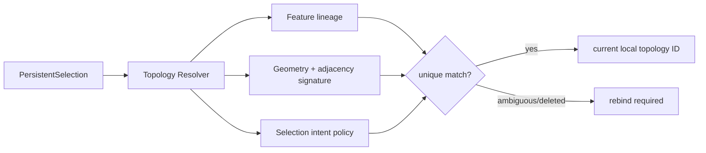

# 持久拓扑命名

> 目标契约，不等于已交付能力。返回[目标架构目录](../../TARGET_ARCHITECTURE.md)；当前事实见[当前架构](../../CURRENT_ARCHITECTURE.md)，实施顺序只在[统一路线](../../../plans/README.md)维护。

## 5.7 拓扑命名是平台级能力

没有 Persistent Topological Naming，就无法可靠实现圆角、倒角、面上草图、装配 Mate 和工程图标注。目标不能把 `edge_local_id` 持久化。

每次 Feature 求值应产生 `TopologyHistory`：

- 输入选择的稳定语义（Feature output + selector）；
- OCCT Modified/Generated/Deleted 历史；
- 几何签名（类型、面积/长度、质心、邻接、方向、参数域）；
- 一对多/多对一 lineage；
- 匹配置信度与歧义诊断。

发生歧义时必须显式失败并让用户重新绑定，不能静默选择“看起来最近”的边。
