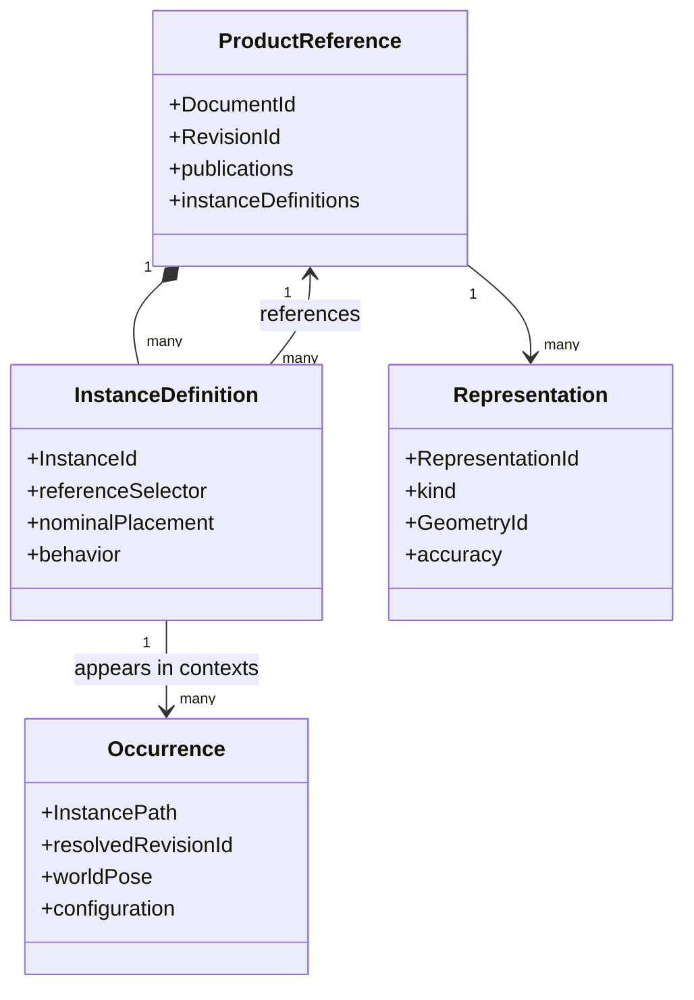

# Product 结构、Publication 与上下文

> 目标契约，不等于已交付能力。返回[目标架构目录](../../TARGET_ARCHITECTURE.md)；当前事实见[当前架构](../../CURRENT_ARCHITECTURE.md)，实施顺序只在[统一路线](../../../plans/README.md)维护。

### 5.6.1 能力分层与明确边界

| 层级 | 负责内容 | 不负责内容 |
|---|---|---|
| Product Structure | Reference/Instance、层级、配置、版本解析、BOM | 几何约束数值求解 |
| Assembly Design | Placement、Engineering Connection、DOF、Publication、上下文引用 | 接触动力学、FEA |
| DMU Navigator/Space | 大装配浏览、测量、剖切、干涉、间隙、比较、审查 | 改写权威 Part B-Rep |
| DMU Kinematics | Mechanism、Joint、Driver/Law、运动包络、轨迹 | 基于质量/力的真实动力学 |
| Basic Dynamics | 刚体质量惯量、力、弹簧阻尼、接触近似 | 应力、变形、疲劳、CFD |
| Multi-domain | FMI Model Exchange/Co-Simulation、外部系统模型 | 把任意 FMU 结果冒充 CAD 设计状态 |

设计定位、运动学状态和动力学状态是三种不同结果：

- `AssemblySolveResult` 是满足装配定义的静态 Pose，可提交到 Workspace；
- `KinematicRun` 是一段由 joint coordinate/driver 决定的 Pose 时序，只是 Simulation Artifact；
- `DynamicsRun` 是由质量、力和积分器产生的状态时序，也只是 Simulation Artifact；
- 仿真帧不能直接覆盖 Instance 的设计 Placement。用户若要采用某一帧，必须执行显式 `CAPTURE_POSITION`，重新验证约束后生成新的 Workspace 命令。

### 5.6.3 Reference、Instance、Occurrence 与 Representation

这是装配模型最重要的身份边界：



- **Reference**：可复用定义，即 Part/Product 的不可变 Revision；
- **InstanceDefinition**：某 Product Reference 直接拥有的一条实例边；同一 Part 可有多个不同 InstanceId；
- **Occurrence**：从某个根 Product/配置沿实例边展开后得到的上下文对象；
- **Representation**：Reference 的精确 B-Rep、轻量网格、包围盒、碰撞代理或简化包络；
- **Occurrence 不持有复制 B-Rep**，它只绑定 resolved reference、上下文 Pose、属性覆盖和表示选择；
- 同一个 InstanceDefinition 可以在不同祖先 occurrence 下出现多次，因此仅用 InstanceId 不能唯一指向大装配中的对象。

文档和 API 不混用 component/instance/occurrence。UI 可以显示“组件”，但 selection、constraint 和 DMU report 必须携带准确身份。

### 5.6.4 InstancePath 的权威定义

```proto
message InstancePath {
  string root_product_revision_id = 1;
  repeated InstancePathSegment segments = 2;
  string configuration_snapshot_id = 3;
}

message InstancePathSegment {
  string owner_product_revision_id = 1;
  string instance_id = 2;
  string resolved_reference_revision_id = 3;
}
```

Canonical textual form 只用于 URL、日志和 UI：

```text
rootRevision/instanceId@resolvedRevision/instanceId@resolvedRevision/...
```

权威持久格式是 typed segments，不解析 display name，不使用数组下标，也不把 `/` 拼接字符串当数据库主键。

规则：

1. `InstanceId` 在拥有它的 Product Reference 历史内稳定且不复用；
2. 约束由两端最低共同 Product ancestor 拥有，端点保存相对于该 owner 的 `RelativeInstancePath`；
3. Product Revision 发布时，所有路径都通过同一 `ConfigurationSnapshot` 解析为确定 Revision；
4. Workspace 的 FOLLOW_HEAD 可以浮动，但每次 solve/DMU Job 先生成 immutable Resolution Snapshot；
5. Reparent/Replace 操作必须生成 path rewrite map，逐项重写 Constraint、Publication、Scene、DMU scope；无法唯一重写就拒绝命令；
6. Delete 留下 Instance tombstone，报告和审查问题仍可解释历史路径；
7. 一个叶 occurrence 的稳定审查身份为 `(root revision, configuration snapshot, instance path)`，不以 world transform 或显示名称识别；
8. 权限检查沿路径验证每个被引用 Revision；无权访问的分支可显示受保护占位符，但不能泄露几何或属性。

### 5.6.5 ReferenceSelector 与确定性依赖解析

```proto
message ReferenceSelector {
  string document_id = 1;
  oneof policy {
    string pinned_revision_id = 2;
    string release_channel_id = 3;
    FollowWorkspaceHead follow_workspace_head = 4;
  }
}
```

- `PINNED` 用于已发布和可复现产品；
- `RELEASE_CHANNEL` 用于受控依赖升级，例如 `released/main`，解析结果仍进入 snapshot；
- `FOLLOW_WORKSPACE_HEAD` 只适合编辑态，发布 Product Revision 前必须锁定完整 dependency closure；
- snapshot 记录 selector、resolved Revision、解析时间、策略版本和访问证据；
- Head 变化不直接修改 Product Revision，只令 Workspace 标记 `DEPENDENCY_UPDATE_AVAILABLE`；
- 用户接受更新时先重算 Publication/Constraint/DMU 影响，再以单个事务提交；
- dependency resolution 检查跨 Revision 引用环，而不只检查当前数据库 Head。

当前 `FOLLOW_HEAD | PINNED` 可以平滑映射到此模型；旧 Revision 的具体 resolved version 仍保留。

### 5.6.6 完整 Placement 与坐标系约定

```proto
message RigidTransform {
  Vector3 translation_m = 1;
  Quaternion rotation = 2; // x,y,z,w
}

message InstancePlacement {
  RigidTransform nominal = 1;
  PlacementMode mode = 2; // FREE | FIXED | SOLVED
}
```

- Placement 只允许 SE(3) 刚体变换；assembly instance 不允许 scale、shear 或 reflection；
- Quaternion 必须有限、单位化并使用统一符号规范，例如首个非零分量为正，避免同一旋转有两个 hash；
- 坐标为右手系，角度弧度、长度 SI 米；矩阵采用明确的 column-vector convention；
- `T_world_occurrence = T_world_parent × T_parent_instance`；组合顺序写入 conformance tests；
- `nominal` 是用户插入/上次接受求解后的设计 Pose，不是临时拖拽帧；
- Solver 输出完整 Pose map，Model Service 只提交发生变化的 occurrence-local placements；
- 浮点近等不直接决定是否改变 Revision，使用 canonical pose 与 pose tolerance；
- 任何使用 Euler angle 的 UI 必须在 API 边界转换，持久层不以 Euler angle 保存旋转。

### 5.6.7 产品结构、配置与 BOM

```proto
message InstanceDefinition {
  string instance_id = 1;
  string display_name = 2;
  ReferenceSelector reference = 3;
  InstancePlacement placement = 4;
  InstanceBehavior behavior = 5;
  SuppressionRule suppression = 6;
  repeated PropertyOverride properties = 7;
  optional string reference_designator = 8;
}
```

`ConfigurationContext` 至少包含 configuration ID、effectivity/date/serial context、option selections、representation policy 和 dependency snapshot。相同 Product Revision 在不同配置下可以展开为不同 occurrence 集，但每个分析 Job 必须绑定一个完整 snapshot。

BOM 区分：

- **Engineering BOM** 按 Reference/part number 聚合 quantity；
- **Occurrence BOM** 保留每个 InstancePath/reference designator；
- `NORMAL | PHANTOM | REFERENCE | PURCHASED | MAKE` 等 BOM 行为显式配置；
- suppressed occurrence 不进入当前配置的数量，但保留结构历史；
- flexible occurrence 仍只计一个 subassembly Reference，其内部展开规则由 BOM view 决定；
- 质量、材料、惯量来自 resolved Part Revision，instance override 必须显式并有审计；
- BOM/Search 是 Product Revision 的派生索引，可以重建，不是 Product 图的第二真相。

装配阵列和镜像不应退化为一批无关系的复制 Instance。`AssemblyPattern` 以源 Instance、方向/轴、数量、间距或引用的 Part Pattern 为输入，为每个成员分配持久 `member_key`；成员 InstancePath 使用稳定 member key，而不是当前数组下标。阵列参数变化时保留仍可匹配成员的 identity、Publication 绑定和约束；删除成员形成 tombstone，不能让后续成员“顶替”旧路径。镜像必须显式记录左右件策略：复用同一 Reference 仅改变 Placement，或创建派生 mirrored Part Revision；系统不得用负 scale 伪造镜像刚体。

### 5.6.8 Publication：装配接口而非显示别名

Publication 是 Part/Product 对外承诺的稳定几何或功能接口：

```proto
message Publication {
  string publication_id = 1;
  string name = 2;
  PublicationType type = 3;
  PublishedTarget target = 4;
  InterfaceContract contract = 5;
  string semantic_version = 6;
}

message PublishedTarget {
  oneof target {
    PersistentSelection local_geometry = 1;
    DatumRef datum = 2;
    RelativeOccurrencePublication occurrence_publication = 3;
    ConnectorDefinition connector = 4;
  }
}
```

Publication 类型至少包括 `POINT | AXIS | PLANE | FRAME | CURVE | SURFACE | BODY | CONNECTOR | PARAMETER`。`CONNECTOR` 在几何 frame 上增加功能语义：接口种类、轴向、旋转对称性、极性、允许的 Connection 类型、名义间隙/尺寸和自定义属性。

- Part Publication 指向本 Revision 内稳定 Datum/Feature output/PersistentSelection；
- Product Publication 可以转发某个相对 occurrence 的子 Publication，形成稳定顶层接口；
- 下游约束优先引用 PublicationId，而不是任意 face；
- Publication target 改变但 contract 兼容时，下游可重算；类型、对称性或单位不兼容则标记 `BROKEN_PUBLICATION`；
- rename 不改变 PublicationId；semantic version 用于表达合同变化，不进入显示名称；
- Publication name 在所属 Part/Product Reference 内按版本化 normalization/case-fold profile 唯一；名称用于树、搜索和自动化查询，持久引用仍只保存 PublicationId；
- 默认名按 target kind 分配 `Face1`、`Edge1`、`Point1`、`Plane1`、`Axis1`、`Body1` 等，参数优先采用可读 parameter key；历史序号不因删除而复用；
- Replacement Part 必须满足被使用的 Publication contracts，才能自动替换；
- Publication 可以隐藏内部拓扑和敏感参数，支持供应商黑盒模型；
- 外部上下文设计只能引用已发布接口或经策略批准的 deep link；发布 Revision 默认禁止新增未治理 deep link。

### 5.6.9 Product 中心的装配上下文设计

普通 in-context design 采用显式 input/output/wiring 三层，而不是让共享 Part 保存某个任意 Product occurrence 的来源：

```text
Part/Product Reference: Publication  = typed output port
Part Reference:         ContextInput = typed input port
Root Product Revision:  ContextBinding(source occurrence Publication,
                                       owning occurrence ContextInput)
```

`ContextInput` 以稳定 `ContextInputId` 声明 expected contract、消费槽位、默认/required 策略和 isolate 行为；它可以映射到 ParameterId、Datum input、Sketch ExternalGeometry input 或 Feature input，但不保存 source Document/occurrence。`ContextBinding` 由两端 occurrence 的最低共同 Product ancestor 拥有：

```proto
message ContextBinding {
  string binding_id = 1;
  RelativeInstancePath owning_occurrence = 2;
  string context_input_id = 3;
  RelativeInstancePath source_occurrence = 4;
  string publication_id = 5;
  InterfaceContract expected_contract = 6;
  ReferenceSelector selector = 7;
  BindingResolutionSnapshot accepted = 8;
}
```

- 关联边是单向依赖；Part 不反向修改 Product，Product 也不通过 binding 改写 source Part；
- 创建时冻结 root Product/configuration、两端 InstancePath、Publication contract 和 transform into owning Part frame；
- 更新时在同一 root context 中解析 source，再把参数或几何描述转换到 owning Part local frame；
- 禁止 Part A 的输出经 Product 驱动 B，而 B 的输出又反向驱动 A；提交前对参数/几何依赖 DAG 做环检测；Assembly constraint graph 可以形成闭环，不能与依赖 DAG 混淆；
- isolate 将 accepted value/geometry 固化进消费 Part 的本地槽位并删除 Product binding，保留 provenance；
- FOLLOW Workspace Head 只用于编辑态。Product Version/Release 必须冻结完整 binding resolution closure；
- 同一个 Part Reference 的两个 occurrence 可以接受不同 binding set，但不得把某一 occurrence 的值写回共享 Reference。

Occurrence-specific 求值使用派生 Context Variant：

```text
ContextVariantKey = hash(base Part Revision,
                         normalized accepted input snapshots,
                         evaluator/policy versions)
```

root Product Revision、owning InstancePath 和 BindingId 属于 provenance/traceability，不进入制品等价性的 cache key；否则同一 Wheel 定义在四个 occurrence 中即使输入完全相同也无法共享。相同 base Revision 与规范化输入 digest 可以共享 GeometryId/Artifact；不同输入产生不同派生 evaluation。需要脱离上下文复用时，用户显式执行 `Derive Part from Context` 创建新的 Part Reference/Revision，系统不隐式复制文档。

Product 工作台建立 `ProductDesignSession`，以 root Product Workspace、base Revision/configuration 和 active InstancePath 表达编辑上下文。激活、可见性和 selection 是会话状态，不写 Revision。双击 occurrence 默认原位编辑；独立窗口必须明确区分 `Open Definition` 与携带同一 context token 的 `Open in This Context`。

在 Product 树上执行“新建零件”是一个 Product-scoped domain intent，不是浏览器串联 `CreateDocument` 与 `InsertInstance`。请求以 root Product snapshot 和可选目标 Product InstancePath 定位 owner；系统原子创建 Part Reference 的初始 Revision、owner 中的 occurrence，并推进全部祖先 Product snapshot。默认 placement 是目标 Product 原点；以后支持“选择点作为原点”时必须作为显式、版本化 placement intent 加入同一请求，不能从瞬时选择状态暗中推断。撤销该动作移除 occurrence 和祖先引用推进，但保留已创建的 Part Reference 作为可恢复资源；删除文档是另一项显式生命周期操作。

跨 occurrence 引用的 picker 查询 root-snapshot-scoped `ContextCatalog`，只返回当前 Product 结构中可达、授权、configuration 有效、合同兼容且不会形成依赖环的 Publication。普通 UI 不浏览全租户 Document，也不要求用户填写 DocumentId/PublicationId。选择未发布对象时，可以由一个 `ProductDesignTransaction` 原子完成 source Publication、consumer ContextInput 和 Product ContextBinding 的创建。

根 Product 的 Design Inputs 面板可以聚合并编辑被转发且标记为 `DESIGN_INPUT` 的 PARAMETER Publication，但不复制参数值。每个可编辑项仍解析到唯一 source occurrence、PublicationId 和 ParameterId；编辑 source Part 后，其他消费者只进入 `UPDATE_AVAILABLE`，直到用户接受 Product Update Plan。真正的 Product Parameter/Configuration 属于独立领域实体，不能由 UI 聚合值替代。
