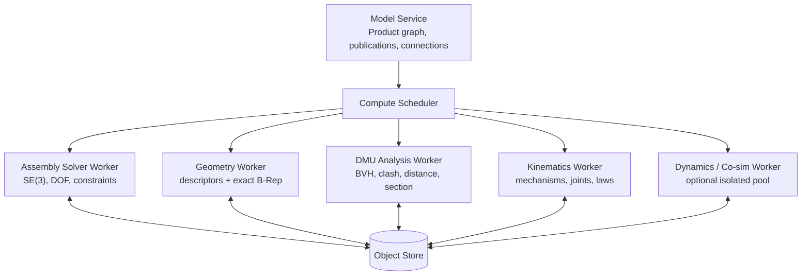
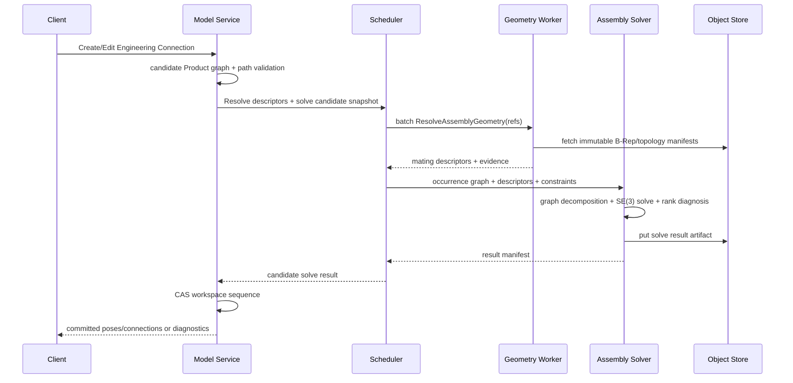

# Product 求值、资源与验证

> 目标契约，不等于已交付能力。返回[目标架构目录](../../TARGET_ARCHITECTURE.md)；当前事实见[当前架构](../../CURRENT_ARCHITECTURE.md)，实施顺序只在[统一路线](../../../plans/README.md)维护。

### 5.6.33 Worker 与服务边界



- Product Structure、Publication contract 和命令事务留在 Model Service；
- Assembly Solver 保持独立算法库，输入是不可变纯值；当前与 Geometry Worker 共部署，只有负载/隔离证据满足时拆成独立 Worker；
- Geometry Worker 批量解析 Publication/PersistentSelection 为 descriptors；
- DMU Worker 维护可丢失 BVH/representation cache，并按需调用/排队 exact geometry；
- Kinematics 与 Dynamics 最初可同一部署不同 capability，资源/依赖成熟后拆池；
- FMU/第三方 dynamics 放更严格沙箱，不与 Model/Geometry Worker 共进程；
- 每个 Worker 只写 Job 授权对象前缀，Model Service 最终 CAS manifest；
- 一次 connected constraint component 或 closed-loop mechanism 不跨网络拆成逐方程 RPC。

### 5.6.34 装配求值调用流程



### 5.6.35 缓存、增量与确定性

```text
AssemblySolveKey = hash(
  canonical relevant occurrence graph,
  dependency/configuration snapshot,
  nominal poses + flexible overrides,
  active connection definitions,
  resolved descriptor digests,
  parameter values,
  solver build/profile + architecture class
)
```

DMU Key 加入 occurrence Pose map、representation manifests、scope/rules、clearance/tolerance 和 exact policy。Simulation Key 加入 Mechanism/Dynamics model、laws、time/integrator、collision proxies 和 solver build。

- 改一个 rigid cluster 只重求其 constraint connected component；
- 改一个 occurrence Pose/GeometryId 只更新其 BVH leaf 和潜在 overlap pairs；
- Publication descriptor 缓存按 Part GeometryId + PublicationId + resolver version；
- 同一 Reference 的多 occurrences 共享 geometry cache，不共享 world Pose；
- 结果归并按 canonical InstancePath/ConstraintId 排序，禁止线程完成顺序影响 hash；
- 数值解跨架构不能保证字节一致时标 `GEOMETRIC_EQUIVALENCE` 并固定发布 Worker platform；
- Simulation 浮点轨迹默认不作为跨平台内容等同，manifest 仍可内容寻址并记录环境。

### 5.6.36 可观测性、资源与安全

Assembly 指标：occurrence/reference/leaf 数、展开深度、rigid clusters、constraints、connected components、remaining DOF、iterations、residual、conflict set、cache hit。

DMU 指标：scope/pair 数、broad-phase candidates、proxy/exact pairs、BVH build/refit、minimum distance、clash volume、completeness、peak RSS。

Simulation 指标：bodies/joints/loops、steps/rejected steps/events、constraint drift、energy error、collision queries、real-time factor、output bytes。

资源边界：最大层深/occurrences/constraints、路径长度、Publication 数、pair candidates、exact pair 数、time steps、output series、FMU wall time。Product 展开和 recursive reference 有 cycle/depth/size 防护；恶意或退化 geometry/mesh/FMU 隔离处理。Metrics 不用 InstancePath 作为高基数 label，ID 放受权限控制的 trace。

### 5.6.37 统一错误模型

| Code | 含义 |
|---|---|
| `INSTANCE_PATH_NOT_FOUND` | 路径段被删或配置中不存在 |
| `REFERENCE_CYCLE` | Product/context dependency 构成环 |
| `REFERENCE_RESOLUTION_CHANGED` | Snapshot 与提交时依赖解析不一致 |
| `PUBLICATION_BROKEN` / `PUBLICATION_INCOMPATIBLE` | 发布目标丢失或合同不兼容 |
| `CONSTRAINT_GEOMETRY_INCOMPATIBLE` | Constraint 与 endpoint kind 不匹配 |
| `CONSTRAINT_REDUNDANT` / `CONSTRAINT_CONFLICTING` | 冗余或过约束 |
| `ASSEMBLY_UNDER_CONSTRAINED` | 成功但仍有 DOF |
| `ASSEMBLY_BRANCH_AMBIGUOUS` | angle/side/orientation 多解 |
| `ASSEMBLY_SOLVER_NON_CONVERGENT` | 数值求解未收敛 |
| `FLEXIBLE_OVERRIDE_BROKEN` | 子装配更新后 override 无法重放 |
| `JOINT_MAPPING_AMBIGUOUS` | Connection 不能唯一转换为 Joint |
| `KINEMATIC_LOOP_INCONSISTENT` | 闭环机构不可满足 |
| `JOINT_LIMIT_VIOLATION` | q 超出 limit |
| `INTERFERENCE_INCONCLUSIVE` | 表示精度/资源不足以分类 |
| `DYNAMICS_MASS_PROPERTIES_MISSING` | body 缺失有效质量/惯量 |
| `SIMULATION_CONSTRAINT_DRIFT` | 动力学约束漂移超限 |
| `FMU_SECURITY_REJECTED` | FMU 签名/平台/沙箱策略不通过 |

Diagnostic 包含 Product Revision/config snapshot、InstancePaths、Connection/Constraint/Joint IDs、geometry evidence、residual/threshold、solver stage、suggestion key 和 highlight artifact。用户文本本地化，服务端不让客户端解析英文错误。

### 5.6.38 测试与验证矩阵

| 层级 | 覆盖内容 |
|---|---|
| Schema golden | Reference/Instance/Path/Publication/Constraint/Mechanism/DMU/Run |
| Path identity | 多级复用、同 Reference 多 occurrence、reparent、replace、tombstone |
| Resolution | PINNED/FOLLOW/channel、配置、依赖锁、cycle、权限 |
| Transform | SE(3) 组合、quaternion 规范、局部/世界 frame、单位 |
| Publication | 转发、替换合同、拓扑变化、黑盒接口、context link |
| Constraint unit | 每种几何组合的方程/Jacobian/branch/残差 |
| Solver | fully/under/redundant/conflicting、gauge、rigid cluster、large sparse |
| Flexible | 同一子装配多 occurrence 独立 override、升级重放 |
| Mechanism | 每种 Joint、closed loop、limit、gear/rack、FK/IK |
| Motion | law、branch continuity、trace、swept envelope、stop-on-clash |
| DMU | clash/contact/clearance、exact/proxy、open shell、rules、partial |
| Incremental | 单 occurrence move、单 Part geometry update、BVH refit、issue diff |
| Measure/Section | exact witness、periodic/degenerate geometry、annotation rebind |
| Dynamics | pendulum、four-bar、energy/momentum、spring-damper、contact corpus |
| FMI | state machine、units、event、early return、timeout、恶意 FMU |
| Exchange | STEP assembly structure/placement/name、units、shared references |
| Metamorphic | 整体刚体变换、root change、路径显示 rename、等价 quaternion |
| Fuzz/security | Proto、deep graph、cycles、bad mesh/B-Rep/FMU、resource limits |
| Benchmark | 1k/10k/100k occurrences、10k constraints、million candidate pairs |

Constraint Jacobian 用 finite-difference/automatic differentiation 对照解析实现；Mechanism 用已知解析机构和第二后端对照；DMU proxy 结果用 exact subset 校验 false-negative rate，发布规则默认不允许未知 false negative。

### 5.6.39 推荐模块边界

```text
model/product/api/              reference, instance, path, configuration, BOM
model/product/resolve/          dependency/configuration snapshot and expansion
model/product/publication/      contracts, forwarding, replacement compatibility
model/product/context/          in-context external references and cycle checks

kernel/assembly/api/            connection, constraint, descriptor, result contracts
kernel/assembly/graph/          rigid clusters, components, DOF and diagnostics
kernel/assembly/solver-api/     backend-neutral SE(3) solver
kernel/assembly/solver-ceres/   optional numeric adapter

kernel/mechanism/api/           bodies, joints, drivers, laws, sensors
kernel/mechanism/solver/        FK, IK, loops and time kinematics
kernel/dynamics/api/            inertia, forces, contacts, run contracts

kernel/dmu/api/                 scope, pair rules, reports, scenes and compare
kernel/dmu/proximity/           BVH, mesh collision/distance, continuous queries
kernel/dmu/exact/               OCCT exact refinement adapter
kernel/dmu/section/             section and measurement

workers/assembly-solver/
workers/dmu-analysis/
workers/mechanism/
workers/dynamics/
tests/assembly-corpus/
tests/dmu-corpus/
tests/simulation-corpus/
```

产品结构模块不依赖 OCCT/FCL/Pinocchio。公共 Proto 不包含第三方 Solver 或物理引擎类型；所有后端经内部 Adapter 和 conformance suite 替换。
