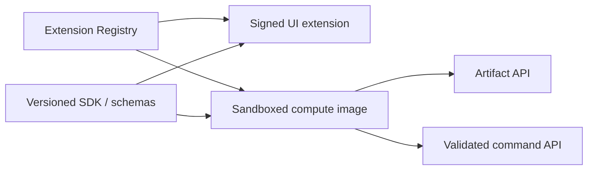

# 安全、可观测性与扩展边界

> 目标契约，不等于已交付能力。返回[目标架构目录](../../TARGET_ARCHITECTURE.md)；当前事实见[当前架构](../../CURRENT_ARCHITECTURE.md)，实施顺序只在[统一路线](../../../plans/README.md)维护。

## 11. 开源技术基线

| 层 | 推荐基线 | 决策说明 |
|---|---|---|
| 精确几何 | OCCT 固定可重现基线 | 仓库现为 7.9.1；上游已发布 8.0.0，但属于广泛源码不兼容的重大升级候选，需独立 migration spike 和完整 corpus 后决策。[OCCT 8.0.0 公告](https://dev.opencascade.org/content/open-cascade-technology-800-release) [升级说明](https://dev.opencascade.org/doc/overview/html/occt__upgrade.html) |
| 二维草图 | 自有接口 + PlaneGCS 评估 | 功能成熟；必须审计 LGPL 与抽取维护成本 |
| 数值优化 | Eigen + Ceres 候选 | 装配/特殊约束；保持 backend adapter，审计可选稀疏依赖 |
| 精确交换 | OCCT XDE/STEPCAF | 逐步支持 AP242、颜色、名称和装配语义 |
| 碰撞 | BVH/FCL 候选 + OCCT 精确验证 | 交互代理与发布级精确检查分离 |
| Web | React + TypeScript + Three.js | 延续现有投入；WebGPU 作为渐进加速而非硬依赖 |
| 业务服务 | Go + gRPC/Protobuf | 延续现有实现，控制面效率高 |
| 数据库 | PostgreSQL | 强事务、JSONB、RLS、成熟 HA |
| 对象存储 | S3 API；SeaweedFS/Ceph 评估 | 避免供应商绑定，内容寻址 |
| 消息 | NATS JetStream | 比 Kafka 更轻；事件量/保留需求改变后再评估 Kafka/Redpanda |
| 编排 | Kubernetes | Worker pools、隔离、弹性；领域调度由自有 Scheduler 完成 |
| 可观测 | OpenTelemetry + Prometheus/Grafana/Loki/Tempo | OTel 是厂商中立的 traces/metrics/logs 框架，[官方文档](https://opentelemetry.io/docs/) |
| IAM | OIDC provider（Keycloak/Zitadel 等） | 平台不长期自研企业 SSO/MFA；领域 ACL 仍由 Model Service 管理 |

候选不等于依赖。所有第三方组件登记 SPDX、版本、链接方式、许可证、CVE 和替代方案，生成 SBOM；强 copyleft 工具可通过独立插件进程使用，但必须由法律与项目许可证策略明确批准。

## 12. 安全与多租户

- Gateway 终止 TLS，使用 OIDC/OAuth2；短生命周期访问令牌，浏览器优先安全 HttpOnly 会话；
- 每个请求携带 tenant/principal，服务端执行 RBAC + resource ACL，PostgreSQL RLS 作纵深防御；
- Signed URL 限制对象、动作、大小、有效期和内容摘要；
- STEP/IGES/插件 Worker 运行在 seccomp/AppArmor、只读根文件系统、无特权、无默认 egress 的沙箱；
- Worker 不持有业务数据库凭证，只通过任务 token 和对象 URL 获取最小输入；
- 审计日志追加写，覆盖登录、权限、下载、发布、导出和管理员操作；
- 配额包括并发计算、CPU 秒、内存、对象容量、导出频率；
- 供应链使用锁文件、签名镜像、SBOM、依赖扫描和可复现构建。

## 13. 可观测性与 SLO

统一 OpenTelemetry resource：tenant、service、worker type、build digest；传播 W3C Trace Context。禁止把模型内容、密码或 signed URL 写入日志。

关键指标：

- API p50/p95/p99、冲突率、数据库等待；
- Queue latency、attempts、lease expiry、dead-letter；
- Part regeneration duration/feature count/cache hit；
- Sketch/Assembly solve iterations、residual、failure class；
- OCCT worker RSS、crash/OOM、resident bytes；
- Artifact hit rate、egress、LOD first-visible time；
- 每租户计算成本。

初始 SLO 建议先测量再承诺；交互拖拽预览目标 < 50 ms，本地小 Part 增量重生成目标 p95 < 2 s，长任务必须异步显示进度和可取消。

## 14. 插件与高阶工作台

对标 CATIA 的能力广度必须依赖扩展平台，而不是把所有领域编进核心 Worker。

插件描述：manifest、semantic version、capabilities、input/output schemas、required worker image、license、resource class。插件只能通过稳定 SDK 读取 immutable Revision/Artifact，并提交新 Artifact/Report/Feature transaction，不能直接写核心数据库。

建议演进领域：

1. Part Design + Sketch + Assembly；
2. Surface/Wireframe 与稳定交换；
3. Drawing/PMI/GD&T；
4. Sheet Metal/Weld；
5. CAM toolpath；
6. CAE pre/post，连接 CalculiX/Code_Aster 等独立求解器；
7. Electrical/BOM/Requirements/PLM 集成。

每个领域先定义模型语义和交换测试，再选择开源库；不能用“有一个开源求解器”代替领域架构。
