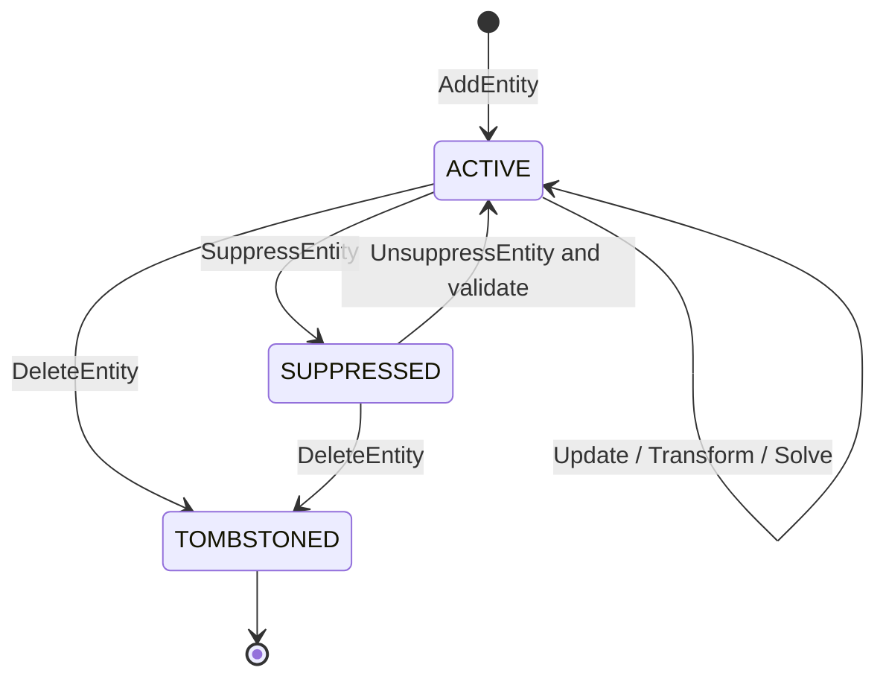

# Sketch 实体编辑、血缘与查询

> 目标契约，不等于已交付能力。返回[目标架构目录](../../TARGET_ARCHITECTURE.md)；当前事实见[当前架构](../../CURRENT_ARCHITECTURE.md)，实施顺序只在[统一路线](../../../plans/README.md)维护。

#### 5.3.4.8 复合图元不是底层实体

以下工具是原子命令宏，不新增 `RECTANGLE`、`POLYGON` 等底层 Entity kind：

| 工具 | 生成结果 |
|---|---|
| Rectangle | 4 LineSegments + 4 Coincident + 2 Parallel(X axis) + 2 Parallel(Y axis)；按模式增加尺寸/对称约束 |
| Polyline | N 个 LineSegments/Arcs + 相邻 Coincident；结束方式决定闭合约束 |
| Slot | 2 LineSegments + 2 CircularArcs + Coincident/Tangent/Parallel/Equal |
| Regular Polygon | N 条线 + Coincident + Equal + construction center/radial constraints |
| Centerline Rectangle | Profile lines + construction diagonals/center constraints |

宏在一个 `EDIT_SKETCH` operations 批次中提交，Entity/Constraint ID 由 request ID 和 slot 确定性生成。任一生成对象或约束无效则整个宏失败。宏完成后，用户可以像普通实体一样独立删除/修改各条边；系统不维持隐藏的 Rectangle 对象。

#### 5.3.4.9 实体生命周期与状态机



`TOMBSTONED` 不保存在当前 `entities[]` 中，而记录在 Workspace/Revision lineage metadata，防止 ID 复用并支持并发冲突解释。历史查看可以直接读取旧 Revision；持久 Undo/Restore 不修改旧 Revision，而是按 4.3.13 的补偿语义从 tombstone 恢复同一 identity、重新验证并形成新 Revision。

状态转换规则：

- Suppress 时同时把引用它的 Constraint 标为 `INACTIVE_DEPENDENCY`，保留但不求解；下游 Profile/Feature 重新验证；
- Unsuppress 必须重新验证所有 Constraint 和 Profile，失败则整个命令不提交；
- Delete 默认要求命令同时列出约束处理策略：`REJECT_IF_REFERENCED`、`DELETE_REFERENCING_CONSTRAINTS` 或明确 replacement map；
- Entity kind 变化使用 `ReplaceEntity`，内部语义为删除旧 ID、新建新 ID、显式迁移可兼容引用；
- Role 从 PROFILE 改为 CONSTRUCTION 会触发 Profile dirty，但几何求解可能无需重算；
- label/纯展示扩展变化不触发求解或 Profile dirty。

#### 5.3.4.10 命令与编辑操作

低层 operation 必须表达用户意图并能验证引用：

```text
EntityOperation = oneof {
  AddEntity
  UpdateEntityParameters
  SetEntityRole
  SetEntityState
  DeleteEntity
  ReplaceEntity
  TransformEntities
  SplitEntity
  TrimEntity
  ExtendEntity
  ReverseEntity
}
```

**UpdateEntityParameters** 携带 expected entity digest，避免同一 Sketch 并发修改时仅靠整个 Revision 冲突。它只能修改 kind 对应参数，不能修改 ID/kind。

**TransformEntities** 保存一个显式二维刚体/仿射变换和目标 ID 集：

- Move/Rotate 是刚体变换；
- Uniform Scale 允许，必须同时处理相关 Driving dimensions 的策略；
- 非均匀 Scale 会把 Circle 变 Ellipse，默认拒绝或要求 `ReplaceEntity`；
- Mirror 会反转 Arc sweep、Profile orientation 和部分角度 branch，必须由实体类型专用规则处理；
- 有约束实体的 Transform 通常转换为 DragTarget/初值并重新求解，不无视约束强改最终参数。

**SplitEntity** 在曲线参数 `u` 或精确交点处分裂：

- 旧实体 tombstone；生成两个新 EntityId；
- Line/CircularArc/EllipticArc/Bezier/BSpline 使用各自精确分割算法；
- 新相邻端点增加 Coincident（若它们本来同源且用户没有选择断开）；
- 返回 `EntityLineage { old -> [newA,newB], parameter_ranges }`；
- 约束只在语义唯一时自动迁移，例如旧 START → newA START、旧 END → newB END；WHOLE 引用必须由调用者或策略决定，不能猜测。

**TrimEntity** 不是简单隐藏曲线片段。它用选择点和相交候选确定保留参数域，底层执行 Replace/Split，并返回歧义候选。存在多个同距候选、切触、重叠或周期 seam 时必须要求分支提示。

**ExtendEntity** 第一阶段只支持 LineSegment 和 Arc 到明确的 target/intersection；若没有唯一可行交点则失败。**ReverseEntity** 交换 Line/开放曲线端点或反转 Arc sweep，并产生 sub-element mapping，使 START/END 引用可受控迁移。

所有几何编辑先产生候选实体和 Lineage，再统一执行 Constraint rewrite、Schema validation、Solve、Profile validation 与 CAS commit；不能让每个 operation 自行写数据库。

#### 5.3.4.11 EntityLineage 与引用迁移

```text
EntityLineage
  source_entity_ids[]
  result_entity_ids[]
  mappings[] {
    source_ref
    result_ref?
    parameter_transform?
    status: PRESERVED | SPLIT | MERGED | DELETED | AMBIGUOUS
  }
  operation_id
```

Lineage 是一次 Sketch 编辑事务的结果，不等同于 Part 的 Persistent Topological Naming，但遵循相同原则：能确定就迁移，不能确定就显式报告。

| 编辑 | 可自动迁移 | 必须显式处理 |
|---|---|---|
| Move/Rotate | 所有同 EntityId refs | 无 |
| Reverse Line/Arc | WHOLE；START/END 按 mapping 交换 | 有方向 Angle/Tangent branch 需重验 |
| Split | 原 START/END | WHOLE、任意内部 parameter ref |
| Trim | 被保留端点和唯一曲线段 | 被删除区间、多个候选 |
| Replace Circle→Arc | CENTER、可证明保留的曲线参数 | WHOLE Circle 约束、无端点到有端点语义 |
| Merge curves | 唯一连续参数映射 | 每个 WHOLE 引用及接缝约束 |

Constraint rewrite 必须产生审计结果：preserved、rewritten、deleted、unresolved。默认不静默删除尺寸；若命令选择级联删除，响应列出所有被删除 ConstraintId。

#### 5.3.4.12 OCCT-free 曲线查询接口

Solver、Profile、Trim 和预览需要相同几何语义，因此 `kernel/sketch/api` 提供只读接口：

```text
EntityGeometry
  Kind()
  Domain() -> bounded/periodic parameter domain
  Evaluate(u) -> point
  Derivatives(u, order<=2) -> point/tangent/curvature data
  SubElement(ref) -> point/axis/curve view
  BoundingBox(tolerance)
  ClosestPoint(query, branchHint?) -> candidates[]
  Intersections(other, tolerance) -> candidates[]
  IsDegenerate(tolerance)
  Canonicalize()
```

返回 Intersections/ClosestPoint 的是候选集合，每项包含双方参数、交点、类型 `CROSSING | TANGENT | OVERLAP_ENDPOINT | OVERLAP_INTERVAL`、残差和 multiplicity；上层根据用户 pick/branch hint 决定，实体模块不随意选择第一个结果。

解析几何优先使用项目自有稳定公式；复杂 Bezier/BSpline 可以在 OCCT-free 模块中使用经过验证的算法，或通过严格 Adapter 调用 OCCT 查询，但公共结果不得泄漏 OCCT 类型。OCCT `Geom2dAPI_InterCurveCurve` 可作为复杂曲线相交后端候选，并能区分交点与相切重叠段。[OCCT Geom2dAPI 文档](https://dev.opencascade.org/doc/refman/html/package_geom2dapi.html)

BoundingBox 必须保守包含曲线，不可只包围控制点或采样点后当成精确结果。预览折线由单独的 `Tessellate2D(chordTolerance, angularTolerance)` 生成并缓存，不进入 canonical model/hash。

#### 5.3.4.13 Solver 变量映射

实体模块产生稳定的 `VariableDescriptor`，而不是让 Solver Adapter自行遍历 Proto：

```text
VariableDescriptor
  variable_id = Hash(EntityId, semantic_parameter)
  entity_id
  semantic_parameter: X | Y | START_X | ... | CONTROL_POINT_X(index)
  dimension: LENGTH | ANGLE | DIMENSIONLESS
  scale
  lower_bound? / upper_bound?
```

映射规则：

- VariableId 由稳定语义生成，不依赖数组内存顺序；
- Suppressed、External、Builtin 不产生自由变量；
- Fixed/表达式直接驱动的参数由 Constraint/Parameter layer 标记锁定，而不是从实体删除；
- Circle radius、Ellipse axes、权重等正值参数允许 Adapter 使用内部变换，但必须提供 physical value/Jacobian chain rule；
- Arc 角度使用 unwrapped solver state，持久化时才规范化，防止穿越 `2π` 时跳变；
- BSpline control point ID 决定变量身份，knot/degree 第一阶段不是求解变量；
- 求解结果写回前按 Entity kind 重新验证和 canonicalize，失败返回 `SKETCH_DEGENERATE_ENTITY`。

#### 5.3.4.14 Profile、渲染与 OCCT 转换边界

**Profile Builder** 读取 Active + PROFILE 实体的权威求解结果；Construction/Centerline/Point 不形成边。连接优先依据 Coincident 等价类；纯坐标接近只用于诊断 `NEAR_MISS_ENDPOINTS`，不自动连接。

**渲染/拾取** 获取 `EntityRenderPacket`：EntityId、role/state、分段曲线、语义关键点和参数范围。客户端拾取回传 `(SketchId, EntityId, SubElement, curveParameter?)`，不能回传“第 12 段折线”作为持久引用。

**OCCT Adapter** 转换规则：

| 模型实体 | OCCT 目标 |
|---|---|
| LineSegment | `Geom2d_Line`/trimmed range → Edge |
| Circle | `Geom2d_Circle` → closed Edge |
| CircularArc | `Geom2d_Circle` + parameter range → trimmed Edge |
| Ellipse/EllipticArc | `Geom2d_Ellipse` + optional trim |
| Bezier | `Geom2d_BezierCurve` |
| BSpline | `Geom2d_BSplineCurve` |

OCCT 支持由二维曲线或点构建 Edge，但 EntityId/SubElement identity 必须由项目 Adapter 的 mapping 保留，不能从 OCCT 对象反推。[BRepBuilderAPI_MakeEdge2d](https://dev.opencascade.org/doc/refman/html/class_b_rep_builder_a_p_i___make_edge2d.html)

转换后执行 OCCT 完成状态、Edge 长度/退化、Wire 和 Face 检查。OCCT tolerance 是下游构造容差，不能反向改变原始 Sketch 参数或偷偷合并端点。

#### 5.3.4.15 Proto 草案

```proto
message SketchEntity {
  string id = 1;
  uint32 schema_version = 2;
  EntityRole role = 3;
  EntityState state = 4;
  string label = 5;
  oneof geometry {
    Point2 point = 20;
    LineSegment2 line_segment = 21;
    Circle2 circle = 22;
    CircularArc2 circular_arc = 23;
    Ellipse2 ellipse = 24;
    EllipticArc2 elliptic_arc = 25;
    Bezier2 bezier = 26;
    BSpline2 bspline = 27;
  }
  EntityProvenance provenance = 40;
}

message Vec2 { double x_mm = 1; double y_mm = 2; }
message Point2 { Vec2 point = 1; }
message LineSegment2 { Vec2 start = 1; Vec2 end = 2; }
message Circle2 { Vec2 center = 1; double radius_mm = 2; }
message CircularArc2 {
  Vec2 center = 1;
  double radius_mm = 2;
  double start_angle_rad = 3;
  double sweep_angle_rad = 4;
}
```

实际 Proto 应继续定义高阶曲线、GeometryRef 和 Operation。约定：

- `oneof` 中每个 kind 永久使用独立字段号；删除后 `reserved`；
- 坐标字段名包含规范单位，不能叫模糊的 `value`；
- 枚举零值是 `UNSPECIFIED`，业务验证拒绝；
- 不用 `google.protobuf.Any` 承载核心实体；插件实体使用另一个 namespaced extension 协议并要求 capability；
- 不在消息内存重复派生 start/end、length、bbox；
- Map 不用于需要规范顺序的核心几何；canonical serializer 按 EntityId 和明确字段序处理；
- 服务端限制 repeated 数量、消息深度和字符串长度。

#### 5.3.4.16 规范化、摘要与 Dirty 分类

`CanonicalEntity` 规则：验证 schema → 单位归一 → 角度/周期规范 → 清除 `-0` → 固定 IEEE-754 编码 → 按稳定 ID 排序子结构 → 序列化。禁止把数值四舍五入到建模容差后再哈希；这会让两个不同设计意图碰撞。缓存可额外使用 tolerance-aware spatial key，但业务 digest 必须精确对应规范输入。

```text
EntityDigest = Hash(
  entity schema version,
  id, kind, role, state,
  canonical physical parameters,
  solver-relevant registered extensions
)
```

变更分类：

| 变更 | Sketch solve | Profile | 下游 Part |
|---|---:|---:|---:|
| label/UI extension | 否 | 否 | 否 |
| role Profile→Construction | 约束仍有效时可复用解 | 是 | 是 |
| state suppress/unsuppress | 是 | 是 | 是 |
| physical parameter | 是 | 是 | 是 |
| construction-only geometry parameter | 是 | 否，除非约束带动 Profile | 由依赖传播决定 |
| provenance/lineage metadata | 否 | 否 | 否 |
| BSpline knot/degree | 是 | 是 | 是，且视为结构变化 |

Dirty propagation 按 Feature/Constraint dependency graph 计算，不能仅以 JSON 是否变化决定完整重生成。

#### 5.3.4.17 验证、错误与修复原则

验证分层：

1. **Wire format**：required/oneof/enum/长度；
2. **Entity schema**：kind 参数、数量、有限数、单位；
3. **Geometry**：退化、周期、连续性、knot/weight；
4. **Reference integrity**：Constraint/External/Lineage 引用存在且签名匹配；
5. **Solver result**：写回参数仍满足实体不变量；
6. **Profile eligibility**：是否可作为有界 Profile 曲线。

主要错误码：

| 错误码 | 条件 |
|---|---|
| `ENTITY_ID_INVALID` / `ENTITY_ID_EXISTS` / `ENTITY_ID_TOMBSTONED` | ID 不合法、重复或复用 |
| `ENTITY_KIND_UNSPECIFIED` / `ENTITY_KIND_UNSUPPORTED` | kind 缺失或 Worker 无能力 |
| `ENTITY_PARAMETER_NOT_FINITE` / `ENTITY_PARAMETER_OUT_OF_RANGE` | NaN/Inf 或超限 |
| `ENTITY_DEGENERATE_LINE` / `ENTITY_DEGENERATE_RADIUS` | 线长或半径低于阈值 |
| `ENTITY_ARC_SWEEP_INVALID` | sweep 为零、整圆或越界 |
| `ENTITY_ELLIPSE_AXES_INVALID` / `ELLIPSE_AXIS_AMBIGUOUS` | 长短轴不合法或轴引用不稳定 |
| `ENTITY_SPLINE_DEFINITION_INVALID` | degree/knot/multiplicity/weight 不满足规则 |
| `ENTITY_REFERENCE_INVALID_SUBELEMENT` | kind 与 SubElement 不匹配 |
| `ENTITY_REFERENCED_BY_CONSTRAINT` | 删除策略拒绝悬空引用 |
| `ENTITY_EDIT_AMBIGUOUS` | Trim/Extend/Split 分支不唯一 |
| `ENTITY_EDIT_STALE` | expected digest 或 Workspace sequence 过期 |
| `ENTITY_CONVERSION_FAILED` | 模型有效但 OCCT Adapter 构造失败 |

实体模块不做静默 healing。可逆、语义唯一的规范化（清除 `-0`、角度加减 `2π`）自动执行；会改变设计的修复（合并近点、删除短边、圆转弧、重建 spline knot）只能作为显式命令并预览影响。

#### 5.3.4.18 并发与幂等

一个 `EDIT_SKETCH` 仍以 Workspace sequence 做最终 CAS；实体级 `expected_entity_digest` 用于生成精确冲突说明和安全 rebase：

- 修改不同 Entity 且没有共同 Constraint/Profile 依赖，可以重放到新 Head 后重新求解；
- 修改同一 Entity 参数产生语义冲突；
- 一方删除 Entity、另一方修改/约束它，必须冲突；
- 一方移动端点、另一方新增 Coincident，可尝试重放后求解，但客户端必须收到重新求解后的权威位置；
- label 与几何参数修改可以字段级合并；
- Split/Trim/Replace 属结构编辑，遇到任何目标 Entity 新变更默认冲突，不基于坐标猜测重放。

每个 operation 有 OperationId；Add 使用请求中确定的 EntityId；重试相同 request/operation 得到相同结果。相同 OperationId 携带不同 payload 返回 `IDEMPOTENCY_KEY_REUSED`。

#### 5.3.4.19 性能与资源边界

- Entity 以紧凑值对象连续存储，ID→index 使用只在内存构建的索引；持久引用仍是 ID；
- 基本实体 Evaluate/Derivative/BoundingBox 不分配堆内存；批量 API 写入调用方缓冲；
- 空间索引（R-tree/BVH）是 `(SketchSolveKey, entity digests)` 的可丢失缓存；
- 修改 Entity 只重建其 bbox 和受影响空间节点；
- 相交查询先 bbox broad phase，再精确 narrow phase；
- 曲线预览按视图容差自适应细分，并设置每实体/每 Sketch 最大段数；
- BSpline degree、control point、knot、entity 总数和坐标范围有硬上限；
- 任何 O(n²) 全相交扫描必须在候选过滤后执行，并服从 deadline/cancellation；
- Canonical serialization 和 digest 支持增量 Merkle 组合，但最终根必须与全量规范序列化定义一致。

#### 5.3.4.20 实体模块测试矩阵

| 测试层 | 覆盖内容 |
|---|---|
| Schema golden | 每种 kind 的最小/完整 Proto、未知字段、旧版本迁移 |
| Parameter unit | Evaluate、D1/D2、domain、bbox、closest point 的解析案例 |
| Degeneracy | 零线、微小半径、Arc seam/整圆、Ellipse 近圆、坏 spline |
| Reference | 所有合法/非法 SubElement，Builtin/External/Entity 三类目标 |
| Edit operation | Add/Update/Delete/Suppress/Transform/Split/Trim/Extend/Reverse |
| Lineage | START/END/WHOLE/control point 映射与歧义结果 |
| Metamorphic | 平移/旋转/镜像/单位换算前后曲线不变量 |
| Differential | 自有解析几何与 OCCT evaluation/intersection 在容差内对照 |
| Canonical/hash | 字段顺序、`-0`、角度周期、跨 Go/C++ 字节一致 |
| Solver adapter | VariableId/physical mapping、角度 unwrap、正半径 chain rule |
| Profile integration | role/state、Coincident 连接、Circle/Arc、多曲线闭环 |
| Concurrency | expected digest、ID tombstone、结构编辑冲突、幂等重试 |
| Fuzz/property | Proto、参数域、spline knot、Split/Trim 候选与相交算法 |
| Benchmark | 10k lines/circles 的 validation、bbox index、hash 和局部更新 |

每个 Entity kind 合入核心 schema 的完成条件：schema + canonical mapping + validator + evaluate/D1 + conservative bbox + SubElement resolver + Solver variable adapter + render tessellation + OCCT conversion + corpus 全部存在。只有“能画出来”或“OCCT 有对应类”不算完成。
