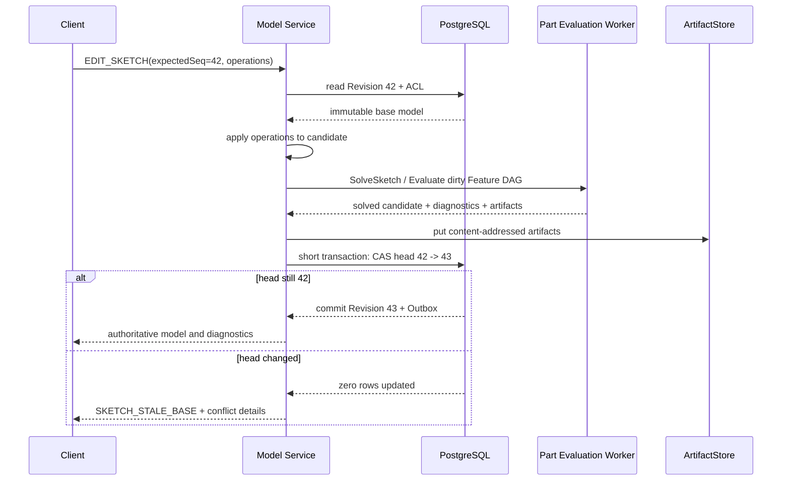
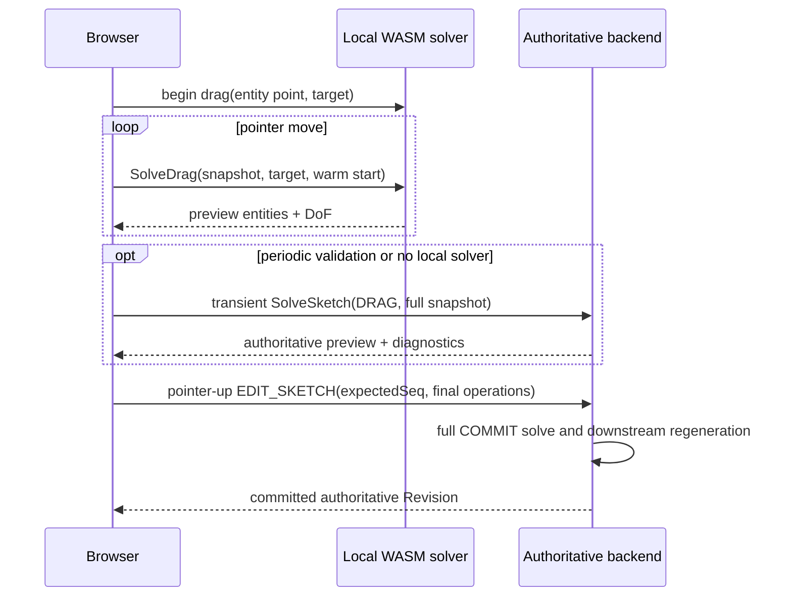

# Sketch 持久化、交互与验证

> 目标契约，不等于已交付能力。返回[目标架构目录](../../TARGET_ARCHITECTURE.md)；当前事实见[当前架构](../../CURRENT_ARCHITECTURE.md)，实施顺序只在[统一路线](../../../plans/README.md)维护。

### 5.3.11 持久化、缓存与哈希

第一阶段继续把 SketchFeature 放在不可变 `document_versions.model_json` 中，避免为每条线建立高写放大的关系表。PostgreSQL 只额外索引有业务查询价值的 Sketch/Parameter/External reference；未来协作量证明需要时再投影成专用表。

模型中保存：用户/权威提交后的实体参数、约束、表达式、支撑引用和 branch intent。以下内容是可重建缓存，不是业务真相：Jacobian、分解、warm start、求解日志、Profile B-Rep 和预览网格。

```text
SketchSolveKey = Hash(
  canonical SketchFeature,
  evaluated parameter values,
  resolved support revision + frame,
  external geometry digests,
  solver build digest,
  expression engine version,
  tolerance profile id,
  units policy id
)
```

规范化必须按稳定 ID 排序、统一单位/角度、拒绝 NaN/Infinity、规范 `-0`，并使用明确的浮点编码，不能依赖语言默认 JSON 格式。缓存命中仍需验证 build/schema/capability；结果可以存入 ArtifactStore 小对象或 Worker LRU，丢失后可重算。

### 5.3.12 命令、API 与 Proto

持久编辑继续通过 Document Command/Transaction 边界，不为每条线建立任意 CRUD API。一个用户动作提交一个 `EDIT_SKETCH`：

```text
EditSketchCommand
  request_id
  expected_workspace_sequence
  sketch_id
  operations[]:
    AddEntity | UpdateEntity | DeleteEntity
    AddConstraint | UpdateConstraint | DeleteConstraint
    SetDimensionExpression | SetConstruction
    SetSupport | AddExternalGeometry | RemoveExternalGeometry
  client_solve_digest?  // 仅诊断，不能作为可信结果
```

删除实体时，必须在同一事务显式删除/重定向引用它的约束；后端不猜测级联。矩形、圆角矩形等创建工具在客户端形成批量 operations，服务端只验证规范基本实体。

外部 HTTP 建议保留统一命令入口，并增加一个无持久副作用的求解入口：

| 接口 | 语义 |
|---|---|
| `workspace.command.execute.v1`（WebSocket） | 提交 `CREATE_SKETCH` / `EDIT_SKETCH`，求解后 CAS 形成新 Revision |
| `POST /api/documents/{id}/sketches/{sketchId}:solve` | 对完整候选 Snapshot 做权威预览求解，不写数据库 |
| `GET /api/documents/{id}/sketches/{sketchId}/diagnostics` | 获取当前 Revision 的缓存诊断；缺失时可重算 |

内部 Protobuf 采用新的 `SketchService` capability 或将 `SketchModel` 嵌入版本化 `EvaluatePartRequest`。推荐接口：

```text
rpc SolveSketch(SolveSketchRequest) returns (SolveSketchResponse)
rpc EvaluatePart(EvaluatePartRequest) returns (EvaluatePartResponse)

SolveSketchRequest
  request_id, tenant_id, model_hash
  SketchModel model
  EvaluatedParameter[] parameters
  SketchSupportSnapshot support
  SolveMode mode = ANALYZE | COMMIT | DRAG
  DragTarget drag_target?
  bytes warm_start_token?
  string tolerance_profile_id
```

大对象不放入 Proto；External curve snapshot 过大时以内容摘要和 signed artifact reference 传递。协议使用 `oneof` 表达 Entity/Constraint 变体，删除字段号必须保留。服务端根据 Worker capabilities 路由，不认识的 schema 返回 `UNSUPPORTED`，不能丢弃未知约束后继续计算。

### 5.3.13 提交事务与并发控制

求值必须在数据库事务外完成，最终短事务只校验 Head/sequence 并提交；当前路径已采用该边界，见[模型与历史](../current/model-history.md)。合同如下：



计算阶段不持有数据库锁。最终短事务检查 `expected_workspace_sequence`/Head Revision，写入 Command、Revision、History、Artifact references 和 Outbox。若 Head 已改变，已生成内容寻址制品可以复用或由 GC 清理，但绝不能覆盖新 Head。

同一 Sketch 的并发编辑按 EntityId/ConstraintId 生成冲突集；不同 Sketch 或不相交 Feature 可在依赖允许时自动 rebase 后重新求解。软编辑 presence/lease 只改善体验，不替代乐观并发。`request_id`/幂等键保证客户端重试不会生成两个 Revision。

### 5.3.14 拖拽与交互求解

拖拽不写 Command、不创建 Version、不在每个 pointer move 后重生成完整 Part。

创建交互采用 CATIA Sketcher 的渐进 characteristic-point 模式作为产品参照，而不复制其 UI：进入上下文必须绑定明确的 `SketchId + support plane`；Point 是一次采集，Line/两点 Rectangle 是“第一点 → pointer move 动态预览 → 第二点”；复合图元提交后工具保持激活以便连续创建。Esc 首先取消尚未完成的采集或约束首选，当前没有中间状态时才退出工具回到 Select。选择已有 Sketch 后使用同一入口重新进入编辑，不能创建另一个共面 Sketch 或根据数组顺序猜测活动对象。

Selection 是稳定 identity 的有序集合，而不是单个临时 mesh index；最后一个成员是 Inspector/单目标命令的主选择。视口和结构树共享集合语义，支持普通替换、Ctrl/Meta 切换与 Shift 可见区间选择，但共享状态不等于共享高亮粒度：结构树父节点选择显式展开全部后代显示对象；视口精确元素选择只高亮命中元素，并把结构树显示单向投影到最近存在的 Feature/Body 祖先，不能因为树中缺少对应叶节点而把父节点重新解释成视口选择。高亮 Overlay 必须独立于基础黑色边线并使用屏幕稳定宽度；Face/Edge/Vertex 的 selected/hover 提示应具有一致的遮挡可见策略，同时不得改变权威深度、选择 identity 或几何。清空或切换选择必须立即撤销全部 selected/hover/topology overlay，不能依赖下一次 pointer move 修复显示。结构树操作集中在可扩展、锚定节点位置且尺寸稳定的右键菜单，普通行不堆叠删除等动作按钮；任何选择集合变化都使已打开菜单失效并关闭。

视口必须分别渲染 Point、Curve、curve endpoints、construction geometry 和 constraint glyph，不能把单点塞入 Line primitive。活动 Sketch 独占显示本地 H/V 轴、origin 和可配置网格；默认诊断色遵循 White=under-constrained、Green=solved/fixed、Purple=over/redundant、Red=inconsistent，construction geometry 使用 Gray。SmartPick hover 与约束首选必须高亮稳定 GeometryRef，并以可访问状态文本说明下一步；hover 只产生建议，是否生成永久约束由显式策略决定。参照：[CATIA Sketcher tools](https://catiahelp.azurewebsites.net/English/DysUserMap/dys-c-BeforeYouBegin-ToolsSketchingUse.htm)、[CATIA constraint diagnosis colors](https://catiahelp.azurewebsites.net/English/DysUserMap/dys-c-BeforeYouBegin-ColorUse.htm)、[CATIA rectangle creation](https://catiahelp.azurewebsites.net/English/DysUserMap/dys-t-SimpleProfileSketch-Rectangle.htm)。



DragTarget 是临时目标，不成为持久硬约束。求解器在满足所有硬约束的可行流形上最小化目标位移；若目标不可达，返回最近可行位置和被约束方向。拖拽必须复用分解、变量映射和上一帧结果。Local WASM 与服务端必须共享 conformance tests 和 solver build/protocol version；即便算法相同，服务端仍重新求解并验证。

第一阶段可只提供无状态 unary preview：每次携带完整 Snapshot，易于重试和扩缩容。只有测量证明网络/序列化成为瓶颈后，才增加双向流式 Sketch Session；Session 可固定 Worker 并缓存 warm state，但断线后客户端必须能用完整 Snapshot 在另一 Worker 恢复。

### 5.3.15 外部几何

ExternalGeometry 不复制一条“看起来相同”的普通线，而是保存：

- 上游 Revision/Feature 的 PersistentSelection；
- 投影方式（正交投影、交线、silhouette 等）；
- resolved source digest 与二维 curve snapshot；
- 可引用子元素和解析诊断。

上游变更时先经 Persistent Topological Naming 解析，再重新投影。来源删除、歧义或投影退化时标记 `UNRESOLVED_EXTERNAL`，所有依赖约束列出受影响 ID。External geometry 是只读变量，可以参与 Coincident/Distance/Tangent 等约束；用户若要脱离来源，必须执行显式 `DETACH_EXTERNAL_GEOMETRY` 生成普通实体。

ExternalGeometry 的首次 ADD/RECONNECT 必须在提交前完成 bind、resolve、projection 与 snapshot 验证；失败是候选命令的硬前置条件错误，不能创建一个从未成功连接过的 FAILED Head。`UNRESOLVED_EXTERNAL` Revision 只表达先前有效依赖在上游更新后的失效，并可保存诊断模型，但其 visualization/geometry artifact 必须具有该 Revision 自身的 model/manifest provenance，不能借用 dependency prefix 或 parent Revision 的 key 冒充最终制品。

### 5.3.16 性能、资源限制与安全

性能优化顺序：约束图分解 → dirty component → warm start → 缓存符号稀疏结构 → 避免拖拽期间 Part 重生成 → 最后才考虑并行/GPU。一个 Sketch 的耦合组件通常必须在一个 Solver 实例中求解，不跨 Worker 分割；不同 Sketch/配置可以跨 Worker 并行。

工程预算作为基准目标而非协议承诺：典型少于 200 个实体的本地拖拽争取单帧级响应；服务端权威 preview 争取交互级响应；超大 Sketch 超过同步预算时返回可取消异步分析。所有路径强制：

- entity/constraint/expression node 数量上限；
- 坐标、半径和维度范围；
- CPU deadline、最大迭代和内存预算；
- 请求/响应大小限制；
- cancellation 传播；
- NaN/Infinity 和 protobuf/JSON fuzz 防护；
- 租户并发与 CPU 秒配额。

求解器不得访问网络、文件或数据库。Expression 不执行用户代码。恶意 Sketch 导致超时只终止本次计算，不能拖垮共享 API 进程，因此最终求解位于受限 C++ Worker 而不是 Go HTTP 进程。

### 5.3.17 可观测性

每次权威求解记录 Trace Span，但不记录完整专有几何内容。指标至少包括：

- `sketch_solve_duration_ms`（mode、status、size bucket）；
- entity/constraint/connected-component 数；
- remaining DoF、iterations、normalized residual；
- warm/cache hit；
- redundancy/conflict/non-convergence/timeout 计数；
- Profile cycle 数、自交/开放失败数；
- CAS conflict/rebase 次数；
- solver build、schema version、tolerance profile。

诊断响应携带 request/trace ID，便于从用户看到的冲突约束追踪到 Worker；日志只写 ID、计数和错误码，不写表达式秘密或整个模型。

### 5.3.18 测试体系

测试代码与其领域实现共同归属：模块内白盒测试验证最小不变量，跨模块 conformance 只依赖公开契约，仓库级 E2E 才允许编排多个进程。文件名和目录遵循各语言工具链，不建立第二套测试发现协议；每个场景必须自行创建 fixture、执行用户意图并断言领域结果，不得依赖上一测试留下的数组位置、全局 Store、数据库记录或执行顺序。CAD 交互场景以 `pointerdown -> pointerup -> move -> pointerdown -> pointerup` 等真实手势驱动 Tool 边界，同时断言持久 operation，而不是直接篡改 UI state。

| 层级 | 必须覆盖 |
|---|---|
| Schema unit | 每种 Entity/Constraint 签名、非法引用、单位和有限数 |
| Equation unit | 每条约束的残差/Jacobian，与有限差分或自动微分对照 |
| Solver conformance | 全约束、欠约束、冗余、冲突、分支、退化和非收敛 |
| Property/metamorphic | 平移/旋转/单位换算后 DoF 与约束语义不变 |
| Compatibility | 正式发布后验证承诺支持的 Sketch schema/evaluator 重放；当前开发 schema 从空库验证 |
| Profile corpus | 多环、孔、相切、自交、重叠、微小边、开放轮廓 |
| Kernel integration | Solve → Wire/Face → Pad/Pocket，检查 BRepCheck 和质量属性 |
| Protocol | 旧 schema 重放、未知 oneof、能力协商、确定性序列化 |
| Concurrency | stale sequence、幂等重试、不同 Sketch rebase、迟到结果 |
| Failure injection | Worker crash/timeout、上传后 CAS 失败、缓存丢失 |
| Fuzz | JSON/Proto、表达式、约束图、Profile Builder |
| Benchmark | 50/200/1000/5000 实体、稀疏/稠密图、拖拽连续帧 |

建立可公开的 Sketch corpus，每个案例保存输入 schema、期望 status/DoF/冲突集范围、几何不变量和允许容差。Golden 测试不能只比较浮点逐字节；比较约束满足、拓扑区域、测量值和分支意图。PlaneGCS adapter、自研 solver 与 WASM 后端运行同一 conformance suite。
