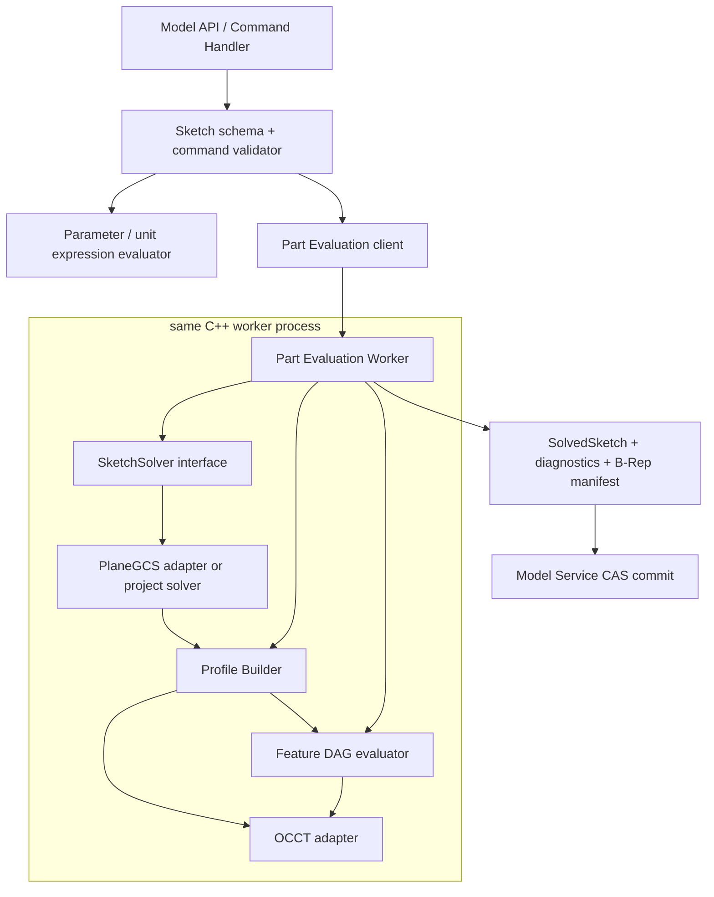
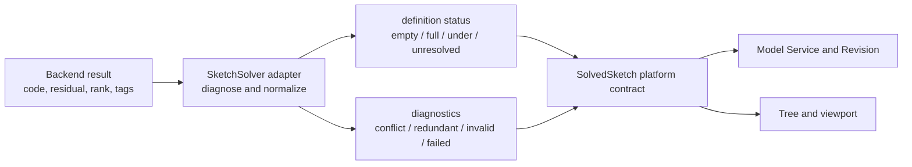
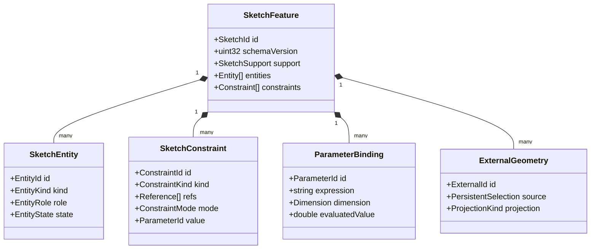
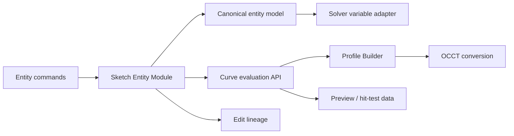

# Sketch 模型与实体表示

> 目标契约，不等于已交付能力。返回[目标架构目录](../../TARGET_ARCHITECTURE.md)；当前事实见[当前架构](../../CURRENT_ARCHITECTURE.md)，实施顺序只在[统一路线](../../../plans/README.md)维护。

### 5.3.2 后端组件边界



边界规则：

- **Model Service** 保存原始 SketchModel、表达式和命令，不包含求解算法；
- **Parameter evaluator** 解析单位和受限表达式，将 driving dimension 转为明确的 mm/rad 数值；
- **SketchSolver** 只处理二维实体、代数约束和诊断，不依赖 OCCT；
- **Profile Builder** 把已求解二维曲线变成有方向、有嵌套关系的闭合区域；
- **OCCT adapter** 只负责二维曲线到 Edge/Wire/Face 及后续精确 Feature；
- **浏览器/WASM solver** 只能产生交互预览，服务端结果始终权威；
- **Worker 内存** 只保存 warm start 和分解缓存，不是 SketchModel 的唯一副本。

求解器适配器必须把后端返回码、异常和诊断集合封装为稳定的平台语义；Model Service 不得比较 PlaneGCS、Ceres 或未来求解器的整数状态。平台结果包含两个正交维度：`definition_status = EMPTY | FULLY_CONSTRAINED | UNDER_CONSTRAINED | UNRESOLVED` 描述约束程度，`diagnostics = REDUNDANT | CONFLICTING | INVALID | FAILED` 描述问题及解释集。冗余不推导欠约束，冲突也不能仅由一个布尔值代替解释集。更换求解器时只允许修改 Worker/Geometry client adapter 及 conformance corpus，不改变 Revision 与 Web 状态机。



数值后端允许在适配器内部按固定顺序执行有限次算法回退，但必须记录尝试顺序并通过相同 corpus 验证；禁止随机初值或无界重试掩盖退化模型。最终不可分类失败应生成可授权下载的版本化诊断包，至少包含不可变 base Revision、失败 Domain Command、规范化 solver input、adapter/evaluator 版本、求解状态与日志 correlation。诊断包是调试制品，不是业务真相，也不得包含凭据或无关租户数据。

### 5.3.3 SketchFeature 领域模型

一个 Sketch 是 Feature Graph 中的 typed node，而不是独立 Document。推荐的规范模型如下；字段名表达语义，最终以版本化 Protobuf/JSON Schema 为准。

```text
SketchFeature
  id, name, schema_version
  support: SketchSupport
  placement: local 2D frame relative to support
  units_policy_id
  tolerance_profile_id
  entities: SketchEntity[]
  constraints: SketchConstraint[]
  parameters: ParameterBinding[]
  external_geometry: ExternalGeometry[]
  options: construction visibility / auto-constraint policy
```



所有 Entity、Constraint、Parameter 和 ExternalGeometry 使用稳定、不复用的 ID。数组顺序只用于显示排序，引用永远使用 ID，禁止使用数组下标。删除后 ID 放入 Revision 的 tombstone 集合，至少在同一 Workspace 历史中不得复用。

**SketchSupport** 第一阶段支持：

1. `DATUM_PLANE`：引用当前 Part 的稳定 DatumPlaneId；
2. `PLANAR_FACE`：引用上游 Feature 的 PersistentSelection，并保存明确的原点、X 方向和法向定向规则；
3. `EXPLICIT_FRAME`：导入/迁移使用的不可变局部坐标系。

面支撑解析失败时，已有 Revision 仍可打开，Sketch/下游 Feature 标记 `OUT_OF_DATE` 或 `FAILED_SUPPORT`，不得把草图静默移动到 XY 平面。第一阶段不支持在任意曲面上直接绘制；圆柱/曲面的参数域草图需要新的 Support 类型和周期边界语义。

### 5.3.4 实体模型

本节定义 Sketch Entity 后端模块的可实施规格。实体模块负责“草图中有什么几何、如何稳定引用、如何编辑和验证”，不负责约束求解、Profile 拓扑构造或 OCCT Shape 持久化。

#### 5.3.4.1 职责与非职责



实体模块必须完成：

- 版本化 Entity schema、稳定 ID、角色和生命周期状态；
- 类型签名、参数范围、退化和有限数验证；
- 点值、导数、参数域、包围盒和最近点等 OCCT-free 曲线查询；
- Add/Update/Delete/Split/Trim/Extend/Transform 的确定性编辑语义；
- Entity/SubElement 引用解析和编辑 lineage；
- 持久参数与 Solver 内部变量之间的映射；
- 规范序列化、哈希、向旧/新 schema 迁移；
- 向 Profile Builder、渲染和 OCCT Adapter 提供只读曲线视图。

实体模块不完成：

- 不决定几何约束是否有解；
- 不把接近的端点自动视为重合，重合必须来自 Constraint 或显式 Auto-Constraint 命令；
- 不抽取闭合区域、不决定孔洞；
- 不保存 `Geom2d_Curve`、`TopoDS_Edge` 或第三方 Solver 指针；
- 不直接访问 PostgreSQL、ArtifactStore、网络或用户权限；
- 不保存视口颜色、像素线宽、选中状态等纯 UI 数据。

#### 5.3.4.2 核心不变量

1. 每个持久实体属于且只属于一个 Sketch，以 `(SketchId, EntityId)` 唯一标识。
2. EntityId 创建后不变、不复用；改变实体类型默认是 Delete + Add，而不是原 ID 原地变型。
3. 基本实体各自拥有完整参数。两条线的端点即使 Coincident，也不共享一个可变 Point 对象。
4. 引用只使用稳定 ID 与语义子元素，不使用数组下标、内存地址、浮点坐标或 OCCT Edge 序号。
5. 持久参数使用规范 mm/rad 和有限 `double`；原始用户表达式属于 ParameterBinding，不重复塞入每个 Entity。
6. 持久模型保存用户意图和权威求解后的参数；求解变量、缓存、采样折线和 OCCT 对象均可重建。
7. Suppressed 实体保留身份但不参与求解、Profile 或下游 Feature；Construction 参与求解但不进入 Profile。
8. 任何编辑要么原子地产生一个自洽候选模型，要么完全失败；不能遗留悬空 Constraint reference。
9. 同一 schema、同一规范输入必须得到相同的 canonical bytes 和 Entity digest。
10. 未知 Entity kind 不得被忽略后继续求值；旧客户端可以只读展示占位诊断，但不能提交有损编辑。

#### 5.3.4.3 通用实体封装

```text
SketchEntity
  id: EntityId
  schema_version: uint32
  role: PROFILE | CONSTRUCTION | CENTERLINE
  state: ACTIVE | SUPPRESSED
  label?: string
  geometry: oneof {
    Point2
    LineSegment2
    Circle2
    CircularArc2
    Ellipse2
    EllipticArc2
    Bezier2
    BSpline2
  }
  provenance?: EntityProvenance
  extensions: versioned, namespaced metadata
```

`role` 与 `state` 正交：Construction 可以 Active 或 Suppressed。`CENTERLINE` 在求解/Profile 行为上属于 Construction，但保留语义以支持对称、旋转轴和工程图；不能依靠颜色推断中心线。

`label` 仅用于人类识别，不唯一、不参与引用。`extensions` 只允许已登记的命名空间和大小上限，不允许用它绕过 schema 增加 Solver 关键参数。创建者、时间、权限属于 Command/Revision metadata，不逐实体重复保存。

#### 5.3.4.4 身份、内建几何与统一引用

EntityId 推荐使用 UUIDv7。为支持离线批量命令，客户端可以预分配 ID；服务端验证格式、当前 Sketch 内唯一性和 tombstone，不接受覆盖已有 ID。服务端生成的宏实体使用 `UUIDv5(namespace=request_id, name=operation_index/entity_slot)`，使幂等重放得到相同 ID。

草图原点和坐标轴不是普通可删除实体，使用内建 ID：

- `SKETCH_ORIGIN`：可引用 `POINT`；
- `SKETCH_X_AXIS`：可引用 `WHOLE`、`DIRECTION`；
- `SKETCH_Y_AXIS`：可引用 `WHOLE`、`DIRECTION`。

外部投影几何不伪装为普通可写 Entity。统一引用定义为：

```text
GeometryRef
  target: oneof {
    entity_id
    external_geometry_id
    builtin_geometry_id
  }
  sub_element: SubElement
  parameter_hint?: double
```

第一阶段 `SubElement`：

| 子元素 | 合法目标 |
|---|---|
| `WHOLE` | 所有曲线实体、内建轴、External curve |
| `POINT` | Point、External point、Sketch Origin |
| `START` / `END` | LineSegment、Arc、EllipticArc、Bezier、非周期 BSpline |
| `CENTER` | Circle、CircularArc、Ellipse、EllipticArc |
| `MAJOR_AXIS` / `MINOR_AXIS` | Ellipse、EllipticArc |
| `CONTROL_POINT(index)` | Bezier、BSpline |
| `DIRECTION` | LineSegment、内建轴 |
| `CURVE_PARAMETER(u)` | 只读测量/投影结果；普通 Constraint 优先使用专门 contact parameter |

`parameter_hint` 是相交/相切分支提示，不构成身份。引用解析返回 typed `ResolvedGeometryRef`，包含目标 kind、允许能力和当前值；非法组合在 Schema Validation 阶段失败。

#### 5.3.4.5 为什么端点不共享 Point 实体

LineSegment 持有自己的 start/end 参数；Coincident Constraint 表达两个端点相同。这比“多条线共享一个 Point 对象”更适合参数 CAD：

- 删除 Coincident 后，两端点可以立即分离，不需要复制共享对象；
- 删除一条线不会隐式删除另一条线的端点；
- Trim/Split 可以精确建立新约束和 lineage；
- Solver 方程来源清晰，冗余诊断可以指向 ConstraintId；
- 并发编辑能区分“移动 A 的端点”和“删除 A-B 重合关系”；
- 导入几何中坐标相同但拓扑不连接的点不会被错误合并。

独立 `POINT` Entity 只用于用户显式创建的构造点、定位点或下游需要独立身份的点；它不是所有曲线端点的公共存储。

#### 5.3.4.6 P0 实体详细参数化

| Entity | 持久参数 | Solver 自由变量 | 参数域 | 默认 DoF |
|---|---|---|---|---:|
| `POINT` | `x, y` | `x, y` | 单点 | 2 |
| `LINE_SEGMENT` | `start(x,y), end(x,y)` | 四个坐标 | `t ∈ [0,1]` | 4 |
| `CIRCLE` | `center(x,y), radius` | `cx, cy, radius` 或后端正值映射 | `u ∈ [0,2π)` 周期 | 3 |
| `CIRCULAR_ARC` | `center, radius, start_angle, sweep_angle` | `cx,cy,r,start,sweep`，允许后端等价参数化 | `t ∈ [0,1]` 映射到角度 | 5 |

**Point2**

```text
Point2 { double x_mm; double y_mm }
```

Point 可以是 Profile role，但孤立 Point 不形成 Profile。点与 Sketch Origin Coincident 比隐式 `(0,0)` 锁更易诊断。

**LineSegment2**

```text
LineSegment2 { Vec2 start; Vec2 end }
P(t) = start + t * (end - start), t in [0,1]
```

不保存 origin + angle + length：该形式在零长度和角度周期处不稳定，垂直线也易产生表达问题。长度、方向、中点均为派生量。`|end-start| <= degeneracy_tolerance` 时实体无效，不能靠后续 OCCT 自动修复。

**Circle2**

```text
Circle2 { Vec2 center; double radius_mm }
P(u) = center + radius * (cos(u), sin(u))
```

持久 radius 必须 `> degeneracy_tolerance`。Solver 内部可以使用 `log(radius)` 或有界变量保证正值，但 SolveResult 写回物理 radius。Circle 不具有 START/END；需要切口时必须转成 CircularArc。

**CircularArc2**

```text
CircularArc2 {
  Vec2 center
  double radius_mm
  double start_angle_rad
  double sweep_angle_rad
}
P(t) = center + radius * (cos(start + t*sweep), sin(start + t*sweep))
```

- `start_angle` 规范到 `[0,2π)`；
- `sweep_angle` 保留符号表达方向，范围为 `(-2π,2π)`，且绝对值大于 angular degeneracy；
- 近似整圆必须规范为 Circle，不能保存 `sweep≈2π` 的 Arc；
- START/END 是派生点，不能同时把冗余 endpoint 坐标持久化；
- Solver 必须保存 sweep sign 和象限/切向 branch，除非用户执行显式 Reverse/Complement 操作；
- 当约束使 Arc 穿越 `0/2π` 时只改变规范角度，不改变几何方向或 EntityId。

#### 5.3.4.7 P1/P2 曲线实体

**Ellipse2**

```text
Ellipse2 {
  Vec2 center
  double major_radius_mm
  double minor_radius_mm
  double rotation_rad
}
```

要求 `major_radius >= minor_radius > degeneracy_tolerance`，rotation 规范到 `[0,π)`。若求解中两轴接近相等，Ellipse 几何接近 Circle，但仍保持 Entity kind；此时 major direction 数值不稳定，引用 MAJOR_AXIS 的约束必须给出 `ELLIPSE_AXIS_AMBIGUOUS`，不能自动转成 Circle。轴交换需要显式规范化并同步调整 rotation，保持曲线不变。

**EllipticArc2** 在 Ellipse 参数上增加 `start_parameter_rad` 与有符号 `sweep_parameter_rad`，规则与 CircularArc 类似。Ellipse 的参数角不是极角，API 和 UI 不得混用。

**Bezier2**

```text
Bezier2 {
  repeated Vec2 control_points  // degree + 1
  optional repeated double weights
}
```

第一版限制 degree 1–5、控制点数量和正权重。控制点 ID 不能只用数组下标：持久数据为 `ControlPoint { ControlPointId id; Vec2 point; weight? }`，显示顺序单独保存；重排需要明确命令。端点是首尾控制点的语义别名。Rational Bezier 开启前必须增加权重约束与数值范围测试。

**BSpline2**

```text
BSpline2 {
  uint32 degree
  repeated ControlPoint control_points
  repeated double knots
  repeated uint32 multiplicities
  bool periodic
  optional repeated double weights
}
```

必须验证：degree 范围、控制点数、严格递增 knot、multiplicity 总数关系、正权重、periodic 闭合规则和连续性。第一阶段只允许控制点作为 Solver 自由变量；degree、knot、multiplicity、periodic 和权重由结构编辑命令改变，不作为连续求解变量。这样避免一个普通尺寸约束意外改变曲线拓扑或连续性。

OCCT `Geom2d` 支持 Line、Circle、Ellipse、Bezier 和 BSpline 等参数曲线，但也允许构造零长度或自交曲线，因此 OCCT 能构造不代表业务模型有效；验证必须在实体模块完成。[OCCT Geom2d_Curve 文档](https://dev.opencascade.org/doc/refman/html/class_geom2d___curve.html) [OCCT Geom2d_BSplineCurve 文档](https://dev.opencascade.org/doc/refman/html/class_geom2d___b_spline_curve.html)

`HYPERBOLA`、`PARABOLA`、`OFFSET_CURVE`、无限直线/射线暂不进入核心持久 schema。它们只有在明确的建模场景、约束签名、Profile 规则和交换需求成熟后才加入，不能因为 OCCT 已有类就直接暴露。
