# Sketch 约束、求解与 Profile

> 目标契约，不等于已交付能力。返回[目标架构目录](../../TARGET_ARCHITECTURE.md)；当前事实见[当前架构](../../CURRENT_ARCHITECTURE.md)，实施顺序只在[统一路线](../../../plans/README.md)维护。

### 5.3.5 约束模型与交付顺序

约束分为几何约束、尺寸约束和求解控制约束。

| 优先级 | Constraint | 引用/参数 | 语义 |
|---|---|---|---|
| P0 | `COINCIDENT` | point, point | 两点重合 |
| P0 | `HORIZONTAL` / `VERTICAL` | line | 线方向水平/垂直 |
| P0 | `DISTANCE_X` / `DISTANCE_Y` | point, point, length | 有符号水平/垂直距离 |
| P0 | `DISTANCE` | point-point 或 point-line, length | 欧氏/垂直距离，需保存分支 |
| P0 | `LENGTH` | line, length | 线段长度 |
| P0 | `RADIUS` / `DIAMETER` | circle/arc, length | 圆弧尺寸 |
| P0 | `FIX_POINT` | point, x/y parameter | 将点固定到明确坐标，不用隐式全局锁 |
| P1 | `PARALLEL` / `PERPENDICULAR` | line, line | 方向关系 |
| P1 | `POINT_ON_OBJECT` | point, curve | 点位于曲线 |
| P1 | `TANGENT` | curve, curve + contact intent | 相切并保持内/外分支 |
| P1 | `EQUAL` | 同类 curve/line | 等长或等半径 |
| P1 | `CONCENTRIC` | circle/arc pair | 圆心重合 |
| P1 | `MIDPOINT` | point, line | 点在线段中点 |
| P1 | `ANGLE` | line-line 或 line-axis, angle | 有向角，规范到明确区间 |
| P2 | `SYMMETRIC` | entity pair + axis | 关于线或轴对称 |
| P2 | `COLLINEAR` | line pair | 共线，不等于仅平行 |
| P2 | `BLOCK` | entity | 固定实体当前全部参数，作为显式用户操作 |
| P2 | `CURVATURE_CONTINUITY` | spline/curve pair | 高阶曲线阶段 |

尺寸约束具有 `mode`：

- `DRIVING`：表达式/数值进入方程，驱动几何；
- `DRIVEN`：仅测量求解结果，不增加方程；
- `REFERENCE`：与 Driven 等价，但显式用于 UI/工程引用；
- `SUPPRESSED`：保留身份和表达式但本次不参与求解。

每个可交互 Constraint kind 还必须有一份唯一的展示/拾取定义：有序引用签名与数量、允许的 Entity/SubElement 组合、viewport symbol、结构树投影、尺寸引线布局策略和单位。工具栏、输入状态机和服务端 validator 必须由同一领域语义派生，不能各维护一份会漂移的 switch。几何约束以可选的像素稳定三维 glyph 表示；尺寸约束使用 extension line、dimension line、arrow 和 value label，并保存稳定 ConstraintId 以及版本化 annotation placement。约束 hover/select 必须同时反馈全部引用实体；拖动 annotation 是一个完整 Interaction，鼠标轨迹不写 Revision，pointerup 只提交一次 placement command；双击 driving dimension 在视图区原位编辑并形成一个可 Undo 的值变更。显示 packet 可以由权威 SketchModel 重建，但不是新的业务真相；交互 preview 可以临时生成同形布局，提交后必须被持久可视化制品替换。

系统不使用“无限大权重”模拟硬约束。几何/Driving 约束是等式系统；拖拽目标是可行流形上的优化目标。自动约束建议（端点吸附、水平、相切）由客户端或独立 suggestion 模块生成，只有用户提交后才成为持久 Constraint。

**方程与残差约定**

设点 `p=(x,y)`，线方向 `u=p_end-p_start`，二维叉积 `cross(u,v)=u.x*v.y-u.y*v.x`。Adapter conformance suite 使用同一语义，而不要求不同后端使用完全相同的内部方程。

| 约束 | 独立标量方程/规范残差 | 实现注意 |
|---|---|---|
| Coincident(p,q) | `p.x-q.x = 0`；`p.y-q.y = 0` | 两个方程，不是一个距离软目标 |
| Horizontal(line) | `u.y = 0` | 除以 characteristic length 归一化 |
| Vertical(line) | `u.x = 0` | 同上 |
| DistanceX(p,q,d) | `(q.x-p.x)-d = 0` | `d` 有符号，镜像不会自动改符号 |
| DistanceY(p,q,d) | `(q.y-p.y)-d = 0` | `d` 有符号 |
| Distance(p,q,d) | `hypot(q-p)-d = 0` | 零距离使用 Coincident；避免零点不可导 |
| Length(line,d) | `hypot(u)-d = 0` | 中间迭代仍需防止退化到零 |
| Radius(circle,r) | `circle.r-r = 0` | 实体半径用正值参数化或显式边界 |
| Parallel(a,b) | `cross(u_a,u_b)=0` | 再以两线长度归一；近零线先判无效 |
| Perpendicular(a,b) | `dot(u_a,u_b)=0` | 同样归一 |
| PointOnLine(p,l) | `cross(p-l.start,u_l)=0` | 对 line segment 默认约束无限延长线；有界语义需新类型 |
| PointOnCircle(p,c) | `hypot(p-c.center)-c.r=0` | PointOnObject 根据 curve kind 分派 |
| Concentric(a,b) | 两圆心坐标分别相等 | 等价于 center Coincident，但保留用户语义 |
| Equal(line pair) | `length(a)-length(b)=0` | Equal(circle pair) 比较 radius |
| Midpoint(p,line) | `p-(start+end)/2=(0,0)` | 两个方程 |
| Angle(a,b,theta) | 方向的 `atan2(cross,dot)` 与 `theta` 同分支 | 在 ±π 附近用 branch state/周期残差避免跳变 |
| Tangent(curve pair) | 接触点重合 + 两切向平行，或等价解析式 | 必须保存接触参数及内切/外切意图，不能只比较距离 |
| FixPoint(p,x0,y0) | `p.x-x0=0`；`p.y-y0=0` | 固定值进入模型，不能取决于 Worker 当前坐标 |

同一个 Constraint 的方程数是 schema 的一部分。数值后端可以做解析消元，但诊断仍必须映射回原 ConstraintId。约束图中的每个方程保留 `(ConstraintId, equationIndex)` 来源，才能在秩分析和冲突定位后给出稳定结果。

自由度定义为 `DoF = freeVariableCount - rank(J)`，其中 `J` 是收敛解处按统一尺度归一后的硬约束 Jacobian；External 和 Fixed 参数不计入 free variables。Rank threshold 来自版本化 ToleranceProfile。全局总 DoF 是严格数值，`entity_dof` 是由 Jacobian null-space 支持集产生的解释性映射：若一个零空间方向同时移动多实体，应返回一个关联实体组，不能武断把该自由度只归给某一条线。

冗余表示新增方程没有提高 Jacobian rank；冲突表示约束系统在容差内不存在共同可行解。欠约束不是冲突。求解器必须先区分这三者，再决定是否执行较昂贵的冲突候选搜索。

### 5.3.6 参数、单位与表达式

SketchModel 保存表达式文本和 ParameterId，不把表达式解析塞进数值求解器。Model/Part Evaluation 层负责：

1. 解析受限 AST；
2. 解析 `10 mm`、`2 in`、`45 deg` 等单位；
3. 解析 Part 参数、配置参数和允许的上游只读参数引用；
4. 检查量纲、循环和除零；
5. 输出规范 mm/rad 的 double 和依赖列表。

求解器只接收有限数值与 Dimension 类型。禁止 `eval`、文件/网络访问、随机数、当前时间或不确定函数。表达式结果、表达式引擎版本和依赖值进入 SketchSolveKey。

### 5.3.7 求解器抽象与技术选择

公共 C++ 接口必须先于具体库稳定：

```text
SketchSolver
  Analyze(model, options) -> StructuralDiagnostics
  Solve(model, evaluatedParameters, options, warmStart?) -> SolveResult
  SolveDrag(model, evaluatedParameters, dragTarget, warmStart) -> SolveResult
```

`SolveOptions` 包含 tolerance profile、最大迭代、deadline、诊断等级和 branch policy；不能让业务层传任意后端调参。`WarmStart` 是同一 solver build 产生的可丢失提示，跨版本或输入 hash 不匹配时忽略。

推荐建立 `PlaneGCSAdapter` 技术验证。FreeCAD 的 Sketcher/PlaneGCS 已用于实际几何约束草图，FreeCAD 仓库采用 LGPL-2.1；但 PlaneGCS 是 FreeCAD 内部组件而非承诺稳定 ABI 的独立库，因此必须通过适配器隔离，并在引入前审计具体源码文件、依赖、修改发布和动态/静态链接义务。[FreeCAD 官方仓库](https://github.com/FreeCAD/FreeCAD)

初始技术基线锁定 FreeCAD 1.0.2 的 commit `256fc7eff3379911ab5daf88e10182c509aa8052`：只获取带逐文件 SHA-256 的 PlaneGCS 核心清单，构建独立 LGPL shared library，并随构建产物复制上游许可证。选择 1.0.2 而非当前 1.1.x 的原因是前者原生兼容项目已验证的 C++17 工具链；不能为了追随上游版本而在适配层外散布 C++20 补丁。升级时必须重新审计源文件清单、许可证、依赖、conformance corpus 和确定性结果，不能只替换 commit。项目 `SketchSolver` 接口及模型不得包含 `GCS::*` 类型。

建议交付顺序：

1. 用项目自有 SketchModel 和测试语料定义行为；
2. 将 PlaneGCS 作为单独构建的共享库/内部包做 P0/P1 约束 spike；
3. 以 adapter contract 跑相同 conformance suite；
4. 通过正确性、诊断质量、性能、确定性和许可证评审后才设为默认后端；
5. 保留替换为自研 solver 或其他后端的能力。

[SolveSpace](https://github.com/solvespace/solvespace)/libslvs 当前采用 GPL-3.0，不作为 MIT 核心进程的默认链接依赖；如未来使用，应经过许可证评审并采用明确隔离的可选插件。不要把 Ceres 直接当成完整 CAD 草图求解器：Ceres 擅长非线性最小二乘，但 CAD 仍需约束分解、冗余诊断、分支选择和退化处理。它可作为特定后端构件。[Ceres 文档](https://ceres-solver.readthedocs.io/latest/)

### 5.3.8 求解流水线

```mermaid
flowchart LR
    Input["SketchModel + evaluated parameters"] --> Validate["Schema and numeric validation"]
    Validate --> Graph["Constraint graph decomposition"]
    Graph --> Reduce["Analytic reduction and variable mapping"]
    Reduce --> Init["Branch-aware initialization / warm start"]
    Init --> Numeric["Solve each connected component"]
    Numeric --> Rank["Jacobian rank / DoF analysis"]
    Rank --> Diagnose["Redundancy and conflict diagnosis"]
    Diagnose --> Geometry["Degeneracy and geometry validation"]
    Geometry --> Profiles["Profile extraction"]
    Profiles --> Output["SolveResult"]
```



具体要求：

1. **输入验证**：限制实体/约束数量、坐标范围、有限数、正半径、合法引用和表达式量纲；
2. **图分解**：以变量和约束构成二部图，按连通分量独立求解；只改一个局部时不重算无关分量；
3. **变量映射**：使用端点坐标、圆心/半径等无奇异参数化；识别固定/只读变量；
4. **尺度归一化**：长度残差按 Sketch characteristic length 归一，角度按 rad 归一，防止毫米值和角度值条件数失衡；
5. **分支保持**：Arc sweep、角度方向、内/外切、点在线段哪一侧等离散意图作为 branch hint；数值解不得无提示翻转；
6. **数值求解**：后端可使用 DogLeg/Levenberg-Marquardt/稀疏 QR，但必须服从统一 deadline 和诊断接口；
7. **秩分析**：根据约束 Jacobian 数值秩计算剩余自由度，并报告受影响实体；
8. **冲突定位**：先找结构冗余，再对不一致组件执行有界 deletion filtering，返回 irreducible conflict candidate；不承诺昂贵的全局最小冲突集；
9. **结果验证**：拒绝零长度、负/近零半径、非法 Arc、非有限参数和超出坐标策略的结果；
10. **规范输出**：清除 `-0`、规范角度和实体顺序，结果只按稳定 ID 关联。

Tolerance 不散落为魔法常量。版本化 `ToleranceProfile` 至少包含 length/angular residual、rank threshold、degeneracy、coincidence、max iterations 和 profile closure tolerance。默认值由单位跨度语料和 OCCT 下游容差共同标定；`tolerance_profile_id` 与 solver build digest 必须进入缓存键和诊断。

### 5.3.9 求解状态与诊断契约

`SolveResult` 至少返回：

```text
SolveResult
  status
  solved_entities keyed by EntityId
  measured_parameters keyed by ParameterId
  remaining_dof
  entity_dof[]
  redundant_constraint_ids[]
  conflicting_constraint_ids[]
  diagnostics[] { code, severity, entities, constraints, message_key, details }
  iterations, normalized_residual, elapsed_ms
  solver_build_digest, tolerance_profile_id
  branch_state, warm_start_token?
  profiles[]
```

状态定义：

| 状态 | 可保存 Sketch | 可供 Pad 使用 | 默认命令行为 |
|---|---:|---:|---|
| `SOLVED_FULLY_CONSTRAINED` | 是 | 闭合 Profile 有效时是 | 提交 |
| `SOLVED_UNDER_CONSTRAINED` | 是 | 闭合 Profile 有效时是 | 提交并警告剩余 DoF |
| `REDUNDANT_CONSTRAINTS` | 否，已有旧 Revision 可读取 | 否 | 拒绝新增冗余约束，建议转 Driven |
| `CONFLICTING_CONSTRAINTS` | 否，已有坏模型可加载诊断 | 否 | 原子拒绝本次编辑 |
| `NON_CONVERGENT` | 否 | 否 | 拒绝并返回可定位诊断 |
| `INVALID_GEOMETRY` | 否 | 否 | 拒绝退化实体 |
| `UNRESOLVED_EXTERNAL` / `FAILED_SUPPORT` | 保留已有 Revision | 否 | 上游变化时标记失败，不静默重绑 |
| `UNSUPPORTED` | 否 | 否 | 返回具体 Entity/Constraint 类型 |

开放草图本身合法，只是没有可供 Pad 使用的 Profile。约束不足不等于错误；系统必须告诉用户哪些实体仍有平移/旋转/尺度自由度，而不是只返回一个总数。

统一机器错误码示例：`SKETCH_INVALID_SCHEMA`、`SKETCH_STALE_BASE`、`SKETCH_UNRESOLVED_SUPPORT`、`SKETCH_UNSUPPORTED_ENTITY`、`SKETCH_REDUNDANT_CONSTRAINT`、`SKETCH_CONFLICTING_CONSTRAINT`、`SKETCH_NON_CONVERGENT`、`SKETCH_DEGENERATE_ENTITY`、`SKETCH_OPEN_PROFILE`、`SKETCH_SELF_INTERSECTION`、`SKETCH_SOLVER_TIMEOUT`。人类文本由客户端按 `message_key` 本地化，服务端不要让调用方解析英文错误字符串。

### 5.3.10 Profile Builder 与 OCCT 集成

求解成功不代表草图能生成实体。Profile Builder 是独立阶段：

1. 排除 construction、suppressed 和只读 external 辅助实体；
2. 把求解后的 Line/Circle/Arc 转换为二维曲线；
3. 依据 Coincident 等价类共享拓扑顶点，而不是仅按浮点距离猜测连接；
4. 检测零长度、重复/重叠曲线、自交、T-junction 和悬空边；
5. 建立 planar graph，抽取所有闭合 cycle；
6. 根据有向面积和包含关系确定外环/孔洞；
7. 为每个区域生成稳定 `ProfileRegionId`，其来源是有序 EntityId/方向及 SketchId，而不是 OCCT Edge 序号；
8. 映射到支撑平面，调用 OCCT 构建 Edge/Wire/Face；
9. 使用 `BRepCheck`/面积检查验证结果，再交给 Pad/Pocket 等 Feature。

OCCT 提供 Edge/Wire/Face 构造能力，但不承担参数约束系统；两层必须隔离。[OCCT BRepBuilderAPI](https://dev.opencascade.org/doc/refman/html/package_brepbuilderapi.html)

Pad 的输入从 `SketchId` 升级为 `ProfileSelection { sketch_id, region_ids, selection_policy }`。如果上游修改导致 region 分裂或合并，Persistent Selection Resolver 必须报告歧义，禁止按“第一个 Wire”继续拉伸。
