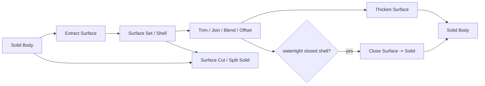

# 曲面 Feature 与实体桥接

> 目标契约，不等于已交付能力。返回[目标架构目录](../../TARGET_ARCHITECTURE.md)；当前事实见[当前架构](../../CURRENT_ARCHITECTURE.md)，实施顺序只在[统一路线](../../../plans/README.md)维护。

本页为长期候选设计；尚无完整产品实现。引入新模型、第三方库或服务前必须完成范围、许可证、corpus 与资源边界验证。

### 5.5.9 拉伸面与旋转面

`SurfaceExtrudeFeature` 输入一条或多条 Wire、Direction 和 Extent；开放曲线扫出 Face，闭合 Wire 默认产生 Open Shell，不自动封盖或造 Solid。`SurfaceRevolveFeature` 输入 Wire、Axis 和角度；同样不隐式封闭。

- 复用 5.4 的 DirectionRef、AxisRef、Length/Angle 和 extent 语义；
- OCCT 路径可使用 `BRepPrimAPI_MakePrism/MakeRevol`，但提取 surface result 而非强制 Solid；
- 输出 `START_BOUNDARY`、`END_BOUNDARY`、`SURFACE_FROM_SOURCE_EDGE`；
- 全周旋转明确记录 periodic seam 与 pole/singularity；
- 输入曲线与方向相切、回转跨轴、自交或输出零面积时失败；
- 解析输入应尽量保留 Plane/Cylinder/Cone 等 canonical surface，canonical detection policy 进入 evaluator version。

这两个 Feature 是曲面 P0，用于建立后续 Trim/Join/Thicken 的最小闭环。

### 5.5.10 扫掠曲面 Sweep

```proto
message SurfaceSweepFeature {
  WireRef profile = 1;
  CurveRef spine = 2;
  repeated CurveRef guides = 3;
  SweepFrameMode frame_mode = 4;
  optional SurfaceRef support = 5;
  ProfilePlacement placement = 6;
  repeated SweepSection sections = 7;
  optional LawRef scale_law = 8;
  optional LawRef twist_law = 9;
  SweepTransition transition = 10;
  SurfaceBranchSelection branch = 11;
  ApproximationPolicy approximation = 12;
}
```

| Frame mode | 语义 | 交付顺序 |
|---|---|---|
| `CORRECTED_FRENET` | 尽量避免 Frenet 在低曲率/拐点翻转 | P0 默认 |
| `FRENET` | 经典切向-法向-副法向 frame | P1 |
| `FIXED_FRAME` | 全程保持初始 frame 方向 | P0 |
| `CONSTANT_BINORMAL` | 指定副法向，截面保持约束角 | P1 |
| `SUPPORT_NORMAL` | spine 在支撑面上，以支撑面法向控制 | P1 |
| `TWO_GUIDES` | 由两条 guide 与 anchor/coupling 控制尺度和方向 | P2 |

初期使用 [BRepOffsetAPI_MakePipeShell](https://dev.opencascade.org/doc/refman/html/class_b_rep_offset_a_p_i___make_pipe_shell.html)，它支持多截面、不同 frame、Generated history、错误状态与 surface error。算法适配器必须：

1. 将 profile 的 anchor point、x direction 和初始 plane 固化为 `ProfilePlacement`；
2. 以 spine arc-length fraction 驱动 scale/twist law，避免原始参数化改变后形状突变；
3. 对多 section 保存每个 section 在 spine 上的 location 和 coupling；
4. 检测 frame 翻转、cusp、guide 多交点、截面自交、surface folding 和不相连多结果；
5. `transition` 明确为 `FAIL_AT_CORNER | MITER | ROUND | TRANSFORMED`，P0 只交付 FAIL/MITER；
6. 记录 `ErrorOnSurface`，再以独立采样验证 profile/guide deviation；
7. 对多解保存 branch，而不保存易变的“solution number”。

CATIA Sweep 提供 law、guide、reference surface、canonical detection、扭曲区域诊断与多解管理；这些是能力目标，但“自动删除扭曲部分”不能作为默认修复。occcad 应返回 fold interval，让用户显式增加 relimiter 或修改输入。[CATIA Sweep 行为说明](https://help-3dexperience.aesvietnam.com/English/GsdUserMap/gsd-c-SweptSurface.htm)

### 5.5.11 多截面曲面

`MultiSectionSurfaceFeature` 复用 5.4.12 的 ordered section、seam anchor、marker 和 `ResolvedSectionMatching`，但有以下差异：

- section 可以是开放 Wire；所有 section 开闭属性必须一致；
- 使用 [BRepOffsetAPI_ThruSections](https://dev.opencascade.org/doc/refman/html/class_b_rep_offset_a_p_i___thru_sections.html) 的 surface/shell 模式，不造 Solid、不自动端盖；
- 支持首末 Point 作为退化截面，但必须标识 singular fan；
- `RULED | SMOOTH`、degree、span、parameterization 和 smoothing weights 全部进入 schema；
- spine/guide 不塞进基本 Loft；P2 的 `GuidedMultiSectionSurface` 需要定义 section-guide 唯一交点和 coupling；
- 每对 section interval 输出独立 patch lineage，不能把整个结果当一个无身份 Shell；
- 检验扭结、法向翻转、内部自交、跨 patch G0/G1 及最大偏差。

截面数增加通常会提高约束而非必然提高质量。UI 应显示 section coupling 和异常扭曲位置，不提供“加更多截面总会更准”的误导。

### 5.5.12 Fill / N-side Patch

```proto
message FillSurfaceFeature {
  repeated SurfaceBoundaryConstraint outer = 1;
  repeated BoundaryLoop inner_loops = 2;
  repeated PointRef passing_points = 3;
  repeated CurveRef passing_curves = 4;
  optional SurfaceRef initial_surface = 5;
  ApproximationPolicy approximation = 6;
  BoundaryRepairPolicy boundary_policy = 7;
}
```

使用 [BRepFill_Filling](https://dev.opencascade.org/doc/refman/html/class_b_rep_fill___filling.html) 作为首个 N-side evaluator。它支持边界/内部约束、G0/G1/G2、初始面、误差查询和 degree/segment 控制，但官方文档指出不兼容约束可能不被采纳，因此必须逐项读取/复算 `G0Error/G1Error/G2Error`，任何声明约束未达标都使 Feature 失败。

- outer boundary 按用户顺序形成单一闭环，相邻端点 gap 必须在输入容差内；
- inner loop 不相交、不接触 outer，方向由 surface normal 规范化；
- G1/G2 boundary 必须提供明确 support Face，且 boundary 确实位于 support 上；
- passing point 必须在目标参数域/边界内部的可行区域，passing curve 不得与边界产生未声明冲突；
- 缺口修补、相邻边延长和交点重裁剪只有 `boundary_policy=EXPLICIT_REPAIR` 才允许，并把派生曲线写入输出；
- 自动生成的 missing edge 不得悄悄改变设计意图；P0 默认要求闭合；
- initial surface 只是优化初值，不成为未记录依赖；
- 输出报告包含每个 constraint 的最大误差、最坏点、degree/spans 和是否产生 non-isoparametric trim。

[CATIA Fill](https://help-3dexperience.aesvietnam.com/English/CcvUserMap/gsd-t-Surfaces-Fill.htm)把边界支撑、Point/Tangent/Curvature、内边界、passing elements 和 deviation 都作为显式输入；occcad 保持同等级别的设计可见性，但首期对自动延长/重裁剪采取更保守策略。

### 5.5.13 Offset Surface

```proto
message OffsetSurfaceFeature {
  SurfaceOutputRef input = 1;
  LengthValue distance = 2;
  OffsetSide side = 3;
  OffsetJoin join = 4;
  OffsetFailurePolicy failure_policy = 5;
  optional LawRef variable_distance = 6;
}
```

P0 只支持常量 offset，使用 [BRepOffsetAPI_MakeOffsetShape](https://dev.opencascade.org/doc/refman/html/class_b_rep_offset_a_p_i___make_offset_shape.html) 或对单支持面的等价路径。距离为正值，side 单独表示；输入 Face 法向规范化进入结果证据。

- `failure_policy=FAIL` 是默认，不能自动删除失败区域；
- `KEEP_VALID_REGIONS` 只用于交互诊断，返回候选区域但不能提交为原 Feature 成功；
- 检测局部曲率半径小于 offset、offset 自交、消失面、尖角和 free edge 变化；
- OCCT 的全局 `Intersection=true` 未完全实现且不推荐，默认固定 false；
- join `ARC | INTERSECTION` 分阶段开放，不能和全局 Intersection 开关混淆；
- variable offset 不是常量算法循环，需独立拟合与连续性设计，放到 P3；
- trim boundary 的映射、seam 和被删除区域进入 TopologyHistory。

### 5.5.14 Trim、Split 与交线

曲面修剪分为三个显式阶段：计算交线、选择分支、构造修剪 Face。一次命令可以在 evaluator 内原子完成，但结果必须保存中间语义。

```proto
message TrimSurfaceFeature {
  repeated SurfaceOutputRef targets = 1;
  repeated TrimTool tools = 2; // surface, face, plane, closed wire on support
  repeated SurfaceBranchSelection kept_regions = 3;
  MutualTrimMode mode = 4;
}
```

- surface/surface intersection 输出 3D curve、双方 pcurve、端点、闭合/周期和 branch identity；
- keep point/side 是用户意图，局部 face index 不是；
- 多条交线、tangent contact、overlap、near-coincident 和周期 seam 必须返回候选；
- `Trim` 只保留选定区域，`Split` 保留所有子区域并输出稳定 region slots；
- Mutual trim 同时改变两个输入的求值副本，但仍产生一个原子 FeatureResult；
- 交线的 3D/pcurve mismatch 超过 tolerance 时失败，不靠增大 edge tolerance 掩盖；
- no-op trim 默认失败，预览可返回 `NO_INTERSECTION` warning；
- 下游选择沿 split lineage 迁移，歧义时要求 rebind。

OCCT Boolean/Splitter/Section 只能作为适配器候选；公共契约不暴露具体算法类，因为曲面-曲线、曲面-曲面和 Face/Shell 的最佳路径不同。

### 5.5.15 Join、Sew 与 Healing

Join 不是 Fuse。它把相邻 Face/Curve 组装为更高层 Shape，并验证连接；不会生成材料交集。

```proto
message JoinSurfaceFeature {
  repeated SurfaceOutputRef inputs = 1;
  LengthValue sewing_tolerance = 2;
  ManifoldPolicy manifold = 3;
  ContinuityRequirement required = 4;
  JoinRepairPolicy repair = 5;
}
```

初期使用 [BRepBuilderAPI_Sewing](https://dev.opencascade.org/doc/refman/html/class_b_rep_builder_a_p_i___sewing.html)，收集 free edges、multiple edges、degenerated shapes、modified subshapes 和实际使用 tolerance。规则：

- P0 只允许 manifold Join，non-manifold 必须是另一个明确 Body kind 和使用场景；
- sewing tolerance 有项目上限，不能高于相邻最小特征尺度的安全比例；
- `required=G0` 只保证位置连接；要求 G1/G2 时必须经连续性检查，Sewing 本身不创造切向/曲率连续；
- 允许的 edge splitting、orientation correction 和 tiny-edge removal 逐项列入 `JoinRepairPolicy`；
- 实际修补动作、前后 free-edge 数、最大 gap 和 tolerance growth 进入 provenance；
- 输出可为一个 Open/Closed Shell；多个不相连结果若未显式允许则失败。

`HealingFeature` 只用于导入数据或用户明确修复，封装 [ShapeFix](https://dev.opencascade.org/doc/refman/html/class_shape_fix___shape.html) 的白名单动作。自动 healing 不得隐藏在每个 Surface Feature 末尾；否则模型会随内核版本改变而不可解释。

### 5.5.16 Extract、Boundary 与 Extrapolate

- `ExtractSurfaceFeature` 从 Solid/Shell 发布一个或多个关联 Face，可按 tangent/curvature propagation 扩展；实际传播集合固化到结果；
- `BoundaryFeature` 产生 free boundary、完整 outer/inner loop 或指定 edge chain，输出 Curve lineage；
- `IsoparametricCurveFeature` 保存 support surface、U/V、parameter 和 trim policy；
- `ExtrapolateSurfaceFeature` 选择一条 boundary、长度/到元素终止和 continuity intent，延长 underlying support 后重建 trim；
- 对周期面、singularity、非等参边和多 patch Shell，必须明确选中具体 boundary patch；
- “Untrim” 恢复 underlying surface 的自然/指定参数域，是独立 Feature，不能把原始面无限域全部暴露；
- Extrapolate 后用原 boundary 及新 outer boundary 建立 lineage，并验证法向翻转和自交。

### 5.5.17 Blend、Surface Fillet 与 Match

这三类在 UI 上相似，但语义不同：

| Feature | 主要目标 | 是否修改输入 support |
|---|---|---|
| Blend Surface | 在两条 boundary/两支持面间新建过渡面 | 否 |
| Surface Fillet | 以半径/law 构造滚动球式过渡并可 trim supports | 可选 |
| Match Surface | 移动目标 NURBS 边界 poles，使其贴合 reference | 是，生成新显式面 |

`BlendSurfaceFeature` 保存两侧 boundary、support、G0/G1/G2、方向、tension/shape law、spine/limits 和 trim policy。P1 可用 constrained filling/plate 算法做双边 Blend；P2 才做稳定多解、variable tension 和自动 trim。

`SurfaceFilletFeature` 保存 support pair、radius/law、spine、rolling side、trim/keep 方案和 corner strategy。不能直接复用 Solid edge fillet schema，因为开放面没有同样的 Body 邻接语义。

`MatchSurfaceFeature` 属于 FreeStyle 层：输入必须是 `ExplicitNurbsSurface` 或显式转换副本，选择目标 boundary 与 reference boundary，指定 G0/G1/G2、mapping、frozen rows、max deviation 和 fairness。生成特征的 Loft/Sweep 不能被 Match 暗中改 poles；用户需先 `IsolateToExplicitSurface`，接受失去部分历史语义。

G3 构造、全局多 patch Match 与 styling fillet 是研究级。CATIA 质量工具能分析到 G3，但分析能力不等于当前开源内核可靠构造能力。[CATIA Connect Checker](https://help-3dexperience.aesvietnam.com/English/CatHfmUserMap/gsd-c-ConnectCheckerAnalysis.htm)

### 5.5.18 Explicit NURBS 与控制点编辑

```proto
message NurbsSurfaceDefinition {
  uint32 u_degree = 1;
  uint32 v_degree = 2;
  repeated double u_knots = 3;
  repeated uint32 u_multiplicities = 4;
  repeated double v_knots = 5;
  repeated uint32 v_multiplicities = 6;
  repeated ControlPoint4 poles = 7;
  bool u_periodic = 8;
  bool v_periodic = 9;
  repeated TrimLoop trims = 10;
}
```

- pole 使用稳定 `(u_index,v_index)` identity；结构编辑后返回 mapping；
- weights 必须正且有界，knots 非降、multiplicity 与 degree 合法；
- periodic seam 不重复拥有两套可独立移动的逻辑 poles；
- MovePole、MoveRow、Align、Smooth、Insert/RemoveKnot、Elevate/ReduceDegree 都是 typed edit command；
- degree reduction、knot removal 和 surface rebuild 是近似操作，必须给 max deviation；
- 冻结边界、对称、平面/方向约束和 G1/G2 match 进入优化问题；
- 交互预览可用局部增量求值，提交必须在服务端完成完整质量门禁。

Class-A 质量不是无限增加 poles。默认优化目标应惩罚弯曲能、曲率振荡、过多 knots/spans 和边界误差，并把 pole 数/degree 作为预算。高阶连续性若靠极端 weights 或密集 knots 获得，应触发质量 warning。

### 5.5.19 曲面到实体的桥接



**ThickenSurfaceFeature**：输入 Face/Open Shell、正 thickness、side（ONE_SIDE/TWO_SIDE/SYMMETRIC）、join 和 side-wall policy；构造 offset skin、边界侧壁并缝合为 Solid。它与 Solid ShellFeature 不同：Shell 是从 Solid 删除面并偏置，Thicken 是从开放面生成 Solid。

**CloseSurfaceFeature**：输入 Closed Shell，经 oriented shell、free/multiple edge、self-intersection 和体积检查后造 Solid；不进行超容差 sewing。若需 Join/Healing，用户必须在前面显式建 Feature。

**SurfaceCutSolidFeature**：输入 Solid Body 和定向 Surface/Shell，保存保留 side/keep point；工具必须能把 Solid 唯一分区。无限支持面扩展策略必须明确，no split/多个歧义 region 时失败。

桥接输出进入 Solid Body 后，继续使用 5.4 的 Body/Tip、布尔、拓扑历史和正体积门禁。
