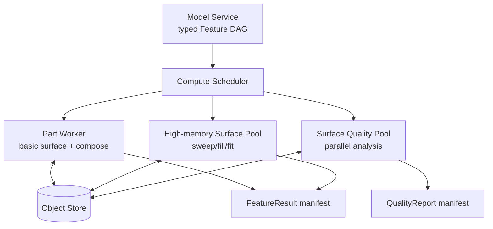

# 曲面计算、交互与验证

> 目标契约，不等于已交付能力。返回[目标架构目录](../../TARGET_ARCHITECTURE.md)；当前事实见[当前架构](../../CURRENT_ARCHITECTURE.md)，实施顺序只在[统一路线](../../../plans/README.md)维护。

本页为长期候选设计；尚无完整产品实现。引入新模型、第三方库或服务前必须完成范围、许可证、corpus 与资源边界验证。

### 5.5.26 分布式 Worker 设计

无需为每个曲面命令建微服务。初期在 `PartEvaluationWorker` 内提供独立 capability：

```text
surface.wire.v1
surface.basic.v1        extrude/revolve/extract/boundary
surface.compose.v1      trim/split/join/close/thicken
surface.sweep.v1        sweep/multi-section
surface.fill.v1         fill/blend/offset
surface.quality.v1      continuity/deviation/topology analysis
surface.explicit.v1     NURBS pole edit/fairing
```



- Feature DAG 的单个原子 evaluator 在一台 Worker/进程完成，不能把一次 NURBS 构造拆成网络级小调用；
- 大型质量分析可按 Face/connection partition 并行，再确定性归并最大值和统计量；
- Fill/Sweep/fit 根据预估 degree、span、section 和 topology 路由 high-memory pool；
- explicit optimization 后期可独立 `SurfaceOptimizationWorker`，但仍实现相同 Feature evaluator contract；
- Web 端做低延迟 tessellated/limit-surface preview；最终 B-Rep 和质量门只在权威 Worker；
- capability 包含 OCCT/algorithm build、quality profile、maximum limits 和 determinism class。

### 5.5.27 交互预览与提交

控制点拖动、law 曲线和 Sweep placement 需要 30–60 FPS 反馈，但不能每帧创建 Revision：

1. Client 建立 `PreviewSession(base_workspace_seq, feature_digest)`；
2. 本地/近端 evaluator 用降阶采样或已有 tessellation 产生视觉候选；
3. 以 100–250 ms debounce 向 Preview Worker 发送可取消候选；
4. 返回低分辨 B-Rep mesh、quality hints 和多个 branch；
5. 用户确认后发送一次 typed edit command；
6. 权威 Worker 完整求值/质量门，Model Service CAS 提交；
7. 预览与权威不一致时显示明确失败，不提交预览 mesh。

Preview artifact 有短 TTL、不可被下游 Revision 引用。Branch 选择使用 solution ID/evidence，不能依赖预览列表序号。

### 5.5.28 缓存与确定性

SurfaceEvaluationKey 在 5.4 基础上增加：

```text
ordered curve/surface input GeometryIds
resolved branch + seam + orientation + coupling digests
Law definitions + resolved parameter values
ApproximationPolicy + SurfaceQualityProfile
surface algorithm/evaluator build
canonical detection + healing policy
```

质量报告 Key 还包含 selection scope、analysis types、sampling policy 和 report schema。Zebra 的观察方向/环境纹理是 View state，不进入 B-Rep GeometryId；若生成可复现审查截图，则进入该截图 artifact key。

### 5.5.29 诊断模型

| Code | 场景 |
|---|---|
| `CURVE_NOT_G1` | Sweep spine/guide 不满足最低连续性 |
| `PCURVE_MISMATCH` | Face edge 的 3D curve 与 UV pcurve 偏差超限 |
| `SURFACE_FOLD` / `NORMAL_FLIP` | Jacobian 退化、局部折叠或法向翻转 |
| `SWEEP_FRAME_SINGULARITY` | frame 在 cusp/低曲率区无法稳定定义 |
| `GUIDE_COUPLING_AMBIGUOUS` | normal plane 与 guide 有多个候选交点 |
| `SECTION_COUPLING_INVALID` | Loft section marker/seam 对应交叉 |
| `FILL_BOUNDARY_OPEN` | Fill outer loop 未闭合 |
| `FILL_CONSTRAINT_UNSATISFIED` | G0/G1/G2 或 passing element 超差 |
| `OFFSET_SELF_INTERSECTION` | offset 曲面自交/塌陷 |
| `INTERSECTION_AMBIGUOUS` | 相交产生多分支且未选择 |
| `TRIM_REGION_AMBIGUOUS` | keep point/side 无法唯一确定 region |
| `SEWING_FREE_EDGES` | Join 后存在非预期 free edges |
| `SEWING_MULTIPLE_EDGE` | 产生非流形共享边 |
| `CONTINUITY_NOT_MET` | 结果未达到请求 G 等级 |
| `APPROXIMATION_BUDGET_EXCEEDED` | 需要超过 degree/span/pole 预算 |
| `QUALITY_GATE_FAILED` | 发布质量规则未通过 |
| `SURFACE_TO_SOLID_NOT_WATERTIGHT` | Close/Thicken 无法生成闭合 Solid |

每个错误给出 Feature stage、输入 IDs、problem boundary/UV interval、3D bbox、max measured value、required threshold、kernel status 和 repair suggestion key。对 fold/continuity/deviation 生成小型 highlight artifact，帮助浏览器定位，而不是只显示一句“Update failed”。

### 5.5.30 资源、安全和数值边界

- 限制每 Feature 的 input faces/curves、sections/guides、NURBS degree/poles/knots/spans、intersection branches 和 output topology；
- 限制 UV/世界坐标、weight dynamic range、law samples 和 tolerance ratio；
- 曲面-曲面 intersection、Fill、fit 和 self-intersection 检测都有独立 CPU/RAM/deadline 预算；
- 任何 O(n²) patch pair 检查先用 BVH/bbox broad phase；
- 导入 BREP/STEP/3DM/mesh 都是不可信输入，在隔离 Exchange Worker 做结构/大小验证；
- OCCT 崩溃由可回收子进程隔离，原 Revision/Workspace 不受影响；
- 自动 tolerance growth 有绝对上限和局部 feature-size 比率上限；
- quality sampling 对退化/恶意参数化有最大递归深度，达到上限返回 inconclusive/失败，不能错误通过。

### 5.5.31 测试与验证矩阵

| 层级 | 覆盖内容 |
|---|---|
| Schema golden | 每个 Surface Feature、Law、continuity、branch、版本迁移 |
| Analytic oracle | Plane/Cylinder/Cone/Sphere/Torus 的位置、法向、曲率、面积 |
| Curve-on-surface | 3D/pcurve 一致、周期 seam、singularity、projection branches |
| Sweep | frame modes、cusp、closed spine、guide 多交点、scale/twist law、fold |
| Multi-section | open/closed、seam/marker、点终止、section 增删、twist |
| Fill | 3/4/N 边、内孔、G0/G1/G2、passing point/curve、冲突约束 |
| Offset | 正反 side、曲率塌陷、自交、尖角、periodic face |
| Trim/Split | 多交线、相切、重叠、no-op、keep region、周期面 |
| Join/Heal | gap 梯度、free/multiple edge、orientation、tolerance growth |
| Blend/Match | G0/G1/G2、映射、冻结 rows、最大偏差和 fairness |
| Bridge | Extract/Thicken/Close/Surface-cut-Solid、watertight gate |
| Quality | 自适应采样、已知最大误差、zebra/curvature fields、worst point |
| Topology | patch/boundary/seam/split/sew lineage、编辑后 rebind |
| Exchange | STEP/IGES/3DM（若启用）round-trip 类型、trim、单位、容差 |
| Metamorphic | 刚体变换、单位换算、U/V reverse、等价重参数化 |
| Differential | OCCT 版本对照、解析算法/第二后端对照，不以一致错误为正确 |
| Fuzz | Proto、NURBS knots/weights、pcurve、交线、导入坏 Shape |
| Benchmark | 1k faces、100 sections、复杂 Fill、质量分析、cancel、peak RSS |

Corpus 必须包含公开可再分发模型和项目自建参数化案例，不依赖无法进入 CI 的商业 CATIA 文件。可使用 STEP 作为几何交换对照，但 Feature history 不做无依据的跨 CAD 反推。

### 5.5.32 推荐模块边界

```text
kernel/wire3d/api/              typed 3D curve/domain/reference contracts
kernel/wire3d/evaluate/         curve evaluation, projection, intersection

kernel/surface/api/             feature definitions, laws, quality contracts
kernel/surface/selection/       boundary/patch/seam/branch resolver
kernel/surface/generator/       extrude, revolve, sweep, multi-section, fill
kernel/surface/compose/         trim, split, join, offset, extract, extrapolate
kernel/surface/styling/         explicit NURBS, blend, match, fairing
kernel/surface/bridge/          thicken, close, cut-solid
kernel/surface/quality/         continuity, curvature, deviation, topology
kernel/surface/history/         patch/boundary/UV lineage

kernel/occt/                    thin OCCT adapters and status translation
workers/geometry/               authoritative feature orchestration
workers/surface-quality/        optional independently scaled analysis pool
tests/surface/corpus/           analytic, regression, failure and quality data
```

`kernel/surface/api` 不包含 OCCT header。算法适配器接受值语义输入并返回项目定义的 status/history/metrics。若未来增加 SISL、GoTools 或自研 fitting backend，它们实现相同内部接口，不改变 Proto。
