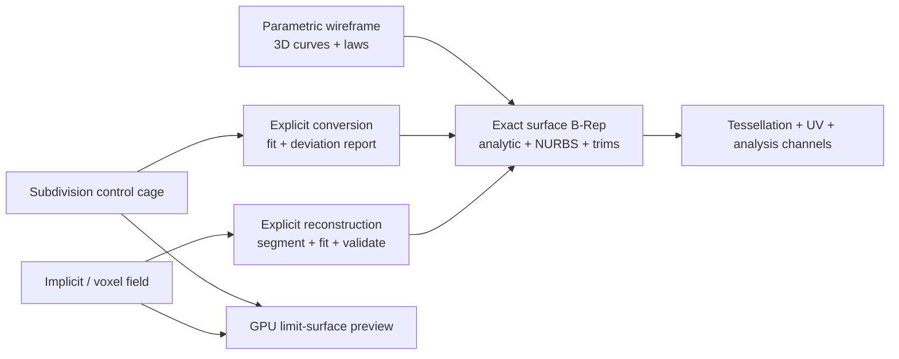
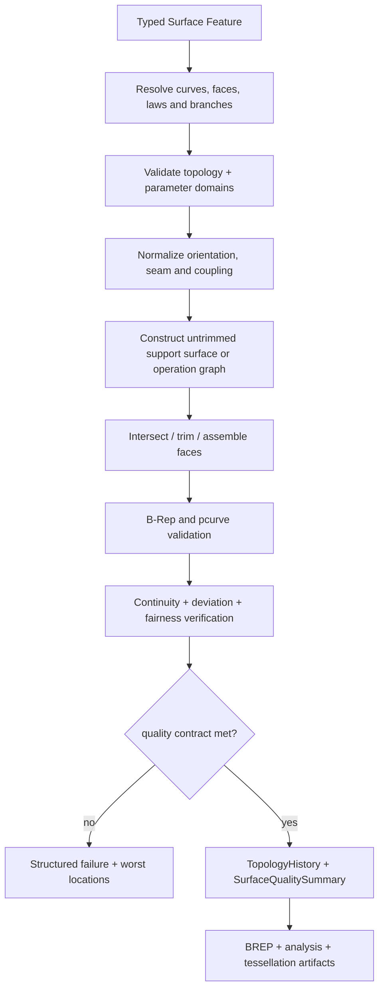

# 曲面与三维线框模型

> 目标契约，不等于已交付能力。返回[目标架构目录](../../TARGET_ARCHITECTURE.md)；当前事实见[当前架构](../../CURRENT_ARCHITECTURE.md)，实施顺序只在[统一路线](../../../plans/README.md)维护。

本页为长期候选设计；尚无完整产品实现。引入新模型、第三方库或服务前必须完成范围、许可证、corpus 与资源边界验证。

### 5.5.1 对标范围和边界

| 能力层 | 对标目标 | occccad 设计结论 |
|---|---|---|
| 关联线框 | 3D 点/线/曲线、投影、相交、偏移、边界、连接 | 建立独立 `WireFeature` 输出，所有引用可重算 |
| 机械曲面 | Extrude、Revolve、Sweep、Multi-section、Fill、Offset | 以精确 OCCT B-Rep/NURBS 为权威结果 |
| 曲面组合 | Trim、Split、Join、Healing、Extrapolate、Extract | 每项都是显式 Feature；禁止隐式大容差修补 |
| 混合建模 | 曲面与 Part Design 双向使用 | Extract/Thicken/Close/Trim Solid 形成明确桥接 |
| 规格驱动 | Feature tree、参数/Law、替换、发布元素 | 复用现有 Feature Graph、Parameter Graph 和 Revision |
| 质量诊断 | G0/G1/G2/G3、gap、zebra、曲率、偏差 | 服务端生成权威 `SurfaceQualityReport`，客户端实时可视化 |
| FreeStyle | pole 编辑、Match、Blend、局部变形 | 单独 `ExplicitSurface` 与约束优化模块，不改写生成特征 |
| Class-A | 高阶连续性、反射质量、低阶低跨数、可审计偏差 | 作为质量等级和验收门，不以“算法成功”冒充 Class-A |
| Subdivision | 概念雕塑、快速形态探索 | 独立 SubD 表示；通过受控拟合/转换进入 NURBS/B-Rep |
| 逆向工程 | 点云/网格分段、拟合、偏差闭环 | 后期独立 Reconstruction pipeline，不塞进 Fill Feature |

第一阶段不追求 CATIA ICEM 级汽车外覆盖件能力。G3 构造、多补片全局 Class-A 优化、非均匀偏置、全局 Morph、扫描点云自动曲面重建都需要长期算法投入；文档将其明确列为研究阶段，避免路线图把功能名称等同于工程完成。

### 5.5.3 三种几何表示严格分层



1. **Exact B-Rep/NURBS** 是工程曲面、STEP 交换、裁剪、缝合、实体化和制造的权威表示；
2. **Subdivision** 保存控制笼、crease 和拓扑，适合概念造型与交互，不宣称天然可制造；
3. **Implicit/voxel** 适合晶格、生成式结果、形态布尔和重建中间态，不保存精确边界；
4. Tessellation 永远是视图/分析制品，不成为 Feature 输入真相；
5. 三类之间只有显式 Conversion Feature，必须给出 tolerance、偏差、失败区域和来源血缘。

不能设计一个字段叫 `surface_blob`，让它有时存 NURBS、有时存三角网格。不同表示的参数、拓扑身份、可交换性和确定性完全不同。

### 5.5.4 Part 内的混合容器

```text
PartRevision
  solid_bodies[]           // 5.4 SOLID_BODY，Tip 必须为有效 Solid
  geometrical_sets[]       // 组织 wire/surface/datum Feature，可为 DAG
  ordered_sets[]           // 有显式顺序与 current result 的几何集合
  features[]               // 同一 typed Feature Graph
  published_elements[]     // 可供其他 Part 稳定引用的曲线/曲面/Datum
```

- `GeometricalSet` 是组织与可见性边界，不是几何 Compound 的别名；
- `OrderedGeometricalSet` 适合连续的构造历史，但每个 Feature 仍显式引用输入，不能依赖树中“上一行”；
- Surface Feature 输出 `CURVE | WIRE | FACE | OPEN_SHELL | CLOSED_SHELL | SURFACE_SET`；
- `SURFACE_SET` 可以含多个不相连 Face，必须保留 face set identity；
- Surface Set 允许 free boundary；Closed Shell 才允许经 `CloseSurfaceFeature` 进入 Solid；
- 隐藏/显示、工作对象和树文件夹不进入 GeometryId；Suppress、Isolate、Replace 等建模语义进入 Revision；
- 下游跨 Part 只引用 `PublishedElement`，不直接钻取另一个 Part 的任意内部 Feature。

### 5.5.5 3D 线框是曲面的前置领域

Surface 不直接消费客户端折线。3D 线框模块至少提供：

| 类别 | Feature | 输出与关键语义 |
|---|---|---|
| 基本元素 | Point3D、Line3D、Plane、AxisSystem | 参数化 Datum/Curve，不复制 Sketch 2D 类型 |
| 样条 | InterpolateCurve、ControlPointCurve | degree、poles、weights、knots、end conditions |
| 派生 | ProjectCurve、IntersectionCurve | 支撑面、投影方向/最近点、分支身份 |
| 边界 | Extract、Boundary、IsoparametricCurve | 来源 Face、UV 方向/参数、传播范围 |
| 变换 | Translate、Rotate、Scale、Symmetry、Affinity | 关联 Transform 和血缘 |
| 曲线修改 | TrimCurve、SplitCurve、JoinCurve、ExtrapolateCurve | 保留分支、端点映射、容差 |
| 质量 | SmoothCurve、ConnectCurve | G0/G1/G2 目标、最大偏差、曲率梳报告 |
| 工程曲线 | Helix、Spiral、ParallelCurve、CurveOnSurface | 周期、支撑面 UV 与 seam 语义 |

`CurveOnSurface` 必须同时保存 3D curve 与支撑面的 pcurve/UV 关系；两者偏差超限即失败。投影和相交可能得到多条 Curve，FeatureResult 返回稳定 `solution_id` 集合；需要单曲线的下游必须保存用户选择的 branch evidence，不能每次取最长曲线。

### 5.5.6 曲面基础值类型

```proto
enum GeometricContinuity { G0 = 0; G1 = 1; G2 = 2; G3 = 3; }

message SurfaceBoundaryConstraint {
  PersistentSelection boundary = 1;      // curve or surface edge
  optional PersistentSelection support = 2;
  GeometricContinuity continuity = 3;
  optional DirectionSense sense = 4;
  optional LawRef tension = 5;
}

message ApproximationPolicy {
  double max_position_error_m = 1;
  double max_normal_error_rad = 2;
  double max_curvature_error_ratio = 3;
  uint32 max_u_degree = 4;
  uint32 max_v_degree = 5;
  uint32 max_u_spans = 6;
  uint32 max_v_spans = 7;
  FairnessObjective fairness = 8;
}

message SurfaceBranchSelection {
  string solution_id = 1;
  optional Point3 keep_point = 2;
  optional DirectionSense side = 3;
  SelectionEvidence evidence = 4;
}
```

连续性分为参数连续性 `C0/C1/C2...` 和几何连续性 `G0/G1/G2/G3`。用户建模约束主要表达 G 连续性；内核的 `GeomAbs_C2` 不能直接当作两个修剪面之间已经 G2。每个 continuity constraint 必须说明 support、边界、方向和容差。

`LawRef` 引用 Parameter Graph 中的一维标量函数：constant、linear、S-curve、piecewise spline 或 expression。权威 domain 规范为 `[0,1]`，同时记录它映射到 spine arc length、curve parameter 还是 section index；禁止不同 Feature 各自猜测 law 自变量。

### 5.5.7 Surface Feature 类型契约

在 5.4 的 `FeatureNode.oneof definition` 中增加明确分支：

```proto
oneof definition {
  // existing solid features
  SurfaceExtrudeFeature surface_extrude = 100;
  SurfaceRevolveFeature surface_revolve = 101;
  SurfaceSweepFeature surface_sweep = 102;
  MultiSectionSurfaceFeature multi_section_surface = 103;
  FillSurfaceFeature fill_surface = 104;
  OffsetSurfaceFeature offset_surface = 105;
  TrimSurfaceFeature trim_surface = 106;
  SplitSurfaceFeature split_surface = 107;
  JoinSurfaceFeature join_surface = 108;
  ExtrapolateSurfaceFeature extrapolate_surface = 109;
  ExtractSurfaceFeature extract_surface = 110;
  BlendSurfaceFeature blend_surface = 111;
  MatchSurfaceFeature match_surface = 112;
  ThickenSurfaceFeature thicken_surface = 113;
  CloseSurfaceFeature close_surface = 114;
  ExplicitNurbsSurfaceFeature explicit_nurbs = 115;
}
```

Surface Feature 不使用 `BodyOperation`；它产生或修改 Surface outputs。只有 Thicken/Close/Surface-cut-Solid 这类桥接 Feature 输出 Solid Body，并服从 5.4 的 Body policy。实体 `LoftFeature` 与 `MultiSectionSurfaceFeature` 共享 section matching 库，但 schema 和结果门禁不同：前者要求闭合截面和 Solid，后者允许开放截面并产生 Face/Open Shell。

### 5.5.8 共用求值流水线



构造算法返回 Done 只是进入验证阶段，不是成功。特别是 Fill 算法可能在约束不兼容时忽略局部约束，Sweep 可能产生扭结，Sewing 可能留下 free edge；这些情况必须由领域层检测并按用户的质量合同失败。
