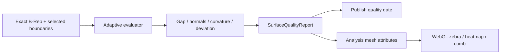

# 曲面质量、连续性与命名

> 目标契约，不等于已交付能力。返回[目标架构目录](../../TARGET_ARCHITECTURE.md)；当前事实见[当前架构](../../CURRENT_ARCHITECTURE.md)，实施顺序只在[统一路线](../../../plans/README.md)维护。

本页为长期候选设计；尚无完整产品实现。引入新模型、第三方库或服务前必须完成范围、许可证、corpus 与资源边界验证。

### 5.5.20 开源技术选型分析

| 技术 | 适合职责 | 不适合职责 | 采用结论 |
|---|---|---|---|
| OCCT | 解析面/NURBS、B-Rep、Sweep/Loft/Fill/Offset/Sewing、STEP | 完整 Class-A 产品语义、自动保证 G2/G3、公差策略 | 权威精确内核；领域层包裹并独立验收 |
| Eigen | 稀疏/稠密线代、最小二乘、fairness 能量 | 曲面拓扑、B-Rep、Feature 语义 | 内部数学基础，固定求解配置 |
| Ceres Solver | 非线性拟合、受约束参数优化原型 | 直接作为曲面建模器 | P2 Explicit NURBS/Fit evaluator 候选 |
| openNURBS | 3DM 数据结构和读写、NURBS 交换适配 | 通用建模/裁剪/缝合内核 | 可选 Exchange Worker；先审计当前许可与格式兼容 |
| SISL / GoTools | NURBS 相交、拟合、光顺、Coons/Gordon 等研究算法 | 默认宽松许可核心依赖 | GPL/商业许可；只作对照或经法律审计的隔离可选后端 |
| CGAL | robust predicates、网格/点云、离散曲率、AABB | 精确 trimmed NURBS B-Rep 主模型 | 包级许可差异大；仅选定包、隔离 mesh/reconstruction |
| libigl | 轻量网格处理、参数化和分析原型 | NURBS/B-Rep | 可选分析工具；逐模块核验 MPL/GPL 依赖 |
| OpenSubdiv | CPU/GPU SubD limit surface、高效概念预览 | 工程 NURBS、Trim/Sew/STEP | 独立 SubD Worker/客户端 evaluator，不替换 OCCT |
| OpenVDB | 稀疏体、隐式场、voxel CSG/滤波 | 精确曲面与尺寸标注 | 后期隐式造型/重建中间态 |

OCCT 是 [LGPL-2.1 with additional exception](https://dev.opencascade.org/doc/overview/html/index.html)。CGAL 高层包常为 GPL、基础包可能 LGPL，必须按实际 header/package 生成 SBOM 与许可清单，不能笼统写“CGAL 开源所以可直接链接”。[CGAL 官方许可说明](https://www.cgal.org/license.html) SISL/GoTools 的 GPL/商业模式也要求相同审计。[SINTEF 工具下载与许可](https://www.sintef.no/projectweb/geometry-toolkits/downloads/)

OpenSubdiv 面向静态拓扑控制笼的高性能 limit-surface evaluation，适合概念层；OpenVDB 面向稀疏离散体。二者都不是 trimmed NURBS kernel。[OpenSubdiv 官方仓库](https://github.com/PixarAnimationStudios/OpenSubdiv) [OpenVDB 官方仓库](https://github.com/AcademySoftwareFoundation/openvdb)

### 5.5.21 连续性和质量的权威定义

对两条待连接边界，以公共弧长参数 `s∈[0,1]` 比较：

| 指标 | 定义 | 说明 |
|---|---|---|
| G0 gap | `||P1(s)-P2(s)||` 的最大值 | 位置连续性 |
| G1 angle | 两侧单位切平面法向的夹角，考虑 orientation | 切向连续性，不能只比较一处 |
| G2 mismatch | 法截曲率向量/主曲率的归一化差 | 曲率连续性，零曲率处用绝对阈值 |
| G3 mismatch | 曲率沿跨边方向变化率差 | 先分析，构造延期 |
| overlap | 边界在公差内重叠但拓扑未连接/错向 | 与 gap 分开报告 |

CATIA Connect Checker 区分 G0/G1/G2/G3、overlap、曲线/曲面连接并显示最大偏差；occcad 采用相同分析维度，但 tolerance 由项目 `SurfaceQualityProfile` 决定，不照搬某一产品默认值。[CATIA 连续性定义](https://help-3dexperience.aesvietnam.com/English/CatHfmUserMap/gsd-c-ConnectCheckerAnalysis.htm)

```proto
message SurfaceQualityProfile {
  string profile_id = 1;
  double g0_max_m = 2;
  double g1_max_rad = 3;
  double g2_relative_max = 4;
  double g2_absolute_max_per_m = 5;
  double max_surface_deviation_m = 6;
  double min_jacobian = 7;
  uint32 adaptive_depth = 8;
  QualityGrade grade = 9; // CONSTRUCTION | ENGINEERING | STYLING | CLASS_A_CANDIDATE
}
```

验证使用“拓扑事件点 + knot/span 边界 + 自适应区间采样 + 局部极值细化”，而不是固定 10 个点。报告注明这是 tolerance-bounded 数值验证，不声称数学证明。Surface 构造成功但未满足所请求 continuity 时状态为失败；只请求 G0 而 G1 很差可以成功并附 quality summary。

### 5.5.22 曲面质量分析服务

`AnalyzeSurface` 是只读派生 Job，不修改 Feature Graph，输出内容寻址 `SurfaceQualityReport`：

- Connect Checker：G0/G1/G2/G3、overlap、内部/外部边；
- Zebra/Reflection lines：服务端生成稳定 analysis field，客户端 shader 实时显示；
- curvature comb/porcupine：曲线曲率、法曲率、主曲率方向；
- Gaussian/mean/principal curvature heatmap；
- draft analysis：相对 Pull Direction 的角度和 undercut；
- deviation：surface-surface、surface-mesh、fit-original，最大/RMS/percentile；
- highlight：最坏点/区间、UV、3D point、关联 Feature/edge；
- topology：free edge、multiple edge、bad orientation、tiny face/edge、singularity；
- parameterization：Jacobian、U/V stretch、pole/span/degree、knot clustering；
- fairness：曲率变化、inflection、wiggle 和近似 bending energy。



[ShapeAnalysis_Surface](https://dev.opencascade.org/doc/refman/html/class_shape_analysis___surface.html)、[ShapeAnalysis_Shell](https://dev.opencascade.org/doc/refman/html/class_shape_analysis___shell.html)和 OCCT local continuity 可以提供底层查询，但统一指标、采样、阈值和报告由 `kernel/surface/quality` 定义。浏览器 shader 只负责可视化，不负责最终 pass/fail。

### 5.5.23 Class-A 候选质量门

“Class-A”没有仅靠一个 G2 开关就能证明的通用标准。occccad 使用 `CLASS_A_CANDIDATE` 作为可审计质量等级，至少要求：

1. 所有指定外观接缝满足项目 G2；关键接缝可要求 G3 分析通过；
2. 没有非设计性的 curvature spike、normal flip、fold、自交和 sliver patch；
3. degree、span、pole、knot 数在预算内，无过密局部参数化；
4. zebra/reflection line 在设计方向连续，无可见波纹；
5. 与 styling/master surface 的最大和 percentile deviation 达标；
6. patch layout、seam 方向和 singularity 位置符合显式设计意图；
7. 所有构造、近似、healing 和 tolerance growth 可追踪；
8. 通过项目指定的人工评审 checklist。

系统可以自动证明“通过了某版本质量规则”，不能自动宣称满足所有行业和客户对 Class-A 的主观/专有要求。

### 5.5.24 拓扑命名与参数域身份

Surface lineage 除 5.7 的拓扑历史外，还必须记录：

- underlying support identity 与 trimmed Face identity 分开；
- U/V orientation、parameter interval、periodicity 和 seam；
- singularity/pole；
- boundary loop、section interval、guide、profile edge 和 fill constraint 来源；
- intersection branch、trim region、split one-to-many；
- sewing edge pair、actual gap、orientation correction；
- NURBS pole/knot 结构编辑 mapping；
- canonical surface recognition 前后的等价证据。

下游引用边界时保存语义如 `FILL_BOUNDARY/constraint-id`、`SWEEP_SIDE/profile-edge-id`、`LOFT_PATCH/interval-id`，不保存 Face/Edge 遍历号。周期 seam 若移动但曲面等价，引用应依靠来源与参数域规范化迁移；多个候选仍需 rebind。

### 5.5.25 发布、替换与可复用曲面方法

对标 GSD 的 specification reuse，曲面模块需要三种复用层次：

1. **Published Element**：Part Revision 发布稳定命名的 Curve/Surface/Datum/Interface Set；
2. **Associative External Reference**：消费方钉住提供方 Revision 或跟随显式 Branch/Release channel；
3. **Surface Feature Template**：把一段经过验证的 typed Feature subgraph 参数化为可重复实例化的方法。

```proto
message SurfaceFeatureTemplate {
  string template_id = 1;
  string template_version = 2;
  repeated TemplatePort inputs = 3;
  repeated TemplateParameter parameters = 4;
  FeatureSubgraph graph = 5;
  repeated TemplatePort outputs = 6;
  repeated QualityRequirement quality_gates = 7;
  DependencyLock dependency_lock = 8;
}
```

- port 必须声明 `CURVE/WIRE/FACE/SHELL/DATUM`、数量、连续性和位置关系，不以字符串路径选对象；
- template graph 仍只包含白名单 typed Feature，不允许任意服务端脚本直接操作 OCCT；
- 实例保存 template version、输入 binding、参数覆盖和展开后的 canonical graph digest；
- template 升级是显式命令，先生成影响/质量报告，再由用户或发布流程接受；
- 外部引用默认钉住不可变 Revision；“始终跟随最新”只允许通过受控 channel，并产生 dependency update 事件；
- `ReplaceReference` 先检查 port contract、重算候选和 topology rebind，再原子提交；
- `Isolate` 把关联输出固化为 Explicit Curve/Surface，保留来源 provenance，但明确切断后续更新；
- Master Surface 可被多个 Part 引用，消费方只能做本地派生 Feature，不能修改提供方 Revision；
- 循环跨 Part 依赖在图提交前拒绝；大型产品按 Published Interface 构建依赖层，不允许任意深层拓扑引用。

模板不是宏录制：它必须有版本、端口合同、质量门、依赖锁和迁移策略。这样才能在分布式环境中复现设计方法，并支持团队并行而不把外部模型变化静默传播到已发布零件。
