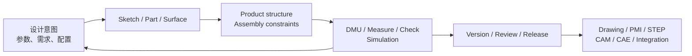
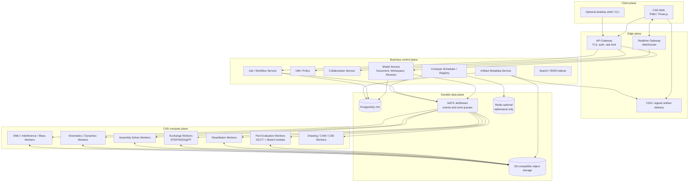
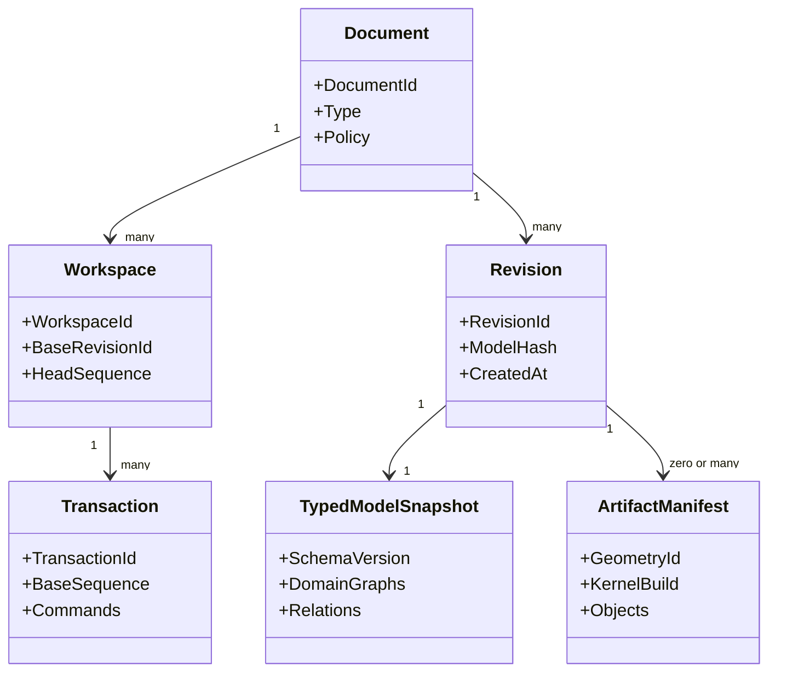

# 愿景、平台原则与逻辑边界

> 目标契约，不等于已交付能力。返回[目标架构目录](../../TARGET_ARCHITECTURE.md)；当前事实见[当前架构](../../CURRENT_ARCHITECTURE.md)，实施顺序只在[统一路线](../../../plans/README.md)维护。

## 1. 愿景与范围

occccad 的长期目标是一个开源、云原生、真正分布式的产品研发平台：在浏览器中完成参数化零件、复杂装配、工程表达与跨团队协作，并把精确 CAD 计算调度到可横向扩展的计算集群。CATIA 是能力广度和工程严谨性的参照，不是 UI 或内部实现的复制对象。

“真正分布式”在本项目中有可验证含义：

- 业务真相不依赖任一应用或 Worker 进程；
- 计算任务可在不同主机失败重试、迁移和重建；
- 大制品内容寻址、共享存储、就近缓存并通过 CDN/区域节点分发；
- 不同计算类型可以独立扩缩容、限流、升级和隔离；
- 文档版本、引用和命令在并发下具有明确一致性；
- 单机开发与集群生产使用相同领域契约，而不是两套产品。

它不意味着把每个领域类都做成微服务，也不意味着一次几何操作跨多台机器并行。B-Rep 内核通常更适合单任务单进程；分布式收益主要来自文档/零件/配置/仿真任务之间的并行、缓存复用和数据局部性。

## 1.1 目标产品工作流

平台最终应支持一条连续、可追溯的工程链：

- 设计者在个人或共享 Workspace 中以参数和约束表达意图，通过即时预览和权威求值获得诊断；
- 团队复用不可变 Part/Product Revision，通过 Publication、InstancePath 和配置构建产品，而不是复制几何；
- 工程人员执行碰撞、间隙、测量、运动学、基础动力学和后续 CAE/CAM，所有结果绑定明确输入快照；
- 评审者比较 Revision、批注、检查规则并形成不可变 Version/Release；
- 下游通过开放协议、制品和插件读取发布数据，不直接依赖 Worker 内存或私有数据库结构；
- 任一阶段的失败都提供可定位诊断、可恢复历史和可重现输入，不以静默修复掩盖设计问题。

## 1.2 产品级质量属性

| 属性 | 目标含义 |
|---|---|
| 正确性 | 参数意图、单位、拓扑引用和装配身份不因重算或调度位置静默改变 |
| 可重现 | 清空缓存后可由 Revision、依赖快照和 evaluator 版本重建语义等价结果 |
| 可解释 | 失败指出领域对象、原因、残差/证据和修复方向，而非只返回内核异常 |
| 可扩展 | 新 Feature/Worker/插件复用稳定契约，负载可按文档、零件、配置和任务横向扩展 |
| 可协作 | 历史追加、并发有明确冲突、Undo 不抹除他人工作、发布版本不可变 |
| 开放性 | 数据与协议不被单一云、对象存储、求解器或几何库类型锁定 |
| 安全性 | 多租户隔离、不可信输入沙箱、最小权限、审计和供应链可追踪 |
| 可演进 | 旧 Revision 可读，schema/evaluator 升级可并存、比较和迁移 |

## 2. 设计原则

1. **参数模型是源，几何是缓存**：Document Revision + Typed Model Snapshot + Parameters/Relations 可重放；B-Rep、Mesh、缩略图均可淘汰重建。
2. **粗粒度远程，细粒度本地**：RPC 表达“求值 Part Revision”而不是 `MakeEdge`；草图求解与 Part 重生成之间的高频循环留在同一 Worker。
3. **确定性优先**：GeometryId 包含规范化输入、内核/算法版本、单位和容差策略；同一输入应产生语义等价结果。
4. **不可变版本，显式 Workspace**：已发布 Revision 不修改；编辑发生在 Workspace/Branch，通过乐观并发提交。
5. **开放契约与可替换后端**：业务层不泄漏 OCCT、求解器或对象存储类型。
6. **按负载隔离，不按名词拆分**：CPU/内存/安全/延迟模型不同才拆 Worker；早期业务控制面保持模块化单体。
7. **至少一次 + 幂等**：跨服务消息不承诺魔法般的 exactly-once；命令、任务和制品写入用幂等键、事务 Outbox 与状态机保证效果唯一。
8. **安全默认**：所有导入文件和插件代码视为不可信；计算容器无特权、有限额、无默认外网。
9. **演进式开源**：候选库先过许可证、维护活跃度、格式兼容性、正确性与基准测试，不因“流行”直接引入。

## 3. 目标总体架构

这是逻辑边界，不要求第一天部署为十几个进程。Model、IAM、Job、Artifact Metadata 与 Realtime 先保持模块化控制面；Realtime、Scheduler 和计算子模块只在连接规模、资源或隔离证据满足时拆进程。图中的 NATS、Redis、Kubernetes 与独立 Worker 是条件性候选，不是引入依赖的授权或产品功能的前置条件。

## 4. 权威数据模型

## 4.1 聚合层级

- **Document**：稳定业务身份、所有权、生命周期和策略；
- **Document display name**：允许在同一作用域重复，只用于展示和搜索；持久引用、权限、版本和协作必须使用 `DocumentId`，创建端可以生成 `PartN`/`ProductN` 等可编辑默认名称但不得把它升级为唯一键；
- **Workspace/Branch**：可变编辑线，指向一个不可变基础 Revision；
- **Transaction**：用户认为原子的命令集合；
- **Revision**：不可变、可引用、可签名的模型快照；
- **Typed Model Snapshot**：按 Document 类型包含 Part Feature Graph、Product Structure、Drawing/Simulation setup 及其 Relation；
- **Product Structure**：实例图，引用确定的 Document/Revision 或显式 Follow-Head 策略；
- **Artifact Manifest**：计算产物清单，不能成为模型唯一来源。

ID 使用 UUIDv7/ULID 一类可排序业务 ID；内容使用 SHA-256/BLAKE3 等内容摘要。两者不能混用：RevisionId 代表业务身份，GeometryId 代表计算内容。

## 4.2 Feature Graph

Feature 不应继续编码为 `repeated RectangularPadSpec`。目标模型需要版本化的 typed node：

- 输入：参数、表达式、Sketch/Datum、上游 Feature 输出和外部 Revision 引用；
- 输出：Body/Shape/Datum/SelectionSet；
- 状态：Active、Suppressed、Failed、OutOfDate；
- 插件标识：`type_uri + schema_version + evaluator_version`；
- 依赖：显式 DAG，禁止隐藏读取当前 Worker 状态；
- 局部重生成：从变更节点计算 dirty subgraph，缓存未变输出。

表达式引擎应使用受限 AST、量纲类型和循环检测，不能远程执行任意脚本。内部统一 SI 或明确固定 mm/rad，并在每个协议字段携带/继承 units policy。
