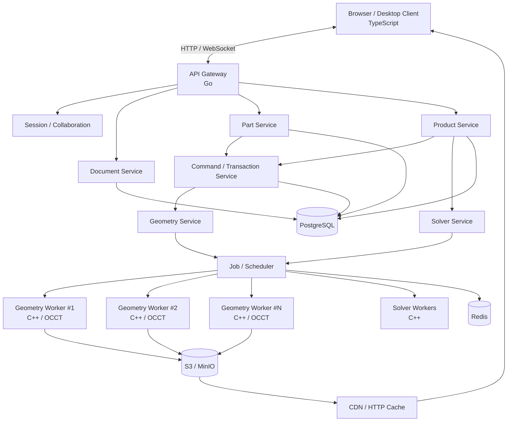
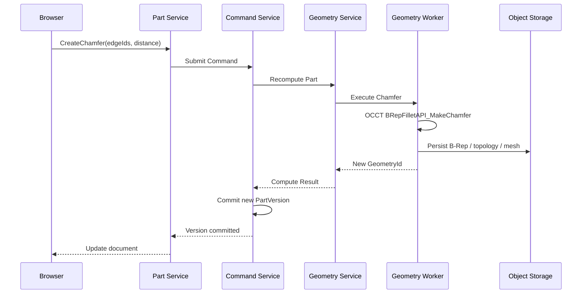
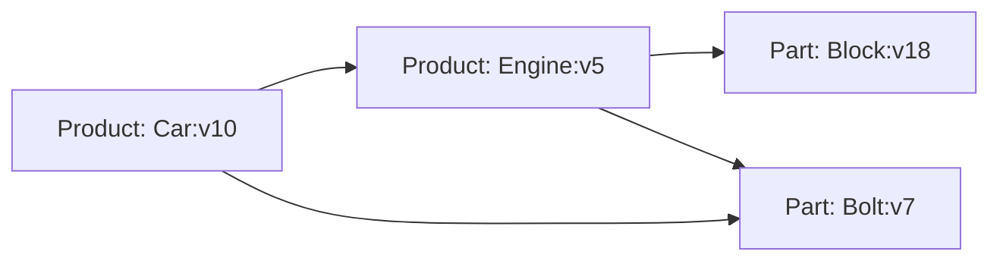
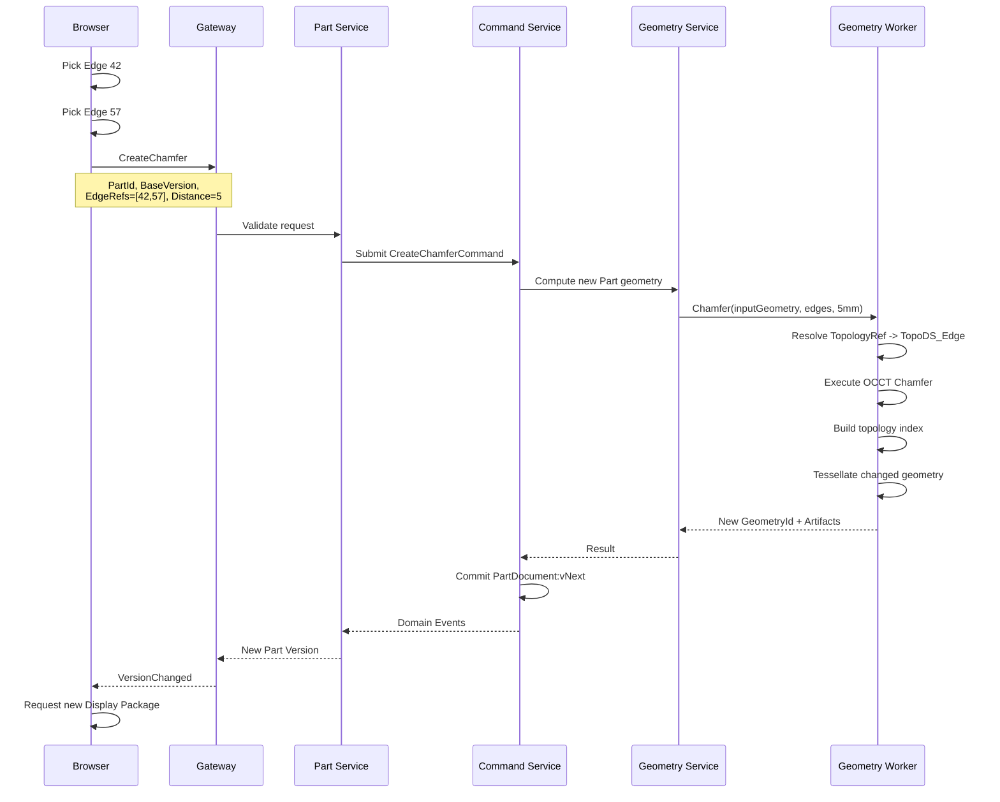
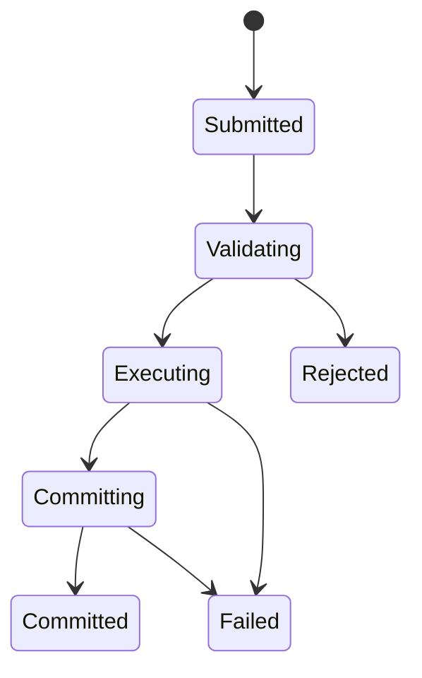

# occccad Architecture Specification

> **Status:** Draft v0.1  
> **Document Type:** Architecture Specification / Architecture Decision Baseline  
> **Target:** Open-source distributed cloud-native CAD platform  
> **Primary Kernel:** Open CASCADE Technology (OCCT)  
> **Implementation Status:** Target architecture; not a completed-feature list
> **Last Updated:** 2026-08-09

---

## 1. 文档目的

本文档定义 occccad 的总体架构、核心领域模型、分布式计算模型、前后端通信协议、几何内核抽象、产品装配模型、约束求解模型、命令与事务框架、版本与 Undo/Redo 机制，以及系统建议采用的技术栈。

项目名称统一为 **occccad**：`occ` 表示 OCCT 几何内核，`c` 取自 `could`，`cad` 表示项目所服务的 CAD 领域。历史临时名称不再使用。

本文描述的是**目标架构和决策基线**，不是当前实现清单。仓库已跑通 Demo 01：C++17/OCCT 7.9.1 Geometry Worker、gRPC、Go API、PostgreSQL 持久化、SHA-256 内容寻址、B-Rep/GLB 制品和浏览器多实例显示。通用建模、Undo/Redo、对象存储和分布式调度仍是后续内容。当前事实以 [文档索引](README.md)、[运行手册](occccad_Demo01_Runbook.md) 和 [开发环境规范](occccad_Development_Environment_and_CPP_Toolchain_v0.1.md) 为准。

occccad 的目标不是“把传统桌面 CAD 搬到浏览器”，也不是“给 OCCT 外面套一层 HTTP API”，而是构建一套真正面向云环境设计的 CAD 基础设施。

occccad 的核心定义为：

> **occccad 是一个以 Document Version 为状态、以 Command / Transaction 为变更协议、以 Reference Graph 为跨文档关联模型、以分布式 Worker 为计算执行层、以 B-Rep 为精确几何真相、以 Mesh/GLB 为可视化派生数据的云原生 CAD 系统。**

---

# 2. 设计目标

occccad 需要解决传统桌面 CAD 在云端场景中的几个根本问题：

1. 大型产品中大量重复部件导致的几何内存重复。
2. CAD Document、B-Rep、UI Session 与进程生命周期强绑定。
3. 单进程命令栈无法支持真正的跨服务 Undo/Redo。
4. Web 前端只有三角网格，缺少 Face / Edge / Vertex 等 B-Rep 拓扑语义。
5. 产品装配、零件建模、约束求解、网格生成全部耦合在同一进程。
6. 计算节点发生故障后难以无状态恢复。
7. 很难实现真正的多人协同、版本化、审计和 Command Replay。
8. 大型装配无法有效利用多节点 CPU、内存和缓存。
9. 传统 CAD API 往往是大量细粒度 C++ 对象调用，不适合网络 RPC。
10. CAD 内核与业务系统高度绑定，难以替换或扩展。

occccad 不要求每个对象对应一个微服务，也不以“服务数量”衡量分布式程度。

真正的分布式能力来自：

- 稳定的逻辑对象身份；
- 与物理节点解耦的引用关系；
- 完整的 Command/Transaction 框架；
- 可持久化、可重放的业务状态；
- 可迁移、可恢复的计算状态；
- 数据局部性感知的 Worker 调度；
- 可缓存和可重新生成的派生数据。

---

# 3. 核心设计原则

## 3.1 Document 是业务真相，Geometry 是计算结果

occccad 必须明确区分：

```text
Document != Geometry
Document != TopoDS_Shape
Document != Worker
```

Document 表示用户管理、编辑、版本化和引用的设计对象。

Geometry 表示某个 Document Version 计算得到的精确几何结果。

一个 Part Document 可以产生：

```text
PartDocument:v17
    |
    +-- FeatureModel
    |
    +-- GeometryRef --> GeometryId: sha256:...
                         |
                         +-- B-Rep
                         +-- Topology Index
                         +-- Tessellation
                         +-- GLB
                         +-- Edge Rendering Data
                         +-- Mass Properties
                         +-- Bounding Box
```

---

## 3.2 业务引用永远不能绑定 Worker

错误：

```text
Part A --> worker-7 / shapeHandle=18273
```

正确：

```text
Part A:v17
    |
    +--> GeometryId
            |
            +--> Runtime Placement
                    |
                    +--> worker-7
```

`WorkerId`、内存地址、`TopoDS_Shape` Handle 都属于运行时信息，不能进入持久化业务引用。

---

## 3.3 Worker 是计算资源容器，不是文档对象

一个 Geometry Worker 可以同时持有几十、几百甚至更多 Geometry Context。

```text
Geometry Worker #1
    Geometry A
    Geometry B
    Geometry C
    Geometry D

Geometry Worker #2
    Geometry E
    Geometry F
```

occccad 不采用：

```text
one part = one service
one document = one worker
```

---

## 3.4 计算移动到数据附近

禁止把 OCCT 对象包装为细粒度远程对象：

```text
RemoteTopoDS_Shape
RemoteTopoDS_Face
RemoteTopoDS_Edge
```

否则一个算法可能产生数十万次 RPC。

occccad 使用粗粒度 Geometry API：

```text
AnalyzeFaces
GetTopologyBatch
ComputeDistance
ComputeInterference
CreateFillet
CreateChamfer
Tessellate
FindMateCandidates
```

原则：

> **Move computation to data, not data to computation.**

---

## 3.5 精确模型与显示模型分离

B-Rep 是精确几何真相。

GLB / Mesh 是显示派生数据。

```text
B-Rep
  |
  +--> Tessellation
          |
          +--> GLB
          +--> LOD
          +--> Picking Metadata
          +--> Edge Render Data
```

浏览器不通过 GLB 反推精确 B-Rep。

---

## 3.6 Command 是唯一业务变更入口

所有改变 Document 状态的操作必须表达为 Command。

例如：

```text
CreateSketch
ModifyParameter
CreateExtrude
CreateFillet
CreateChamfer

InsertInstance
RemoveInstance
ReplaceReference
SetTransform

AddConstraint
DeleteConstraint
SuppressConstraint
```

Service 不允许绕过 Command Framework 任意修改核心业务状态。

---

## 3.7 Transaction 定义用户语义上的原子操作

一次用户操作可以触发多个 Command 和多个 Worker。

例如：

```text
TX-1001 "Insert gearbox"

    InsertInstance
    AddConcentricConstraint
    AddCoincidentConstraint
    SolveProduct
    CommitProductVersion
```

Undo 针对 Transaction，而不是某个 Worker 的函数调用历史。

---

## 3.8 Worker 计算状态必须可恢复

Worker 崩溃不能造成 Document 历史丢失。

持久化的是：

```text
Document
DocumentVersion
FeatureModel
ProductStructure
ConstraintGraph
Command
Transaction
Reference
Geometry Artifact
```

Worker 内存中的：

```text
TopoDS_Shape
BVH
Topology cache
Mesh cache
Solver temporary state
```

都允许重新加载或重新计算。

---

# 4. 系统总体架构



系统逻辑上分为两大平面。

## 4.1 Control Plane

负责 CAD 世界的业务真相：

- Document；
- Version；
- Part Model；
- Product Structure；
- Constraint；
- Reference；
- Command；
- Transaction；
- Undo / Redo；
- 权限；
- 协作；
- Job 调度。

核心实现建议使用 **Go**。

---

## 4.2 Compute Plane

负责消耗 CPU、内存或 GPU 的计算：

- OCCT B-Rep；
- Feature Regeneration；
- Boolean；
- Fillet / Chamfer；
- Tessellation；
- Geometry Query；
- Constraint Solve；
- Interference；
- Import / Export；
- 大规模派生计算。

核心几何计算使用 **C++ + OCCT**。

---

# 5. 技术选型

## 5.1 前端

建议：

```text
TypeScript
React
Three.js
WebGL2 / WebGPU（逐步引入）
Protocol Buffers
WebSocket
HTTP/2 / HTTP/3
```

Three.js 主要承担 Scene Graph 和显示层。

不应把 Three.js Object3D 当成 CAD Domain Object。

推荐逻辑分层：

```text
UI Layer
    |
CAD Interaction Layer
    |
Selection / Tool Framework
    |
Topology Client
    |
Scene / Rendering Layer
    |
Three.js / WebGPU
```

---

## 5.2 云端业务服务

建议：

```text
Go
gRPC
Protocol Buffers
PostgreSQL
Redis
S3 / MinIO
```

Go 负责：

- Gateway；
- Document；
- Part orchestration；
- Product；
- Command；
- Transaction；
- Reference；
- Scheduler；
- Worker Registry；
- WebSocket Session。

---

## 5.3 CAD Compute

当前仓库基线与目标组件：

```text
C++17（当前；未来升级需回归验证）
OCCT 7.9.1（当前）
gRPC 1.71（当前）
Protocol Buffers 5.27（当前）
Conan 2
CMake
```

核心依赖通过 Kernel Adapter 隔离。

```cpp
class ICadKernel {
public:
    virtual GeometryResult tessellate(...) = 0;
    virtual GeometryResult fillet(...) = 0;
    virtual GeometryResult chamfer(...) = 0;
    virtual GeometryResult booleanCut(...) = 0;
    virtual TopologyResult analyzeTopology(...) = 0;
};
```

第一实现：

```text
OcctKernel
```

未来允许：

```text
ParasolidKernel
CGMKernel
```

---

# 6. Domain Model

occccad 第一阶段定义两类主要 Document：

```text
Document
    |
    +-- PartDocument
    |
    +-- ProductDocument
```

未来允许扩展：

```text
DrawingDocument
SimulationDocument
ManufacturingDocument
MeshDocument
```

---

# 7. Document Model

建议核心对象：

```protobuf
message Document {
    string id = 1;
    DocumentType type = 2;
    string name = 3;
    uint64 current_version = 4;
}
```

Document 是稳定身份。

DocumentVersion 是不可变历史状态。

```protobuf
message DocumentVersion {
    string document_id = 1;
    uint64 version = 2;
    string parent_version_id = 3;
    string content_ref = 4;
    string geometry_ref = 5;
}
```

---

# 8. Part Document

Part 表示可参数化、可重生成的零件。

```text
PartDocument
    |
    +-- Parameters
    +-- Feature Tree
    +-- Sketches
    +-- Expressions
    +-- Body
    +-- Material
    +-- Result GeometryRef
```

Part Service 负责业务规则，Geometry Worker 负责实际 OCCT 计算。

典型调用：



---

# 9. Product Document

“装配”在 occccad 中正式称为 **Product**。

Product 不直接拥有 B-Rep，它主要保存实例和引用关系。

```text
ProductDocument
    |
    +-- Product Tree
    +-- Instance
    +-- Transform
    +-- Constraint
    +-- Configuration
    +-- Suppression
    +-- Instance Properties
```

Instance：

```protobuf
message ProductInstance {
    string instance_id = 1;
    DocumentRef reference = 2;
    Transform transform = 3;
}
```

其中 `reference` 可以指向 Part，也可以指向 Product。

因此天然支持：

```text
Car Product
    |
    +-- Body Part
    +-- Chassis Product
    +-- Engine Product
            |
            +-- Block Part
            +-- Crankshaft Part
```

---

# 10. Reference Graph

跨文档关系形成 Reference Graph。



业务引用：

```text
DocumentRef
    document_id
    version policy
```

版本策略至少支持：

```text
PinnedVersion
LatestReleased
WorkspaceHead
BranchHead
```

Demo 02 已实现其中两种策略：`FOLLOW_HEAD` 对应 `WorkspaceHead`，`PINNED` 对应
`PinnedVersion`。每条 Product Instance 引用边独立保存策略；缺少策略字段的历史数据按
`FOLLOW_HEAD` 兼容读取。

更新边界如下：

```text
被引用 Document 的编辑 / Undo / Redo
    -> 只移动被引用 Document 的 Head
    -> FOLLOW_HEAD 父项在下次读取时递归解析新 Head
    -> PINNED 父项继续解析已保存的不可变 Version
    -> 不自动生成父 Product Version
```

父 Product Version 只在其直接结构发生用户命令时产生，例如插入实例、移动实例或改变引用
策略。动态解析结果属于派生视图，不写回父快照；父 Product 的 Undo/Redo 也只恢复父快照，
不能跨文档撤销子 Part/Product 的命令。该边界避免一次 Part 编辑沿反向引用图制造大量隐式
版本，同时允许设计态装配自动更新；发布态应使用 `PINNED` 获得可复现结果。

---

# 11. Geometry Identity

推荐使用 Content Addressable Geometry。

```text
GeometryId = SHA-256(canonical B-Rep or canonical geometry artifact)
```

GeometryId 稳定表示几何内容。

同样的几何只需要存储一次。

```text
Part A:v7 ------\
                 --> Geometry abc123
Part A:v8 ------/
```

或者多个文档产生相同几何：

```text
Part A:v9 ---\
              --> Geometry def456
Part B:v3 ---/
```

---

# 12. Geometry Worker

Geometry Worker 是长期运行的 C++ 计算进程。

内部包含：

```text
GeometryWorker

    Geometry Context Manager
    |
    +-- GeometryId A
    |      +-- TopoDS_Shape
    |      +-- Topology Index
    |      +-- Bounding Volume
    |
    +-- GeometryId B
    |
    +-- GeometryId C

    OCCT Kernel Adapter
    Memory Manager
    LRU Cache
    RPC Server
```

一个 Worker 同时管理多个几何对象。

Worker Registry 保存：

```text
GeometryId -> Runtime Placement
```

但这一映射不能成为业务数据。

---

# 13. Geometry Placement

Geometry 可能处于：

```text
UNLOADED
LOADING
RESIDENT
EVICTING
FAILED
```

Scheduler 根据：

- Geometry locality；
- RAM；
- CPU；
- Worker load；
- operation capability；
- input size；

选择计算节点。

跨 Geometry 操作：

```text
Boolean(A, B)
```

如果 A 和 B 位于不同 Worker，不采用远程 Face/Edge 调用。

Scheduler 选择一个执行节点，并把较小输入临时复制到该节点。

---

# 14. 前端 CAD Geometry Framework

这是 occccad 与普通 Web 3D Viewer 的核心区别之一。

传统方案：

```text
B-Rep
  |
  v
GLB
  |
  v
Triangle Mesh
```

浏览器只知道 Triangle，因此无法可靠表达：

- Face；
- Edge；
- Vertex；
- Cylinder；
- Plane；
- Axis；
- CAD Feature。

occccad 前端必须同时存在：

```text
Visualization Model
+
Topology Model
```

---

# 15. CAD Display Package

服务器生成的显示数据不应只有 `.glb`。

建议定义一个逻辑上的：

```text
CAD Display Package
```

包含：

```text
Manifest
Mesh / GLB
Topology Metadata
Face Mapping
Edge Geometry
Vertex Geometry
LOD Metadata
Selection Metadata
```

例如：

```text
geometry/abc123/
    manifest.pb
    mesh-lod0.glb
    mesh-lod1.glb
    topology.pb
    edges.bin
```

实际部署时这些对象可独立存储于 S3/MinIO，并由 CDN 提供。

---

# 16. Face Picking

服务端 Tessellation 时必须保留：

```text
Triangle -> Topological FaceId
```

最简单 V1 可以按 Face 分 primitive。

例如 GLB：

```text
Primitive 0 -> FaceId=18
Primitive 1 -> FaceId=19
```

但大型模型 Primitive 数量可能过多。

更高效方案是建立：

```text
TriangleRange -> FaceId
```

或者 GPU Picking Buffer：

```text
RenderObjectId
FaceId
InstanceId
```

用户点击一个三角形后得到：

```text
Document / Instance
GeometryId
TopologyId
Type = FACE
```

而不是只有 Three.js mesh index。

---

# 17. Edge Rendering

GLB 本身通常无法满足 CAD 边线语义。

occccad 单独生成 Edge Representation。

服务端基于 B-Rep Edge tessellate 为 Polyline：

```text
TopoDS_Edge
    |
    v
Adaptive Polyline
    |
    v
edges.bin
```

Edge 数据：

```protobuf
message RenderEdge {
    uint64 topology_id = 1;
    repeated Vec3 points = 2;
    EdgeClass edge_class = 3;
}
```

EdgeClass 可以包括：

```text
SHARP
SMOOTH
BOUNDARY
SEAM
CONSTRUCTION
```

客户端将边线作为独立 Rendering Layer。

---

# 18. Topology Identity

前端能够选择 Edge 并向后端发送 Fillet/Chamfer Command 的前提是：

> Edge 必须拥有稳定的 CAD Topology Identity。

不能使用：

```text
TopoDS_Edge memory address
array index
GLB primitive index
```

作为持久化 ID。

V1 可以对每次 Geometry Version 建立：

```text
GeometryScopedTopologyId
```

例如：

```text
Geometry abc123
    Face 1
    Face 2
    Edge 1
    Edge 2
```

用户选择：

```protobuf
message TopologyRef {
    string geometry_id = 1;
    TopologyType type = 2;
    uint64 local_id = 3;
}
```

但 Feature 修改后拓扑可能改变，因此长期需要实现 **Topological Naming / Persistent Naming**。

这是 occccad 的核心研究问题之一，应独立形成 RFC。

---

# 19. 用户选择两条边创建倒角的完整流程

例如用户希望选择 Edge 42 和 Edge 57，然后创建 5 mm Chamfer。



这条链路体现了一个核心原则：

> **前端操作 CAD 语义对象，后端解析为精确 B-Rep；前端不操作 OCCT 对象。**

---

# 20. Incremental Visualization

每次修改一个倒角都重新下载整个 GLB 对大型模型不合适。

长期应支持：

```text
Geometry Diff
Topology Diff
Mesh Diff
```

例如：

```protobuf
message GeometryDisplayDelta {
    repeated FaceId removed_faces;
    repeated FaceMesh added_or_changed_faces;
    repeated EdgeId removed_edges;
    repeated RenderEdge added_or_changed_edges;
}
```

V1 可以先实现：

```text
new GeometryVersion -> reload part GLB
```

之后逐步优化为局部 patch。

---

# 21. Command Framework

Command 表示用户意图。

```protobuf
message CommandEnvelope {
    string command_id = 1;
    string transaction_id = 2;
    string document_id = 3;
    uint64 base_version = 4;
    string command_type = 5;
    bytes payload = 6;
}
```

Command 生命周期：



核心约束：

- Command 必须幂等；
- Command 必须带 `base_version`；
- Command 不能包含 Worker 地址；
- Command payload 必须使用领域 ID；
- Commit 前计算结果不可见。

---

# 22. Transaction Framework

Transaction 是用户语义操作边界。

```text
Transaction
    |
    +-- Command 1
    +-- Command 2
    +-- Command 3
```

例如一次 Product 插入：

```text
TX-92831

InsertInstance
AddConstraint
AddConstraint
SolveProduct
CommitProductVersion
```

整个 Transaction 要么成功 Commit，要么保持旧 Document State。

对于长时间计算，不建议使用数据库长事务。

采用：

```text
Optimistic concurrency
+
Staged compute
+
Atomic metadata commit
```

---

# 23. Version Model

每次成功事务生成新的 DocumentVersion。

```text
Part:v17
    |
    +-- Command
    v
Part:v18
```

DocumentVersion 推荐不可变。

```text
document_id
version
parent_version
content_hash
geometry_id
transaction_id
created_at
```

---

# 24. Undo / Redo

Undo 不属于 OCC Worker。

Undo 属于 Command/Transaction 层。

单用户场景可以理解为历史状态切换；多人协同下，推荐采用补偿 Command。

例如：

```text
v17
 |
 | Modify radius 8 -> 10
 v
v18
 |
 | Revert TX-100
 v
v19
```

因此历史保持 append-only。

优势：

- 审计；
- Replay；
- 多人协作；
- AI 操作可追踪；
- Macro；
- Debug；
- 崩溃恢复。

---

# 25. Event Model

成功 Commit 后产生 Domain Event。

例如：

```text
DocumentVersionCreated
PartGeometryChanged
ProductStructureChanged
ConstraintChanged
ReferenceChanged
DisplayArtifactReady
```

事件可驱动：

- 产品刷新；
- 缓存失效；
- Mesh 生成；
- 搜索索引；
- 协同广播；
- 缩略图生成。

V1 可采用 PostgreSQL Outbox Pattern，避免一开始引入 Kafka。

后期规模增大再引入：

```text
NATS / Kafka
```

---

# 26. Constraint Solver

Product 约束求解与 OCCT Geometry Compute 是不同类型的计算。

建议独立：

```text
Solver Service
Solver Worker
```

约束模型：

```text
Constraint Graph

Instance Node
    |
Constraint Edge
    |
Instance Node
```

约束示例：

```text
Coincident
Concentric
Parallel
Perpendicular
Distance
Angle
Fixed
Rigid
Tangent
```

---

# 27. Geometry 与 Solver 解耦

Solver 不应该长期拥有 B-Rep。

Solver 获取约束所需的最小几何语义：

```text
Plane
Axis
Point
Cylinder
Cone
Direction
Distance
```

例如：

```text
Face 18
  type = CYLINDER
  axis = ...
  radius = 10

Face 55
  type = PLANE
  origin = ...
  normal = ...
```

Geometry Service 提供批量接口：

```text
ResolveConstraintGeometry(topologyRefs[])
```

这样 Solver 处理数学约束，而 Geometry Worker 处理 B-Rep。

---

# 28. Solver Interface

建议：

```protobuf
service SolverService {
    rpc SolveProduct(SolveProductRequest)
        returns (SolveProductResult);
}
```

输入：

```text
Product state
Instance transforms
Constraint graph
Resolved geometry descriptors
Drag hint / fixed instance
```

输出：

```text
Solved transforms
Constraint statuses
Degrees of freedom
Conflicts
Diagnostics
```

---

# 29. Solver 技术路线

V1 推荐分阶段实现。

第一阶段不追求完整商业 CAD DCM 能力。

先支持：

```text
Fixed
Coincident plane-plane
Concentric cylinder-cylinder
Distance
Parallel
Perpendicular
Angle
```

可以考虑：

- 自研基于 SE(3) 参数化的非线性求解；
- Eigen；
- Ceres Solver；
- Levenberg-Marquardt / Trust Region。

求解器应通过接口隔离：

```cpp
class IConstraintSolver {
public:
    virtual SolveResult solve(const SolveProblem&) = 0;
};
```

未来允许引入其他商业或开源 solver。

---

# 30. Drag Solve

交互拖拽属于高频暂态计算，不应每个 mousemove 都生成永久 DocumentVersion。

需要区分：

```text
Transient Command
Committed Command
```

拖拽过程：

```text
BeginDrag
UpdateDrag*
PreviewSolve*
EndDrag
CommitTransform
```

只有 `EndDrag / Commit` 进入正式 Transaction。

---

# 31. Collaboration

多人编辑必须基于 Document Version 和 Command。

基本并发控制：

```text
Command
    base_version = 17

Current document version = 18
```

此时可以：

```text
reject + client rebase
```

V1 建议采用 optimistic locking。

后期可针对不同领域引入更细粒度策略。

不建议直接把 CAD 核心状态使用通用 CRDT 表达，因为 Feature Tree、Topology、Constraint Solve 具有复杂不变量。

---

# 32. Storage Architecture

## PostgreSQL

保存：

```text
Document
DocumentVersion
Reference
Command
Transaction
Product Structure
Feature Model Metadata
Constraint
Permissions
Job metadata
```

---

## S3 / MinIO

保存大对象：

```text
B-Rep
STEP
GLB
Mesh
Edge Render Data
Topology Packages
Thumbnail
Import/Export files
```

---

## Redis

用于短期运行时信息：

```text
Worker registry
Geometry placement
Job leases
Distributed cache
Session state
Rate limit
```

Redis 不是长期 CAD Source of Truth。

---

# 33. CDN

GLB、Mesh、Topology Display Package 等不可变资源适合：

```text
Content Hash URL
+
Cache-Control: immutable
+
CDN
```

例如：

```text
/artifacts/sha256/abc123/mesh-lod1.glb
```

浏览器和 CDN 可以长期缓存。

因此多个 Product 引用同一个 Part 时，同一份 GLB 不需要重复从业务服务器传输。

---

# 34. Network Protocol

推荐：

## Browser -> Cloud

```text
HTTPS REST / Connect style API
WebSocket
HTTP/2
HTTP/3（未来）
```

WebSocket 主要传：

```text
Document Events
Collaboration Events
Job Progress
Transient Interaction
```

大型 GLB 不走 WebSocket，应走 Object Storage/CDN HTTP。

---

## Internal Services

```text
gRPC + Protobuf
```

原因：

- Go/C++ 跨语言成熟；
- HTTP/2 multiplexing；
- streaming；
- 强类型 IDL；
- 代码生成；
- 易于版本管理。

---

# 35. API 粒度

内部 Geometry RPC 必须粗粒度。

错误：

```text
GetFace
GetSurface
GetNormal
GetCurve
GetVertex
...
```

每一步跨 RPC。

正确：

```text
AnalyzeTopology
ResolveSelectionGeometry
CreateFillet
ComputeInterference
Tessellate
GetConstraintGeometryBatch
```

---

# 36. Kernel Boundary

OCCT 类型只允许存在于 Kernel / Worker 边界内部。

推荐代码规则：

```text
kernel/occt/*
worker/geometry/*
```

允许：

```cpp
TopoDS_Shape
TopoDS_Face
BRepAlgoAPI_*
BRepFilletAPI_*
XCAFDoc_*
```

其他业务模块禁止包含 OCCT Header。

---

# 37. OCAF / XDE 的定位

可以使用 OCAF/XDE 辅助：

- STEP/XCAF import/export；
- Attribute；
- Shape Organization；
- Exchange。

但 OCAF 不作为 occccad 全局 Domain Model。

系统不能把：

```text
TDF_Label
```

泄漏到：

```text
Document Service
Part Service
Product Service
Frontend Protocol
```

OCAF 属于 OCCT Adapter 内部实现。

---

# 38. Feature Framework

Feature 是 Part Domain Object，而不是 `BRepAlgoAPI` 调用记录。

```text
Feature
    id
    type
    parameters
    references
    status
```

例如：

```text
ChamferFeature
    distance = 5 mm
    edges = [
        PersistentTopologyRef(...)
    ]
```

Feature Tree：

```text
Sketch001
    |
Pad001
    |
Hole001
    |
Chamfer001
```

Geometry Worker 根据 Feature Model 重生成 Geometry。

---

# 39. Persistent Topological Naming

这是参数化 CAD 的核心难题。

例如：

```text
Chamfer001 references Edge42
```

上游 Pad 修改后：

```text
Edge42
```

可能不再是同一个拓扑对象。

因此需要独立设计：

```text
PersistentTopologyRef
```

V1 可先采用 Geometry Scoped IDs，功能限制明确。

V2 应实现混合 Persistent Naming：

```text
Feature provenance
Geometric signature
Topological neighborhood
History mapping
Fallback matching
```

这是后续必须单独形成 RFC 的核心模块。

---

# 40. Product Geometry

Product Document 本身不生成一个巨大的 `TopoDS_Compound` 作为常驻状态。

正常显示使用：

```text
Instance
    DocumentRef
    Transform
```

前端进行 instancing。

只有特定操作：

```text
Export STEP
Interference
Envelope
Mass property
Section whole product
```

才按需构建跨部件计算任务。

---

# 41. Product 大型装配优化

大型 Product：

```text
100,000 Instances
3,000 Unique Parts
```

浏览器和服务端都应利用：

```text
Unique Geometry
+
Instance Transform
```

而不是 100,000 份 Mesh。

前端建议使用：

```text
InstancedMesh
GPU instancing
Hierarchical culling
LOD
Frustum culling
Optional occlusion culling
```

---

# 42. Scheduler

Scheduler 负责：

```text
Geometry placement
Job scheduling
Worker capability matching
Locality
Retry
Timeout
Cancellation
```

Worker 注册 Capability：

```json
{
  "workerId": "geometry-17",
  "capabilities": [
    "brep",
    "boolean",
    "fillet",
    "tessellation"
  ]
}
```

未来 GPU Worker：

```text
gpu-tessellation
raytracing
thumbnail
```

---

# 43. Worker Failure

Worker 心跳失效：

```text
Geometry A -> worker-7
```

变成：

```text
Geometry A -> UNLOADED
```

下次请求：

```text
Object Storage
   |
   v
worker-12 hydrate
```

Command、DocumentVersion 和 Transaction 不受影响。

---

# 44. Job System

耗时任务使用 Job：

```text
Import STEP
Export STEP
Huge Boolean
Full Product Interference
Tessellation
Thumbnail
Mass Product Recompute
```

Job 状态：

```text
QUEUED
RUNNING
SUCCEEDED
FAILED
CANCELED
```

Job 与 Command 不完全等价。

Command 是业务意图。

Job 是计算执行单元。

---

# 45. Security Boundary

浏览器永远不能直接访问内部 Geometry Worker。

路径：

```text
Browser
    |
Gateway
    |
Domain Service
    |
Geometry/Solver Service
    |
Worker
```

Object Storage 可通过短期 Signed URL 或 CDN Token 提供大型 Artifact。

---

# 46. Observability

所有请求统一携带：

```text
trace_id
command_id
transaction_id
document_id
job_id
```

推荐：

```text
OpenTelemetry
Prometheus
Grafana
Loki / OpenSearch
```

核心指标：

```text
Worker RAM
Resident Geometry Count
Geometry Load Latency
OCCT Operation Latency
Tessellation Latency
Solver Iterations
Command Commit Latency
Cache Hit Rate
Artifact CDN Hit Rate
```

---

# 47. Repository Layout

推荐 Monorepo：

```text
occccad/

├── docs/
│   ├── architecture/
│   └── rfcs/
│
├── proto/
│   ├── common.proto
│   ├── document.proto
│   ├── command.proto
│   ├── part.proto
│   ├── product.proto
│   ├── geometry.proto
│   ├── topology.proto
│   ├── solver.proto
│   └── worker.proto
│
├── services/
│   ├── gateway/
│   ├── document/
│   ├── command/
│   ├── part/
│   ├── product/
│   ├── geometry-router/
│   ├── solver/
│   ├── scheduler/
│   └── registry/
│
├── workers/
│   ├── geometry/
│   ├── solver/
│   └── converter/
│
├── kernel/
│   ├── api/
│   ├── occt/
│   └── algorithms/
│
├── web/
│   ├── cad-core/
│   ├── topology/
│   ├── selection/
│   ├── tools/
│   ├── renderer/
│   └── app/
│
├── sdk/
│   ├── cpp/
│   ├── go/
│   └── typescript/
│
└── deploy/
    ├── docker-compose/
    └── kubernetes/
```

---

# 48. V1 Deployment

第一阶段不急于 Kubernetes。

推荐：

```text
Docker Compose

PostgreSQL
Redis
MinIO

occccad-gateway
occccad-document
occccad-command
occccad-part
occccad-product
occccad-scheduler

occccad-geometry-worker x N
occccad-solver-worker x N
```

首先验证：

```text
Document
Command
Reference
Geometry Placement
Topology Picking
Fillet/Chamfer
Product Constraint
Undo/Redo
```

而不是先投入大量基础设施工作。

---

# 49. V1 MVP

第一阶段建议定义一个很小但贯穿整个架构的 Vertical Slice。

## Part

支持：

```text
Import STEP
Display
Face Selection
Edge Selection
Create Chamfer
Create Fillet
Undo
Redo
Save Version
```

## Product

支持：

```text
Create Product
Insert Part
Insert Product
Set Transform
Plane Coincident Constraint
Cylinder Concentric Constraint
Solve
Undo
Redo
```

## Distributed Runtime

支持：

```text
2+ Geometry Workers
Geometry placement
Worker failure reload
Multiple documents per worker
Content-addressed artifacts
```

---

# 50. MVP 验收场景

最重要的端到端测试：

```text
1. 导入 Part A。
2. Geometry Worker #1 加载 A。
3. 浏览器获得 GLB + Topology Data。
4. 用户选择两个 Edge。
5. 创建 Chamfer Command。
6. 生成 Part A:v2。
7. Product P 引用 Part A:v2。
8. Product 中加入 Part B。
9. 用户选择两个 Cylinder Face。
10. 创建 Concentric Constraint。
11. Solver Worker 求解 Transform。
12. Product P:v2 Commit。
13. 用户 Undo。
14. Product 恢复上一业务状态。
15. 用户 Undo Part Chamfer。
16. 系统通过 Command/Transaction 创建 Revert Version。
17. Geometry Worker #1 被强制终止。
18. Scheduler 在 Worker #2 重新 hydrate Geometry。
19. 用户继续进行 Fillet 操作。
```

如果这条链路成立，occccad 的核心架构即得到验证。

---

# 51. 后续 RFC

主规格不应该无限扩张，以下主题需要独立 RFC：

```text
RFC-0001 Document and Version Model
RFC-0002 Command and Transaction Framework
RFC-0003 Reference Graph
RFC-0004 Geometry Identity and Artifact Storage
RFC-0005 Geometry Worker Runtime
RFC-0006 Geometry Scheduling and Locality
RFC-0007 CAD Display Package
RFC-0008 Web Topology Picking
RFC-0009 Persistent Topological Naming
RFC-0010 Feature Framework
RFC-0011 Product Structure
RFC-0012 Constraint Model
RFC-0013 Constraint Solver
RFC-0014 Drag / Interactive Solve
RFC-0015 Global Undo / Redo
RFC-0016 Collaboration and Concurrency
RFC-0017 Geometry Diff / Incremental Display
RFC-0018 STEP / XCAF Import Export
RFC-0019 Plugin Architecture
RFC-0020 AI / MCP Command Integration
```

---

# 52. 架构红线

以下设计原则原则上不可违反：

1. `TopoDS_Shape` 不跨 Worker RPC 边界。
2. 业务对象不保存 Worker 地址。
3. Worker 不是 Document 的唯一真相来源。
4. Product Structure 不使用 `TopoDS_Compound` 作为业务模型。
5. GLB 不是 CAD 精确模型。
6. 前端必须具有独立 Topology Model。
7. 所有持久化修改必须经过 Command。
8. Undo/Redo 不调用 Worker Undo Stack。
9. Redis 不作为永久 CAD Source of Truth。
10. OCCT 类型不能污染 Domain Service。
11. 大文件不通过 WebSocket 传输。
12. Geometry Worker 必须支持多 Geometry。
13. Worker 崩溃不能导致 Document 状态丢失。
14. Geometry RPC 必须以粗粒度计算为主。
15. Document Version 默认不可变。

---

# 53. 总结

occccad 不是由大量微服务组成的 CAD Server。

它的核心结构是：

```text
                    CAD DOMAIN

Document
   |
DocumentVersion
   |
Command / Transaction
   |
Reference Graph
   |
Part / Product Domain
   |
--------------------------------
        Compute Boundary
--------------------------------
   |
Geometry / Solver Request
   |
Scheduler
   |
Distributed Workers
   |
OCCT / Constraint Solver
   |
Artifacts
   |
B-Rep / GLB / Topology / Edge
```

最终系统应满足：

> **业务状态与计算节点解耦。**

> **精确几何与显示数据解耦。**

> **Document 与 Geometry 解耦。**

> **产品结构与 B-Rep 解耦。**

> **命令历史与 Worker 生命周期解耦。**

> **逻辑引用与物理部署解耦。**

因此，即使所有 Geometry Worker 被重新调度、某个服务宕机、某个 Geometry 被从 RAM 淘汰，Document、Version、Command、Reference 和 Transaction 所描述的 CAD 世界仍然完整。

这才是 occccad 所追求的真正分布式 CAD 架构。

---

## Appendix A — 核心术语

| 术语 | 定义 |
|---|---|
| Document | 用户可管理、版本化、引用的 CAD 业务对象 |
| Part | 具有 Feature / Geometry 的零件 Document |
| Product | 包含 Instance / Constraint 的产品 Document |
| DocumentVersion | Document 的不可变历史状态 |
| GeometryId | 精确几何内容的稳定身份 |
| GeometryRef | DocumentVersion 对 Geometry 的引用 |
| DocumentRef | 一个 Document 对另一个 Document 的引用 |
| Instance | Product 中对 Part/Product 的一次 occurrence |
| Command | 对 CAD 业务状态的修改意图 |
| Transaction | 一次用户级原子业务操作 |
| Domain Event | 成功状态变化后的事实通知 |
| Geometry Worker | 执行 OCCT 几何计算的进程 |
| Solver Worker | 执行产品约束求解的进程 |
| Artifact | B-Rep、GLB、Mesh 等派生/持久化计算结果 |
| TopologyRef | 对 Face/Edge/Vertex 等拓扑元素的逻辑引用 |
| Display Package | Web CAD 显示所需 Mesh + Topology + Edge 数据集合 |

---

## Appendix B — 初始技术栈

| 层 | 推荐技术 |
|---|---|
| Web UI | TypeScript + React |
| Rendering | Three.js，后续可引入 WebGPU |
| Browser transport | HTTPS + WebSocket |
| Static CAD Artifacts | HTTP/2/HTTP/3 + CDN |
| Backend | Go |
| Internal RPC | gRPC + Protobuf |
| Geometry Compute | C++17 + OCCT 7.9.1（当前基线；可按升级规则演进） |
| Constraint Solve | C++ + Eigen/Ceres 或自研 |
| Relational Storage | PostgreSQL |
| Runtime Cache | Redis |
| Object Storage | MinIO / S3 |
| Build C++ | CMake + Conan 2 |
| Container | Docker |
| Orchestration | Docker Compose -> Kubernetes |
| Observability | OpenTelemetry + Prometheus + Grafana |

---

**End of occccad Architecture Specification v0.1**
