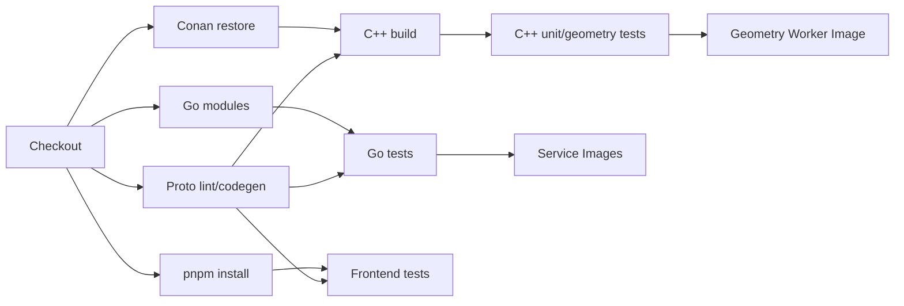

# occccad Development Environment & C++ Toolchain Specification

> **Status:** Draft v0.1  
> **Parent:** occccad Architecture Specification  
> **Primary Platform:** Ubuntu 24.04 LTS / WSL2 Ubuntu 24.04 LTS  
> **CAD Kernel:** Open CASCADE Technology (OCCT)  
> **Last Updated:** 2026-08-07

---

# 1. 文档目的

本文档定义 occccad 项目的基础开发环境、构建工具链、C++ 包管理策略、跨语言开发工具链、基础设施依赖以及本地开发工作流。

目标不是给出一套“某台电脑能编译”的命令，而是建立一套能够长期支撑 occccad 分布式架构的工程基线，使以下环境尽量保持一致：

```text
Developer Workstation
        |
        +-- Native Ubuntu
        +-- WSL2 Ubuntu
        +-- CI Runner
        +-- Docker Builder
        +-- Geometry Worker Runtime
```

核心目标：

1. 开发机和 CI 使用一致的 C++ 依赖版本；
2. Geometry Worker 不依赖宿主机随机安装的 OCCT；
3. C++ ABI 可控；
4. Debug / Release 可重复构建；
5. gRPC / Protobuf 的 C++、Go、TypeScript 代码生成版本可控；
6. 本地开发不强制依赖 Kubernetes；
7. 一条命令可以构建核心 C++ 模块；
8. 一条命令可以启动基础 occccad 依赖；
9. 后续能够自然迁移到 CI/CD 和 Kubernetes；
10. 避免“在我的机器上能编译”的环境漂移。

---

# 2. 总体工程原则

## 2.1 系统包只负责基础工具

APT 主要用于安装：

```text
compiler
git
python
ninja
pkg-config
debugger
Docker prerequisites
```

occccad 核心 C++ 库不应依赖系统仓库随机版本：

```text
OCCT
gRPC
Protobuf
Eigen
Ceres
fmt
spdlog
GoogleTest
Google Benchmark
```

这些统一交给 **Conan 2** 管理。

## 2.2 Conan 管 Dependency，CMake 管 Build Graph

```text
Conan
    |
    +-- dependency resolution
    +-- binary package cache
    +-- compiler / ABI settings
    +-- lockfile
    +-- private remote
    |
    v
CMake
    |
    +-- targets
    +-- compile
    +-- link
    +-- tests
    +-- install
```

不推荐用大量 `FetchContent` / `ExternalProject` 下载核心三方依赖。

## 2.3 禁止直接依赖系统 OCCT

occccad 不允许核心构建偶然找到：

```text
/usr/lib/x86_64-linux-gnu
/usr/include/opencascade
```

中的系统 OCCT。

OCCT 应由 Conan dependency graph 明确提供。

## 2.4 构建环境与运行环境分离

开发机可以拥有：

```text
compiler
Conan
CMake
Ninja
GDB
Sanitizer
```

生产 Geometry Worker 镜像只应包含：

```text
occccad-geometry-worker
required runtime .so
runtime configuration
CA certificates
```

---

# 3. 推荐技术基线

截至 2026-08，推荐初始基线：

| Component | occccad Baseline |
|---|---|
| OS | Ubuntu 24.04 LTS |
| C++ | C++23 |
| GCC | GCC 14+ |
| Clang | Clang 19+，第二编译器 |
| CMake | >= 3.30，项目固定已验证版本 |
| Ninja | 1.11+ |
| Conan | Conan 2.x，禁止 Conan 1 |
| OCCT | 8.0.0 首选，7.9.3 作为兼容回退 |
| Python | 3.12+，用于构建工具 |
| Go | Go 1.26.x |
| Node.js | Node.js 24 LTS |
| Frontend PM | pnpm |
| RPC | gRPC + Protocol Buffers |
| Database | PostgreSQL |
| Runtime Cache | Redis |
| Object Storage | MinIO / S3 |
| Container | Docker + Docker Compose |

这里的版本是**支持基线**，真正项目构建由以下文件固定：

```text
Conan lockfile
Conan profiles
Go go.mod / go.sum
pnpm-lock.yaml
packageManager field
Docker image tags/digests
tool version file
```

---

# 4. 主开发平台

第一阶段把 Linux 作为一等平台。

推荐：

```text
Ubuntu 24.04 LTS
```

Windows 开发者：

```text
Windows 11
    |
    +-- WSL2
            |
            +-- Ubuntu 24.04 LTS
```

项目代码在 WSL2 下建议放置于：

```text
/home/<user>/project/occccad
```

而不是：

```text
/mnt/c/project/occccad
```

因为 CMake、Ninja、Conan cache、Node modules 和大量小文件访问在 Linux filesystem 下通常更合适。

---

# 5. Ubuntu 基础工具安装

```bash
sudo apt update

sudo apt install -y \
    build-essential \
    gcc \
    g++ \
    clang \
    lld \
    ninja-build \
    git \
    curl \
    wget \
    unzip \
    zip \
    tar \
    pkg-config \
    autoconf \
    automake \
    libtool \
    python3 \
    python3-pip \
    python3-venv \
    gdb \
    valgrind \
    ccache \
    jq \
    ca-certificates
```

检查：

```bash
gcc --version
g++ --version
clang --version
ninja --version
python3 --version
git --version
```

如果 Ubuntu 默认 GCC 不是项目指定 major version，应单独安装并在 Conan Profile 中明确：

```text
CC=gcc-14
CXX=g++-14
```

而不是依赖当前 `/usr/bin/g++` 指向什么版本。

---

# 6. CMake 策略

项目最低要求建议：

```text
CMake >= 3.30
```

截至 2026-08，CMake 官方最新版本已进入 4.x，但项目不需要追逐每个新版本。

原则：

> 开发机、CI Builder 和 Docker Builder 使用同一套已验证版本。

推荐使用 `mise` 等工具统一管理：

```text
cmake
python
go
node
```

也可以使用 Kitware 官方 CMake binary release。

不要因为 Ubuntu `apt` 有一个 CMake 就默认它是 occccad 的构建基线。

---

# 7. Python 与 Conan 环境

Conan 是 Python 应用，但 Python 不属于 occccad Runtime。

不要：

```bash
sudo pip install conan
```

推荐独立构建 venv：

```bash
python3 -m venv ~/.venvs/occccad-build
source ~/.venvs/occccad-build/bin/activate

python -m pip install --upgrade pip
python -m pip install "conan>=2,<3"
```

检查：

```bash
conan --version
```

项目可提供：

```text
requirements-build.txt
```

例如：

```text
conan>=2,<3
cmake-format
gcovr
```

Conan Home 默认：

```text
~/.conan2
```

不要提交 Conan cache 到 Git。

---

# 8. Conan 在 occccad 中的职责

Conan 管理：

```text
OCCT
gRPC
Protobuf
Eigen
Ceres
fmt
spdlog
GoogleTest
Google Benchmark
Abseil
OpenSSL（如果依赖图需要）
```

并负责构建维度：

```text
OS
architecture
compiler
compiler version
libstdc++ ABI
C++ standard
Debug / Release
shared / static options
```

---

# 9. Conan Profile

第一次可执行：

```bash
conan profile detect --force
```

但正式项目不能长期依赖自动检测结果。

推荐仓库维护：

```text
build-support/conan/profiles/
    linux-gcc14-debug
    linux-gcc14-release
    linux-clang-release
```

## 9.1 GCC 14 Release

```ini
[settings]
os=Linux
arch=x86_64
compiler=gcc
compiler.version=14
compiler.libcxx=libstdc++11
compiler.cppstd=23
build_type=Release

[conf]
tools.cmake.cmaketoolchain:generator=Ninja

[buildenv]
CC=gcc-14
CXX=g++-14
```

## 9.2 GCC 14 Debug

```ini
[settings]
os=Linux
arch=x86_64
compiler=gcc
compiler.version=14
compiler.libcxx=libstdc++11
compiler.cppstd=23
build_type=Debug

[conf]
tools.cmake.cmaketoolchain:generator=Ninja

[buildenv]
CC=gcc-14
CXX=g++-14
```

---

# 10. Build Profile 与 Host Profile

即使第一阶段都是 x86_64，也从一开始区分：

```text
Build profile
Host profile
```

标准：

```bash
conan install . \
    -pr:b build-support/conan/profiles/linux-gcc14-release \
    -pr:h build-support/conan/profiles/linux-gcc14-release \
    --build=missing
```

这样未来可以自然支持：

```text
x86_64 build host
        |
        +--> aarch64 Geometry Worker
```

---

# 11. C++ Dependency 分类

## 11.1 公共 Conan 依赖

优先通过 ConanCenter：

```text
fmt
spdlog
protobuf
grpc
eigen
ceres-solver
gtest
benchmark
```

## 11.2 occccad 自维护依赖

最重要的是：

```text
OCCT
```

推荐维护自己的 Conan Recipe，并将验证通过的二进制上传 occccad Conan Remote。

例如逻辑引用：

```text
occt/8.0.0@occccad/stable
```

原因：

- OCCT 编译成本高；
- 需要统一模块和 Options；
- 需要稳定 Linux ABI；
- 可能需要 occccad Patch；
- CI 和所有 Geometry Worker 都应复用同一 Binary；
- 禁止每个开发者自行配置第三方组件。

---

# 12. OCCT 版本策略

截至本文档日期，OCCT 官方最新主版本为 8.0.0。

occccad V0.1 建议：

```text
Primary: OCCT 8.0.0
Fallback compatibility baseline: OCCT 7.9.3
```

正式锁定 8.0.0 前建立 Compatibility Smoke Test：

```text
STEP import
STEP export
B-Rep serialization
Tessellation
Boolean Fuse/Cut/Common
Fillet
Chamfer
Topology traversal
Bounding box
Mass properties
Section
XDE structure import
```

升级 OCCT 必须经历：

```text
new version
    |
    v
build compatibility
    |
    v
geometry regression dataset
    |
    v
performance benchmark
    |
    v
architecture review
    |
    v
update Conan lockfile
```

禁止自动漂移到最新 OCCT。

---

# 13. OCCT Conan Recipe 组织

推荐：

```text
build-support/conan/recipes/occt/
    conanfile.py
    conandata.yml
    patches/
```

Recipe 结构示例：

```python
from conan import ConanFile
from conan.tools.cmake import CMake, CMakeDeps, CMakeToolchain, cmake_layout


class OcctConan(ConanFile):
    name = "occt"
    version = "8.0.0"

    settings = "os", "arch", "compiler", "build_type"

    options = {
        "shared": [True, False],
        "with_tbb": [True, False],
        "with_freetype": [True, False],
    }

    default_options = {
        "shared": True,
        "with_tbb": True,
        "with_freetype": True,
    }

    def layout(self):
        cmake_layout(self)

    def generate(self):
        deps = CMakeDeps(self)
        deps.generate()
        tc = CMakeToolchain(self)
        tc.generate()

    def build(self):
        cmake = CMake(self)
        cmake.configure()
        cmake.build()

    def package(self):
        cmake = CMake(self)
        cmake.install()
```

这只是骨架，正式 Recipe 还需要处理：

```text
TBB
FreeType
RapidJSON
OCCT module selection
install layout
component targets
RPATH
license packaging
```

---

# 14. OCCT 模块最小化

服务器 Geometry Worker 不需要把桌面 GUI 全部带入容器。

优先保留：

```text
Foundation Classes
Modeling Data
Modeling Algorithms
Data Exchange
Application Framework（按需求）
```

服务器正常情况下不需要：

```text
Qt sample UI
DRAW GUI
interactive OpenGL viewer
```

最终以 OCCT 8.0.0 实际模块依赖为准。

---

# 15. Conan Remote 与 Binary Cache

初期公共依赖使用 ConanCenter。

occccad 自维护 OCCT 需要项目 Remote：

```text
conancenter
occccad-conan
```

例如：

```bash
conan remote add occccad-conan https://packages.example.com/conan
```

可以评估：

```text
JFrog Artifactory
Nexus（需验证所用版本的 Conan 2 支持）
```

核心原则：

> CI 不应该每次重新源码编译 OCCT。

---

# 16. Conan Lockfile

Lockfile 是 C++ 可复现构建的核心文件。

生成：

```bash
conan lock create . \
    -pr:b build-support/conan/profiles/linux-gcc14-release \
    -pr:h build-support/conan/profiles/linux-gcc14-release \
    --lockfile-out=build-support/conan/locks/linux-gcc14-release.lock
```

CI：

```bash
conan install . \
    --lockfile=build-support/conan/locks/linux-gcc14-release.lock \
    --build=missing
```

因此这些依赖不会在普通构建中自行漂移：

```text
gRPC
Protobuf
Abseil
OpenSSL
zlib
OCCT
Ceres
```

---

# 17. 根 conanfile.py

推荐用 Python Recipe，而不是简单 `conanfile.txt`。

示例：

```python
from conan import ConanFile
from conan.tools.cmake import cmake_layout


class OccccadDependencies(ConanFile):
    settings = "os", "arch", "compiler", "build_type"

    requires = (
        "occt/8.0.0@occccad/stable",
        "fmt/[>=11 <13]",
        "spdlog/[>=1.14 <2]",
        "protobuf/[>=5 <7]",
        "grpc/[>=1.70 <2]",
        "eigen/[>=3.4 <4]",
        "ceres-solver/[>=2.2 <3]",
    )

    test_requires = (
        "gtest/[>=1.15 <2]",
        "benchmark/[>=1.9 <2]",
    )

    generators = "CMakeDeps", "CMakeToolchain"

    def layout(self):
        cmake_layout(self)
```

Version range 表达兼容边界；进入主干的确切版本由 Lockfile 固化。

---

# 18. 为什么 gRPC / Protobuf 也要由 Conan 管

必须避免：

```text
/usr/bin/protoc              = version A
Conan protobuf runtime       = version B
gRPC compiled with protobuf  = version C
```

这种组合会产生 codegen/runtime mismatch 或 ABI 问题。

C++ 侧以下内容应来自同一 dependency graph：

```text
protoc
protobuf runtime
grpc_cpp_plugin
gRPC runtime
```

---

# 19. CMake 工程结构

```text
occccad/
    CMakeLists.txt
    CMakePresets.json
    conanfile.py

    cmake/
        occccadOptions.cmake
        occccadWarnings.cmake
        occccadSanitizers.cmake

    kernel/
        api/
        occt/

    workers/
        geometry/
        solver/

    proto/
    tests/
```

根 CMake：

```cmake
cmake_minimum_required(VERSION 3.30)

project(
    occccad
    VERSION 0.1.0
    LANGUAGES CXX
)

set(CMAKE_CXX_STANDARD 23)
set(CMAKE_CXX_STANDARD_REQUIRED ON)
set(CMAKE_CXX_EXTENSIONS OFF)

option(OCCCCAD_BUILD_TESTS "Build tests" ON)
option(OCCCCAD_ENABLE_ASAN "Enable AddressSanitizer" OFF)
option(OCCCCAD_ENABLE_UBSAN "Enable UBSanitizer" OFF)

add_subdirectory(kernel)
add_subdirectory(workers)

if(OCCCCAD_BUILD_TESTS)
    enable_testing()
    add_subdirectory(tests)
endif()
```

---

# 20. Target-based CMake

禁止大量使用：

```cmake
include_directories(...)
link_directories(...)
add_definitions(...)
```

推荐：

```cmake
add_library(occccad_kernel_api ...)

target_include_directories(
    occccad_kernel_api
    PUBLIC
        include
)

target_compile_features(
    occccad_kernel_api
    PUBLIC
        cxx_std_23
)

target_link_libraries(
    occccad_occt_kernel
    PRIVATE
        ...
)
```

---

# 21. OCCT 隔离规则

业务层禁止：

```cpp
#include <TopoDS_Shape.hxx>
```

推荐：

```text
kernel/
    api/
        include/occccad/kernel/
            kernel.hpp
            geometry_id.hpp
            topology.hpp
            operations.hpp

    occt/
        src/
        include/internal/
```

`TopoDS_*`、`BRep*`、`XCAF*` 类型只允许出现在 OCCT Adapter 和 Geometry Worker 内部实现层。

---

# 22. CMake Presets

提交：

```text
CMakePresets.json
```

示例：

```json
{
  "version": 8,
  "configurePresets": [
    {
      "name": "dev-debug",
      "generator": "Ninja",
      "binaryDir": "${sourceDir}/build/cmake/debug",
      "cacheVariables": {
        "CMAKE_BUILD_TYPE": "Debug",
        "CMAKE_EXPORT_COMPILE_COMMANDS": "ON"
      }
    },
    {
      "name": "dev-release",
      "generator": "Ninja",
      "binaryDir": "${sourceDir}/build/cmake/release",
      "cacheVariables": {
        "CMAKE_BUILD_TYPE": "Release"
      }
    }
  ]
}
```

Conan 生成 Toolchain 后由统一脚本传递 `CMAKE_TOOLCHAIN_FILE`。

---

# 23. 统一构建入口

不要要求开发者记忆大量 Conan/CMake 参数。

推荐：

```text
tools/dev.py
```

目标体验：

```bash
./tools/dev.py bootstrap
./tools/dev.py configure debug
./tools/dev.py build
./tools/dev.py test
./tools/dev.py infra up
./tools/dev.py run geometry-worker
```

`dev.py` 只是方便层，底层仍保持标准 Conan/CMake 命令可独立执行。

---

# 24. 标准 C++ 构建流程

```bash
source ~/.venvs/occccad-build/bin/activate

conan install . \
    -pr:b build-support/conan/profiles/linux-gcc14-debug \
    -pr:h build-support/conan/profiles/linux-gcc14-debug \
    --build=missing

cmake \
    -S . \
    -B build/cmake/debug \
    -G Ninja \
    -DCMAKE_TOOLCHAIN_FILE=<conan-generated>/conan_toolchain.cmake \
    -DCMAKE_BUILD_TYPE=Debug

cmake --build build/cmake/debug -j

ctest \
    --test-dir build/cmake/debug \
    --output-on-failure
```

---

# 25. ccache

开发环境推荐：

```text
ccache
```

检查：

```bash
ccache --version
```

CMake：

```cmake
set(CMAKE_CXX_COMPILER_LAUNCHER ccache)
set(CMAKE_C_COMPILER_LAUNCHER ccache)
```

CI 是否启用根据 Runner cache 策略决定。

---

# 26. Debug / Sanitizer

Geometry Kernel 开发默认优先 Debug。

建议支持：

```text
ASan
UBSan
```

例如：

```text
-fsanitize=address,undefined
-fno-omit-frame-pointer
```

不要把 Sanitizer flags 写死到所有构建。

通过：

```text
OCCCCAD_ENABLE_ASAN
OCCCCAD_ENABLE_UBSAN
```

控制。

---

# 27. Release Build

Production Geometry Worker 推荐：

```text
Release
Debug symbols split
LTO（经过 Benchmark/Compatibility 后）
```

第一阶段不要使用：

```text
-march=native
```

因为 Worker binary 需要能在同一集群的不同 CPU 节点运行。

未来单独定义 Production CPU Baseline。

---

# 28. Compiler Matrix

初始 CI：

```text
GCC 14 Debug
GCC 14 Release
Clang 19+ Debug
```

GCC 作为主生产编译器，Clang 用来发现：

```text
compiler-specific behavior
warning differences
undefined behavior
```

---

# 29. Warning / Format / Static Analysis

项目代码建议：

```text
-Wall
-Wextra
-Wpedantic
-Wshadow
```

`-Wconversion` 可逐模块启用。

提交：

```text
.clang-format
.clang-tidy
.editorconfig
```

`clang-tidy` 初期重点：

```text
bugprone-*
performance-*
modernize-*（选择性）
```

第三方 Header 应使用 `SYSTEM`，避免三方 Warning 被项目 `-Werror` 放大。

---

# 30. Protocol Buffers 工程布局

推荐：

```text
proto/occccad/
    common/v1/
    document/v1/
    command/v1/
    geometry/v1/
    topology/v1/
    product/v1/
    solver/v1/
    worker/v1/
```

Proto package：

```protobuf
package occccad.geometry.v1;
```

禁止过于泛化：

```protobuf
package geometry;
```

---

# 31. Proto Compatibility Rules

1. 已发布 Field Number 永不复用；
2. 删除字段后写入 `reserved`；
3. Breaking change 使用新的 package version；
4. 内部服务协议也必须考虑滚动升级；
5. Proto 中不暴露 `TopoDS_Shape` 等 OCCT 对象语义；
6. 持久化 Command Payload 的 Schema 必须比临时 RPC 更谨慎。

---

# 32. Buf

推荐评估并使用 **Buf** 管理 Proto：

```text
lint
breaking check
code generation
```

仓库：

```text
buf.yaml
buf.lock
buf.gen.yaml
```

目标生成：

```text
C++
Go
TypeScript
```

C++ codegen 使用的 `protoc` / gRPC plugin 版本必须与 Conan dependency graph 对齐。

---

# 33. Go 环境

推荐：

```text
Go 1.26.x
```

检查：

```bash
go version
```

初始 Go 服务：

```text
services/
    gateway/
    document/
    command/
    part/
    product/
    scheduler/
```

建议使用：

```text
gRPC
Protobuf
pgx
structured logging
OpenTelemetry
```

数据库访问优先使用明确 SQL / query layer，不让重量级 ORM 成为 Domain Model 中心。

---

# 34. Node / Frontend 环境

生产开发基线选择 LTS。

建议：

```text
Node.js 24 LTS
pnpm
TypeScript
React
Three.js
Vite
```

启用 Corepack：

```bash
corepack enable
```

在 `package.json` 固定：

```json
{
  "packageManager": "pnpm@<pinned-version>"
}
```

CI：

```bash
pnpm install --frozen-lockfile
```

---

# 35. Frontend Workspace

建议：

```text
web/
    packages/
        cad-core/
        topology/
        selection/
        renderer/
        protocol/
        tools/

    apps/
        occccad-web/
```

使用 pnpm workspace。

初期无需 Bazel/Nx，除非实际仓库规模证明必要。

---

# 36. Local Infrastructure

基础依赖：

```text
PostgreSQL
Redis
MinIO
```

统一由 Docker Compose 提供。

不要要求开发者：

```text
apt install postgresql
apt install redis
```

从而产生环境版本漂移。

---

# 37. Docker Compose Development Stack

推荐文件：

```text
deploy/compose/dev.yml
```

示例：

```yaml
services:
  postgres:
    image: postgres:17
    environment:
      POSTGRES_USER: occccad
      POSTGRES_PASSWORD: occccad
      POSTGRES_DB: occccad
    ports:
      - "5432:5432"
    volumes:
      - occccad_pg:/var/lib/postgresql/data

  redis:
    image: redis:8
    ports:
      - "6379:6379"

  minio:
    image: minio/minio
    command: server /data --console-address ":9001"
    environment:
      MINIO_ROOT_USER: occccad
      MINIO_ROOT_PASSWORD: occccad-dev-password
    ports:
      - "9000:9000"
      - "9001:9001"
    volumes:
      - occccad_minio:/data

volumes:
  occccad_pg:
  occccad_minio:
```

正式提交仓库时应固定验证过的 image patch/tag 或 digest。

---

# 38. 开发阶段不要求 Kubernetes

第一阶段推荐：

```text
Host Processes
    Frontend
    Go Services
    Geometry Worker
    Solver Worker

Docker Compose
    PostgreSQL
    Redis
    MinIO
```

这样：

```text
GDB
LLDB
perf
Sanitizer
IDE debugging
```

最直接。

Kubernetes 是部署层，不应该成为本地开发的强依赖。

---

# 39. 推荐本地端口

```text
Frontend                5173
Gateway                 8080
Document Service        50051
Part Service            50052
Product Service         50053
Scheduler               50054

Geometry Worker #1      51001
Geometry Worker #2      51002
Solver Worker           52001

PostgreSQL              5432
Redis                   6379
MinIO                   9000
MinIO Console           9001
```

这些只是 Development Convention，不进入持久化业务协议。

---

# 40. Environment Variables

提交：

```text
.env.example
```

不要提交 Secret。

示例：

```dotenv
OCCCCAD_ENV=development

OCCCCAD_POSTGRES_HOST=127.0.0.1
OCCCCAD_POSTGRES_PORT=5432

OCCCCAD_REDIS_HOST=127.0.0.1
OCCCCAD_REDIS_PORT=6379

OCCCCAD_S3_ENDPOINT=http://127.0.0.1:9000
OCCCCAD_S3_BUCKET=occccad-dev
```

---

# 41. Object Storage Layout

开发 MinIO Bucket：

```text
occccad-dev
```

建议逻辑 Key：

```text
geometry/
    sha256/
        ab/
            abcdef.../
                brep.bin
                manifest.pb
                topology.pb
                edges.bin
                mesh-lod0.glb
                mesh-lod1.glb

imports/
exports/
thumbnails/
```

S3 Key 只是 Artifact location。

Document / Geometry 的业务关系保存在数据库中。

---

# 42. Geometry Serialization

V1 可以使用 OCCT B-Rep serialization 作为 Geometry Worker hydrate/cache 格式。

但必须明确：

> B-Rep Artifact 是内部计算 Artifact，不等同于 occccad 永久业务文档格式。

Part Source of Truth 仍然应该包含：

```text
Feature Model
Parameters
Document Version
Command History
```

Import-only Part 至少保留原始 STEP/输入文件。

---

# 43. PostgreSQL

PostgreSQL 保存：

```text
Document
DocumentVersion
Command
Transaction
Reference
Part metadata/model
Product structure
Constraint
Job metadata
Permissions
```

V1 使用一个 PostgreSQL Cluster 即可。

不需要为了微服务形式给每个服务各部署一套 PostgreSQL Server。

可以通过：

```text
schema ownership
repository layer
service API
```

控制边界。

---

# 44. Database Migration

推荐：

```text
golang-migrate
或 goose
```

目录：

```text
db/migrations/
```

Schema 变更必须：

```text
version controlled
reviewed
tested
```

---

# 45. Redis 使用边界

Redis 只存 Runtime / Ephemeral State：

```text
Worker heartbeat
Geometry placement
Job lease
Session presence
Transient cache
```

验收原则：

> Redis 全部数据丢失后，系统仍然能够恢复正确业务状态。

因此 Redis 不是 occccad Source of Truth。

---

# 46. Logging

C++ 推荐：

```text
spdlog
```

统一结构化字段：

```text
timestamp
level
service
worker_id
trace_id
transaction_id
command_id
document_id
geometry_id
message
```

Go 同样使用 structured logging。

---

# 47. OpenTelemetry

建议从第一阶段引入 Trace Context，因为一次 Chamfer 后期可能跨：

```text
Gateway
    -> Part Service
    -> Command Service
    -> Geometry Router
    -> Geometry Worker
    -> MinIO
```

统一传播：

```text
trace_id
command_id
transaction_id
job_id
```

---

# 48. C++ Unit Test

推荐：

```text
GoogleTest
```

重点单元：

```text
GeometryId
TopologyId
TopologyIndex
Kernel API
OCCT adapter conversion
serialization
solver math
```

---

# 49. Geometry Regression Dataset

普通 Unit Test 无法充分验证 CAD Kernel。

维护：

```text
testdata/geometry/
```

放置小型 STEP/BRep 样本。

验证：

```text
operation success
solid count
volume tolerance
bounding box tolerance
face/edge semantic characteristics
fillet/chamfer result validity
```

不要无意义地依赖 OCCT 内部遍历顺序完全一致。

---

# 50. Distributed Runtime Test

第一阶段就要启动至少：

```text
Geometry Worker A
Geometry Worker B
```

测试：

```text
1. Geometry loaded on Worker A
2. kill Worker A
3. Router detects placement invalid
4. Scheduler chooses Worker B
5. Worker B hydrates B-Rep artifact
6. same geometry operation succeeds
```

否则项目很容易逐渐退化为“单机 CAD Server + 一些微服务”。

---

# 51. Benchmark

推荐：

```text
Google Benchmark
```

第一批 Benchmark：

```text
STEP import
BRep hydrate
Topology indexing
Tessellation
Fillet
Chamfer
Boolean
BRep serialization
RPC protobuf serialization
```

这些数据会直接影响未来：

```text
worker placement
locality scheduling
cache policy
RPC granularity
```

---

# 52. Docker Worker Build

Geometry Worker 使用 multi-stage image：

```text
Builder Stage
    Conan
    CMake
    Ninja
    compiler
    |
    v
Runtime Stage
    geometry-worker
    OCCT/runtime shared libs
```

禁止 Runtime Image 在启动时再：

```text
pip install Conan
git clone OCCT
compile OCCT
```

---

# 53. C++ ABI Policy

Linux 生产环境统一：

```text
compiler family
compiler major
libstdc++ ABI
C++ standard
build type
dependency options
```

不要随机混用：

```text
system GCC11-built OCCT
+
GCC14 occccad binary
```

Conan Package ID 应表达这些 ABI 维度。

---

# 54. Shared / Static Policy

V0.1 建议：

```text
OCCT: shared
occccad internal libraries: target-specific
```

Worker Container 带齐需要的 `.so`。

未来可以评估更静态的部署方式，但必须同时考虑：

```text
image size
link time
license obligations
security updates
```

---

# 55. License 与 SBOM

从第一阶段维护：

```text
THIRD_PARTY_LICENSES
```

后续 CI 输出：

```text
SPDX
或 CycloneDX SBOM
```

重点依赖包括：

```text
OCCT
gRPC
Protobuf
Eigen
Ceres
Three.js
```

---

# 56. Git 基础文件

第一批建议：

```text
.gitignore
.gitattributes
.editorconfig
.clang-format
.clang-tidy

CMakeLists.txt
CMakePresets.json
conanfile.py

package.json
pnpm-lock.yaml

go.mod / go.work

compose.yaml
README.md
```

---

# 57. VS Code 规则

VS Code 只是 IDE，不是构建系统。

项目必须满足：

> 不安装 VS Code 也可以通过 CLI 完整构建、测试和运行。

建议生成：

```text
compile_commands.json
```

方便 clangd / IDE 使用。

CMake：

```text
CMAKE_EXPORT_COMPILE_COMMANDS=ON
```

---

# 58. GDB / Worker Debug

Geometry Worker 必须能够独立启动：

```bash
gdb --args ./occccad-geometry-worker --listen 127.0.0.1:51001
```

Worker 配置主要通过：

```text
CLI flags
Environment Variables
```

不能要求依赖 Kubernetes ConfigMap 才能运行。

---

# 59. 推荐 Monorepo 环境目录

```text
occccad/
├── CMakeLists.txt
├── CMakePresets.json
├── conanfile.py
│
├── build-support/
│   └── conan/
│       ├── profiles/
│       ├── locks/
│       └── recipes/
│           └── occt/
│
├── cmake/
├── proto/
│
├── kernel/
│   ├── api/
│   └── occt/
│
├── workers/
│   ├── geometry/
│   └── solver/
│
├── services/
├── web/
│
├── db/
│   └── migrations/
│
├── deploy/
│   ├── docker/
│   └── compose/
│
├── tools/
│   └── dev.py
│
├── tests/
│   ├── unit/
│   ├── integration/
│   ├── distributed/
│   └── geometry/
│
└── docs/
```

---

# 60. 第一阶段初始化顺序

## Phase 0 — Toolchain

完成：

```text
GCC 14
CMake
Ninja
Conan 2
OCCT package
gRPC
Protobuf
GoogleTest
```

产物：

```text
occccad-kernel-smoke-test
```

## Phase 1 — Kernel API

```text
ICadKernel
OcctKernel
```

支持：

```text
create box
import STEP
bbox
tessellate
list faces
list edges
chamfer
fillet
```

## Phase 2 — Geometry Worker

第一个 gRPC Worker：

```text
Ping
LoadGeometry
GetTopology
Tessellate
CreateChamfer
CreateFillet
```

## Phase 3 — Object Storage

```text
MinIO
GeometryId
BRep artifact
Topology artifact
GLB artifact
```

## Phase 4 — Control Plane

```text
Document
Version
Command
Part
```

## Phase 5 — Browser

```text
GLB load
Topology metadata
Edge rendering
Face/edge picking
Chamfer tool
```

## Phase 6 — Product / Solver

```text
Product
Instance
Constraint
Solver Worker
```

---

# 61. OCCT Smoke Test

第一条真实 C++ 程序：

```cpp
#include <BRepPrimAPI_MakeBox.hxx>
#include <TopoDS_Shape.hxx>

int main() {
    TopoDS_Shape shape =
        BRepPrimAPI_MakeBox(10.0, 20.0, 30.0).Shape();

    return shape.IsNull() ? 1 : 0;
}
```

验证：

```text
Compiler
CMake
Conan
OCCT headers
OCCT linker
runtime shared libraries
```

---

# 62. gRPC Cross-language Smoke Test

Proto：

```protobuf
syntax = "proto3";

package occccad.worker.v1;

service GeometryWorker {
    rpc Ping(PingRequest) returns (PingResponse);
}

message PingRequest {}

message PingResponse {
    string worker_id = 1;
}
```

测试：

```text
C++ Geometry Worker
       |
       | gRPC
       v
Go smoke-test client
```

同时验证：

```text
Proto IDL
C++ code generation
Go code generation
gRPC networking
```

---

# 63. STEP End-to-End Smoke Test

输入：

```text
sample.step
```

流程：

```text
STEP
  |
  v
Geometry Worker
  |
  v
OCCT STEP Reader
  |
  v
TopoDS_Shape
  |
  +--> BoundingBox
  +--> Face Count
  +--> Edge Count
  +--> Tessellation
  +--> BRep Artifact
```

这是 C++ 环境真正达到 CAD 开发可用状态的最低验收。

---

# 64. Environment Definition of Done

以下工具检查通过：

```bash
conan --version
cmake --version
ninja --version
g++ --version
clang++ --version
go version
node --version
pnpm --version
docker version
docker compose version
```

以下测试通过：

```text
[PASS] OCCT MakeBox smoke test
[PASS] gRPC C++ Worker -> Go Client
[PASS] STEP import
[PASS] Topology traversal
[PASS] Tessellation
[PASS] PostgreSQL connection
[PASS] Redis connection
[PASS] MinIO upload/download
[PASS] Two Geometry Workers running simultaneously
[PASS] Worker A kill -> Worker B recovery test
```

---

# 65. CI 最小矩阵

```text
C++ GCC Debug
C++ GCC Release
C++ Clang Debug
Go test
Frontend test
Proto lint / breaking check
```

第一阶段不要求：

```text
Windows
macOS
aarch64
```

全部阻塞主干。

这些作为后续支持矩阵增加。

---

# 66. CI Pipeline



---

# 67. Conan Binary Cache in CI

OCCT 编译成本较高。

CI 顺序：

```text
resolve lockfile
    |
try remote binary
    |
    +-- hit --> download
    |
    +-- miss --> build from source --> test --> upload package
```

所有 Geometry Worker Image 复用同一 Package Revision。

---

# 68. Dependency Upgrade Policy

依赖升级独立 PR：

```text
deps: upgrade grpc
deps: upgrade protobuf
deps: upgrade occt 8.0.0 -> 8.x
```

必须包含：

```text
lockfile diff
C++ build matrix
unit test
integration test
```

OCCT 升级额外要求：

```text
geometry regression dataset
performance benchmark
STEP import/export regression
fillet/chamfer/boolean regression
```

---

# 69. V0.1 明确不做

开发环境第一阶段不引入：

```text
Local Kubernetes cluster
Service Mesh
Kafka
Bazel
Nix-only build
GPU Worker
Distributed compiler farm
全平台 OCCT Binary Matrix
```

原因不是这些技术不好，而是它们不是验证 occccad 核心架构的必要条件。

---

# 70. 推荐开发者最终体验

新开发者理想情况下：

```bash
git clone <occccad-repository>
cd occccad

./tools/dev.py bootstrap
./tools/dev.py infra up
./tools/dev.py configure debug
./tools/dev.py build
./tools/dev.py test
./tools/dev.py run
```

如果新人仍需要手工阅读多页 Conan/CMake 参数才能启动项目，说明项目工具层还需要继续封装。

---

# 71. 与 occccad 分布式架构的关系

这套环境设计直接服务于：

```text
Document != Worker
Geometry != Document
Worker = Compute Resource Container
```

因此同一个 Geometry Worker binary 必须允许：

```text
启动 N 个实例
每个实例承载多个 Geometry Context
动态注册 Capability
动态加载/释放 Geometry
```

而不能存在：

```text
Part-A Worker binary
Part-B Worker binary
```

这种文档与进程一一绑定的部署方式。

---

# 72. 推荐 V0.1 正式环境组合

```text
Operating System
    Ubuntu 24.04 LTS

C++ Toolchain
    C++23
    GCC 14
    Clang 19+
    CMake >= 3.30
    Ninja
    Conan 2.x

Geometry
    OCCT 8.0.0
    gRPC / Protobuf via Conan
    Eigen / Ceres via Conan

Control Plane
    Go 1.26.x

Frontend
    Node.js 24 LTS
    pnpm
    TypeScript
    React
    Three.js

Infrastructure
    PostgreSQL
    Redis
    MinIO
    Docker Compose
```

---

# 73. 下一步实施文件清单

环境规格通过后，按顺序创建：

```text
[ ] build-support/conan/profiles/linux-gcc14-debug
[ ] build-support/conan/profiles/linux-gcc14-release
[ ] build-support/conan/profiles/linux-clang-debug
[ ] build-support/conan/recipes/occt/conanfile.py
[ ] conanfile.py
[ ] Conan lockfiles
[ ] CMakeLists.txt
[ ] CMakePresets.json
[ ] cmake/occccadWarnings.cmake
[ ] cmake/occccadSanitizers.cmake
[ ] .clang-format
[ ] .clang-tidy
[ ] tools/dev.py
[ ] deploy/compose/dev.yml
[ ] Proto skeleton
[ ] OCCT MakeBox smoke test
[ ] C++ -> Go gRPC Ping smoke test
[ ] STEP import smoke test
[ ] Two-worker recovery smoke test
```

---

# 74. 官方参考资料

- Conan 2 Documentation: https://docs.conan.io/2/
- Conan Changelog: https://docs.conan.io/2/changelog.html
- CMake Download / Releases: https://cmake.org/download/
- OCCT Releases: https://dev.opencascade.org/release
- gRPC C++ Quick Start: https://grpc.io/docs/languages/cpp/quickstart/
- Go Release History: https://go.dev/doc/devel/release
- Node.js Release Status: https://nodejs.org/en/about/previous-releases

---

# 75. 结论

occccad 的“环境搭建”不能被理解为：

> 安装 OCCT，然后开始写 C++。

正确的工程基础是：

```text
                   Source Code
                       |
                  Conan Lock
                       |
             Dependency Graph
                       |
          +------------+-----------+
          |                        |
        OCCT                    gRPC/Proto
          |                        |
          +------------+-----------+
                       |
                  CMake Targets
                       |
              Geometry Worker
                       |
                  Docker Image
```

另外两个技术域各自保持独立、成熟的工具链：

```text
Go Control Plane
TypeScript Frontend
```

而本地基础设施统一通过：

```text
Docker Compose
    PostgreSQL
    Redis
    MinIO
```

C++ 侧最重要的三条规则：

> **Conan 管 Dependency 与 ABI，CMake 管 Target 与 Build。**

> **OCCT 是被版本控制的项目依赖，不是开发机器环境的一部分。**

> **开发环境、CI 和生产 Geometry Worker 应从同一套 Profile、Recipe 和 Lockfile 派生。**

做到这些，occccad 后续的 Geometry Worker 横向扩展、Binary Cache、CI、容器部署、节点迁移以及未来跨架构构建才拥有稳定基础。

---

**End of occccad Development Environment & C++ Toolchain Specification v0.1**
