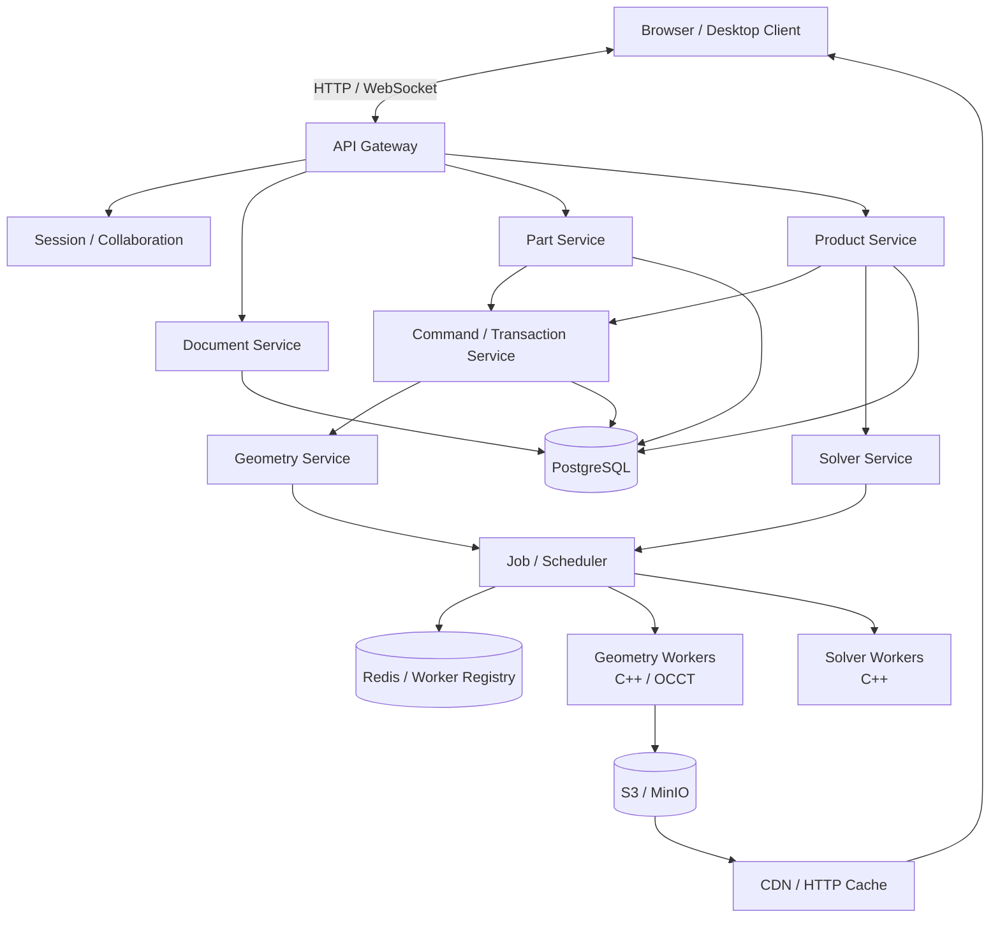
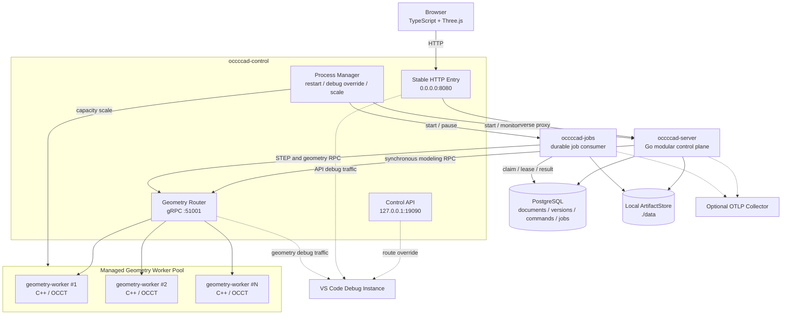
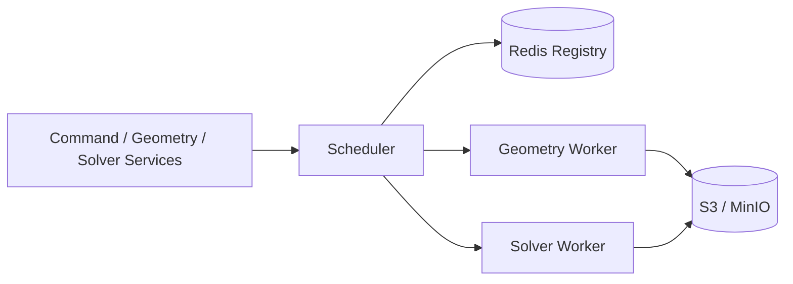
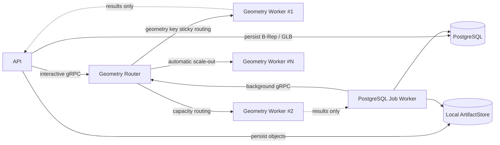
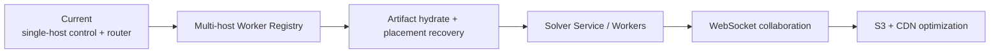

# occccad 目标架构与当前实现对照

> 状态：当前实现说明  
> 对照基线：[Architecture Specification v0.1](occccad_Architecture_Specification_v0.1.md)  
> 当前迭代：v0.0.8 之后的开发主干  
> 更新日期：2026-08-09

本文不重新定义目标架构，而是说明最初设计中的哪些边界已经实现、当前真实服务关系，以及它与
目标 Worker 依赖图不同的原因。

## 1. 最初的目标架构

Architecture Specification 将系统拆成业务控制面、计算面和制品分发面。

这是最终形态的逻辑服务图，不表示第一阶段必须把每个逻辑模块都部署成独立进程。原规范也明确
允许先使用一个 Go Binary 承载 Document、Command、Part 和 Product 模块。

## 2. 当前真实运行拓扑

当前部署是“模块化单体控制面 + 独立持久任务进程 + 可水平扩展计算进程”。业务模块虽然还没有
拆成多个网络服务，但持久状态、计算状态和浏览器会话已经分离。

## 3. Worker 依赖关系的差异

### 3.1 目标 Worker 调度链

目标设计假定已进入多主机集群：Scheduler 使用 Registry 发现 Worker、匹配 Capability 与数据局部性，
Worker 可直接读写对象存储中的大型制品。

### 3.2 当前 Worker 调度链

| 边界 | 目标设计 | 当前实现 | 原因与后续边界 |
|---|---|---|---|
| Worker 发现 | Redis Registry | Control 进程内 Worker Pool | 当前是单机；Router API 可保留，底层可替换为集群 Registry |
| 调度 | 独立 Scheduler | Geometry Router 按 `resident + inFlight` 调度 | 已验证容量为 2 时的扩容；尚未跨主机 |
| 互动建模 | 可经 Scheduler/Job | API 直接通过 Router 粗粒度 gRPC | 避免鼠标交互被持久队列延迟；Command/Version 仍持久化 |
| 后台任务 | Job / Scheduler | PostgreSQL `jobs` + `FOR UPDATE SKIP LOCKED` | 已支持租约、心跳、重试和多 Consumer |
| Worker 制品 I/O | Worker 直连 S3 | API/Jobs 接收 RPC 结果后写 ArtifactStore | Worker 无业务身份和数据库权限；S3 适配器尚未启用 |
| Solver | Solver Service + Solver Workers | 未实现 | Product 目前只支持显式 Transform，还没有装配约束求解 |
| Worker 恢复 | Registry 重定位 + Artifact hydrate | Worker 失效移除并补足最小实例 | B-Rep/GLB 已持久；自动 hydrate 和多主机重定位尚未实现 |

## 4. 最初设计的实现进度

| 能力域 | 状态 | 当前边界 |
|---|---|---|
| Document / Version | 已实现 | Part/Product 文档、Head Version、命名 Version、变更线 |
| Command / Undo / Redo | 已实现 MVP | 建模与装配变更生成 Command 和新 Version；Undo/Redo 移动历史指针 |
| Part Feature Chain | 已实现 MVP | 基准面、矩形草图、多次 Pad、Feature Tree、STEP 导入导出 |
| Product Reference Graph | 已实现 MVP | Part/子 Product 嵌套、`FOLLOW_HEAD` / `PINNED`、循环检测、实例 Transform |
| 更新边界 | 已实现基线 | `FOLLOW_HEAD` 读取新 Head；缩略图沿父 Product 递归失效并重建 |
| Geometry Worker | 已实现 MVP | C++17 / OCCT 7.9.1、粗粒度 gRPC、B-Rep/GLB/Mesh/拓扑结果、多 Geometry 缓存 |
| Geometry Router | 已实现单机版 | Geometry Key/ID 粘滞路由、容量扩缩容、失效替换、Debug Override |
| 文档中心 / CAD Web | 已实现 MVP | 文档 CRUD、Tab、Toolbar、Feature Tree、Three.js 视图、选择和实例拖动 |
| 账号 / ACL / 管理后台 | 已实现基线 | 管理员、注册审批、角色、Session/CSRF、用户/团队/文档/文件夹权限 |
| Artifact | 已实现本地后端 | B-Rep、GLB、STEP、缩略图按内容寻址写入 `./data`；S3 预留 |
| Persistent Jobs | 已实现 | STEP Import/Export、Thumbnail、Claim/Lease/Retry/Attempt |
| 缩略图 | 已实现 Part + Product | Part 网格/草图和 Product 展平实例的等轴 SVG；命令后按 Version 重建 |
| 日志 / Trace | 部分实现 | Go 结构化日志、Request/Trace ID、可选 OTLP；C++ Server Span/Metrics 尚待补齐 |
| Collaboration | 未实现 | 尚无 WebSocket 协作、Presence、合并或冲突处理 |
| Solver / Constraints | 未实现 | 草图约束与 Product 装配约束都还没有 Solver Worker |
| Redis / S3 / CDN | 未启用 | 按当前迭代约束使用 PostgreSQL 和 Local ArtifactStore，保留适配器边界 |
| 多主机编排 | 未实现 | `occccad-control` 只管理本机进程；未来交给 Kubernetes/Nomad |

## 5. 当前差异的性质

当前实现仍符合最初的核心原则：

1. Product 引用的是 Document/Version，不是 Worker 地址或 OCCT Handle。
2. PostgreSQL 中的 Document、Version、Command 和 Reference Graph 是业务真相。
3. Worker 中的 `TopoDS_Shape` 是可丢弃计算缓存，Worker 退出不会丢失文档。
4. 浏览器只获取 Mesh/GLB，不把显示网格当成精确 B-Rep。
5. API 与 Worker 之间是粗粒度 RPC，没有远程化细粒度 OCCT 对象。

差异主要是部署成熟度，而不是领域模型分叉：当前用单机 Router 代替集群 Scheduler/Registry，用 PostgreSQL Job
代替 Redis Queue，用 Local ArtifactStore 代替 S3。这些替换保留了稳定地址、持久任务和制品接口，
可在不改变 Document/Command/Reference 语义的前提下演进。

## 6. 后续演进顺序

优先级应继续由 CAD 功能驱动，而不是为了拆服务而拆服务。下一个真正需要新 Worker 类型的功能是草图/
装配约束求解；下一个真正需要集群 Registry 的时点，是 Geometry Worker 开始跨主机部署时。
