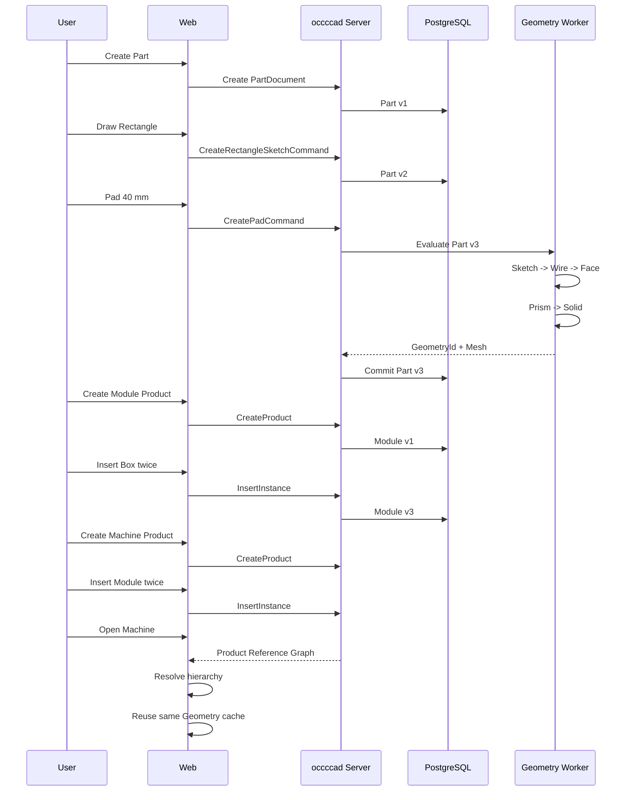

# occccad Vertical Slice Demo 01

> **状态：** v0.1 实施方案，尚未完成
> **依赖：** occccad Architecture Specification v0.1
> **当前起点：** C++17 + OCCT 7.9.1 Geometry Worker 冒烟框架
> **最后更新：** 2026-08-09

## 文档定位

本文定义 occccad 的第一个端到端垂直切片。它是一份**待实施方案**，不是当前仓库已经具备的功能清单。当前代码只完成本地 Box、包围盒、拓扑和卸载测试；本文中的 Go Server、gRPC、数据库、Artifact、GLB 和 Web 交互均属于 Demo 交付范围。

项目名称统一为 **occccad**：`occ` 表示 OCCT 几何内核，`c` 取自 `could`，`cad` 表示项目所服务的 CAD 领域。

## Demo 目标

这个 Demo 能把核心目标架构串起来，同时保持足够小的范围。

我建议这个最小 Demo 不追求“功能多”，而是验证下面这条完整链路：

```text
创建 Part Document
    ↓
创建矩形 Sketch
    ↓
创建 Pad/Extrude Feature
    ↓
Geometry Worker 用 OCCT 生成 Box
    ↓
生成 B-Rep + Topology + GLB
    ↓
浏览器显示零件
    ↓
创建 Product Document A
    ↓
插入 Part 实例
    ↓
创建 Product Document B
    ↓
插入 Product A 实例
    ↓
浏览器展开多层级 Product
```

这已经足以验证：

* Document / DocumentVersion
* Part / Product
* Feature
* Command / Transaction
* Reference Graph
* Geometry Worker
* OCCT
* Artifact
* Web Visualization
* 多层级 Product Instance

本文将它定义成 **occccad Vertical Slice Demo 01**。

---

# 一、首先要控制 Demo 的边界

第一版**千万不要做完整草图约束器**。

用户所谓：

> 绘制矩形草图

V1 完全可以表达为：

```text
RectangleSketchFeature
    origin = (0, 0)
    width = 100
    height = 60
```

甚至 UI 可以让用户鼠标拖两点：

```text
P1
P2
```

前端换算：

```text
x
y
width
height
```

提交一个：

```text
CreateRectangleSketchCommand
```

后端保存成正式 Sketch Model。

不要第一版就设计：

```text
Line1
Line2
Line3
Line4

HorizontalConstraint
VerticalConstraint
CoincidentConstraint × 4
DimensionConstraint × 2
```

因为那实际上已经是在做完整 Sketch Solver。

第一版可以在领域模型上预留，但实现一个：

```text
RectanglePrimitive
```

就够了。

---

# 二、但是数据模型不要写死成 Rectangle

这里要稍微注意。

UI 操作可以叫：

```text
Create Rectangle
```

但 Part Model 最终最好还是能转换成：

```text
Sketch
 ├── Line
 ├── Line
 ├── Line
 └── Line
```

例如：

```cpp
struct SketchLine {
    EntityId id;

    Vec2 start;
    Vec2 end;
};

struct Sketch {
    SketchId id;

    Plane plane;

    std::vector<SketchEntity> entities;
};
```

矩形只是一个 Command：

```text
CreateRectangleSketchCommand
```

执行以后生成：

```text
Line #1
Line #2
Line #3
Line #4
```

这样以后加入真正的二维 Constraint Solver 时不用推翻模型。

我会建议：

> **UI Primitive 和 Domain Primitive 分开。**

UI：

```text
Rectangle Tool
```

Domain：

```text
4 Lines + optional constraints
```

---

# 三、最小 Part Feature Tree

比如创建一个：

```text
100 × 60 × 40
```

的 Box。

Part：

```text
PartDocument: BoxPart

FeatureTree
│
├── Sketch001
│
│   ├── Plane = XY
│   ├── Line001
│   ├── Line002
│   ├── Line003
│   └── Line004
│
└── Pad001
    ├── Profile = Sketch001
    └── Length = 40
```

真正需要保存的不是：

```text
TopoDS_Shape Box
```

而是：

```text
PartModel
```

例如：

```json
{
  "features": [
    {
      "id": "sketch-001",
      "type": "sketch",
      "plane": "XY",
      "entities": [
        ...
      ]
    },
    {
      "id": "pad-001",
      "type": "pad",
      "profile": "sketch-001",
      "length": 40
    }
  ]
}
```

然后：

```text
Part Model
    ↓
Geometry Worker
    ↓
TopoDS_Shape
```

---

# 四、OCCT 侧实现其实很简单

第一阶段不要用：

```text
BRepPrimAPI_MakeBox
```

虽然它更简单。

因为我们的目标是验证：

```text
Sketch
→
Profile
→
Extrude
```

真正应该做：

```cpp
gp_Pnt p1(...);
gp_Pnt p2(...);

BRepBuilderAPI_MakePolygon polygon;

polygon.Add(...);
polygon.Add(...);
polygon.Add(...);
polygon.Add(...);
polygon.Close();

TopoDS_Wire wire = polygon.Wire();

TopoDS_Face face =
    BRepBuilderAPI_MakeFace(wire);

gp_Vec direction(0, 0, height);

TopoDS_Shape solid =
    BRepPrimAPI_MakePrism(
        face,
        direction
    );
```

这样验证的就是将来真正的 Pad Pipeline。

---

# 五、Geometry Worker 的 API 不要直接叫 MakeBox

这一点很重要。

不要为了 Demo：

```protobuf
rpc MakeBox(MakeBoxRequest)
```

否则 Demo 写完架构就歪了。

应该：

```protobuf
rpc EvaluatePart(EvaluatePartRequest)
    returns (EvaluatePartResponse);
```

输入：

```text
PartDefinition
```

或者：

```text
FeatureGraph
```

Worker：

```text
Evaluate:
    Sketch001
        ↓
    Pad001
        ↓
    Result Geometry
```

最终返回：

```text
GeometryId
TopologyManifest
DisplayArtifactRef
```

这样 Demo 和正式架构是一致的。

---

# 六、推荐核心 Proto

Demo 阶段不要把 Proto 拆成几十个。

我会先做：

```text
common.proto
document.proto
part.proto
product.proto
geometry.proto
command.proto
```

足够。

例如：

```protobuf
message DocumentRef {
    string document_id = 1;
    uint64 version = 2;
}
```

Part：

```protobuf
message PartDefinition {
    repeated Feature features = 1;
}
```

Sketch：

```protobuf
message SketchFeature {
    string id = 1;

    SketchPlane plane = 2;

    repeated SketchEntity entities = 3;
}
```

Pad：

```protobuf
message PadFeature {
    string id = 1;

    string profile_feature_id = 2;

    double length = 3;
}
```

---

# 七、Command 也只实现最少几个

第一版：

```text
CreateDocumentCommand

CreateRectangleSketchCommand

CreatePadCommand

CreateProductCommand

InsertInstanceCommand
```

甚至 CreateDocument 可以暂时不算 CAD Command，而是 Document API。

真正 CAD 命令：

```text
CreateRectangleSketch
CreatePad
InsertInstance
```

每一次：

```text
Command
    ↓
new DocumentVersion
```

例如：

```text
Part Box

v1:
empty

v2:
Sketch001

v3:
Sketch001
Pad001
```

这样第一天就能验证：

```text
Undo
```

例如：

```text
v3 → revert Pad
```

---

# 八、Product Demo 要真正体现多层级

不要只创建：

```text
Product
    └── Part
```

因为这样没验证 Product Reference。

推荐：

```text
RootProduct
│
├── PartInstance A
│
└── SubProductInstance
     │
     ├── PartInstance B
     └── PartInstance C
```

而 B/C 都引用同一个：

```text
BoxPart
```

例如：

```text
BoxPart
100×60×40
```

然后：

```text
Product: Module
├── BoxPart instance #1
└── BoxPart instance #2
```

再：

```text
Product: Machine
├── Module instance #1
├── Module instance #2
└── BoxPart instance #3
```

这很好。

因为最终你可以看到：

```text
Machine
├── Module
│   ├── Box
│   └── Box
├── Module
│   ├── Box
│   └── Box
└── Box
```

总共：

```text
5 instances
```

但只有：

```text
1 Part Document
1 Geometry
```

这就是整个架构最核心的效果。

---

# 九、数据库里一定不要展开保存 Product Tree

例如不要：

```text
Machine
 ├ Module
 │ ├ Box
 │ └ Box
...
```

保存为一棵完整 JSON Tree。

应该只保存直接引用：

```text
Machine:
    instance #1 -> Module:v3
    instance #2 -> Module:v3
    instance #3 -> Box:v3

Module:
    instance #1 -> Box:v3
    instance #2 -> Box:v3
```

然后：

```text
Reference Graph
```

递归展开。

这样：

```text
Module
```

修改时：

```text
Machine
```

不需要复制整个子树。

---

# 十、但是要防止 Product 引用循环

这是 Demo 就应该处理的问题。

例如：

```text
Product A
    ↓
Product B
    ↓
Product A
```

这会产生无限递归。

所以：

```text
InsertInstanceCommand
```

插入 Product 时必须做：

```text
cycle detection
```

Reference Graph：

```text
A → B
B → C
```

插入：

```text
C → A
```

必须拒绝。

这个逻辑建议放在：

```text
Product Service
```

而不是 Worker。

---

# 十一、Instance 必须有自己的 Transform

例如：

```protobuf
message ProductInstance {

    string id = 1;

    DocumentRef document = 2;

    Transform transform = 3;
}
```

五个 Box：

```text
GeometryId
```

完全相同。

只有：

```text
Transform
```

不同。

例如：

```text
Box 1: (0,0,0)
Box 2: (150,0,0)

Module 1: (0,0,0)
Module 2: (0,200,0)
```

浏览器最终：

```text
Geometry
+
World Transform
```

显示。

---

# 十二、Frontend 不要为每个 Instance 下载一个 GLB

这是 Demo 很容易写错的地方。

正确：

浏览器加载：

```text
GeometryId ABC
```

发现没有：

```text
mesh cache
```

则：

```text
GET ABC.glb
```

然后：

```text
GeometryCache[ABC]
```

之后：

```text
Instance 1
Instance 2
Instance 3
Instance 4
Instance 5
```

全部引用这一份。

Three.js：

第一版甚至：

```text
mesh.clone()
```

都可以。

后续再：

```text
InstancedMesh
```

---

# 十三、前端最小架构

我推荐至少分：

```text
web/

cad-domain/
    Document
    Part
    Product

cad-client/
    API
    WebSocket

cad-scene/
    GeometryCache
    ProductSceneBuilder

cad-tools/
    SketchRectangleTool
    PadTool

cad-ui/
```

不要：

```text
App.tsx
```

里面直接写完所有逻辑。

---

# 十四、二维 Sketch UI 第一版非常简单

视图切换为：

```text
XY Plane
orthographic camera
```

用户：

```text
mousedown
    start

mousemove
    preview

mouseup
    end
```

得到：

```text
p1
p2
```

生成：

```text
xmin
ymin
xmax
ymax
```

再变成：

```text
Line1
Line2
Line3
Line4
```

发送：

```text
CreateRectangleSketchCommand
```

---

# 十五、必须统一单位

这个 Demo 就应该决定：

内部统一：

```text
SI
```

还是：

```text
mm
```

CAD 系统一般用户层偏好 mm。

我建议 Domain：

```text
length unit = mm
angle = rad
```

或者定义：

```protobuf
message Length {
    double value = 1;
}
```

第一阶段可以简单：

```text
double = millimeter
```

但是必须写在 Specification 里。

否则以后：

```text
前端 mm
OCCT mm
solver m
```

会很危险。

OCCT 本身没有强制单位系统，数值尺度取决于应用约定。

---

# 十六、Document / Geometry 生命周期不要混淆

例如：

```text
BoxPart:v3
```

引用：

```text
GeometryId = ABC
```

Geometry Worker 当前：

```text
worker-1:
    ABC loaded
```

然后用户关闭浏览器。

不能：

```text
delete ABC
```

只能：

```text
Session close
```

Geometry Worker 可以根据 LRU：

```text
evict ABC
```

但：

```text
Document
Geometry Artifact
```

仍然存在。

---

# 十七、最小后端服务其实不用拆很多进程

这是 Demo 很值得注意的。

架构上我们有：

```text
Document Service
Part Service
Product Service
Command Service
```

但 Demo 完全可以：

```text
occccad-server
```

一个 Go Binary 内部模块：

```text
document/
command/
part/
product/
```

然后：

```text
occccad-geometry-worker
```

一个独立 C++ Binary。

这已经足够验证真正的分布式边界：

```text
Control Plane
      ↕ gRPC
Compute Plane
```

千万不要为了“符合架构”第一版部署 8 个 Go 进程。

---

# 十八、我甚至建议 Demo 就三个进程

非常漂亮：

```text
┌────────────────────────┐
│ occccad-web            │
│ TypeScript / React     │
└───────────┬────────────┘
            │ HTTP/WS
            ▼
┌────────────────────────┐
│ occccad-server         │
│ Go                     │
│                        │
│ Document               │
│ Command                │
│ Part                   │
│ Product                │
│ Reference              │
└───────────┬────────────┘
            │ gRPC
            ▼
┌────────────────────────┐
│ geometry-worker        │
│ C++ / OCCT             │
└────────────────────────┘
```

外加：

```text
PostgreSQL
MinIO
```

甚至 Redis 第一版都可以没有。

---

# 十九、Redis 可以完全不进 Demo

因为目前：

```text
只有一个 Geometry Worker
```

Geometry Directory：

```text
in-memory map
```

就行。

等第二阶段：

```text
2 workers
```

再加入 Redis / Registry。

这样 Demo 更快落地。

---

# 二十、Artifact 第一版可以直接文件系统

同样：

正式架构：

```text
S3 / MinIO
```

Demo 可以：

```text
./data/artifacts
```

例如：

```text
data/
  geometry/
    abc123/
      shape.brep
      mesh.glb
      topology.pb
```

接口必须抽象：

```cpp
IArtifactStore
```

或者 Go：

```go
type ArtifactStore interface {}
```

实现：

```text
LocalArtifactStore
```

后面换：

```text
S3ArtifactStore
```

---

# 二十一、这样最小环境甚至只有

```text
PostgreSQL
```

甚至 PostgreSQL 第一阶段都可以 SQLite。

但我不推荐。

因为：

```text
DocumentVersion
Command
Transaction
Reference
```

本身就是我们重点验证的对象。

所以直接 PostgreSQL 比较合理。

---

# 二十二、Topology 暂时做到 Face/Edge ID 即可

Box 生成后：

```text
6 Faces
12 Edges
8 Vertices
```

Geometry Worker：

```text
TopoDS_Shape
    ↓
TopExp_Explorer
```

生成：

```text
FaceId
EdgeId
VertexId
```

第一阶段只需要：

```text
Geometry Scoped IDs
```

不用马上 Persistent Naming。

例如：

```text
geometry ABC:
    Face 1..6
    Edge 1..12
```

下一次 Pad 参数修改：

```text
geometry DEF
```

重新编号。

这是可接受的。

---

# 二十三、但是不要让 Feature 引用这些临时 Edge ID

这是区别。

这个 Demo：

```text
Pad
```

引用：

```text
Sketch
```

不是引用某个 Edge。

所以完全没有 Persistent Naming 问题。

等第二个 Demo：

```text
Chamfer Edge
```

才正式面对 Topological Naming。

这也是为什么：

> Rectangle → Pad

非常适合 Demo 01。

---

# 二十四、产品树的递归 Transform

多层 Product 必须注意：

```text
WorldTransform
=
ParentWorldTransform
×
InstanceLocalTransform
```

例如：

```text
Machine
    Module T1
        Box T2
```

最终：

```text
BoxWorld =
T1 × T2
```

不能把子 Part 的世界矩阵写回：

```text
BoxPart
```

Transform 属于：

```text
Instance
```

---

# 二十五、DocumentRef 必须包含 Version

不要：

```text
instance -> BoxPart
```

至少 Demo 应：

```text
instance -> BoxPart:v3
```

例如：

```protobuf
message DocumentRef {
    string document_id = 1;
    uint64 version = 2;
}
```

这样 Product 创建后：

```text
Part 修改
```

不会莫名改变历史 Product。

未来再增加：

```text
Latest
WorkspaceHead
Released
```

动态引用。

---

# 二十六、Demo 中 Undo 非常值得做

它其实成本不高。

例如：

```text
Part:

v1 empty
v2 Sketch
v3 Pad
```

点 Undo：

```text
Revert Pad
```

得到：

```text
v4 Sketch
```

再 Undo：

```text
v5 empty
```

Product：

```text
v1 empty
v2 Insert Box
v3 Insert Module
```

都可以统一走 Transaction。

这会非常早验证整个 Command Framework 是否正确。

---

# 二十七、建议具体模块

我会直接这样：

```text
occccad/

proto/
    common.proto
    document.proto
    command.proto
    part.proto
    product.proto
    geometry.proto

server/
    cmd/occccad-server/

    internal/
        document/
        command/
        part/
        product/
        reference/
        persistence/

kernel/
    api/
    occt/

workers/
    geometry/

web/
    src/
        domain/
        api/
        scene/
        tools/
        ui/

db/
    migrations/

testdata/
    step/

docs/
```

---

# 二十八、C++ Worker 内部

```text
geometry-worker

GeometryService
    |
    v
PartEvaluator
    |
    +-- SketchEvaluator
    |
    +-- PadEvaluator
    |
    v
OcctKernel
```

千万不要：

```text
GeometryService
    ↓
switch(feature.type)
    ↓
3000 lines
```

先建立 evaluator abstraction：

```cpp
class IFeatureEvaluator {
public:
    virtual FeatureResult evaluate(
        const Feature& feature,
        EvaluationContext& context
    ) = 0;
};
```

---

# 二十九、SketchEvaluator

输出不一定是 Solid。

应该是：

```text
FeatureResult

ShapeType:
    Wire
```

Pad：

输入：

```text
Sketch Feature Result
```

输出：

```text
Solid
```

以后：

```text
Pocket
Fillet
Chamfer
```

都自然接起来。

---

# 三十、Feature DAG 不一定永远是 Tree

现在看：

```text
Sketch
 ↓
Pad
```

像树。

但以后：

```text
Sketch1 ----\
             Boolean
Sketch2 → Pad/
```

或者 Feature 引用多份 Geometry。

因此底层建议：

```text
Feature Graph / DAG
```

UI 可以显示：

```text
Feature Tree
```

但模型最好允许引用多个 upstream feature。

---

# 三十一、最小完整时序

我建议最终 Demo 能跑这条：



这就是最小但完整的 occccad 垂直切片。

---

# 三十二、我认为 Demo 的验收条件应该非常明确

完成时必须看到：

```text
Machine
├── Module-1
│   ├── Box-1
│   └── Box-2
│
└── Module-2
    ├── Box-3
    └── Box-4
```

屏幕上：

```text
4 个长方体
```

但是后端：

```text
Part Documents = 1
Product Documents = 2

Geometry = 1
```

Geometry Worker：

```text
Resident Geometry = 1
```

浏览器：

```text
Downloaded GLB = 1
```

这几个指标比 UI 漂不漂亮重要得多。

---

# 三十三、最需要注意的几个坑

如果让我提前圈重点，我会特别注意这一个列表：

1. **不要用 `BRepPrimAPI_MakeBox` 绕过 Sketch → Pad 链路。**
2. **不要把 Product 做成 `TopoDS_Compound`。**
3. **不要为每个 Instance 复制 Geometry。**
4. **不要让 DocumentRef 指向 Worker。**
5. **不要把 Feature Model 直接保存成 OCC 对象。**
6. **不要第一版就做完整 Sketch Constraint Solver。**
7. **不要一开始就做 Persistent Topological Naming。**
8. **不要为了微服务把所有 Go Module 拆成独立进程。**
9. **不要每个 Product 保存展开后的完整子树。**
10. **不要让浏览器每个 Instance 重复下载 GLB。**
11. **必须处理 Product Reference Cycle。**
12. **必须区分 Instance Transform 和 Part Geometry。**
13. **必须让 Document Version 从第一版存在。**
14. **Feature ID 必须稳定，不要用数组下标。**
15. **所有业务修改尽量从第一版就走 Command。**

如果这 15 点守住，那么这个 Demo 写完以后，绝大部分代码都可以直接成为正式 occccad 的基础，而不是“Demo 写完全部推倒重来”。

我会把 **Demo 01 的成功标准**概括成一句话：

> **同一个 Part 的参数化模型只定义一次、精确 Geometry 只计算并缓存一次、GLB 只传输一次，但可以通过多层 Product Reference Graph 在任意多个 Instance 中复用，并且所有创建过程都留下可版本化的 Command/Document 历史。**

这正好是 occccad 架构的第一次真正闭环。
