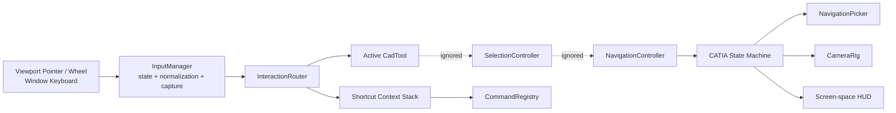
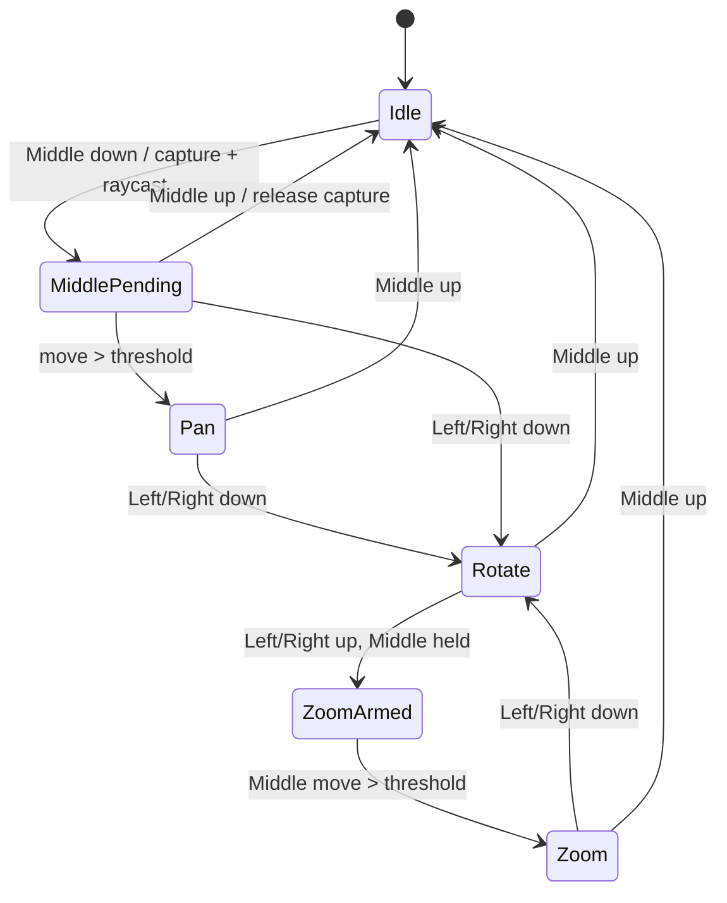
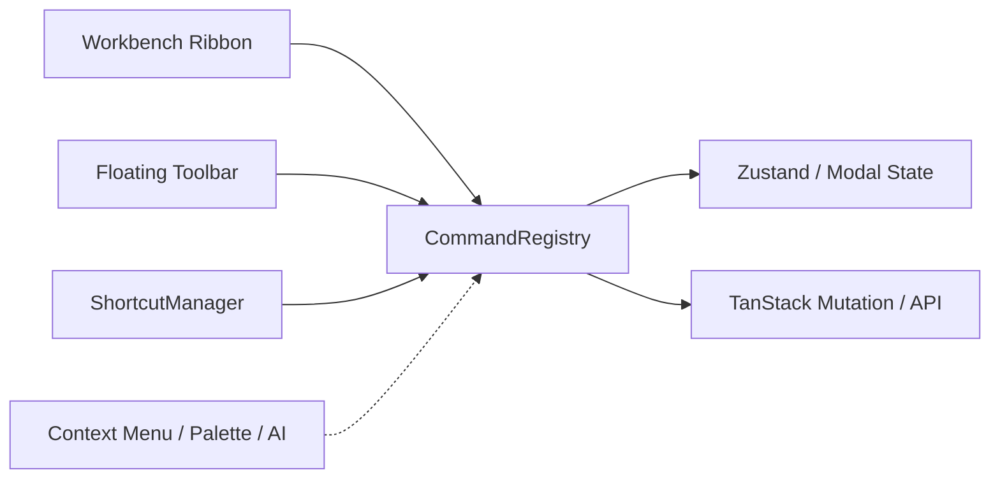
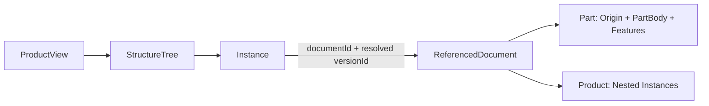
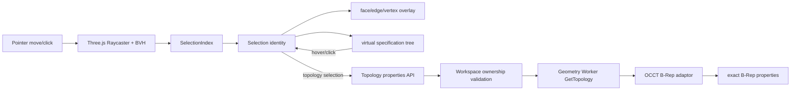

# occcccad v0.0.10 CAD 前端交互基础框架

> 状态：已实现基线  
> 更新日期：2026-08-11  
> 前置版本：[v0.0.9 前端应用架构](occccad_v0.0.9_Frontend_Application_Architecture.md)

## 1. 当前真实结构

前端是 React + TypeScript + Ant Design + Zustand + plain Three.js，不使用 React Three Fiber，也没有
OrbitControls。`CadViewport` 通过 `useEffect` 创建和销毁 `CadViewportEngine`；Scene、PerspectiveCamera、
WebGLRenderer、TransformControls、Raycaster、Canvas 和按需渲染生命周期都由 Engine 持有。

统一 `InputManager` 绑定 Canvas Pointer/Wheel 和 Window Keyboard，`InteractionRouter` 对 Tool、Selection、
Navigation 做短路分发。高频 Pointer/Camera 状态留在普通 TypeScript 对象内；Zustand 和 React 只保存 Tool、
Selection、Profile、Tab、Inspector 等低频 UI 状态。

## 2. 新增模块

```text
src/cad/
├── input/          InputStateTracker、InputManager、Normalized Event
├── interaction/    InteractionRouter、SelectionController、SelectionContext
├── navigation/     Profile Facade、CATIA State Machine、CameraRig、NavigationPicker、HUD
├── rendering/      Visual Theme、Shader Library、Material Factory、Background
├── tool/           CadTool、ToolContext、ToolManager、RectangleSketchTool
├── shortcut/       ShortcutManager、Context Stack、Binding
├── command/        CommandRegistry、React CommandProvider
└── overlay/        FloatingPanel、FloatingToolbar、ContextToolbar、ToolButton、Debug Overlay
```

这些模块是普通 TypeScript class/service。React 只负责生命周期、Command UI 和低频状态展示，没有组件继承，
Pointer Position、Camera Matrix 和 Drag Delta 不进入 React State。

## 3. 输入事件流



`InputManager` 只绑定 Renderer Canvas 的 Pointer/Wheel/Context/Drag/Select 事件；Keyboard/Blur 绑定 Window，
Visibility 绑定 Document。`contextmenu` 只在 Viewport Interaction Surface 内禁止浏览器菜单，`wheel` 仅在
输入被消费时阻止默认行为；属性输入框、TextArea、Tree 和普通页面不受影响。

InputState 使用 `PointerEvent.buttons` 的完整位掩码，而不是只读取单个 `event.button`。状态包含当前位置、Delta、
Left/Middle/Right、Ctrl/Shift/Alt/Meta 和当前 Key Set。

浏览器只为鼠标第一个按键发送 `pointerdown`、最后一个按键发送 `pointerup`；弦键中的后续 Down/Up 通过
`pointermove.buttons` 变化表达。InputManager 比较前后 Button Mask，将这些变化恢复成规范化 Pointer Down/Up，
因此 CATIA 状态机可以可靠收到 Middle 保持期间的 Left/Right Press 和 Release。

## 4. Pointer Capture 和异常恢复

Tool 或 Navigation 返回 `InputResult.Capture` 后，InputManager 调用 `setPointerCapture(pointerId)`。鼠标离开
Canvas 后 Move/Up 仍属于本次拖动；CATIA 的 Left 先释放不会中断 Capture。Middle 释放时状态机返回
`InputResult.ReleaseCapture`，即使 Left 仍按住也会立即终止导航并释放 Capture。

以下路径都会清理状态并调用 Tool/Selection/Navigation cancel：

- `pointercancel`；
- 非预期 `lostpointercapture`；
- `window.blur`；
- `document.visibilityState === hidden`；
- Engine dispose。

程序主动释放 Capture 产生的 `lostpointercapture` 会使用 expected-loss 标记过滤，避免完成一次正常操作后又被
错误地 cancel。

## 5. Tool、Selection、Navigation 优先级

当前采用动态短路优先级：

```text
Middle 已按下 / CATIA Gesture active
    Navigation → Tool → Selection

普通 Left
    Tool → Selection → Navigation
```

不是把事件广播给三个系统。Middle 主导手势中的辅助 Left/Right 先被 Navigation 消费，不会同时画矩形、选择
对象或打开 Context Menu；普通 Left 仍由 Tool/Selection 优先处理，因此激活 Rectangle Tool 时中键导航可用。

Selection 只对移动距离不超过 4px 的 Left Click 执行 Raycast；检测到 Middle/Right Chord 后立即放弃候选点击，
不会在相机操作结束时误选对象。

## 6. Navigation Profile

相机映射不在 InputManager，也不依赖 OrbitControls。`NavigationController` 是 Profile Facade；Default Profile
使用 CameraRig，CATIA Profile 交给独立 `CatiaNavigationController` 显式状态机。CameraRig 同时实现 Perspective
和 Orthographic 数学；当前 Viewport 实例仍使用 PerspectiveCamera。渲染保持按需单帧更新。

| Profile | 输入 | Action |
|---|---|---|
| occcccad Default | Right Drag | Orbit |
| occcccad Default | Middle Drag | Pan |
| CATIA V5 | Middle Click Geometry | 最近表面点成为 Pivot，并 Center Viewpoint |
| CATIA V5 | Middle Drag（超过 3 CSS px） | Pan |
| CATIA V5 | Middle + Left/Right Hold + Drag | Rotate/Tumble |
| CATIA V5 | Rotate 后释放 Left/Right，继续保持 Middle Drag | Zoom |
| 两者 | Wheel | 命中几何时 Zoom-to-cursor，否则绕现有 Pivot |

CATIA 状态机为：



Middle Down 时 `NavigationPicker` 只对 `CAD_GEOMETRY_LAYER` 中明确标记的可见 Mesh 求交。Three.js 返回结果按
Camera Distance 升序选择第一个，直接保存 `intersection.point` 世界坐标；Product/Part Group 的层级变换已经包含
在该点中，不访问 B-Rep Topology。空白区域使用穿过当前 Pivot、法向为 Camera Forward 的 View Plane 与鼠标
Ray 求交，因此空白点也有稳定的世界坐标和当前视深，不回退到 World Origin。

Middle Down 只保存 Geometry/View-Plane Candidate 并显示中心 3D Cross，不移动 Camera。无拖动、无辅助键的
Middle Up 才执行 `delta = candidate - oldPivot`，Camera Position 与 Pivot 同时加上 delta，使该点成为视图区
中心和旋转中心。Middle 保持期间移动则连续 Pan；按下 Left/Right 进入 Rotate，释放侧键但继续保持 Middle 则
进入 Zoom。Pan 使用 Camera Right/Up 与 Perspective 的 `2 * distance * tan(fov/2) / viewportHeight`
计算 world-per-pixel；Orthographic 使用 `(top-bottom) / zoom / viewportHeight`。Rotate 使用以 Viewport Center
为球心的 Shoemake Virtual Trackball：Pointer 映射到 Sphere/Hyperbola，前后向量生成 View-space Quaternion，
取 Camera Orbit 所需的逆方向并变换到 World-space，再同时应用到 Camera-Pivot Offset 和 Camera Quaternion。
单事件旋转角受限并使用精细比例缩放，避免高速 Pointer Move 产生跳跃。Zoom 使用
`exp(deltaY * sensitivity)` 缩放 Camera-Pivot Distance，向上为 Zoom In，并限制最小/最大距离。

Left 和 Right 都可作为 Middle 主导手势的 Auxiliary Button；Right 不与 Middle 组合时仍保留给 Context Menu。

Profile 通过 `NavigationProfile` 接口替换，后续 SolidWorks/NX/Blender Profile 不需要修改 InputManager、Tool
或 Camera 实现。

## 7. Shortcut Context Stack

Engine 当前按从通用到具体的顺序压入：

```text
Global
Viewport
Sketch（进入草图时）
RectangleTool（矩形激活时）
```

匹配从栈顶向下进行。RectangleTool 的 Escape 优先执行 `tool.select`；如果当前 Context 不匹配才向下传播。
现有绑定包括 Ctrl/Cmd+Z、Ctrl/Cmd+Y、Ctrl/Cmd+Shift+Z、F、R 和 Escape。

Input、Textarea、Select 和 ContentEditable 默认不触发 CAD Shortcut。Binding 可显式设置
`allowInEditable`，未来 Ctrl+S 之类全局命令可以选择在编辑状态继续工作。

## 8. Frontend UI Command

`CommandRegistry` 管理 `execute/enabled/visible/active`。它是前端 UI Command，不等于 PostgreSQL 中的领域
Command，但可以调用现有 TanStack Mutation 并最终产生后端 Domain Command。



Workbench 不再自行计算 disabled/active/visible，也不直接执行建模动作。`ToolButton` 只接收 Command ID、
Icon、Tooltip 和可选 Label，并订阅 Registry 状态。同一个 `sketch.rectangle` 同时服务 Floating Toolbar、
Shortcut 和未来的 Command Palette。

## 9. Overlay

`FloatingPanel` 是定位、边框、阴影和标题的基础容器；`FloatingToolbar` 在其上增加方向、Group 和 Separator；
`ContextToolbar` 接收已经由 Selection Context Resolver 得出的 Command 描述，不读取 Three.js Scene。

每个 Toolbar 都有独立拖动柄。左键拖动只改变该 Toolbar 在 Viewport 内的位置，右键点击拖动柄切换横向/纵向，
布局以 Toolbar ID 保存到浏览器 Local Storage。Toolbar 内容仍只通过 Command Registry 执行命令。

工作区除页眉外完全由 Viewport 占据。Toolbar 按 Workbench 隔离，而不是把所有命令混在一条工具栏：

- Part Design：Select、Sketch、Pad、STEP Import/Export；
- Sketcher：Select、Rectangle、Finish Sketch；
- Assembly Design：Select、Insert、Reference Mode；
- Generative Shape Design：已注册 Workbench 边界，曲面命令尚未实现；
- Common：Undo、Redo、Version、Share；
- View：Navigation Profile、Fit、Isometric View。

只有 Active Workbench 的建模 Toolbar 被挂载。进入/退出 Sketch 会在 Part Design 和 Sketcher 之间切换；Product
只显示 Assembly Design。未来 Product 中双击 Part 实例时，可将 Active Workbench 切到 Part Design 并保留 Product
Context，实现 in-context edit，而不需要重写 Toolbar。

Specification Tree 使用项目专用递归组件，不再使用 Ant Design Tree。它透明叠加在 Viewport 左侧，以节点图标为
连接轴：Root 图标下方直接引出竖线，叶节点使用小连接点，可展开分支使用空心圆，展开后显示为十字方向四瓣节点。
PartBody 中 Pad 会包含其消费的 Sketch。Properties/History 共用右侧可折叠
Inspector。全局左下角 Document Orb 在文档中心和 Workbench 都存在，提供新建、查看已打开文档、切换和关闭文档。
鼠标离开悬浮球及其 Popover 控制区域后，Popover 自动收起。

没有选择对象时，Properties 显示当前 Workbench、Document/Workspace、权限、Head Version、Active Tool、Navigation、
Undo/Redo、显示对象数、三角形数和实体渲染路径，作为开发阶段运行诊断面板。

浏览器原生 Context Menu 在应用根节点统一抑制；自定义 Toolbar 方向菜单和未来 CAD Context Menu 仍可以接收并处理
`contextmenu` 事件，不依赖浏览器菜单。

后续 FloatingProperties、Constraint、Measure、NavigationWidget 可以复用 FloatingPanel，不需要复制一套定位和
视觉实现。Ant Design Button/Tooltip 继续提供统一 Hover、Disabled、Active 和无障碍状态。

## 10. Input Debug Overlay

开发环境设置以下配置后启用：

```dotenv
VITE_INPUT_DEBUG=true
```

Overlay 显示 Buttons、Modifiers、Active Tool、Profile、CATIA State、Pivot、Pivot Source、Hit Object、Camera
Distance 和 HUD Screen Position。CATIA Transition 同时写入开发日志。生产构建默认不显示。

CATIA 导航标记是独立 WebGL Overlay Scene，由 Orthographic Camera 在主场景之后渲染。橘色标记固定在 Viewport
Center，由水平、垂直、深度三轴和 Shader Shaded Center Sphere 组成；Rotate 状态显示 58px 半径的三组前后明暗
Great Circle，构成旋转球。MiddlePending/Pan/Zoom 只显示 Cross，Rotate 显示 Cross + Sphere，Middle Up 隐藏。
Resize 和按需 Render 前更新 Overlay Camera，Pointer Move 不触发 React Render。

## 11. 统一 Shader 与 CATIA 视觉主题

应用自定义 GLSL 统一注册在 `CadShaderLibrary`，业务代码不得直接散落 Shader 字符串：

| Program | 当前用途 | 已预留能力 |
|---|---|---|
| `cad.background` | CATIA 风格蓝灰渐变和轻微 Vignette | Theme 切换 |
| `cad.surface` | 自定义 Surface 实验程序和后续高级显示 | Section Plane |
| `cad.edge` | 深色实体边线和橘色 Selection | Section Plane、隐藏线扩展 |
| `cad.point` | 后续 Vertex/Constraint Point | Point Size、Section Plane |
| `cad.overlay.line` | Navigation Cross/Rotation Sphere | Screen-space Gizmo |
| `cad.overlay.solid` | Navigation Center Sphere | Screen-space Gizmo |

`CadMaterialFactory` 是 Scene Object 获取材质的唯一应用层入口。当前稳定实体路径使用 Factory 创建的
`MeshPhongMaterial`，由 Hemisphere/Key/Fill 三组光源提供可靠实体填充；不再让实体可见性依赖实验 Surface Shader。
边线提取前先把 OCCT tessellation 的 position-only 副本焊接，再以 32° 阈值提取 Feature Edge，避免重复顶点被识别为
三角边界而形成伪 wireframe。原始显示网格不会被焊接或改变。

当前渲染顺序为 Background Shader → Ground Grid/CAD Scene → Clear Depth → Navigation Overlay。边线由独立
`cad.edge` pass 表现，不使用 wireframe 模式。底面保留低对比度 CAD 网格，
实体使用中性灰表面、深色边线、橘色选中和蓝灰渐变背景。后续剖切、点、隐藏线和边线增强继续注册 Shader Program，
不修改 Navigation 或 Feature 业务代码。

## 12. Specification Tree 数据协议

`DocumentView.structureTree` 是后端生成、前端渲染的递归树。每个节点包含：

| Field | 语义 |
|---|---|
| `id` | 当前 View 内路径稳定的节点 ID |
| `kind` | PART/PRODUCT/INSTANCE/ORIGIN/PLANE/BODY/SKETCH/PAD/IMPORT 等 |
| `entityId` | 可用于 Selection/Command 的领域对象 ID |
| `documentId` / `versionId` | 节点来源文档和实际解析版本 |
| `documentType` | 引用节点是 Part 还是 Product |
| `referenceMode` | FOLLOW_HEAD 或 PINNED |
| `children` | 已解析的递归子树 |

Product 获取时，后端递归读取引用文档结构：FOLLOW_HEAD 使用当前 Head，PINNED 使用记录的 Version；Product 引用
Product 会继续展开，Part 会展开 Origin、Planes、PartBody 和 Feature。后端保留 cycle guard，前端不读取 Scene 来猜树。



## 13. 前端开发与热更新

前端由 Vite 独立启动，React Fast Refresh 和 CSS HMR 默认启用：

```bash
cd web
pnpm dev:mock  # 无后端调试
pnpm dev:api   # 代理 /api 到后端
```

WSL2/挂载目录中文件系统事件不稳定，因此开发配置默认启用 polling watch。以下变量可以按网络环境覆盖：

```dotenv
VITE_DEV_PORT=5173
VITE_USE_POLLING=true
VITE_WATCH_INTERVAL=100
# 跨主机访问 HMR 时按需配置：
# VITE_HMR_HOST=192.168.1.100
# VITE_HMR_CLIENT_PORT=5173
# VITE_HMR_PROTOCOL=ws
```

生产环境仍执行独立 `pnpm build`；后端不承担开发期前端编译和热更新。
Viewport 对 Engine 类版本建立生命周期依赖；开发期修改 Renderer/Shader/Material 后会 dispose 旧 WebGL Engine、创建新
Engine，并恢复当前 Document、Selection、Tool 和 Navigation Profile，避免 Fast Refresh 保留旧 GPU 材质。

## 14. 已打开文档的服务端边界

“已打开”是当前 API 服务进程中的用户会话状态，不是浏览器 Tab 状态，也不等同于数据库的 `last_opened_at`：

- `GET /api/documents/{id}` 成功后把文档加入当前用户的打开集合；
- 创建文档后直接加入集合；
- `GET /api/open-documents` 返回该用户当前打开的文档；
- `DELETE /api/open-documents/{id}` 关闭一个文档；
- 删除文档或退出登录会同步清理相应状态；
- 前端 Zustand 只保留选择、工具和导航等 UI 状态，不再是打开文档列表的真相来源。

当前注册表有并发保护，但随 API 进程重启而清空。未来多 API 实例部署时，应将同一 HTTP Contract 接到 Presence
Service；不能用持久化文档历史替代临时在线状态。

## 15. Part 参考几何与 GLB 扩展

新建 Part 的 `model_json` 会立即持久化三项内容：XY/XZ/YZ 三个基准面（原点、法向、显示尺寸）、默认绝对轴系
（原点及 X/Y/Z 单位方向）以及初始为空的 Feature 列表。这些参考对象不是 `GET Document` 时临时拼装的 UI 数据。

每个 Part 版本始终拥有 `geometry_key`。无实体的 Part 使用 volume 为 0 的 reference-only geometry artifact；存在实体时，
参考几何与 B-Rep、mesh 一起属于同一个 artifact。两类 GLB 都声明顶层扩展：

```json
{
  "extensionsUsed": ["OCCCCAD_reference_geometry"],
  "extensions": {
    "OCCCCAD_reference_geometry": {
      "datumPlanes": [],
      "axisSystems": []
    }
  }
}
```

该扩展属于显示层交换契约，不替代 OCCT B-Rep。Product 展开引用时通过 artifact 的 `referenceGeometry` 在实例局部坐标中
渲染基准面和轴系，因此空 Part 插入装配后仍然可见。旧的空 Part 在首次读取时会补建 reference-only artifact 并关联原版本。

## 16. 后端属性诊断接口

`GET /api/documents/{documentID}/properties` 是默认属性面板的数据源。它返回当前版本、geometry artifact 明细和汇总、
GLB/B-Rep 字节数、拓扑与三角网格数量、求值器版本、存储状态、产物 worker，以及当前 Geometry Worker 的 ID、OCCT
版本和驻留几何数量。前端不再从 Three.js Scene 猜测这些后端状态。

## 17. 统一选择、预选与结构树关联

视图区与结构树不再各自维护一套“选中对象”。二者交换同一个 `Selection` 身份：

```text
documentId + occurrencePath + geometryKey + kind + localId + treeNodeId
```

- `occurrencePath` 区分 Product 中同一 Part 的不同实例和嵌套实例；
- `geometryKey` 固定本次显示的几何产物；
- `kind/localId` 表示 Solid、Face、Edge、Vertex、Plane、AxisSystem 或单根 Axis；
- `treeNodeId` 是后端结构树节点的稳定定位键；
- `visualKey` 允许 Body、Feature 或上层 Product 实例映射到多个显示对象，而不复制选择状态。



`pointermove` 直接在 Viewport Engine 中完成 BVH 求交和材质/拓扑 Overlay 更新；只有命中的身份发生变化时才通知
Zustand/React。因此相机矩阵、射线和逐帧 hover 不会驱动整棵 React 树重绘。面通过三角形携带的 Face ID 解析，边使用
Worker 输出的 B-Rep 采样折线，点使用 B-Rep Vertex 世界坐标；边和点不是从三角网格拓扑反推的近似对象。

结构树只扁平化当前展开分支，并使用虚拟滚动渲染可见行。节点 hover/点击根据 Selection 身份反查显示对象；视图区
预选/选择则用 `treeNodeId` 展开祖先并定位高亮。Product 的 occurrence 前缀可映射到所有后代显示对象，所以点击上层实例、
PartBody 或 Feature 可聚合高亮，点击实例内部 Face/Edge/Vertex 又能精确回到该实例的引用树。

选择点、边、面后，属性面板调用：

```http
GET /api/documents/{documentId}/topology-properties
    ?geometryKey={geometryKey}&kind={FACE|EDGE|VERTEX}&localId={brepLocalId}
```

API 先验证 geometry 属于当前 Part/Product 解析视图，再把 B-Rep 交给实际 Geometry Worker。Worker 使用
`BRepAdaptor_Curve`、`BRepAdaptor_Surface` 和 OCCT Properties 返回精确类型、参数范围、公差、长度/面积、方向、半径、
周期性以及 BSpline/Bezier 阶数、控制点/节点数量等数据。前端显示这些值，不使用 Three.js 三角形估算 CAD 属性。

当前大装配扩展策略是“虚拟 DOM + 显示对象级索引 + 拓扑惰性解析”：内存索引与已加载的显示对象/实例数成正比，不为每个
Face/Edge/Vertex 创建 React 节点，Worker 只在选择后返回目标拓扑详情。真正达到十万级实例的下一阶段还需把后端递归
`DocumentStructure` 和 `resolvedInstances` 改成分页/按需展开，并将重复 Part 改为 GPU Instancing/分块加载；当前接口仍会
一次性构建完整递归 DTO，这一点不能用前端虚拟滚动掩盖。

## 18. 兼容调整

- 保留现有 Scene、Renderer、Raycaster、材质、按需渲染和动态裁剪面；
- 保留 Zustand 作为 React 可观察的 Active Tool/Profile/Selection 真相，ToolManager 负责 Engine 内实际分发；
- 保留 TransformControls 处理 Product 实例手柄，并在 Drag 时暂停 Navigation、抑制结束点击；未来可迁入
  MoveInstanceTool；
- 保留用户已有的“DocumentView 更新不自动 Fit”行为，只有 F/Fit/标准视图显式改变构图；
- 保留现有 Sketch Rectangle 后端命令和 API，不改变数据库 Undo/Redo 语义；
- 未引入 R3F、第二个状态库或第二套 UI Design System。

## 19. 验证和已知限制

执行：

```bash
invoke web.build
```

前端不维护单元测试代码。`invoke web.build` 负责 TypeScript 类型检查和 Vite 生产构建；Pointer Capture、
多按键顺序、Blur/Visibility 清理、全局浏览器 Context Menu 抑制、快捷键优先级和 CATIA 组合导航通过开发模式人工验收。

当前限制：

- 当前 CATIA Profile 实现 Examine Mode 核心手势，不复制 CATIA V5 的所有偏好选项、光标图标和惯性细节；
- CAD 自定义 Context Menu 尚未实现；浏览器原生菜单在整个应用内被抑制，Middle + Right 已用于 CATIA Rotate/Zoom；
- Viewport 当前只创建 PerspectiveCamera，Orthographic CameraRig 已实现但尚未提供 UI 切换入口；
- Touch/Pen 会被 PointerEvent 正确归一化，但尚未定义专用手势 Profile；
- TransformControls 仍是兼容适配层，还不是正式 MoveInstanceTool；
- Face/Edge/Vertex、Plane、AxisSystem、单根 Axis、Body/Feature/Occurrence 已共享统一选择身份；Persistent Topological
  Naming 和由选择集推导 Context Command 仍属于下一阶段；
- 大装配前端已使用虚拟结构树和对象级 SelectionIndex，但后端结构树/Resolved View 尚未分页，重复实例也尚未改为 GPU
  Instancing；十万级装配需完成这两个数据面改造后再定义性能验收值；
- Generative Shape Design 只有 Workbench/Toolbar 隔离边界，尚未实现曲面业务命令；
- Product 内的引用 Part 树已可展开，但双击节点进入 in-context Part Edit 尚未接入编辑上下文和退出命令；
- FloatingToolbar 已支持拖动、横竖切换和布局持久化；尚未实现工具栏互相避让、边缘 Dock 和跨设备布局同步。
