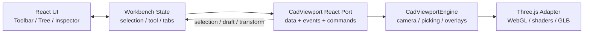
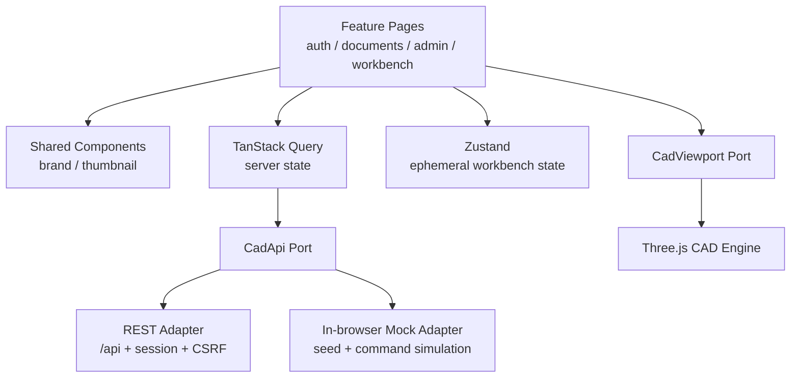
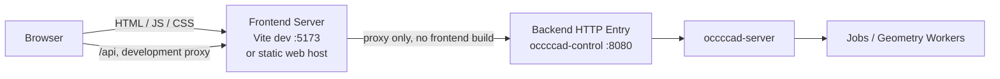

# occccad v0.0.9 前端应用架构

> 状态：已实现基线  
> 更新日期：2026-08-10  
> 目标：把静态 TypeScript Demo 重构为可独立开发、部署和演进的 CAD Web 应用

## 1. 本版本结论

v0.0.9 采用以下技术基线：

| 领域 | 选择 | 责任边界 |
|---|---|---|
| 应用框架 | React 19 + TypeScript | 页面、组件和交互组合 |
| UI 组件 | Ant Design 6 | Button、Form、Modal、Drawer、Tree、Tabs、Table 等统一视觉语言 |
| 服务端状态 | TanStack Query 5 | 请求、缓存、失效、加载和错误状态 |
| 客户端状态 | Zustand 5 | 工作台 Tab、选择集、草图工具和 Inspector 状态 |
| 路由 | React Router 7 | 文档中心与 `/documents/:documentID` 工作台路由 |
| 构建/开发 | Vite 8 | HMR、环境模式、API 代理和生产构建 |
| CAD 显示内核 | Three.js 0.179 | Mesh/GLB、边线、拾取、相机和 Manipulator |

所有业务对话框、菜单、表单、树、标签页、列表和反馈都使用 Ant Design；Canvas 内部的坐标轴、
选中轮廓、草图反馈和实例手柄属于 CAD Viewport，不强制使用 DOM UI 组件。

## 2. Three.js 与 vtk.js 决策

本版本继续使用 Three.js，不切换 vtk.js。

occccad 当前的显示数据是曲面三角网格和 GLB，后续重点是 CAD 相机、边线、面/边/点拾取、选择轮廓、
草图覆盖层、装配手柄和自定义 Shader。Three.js 对上述实时图形能力更直接，现有协议和实现也无需迁移。
vtk.js 更适合科学可视化中的体数据、医学影像、切片和标量场管线；如果未来加入 CAE 后处理，可把 vtk.js
作为独立 Analysis Viewport，而不是替换建模 Viewport。

应用代码不得直接持有 `THREE.Scene`、Renderer 或 Controls。Three.js 被封装在
`CadViewportEngine` 中，React 只通过 `CadViewport` 的属性、事件与少量命令调用它。这样未来可以重写
Renderer，或针对 Analysis 文档接入 vtk.js，而不改变 Toolbar、结构树和业务命令。

当前 Engine 使用事件驱动的按需渲染：相机、选择、Transform、模型或尺寸变化时只合并请求一帧，不运行
永久动画循环；Orbit 不启用惯性，近平面/远平面随模型包围球和视距动态更新。这既减少空闲 GPU 占用，也
避免 CAD 相机出现拖尾和迟滞感。



`CadViewportEngine` 是当前渲染适配器，不是领域状态存储。文档、Feature、Command 和 Undo/Redo 的真相仍在
API/PostgreSQL；Viewport 可以随时根据 `DocumentView` 重建。

## 3. 前端分层



目录责任如下：

```text
web/apps/cad/src/
├── app/                 路由、Provider、Query Key
├── features/            按业务能力组织页面和复合组件
│   ├── auth/
│   ├── admin/
│   ├── documents/
│   └── workbench/
├── components/          不包含页面业务的共享 UI
├── api/                 REST/Mock 适配器选择
├── state/               跨组件客户端状态
├── viewport/            React 显示端口和 Three.js 引擎
├── types.ts             前后端交换模型
└── styles.css           应用布局和 CAD 特有样式
```

边界规则：

1. Feature 页面不直接调用 `fetch`，只调用统一 `CadApi`。
2. 远端数据不复制进 Zustand；通过 Query Key 缓存，命令成功后精确失效。
3. 临时选择、当前工具和打开的 Tab 不写入数据库。
4. Viewport 不发 HTTP 请求，也不实现 Undo/Redo。
5. 通用 UI 首先组合 Ant Design；只有 CAD 布局与 Canvas Overlay 使用项目样式。
6. Workbench 和 Admin 按路由/使用时动态加载，避免文档中心首屏载入 Three.js。

## 4. 前后端分离后的进程边界



- `invoke run.app` 只构建并启动后端，不执行 pnpm，也不依赖 `dist/`。
- `occccad-server` 只提供 API；访问根路径会返回服务信息，不回退到 `index.html`。
- 开发时 Vite 把 `/api` 代理到 `VITE_API_PROXY_TARGET`，浏览器保持同源 Session/CSRF 语义。
- 生产时由独立 Web Server/CDN 托管前端（需要把非静态文件路由回退到 `index.html`），并由反向代理把
  `/api` 转发到 Control Plane。
- 确需浏览器直接跨域调用 API 时，通过 `OCCCCAD_ALLOWED_ORIGINS` 显式列出 Origin；不使用带凭据的通配符。

## 5. 两种前端开发模式

安装依赖一次：

```bash
cd web
pnpm install
```

### 5.1 无后端 UI/CAD 调试（默认）

```bash
invoke run.web
# 等价于 invoke run.web --mode=mock
```

浏览器访问 `http://localhost:5173`。Mock Adapter 提供管理员会话、Part/Product、Feature、装配实例、
文档 CRUD 和建模命令的内存实现，可直接调试文档中心、工作台、结构树、对话框和 Viewport。刷新页面会恢复
Seed 数据；Mock 标识始终显示在顶部，避免误认为已经写入数据库。

### 5.2 对接真实后端

终端一：

```bash
invoke run.app --build-type=Debug
```

终端二：

```bash
invoke run.web --mode=api
```

默认代理到 `http://127.0.0.1:8080`。如果入口不同，在
`web/apps/cad/.env.development.local` 设置：

```dotenv
VITE_API_PROXY_TARGET=http://127.0.0.1:8080
```

`.local` 文件不得提交。也可以设置 `VITE_API_BASE_URL` 让浏览器直接访问 API，此时后端必须配置准确的
`OCCCCAD_ALLOWED_ORIGINS`。

VS Code 提供 `occccad: Frontend (mock)` 和 `occccad: Frontend (API)` 两个浏览器调试配置，能够在 TSX、
状态控制和 Viewport 源码中设置断点。

## 6. 已迁移的应用能力

- 登录、注册和 Mock 开发身份；
- 文档中心的 Folder、搜索、筛选、分页、创建、编辑、删除和恢复；
- 管理员统计、账号列表、创建、审批、角色和密码管理；
- 路由式 Part/Product 工作台和可关闭多文档 Tab；
- 统一 Command Ribbon、Feature/Assembly Tree、Inspector 和 History；
- 基准面、草图、矩形、拉伸、STEP、插入实例、引用模式和 Undo/Redo；
- Three.js CAD 相机、选择高亮、草图反馈和 Product 实例手柄；
- PC 首先的专业工作区与窄屏降级布局。

旧的命令式 DOM 初始化、手写 Dialog/Toolbar/Tab 以及后端静态文件托管已移除。

## 7. 后续扩展规则

### UI

- 新页面按 Feature 增加目录；跨 Feature 复用达到两处后再提升到 `components/`。
- 禁止引入第二套全量 UI 框架；特殊能力优先使用 Ant Design 扩展或无样式 Headless 库。
- 大型能力必须懒加载，包括 Constraint Editor、Drawing、CAE 和大型文件预览。

### CAD Viewport

Viewport 后续按以下顺序演进：

1. 拆分 CameraController、SelectionManager、SceneSynchronizer、Manipulator 和 RenderPipeline；
2. 增加 face/edge/vertex Selection ID Pass 与稳定拓扑标识；
3. 增加轮廓线、隐藏线、Section Plane、草图深度策略和 GPU Picking；
4. 增加材质/主题 Token、自定义 Shader 与大装配分层加载；
5. 通过性能基准决定 WebGL2、WebGPU 或混合 Renderer，不把选择直接泄漏到页面层。

### 前端验证

- 前端不维护单元测试体系；
- 生产构建必须执行 `invoke web.build`，同时完成 TypeScript 类型检查和 Vite 生产构建；
- Mock 与真实 API 模式分别通过独立启动和人工验收验证关键流程。

## 8. 本版本验收

```bash
invoke web.build
invoke run.web --mode=mock
invoke run.web --mode=api
cd services && go test ./...
```

验收标准是：Mock 模式不启动 PostgreSQL、Go 或 C++ 进程即可进入完整界面并操作；API 模式使用同一套 UI
和 Viewport 对接真实后端；停止前端不会停止后端，停止后端也不阻止 Mock 模式启动。
