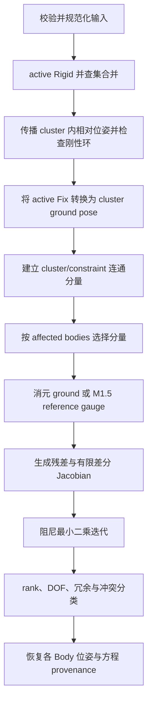

# 当前三维装配约束求解算法

本文记录 `kernel/assembly` 当前已经实现的算法基线，用于代码审查、数值回归和后续替换求解后端。它描述的是可由
[`src/solver.cpp`](src/solver.cpp) 验证的事实，不代表 CATIA 或 DCM 的内部实现，也不把
[`SOLVER_ARCHITECTURE.md`](SOLVER_ARCHITECTURE.md) 中的目标能力描述为已经交付。

## 1. 输入、状态与目标函数

每个 Body 的位姿是从 body-local 坐标到世界坐标的刚体变换

\[
p_w = R p_l + t,\qquad T=(R,t)\in SE(3).
\]

Point、Axis、Plane 和 Cylinder 都以 body-local 不可变值描述；求解时才通过 Body 位姿变换到世界坐标。一个自由刚性
cluster 使用六维切空间增量

\[
\Delta x=[\Delta t_x,\Delta t_y,\Delta t_z,
           \Delta \theta_x,\Delta \theta_y,\Delta \theta_z]^T.
\]

平移直接相加，旋转采用旋转向量的指数映射左乘当前四元数：

\[
t' = t+\Delta t,\qquad R'=\operatorname{Exp}(\Delta\theta)R.
\]

所有 active constraint 的残差块按稳定约束顺序拼接为向量 `r(x)`，当前后端求解

\[
\min_x \frac{1}{2}\lVert r(x)\rVert_2^2.
\]

长度残差除以 `length_scale`，角度和方向残差除以 `angle_scale`，使不同量纲可以进入同一个范数。两者必须由调用方按
模型单位和容差策略显式设置，当前默认值都是 `1.0`。

RPC 使用 `AssemblySolverProfile schema_version=1` 传递求解策略；零值字段沿用 kernel 默认值。主要默认阈值为：length
convergence/classification `10⁻⁷`、angle convergence/classification `10⁻⁸`、translation step `10⁻⁹`、rotation step
`10⁻¹⁰`、degeneracy `10⁻⁸`、finite difference `10⁻⁷`、initial damping `10⁻⁴`、rank `10⁻⁹`。classification 可由
调用方独立设置，不参与迭代停止，但不得严于对应 convergence tolerance，否则模型请求无效。

## 2. 总体处理流水线



输入校验包括稳定 ID 唯一性、引用完整性、有限数、单位方向、合法半径、距离非负、角度位于 `[0, π]`、SolveIntent
body 存在且 moving/reference 不重叠。无效模型返回 `InvalidModel`，不会让异常越过公开求解接口。

## 3. 图编译

### 3.1 Rigid cluster

`Driving` 或 `Controlled` 的 `Rigid` 约束先通过并查集合并 Body。每条 Rigid 边保存创建约束时捕获的相对位姿；从按
Body ID 排序后选出的 cluster root 做广度优先传播，得到 `root_to_body`。若闭环通过不同路径计算出的相对位姿误差超过
`length_tolerance`、`angle_tolerance`，模型被判为不一致，而不是静默采用某一条路径。

cluster 的自由变量始终只有一个 `SE(3)` 位姿，因此含 N 个 Body 的刚性子装配从 `6N` 个切空间变量降为 6 个。最终
Body 位姿由下式恢复：

\[
T_{body}=T_{cluster}\,T_{root\rightarrow body}.
\]

### 3.2 Ground 消元

active `Fix` 的目标是显式 `fixed_pose`，未提供时使用 Body 初始位姿。若 Fix 施加在非 root Body 上，先反算 cluster root
目标：

\[
T_{root}^{*}=T_{body}^{*}\left(T_{root\rightarrow body}\right)^{-1}.
\]

grounded cluster 不进入数值变量。一个 cluster 上的多个 Fix 若不能导出同一 root pose，则直接报告无效模型。

### 3.3 Connected component 与局部求解

除 Fix/Rigid 外的 active constraints 在 cluster 之间建立无向边，并查集形成 connected components。空的
`affected_body_ids` 选择全部 component；否则只更新包含指定 Body 的 component，其他 component 保持名义状态并返回
`COMPONENT_NOT_SOLVED` 诊断。排序和 ID 生成以稳定 Body/cluster ID 为依据，避免依赖哈希遍历顺序。

`Measured` 约束不进入图和目标函数，但在最终位姿上计算残差；`Suppressed` 完全跳过；`Driving` 与 `Controlled` 当前采用
相同的数值驱动语义。

## 4. M1.5 moving/reference 规约

`SolveIntent` 是单次请求的解选择策略，不持久改变约束方向。Product 创建二元约束时将第一选择作为 moving、第二选择
作为 reference。

无物理 ground 的连通分量存在六维整体刚体运动自由度。若策略是 `MoveFirstMinimizeReference`，求解器按请求顺序找到
该 component 中第一个 reference body 所属 cluster，将它从数值变量中移除并保持初始位姿。这样第二选择成为 gauge
anchor，第一选择承担相对运动，但不会生成物理 Fix。

该消元只是选择同一相对解族的世界坐标规约，因此结果仍报告 `gauge_dof = 6`，`tangent_variable_count` 也补回被消元的
六个逻辑变量。若 component 已经被 Fix 物理接地，则不再使用 reference gauge；当前也尚未实现已接地系统中的严格
词典序最小 reference 位移，这属于 M3 层级/零空间优化。

## 5. 当前约束残差

记世界点为 `p`，轴为 `(o,d)`，平面为 `(o,n)`，其中方向均为单位向量。编译阶段从 nominal/warm-start pose 把
`Unoriented` 固定为 `Same` 或 `Opposite`，并把无符号距离固定到初始侧；迭代中不再换支。Angle 的
`Unoriented` 保留完整 `[0,π]` 语义。

| 约束与几何对 | 当前残差块 | 标量行数 |
|---|---|---:|
| Fix | 平移差 + 四元数相对旋转的 rotation vector | 6 |
| Rigid | 当前相对位姿与捕获相对位姿之差 | 6 |
| Coincident Point–Point | `(p₁-p₂)/L` | 3 |
| Coincident Point–Axis/Cylinder | `((p-o)×d)/L` | 3 |
| Coincident Point–Plane | `((p-o)·n)/L` | 1 |
| Coincident / Concentric Axis-like pair | 方向差 + `((o₁-o₂)×d₂)/L` | 6 |
| Coincident Cylinder–Cylinder | Axis-like 残差 + 半径差 | 7 |
| Coincident Plane–Plane | 法向差 + 有符号法向距离 | 4 |
| Angle，普通 `[0,π]` 目标 | `(atan2(‖d₁×d₂‖, d₁·d₂)-target)/A`（应用冻结方向支） | 1 |
| Angle，精确 0/π 目标 | `(d₁×d₂)/A` 与 `(d₁·d₂-cos(target))/A` | 4 |
| Distance Point–Point | `(‖p₁-p₂‖-target)/L` | 1 |
| Distance Point–Plane | 显式 signed/unsigned side 的法向距离差 | 1 |
| Distance Axis-like pair | 两条无限直线的最短距离差 | 1 |
| Distance Plane–Plane | 法向平行残差 + 显式 side 的距离差 | 4 |

表中 `L=length_scale`、`A=angle_scale`。某些向量残差含代数相关行，例如单位方向的三分量差并不总有三维独立 rank；
因此 DOF 不能用“残差行数相减”估计，而必须在求解点计算 Jacobian rank。Cylinder–Cylinder `Coincident` 检查半径相等，
`Concentric` 刻意不约束半径。

## 6. 有限差分 Jacobian

对每个自由 cluster 的六个切空间变量分别施加正向扰动 `h=finite_difference_step`：

\[
J_{:,j}\approx\frac{r(x+h e_j)-r(x)}{h}.
\]

当前默认 `h=10^{-7}`。实现使用前向差分而不是中心差分，也没有解析或自动微分 Jacobian。扰动后的残差维数必须不变且
全部有限，否则返回 `NumericalFailure`。几何和约束类型扩展必须保持每个残差块在一次求解中的维数稳定。

## 7. 阻尼最小二乘迭代

每轮构造阻尼正规方程

\[
(J^TJ+\lambda I)\Delta x=-J^Tr,
\]

并使用 Eigen `LDLT` 求解。它是当前确定性的 Levenberg–Marquardt 风格参考实现，但没有 trust-region gain ratio 或变量
尺度矩阵：

- 初始 `λ = initial_damping`，默认 `10⁻⁴`；
- 候选残差平方范数严格下降时接受步骤，并令 `λ=max(0.25λ,10⁻¹²)`；
- 否则拒绝步骤，并令 `λ=min(10λ,10¹²)`；
- 每个长度、角度方程分别满足 `length_tolerance`、`angle_tolerance` 时收敛；
- 平移、旋转增量分别低于 `translation_step_tolerance`、`rotation_step_tolerance` 但方程仍超限时返回 `Unsatisfied`；
- 默认最多 100 次迭代；非有限线性解返回 `NumericalFailure`。

若 component 没有自由变量且超过 convergence tolerance：同时超过 classification tolerance 时返回 `Inconsistent`，否则
返回 `Unsatisfied`。真正耗尽迭代预算才返回 `MaxIterations`。

## 8. Rank、DOF 与 gauge

收敛后重新计算 `J`，使用 Eigen `FullPivLU` 和 `rank_tolerance`（默认 `10⁻⁹`）求数值 rank `ρ`。设参与计算的自由
变量数为 `n`：

\[
nullity = \max(n-\rho,0).
\]

- 有物理 ground：`gauge_dof=0`，`relative_dof=nullity`；
- 无物理 ground 且没有显式 reference gauge 消元：从 nullity 中最多扣除 6 个整体刚体 gauge；
- 使用 M1.5 reference gauge 消元：数值变量已不含这 6 维，故 `relative_dof=nullity`，但逻辑变量数和
  `gauge_dof=6` 仍单独报告。

当前只报告整数 DOF 数量，不返回可解释的平移轴、转轴或 null-space basis。rank 是局部线性化结论，会受尺度、姿态、退化
几何和阈值影响。

## 9. 冗余、冲突与分类

冗余检测按规范输入中的 constraint block 顺序增量拼接 Jacobian 行。若加入一个完整 block 后 rank 不增加，则把该 constraint
标为 redundant；否则接受该 block。这个算法提供确定性的 whole-constraint 诊断，但结果与顺序相关，也不是最小冗余集。

求解结束后，所有非 Suppressed 约束都在最终 Body 位姿上按独立 classification tolerance 重新计算。`Unsatisfied`
component 的超差约束进入 `unsatisfied_constraint_ids`；只有零变量且超过 classification tolerance 的 `Inconsistent`
component 才写入 `conflicting_constraint_ids`。`MaxIterations` 和 `NumericalFailure` 不伪造任何冲突归因。

最终分类优先级为：

1. 数值失败或超过迭代条件：`NonConvergent`；
2. 零变量 component 超过 classification tolerance：`Inconsistent`；
3. 一般驻点仍超过 convergence tolerance：`Unsatisfied`；
4. 存在 whole-constraint 冗余：`Redundant`；
5. 存在 relative DOF：`SolvedUnderConstrained`；
6. 否则：`SolvedFully`。

每个残差标量生成稳定的 `constraint-id/equation/index`，并携带 Connection 与 Constraint provenance。当前“稳定”指同一规范
输入及残差定义下可重放；未来修改残差分解时必须考虑 equation identity 的版本化。

零变量违反证明的是当前冻结分支、ground 和给定约束条件不可相容；一般非线性驻点只标记 `Unsatisfied`。当前
`conflicting_constraint_ids` 仍不是 MUS：它是已证明不一致 component 中超差的约束邻域。

## 10. 确定性、复杂度和已知边界

cluster、component 及冗余/冲突 ID 集合会显式排序；Body 与方程结果保留规范输入顺序。相同规范输入、选项和初始位姿
应得到语义等价结果。该保证不意味着不同 CPU/Eigen 版本下浮点位完全一致，也不意味着未规范化的 constraint 排列会给出
完全相同的冗余归因对象。

设一个 component 有 `b` 个自由 cluster、`n=6b` 个变量、`m` 个残差标量。每轮前向差分需要约 `n+1` 次残差计算；
正规方程会形成 `n×n` 矩阵，因而大装配的主要成本随 component 大小快速增长。connected-component 分解和 ground/rigid
消元是当前最主要的规模控制手段，尚未使用稀疏 Jacobian、增量因子分解或并行 component 求解。

M1.6 还为近平行直线距离引入以 `degeneracy_tolerance` 为尺度的 blended 退化极限；除极小的
`kDirectionEpsilon` 保护分支外，它在 skew 与 parallel 公式之间连续过渡。该表达是工程正则化而非无限直线距离的唯一解析
延拓，仍需用容差边界 sweep 验证 bias、Jacobian 和 rank。
当前算法还不具备：解析 Jacobian、QR/SVD rank 诊断、null-space 方向、最小冲突集、全局多分支枚举、严格层级最小位移、
拖拽流形投影、一般曲面接触和大规模稀疏图优化。上述能力的引入顺序见架构路线图，不能从本文的 M1/M1.5 基线推断为
已经实现。

## 11. 已确定的后续升级流程

后续工作先修正残差和状态语义，再替换微分与线性代数实现，避免为不稳定方程编写解析 Jacobian：

M1.6 鲁棒性门已经落地：Angle 使用 unsigned `atan2` 和端点对齐残差，一次 solve 内冻结方向和适用的距离侧分支；
版本化 SolverProfile 已贯穿 Proto/Worker/Go；`Unsatisfied`、`Inconsistent` 与 `NonConvergent` 拥有不同证据边界。

当前产品切片在此基础上增加了受限的有向平面角：请求携带第二刚体局部坐标中的 reference direction 时，残差用
`atan2(k dot (a cross b), a dot b)` 保留 `[0,2*pi]` sector，因此 90 度与 270 度不再折叠。没有 reference direction
的轴线角仍严格是 `[0,pi]` unsigned angle；多圈 winding 仍不属于静态装配 Revision。
其中 `k dot (a cross b)` 必须直接参与残差，不能实现成 `sign(k dot cross) * norm(cross)`，后者在 180 度产生不可微尖点。
包含有向角的 component 对候选步使用固定上限次数的二分回溯线搜索；这允许大角度编辑在保留 Coincident 等耦合约束的
同时逐步下降，而不改变普通约束在反平行奇异初值处已经验证过的 LM 扰动行为。
对于显式 Same/Opposite 的 Plane-Plane Coincident，若当前法向恰好处于目标 branch 的反点，法向差目标存在零梯度鞍点。
初始化阶段会选择与法向最不平行的规范世界轴，构造绕第一支持平面原点的确定性半周 seed，并补偿法向距离；该 seed 只决定
离散 branch 初值，其他约束仍由同一 component 的数值求解统一满足。

1. **M2 方程与线性代数**：建立 typed equation registry 和解析 Jacobian，以中心有限差分做 differential check，使用
   SVD 或 rank-revealing QR，并返回 null-space basis 与可解释 DOF 方向。
2. **M3 稳定解与交互**：把当前自动 reference direction 的平面切片升级为可选择 axis/sense 的完整 `DirectedAngle`，持久化离散 branch intent；利用
   null space 实现 minimum-motion、minimum-reference displacement 和 Drag 投影。

静态装配只保存 modulo `2π` 的姿态分支，多圈累计角属于 Interaction、Kinematics 或 Simulation 状态。MUS/minimal
conflict set 不在近期关键路径上；当前优先保证残差连续性、分支稳定性和 DOF 可解释性。

## 12. 回归验证

邻近场景测试覆盖具体残差行为；[`tests/assembly-corpus`](../../tests/assembly-corpus) 覆盖 canonical DOF、刚性聚类、
ground 消元、gauge、重复/冲突/退化输入、排列不变性、冷/热启动语义以及 M1.5 moving/reference。运行：

```sh
cmake --build build/cmake/debug \
  --target occcad_assembly_solver_scenarios occcad_assembly_solver_corpus
ctest --test-dir build/cmake/debug \
  -R '^(assembly|assembly-corpus)/' --output-on-failure
```
