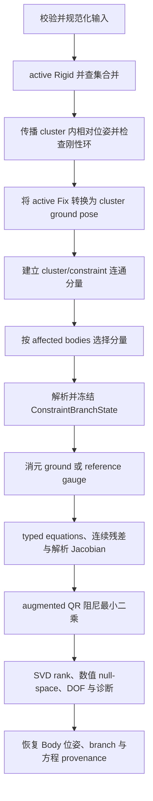

# 当前三维装配约束求解算法

本文记录 `kernel/assembly` 当前已经实现的算法基线，用于代码审查、数值回归和后续替换求解后端。它描述的是可由
[`src/solver.cpp`](src/solver.cpp) 验证的事实，不代表 CATIA 或 DCM 的内部实现，也不把
[`SOLVER_ARCHITECTURE.md`](SOLVER_ARCHITECTURE.md) 中的目标能力描述为已经交付。

## 输入、状态与目标函数

每个 Body 的位姿是从 body-local 坐标到世界坐标的刚体变换

\[
p_w = R p_l + t,\qquad T=(R,t)\in SE(3).
\]

Point、Axis、Plane、Cylinder、Circle、Sphere、Cone、Frame 都以 body-local 不可变值描述；求解时才通过 Body 位姿变换到 owning Product 数值框架。长度/半径/坐标是 mm，角度/锥半角为 rad，Frame 是右手正交四元数姿态；Quantity 源值为 SI，由控制面统一数量编译边界转换后进入 Worker。求解器不解析 B-Rep、Publication、数据库或 HEAD。一个 solver Body 是装配 occurrence 运动单元，不是 Part 内 CAD Body。一个自由刚性
cluster 使用六维切空间增量

\[
\Delta x=[\Delta t_x,\Delta t_y,\Delta t_z,
           \Delta \theta_x,\Delta \theta_y,\Delta \theta_z]^T.
\]

平移直接相加，旋转采用旋转向量的指数映射左乘当前四元数：

\[
t' = t+\Delta t,\qquad R'=\operatorname{Exp}(\Delta\theta)R.
\]

所有 active constraint 的残差块按稳定约束顺序拼接为向量 `r(x)`。几何恢复最小化
`||r(x)||²/2`；满足硬几何语义后，按词典序最小化 `(E_ref(x), E_all(x))`。
运动目标不与几何残差加权混合，定义与收敛条件见第 4、7 节。

长度残差除以 `length_scale`，角度和方向残差除以 `angle_scale`，使不同量纲可以进入同一个范数。两者必须由调用方按
模型单位和容差策略显式设置，当前默认值都是 `1.0`。

当前 Worker/控制面求解合同 build/policy 为 `assembly-m4m5-reference-retraction-v13`，控制面新建/显式编辑采用公共 definition v2；八类 descriptor、独立参考轴与分阶段组证据进入冻结 manifest schema 1/profile schema 2。manifest 的 `CANONICAL_JSON_V1` 与旧字段形状摘要兼容由控制面负责，native 不改写历史或查询新几何。允许有限精确 Point–Curve 的 Line/Circle、Point–Surface 的 Plane/Cylinder/Sphere/选定叶 Cone；不声明任意曲线/曲面、网格接触或隐式 Frame 转换，Frame 其他组合必须显式派生子元素。

RPC 使用 `AssemblySolverProfile schema_version=2` 传递求解策略；普通零值字段沿用 kernel 默认值；optional `max_preference_iterations` 显式为零表示不给偏好迭代预算。主要默认阈值为：length
convergence/classification `10⁻⁷`、angle convergence/classification `10⁻⁸`、translation step `10⁻⁹`、rotation step
`10⁻¹⁰`、degeneracy `10⁻⁸`、translation/rotation finite difference `10⁻⁶/10⁻⁷`、initial damping `10⁻⁴`、
rank absolute/relative `10⁻¹⁰/10⁻⁸`。classification 可由
调用方独立设置，不参与迭代停止，但不得严于对应 convergence tolerance，否则模型请求无效。

## 总体处理流水线

```mermaid
flowchart TD
    A[校验并规范化输入] --> B[active Rigid 并查集合并]
    B --> C[传播 cluster 内相对位姿并检查刚性环]
    C --> D[将 active Fix 转换为 cluster ground pose]
    D --> E[建立 cluster/constraint 连通分量]
    E --> F[按 affected bodies 选择分量]
    F --> G[解析并冻结 ConstraintBranchState]
    G --> H[消元 ground 或 reference gauge]
    H --> I[typed equations、连续残差与解析 Jacobian]
    I --> J[augmented QR 阻尼最小二乘]
    J --> K[SVD rank、数值 null-space、DOF 与诊断]
    K --> L[恢复 Body 位姿、branch 与方程 provenance]
```

输入校验包括稳定 ID 唯一性、引用完整性、有限数、单位方向、合法半径、无符号距离非负、无轴/指定轴 Angle 均位于 `[0, 2π]`、SolveIntent body 存在且同一 body 不同时指定为 moving/reference。不同 body 可以经 Rigid 合并到同一 cluster；运动角色仍是 occurrence 级偏好，不构成硬约束或组之间的排他关系。无效模型返回
`InvalidModel`，不会让异常越过公开求解接口。

## 刚性聚类、接地消元与连通分量

### 刚性聚类

`Driving` 或 `Controlled` 的 `Rigid` 约束先通过并查集合并 Body。每条 Rigid 边保存创建约束时捕获的相对位姿；从按
Body ID 排序后选出的 cluster root 做广度优先传播，得到 `root_to_body`。若闭环通过不同路径计算出的相对位姿误差超过
`length_tolerance`、`angle_tolerance`，模型被判为不一致，而不是静默采用某一条路径。

cluster 的自由变量始终只有一个 `SE(3)` 位姿，因此含 N 个 Body 的刚性子装配从 `6N` 个切空间变量降为 6 个。最终
Body 位姿由下式恢复：

\[
T_{body}=T_{cluster}\,T_{root\rightarrow body}.
\]

### 接地消元

active `Fix` 的目标是显式 `fixed_pose`，未提供时使用 Body 初始位姿。若 Fix 施加在非 root Body 上，先反算 cluster root
目标：

\[
T_{root}^{*}=T_{body}^{*}\left(T_{root\rightarrow body}\right)^{-1}.
\]

grounded cluster 不进入数值变量。一个 cluster 上的多个 Fix 若不能导出同一 root pose，则直接报告无效模型。

### 连通分量与局部求解

除 Fix/Rigid 外的 active constraints 在 cluster 之间建立无向边，并查集形成 connected components。现代 DIRECTED Angle 的独立 `angle_reference_geometry` 也把参考轴 owning body 加入同一 component；第三 body 的旋转进入解析 Jacobian，不假定该轴属于第二选择或固定世界。空的
`affected_body_ids` 选择全部 component；否则只更新包含指定 Body 的 component，其他 component 保持名义状态并返回
`COMPONENT_NOT_SOLVED` 诊断。排序和 ID 生成以稳定 Body/cluster ID 为依据，避免依赖哈希遍历顺序。

适用的 `Measured` 约束不进入图和目标函数，但在最终位姿上计算残差；Contact 不接受 Measured。`Suppressed` 完全跳过；`Driving` 与 `Controlled` 当前采用
相同的数值驱动语义。

## 静态解选择与名义位姿

Product ADD/EDIT/preview/commit 共用 `assemblyConstraintSolveIntent()`：第一选择 moving、第二选择 reference。
约束本身不增加持久主从方向。`Body.initial_pose` 是本次操作前冻结的名义位姿与分支基线，`initial_guess` 仅初始化数值变量；
Rigid 成员提供的多个 seed 必须符合捕获的刚性关系，未选择的 affected component 不应用 seed。

每个连通分量严格保留 Fix/Rigid 和全部有效几何方程，按以下顺序选择解：

1. 恢复几何可行性；
2. 在可行流形上最小化 reference occurrence 的名义位姿变化平方和；
3. 在 reference 的局部最优子空间内最小化全部 occurrence 的名义变化平方和。

运动度量是 `||t-t0||²/L² + ||Log(R0^T R)||²/A²`，L/A 为独立运动尺度，不是几何容差。
目标按 occurrence 而非 cluster 代表原点计算，包含刚性成员力臂。旋转 Log Jacobian 与左旋转增量一致，Debug 有中央差分 oracle；
π 处是旋转坐标图切口，oracle 只排除跨切口的旋转行，不将它们当普通光滑导数。

无物理 ground 且只有一个 reference cluster、其 reference 名义位姿与捕获刚性关系一致时，仍可等价消去全局 gauge；
否则保留 reference 变量。第一元素 Fix、间接接地或部分受限时，第二元素始终在同一问题内承担必要运动。
多个 reference 联合优化，不固定列表中第一个。原 moving/neutral/reference 弱权重已删除，未增加临时 Fix 重试路径。

`preference.status` 与几何 `SolveStatus` 独立：可行但偏好预算耗尽/停滞仍返回可行 Pose 和 `PREFERENCE_NOT_CONVERGED` 诊断，
Product 拒绝将它当作从动成功提交；不会误报为几何冲突。响应包含每体角色及平移/旋转变化、两层目标值、最终投影梯度、
迭代数和尺度。普通 ADD/EDIT 保持上述静态合同；连续交互使用下面的显式目标策略，不注入临时 Fix。

## 操纵目标与意图保持

`SolverOptions.drag_target` 指定 body、body-local 抓取点、owning Product 中的目标 pose、冻结参考旋转及平移/旋转分量 mask。位置误差是参考帧中的
`R_frame^T ((R p_grab+t)-(R_target p_grab+t_target))/L`；旋转误差使用目标旋转到当前旋转的短弧 Log，变换到相同参考帧后除以 A。
未参与的分量没有驱动残差。该目标不增加物理方程，不改变 rank、DOF 或固定基准。

v12 显式交互策略的顺序为硬几何恢复 → driven task → held task → total nominal motion。
两组互斥 mask 区分用户驱动分量、希望保持的分量及完全自由分量；held task 使用同一抓取点/短弧旋转残差及解析 Jacobian，不是物理方程。平移保留初始姿态和非驱动方向；绕心旋转的 target pose 已包含绕 pivot 的平移，不用原点位移压制该运动。L/A 仍是既有无量纲尺度，没有新极端权重。抓取点与姿态联合目标避免局部原点位置决定“用旋转替代平移”；受硬约束需要的旋转仍可发生。
显式交互在零残差上构造优先级保留核时，对 `J_priority * diag(L,L,L,A,A,A)` 逐行归一化后再投影到现有正交核。行缩放不改变零残差可行子空间，只避免力臂/尺度差异把独立的姿态保持行误判为秩缺失；不改物理 rank、任务能量权重或成功容差。
显式 held profile 先构造目标 body 对应的 rigid-cluster pose seed，只在原硬约束/branch 的非线性恢复成功且 driven 能量不恶化时采用；不 recapture nominal/组关系。不适用的固定 cluster 和恢复失败回到通用路径。没有 hold mask 的旧交互及静态 ADD/EDIT 保留原 reference → total 静态策略。
在 `J * diag(L,L,L,A,A,A)` 的正交核上求目标步，而不是对外部原始 basis 直接计算 `Z Z^T`；每个试步都调用原硬约束的有界非线性 retraction。
后续偏好复用静态层级优化 的先行标量目标切空间：零目标使用目标 Jacobian 的核，非零目标使用受限 Lagrangian 曲率的核，保留球面中心目标等平坦 argmin 的真实自由度。
仅当残差为零或在该 argmin 上恒定时，retraction 同时保持冻结目标残差；其他平坦情形使用硬 retraction 与冻结标量能量上界，不混成加权和、不冻结不必要的残差向量。
曲率乘子包含先行目标的适用导数行，但这些行不进入物理 rank。
无 ground 时不消去 reference gauge，允许整个连接组件运动。
`initial_pose` 始终是手势冻结 nominal；`initial_guess` 仅提供前一接纳帧。组捕获关系没有重新采样。
Undefined 的适用对齐关系在交互求值分支中按 `initial_pose` 解析为 Same/Opposite；legacy Unsigned 的 Point/Line/Plane—Plane 侧也按同一冻结基线解析。
`alignment_branches`/`distance_branches` 返回 typed 求值证据，原定义仍为 Undefined/Unsigned；不会随 warm start、相机或某次鼠标目标重新选择。SelectedPlaneNormalV1、Angle 及显式 Contact branch 的原语义保持。
交互 body freedom 使用 owning Product 中的绝对瞬时子空间，包含允许的整体 gauge；静态求解 继续使用相对锚点解释。component 的 relative/gauge DOF 分开报告，两者都不是有限旅行保证。

目标投影梯度足够小且非零误差时，还检查受限 Lagrangian 曲率；负曲率驻点不能被认证为最近可行局部最优。
`InteractionEvidence` 将硬可行、目标优化收敛和提交资格分开：Reached/Constrained 是局部结论；Budget/Cancelled/Failed 不可提升候选。
另外分别返回 hold convergence、hard error、目标/保持最优性、终止阶段/原因和迭代/恢复计数；iteration limit、no descent、retraction failure、lower-preference 丢失上层驻点、hold 停滞和取消不再统称网络超时。墙钟 deadline 在 Worker 边界与显式取消区分；单次矩阵分解的取消粒度不改变。
不可达目标不触发持久冲突 probe，不尝试随机翻转 Undefined 分支。角度静态意图与 Session winding 的运输由调用方绑定，kernel 不写 Revision。
`should_cancel` 在迭代、回溯及 retraction 检查；单次密集 QR/SVD 分解不可中断，这也是当前取消粒度限制。
pose-only 交互仍计算全硬约束的 component rank、null-space 及每条方程残差，但不重复逐定义的累计增量 rank/冗余审计，返回 `INTERACTION_CONSTRAINT_RANK_AUDIT_FROZEN`。
逐定义证据由 Session 的已接受输入基线绑定；普通静态求解及 局部诊断 probe 继续执行该审计，不把缺少本帧审计解释为新证明。

## 精确支持与方程编译

记世界点为 `p`，轴为 `(o,d)`，平面为 `(o,n)`，其中方向均为单位向量。无向对齐 `Unoriented` 在当前迭代选择最近的 `Same`/`Opposite` 分支，残差与解析 Jacobian 使用同一符号；初始姿态不排除另一个可行分支。无符号距离仍固定到初始侧。Angle 的
`Unoriented` 保留完整 `[0,π]` 语义。无向对齐的错误半球驻点通过最多16次刚性 cluster 半周初值探测恢复；探测仅改 initial_guess，不改 nominal、硬约束或 motion intent，成功后仍做完整偏好优化，失败保留原诊断。

Distance `SelectedPlaneNormal` 是显式用户符号合同：`n_selected·(p_first-p_second)-target`，双平面选第一法向，否则选唯一平面。双平面保留独立的 Same/Opposite/Unoriented 法向方程；解析 Jacobian 使用所选法向的旋转导数。唯一平面位于第一位置时，既有点/轴—平面内部复用路径仅局部变换残差符号，不交换运动意图。旧 Along/OppositeSecondNormal 方程保留。新双平面 Driving 的错误半球驻点复用上述 seed 探测（Measured 不参与）；未改优化层级、rank 或容差。

| 约束与几何对 | 当前残差块 | 标量行数 |
|---|---|---:|
| Fix | 平移差 + 四元数相对旋转的 rotation vector | 6 |
| Rigid | 当前相对位姿与捕获相对位姿之差 | 6 |
| Coincident Point–Point | `(p₁-p₂)/L` | 3 |
| Coincident Point–Axis/Cylinder | `((p-o)×d)/L` | 3 |
| Coincident Point–Plane | `((p-o)·n)/L` | 1 |
| Coincident / Concentric Axis-like pair | 方向差 + `((o₁-o₂)×d₂)/L` | 6 |
| Coincident Cylinder–Cylinder | Axis-like 残差 + 半径差 | 7 |
| Coincident Plane–Plane | 法向差 + 有符号法向距离 | 4 |
| Angle，普通 `[0,π]` 目标 | `(atan2(‖d₁×d₂‖, d₁·d₂)-target)/A`（应用冻结方向支） | 1 |
| FREE Angle，0/π/2π 驱动端点 | 目标方向的向量差，独立秩 2；Measured 仍是标量角 | 3 |
| Coincident Point–Circle | 圆平面入射 + 径向距离差，独立秩 2 | 2 |
| Coincident Point–Sphere/Cone | 球半径关系 / 所选锥叶曲面关系，正常独立秩 1 | 1 |
| SurfaceIncidence Point–Cylinder | 柱曲面半径关系，独立秩 1，不代替旧 Point–Cylinder axis 入射 | 1 |
| Coincident Frame–Frame | 原点差 + 三个帧轴差，独立秩 6 | 12 |
| Distance Point–Point | `(‖p₁-p₂‖-target)/L` | 1 |
| Parallel | 冻结方向支后的单位方向差，独立秩 2 | 3 |
| Perpendicular | 两单位方向点积，独立秩 1 | 1 |
| Distance Point–Axis | 点到无限轴的径向距离差 | 1 |
| Distance Axis–Plane | 轴与法向垂直 + 法向偏移差 | 2 |
| Distance Point–Plane | 显式 signed/unsigned side 的法向距离差 | 1 |
| Distance Axis-like pair | 两条无限直线的最短距离差 | 1 |
| Distance Plane–Plane | 法向平行残差 + 显式 side 的距离差 | 4 |

表中 `L=length_scale`、`A=angle_scale`。某些向量残差含代数相关行，例如单位方向的三分量差并不总有三维独立 rank；
因此 DOF 不能用“残差行数相减”估计，而必须在求解点计算 Jacobian rank。Cylinder–Cylinder `Coincident` 检查半径相等，
`Concentric` 刻意不约束半径。

零目标的驱动点点/点线 Distance 在图编译前转换为 Coincident，以保留 3/2 阶约束；Measured 保留原标量测量。显式 Parallel 的反向端点使用半周 seed，Perpendicular 从精确平行初始状态使用四分之一周 seed；两者保持支持锚点，不附加平面平移条件。

Directed Angle 先把两个方向投影到 reference axis 的法平面，再用投影单位向量计算
`atan2(k·(a×b),a·b)`；投影退化会明确拒绝模型。所有 Angle 使用 `atan2(sin(delta),cos(delta))` 的最短周期误差。
`AngleBranchState` 保存 wrapped/unwrapped/winding，输入上一状态时返回最邻近的等价角；跨请求保存由调用者负责。

现代参考轴是显式 `angle_reference_geometry` 和 `reverse_angle_reference`，在其 own body 中变换，支持独立第三组件；其解析旋转导数进入残差，不增加隐含的两方向垂直于轴关系。旧 `angle_reference_direction` 继续按第二 body-local 解释旧冻结输入，两字段不能并存。交换支持或反转轴按有向角变换目标，不改来源 owner；静态 branch 和多圈 session winding 分离。

### 解析 Contact

[`contact.cpp`](src/contact.cpp) 的前向解析微分计算 first/second origin/axis 共 12 输入偏导，native 再链到 cluster SE(3) 切空间。它不是另一套 solver/命令逻辑。Plane.axis 已是材料外法向；曲面规范径向法向乘 `m=±1`。External 相触材料法向相反，Internal 同向；Circle 整圆支撑不制造材料相切法向。令 `A=leaf·axis`、半角 `0<α<π/2`，`e=(side==External)==(m₁m₂>0)`。

| 分支 | 原始几何残差/常量门 | 一般独立秩 |
|---|---|---:|
| Plane–Plane face | 材料法向 Same/Opposite 向量差 + 平面高度 | 3 |
| Plane–Cylinder line | 柱轴与平面法向点积 + 中轴高度减 `branch·R` | 2 |
| Plane–Sphere point | 球心高度减 `branch·R` | 1 |
| Cylinder–Cylinder line | 轴对齐 + 径向间距减 `e ? R₁+R₂ : abs(R₁-R₂)` | 3 |
| Cylinder–Cylinder face | 等半径/材料门 + 轴对齐 + 横向位置 | 4 |
| Sphere–Sphere face | 等半径/材料门 + 球心差；不是外切 | 3 |
| Sphere–Cone ring | 材料门 + `C_s-O_c-(R/sinα)A` | 3 |
| Sphere–Circle ring | `C_circle-C_s-branch·sqrt(R²-r²)n_circle`；`r>R` 拒绝 | 3 |
| Cone–Cone line | 叶轴夹角减半角和/差 + 锥顶差叉共同单位母线 `g` | 3 |
| Cone–Cone face | 等半角/材料门 + 叶轴差 + 锥顶差 | 5 |
| Cone–Circle ring | 叶轴/圆轴平行 + `C_circle-O_c-(r/tanα)A` | 5 |

Plane–curved 的 branch 必须与侧别/材料相容：External 为 `m_curved`，Internal 为 `-m_curved`；非法 branch 明确诊断，不静默翻参数。face/Sphere–Cone 同规范法向分支要求 `m₁m₂=External?-1:+1`。Sphere–Cone 给定所选叶后只有正叶轴高度，±branch 不是第二个球心分支；Sphere–Circle 才有正负高度，赤道 `r=R` 高度零仍三秩。Cone–Cone 母线满足 `g·Aᵢ=cosαᵢ`，所选叶上采样验证共同母线及材料切法向；相等半角的内线接触退化为 face，不能猜秩为三。常量门、不合法 descriptor、可恢复数值初态退化分别诊断。

接触初值包含同轴 Cylinder line 径向 seed、平行 Cone line 选叶角度 seed、Plane–Cylinder 轴平行法向的 90° seed，以及 Plane–Plane face 材料目标反极点的 180° seed。后两者是零角梯度初态，并不表示目标 unsupported。seed 只变 trial pose，绕所选支持锚点转动整个自由 cluster，保留组捕获关系、名义/Fix 位姿、全部内部/外部方程、容差与运动意图；每次仍由正式求解与独立最终几何验收。

公共 v2 在控制面编译为这些原语；完整 Fix Together 的 `groupStages` 则在冻结 manifest 编排中先解组内、成功后构造内部 Rigid，再解组外。native Rigid 只消费已捕获相对姿态，不拥有组 ID/编辑/嵌套生命周期。内部或外部数值/偏好失败不得晋升新捕获关系或候选位姿。

## 解析 Jacobian 与差分 oracle

当前八类纯值 descriptor 与 Contact/精确入射能力由内部 typed equation registry 编译为带语义 equation kind、declared generic rank
和稳定 provenance 的残差行。生产 Jacobian 使用前向解析微分值类型，在同一次方程计算中传播值及其对稳定自由 cluster
切空间顺序的导数。点的旋转导数包含相对 cluster 原点的力臂，因此支持点偏离原点时不会漏掉旋转引起的平移。

中央有限差分只作为可配置的 differential oracle：Debug 默认启用，逐列对比解析矩阵并使用 scale-aware tolerance；差异超限
直接失败，不静默切回数值微分。周期 Angle 行在 oracle 中先计算最短周期差，避免跨 `2π` 把等价残差误判为导数错误。

对每个自由 cluster 的六个切空间变量分别施加正负扰动：

\[
J_{:,j}\approx\frac{r(x+h_j e_j)-r(x-h_j e_j)}{2h_j}.
\]

平移和旋转使用独立默认步长 `10^-6` 与 `10^-7`。正负扰动复用已冻结 branch，残差维数必须一致且全部有限，否则返回
`NumericalFailure`。兼容字段 `finite_difference_step` 非零时仍可覆盖两者，新调用方应使用分离字段。

## 分支、连续目标与可行性恢复

几何恢复沿用 增广 `ColPivHouseholderQR` 阻尼最小二乘，不形成正规方程，也不再加入弱运动权重。
几何恢复阻尼按每个 body 的平移/旋转 Jacobian block 范数缩放，避免长力臂下把毫米与弧度当作同等步长。
平移阻尼下界为 `1/length_scale²`，而非无量纲常量 1：长度残差已经除尺度，旧下界会在大尺度下过罚平移，使非原点 Point–Point/Point–Axis Offset 长期绕转停滞。此修复仅调整数值预条件，不改变残差、运动目标、秩或成功容差。
用实际下降与线性模型预测下降的比值调整 damping，不因任意微小下降就持续减小阻尼。
候选通常必须降低真实几何残差；仅在机器精度的能量分辨率内允许以至少减半梯度范数的校正抵达非零残差驻点。
长度/角度成功容差不放宽；small-step 仍检查几何梯度，避免大 damping 伪造驻点。
方向验收改用 `atan2(||a×b||, a·b)`，消除 `acos(dot)` 在对齐附近的浮点精度底限。

反向对齐的奇异初始位姿用多个半转切向试探，包括参与约束的支持元素力臂；按完整硬约束残差选择 seed，避免满足反向平面时交换已同轴的两个孔。无向轴仍允许两种方向，seed 不冻结旋转轴、改变名义位姿或添加约束。

几何可行后，层级优化在无量纲切空间构造正交零空间及最小范数校正。核计算与物理 DOF 相同地先按列范数均衡后判秩，随后撤销列缩放并 QR 正交化。这样长支持力臂不再使独立平移行消失、产生虚假的剩余偏好自由度；运动目标、权重与容差不变。
二级目标使用投影 BFGS 曲率更新和有界回溯；每体旋转步限制为 0.5 rad，平移步半径随当前目标残差尺度变化，
避免将数百毫米自由平移限制为每轮 1 mm 而耗尽预算。trust region 只限制步长，不与几何约束竞争。
零空间步只有一阶可行，候选需经有界几何恢复，再检查真实容差、上级目标固定上界及当前层改善。
可行性校正比最终显示容差更严格，以免曲率误差掩盖最后的目标下降。
冻结偏好能量界前也先使用同一严格可行性恢复；否则粗显示容差内的“可行”能量可能略小于真正可行最小值，后续严格恢复候选全部被错误拒绝。没有将偏好 Stalled 当作成功或放宽能量/几何阈值。

reference 最优残差为零时，其目标保持子空间是 `null(A_ref Z)`；残差非零时不能冻结整个残差向量。
当前 dense reference 后端对解析 Lagrangian 梯度做 Richardson 中央差分，获得包含约束曲率的 reduced Hessian，
用其零空间保留整个局部 reference 最优集合。球面上“reference 到名义原点距离恒定”的回归验证总目标仍可沿球面优化。
这一步是二阶曲率计算，不是将生产几何 Jacobian 降级为数值差分；后续稀疏/解析二阶优化必须与该参考结果对照。

终止检查两层在最终位姿上的投影梯度，默认 `preference_tolerance=1e-8`，每层最多 100 次。
reference 目标上界固定为第一层终值加 `objective_tolerance`（默认 `1e-12`），不逐步累计放宽。第一层残差平方小于 `preference_tolerance²` 时，第二层试步还把冻结的零 reference 残差与物理约束一起做非线性 retraction；不能用标量能量余量交换约 10⁻⁶ 的 reference 姿态漂移并破坏上层驻点。非零最优仍保留 reduced Hessian 的最优集合，不冻结 reference Body、不用加权和混合优先级。实际风车圆柱同轴回归见 `ActualWindmillCylinderConstraintPreservesReferenceOptimum`。
当目标差接近机器精度时，只在非累积能量误差界内且投影梯度进一步下降时接受步骤，不以浮点停滞冒充最优。
`Converged` 是冻结 branch 下的局部一阶最优性证据，不证明非凸全局最优或任意有限运动可达性。

平行无限直线与异面线的最短距离在平行点并非普通光滑流形：微小转动可把公垂线推至远处。实际偏离原点的 EDGE 距离试算复现了几何/偏好停滞。初始化现在对无符号平行线 Distance 给出精确径向平移 seed，仍不改 nominal。对于只有一个自由 cluster、孤立非零线线 Distance（其他关系仅 Fix/Rigid），偏好阶段使用局部平行 chart：旋转增量沿共同轴；偏好投影、曲率和可行性恢复共用 `motion_jacobian` 的临时 chart 行。物理方程/Jacobian、rank/DOF、模式、角色及成功容差不变，没有保存或发送额外 Parallel 约束；这是该局部分支上的驻点证据，不是跨分支全局最短运动或连续操纵保证。

回归从不满足的旋转/平移、偏离原点的两个线支撑开始，独立计算最终无限线距离，并要求 reference 不动、偏好收敛、物理秩 1/相对 DOF 5；覆盖目标 10/30/50、交换选择及 Fix/无 Fix。该非光滑案例使用与正式 Worker 一致的 profile（不开启跨分层中央差分 oracle），不是放宽几何容差。零目标现另有平行局部 chart：非平行/相交构型保持精确交线方程；同支持的显式 Parallel 耦合使用等价的横向位置式，Parallel 仍存在且独立计算 rank。chart 不伪造全局平行条件，既有 `ZeroDistanceAllowsFiniteIntersectionRotationWithoutHiddenParallel` 验证有限转动可行；另覆盖支撑原点变化、显式平行耦合和真实 Fix 冲突，不以临时 chart 秩代替物理 Jacobian/DOF。

## 秩、零空间与参考框架

收敛后重新计算 `J`，先对非零参数列归一化，再使用 Eigen `JacobiSVD`；阈值为
`max(rank_absolute_tolerance, rank_relative_tolerance*sigma_max)`。设参与计算的自由
变量数为 `n`：

\[
nullity = \max(n-\rho,0).
\]

- 有物理 ground：`gauge_dof=0`，`relative_dof=nullity`；
- 无物理 ground 且没有显式 reference gauge 消元：从 nullity 中最多扣除 6 个整体刚体 gauge；
- 使用 reference gauge 消元：数值变量已不含这 6 维，故 `relative_dof=nullity`，但逻辑变量数和
  `gauge_dof=6` 仍单独报告。

结果同时返回按自由 cluster tangent 排序的数值 null-space basis、参与该排序的 cluster IDs、奇异值和实际 rank threshold。
原始 basis 仍作为数值证据保留。自由度解释在无量纲 metric 中构造每个 occurrence 的正交 allowed/blocked 子空间，
按纯平移子空间与 angular image 分解，返回平移方向、转轴点/方向/pitch、linearization pose 和 rank threshold。
无 ground 时这些解释相对稳定 body ID 的基准 occurrence 计算，整体六维 gauge 单独报告；固定坐标规约不冒充物理接地。
规范自由度按子空间关系识别，无法确定为标准族时返回 Coupled。rank 是局部
线性化结论，会受尺度、姿态、退化几何和阈值影响。

## 接纳、冗余与局部冲突证据

冗余检测按 chosen basis 顺序增量拼接 Jacobian block，并为每个 constraint 返回 equation count、effective rank、
incremental rank 与 Independent/PartiallyRedundant/FullyRedundant。旧 ID 列表仅包含 incremental rank 为零者；归因仍随
basis 顺序变化，不声称唯一冗余来源。

求解结束后，所有非 Suppressed 约束都在最终 Body 位姿上按独立 classification tolerance 重新计算。`Unsatisfied`
component 的超差约束进入 `unsatisfied_constraint_ids`；只有零变量且超过 classification tolerance 的 `Inconsistent`
component 才写入 `conflicting_constraint_ids`。一般 `Unsatisfied` component 会在有界预算内逐个临时 Suppress active
constraint；若可解性或残差显著改善，则写入 `suspected_conflicting_constraint_ids` 与 `LIKELY_INCONSISTENT`。这是探针，
不是 IIS/MUS 证明。

最终分类优先级为：

1. 数值失败或超过迭代条件：`NonConvergent`；
2. 零变量 component 超过 classification tolerance：`Inconsistent`；
3. 一般驻点仍超过 convergence tolerance：`Unsatisfied`；
4. 存在 whole-constraint 冗余：`Redundant`；
5. 存在 relative DOF：`SolvedUnderConstrained`；
6. 否则：`SolvedFully`。

每个残差标量生成稳定的 `constraint-id/equation/semantic-kind`，并携带 Connection、Constraint 与 declared generic rank
provenance。同一 block 内 semantic kind 必须唯一；当前“稳定”指同一规范输入及残差定义下可重放，未来修改残差分解时
必须考虑 equation identity 的版本化。

零变量违反证明的是当前冻结分支、ground 和给定约束条件不可相容；一般非线性驻点只标记 `Unsatisfied`。当前
`conflicting_constraint_ids` 仍不是 MUS：它是已证明不一致 component 中超差的约束邻域。

## 确定性、复杂度与限制

cluster、component 及冗余/冲突 ID 集合会显式排序；Body 与方程结果保留规范输入顺序。相同规范输入、选项和初始位姿
应得到语义等价结果。该保证不意味着不同 CPU/Eigen 版本下浮点位完全一致，也不意味着未规范化的 constraint 排列会给出
完全相同的冗余归因对象。

设一个 component 有 `b` 个自由 cluster、`n=6b` 个变量、`m` 个残差标量。生产解析微分一次构造 dense `m×n`
Jacobian，augmented QR 的成本仍随 component 大小快速增长；Debug differential oracle 额外需要约 `2n` 次残差计算。
connected-component 分解和 ground/rigid
消元是当前最主要的规模控制手段，尚未使用稀疏 Jacobian、增量因子分解或并行 component 求解。

距离方程为近平行直线距离引入以 `degeneracy_tolerance` 为尺度的 blended 退化极限；除极小的
`kDirectionEpsilon` 保护分支外，它在 skew 与 parallel 公式之间连续过渡。该表达是工程正则化而非无限直线距离的唯一解析
延拓，仍需用容差边界 sweep 验证 bias、Jacobian 和 rank。
当前内核还不具备：通用最小基数冲突集证明、全局多分支枚举、一般曲面接触和大规模稀疏图优化。
交互使用纯值拖动目标的局部流形优化；Product 局部诊断的有界证据分级不等于内核的通用非线性 UNSAT 证明。
当前提供局部层级运动优化和规范化瞬时自由度解释，不能由此推断全局最优或有限运动可达性。

## 无轴空间角与指定轴投影角

无轴角以 `α = atan2(||a×b||, a·b)` 测真实空间夹角；目标大于 π 时取反角 `2π−α`，残差为周期角差。解析 Jacobian 对叉积范数求导，不冻结 `a×b` 的方向，因而正常构型仅一个独立方程，允许法向在整条圆锥上运动。扇区选择以 `spatial_angle_branch_direction·(a×b)` 的符号区分正反解，绝不把此点积的大小替换叉积范数。既有姿态与新目标处于相反扇区时先播种反向姿态，再满足全部硬约束；固定几何不能伪造反向成功。控制面在接受解后运输分支并持久化，重复更新不重新猜测正向。中央差分 oracle 冻结选定局部扇区的符号，避免跨分支差值冒充导数。

0/π/2π 的可行集合退化为方向对齐，驱动模式使用向量差残差，秩为二；Measured 保留标量输出。精确共线且目标不满足时，只在初始猜测阶段绕确定的临时切向转开奇异点，随后仍用全部硬方程求解；分支方向是选解证据，不是额外对齐方程。指定轴角仍使用投影后的 atan2，拒绝零投影，保持一个标量方程和连续分支状态。

`SpatialAnglePreservesConeAndComposesWithDifferentCoincidentLines` 验证30°/330°与不同方位的线重合可组合，真实法向点积正确且总秩为五；`SpatialAngleAcceptsAllAzimuthsAndReflexValues` 验证圆锥方位自由和解析 Jacobian。

偏好阶段采用 BFGS 主搜索方向；线搜索停滞时，在零参考目标的可行子空间计算目标及硬约束的 Lagrangian Hessian，以正定 LDLT 给出第二方向。曲率由解析一阶导数的 Richardson 差分构造，不替代生产残差 Jacobian；仍要求原几何容差、参考目标界、下降或可证明的投影梯度下降，不把 Stalled 改名为 Converged。中央差分 oracle 在无向对齐的方向切换边界沿基点同一分支检查局部导数。

## 验证入口

邻近 native 场景独立检查最终几何、解析 Jacobian、秩/子空间、分支与有限运动；累计轨迹区分冻结 nominal、用户累计目标和 accepted initial guess。跨层验证与执行方式见[装配测试](../../tests/assembly-contract/README.md)，未实现方向见[后续工作](../../plans/README.md)。测试存在不是本次执行证明。
